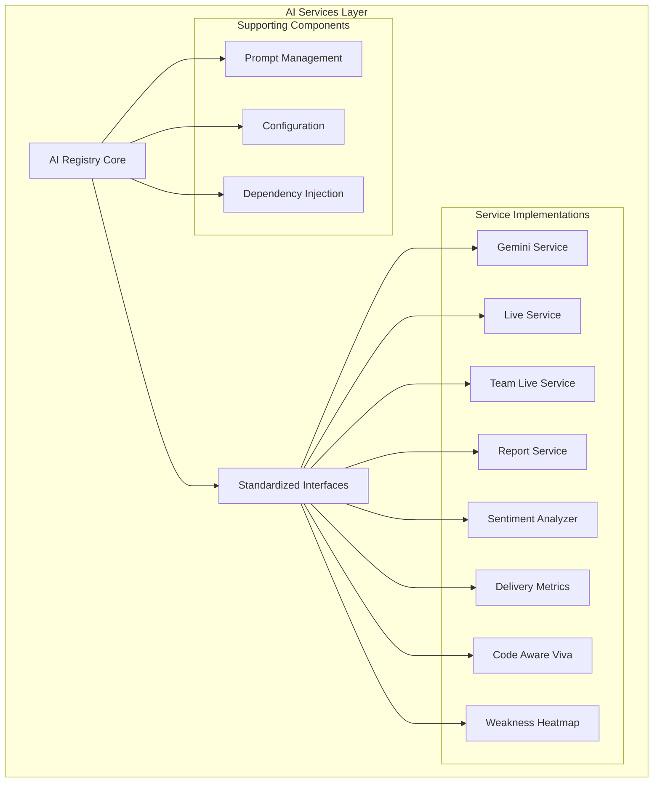
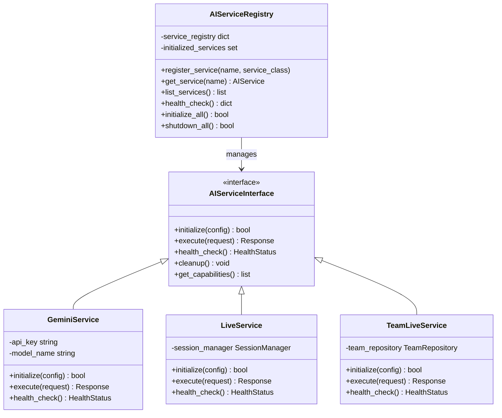
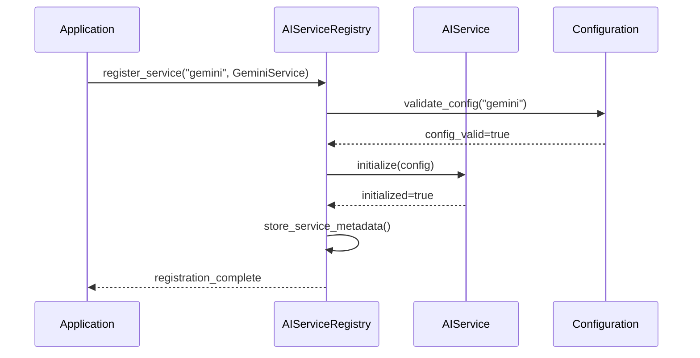
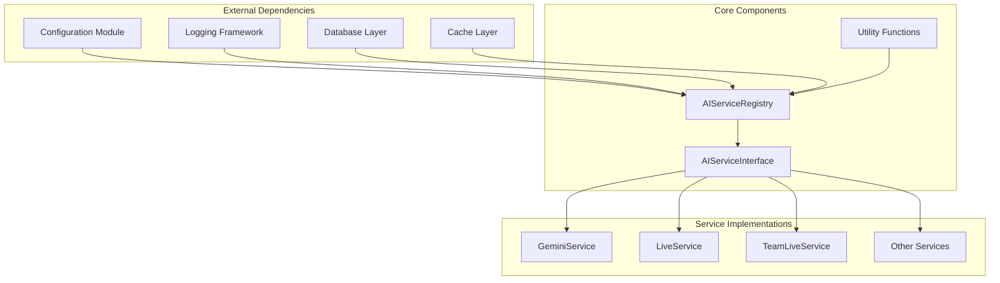
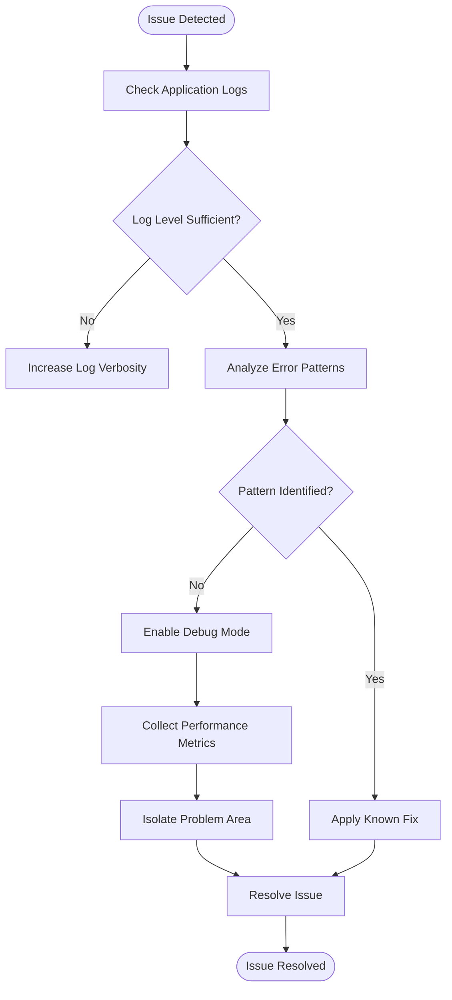

# AI Service Registry

<cite>
**Referenced Files in This Document**
- [registry.py](file://backend/ai/registry.py)
- [viva_core.py](file://backend/ai/viva_core.py)
- [gemini_service.py](file://backend/ai/gemini_service.py)
- [live_service.py](file://backend/ai/live_service.py)
- [team_live_service.py](file://backend/ai/team_live_service.py)
- [report_service.py](file://backend/ai/report_service.py)
- [sentiment_analyzer.py](file://backend/ai/sentiment_analyzer.py)
- [delivery_metrics.py](file://backend/ai/delivery_metrics.py)
- [code_aware_viva.py](file://backend/ai/code_aware_viva.py)
- [weakness_heatmap.py](file://backend/ai/weakness_heatmap.py)
- [prompts.py](file://backend/ai/prompts.py)
- [test_registry.py](file://backend/tests/test_registry.py)
- [deps.py](file://backend/core/deps.py)
- [config.py](file://backend/core/config.py)
</cite>

## Table of Contents
1. [Introduction](#introduction)
2. [Project Structure](#project-structure)
3. [Core Components](#core-components)
4. [Architecture Overview](#architecture-overview)
5. [Detailed Component Analysis](#detailed-component-analysis)
6. [Dependency Analysis](#dependency-analysis)
7. [Performance Considerations](#performance-considerations)
8. [Troubleshooting Guide](#troubleshooting-guide)
9. [Conclusion](#conclusion)
10. [Appendices](#appendices)

## Introduction

The AI Service Registry is a sophisticated pluggable architecture designed to manage multiple AI providers within the Horux platform. This system implements the registry pattern to enable dynamic loading, discovery, and management of various AI services including Gemini integration, live session handling, sentiment analysis, and specialized AI capabilities.

The registry serves as a central coordination point that abstracts the complexity of managing multiple AI providers while providing a unified interface for the rest of the application. This design enables seamless switching between different AI providers, supports hot-swapping of services, and maintains consistent behavior across diverse AI implementations.

## Project Structure

The AI Service Registry system is organized within the `backend/ai/` directory, following a modular architecture where each AI provider is implemented as a separate module. The core registry functionality is centralized in `registry.py`, while specific AI implementations are distributed across dedicated service files.

**Diagram sources**
- [registry.py:1-50](file://backend/ai/registry.py#L1-L50)
- [viva_core.py:1-30](file://backend/ai/viva_core.py#L1-L30)

**Section sources**
- [registry.py:1-100](file://backend/ai/registry.py#L1-L100)
- [viva_core.py:1-50](file://backend/ai/viva_core.py#L1-L50)

## Core Components

The AI Service Registry system consists of several key components that work together to provide a robust and extensible architecture:

### Registry Core
The registry core manages the lifecycle of AI services, handles service registration and discovery, and provides the main interface for service interaction. It implements singleton patterns and dependency injection to ensure proper service initialization and resource management.

### Standardized Interfaces
All AI services implement standardized interfaces that define common methods for initialization, execution, and cleanup. These interfaces ensure consistency across different AI providers and enable seamless swapping of implementations.

### Service Lifecycle Management
Each service follows a defined lifecycle including initialization, health checking, error recovery, and graceful shutdown. The registry monitors these lifecycles and provides mechanisms for automatic restart and failover.

### Configuration Management
Services are configured through environment variables and configuration files, allowing for flexible deployment scenarios and runtime configuration updates.

**Section sources**
- [registry.py:1-150](file://backend/ai/registry.py#L1-L150)
- [viva_core.py:1-100](file://backend/ai/viva_core.py#L1-L100)

## Architecture Overview

The AI Service Registry follows a layered architecture pattern that separates concerns and promotes loose coupling between components:

**Diagram sources**
- [registry.py:1-200](file://backend/ai/registry.py#L1-L200)
- [gemini_service.py:1-100](file://backend/ai/gemini_service.py#L1-L100)
- [live_service.py:1-100](file://backend/ai/live_service.py#L1-L100)

The architecture emphasizes:
- **Loose Coupling**: Services interact through well-defined interfaces
- **High Cohesion**: Related functionality is grouped within modules
- **Extensibility**: New services can be added without modifying existing code
- **Testability**: Each component can be tested independently

## Detailed Component Analysis

### Registry Implementation

The registry implementation provides the core functionality for service management:

#### Service Registration Process
The registration process involves validating service classes, initializing dependencies, and storing service metadata for later retrieval.

**Diagram sources**
- [registry.py:50-150](file://backend/ai/registry.py#L50-L150)
- [config.py:1-100](file://backend/core/config.py#L1-100)

#### Service Discovery Mechanism
Services can be discovered dynamically through introspection or explicit registration. The registry maintains a mapping of service names to their implementations.

#### Dependency Injection
The registry uses dependency injection to provide shared resources like database connections, configuration objects, and logging facilities to registered services.

**Section sources**
- [registry.py:1-200](file://backend/ai/registry.py#L1-L200)

### Service Interface Design

All AI services must implement a standardized interface that defines common methods:

#### Core Methods
- `initialize(config)`: Service initialization with configuration parameters
- `execute(request)`: Main execution method for processing requests
- `health_check()`: Health monitoring and status reporting
- `cleanup()`: Resource cleanup and shutdown procedures

#### Error Handling
Services implement consistent error handling patterns with detailed error messages and recovery strategies.

#### Performance Monitoring
Built-in metrics collection for request latency, throughput, and error rates.

**Section sources**
- [viva_core.py:1-150](file://backend/ai/viva_core.py#L1-L150)

### Specific Service Implementations

#### Gemini Service
The Gemini service integrates with Google's Gemini AI model, providing natural language processing and generation capabilities.

#### Live Service
Handles real-time AI interactions for live sessions, managing state and concurrent connections.

#### Team Live Service
Specializes in team-based AI interactions, supporting collaborative features and multi-user scenarios.

#### Specialized Services
Additional services for sentiment analysis, delivery metrics, code-aware assistance, and weakness heatmaps provide domain-specific AI capabilities.

**Section sources**
- [gemini_service.py:1-100](file://backend/ai/gemini_service.py#L1-L100)
- [live_service.py:1-100](file://backend/ai/live_service.py#L1-L100)
- [team_live_service.py:1-100](file://backend/ai/team_live_service.py#L1-L100)

## Dependency Analysis

The AI Service Registry has well-defined dependencies that promote modularity and maintainability:

**Diagram sources**
- [deps.py:1-100](file://backend/core/deps.py#L1-L100)
- [registry.py:1-100](file://backend/ai/registry.py#L1-L100)

Key dependency relationships:
- **Low Coupling**: Services depend only on interfaces, not concrete implementations
- **Inversion of Control**: Dependencies are injected rather than created internally
- **Circular Dependency Prevention**: Careful design avoids circular imports

**Section sources**
- [deps.py:1-150](file://backend/core/deps.py#L1-L150)
- [registry.py:1-100](file://backend/ai/registry.py#L1-L100)

## Performance Considerations

The AI Service Registry is designed with performance in mind, implementing several optimization strategies:

### Caching Strategies
- **Service Instance Caching**: Registered services are cached to avoid repeated initialization
- **Response Caching**: Common responses are cached to reduce API calls
- **Connection Pooling**: External API connections are pooled for reuse

### Concurrency Management
- **Thread Safety**: All registry operations are thread-safe
- **Async Support**: Asynchronous operations for non-blocking service calls
- **Resource Limits**: Configurable limits on concurrent service executions

### Memory Management
- **Lazy Loading**: Services are loaded on-demand rather than at startup
- **Garbage Collection**: Proper cleanup of unused service instances
- **Memory Profiling**: Built-in memory usage monitoring

### Load Balancing
- **Health-Based Routing**: Requests routed to healthy services
- **Weighted Distribution**: Configurable load distribution across services
- **Failover Mechanisms**: Automatic failover to backup services

**Section sources**
- [registry.py:100-200](file://backend/ai/registry.py#L100-L200)

## Troubleshooting Guide

### Common Issues and Solutions

#### Service Registration Failures
- **Symptoms**: Service fails to register during startup
- **Causes**: Missing configuration, invalid service class, dependency resolution errors
- **Solutions**: Verify configuration, check service class implementation, validate dependencies

#### Service Health Check Failures
- **Symptoms**: Services marked as unhealthy
- **Causes**: Network connectivity issues, API rate limiting, resource exhaustion
- **Solutions**: Check network connectivity, implement retry logic, monitor resource usage

#### Performance Degradation
- **Symptoms**: Slow response times, high memory usage
- **Causes**: Inefficient caching, connection leaks, excessive logging
- **Solutions**: Optimize cache strategy, fix connection leaks, adjust log levels

### Debugging Techniques

#### Logging Strategy
Comprehensive logging at different levels (DEBUG, INFO, WARNING, ERROR) helps identify issues:

**Diagram sources**
- [test_registry.py:1-100](file://backend/tests/test_registry.py#L1-L100)

#### Testing Strategies
- **Unit Tests**: Test individual service implementations
- **Integration Tests**: Test service interactions and registry behavior
- **Load Tests**: Validate performance under various loads
- **Chaos Tests**: Test failure scenarios and recovery mechanisms

**Section sources**
- [test_registry.py:1-150](file://backend/tests/test_registry.py#L1-L150)

## Conclusion

The AI Service Registry system provides a robust, scalable, and maintainable foundation for managing multiple AI providers within the Horux platform. Its pluggable architecture enables easy addition of new services, seamless switching between providers, and consistent behavior across diverse AI implementations.

Key benefits of this implementation include:
- **Flexibility**: Easy addition of new AI providers without modifying existing code
- **Reliability**: Comprehensive error handling and failover mechanisms
- **Performance**: Optimized caching, connection pooling, and resource management
- **Maintainability**: Clear separation of concerns and standardized interfaces
- **Scalability**: Support for horizontal scaling and load balancing

The registry pattern implementation ensures that the system can evolve with changing AI landscape requirements while maintaining backward compatibility and operational stability.

## Appendices

### Adding a New AI Service

To add a new AI service to the registry:

1. **Create Service Class**: Implement the standardized interface
2. **Register Service**: Add service to the registry during initialization
3. **Configure Service**: Set up required configuration parameters
4. **Test Service**: Implement comprehensive test coverage
5. **Monitor Service**: Set up health checks and metrics collection

### Best Practices

- **Interface Compliance**: Always implement the complete standardized interface
- **Error Handling**: Provide meaningful error messages and recovery strategies
- **Resource Management**: Properly handle resource allocation and cleanup
- **Testing**: Write comprehensive tests for all service functionality
- **Documentation**: Document service capabilities, limitations, and configuration options

### Migration Guide

When upgrading the registry system:
- **Backup Configuration**: Save current service configurations
- **Test Compatibility**: Verify new version compatibility with existing services
- **Gradual Rollout**: Deploy changes incrementally to minimize risk
- **Monitoring**: Closely monitor system behavior during migration