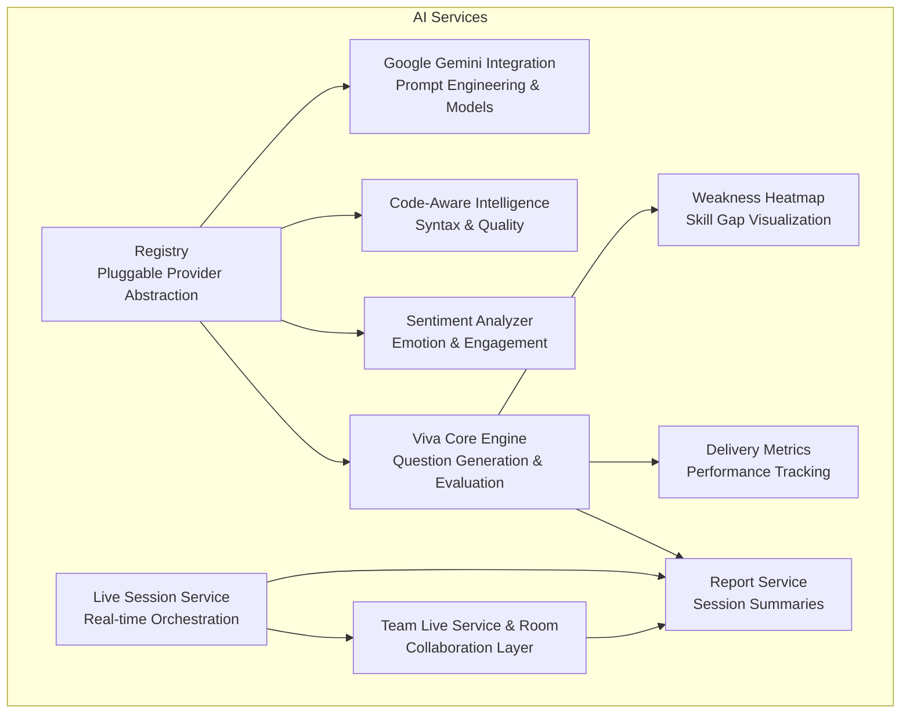
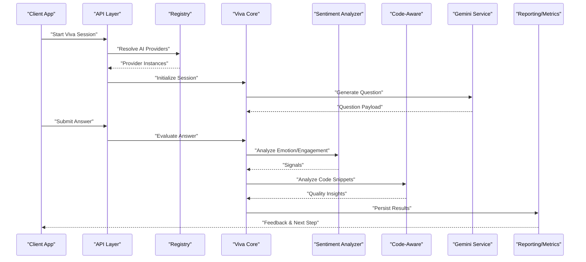
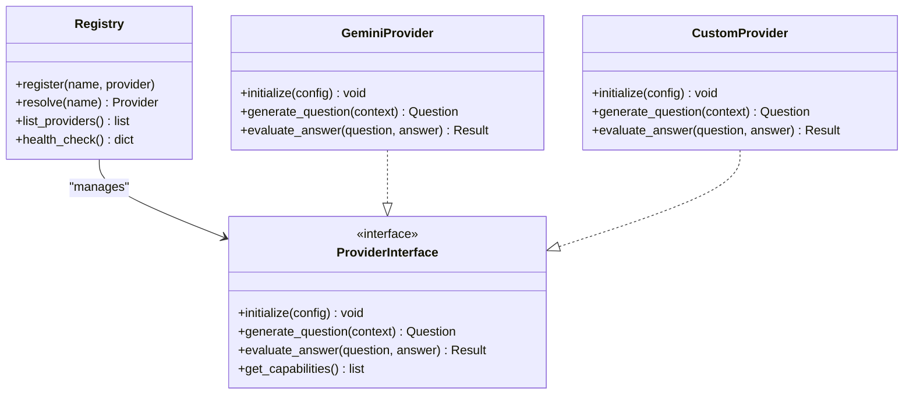
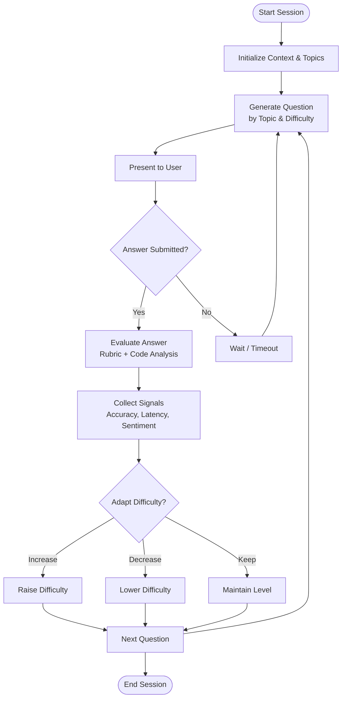
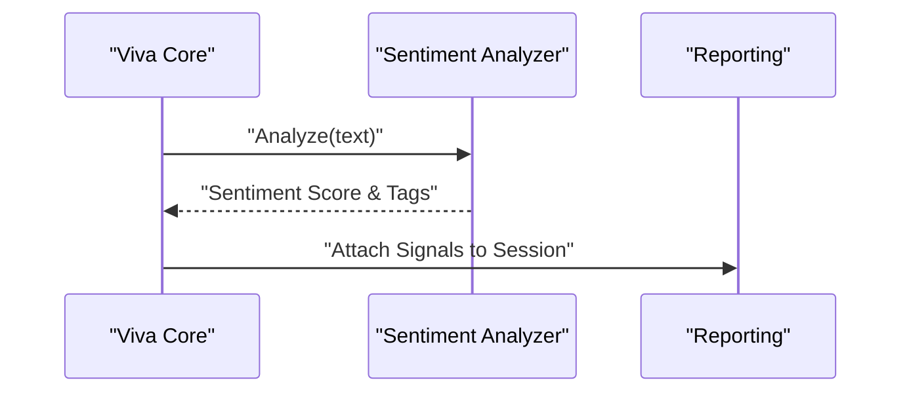
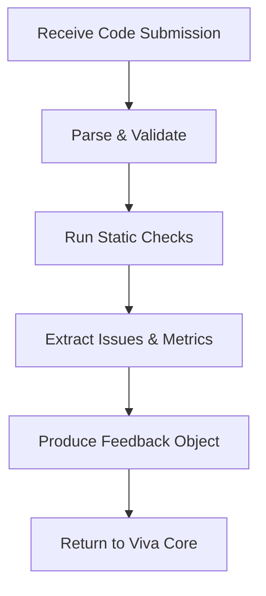
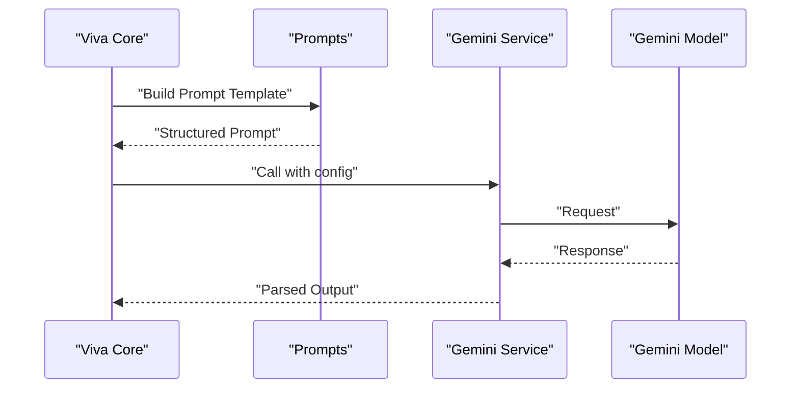
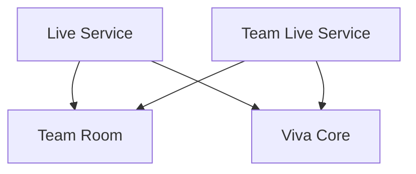
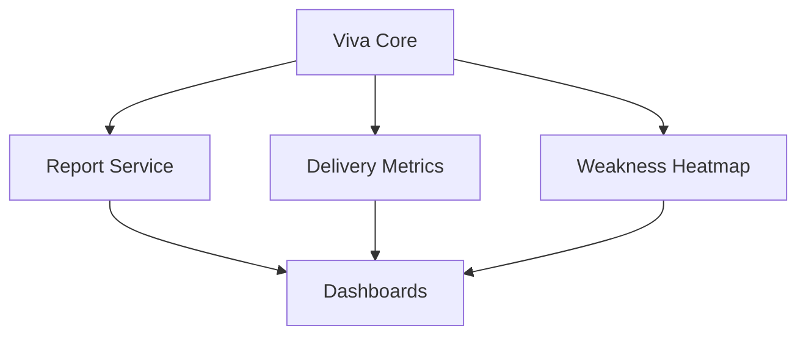
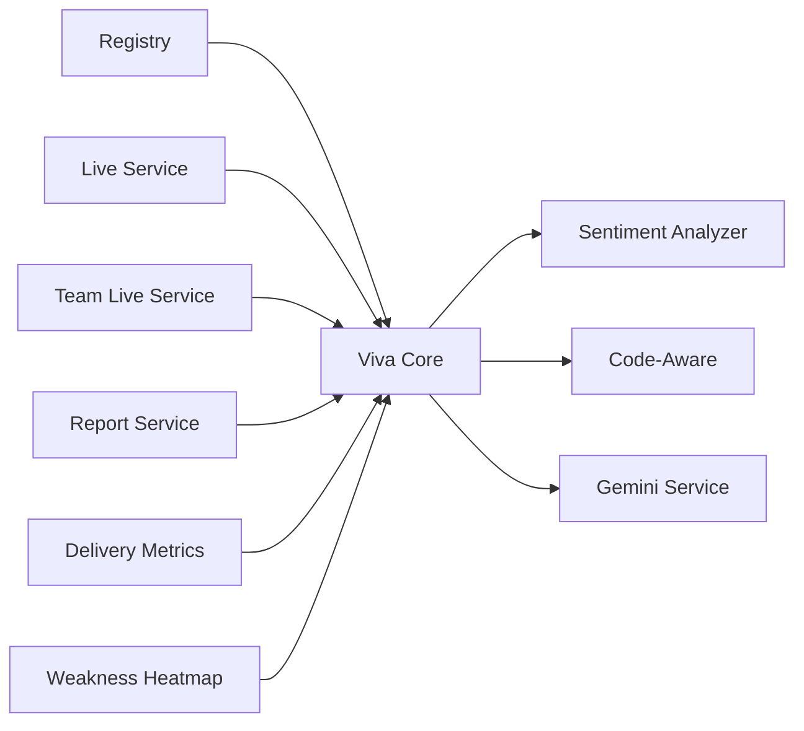

# AI Services

<cite>
**Referenced Files in This Document**
- [registry.py](file://backend/ai/registry.py)
- [viva_core.py](file://backend/ai/viva_core.py)
- [sentiment_analyzer.py](file://backend/ai/sentiment_analyzer.py)
- [code_aware_viva.py](file://backend/ai/code_aware_viva.py)
- [gemini_service.py](file://backend/ai/gemini_service.py)
- [prompts.py](file://backend/ai/prompts.py)
- [live_service.py](file://backend/ai/live_service.py)
- [team_live_service.py](file://backend/ai/team_live_service.py)
- [team_room.py](file://backend/ai/team_room.py)
- [report_service.py](file://backend/ai/report_service.py)
- [delivery_metrics.py](file://backend/ai/delivery_metrics.py)
- [weakness_heatmap.py](file://backend/ai/weakness_heatmap.py)
</cite>

## Table of Contents
1. [Introduction](#introduction)
2. [Project Structure](#project-structure)
3. [Core Components](#core-components)
4. [Architecture Overview](#architecture-overview)
5. [Detailed Component Analysis](#detailed-component-analysis)
6. [Dependency Analysis](#dependency-analysis)
7. [Performance Considerations](#performance-considerations)
8. [Troubleshooting Guide](#troubleshooting-guide)
9. [Conclusion](#conclusion)
10. [Appendices](#appendices)

## Introduction
This document explains the Horux AI services architecture built around a pluggable registry pattern. It covers the AI service registry that enables multiple providers through standardized interfaces, the Viva Core examination engine (question generation, answer evaluation, adaptive difficulty), sentiment analysis for emotional intelligence and engagement tracking, code-aware intelligence for syntax analysis and quality assessment, Google Gemini integration and prompt engineering strategies, model selection criteria, guidelines for adding new AI services, testing approaches, and optimization techniques for response times.

## Project Structure
The AI subsystem is implemented under backend/ai and includes:
- Registry and provider abstraction for pluggable AI services
- Viva Core engine for exam-style interactions and adaptive difficulty
- Sentiment analyzer for emotion and engagement signals
- Code-aware module for syntax and quality insights
- Google Gemini integration and prompt templates
- Live session orchestration and team collaboration features
- Reporting, metrics, and weakness heatmap utilities

[No sources needed since this diagram shows conceptual workflow, not actual code structure]

## Core Components
- Pluggable Registry: Central registry that discovers and instantiates AI providers via a common interface, enabling hot-swapping and multi-provider routing.
- Viva Core: Examination engine orchestrating question generation, answer evaluation, and adaptive difficulty adjustments.
- Sentiment Analyzer: Processes textual or conversational inputs to infer emotional states and engagement levels.
- Code-Aware Intelligence: Analyzes code snippets for syntax correctness, style, and quality; provides language-specific feedback.
- Google Gemini Integration: Configurable client for Gemini models with prompt templates and selection heuristics.
- Live and Team Services: Real-time session management and collaborative room orchestration.
- Reporting and Analytics: Aggregates session data into reports, delivery metrics, and weakness heatmaps.

**Section sources**
- [registry.py](file://backend/ai/registry.py)
- [viva_core.py](file://backend/ai/viva_core.py)
- [sentiment_analyzer.py](file://backend/ai/sentiment_analyzer.py)
- [code_aware_viva.py](file://backend/ai/code_aware_viva.py)
- [gemini_service.py](file://backend/ai/gemini_service.py)
- [live_service.py](file://backend/ai/live_service.py)
- [team_live_service.py](file://backend/ai/team_live_service.py)
- [team_room.py](file://backend/ai/team_room.py)
- [report_service.py](file://backend/ai/report_service.py)
- [delivery_metrics.py](file://backend/ai/delivery_metrics.py)
- [weakness_heatmap.py](file://backend/ai/weakness_heatmap.py)

## Architecture Overview
The system follows a layered architecture:
- API layer exposes endpoints that delegate to AI services.
- AI services use a registry to resolve provider implementations.
- Viva Core coordinates sessions, questions, evaluations, and adaptation.
- Sentiment and code-aware modules provide specialized analyses.
- Gemini integration supplies LLM capabilities with prompt templates.
- Live and team services manage real-time collaboration and persistence.
- Reporting and analytics aggregate outcomes for dashboards and insights.

**Diagram sources**
- [registry.py](file://backend/ai/registry.py)
- [viva_core.py](file://backend/ai/viva_core.py)
- [sentiment_analyzer.py](file://backend/ai/sentiment_analyzer.py)
- [code_aware_viva.py](file://backend/ai/code_aware_viva.py)
- [gemini_service.py](file://backend/ai/gemini_service.py)
- [report_service.py](file://backend/ai/report_service.py)
- [delivery_metrics.py](file://backend/ai/delivery_metrics.py)

## Detailed Component Analysis

### Pluggable Registry Pattern
Purpose:
- Provide a single entry point to discover and instantiate AI providers.
- Enforce a standardized interface across providers.
- Support runtime selection and fallback strategies.

Key responsibilities:
- Registration of provider classes or factories.
- Resolution by capability tags or names.
- Lifecycle management (init, request, teardown).
- Error propagation and health checks.

**Diagram sources**
- [registry.py](file://backend/ai/registry.py)
- [gemini_service.py](file://backend/ai/gemini_service.py)

Guidelines for adding a new provider:
- Implement the provider interface methods for initialization, question generation, and answer evaluation.
- Register the provider with the registry using a unique name and capability tags.
- Ensure configuration is validated at initialization time.
- Add unit tests covering happy path, error paths, and fallback behavior.

**Section sources**
- [registry.py](file://backend/ai/registry.py)

### Viva Core Examination Engine
Responsibilities:
- Manage session state and lifecycle.
- Generate questions aligned to topics and difficulty.
- Evaluate answers against rubrics and reference material.
- Adjust difficulty adaptively based on performance and confidence signals.

Adaptive difficulty logic:
- Track per-topic accuracy and latency.
- Increase difficulty when accuracy exceeds threshold and response time is within bounds.
- Decrease difficulty when accuracy drops below threshold or errors cluster.
- Incorporate sentiment and engagement signals to modulate pacing.

**Diagram sources**
- [viva_core.py](file://backend/ai/viva_core.py)
- [sentiment_analyzer.py](file://backend/ai/sentiment_analyzer.py)
- [code_aware_viva.py](file://backend/ai/code_aware_viva.py)

Evaluation considerations:
- Normalize free-form answers and code submissions.
- Use structured rubrics for scoring dimensions (correctness, completeness, clarity).
- Integrate code-aware insights for syntax and style penalties/bonuses.
- Persist intermediate results for reporting and re-evaluation.

**Section sources**
- [viva_core.py](file://backend/ai/viva_core.py)

### Sentiment Analysis for Emotional Intelligence
Capabilities:
- Detect sentiment polarity and intensity from user responses.
- Infer engagement indicators (e.g., hesitation, enthusiasm).
- Feed signals back to Viva Core for pacing and tone adjustments.

Integration points:
- Called during answer evaluation to enrich scoring with affective signals.
- Used in live sessions to adjust prompts and support tone.

**Diagram sources**
- [sentiment_analyzer.py](file://backend/ai/sentiment_analyzer.py)
- [viva_core.py](file://backend/ai/viva_core.py)
- [report_service.py](file://backend/ai/report_service.py)

**Section sources**
- [sentiment_analyzer.py](file://backend/ai/sentiment_analyzer.py)

### Code-Aware Intelligence
Scope:
- Syntax validation and error localization.
- Style and complexity assessments.
- Language-specific feature detection and suggestions.

Workflow:
- Parse submitted code into AST where possible.
- Run linters/formatters and static analyzers.
- Produce structured feedback for Viva Core evaluation and reporting.

**Diagram sources**
- [code_aware_viva.py](file://backend/ai/code_aware_viva.py)

**Section sources**
- [code_aware_viva.py](file://backend/ai/code_aware_viva.py)

### Google Gemini Integration
Features:
- Configurable client with model selection and parameters.
- Prompt templates for consistent outputs.
- Retry and timeout handling.
- Structured output parsing for Viva Core consumption.

Model selection criteria:
- Capability match (text vs. multimodal).
- Latency and cost constraints.
- Accuracy benchmarks per task type.
- Fallback chain if primary model fails.

**Diagram sources**
- [gemini_service.py](file://backend/ai/gemini_service.py)
- [prompts.py](file://backend/ai/prompts.py)
- [viva_core.py](file://backend/ai/viva_core.py)

**Section sources**
- [gemini_service.py](file://backend/ai/gemini_service.py)
- [prompts.py](file://backend/ai/prompts.py)

### Live and Team Collaboration
Components:
- Live session service manages real-time flows and state synchronization.
- Team live service coordinates multi-user sessions and shared artifacts.
- Team room encapsulates room lifecycle, presence, and messaging.

**Diagram sources**
- [live_service.py](file://backend/ai/live_service.py)
- [team_live_service.py](file://backend/ai/team_live_service.py)
- [team_room.py](file://backend/ai/team_room.py)
- [viva_core.py](file://backend/ai/viva_core.py)

**Section sources**
- [live_service.py](file://backend/ai/live_service.py)
- [team_live_service.py](file://backend/ai/team_live_service.py)
- [team_room.py](file://backend/ai/team_room.py)

### Reporting, Metrics, and Weakness Heatmap
- Report service aggregates session events, scores, and signals into summaries.
- Delivery metrics track throughput, latency, and success rates across providers.
- Weakness heatmap visualizes topic-level gaps derived from evaluation history.

**Diagram sources**
- [report_service.py](file://backend/ai/report_service.py)
- [delivery_metrics.py](file://backend/ai/delivery_metrics.py)
- [weakness_heatmap.py](file://backend/ai/weakness_heatmap.py)
- [viva_core.py](file://backend/ai/viva_core.py)

**Section sources**
- [report_service.py](file://backend/ai/report_service.py)
- [delivery_metrics.py](file://backend/ai/delivery_metrics.py)
- [weakness_heatmap.py](file://backend/ai/weakness_heatmap.py)

## Dependency Analysis
High-level dependencies:
- Viva Core depends on registry-resolved providers, sentiment analyzer, and code-aware module.
- Gemini service is used by Viva Core for content generation and evaluation.
- Live and team services depend on Viva Core for session orchestration.
- Reporting and metrics depend on Viva Core outputs.

**Diagram sources**
- [registry.py](file://backend/ai/registry.py)
- [viva_core.py](file://backend/ai/viva_core.py)
- [sentiment_analyzer.py](file://backend/ai/sentiment_analyzer.py)
- [code_aware_viva.py](file://backend/ai/code_aware_viva.py)
- [gemini_service.py](file://backend/ai/gemini_service.py)
- [live_service.py](file://backend/ai/live_service.py)
- [team_live_service.py](file://backend/ai/team_live_service.py)
- [report_service.py](file://backend/ai/report_service.py)
- [delivery_metrics.py](file://backend/ai/delivery_metrics.py)
- [weakness_heatmap.py](file://backend/ai/weakness_heatmap.py)

**Section sources**
- [registry.py](file://backend/ai/registry.py)
- [viva_core.py](file://backend/ai/viva_core.py)
- [sentiment_analyzer.py](file://backend/ai/sentiment_analyzer.py)
- [code_aware_viva.py](file://backend/ai/code_aware_viva.py)
- [gemini_service.py](file://backend/ai/gemini_service.py)
- [live_service.py](file://backend/ai/live_service.py)
- [team_live_service.py](file://backend/ai/team_live_service.py)
- [report_service.py](file://backend/ai/report_service.py)
- [delivery_metrics.py](file://backend/ai/delivery_metrics.py)
- [weakness_heatmap.py](file://backend/ai/weakness_heatmap.py)

## Performance Considerations
- Cache frequent prompts and reusable artifacts to reduce LLM calls.
- Batch requests where safe and supported by providers.
- Implement timeouts and circuit breakers for external model calls.
- Prefer streaming responses for long-running generations.
- Tune adaptive difficulty thresholds to avoid oscillation.
- Profile provider latency and route high-value tasks to faster models.
- Defer heavy computations (e.g., full AST analysis) to background jobs when appropriate.

[No sources needed since this section provides general guidance]

## Troubleshooting Guide
Common issues and resolutions:
- Provider resolution failures: verify registration keys and capability tags; check health checks.
- Gemini call errors: validate configuration, retry with backoff, and switch to fallback model.
- Adaptive difficulty instability: review thresholds and smoothing windows; incorporate more robust signal aggregation.
- Code analysis regressions: ensure parser updates align with language versions; add regression tests for edge cases.
- Live session desynchronization: reconcile state diffs and enforce idempotent operations.

Operational tips:
- Log provider round-trip timings and error codes.
- Capture prompts and responses for auditability and debugging.
- Maintain versioned prompt templates and test suites.

**Section sources**
- [registry.py](file://backend/ai/registry.py)
- [gemini_service.py](file://backend/ai/gemini_service.py)
- [viva_core.py](file://backend/ai/viva_core.py)
- [code_aware_viva.py](file://backend/ai/code_aware_viva.py)

## Conclusion
Horux’s AI services leverage a pluggable registry to unify multiple providers behind a consistent interface. Viva Core orchestrates adaptive examinations enriched by sentiment and code-aware insights. The Gemini integration offers flexible model selection and prompt engineering. Live and team services enable real-time collaboration, while reporting and analytics close the loop with actionable insights. Following the guidelines here will help you extend the system safely, test effectively, and optimize performance.

## Appendices

### Adding a New AI Service
Steps:
- Define a provider implementing the standard interface (initialization, question generation, answer evaluation).
- Register it with the registry using a unique name and capability tags.
- Configure environment variables and secrets securely.
- Add unit and integration tests covering normal and failure scenarios.
- Update documentation and prompt templates if applicable.

**Section sources**
- [registry.py](file://backend/ai/registry.py)
- [gemini_service.py](file://backend/ai/gemini_service.py)
- [prompts.py](file://backend/ai/prompts.py)

### Testing AI Functionality
Approach:
- Unit tests for provider contracts and registry resolution.
- Mock external LLMs for deterministic evaluation.
- Scenario-based tests for Viva Core flows including adaptation.
- Load tests for live sessions and provider throughput.
- Regression tests for code-aware analysis across languages.

**Section sources**
- [registry.py](file://backend/ai/registry.py)
- [viva_core.py](file://backend/ai/viva_core.py)
- [code_aware_viva.py](file://backend/ai/code_aware_viva.py)
- [gemini_service.py](file://backend/ai/gemini_service.py)

### Optimizing AI Response Times
Recommendations:
- Use smaller or faster models for simple tasks; reserve larger models for complex reasoning.
- Pre-warm prompts and cache repeated queries.
- Stream partial outputs to improve perceived latency.
- Implement retries with exponential backoff and circuit breakers.
- Monitor provider SLAs and auto-route based on latency and error rates.

**Section sources**
- [gemini_service.py](file://backend/ai/gemini_service.py)
- [delivery_metrics.py](file://backend/ai/delivery_metrics.py)