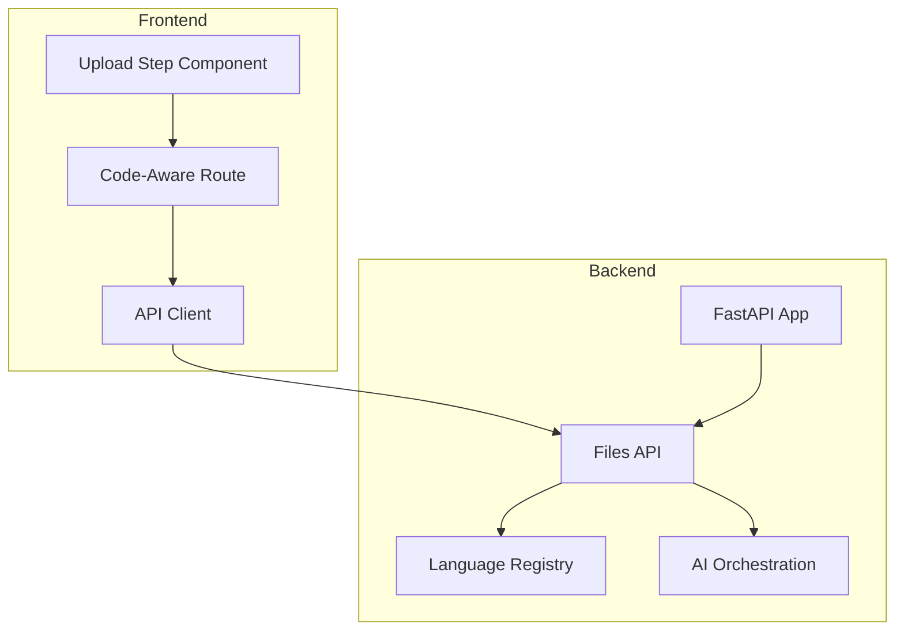
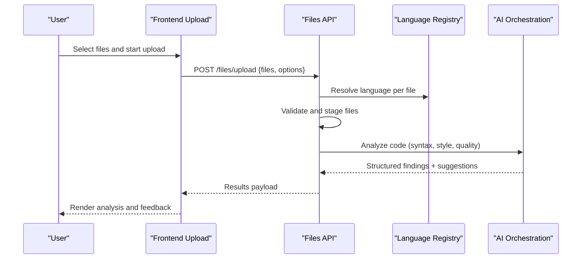
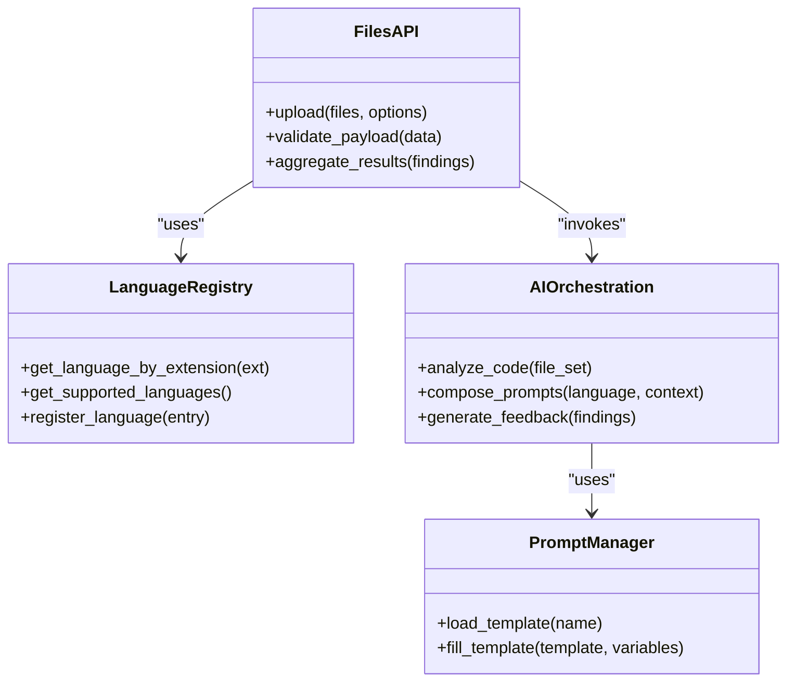
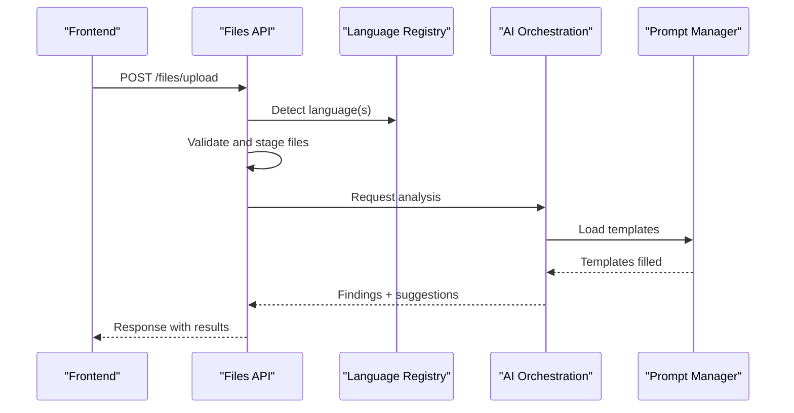
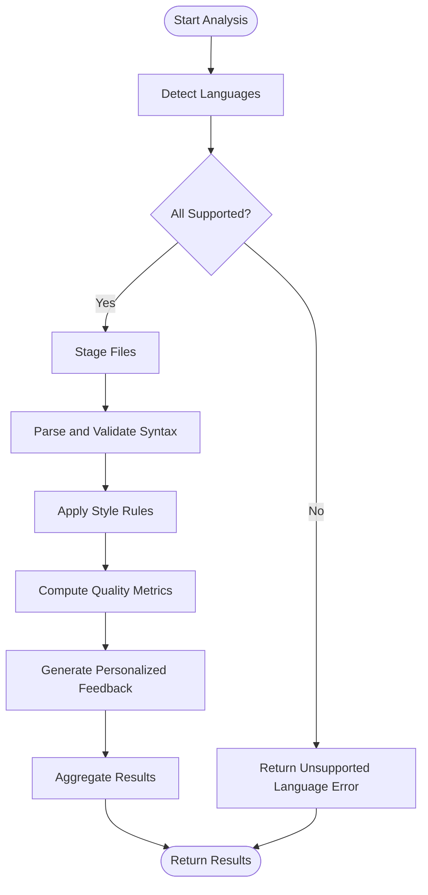
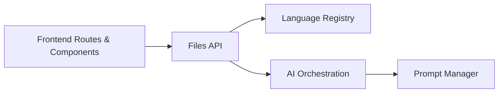

# Code-Aware Intelligence

<cite>
**Referenced Files in This Document**
- [backend/ai/code_aware_viva.py](file://backend/ai/code_aware_viva.py)
- [backend/ai/viva_core.py](file://backend/ai/viva_core.py)
- [backend/ai/prompts.py](file://backend/ai/prompts.py)
- [backend/api/files.py](file://backend/api/files.py)
- [backend/core/languages.py](file://backend/core/languages.py)
- [src/components/code-aware/upload-step.tsx](file://src/components/code-aware/upload-step.tsx)
- [src/routes/advanced/viva-code-aware.tsx](file://src/routes/advanced/viva-code-aware.tsx)
- [src/lib/api.ts](file://src/lib/api.ts)
- [backend/main.py](file://backend/main.py)
</cite>

## Table of Contents
1. [Introduction](#introduction)
2. [Project Structure](#project-structure)
3. [Core Components](#core-components)
4. [Architecture Overview](#architecture-overview)
5. [Detailed Component Analysis](#detailed-component-analysis)
6. [Dependency Analysis](#dependency-analysis)
7. [Performance Considerations](#performance-considerations)
8. [Security Considerations](#security-considerations)
9. [Troubleshooting Guide](#troubleshooting-guide)
10. [Conclusion](#conclusion)
11. [Appendices](#appendices)

## Introduction
This document describes the code-aware intelligence system that provides syntax analysis, code quality assessment, and language-specific programming education features. It explains how code is uploaded from the frontend, parsed and analyzed on the backend, and how results are presented to users with actionable feedback. The system supports multiple programming languages, validates syntax, checks code style, and integrates with AI services to generate personalized coding guidance.

## Project Structure
The system spans a Python backend and a TypeScript/React frontend:
- Backend: FastAPI-based API endpoints for file upload and analysis, core language registry, and AI orchestration for code-aware insights.
- Frontend: React components and routes for uploading code, initiating sessions, and displaying analysis results.

**Diagram sources**
- [backend/main.py](file://backend/main.py)
- [backend/api/files.py](file://backend/api/files.py)
- [backend/core/languages.py](file://backend/core/languages.py)
- [backend/ai/code_aware_viva.py](file://backend/ai/code_aware_viva.py)
- [src/components/code-aware/upload-step.tsx](file://src/components/code-aware/upload-step.tsx)
- [src/routes/advanced/viva-code-aware.tsx](file://src/routes/advanced/viva-code-aware.tsx)
- [src/lib/api.ts](file://src/lib/api.ts)

**Section sources**
- [backend/main.py](file://backend/main.py)
- [backend/api/files.py](file://backend/api/files.py)
- [backend/core/languages.py](file://backend/core/languages.py)
- [backend/ai/code_aware_viva.py](file://backend/ai/code_aware_viva.py)
- [src/components/code-aware/upload-step.tsx](file://src/components/code-aware/upload-step.tsx)
- [src/routes/advanced/viva-code-aware.tsx](file://src/routes/advanced/viva-code-aware.tsx)
- [src/lib/api.ts](file://src/lib/api.ts)

## Core Components
- Language Registry: Centralizes supported languages and their metadata (e.g., extensions, parsers).
- Files API: Accepts uploads, validates inputs, dispatches analysis tasks, and returns structured results.
- AI Orchestration: Coordinates parsing, static analysis, and AI-driven feedback generation.
- Frontend Upload Flow: Provides UI for selecting files, sending them to the backend, and rendering analysis outcomes.

Key responsibilities:
- Multi-language support via a registry abstraction.
- Syntax validation and style checking through analyzers.
- Personalized feedback using prompts and AI services.
- Real-time review integration via session-aware flows.

**Section sources**
- [backend/core/languages.py](file://backend/core/languages.py)
- [backend/api/files.py](file://backend/api/files.py)
- [backend/ai/code_aware_viva.py](file://backend/ai/code_aware_viva.py)
- [backend/ai/prompts.py](file://backend/ai/prompts.py)
- [src/components/code-aware/upload-step.tsx](file://src/components/code-aware/upload-step.tsx)
- [src/routes/advanced/viva-code-aware.tsx](file://src/routes/advanced/viva-code-aware.tsx)
- [src/lib/api.ts](file://src/lib/api.ts)

## Architecture Overview
The architecture follows a layered approach:
- Presentation Layer: React components and routes handle user interactions and display results.
- API Layer: FastAPI endpoints manage requests, validate payloads, and coordinate processing.
- Domain Layer: Language registry and analyzers encapsulate parsing and analysis logic.
- AI Layer: Orchestrates prompt composition and model calls to produce educational feedback.

**Diagram sources**
- [backend/api/files.py](file://backend/api/files.py)
- [backend/core/languages.py](file://backend/core/languages.py)
- [backend/ai/code_aware_viva.py](file://backend/ai/code_aware_viva.py)
- [src/components/code-aware/upload-step.tsx](file://src/components/code-aware/upload-step.tsx)
- [src/lib/api.ts](file://src/lib/api.ts)

## Detailed Component Analysis

### Language Registry
Purpose:
- Maintain a mapping of supported languages to their metadata and analyzer configuration.
- Provide lookup by extension or language name.
- Support extensibility for new languages.

Design considerations:
- Centralized registry reduces duplication and ensures consistent behavior across endpoints.
- Clear separation between language detection and analysis logic.

Extensibility:
- Add a new language entry with parser settings and style rules.
- Register analyzer plugins if needed.

**Section sources**
- [backend/core/languages.py](file://backend/core/languages.py)

### Files API
Responsibilities:
- Accept multipart/form-data or JSON payloads containing code files.
- Validate file types against the language registry.
- Stage files for analysis and return progress/status when applicable.
- Aggregate analysis results and format responses for the frontend.

Error handling:
- Reject unsupported languages.
- Return detailed errors for malformed payloads.
- Handle large file constraints gracefully.

Integration points:
- Calls language registry for detection.
- Invokes AI orchestration for analysis.

**Section sources**
- [backend/api/files.py](file://backend/api/files.py)

### AI Orchestration (Code-Aware Viva)
Responsibilities:
- Coordinate multi-step analysis: syntax validation, style checks, and quality metrics.
- Compose prompts tailored to the detected language and context.
- Generate personalized feedback and learning recommendations.

Prompt management:
- Uses dedicated prompt definitions to ensure consistent tone and structure.
- Supports dynamic insertion of language-specific examples and guidelines.

Session awareness:
- Integrates with viva session concepts to provide continuity in real-time reviews.

**Section sources**
- [backend/ai/code_aware_viva.py](file://backend/ai/code_aware_viva.py)
- [backend/ai/prompts.py](file://backend/ai/prompts.py)
- [backend/ai/viva_core.py](file://backend/ai/viva_core.py)

### Frontend Upload Flow
Components:
- Upload step component: Presents file selection, shows progress, and triggers upload.
- Code-aware route: Manages state for analysis sessions and renders results.
- API client: Encapsulates HTTP calls to backend endpoints.

Real-time review:
- Subscribes to updates during long-running analyses.
- Displays incremental feedback and highlights issues.

**Section sources**
- [src/components/code-aware/upload-step.tsx](file://src/components/code-aware/upload-step.tsx)
- [src/routes/advanced/viva-code-aware.tsx](file://src/routes/advanced/viva-code-aware.tsx)
- [src/lib/api.ts](file://src/lib/api.ts)

### Class Diagram: Core Entities

**Diagram sources**
- [backend/core/languages.py](file://backend/core/languages.py)
- [backend/api/files.py](file://backend/api/files.py)
- [backend/ai/code_aware_viva.py](file://backend/ai/code_aware_viva.py)
- [backend/ai/prompts.py](file://backend/ai/prompts.py)

### Sequence Diagram: Upload and Analysis

**Diagram sources**
- [backend/api/files.py](file://backend/api/files.py)
- [backend/core/languages.py](file://backend/core/languages.py)
- [backend/ai/code_aware_viva.py](file://backend/ai/code_aware_viva.py)
- [backend/ai/prompts.py](file://backend/ai/prompts.py)

### Flowchart: Analysis Pipeline

**Diagram sources**
- [backend/api/files.py](file://backend/api/files.py)
- [backend/core/languages.py](file://backend/core/languages.py)
- [backend/ai/code_aware_viva.py](file://backend/ai/code_aware_viva.py)

## Dependency Analysis
High-level dependencies:
- Files API depends on Language Registry for detection and on AI Orchestration for analysis.
- AI Orchestration depends on Prompt Manager for template composition.
- Frontend depends on API client and routes to orchestrate user workflows.

**Diagram sources**
- [backend/api/files.py](file://backend/api/files.py)
- [backend/core/languages.py](file://backend/core/languages.py)
- [backend/ai/code_aware_viva.py](file://backend/ai/code_aware_viva.py)
- [backend/ai/prompts.py](file://backend/ai/prompts.py)
- [src/routes/advanced/viva-code-aware.tsx](file://src/routes/advanced/viva-code-aware.tsx)
- [src/components/code-aware/upload-step.tsx](file://src/components/code-aware/upload-step.tsx)
- [src/lib/api.ts](file://src/lib/api.ts)

**Section sources**
- [backend/api/files.py](file://backend/api/files.py)
- [backend/core/languages.py](file://backend/core/languages.py)
- [backend/ai/code_aware_viva.py](file://backend/ai/code_aware_viva.py)
- [backend/ai/prompts.py](file://backend/ai/prompts.py)
- [src/routes/advanced/viva-code-aware.tsx](file://src/routes/advanced/viva-code-aware.tsx)
- [src/components/code-aware/upload-step.tsx](file://src/components/code-aware/upload-step.tsx)
- [src/lib/api.ts](file://src/lib/api.ts)

## Performance Considerations
- Batch processing: Group files by language to minimize repeated setup costs.
- Streaming responses: For large codebases, stream partial results to improve perceived latency.
- Caching: Cache language metadata and common style rule configurations.
- Concurrency: Use background workers for heavy analysis tasks; expose status endpoints for progress polling.
- Resource limits: Enforce maximum file sizes and total payload size to prevent overload.

[No sources needed since this section provides general guidance]

## Security Considerations
- Input validation: Strictly validate file types and sizes before processing.
- Sandboxed execution: If executing code snippets, isolate environments and limit permissions.
- Prompt sanitization: Prevent injection by escaping or validating dynamic content inserted into prompts.
- Rate limiting: Protect endpoints from abuse and resource exhaustion.
- Secrets management: Ensure no sensitive data is logged or persisted unintentionally.

[No sources needed since this section provides general guidance]

## Troubleshooting Guide
Common issues and resolutions:
- Unsupported language error: Verify language registry includes the target language and correct extensions.
- Malformed payload: Check request schema and required fields in the upload endpoint.
- Long-running analysis: Implement progress polling and timeout handling on the frontend.
- Inconsistent feedback: Review prompt templates and ensure variables are correctly populated.

Operational tips:
- Enable detailed logging around language detection and analysis steps.
- Add health checks for external AI services to fail fast and retry gracefully.

**Section sources**
- [backend/api/files.py](file://backend/api/files.py)
- [backend/core/languages.py](file://backend/core/languages.py)
- [backend/ai/prompts.py](file://backend/ai/prompts.py)

## Conclusion
The code-aware intelligence system combines robust language support, reliable analysis pipelines, and AI-driven feedback to deliver an effective platform for code quality and education. Its modular design facilitates extensibility for new languages and integrations, while clear separation of concerns aids maintainability and performance optimization.

[No sources needed since this section summarizes without analyzing specific files]

## Appendices

### Example Workflows

- Code Upload Workflow
  - User selects files in the frontend.
  - Frontend sends upload request to the backend.
  - Backend detects languages, validates, stages files, and triggers analysis.
  - Results are returned and rendered with actionable insights.

- Analysis Result Interpretation
  - Syntax errors are highlighted with location and suggested fixes.
  - Style violations include references to language-specific conventions.
  - Quality metrics summarize complexity, duplication, and readability indicators.

- Personalized Coding Feedback
  - Feedback is tailored to the detected language and project context.
  - Learning resources and examples are included where appropriate.

- Integration with Frontend
  - Upload component manages file selection and progress.
  - Route orchestrates session state and displays results.
  - API client abstracts HTTP calls and error handling.

**Section sources**
- [src/components/code-aware/upload-step.tsx](file://src/components/code-aware/upload-step.tsx)
- [src/routes/advanced/viva-code-aware.tsx](file://src/routes/advanced/viva-code-aware.tsx)
- [src/lib/api.ts](file://src/lib/api.ts)
- [backend/api/files.py](file://backend/api/files.py)
- [backend/ai/code_aware_viva.py](file://backend/ai/code_aware_viva.py)
- [backend/ai/prompts.py](file://backend/ai/prompts.py)