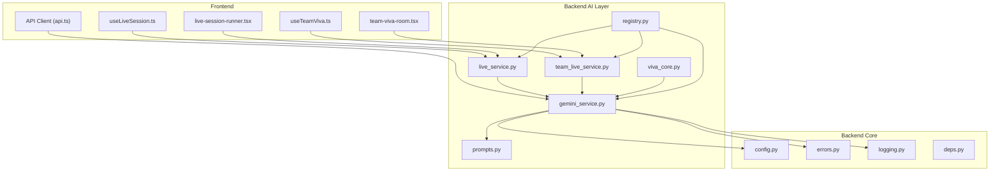
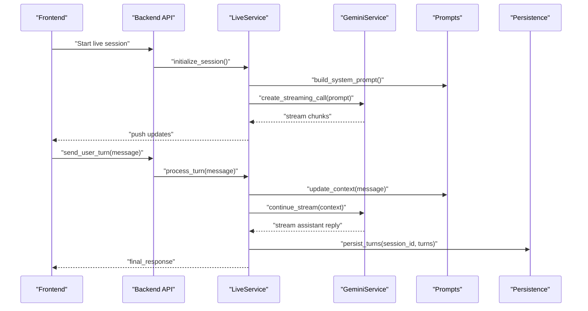
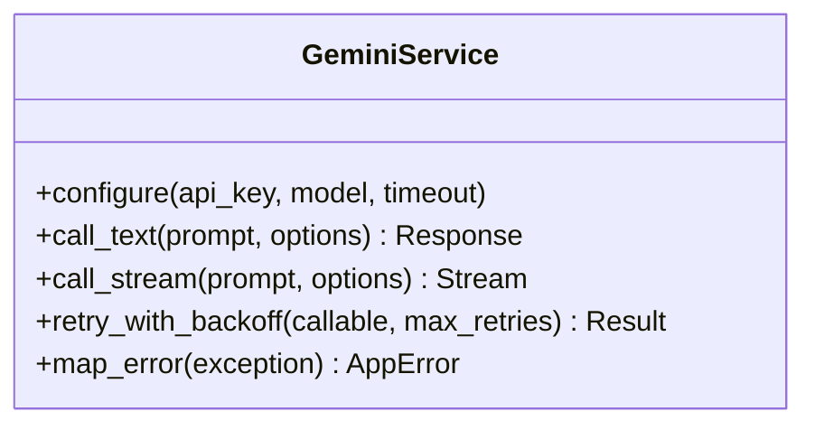
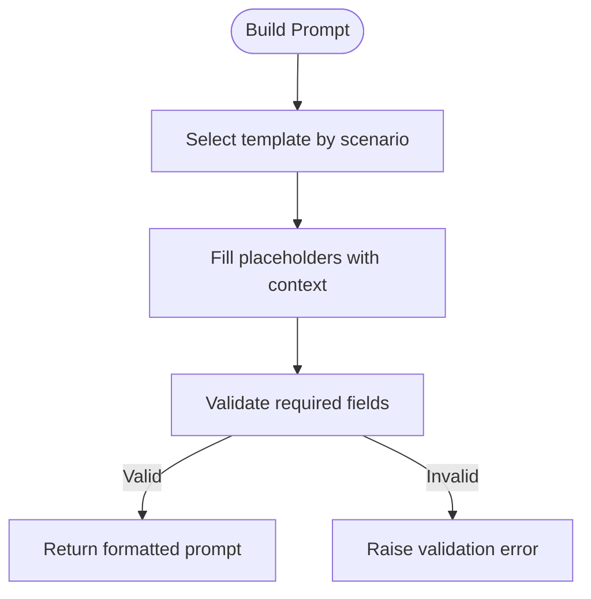
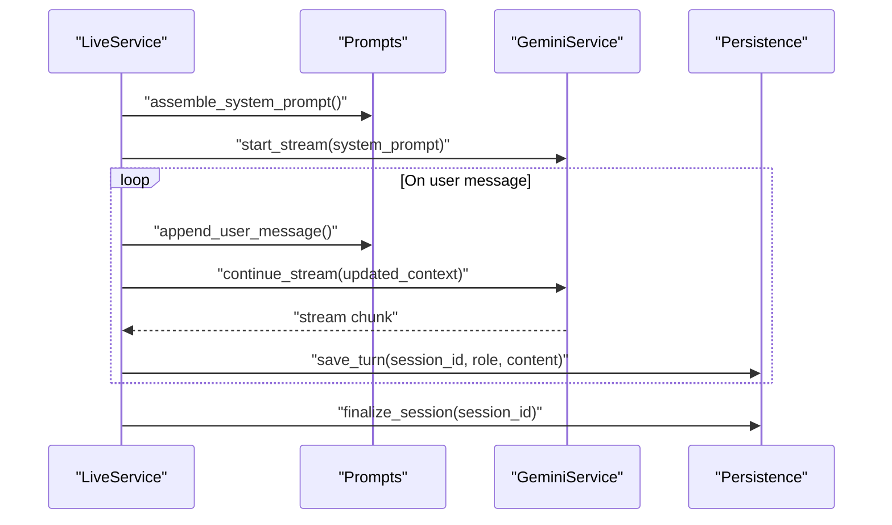
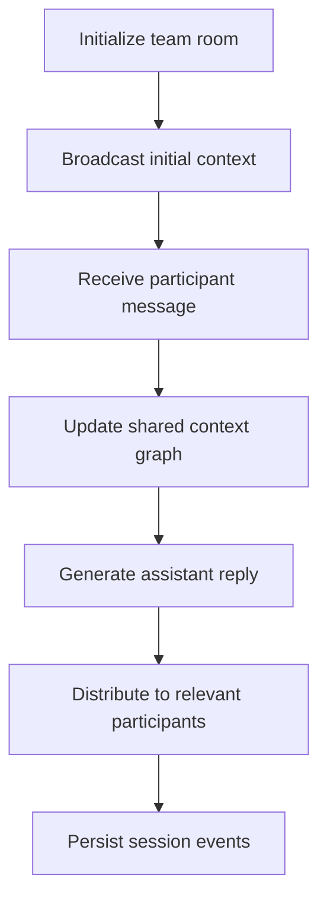
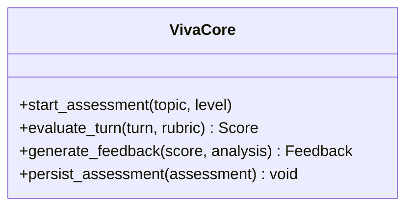
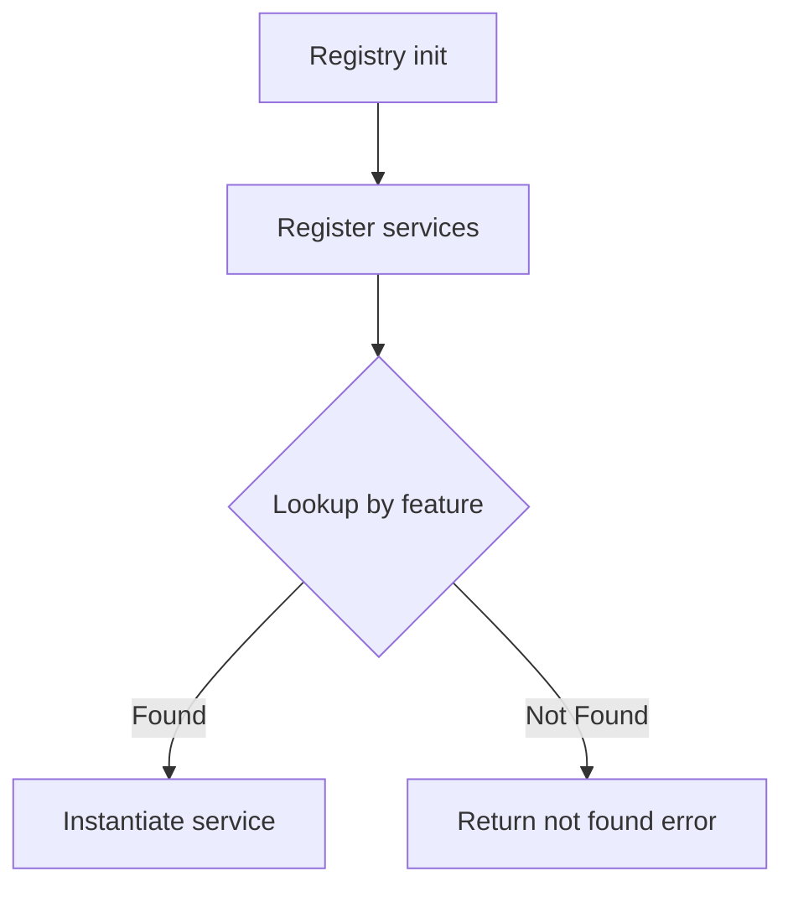
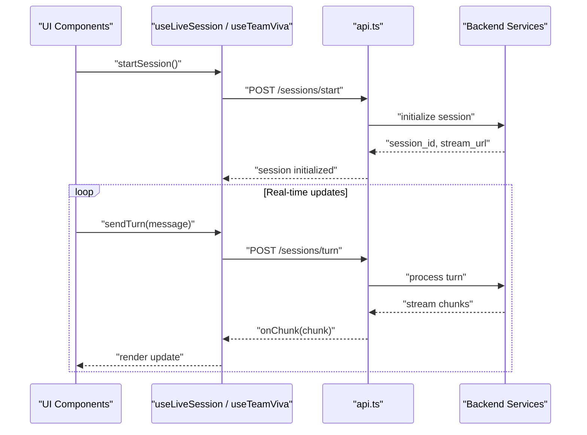
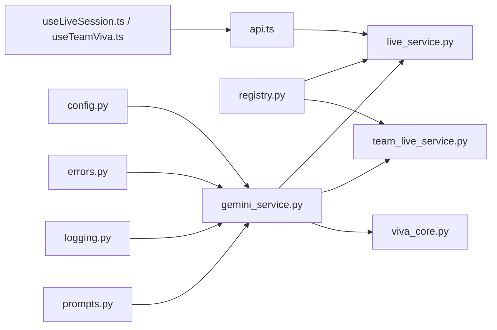

# Google Gemini Integration

<cite>
**Referenced Files in This Document**
- [gemini_service.py](file://backend/ai/gemini_service.py)
- [prompts.py](file://backend/ai/prompts.py)
- [live_service.py](file://backend/ai/live_service.py)
- [team_live_service.py](file://backend/ai/team_live_service.py)
- [viva_core.py](file://backend/ai/viva_core.py)
- [registry.py](file://backend/ai/registry.py)
- [config.py](file://backend/core/config.py)
- [errors.py](file://backend/core/errors.py)
- [logging.py](file://backend/core/logging.py)
- [deps.py](file://backend/core/deps.py)
- [api.py](file://src/lib/api.ts)
- [useLiveSession.ts](file://src/lib/useLiveSession.ts)
- [useTeamViva.ts](file://src/lib/useTeamViva.ts)
- [live-session-runner.tsx](file://src/components/live/live-session-runner.tsx)
- [team-viva-room.tsx](file://src/components/live/team-viva-room.tsx)
</cite>

## Table of Contents
1. [Introduction](#introduction)
2. [Project Structure](#project-structure)
3. [Core Components](#core-components)
4. [Architecture Overview](#architecture-overview)
5. [Detailed Component Analysis](#detailed-component-analysis)
6. [Dependency Analysis](#dependency-analysis)
7. [Performance Considerations](#performance-considerations)
8. [Troubleshooting Guide](#troubleshooting-guide)
9. [Conclusion](#conclusion)
10. [Appendices](#appendices)

## Introduction
This document explains the Google Gemini AI integration that powers advanced natural language processing and conversational capabilities across live tutoring, team collaboration, and real-time educational assistance features. It covers API authentication, request/response formatting, error handling, prompt templates, context management, conversation state persistence, rate limiting, cost optimization, fallback mechanisms, security considerations for API key management, data privacy compliance, and content filtering policies. The goal is to provide both technical depth and accessible guidance for developers integrating or extending Gemini-powered features.

## Project Structure
The Gemini integration spans backend services, configuration, error handling, logging, and frontend hooks and components:
- Backend AI layer: service orchestration, prompts, live session logic, team room coordination, and registry of AI capabilities.
- Core utilities: configuration, dependency injection, errors, and logging.
- Frontend integration: API client usage, live session hooks, and UI components driving real-time interactions.

**Diagram sources**
- [gemini_service.py](file://backend/ai/gemini_service.py)
- [prompts.py](file://backend/ai/prompts.py)
- [live_service.py](file://backend/ai/live_service.py)
- [team_live_service.py](file://backend/ai/team_live_service.py)
- [viva_core.py](file://backend/ai/viva_core.py)
- [registry.py](file://backend/ai/registry.py)
- [config.py](file://backend/core/config.py)
- [errors.py](file://backend/core/errors.py)
- [logging.py](file://backend/core/logging.py)
- [deps.py](file://backend/core/deps.py)
- [api.ts](file://src/lib/api.ts)
- [useLiveSession.ts](file://src/lib/useLiveSession.ts)
- [useTeamViva.ts](file://src/lib/useTeamViva.ts)
- [live-session-runner.tsx](file://src/components/live/live-session-runner.tsx)
- [team-viva-room.tsx](file://src/components/live/team-viva-room.tsx)

**Section sources**
- [gemini_service.py](file://backend/ai/gemini_service.py)
- [prompts.py](file://backend/ai/prompts.py)
- [live_service.py](file://backend/ai/live_service.py)
- [team_live_service.py](file://backend/ai/team_live_service.py)
- [viva_core.py](file://backend/ai/viva_core.py)
- [registry.py](file://backend/ai/registry.py)
- [config.py](file://backend/core/config.py)
- [errors.py](file://backend/core/errors.py)
- [logging.py](file://backend/core/logging.py)
- [deps.py](file://backend/core/deps.py)
- [api.ts](file://src/lib/api.ts)
- [useLiveSession.ts](file://src/lib/useLiveSession.ts)
- [useTeamViva.ts](file://src/lib/useTeamViva.ts)
- [live-session-runner.tsx](file://src/components/live/live-session-runner.tsx)
- [team-viva-room.tsx](file://src/components/live/team-viva-room.tsx)

## Core Components
- Gemini Service: Centralized client for Google Gemini API calls, including authentication, request construction, response parsing, retries, and error mapping.
- Prompt Templates: Centralized definitions for system prompts, user prompts, and structured outputs tailored to tutoring, assessment, and collaboration scenarios.
- Live Session Service: Orchestrates real-time tutoring sessions with Gemini, managing streaming responses, turn-taking, and session lifecycle.
- Team Live Service: Extends live capabilities for multi-user rooms, coordinating prompts and responses across participants.
- Viva Core: Higher-level orchestration for viva-style assessments, combining Gemini insights with domain-specific evaluation logic.
- Registry: Feature registry that wires AI capabilities into the application’s routing and service layers.
- Configuration: Environment-driven settings for API keys, model selection, timeouts, and feature flags.
- Errors and Logging: Standardized error types, retry/backoff strategies, and structured logs for observability.

**Section sources**
- [gemini_service.py](file://backend/ai/gemini_service.py)
- [prompts.py](file://backend/ai/prompts.py)
- [live_service.py](file://backend/ai/live_service.py)
- [team_live_service.py](file://backend/ai/team_live_service.py)
- [viva_core.py](file://backend/ai/viva_core.py)
- [registry.py](file://backend/ai/registry.py)
- [config.py](file://backend/core/config.py)
- [errors.py](file://backend/core/errors.py)
- [logging.py](file://backend/core/logging.py)

## Architecture Overview
The Gemini integration follows a layered architecture:
- Frontend invokes backend endpoints via an API client and uses hooks for live sessions.
- Backend routes requests to AI services which construct prompts and call Gemini.
- Responses are streamed or returned as JSON, with structured error handling and logging.
- Context and conversation state are managed per session and persisted where needed.

**Diagram sources**
- [live_service.py](file://backend/ai/live_service.py)
- [gemini_service.py](file://backend/ai/gemini_service.py)
- [prompts.py](file://backend/ai/prompts.py)

## Detailed Component Analysis

### Gemini Service
Responsibilities:
- Authentication using environment-provided credentials.
- Request formatting for text and multimodal inputs.
- Streaming and non-streaming responses.
- Retry/backoff and circuit breaker patterns.
- Error mapping to standardized backend errors.

Key behaviors:
- Validates configuration before making calls.
- Builds structured payloads with safety filters and model parameters.
- Handles partial failures by falling back to cached or degraded responses when available.

**Diagram sources**
- [gemini_service.py](file://backend/ai/gemini_service.py)

**Section sources**
- [gemini_service.py](file://backend/ai/gemini_service.py)

### Prompt Templates
Responsibilities:
- Centralize system and user prompts for consistent behavior.
- Provide templates for tutoring, assessment, and collaboration.
- Support dynamic insertion of context variables (e.g., student level, topic).

Design principles:
- Template separation from business logic.
- Validation of required placeholders.
- Versioned templates for backward compatibility.

**Diagram sources**
- [prompts.py](file://backend/ai/prompts.py)

**Section sources**
- [prompts.py](file://backend/ai/prompts.py)

### Live Session Service
Responsibilities:
- Manage session lifecycle (init, run, pause, resume, close).
- Coordinate streaming responses from Gemini.
- Maintain conversation context and turn history.
- Persist turns for auditability and replay.

Operational flow:
- Initializes session with system prompt and baseline context.
- Processes user messages, updates context, and streams assistant replies.
- Persists each turn and handles interruptions gracefully.

**Diagram sources**
- [live_service.py](file://backend/ai/live_service.py)
- [prompts.py](file://backend/ai/prompts.py)
- [gemini_service.py](file://backend/ai/gemini_service.py)

**Section sources**
- [live_service.py](file://backend/ai/live_service.py)

### Team Live Service
Responsibilities:
- Extend live session capabilities for multiple participants.
- Aggregate prompts and manage shared context.
- Route responses to appropriate participants based on roles.

Behavior highlights:
- Maintains a shared conversation graph.
- Supports moderator controls and participant permissions.
- Ensures fairness in turn allocation and latency balancing.

**Diagram sources**
- [team_live_service.py](file://backend/ai/team_live_service.py)

**Section sources**
- [team_live_service.py](file://backend/ai/team_live_service.py)

### Viva Core
Responsibilities:
- Orchestrate viva-style assessments combining Gemini insights with domain rules.
- Evaluate responses against rubrics and generate feedback.
- Maintain assessment state and scoring.

Integration points:
- Uses Gemini for open-ended analysis and suggestions.
- Applies deterministic scoring and qualitative feedback generation.

**Diagram sources**
- [viva_core.py](file://backend/ai/viva_core.py)

**Section sources**
- [viva_core.py](file://backend/ai/viva_core.py)

### Registry
Responsibilities:
- Register AI features and expose them through the application’s service layer.
- Provide lookup and instantiation of AI services based on route or feature flags.

Usage:
- Wires Gemini-backed services into API endpoints.
- Enables toggling features via configuration.

**Diagram sources**
- [registry.py](file://backend/ai/registry.py)

**Section sources**
- [registry.py](file://backend/ai/registry.py)

### Configuration, Errors, and Logging
Configuration:
- Loads API keys, model names, timeouts, and feature flags from environment.
- Validates critical settings at startup.

Errors:
- Defines typed exceptions for network, auth, rate limit, and validation errors.
- Maps upstream errors to user-friendly messages.

Logging:
- Structured logs for requests, responses, and errors.
- Redaction of sensitive data (e.g., API keys).

**Section sources**
- [config.py](file://backend/core/config.py)
- [errors.py](file://backend/core/errors.py)
- [logging.py](file://backend/core/logging.py)

### Frontend Integration
API Client:
- Encapsulates HTTP calls to backend endpoints.
- Handles headers, tokens, and error responses.

Hooks:
- useLiveSession: manages WebSocket-like streaming updates for live tutoring.
- useTeamViva: coordinates multi-user interactions and shared state.

Components:
- live-session-runner: orchestrates session UI and event handling.
- team-viva-room: renders collaborative interface and participant list.

**Diagram sources**
- [api.ts](file://src/lib/api.ts)
- [useLiveSession.ts](file://src/lib/useLiveSession.ts)
- [useTeamViva.ts](file://src/lib/useTeamViva.ts)
- [live-session-runner.tsx](file://src/components/live/live-session-runner.tsx)
- [team-viva-room.tsx](file://src/components/live/team-viva-room.tsx)

**Section sources**
- [api.ts](file://src/lib/api.ts)
- [useLiveSession.ts](file://src/lib/useLiveSession.ts)
- [useTeamViva.ts](file://src/lib/useTeamViva.ts)
- [live-session-runner.tsx](file://src/components/live/live-session-runner.tsx)
- [team-viva-room.tsx](file://src/components/live/team-viva-room.tsx)

## Dependency Analysis
The Gemini integration depends on configuration, error handling, and logging modules, while being consumed by live and team services. Frontend hooks depend on the API client and backend endpoints.

**Diagram sources**
- [config.py](file://backend/core/config.py)
- [errors.py](file://backend/core/errors.py)
- [logging.py](file://backend/core/logging.py)
- [gemini_service.py](file://backend/ai/gemini_service.py)
- [prompts.py](file://backend/ai/prompts.py)
- [live_service.py](file://backend/ai/live_service.py)
- [team_live_service.py](file://backend/ai/team_live_service.py)
- [viva_core.py](file://backend/ai/viva_core.py)
- [registry.py](file://backend/ai/registry.py)
- [api.ts](file://src/lib/api.ts)
- [useLiveSession.ts](file://src/lib/useLiveSession.ts)
- [useTeamViva.ts](file://src/lib/useTeamViva.ts)

**Section sources**
- [gemini_service.py](file://backend/ai/gemini_service.py)
- [live_service.py](file://backend/ai/live_service.py)
- [team_live_service.py](file://backend/ai/team_live_service.py)
- [viva_core.py](file://backend/ai/viva_core.py)
- [registry.py](file://backend/ai/registry.py)
- [config.py](file://backend/core/config.py)
- [errors.py](file://backend/core/errors.py)
- [logging.py](file://backend/core/logging.py)
- [api.ts](file://src/lib/api.ts)
- [useLiveSession.ts](file://src/lib/useLiveSession.ts)
- [useTeamViva.ts](file://src/lib/useTeamViva.ts)

## Performance Considerations
- Streaming responses: Prefer streaming for long-running queries to reduce perceived latency.
- Prompt size limits: Keep prompts concise; truncate or summarize long contexts.
- Caching: Cache frequent responses or embeddings to reduce API calls.
- Rate limiting: Implement client-side and server-side throttling; use exponential backoff.
- Cost optimization: Choose smaller models for simple tasks; reserve larger models for complex reasoning.
- Concurrency control: Limit concurrent Gemini calls per tenant to avoid quota exhaustion.
- Batch operations: Where possible, batch multiple requests to minimize overhead.

[No sources needed since this section provides general guidance]

## Troubleshooting Guide
Common issues and resolutions:
- Authentication failures: Verify API key validity and scope; ensure environment variables are loaded.
- Rate limit errors: Increase backoff intervals; implement queueing and retry policies.
- Timeouts: Adjust timeouts based on payload size and model complexity; consider streaming.
- Invalid prompts: Validate placeholders and schema; log full prompt for debugging.
- Data privacy: Ensure sensitive data is redacted in logs; comply with retention policies.
- Content filtering: Review safety settings and adjust filters to balance safety and usability.

Operational checks:
- Inspect structured logs for request IDs and error traces.
- Use health checks to verify Gemini connectivity and quotas.
- Monitor error rates and latency percentiles.

**Section sources**
- [errors.py](file://backend/core/errors.py)
- [logging.py](file://backend/core/logging.py)
- [config.py](file://backend/core/config.py)

## Conclusion
The Google Gemini integration provides robust, scalable, and secure NLP capabilities for live tutoring, team collaboration, and real-time educational assistance. By centralizing authentication, prompt templating, streaming, error handling, and observability, the system ensures reliability and performance. Adhering to best practices for rate limiting, cost optimization, and security will further enhance service quality and compliance.

[No sources needed since this section summarizes without analyzing specific files]

## Appendices

### API Authentication
- Use environment variables for API keys and secrets.
- Rotate keys regularly and restrict scopes to minimum necessary.
- Validate configuration at startup and fail fast on missing keys.

**Section sources**
- [config.py](file://backend/core/config.py)

### Request/Response Formatting
- Construct structured prompts with clear instructions and constraints.
- Normalize responses into typed objects for downstream processing.
- Support streaming for interactive experiences.

**Section sources**
- [prompts.py](file://backend/ai/prompts.py)
- [gemini_service.py](file://backend/ai/gemini_service.py)

### Error Handling Strategies
- Map upstream errors to application-specific types.
- Implement retries with exponential backoff for transient failures.
- Provide actionable error messages to users.

**Section sources**
- [errors.py](file://backend/core/errors.py)
- [gemini_service.py](file://backend/ai/gemini_service.py)

### Prompt Templates and Context Management
- Centralize templates and enforce validation.
- Manage context windows carefully; summarize or truncate as needed.
- Version templates to maintain backward compatibility.

**Section sources**
- [prompts.py](file://backend/ai/prompts.py)

### Conversation State Persistence
- Persist turns and metadata for auditability and replay.
- Ensure idempotency for reprocessing and recovery.
- Securely store session identifiers and links.

**Section sources**
- [live_service.py](file://backend/ai/live_service.py)
- [team_live_service.py](file://backend/ai/team_live_service.py)

### Rate Limiting and Cost Optimization
- Enforce per-user and per-tenant quotas.
- Prefer smaller models for routine tasks.
- Cache and deduplicate repeated requests.

[No sources needed since this section provides general guidance]

### Fallback Mechanisms
- Degraded mode with cached responses when Gemini is unavailable.
- Graceful degradation to rule-based answers for critical paths.
- Circuit breaker to prevent cascading failures.

**Section sources**
- [gemini_service.py](file://backend/ai/gemini_service.py)

### Security and Privacy
- Redact sensitive data in logs and telemetry.
- Comply with data retention and deletion policies.
- Apply content filtering aligned with educational standards.

**Section sources**
- [logging.py](file://backend/core/logging.py)
- [config.py](file://backend/core/config.py)