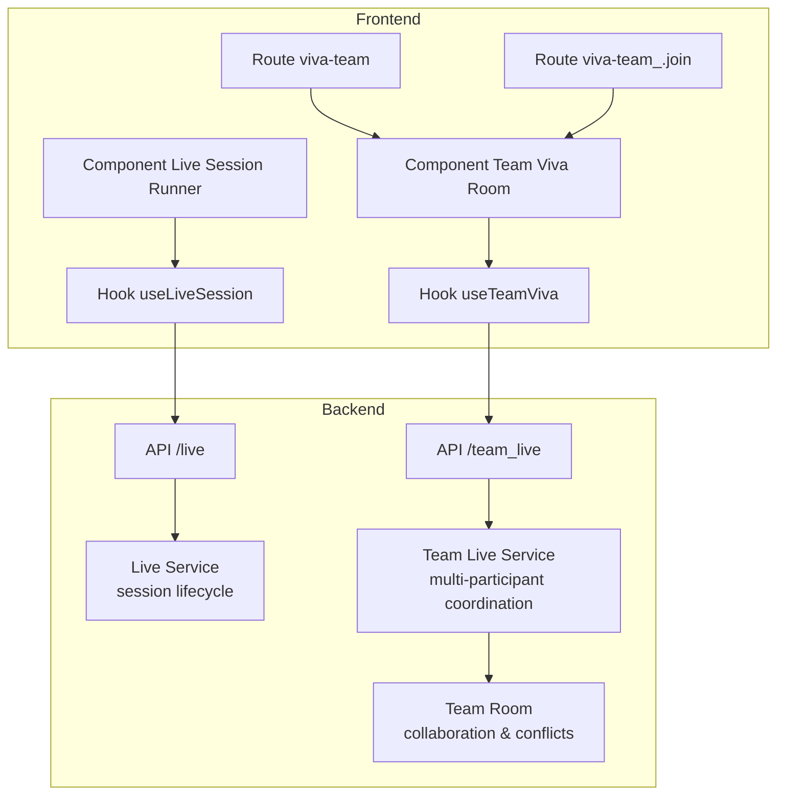
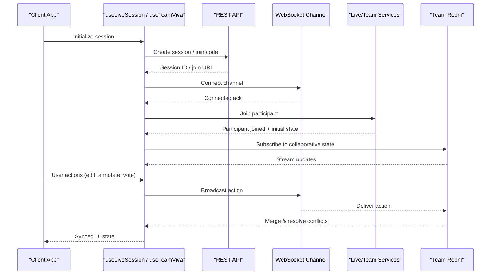
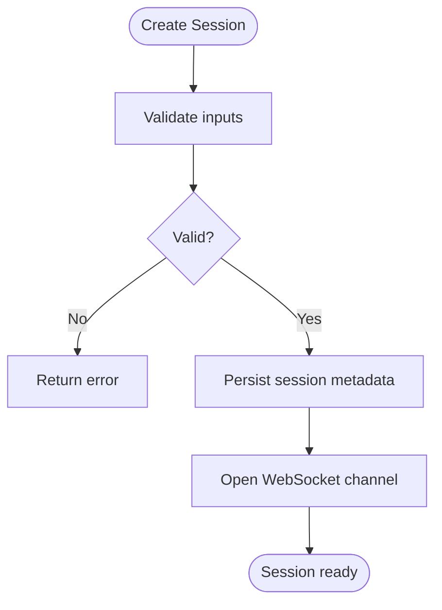
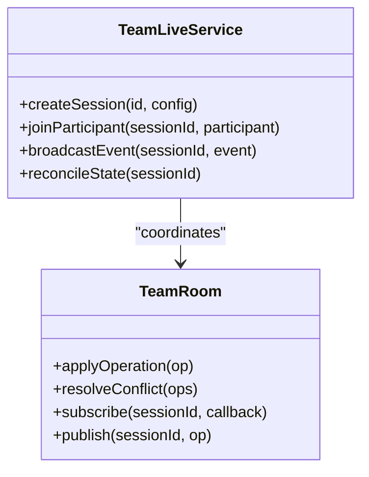
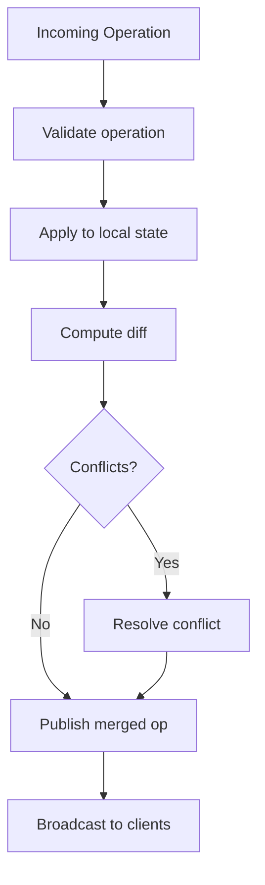
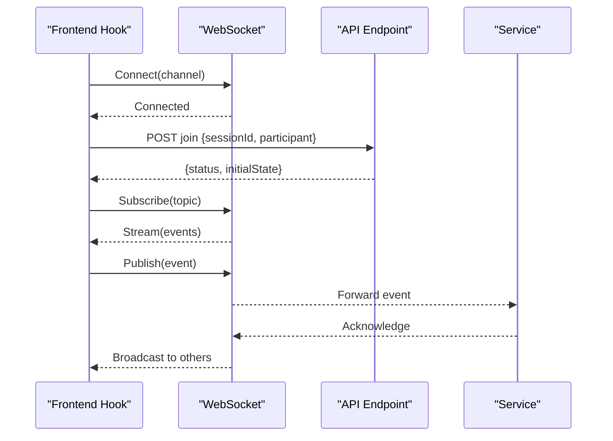
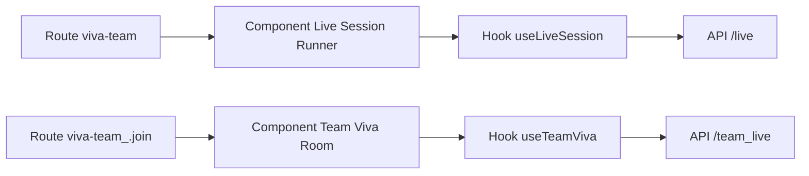
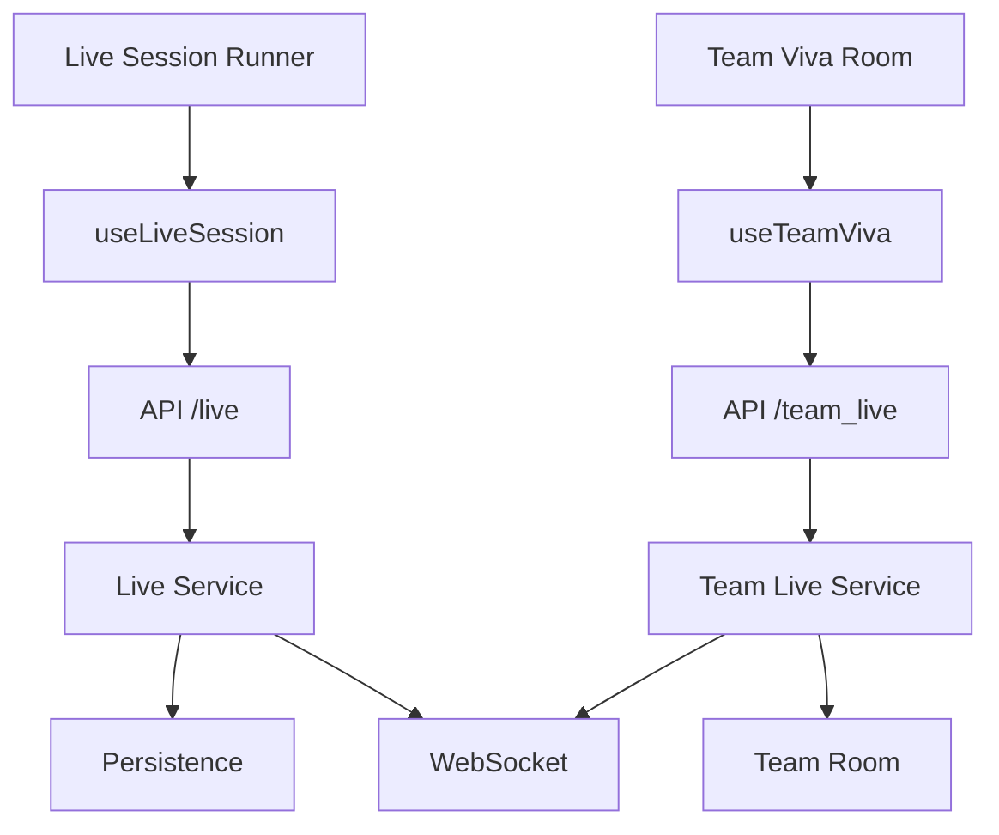

# Live AI Services

<cite>
**Referenced Files in This Document**
- [live_service.py](file://backend/ai/live_service.py)
- [team_live_service.py](file://backend/ai/team_live_service.py)
- [team_room.py](file://backend/ai/team_room.py)
- [live.py](file://backend/api/live.py)
- [team_live.py](file://backend/api/team_live.py)
- [useLiveSession.ts](file://src/lib/useLiveSession.ts)
- [useTeamViva.ts](file://src/lib/useTeamViva.ts)
- [live-session-runner.tsx](file://src/components/live/live-session-runner.tsx)
- [team-viva-room.tsx](file://src/components/live/team-viva-room.tsx)
- [viva-team.tsx](file://src/routes/advanced/viva-team.tsx)
- [viva-team_.join.$joinCode.tsx](file://src/routes/advanced/viva-team_.join.$joinCode.tsx)
</cite>

## Table of Contents
1. [Introduction](#introduction)
2. [Project Structure](#project-structure)
3. [Core Components](#core-components)
4. [Architecture Overview](#architecture-overview)
5. [Detailed Component Analysis](#detailed-component-analysis)
6. [Dependency Analysis](#dependency-analysis)
7. [Performance Considerations](#performance-considerations)
8. [Troubleshooting Guide](#troubleshooting-guide)
9. [Conclusion](#conclusion)
10. [Appendices](#appendices)

## Introduction
This document explains the live AI services that power real-time collaborative learning environments. It covers live session management, participant coordination, resource allocation, team room functionality (collaborative editing, version control integration, conflict resolution), and end-to-end WebSocket communication for message broadcasting and synchronization. It also provides practical examples for setting up live tutoring sessions, managing multiple participants, and facilitating group problem-solving activities, along with scalability considerations for large teams.

## Project Structure
The live AI system spans backend services, API endpoints, and frontend hooks/components:
- Backend AI services implement session lifecycle, participant coordination, and team room orchestration.
- Backend APIs expose REST endpoints to create/join sessions, manage participants, and broadcast events.
- Frontend hooks abstract WebSocket interactions and state synchronization.
- Frontend components render live sessions and team rooms, handling user interactions and real-time updates.

**Diagram sources**
- [live_service.py](file://backend/ai/live_service.py)
- [team_live_service.py](file://backend/ai/team_live_service.py)
- [team_room.py](file://backend/ai/team_room.py)
- [live.py](file://backend/api/live.py)
- [team_live.py](file://backend/api/team_live.py)
- [useLiveSession.ts](file://src/lib/useLiveSession.ts)
- [useTeamViva.ts](file://src/lib/useTeamViva.ts)
- [live-session-runner.tsx](file://src/components/live/live-session-runner.tsx)
- [team-viva-room.tsx](file://src/components/live/team-viva-room.tsx)
- [viva-team.tsx](file://src/routes/advanced/viva-team.tsx)
- [viva-team_.join.$joinCode.tsx](file://src/routes/advanced/viva-team_.join.$joinCode.tsx)

**Section sources**
- [live_service.py](file://backend/ai/live_service.py)
- [team_live_service.py](file://backend/ai/team_live_service.py)
- [team_room.py](file://backend/ai/team_room.py)
- [live.py](file://backend/api/live.py)
- [team_live.py](file://backend/api/team_live.py)
- [useLiveSession.ts](file://src/lib/useLiveSession.ts)
- [useTeamViva.ts](file://src/lib/useTeamViva.ts)
- [live-session-runner.tsx](file://src/components/live/live-session-runner.tsx)
- [team-viva-room.tsx](file://src/components/live/team-viva-room.tsx)
- [viva-team.tsx](file://src/routes/advanced/viva-team.tsx)
- [viva-team_.join.$joinCode.tsx](file://src/routes/advanced/viva-team_.join.$joinCode.tsx)

## Core Components
- Live Session Management: Orchestrates creation, lifecycle transitions, participant join/leave, and event broadcasting for single or small-group sessions.
- Team Live Coordination: Manages multi-participant sessions, role assignment, shared resources, and synchronized state across clients.
- Team Room: Provides collaborative editing primitives, versioning metadata, and conflict resolution strategies for concurrent edits.
- API Layer: Exposes endpoints for session setup, participant management, and event streaming; integrates with WebSocket channels for real-time messaging.
- Frontend Hooks: Encapsulate WebSocket connections, reconnection logic, and state synchronization for live sessions and team rooms.
- Frontend Components: Render interactive UIs for tutors and learners, including live stages, collaborative canvases, and chat/annotations.

Key responsibilities and interactions are detailed in subsequent sections.

**Section sources**
- [live_service.py](file://backend/ai/live_service.py)
- [team_live_service.py](file://backend/ai/team_live_service.py)
- [team_room.py](file://backend/ai/team_room.py)
- [live.py](file://backend/api/live.py)
- [team_live.py](file://backend/api/team_live.py)
- [useLiveSession.ts](file://src/lib/useLiveSession.ts)
- [useTeamViva.ts](file://src/lib/useTeamViva.ts)
- [live-session-runner.tsx](file://src/components/live/live-session-runner.tsx)
- [team-viva-room.tsx](file://src/components/live/team-viva-room.tsx)

## Architecture Overview
The system follows a layered architecture:
- Client layer: React components and hooks manage UI and WebSocket interactions.
- API layer: FastAPI endpoints handle HTTP requests and route to services.
- Service layer: Live and team services coordinate sessions and participants.
- Collaboration layer: Team room manages shared state, versioning, and conflict resolution.
- Transport: WebSocket channels enable low-latency message broadcasting and synchronization.

**Diagram sources**
- [useLiveSession.ts](file://src/lib/useLiveSession.ts)
- [useTeamViva.ts](file://src/lib/useTeamViva.ts)
- [live.py](file://backend/api/live.py)
- [team_live.py](file://backend/api/team_live.py)
- [live_service.py](file://backend/ai/live_service.py)
- [team_live_service.py](file://backend/ai/team_live_service.py)
- [team_room.py](file://backend/ai/team_room.py)

## Detailed Component Analysis

### Live Session Management
- Responsibilities:
  - Create sessions, assign IDs, set capacity and roles.
  - Manage participant lifecycle (join, leave, mute/unmute).
  - Route messages to appropriate channels and persist key events.
- Data model highlights:
  - Session metadata (ID, mode, capacity, timestamps).
  - Participant registry (ID, role, status, last seen).
  - Event log for replay and analytics.
- Error handling:
  - Validation on join attempts against capacity and permissions.
  - Graceful cleanup on disconnects and timeouts.

**Diagram sources**
- [live_service.py](file://backend/ai/live_service.py)
- [live.py](file://backend/api/live.py)

**Section sources**
- [live_service.py](file://backend/ai/live_service.py)
- [live.py](file://backend/api/live.py)

### Team Live Coordination
- Responsibilities:
  - Coordinate multiple participants within a session.
  - Manage shared resources (whiteboard, documents, code snippets).
  - Enforce role-based permissions and moderation.
- Concurrency model:
  - Operation queues for write operations.
  - Optimistic updates with server reconciliation.
- Conflict detection:
  - Detect overlapping edits via operation timestamps and IDs.

**Diagram sources**
- [team_live_service.py](file://backend/ai/team_live_service.py)
- [team_room.py](file://backend/ai/team_room.py)

**Section sources**
- [team_live_service.py](file://backend/ai/team_live_service.py)
- [team_room.py](file://backend/ai/team_room.py)

### Team Room Functionality
- Collaborative editing:
  - Supports text, annotations, and structured data edits.
  - Maintains an operation log for CRDT-like behavior.
- Version control integration:
  - Emits version tags and diffs for snapshots.
  - Integrates with external repositories via adapters.
- Conflict resolution:
  - Merges concurrent edits using deterministic rules.
  - Falls back to manual resolution prompts when needed.

**Diagram sources**
- [team_room.py](file://backend/ai/team_room.py)

**Section sources**
- [team_room.py](file://backend/ai/team_room.py)

### WebSocket Communication Protocols
- Channels:
  - Per-session channels for isolation.
  - Topic-based routing for specific features (chat, whiteboard, voting).
- Message types:
  - Control messages (join, leave, mute, kick).
  - State messages (presence, cursor, selections).
  - Edit messages (operations, patches).
- Reliability:
  - Acknowledgments and retries for critical messages.
  - Heartbeats and reconnect strategies.

**Diagram sources**
- [useLiveSession.ts](file://src/lib/useLiveSession.ts)
- [useTeamViva.ts](file://src/lib/useTeamViva.ts)
- [live.py](file://backend/api/live.py)
- [team_live.py](file://backend/api/team_live.py)

**Section sources**
- [useLiveSession.ts](file://src/lib/useLiveSession.ts)
- [useTeamViva.ts](file://src/lib/useTeamViva.ts)
- [live.py](file://backend/api/live.py)
- [team_live.py](file://backend/api/team_live.py)

### Frontend Integration
- Hooks:
  - useLiveSession: Manages single-session lifecycle and basic collaboration.
  - useTeamViva: Manages multi-participant sessions and team room state.
- Components:
  - Live Session Runner: Orchestrates stage transitions and tutor controls.
  - Team Viva Room: Renders collaborative canvas, chat, and participant list.
- Routes:
  - viva-team: Entry point for creating or joining team sessions.
  - viva-team_.join: Handles join codes and redirects to active sessions.

**Diagram sources**
- [live-session-runner.tsx](file://src/components/live/live-session-runner.tsx)
- [team-viva-room.tsx](file://src/components/live/team-viva-room.tsx)
- [viva-team.tsx](file://src/routes/advanced/viva-team.tsx)
- [viva-team_.join.$joinCode.tsx](file://src/routes/advanced/viva-team_.join.$joinCode.tsx)
- [useLiveSession.ts](file://src/lib/useLiveSession.ts)
- [useTeamViva.ts](file://src/lib/useTeamViva.ts)
- [live.py](file://backend/api/live.py)
- [team_live.py](file://backend/api/team_live.py)

**Section sources**
- [live-session-runner.tsx](file://src/components/live/live-session-runner.tsx)
- [team-viva-room.tsx](file://src/components/live/team-viva-room.tsx)
- [viva-team.tsx](file://src/routes/advanced/viva-team.tsx)
- [viva-team_.join.$joinCode.tsx](file://src/routes/advanced/viva-team_.join.$joinCode.tsx)
- [useLiveSession.ts](file://src/lib/useLiveSession.ts)
- [useTeamViva.ts](file://src/lib/useTeamViva.ts)
- [live.py](file://backend/api/live.py)
- [team_live.py](file://backend/api/team_live.py)

## Dependency Analysis
- Backend dependencies:
  - Live service depends on session persistence and WebSocket transport.
  - Team live service depends on team room for state merging and conflict resolution.
- Frontend dependencies:
  - Hooks depend on WebSocket libraries and API clients.
  - Components depend on hooks for state and actions.

**Diagram sources**
- [live_service.py](file://backend/ai/live_service.py)
- [team_live_service.py](file://backend/ai/team_live_service.py)
- [team_room.py](file://backend/ai/team_room.py)
- [live.py](file://backend/api/live.py)
- [team_live.py](file://backend/api/team_live.py)
- [useLiveSession.ts](file://src/lib/useLiveSession.ts)
- [useTeamViva.ts](file://src/lib/useTeamViva.ts)
- [live-session-runner.tsx](file://src/components/live/live-session-runner.tsx)
- [team-viva-room.tsx](file://src/components/live/team-viva-room.tsx)

**Section sources**
- [live_service.py](file://backend/ai/live_service.py)
- [team_live_service.py](file://backend/ai/team_live_service.py)
- [team_room.py](file://backend/ai/team_room.py)
- [live.py](file://backend/api/live.py)
- [team_live.py](file://backend/api/team_live.py)
- [useLiveSession.ts](file://src/lib/useLiveSession.ts)
- [useTeamViva.ts](file://src/lib/useTeamViva.ts)
- [live-session-runner.tsx](file://src/components/live/live-session-runner.tsx)
- [team-viva-room.tsx](file://src/components/live/team-viva-room.tsx)

## Performance Considerations
- Connection management:
  - Use connection pooling and per-session channels to reduce overhead.
  - Implement exponential backoff and heartbeat checks for resilience.
- Scalability:
  - Shard sessions across workers by session ID hash.
  - Offload heavy merges to background tasks where possible.
- Real-time optimization:
  - Batch messages and debounce frequent updates.
  - Use delta sync and selective subscriptions to minimize payload size.
- Resource allocation:
  - Enforce participant limits and throttle high-frequency events.
  - Cache read-heavy data and invalidate on writes.

[No sources needed since this section provides general guidance]

## Troubleshooting Guide
- Common issues:
  - WebSocket disconnects: Check heartbeats and reconnection logic in hooks.
  - Conflicting edits: Inspect operation logs and conflict resolution outcomes in team room.
  - Permission errors: Verify role assignments and moderator actions.
- Diagnostics:
  - Log session lifecycle events and participant presence changes.
  - Capture message payloads for debugging synchronization problems.
- Recovery:
  - Re-sync state on reconnect using last known snapshot.
  - Prompt users to resolve unresolved conflicts manually if automatic merge fails.

**Section sources**
- [useLiveSession.ts](file://src/lib/useLiveSession.ts)
- [useTeamViva.ts](file://src/lib/useTeamViva.ts)
- [team_room.py](file://backend/ai/team_room.py)

## Conclusion
The live AI services provide a robust foundation for real-time collaborative learning. By combining session management, participant coordination, and team room capabilities with reliable WebSocket communication, the system supports scalable, interactive tutoring and group problem-solving. Proper configuration of connection management, batching, and conflict resolution ensures smooth performance even under heavy load.

[No sources needed since this section summarizes without analyzing specific files]

## Appendices

### Example Workflows
- Setting up a live tutoring session:
  - Create a session via API, obtain session ID.
  - Share join link with participants.
  - Use runner component to guide stages and share resources.
- Managing multiple participants:
  - Assign roles (tutor, moderator, learner).
  - Use moderation tools to manage speaking turns and content sharing.
- Facilitating group problem-solving:
  - Enable collaborative editing in team room.
  - Use voting and annotation features to converge on solutions.

[No sources needed since this section provides general guidance]