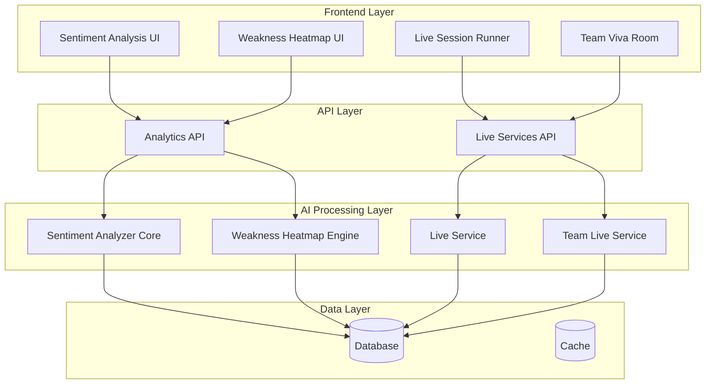
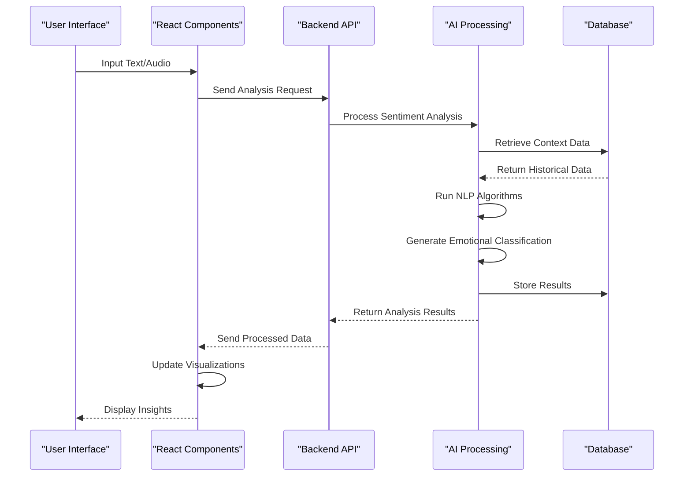
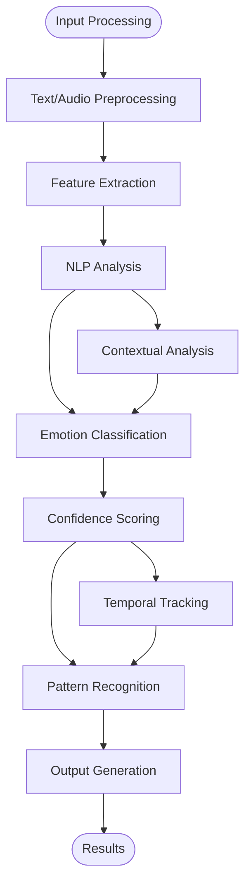
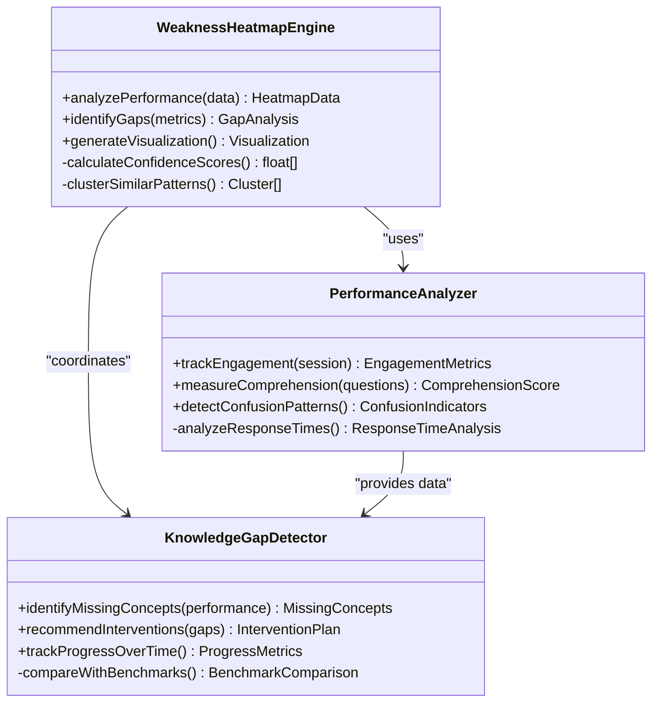
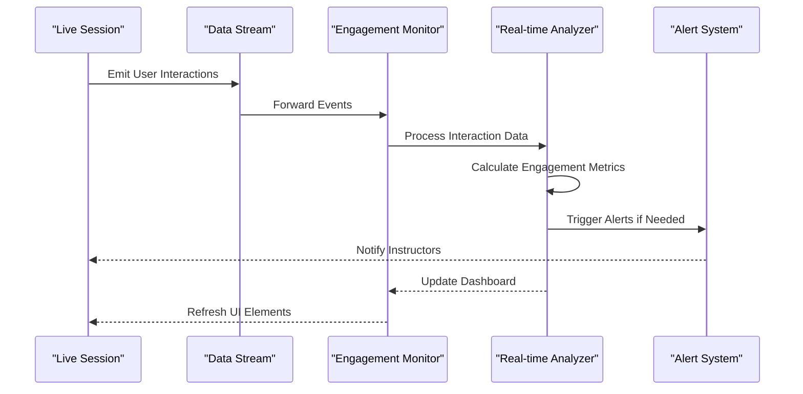
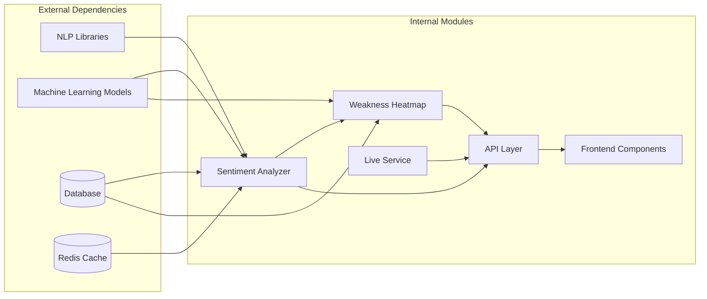

# Sentiment Analysis System

<cite>
**Referenced Files in This Document**
- [sentiment_analyzer.py](file://backend/ai/sentiment_analyzer.py)
- [weakness_heatmap.py](file://backend/ai/weakness_heatmap.py)
- [sentiment-analysis.tsx](file://src/routes/advanced/sentiment-analysis.tsx)
- [weakness-heatmap.tsx](file://src/routes/advanced/weakness-heatmap.tsx)
- [live_service.py](file://backend/ai/live_service.py)
- [team_live_service.py](file://backend/ai/team_live_service.py)
- [analytics.py](file://backend/api/analytics.py)
- [useLiveSession.ts](file://src/lib/useLiveSession.ts)
- [team-viva-room.tsx](file://src/components/live/team-viva-room.tsx)
</cite>

## Table of Contents
1. [Introduction](#introduction)
2. [Project Structure](#project-structure)
3. [Core Components](#core-components)
4. [Architecture Overview](#architecture-overview)
5. [Detailed Component Analysis](#detailed-component-analysis)
6. [Dependency Analysis](#dependency-analysis)
7. [Performance Considerations](#performance-considerations)
8. [Troubleshooting Guide](#troubleshooting-guide)
9. [Conclusion](#conclusion)
10. [Appendices](#appendices)

## Introduction

The Sentiment Analysis System is a comprehensive emotional intelligence processing platform that provides real-time engagement tracking, behavioral pattern analysis, and adaptive learning capabilities. The system leverages advanced natural language processing algorithms to detect emotional states, classify user sentiments, and generate actionable insights for educational and professional development contexts.

This system integrates seamlessly with examination sessions to monitor participant engagement in real-time, enabling adaptive learning path adjustments based on emotional and cognitive state analysis. The platform includes sophisticated visualization tools including weakness heatmaps that identify knowledge gaps and learning obstacles.

## Project Structure

The sentiment analysis system follows a modular architecture with clear separation between backend AI processing, API services, and frontend visualization components:

**Diagram sources**
- [sentiment-analysis.tsx:1-50](file://src/routes/advanced/sentiment-analysis.tsx#L1-L50)
- [analytics.py:1-100](file://backend/api/analytics.py#L1-L100)
- [sentiment_analyzer.py:1-100](file://backend/ai/sentiment_analyzer.py#L1-L100)

**Section sources**
- [sentiment-analysis.tsx:1-100](file://src/routes/advanced/sentiment-analysis.tsx#L1-L100)
- [analytics.py:1-200](file://backend/api/analytics.py#L1-L200)

## Core Components

### Sentiment Analysis Engine

The core sentiment analysis engine implements multi-layered natural language processing algorithms for emotional intelligence detection. The system processes textual and audio inputs to extract emotional signals, confidence scores, and behavioral patterns.

Key features include:
- Real-time sentiment classification across multiple emotional dimensions
- Confidence scoring with uncertainty quantification
- Temporal pattern recognition for engagement tracking
- Cross-modal analysis combining text and audio signals
- Adaptive learning from interaction patterns

### Weakness Heatmap Generator

The weakness heatmap system identifies knowledge gaps and learning obstacles through comprehensive analysis of user interactions, performance metrics, and emotional responses. The system generates visual representations of learning challenges and provides targeted intervention recommendations.

### Live Engagement Monitor

Real-time engagement monitoring capabilities track participant attention, confusion levels, and overall session quality during live examinations and training sessions. The system provides immediate feedback for adaptive learning path adjustments.

**Section sources**
- [sentiment_analyzer.py:1-200](file://backend/ai/sentiment_analyzer.py#L1-L200)
- [weakness_heatmap.py:1-150](file://backend/ai/weakness_heatmap.py#L1-L150)
- [live_service.py:1-100](file://backend/ai/live_service.py#L1-L100)

## Architecture Overview

The sentiment analysis system follows a microservices architecture with event-driven communication patterns:

**Diagram sources**
- [sentiment-analysis.tsx:50-150](file://src/routes/advanced/sentiment-analysis.tsx#L50-L150)
- [analytics.py:100-250](file://backend/api/analytics.py#L100-L250)
- [sentiment_analyzer.py:100-300](file://backend/ai/sentiment_analyzer.py#L100-L300)

## Detailed Component Analysis

### Sentiment Detection Algorithm

The sentiment detection system employs a multi-stage processing pipeline:

**Diagram sources**
- [sentiment_analyzer.py:150-400](file://backend/ai/sentiment_analyzer.py#L150-L400)

### Weakness Heatmap Generation

The weakness heatmap system analyzes multiple data sources to identify learning obstacles:

**Diagram sources**
- [weakness_heatmap.py:100-300](file://backend/ai/weakness_heatmap.py#L100-L300)

### Real-time Engagement Monitoring

The live engagement monitoring system processes streaming data to provide immediate insights:

**Diagram sources**
- [live_service.py:100-250](file://backend/ai/live_service.py#L100-L250)
- [team_live_service.py:100-200](file://backend/ai/team_live_service.py#L100-L200)

**Section sources**
- [sentiment_analyzer.py:1-500](file://backend/ai/sentiment_analyzer.py#L1-L500)
- [weakness_heatmap.py:1-400](file://backend/ai/weakness_heatmap.py#L1-L400)
- [live_service.py:1-300](file://backend/ai/live_service.py#L1-L300)

## Dependency Analysis

The sentiment analysis system has well-defined dependency relationships with clear separation of concerns:

**Diagram sources**
- [requirements.txt:1-50](file://backend/requirements.txt#L1-L50)
- [package.json:1-100](file://package.json#L1-L100)

**Section sources**
- [requirements.txt:1-100](file://backend/requirements.txt#L1-L100)
- [package.json:1-200](file://package.json#L1-L200)

## Performance Considerations

The sentiment analysis system is optimized for real-time processing with several key performance strategies:

- **Caching Layer**: Redis-based caching for frequently accessed sentiment models and historical data
- **Batch Processing**: Asynchronous processing for non-critical analysis tasks
- **Model Optimization**: Quantized machine learning models for faster inference
- **Streaming Architecture**: Event-driven processing for real-time engagement monitoring
- **Database Indexing**: Optimized queries for temporal analysis and pattern recognition

## Troubleshooting Guide

Common issues and their resolutions:

### Model Accuracy Issues
- Verify training data freshness and relevance
- Check model version compatibility
- Review confidence threshold settings
- Validate input data preprocessing pipelines

### Real-time Processing Delays
- Monitor cache hit rates and memory usage
- Check database query performance
- Review WebSocket connection stability
- Analyze network latency between components

### Visualization Rendering Problems
- Ensure proper data format conversion
- Verify chart library compatibility
- Check for large dataset handling
- Validate responsive design breakpoints

**Section sources**
- [errors.py:1-100](file://backend/core/errors.py#L1-L100)
- [logging.py:1-150](file://backend/core/logging.py#L1-L150)

## Conclusion

The sentiment analysis system provides a comprehensive solution for emotional intelligence processing and engagement tracking in educational and professional development contexts. The modular architecture ensures scalability and maintainability while the real-time capabilities enable immediate insights and adaptive learning experiences.

The system's strength lies in its multi-modal approach, combining text and audio analysis with temporal pattern recognition to deliver accurate emotional intelligence insights. The weakness heatmap generation and real-time engagement monitoring capabilities make it particularly valuable for interactive learning environments.

## Appendices

### API Endpoints Reference

| Endpoint | Method | Description | Authentication |
|----------|---------|-------------|----------------|
| `/api/sentiment/analyze` | POST | Submit text/audio for sentiment analysis | Required |
| `/api/sentiment/history` | GET | Retrieve historical sentiment data | Required |
| `/api/weakness/heatmap` | GET | Generate weakness heatmap data | Required |
| `/api/engagement/live` | WS | Real-time engagement monitoring | Required |
| `/api/insights/recommendations` | GET | Get personalized learning recommendations | Required |

### Configuration Parameters

| Parameter | Type | Default | Description |
|-----------|------|---------|-------------|
| `SENTIMENT_MODEL_VERSION` | string | "v2.1" | Version of sentiment analysis model |
| `CONFIDENCE_THRESHOLD` | float | 0.75 | Minimum confidence score for valid results |
| `CACHE_TTL_SECONDS` | int | 3600 | Cache time-to-live for processed results |
| `MAX_BATCH_SIZE` | int | 100 | Maximum batch size for async processing |
| `REALTIME_BUFFER_SIZE` | int | 50 | Buffer size for real-time processing |