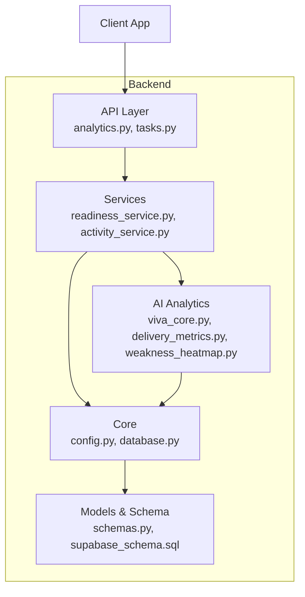
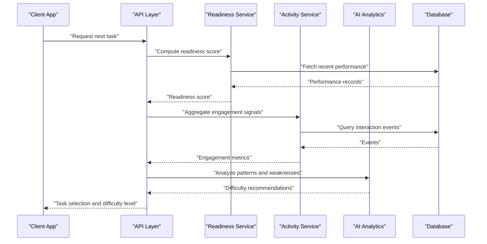
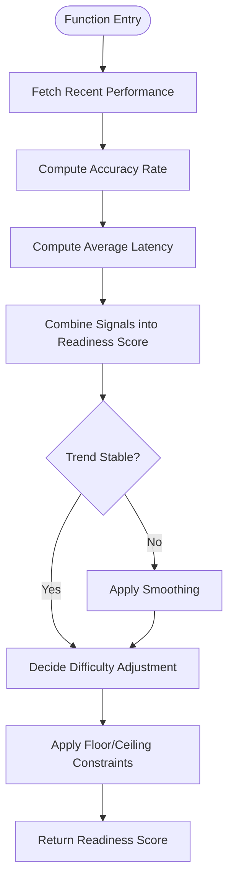
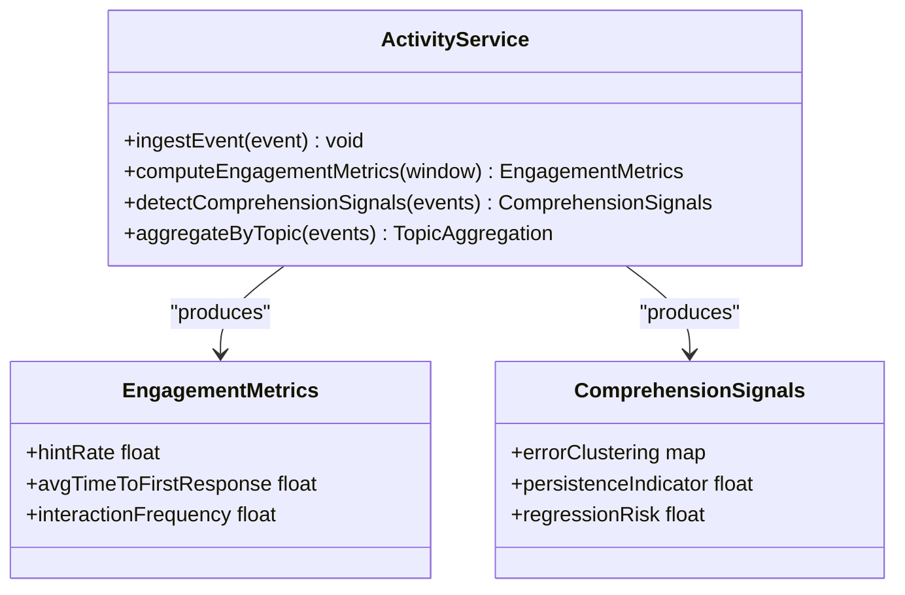
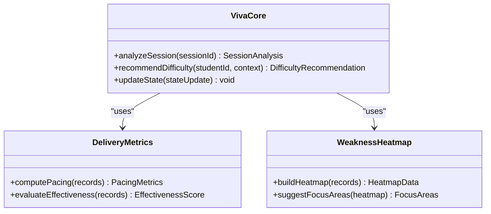
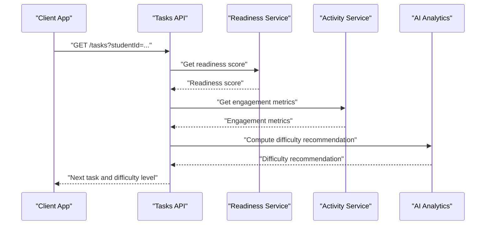
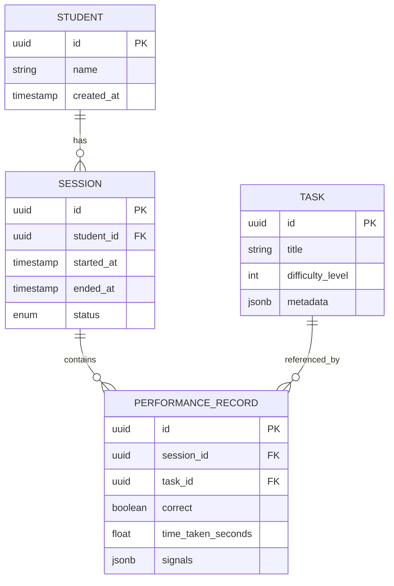
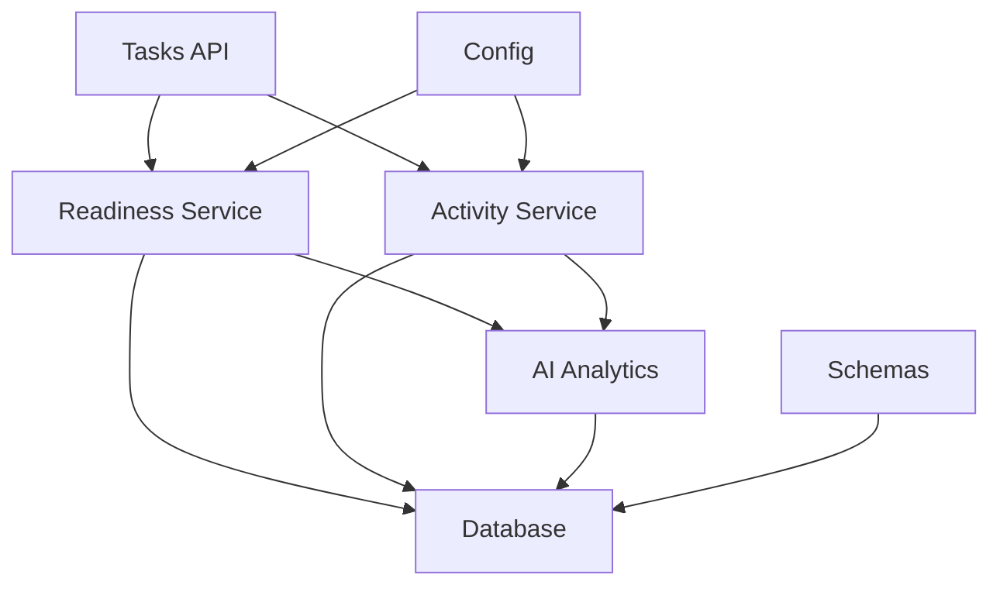

# Adaptive Difficulty System

<cite>
**Referenced Files in This Document**
- [main.py](file://backend/main.py)
- [config.py](file://backend/core/config.py)
- [database.py](file://backend/core/database.py)
- [schemas.py](file://backend/models/schemas.py)
- [supabase_schema.sql](file://backend/supabase_schema.sql)
- [readiness_service.py](file://backend/services/readiness_service.py)
- [activity_service.py](file://backend/services/activity_service.py)
- [analytics.py](file://backend/api/analytics.py)
- [tasks.py](file://backend/api/tasks.py)
- [viva_core.py](file://backend/ai/viva_core.py)
- [delivery_metrics.py](file://backend/ai/delivery_metrics.py)
- [weakness_heatmap.py](file://backend/ai/weakness_heatmap.py)
</cite>

## Table of Contents
1. [Introduction](#introduction)
2. [Project Structure](#project-structure)
3. [Core Components](#core-components)
4. [Architecture Overview](#architecture-overview)
5. [Detailed Component Analysis](#detailed-component-analysis)
6. [Dependency Analysis](#dependency-analysis)
7. [Performance Considerations](#performance-considerations)
8. [Troubleshooting Guide](#troubleshooting-guide)
9. [Conclusion](#conclusion)
10. [Appendices](#appendices)

## Introduction
This document describes the adaptive difficulty adjustment system that personalizes examination experiences based on student performance. It explains how response patterns, time taken, and accuracy rates are analyzed to dynamically adjust question complexity. The documentation covers the difficulty level taxonomy, progression rules, ceiling/floor constraints, real-time adaptation mechanisms driven by engagement and comprehension signals, calibration parameters, thresholds, customization options for learning objectives, and strategies to balance challenge with achievability.

## Project Structure
The adaptive difficulty system is implemented across backend services, APIs, AI analytics, and data models:
- Core configuration and database access provide foundational settings and persistence.
- Services compute readiness and activity metrics used for difficulty decisions.
- API endpoints expose functionality for task selection and analytics.
- AI modules analyze performance and generate insights such as weakness heatmaps and delivery metrics.
- Data schemas define entities and relationships relevant to sessions, tasks, and performance records.

**Diagram sources**
- [analytics.py](file://backend/api/analytics.py)
- [tasks.py](file://backend/api/tasks.py)
- [readiness_service.py](file://backend/services/readiness_service.py)
- [activity_service.py](file://backend/services/activity_service.py)
- [viva_core.py](file://backend/ai/viva_core.py)
- [delivery_metrics.py](file://backend/ai/delivery_metrics.py)
- [weakness_heatmap.py](file://backend/ai/weakness_heatmap.py)
- [config.py](file://backend/core/config.py)
- [database.py](file://backend/core/database.py)
- [schemas.py](file://backend/models/schemas.py)
- [supabase_schema.sql](file://backend/supabase_schema.sql)

**Section sources**
- [main.py](file://backend/main.py)
- [config.py](file://backend/core/config.py)
- [database.py](file://backend/core/database.py)
- [schemas.py](file://backend/models/schemas.py)
- [supabase_schema.sql](file://backend/supabase_schema.sql)

## Core Components
- Readiness Service: Computes learner readiness scores from recent performance and activity signals. These scores inform difficulty adjustments.
- Activity Service: Aggregates interaction events (e.g., attempts, time-on-task, hints) to derive engagement and comprehension indicators.
- AI Modules: Provide advanced analytics including delivery metrics and weakness heatmaps to refine difficulty selection and pacing.
- API Layer: Exposes endpoints for retrieving tasks and analytics, enabling client-side or server-side decision-making for adaptive sequencing.
- Core Configuration and Database: Centralize environment settings and persistence for session state, task metadata, and performance logs.

Key responsibilities:
- Maintain a difficulty model per learner/session.
- Update difficulty levels based on rolling windows of accuracy, latency, and error patterns.
- Enforce floor/ceiling constraints to ensure questions remain within pedagogical bounds.
- Surface actionable insights via analytics endpoints for dashboards and interventions.

**Section sources**
- [readiness_service.py](file://backend/services/readiness_service.py)
- [activity_service.py](file://backend/services/activity_service.py)
- [viva_core.py](file://backend/ai/viva_core.py)
- [delivery_metrics.py](file://backend/ai/delivery_metrics.py)
- [weakness_heatmap.py](file://backend/ai/weakness_heatmap.py)
- [analytics.py](file://backend/api/analytics.py)
- [tasks.py](file://backend/api/tasks.py)
- [config.py](file://backend/core/config.py)
- [database.py](file://backend/core/database.py)
- [schemas.py](file://backend/models/schemas.py)

## Architecture Overview
The adaptive difficulty system follows a layered architecture:
- Client requests task selection or submits responses.
- API layer validates inputs and delegates to services.
- Services compute readiness and activity metrics, then consult AI analytics for nuanced insights.
- Core configuration and database manage persistent state and environment parameters.
- Results are returned to clients for UI updates and further interactions.

**Diagram sources**
- [tasks.py](file://backend/api/tasks.py)
- [readiness_service.py](file://backend/services/readiness_service.py)
- [activity_service.py](file://backend/services/activity_service.py)
- [viva_core.py](file://backend/ai/viva_core.py)
- [database.py](file://backend/core/database.py)

## Detailed Component Analysis

### Readiness Service
Responsibilities:
- Aggregate recent accuracy, time-on-task, and error types.
- Compute a readiness score that reflects current mastery.
- Recommend difficulty adjustments based on thresholds and trends.

Algorithm highlights:
- Rolling window analysis of last N responses.
- Weighted combination of accuracy and latency signals.
- Trend detection to avoid oscillation between difficulty levels.

**Diagram sources**
- [readiness_service.py](file://backend/services/readiness_service.py)

**Section sources**
- [readiness_service.py](file://backend/services/readiness_service.py)

### Activity Service
Responsibilities:
- Ingest interaction events (attempts, hints, pauses).
- Derive engagement and comprehension proxies (e.g., hint frequency, time-to-first-response).
- Feed these signals into difficulty decisions.

Key metrics:
- Hint usage rate.
- Time-to-first-response distribution.
- Error clustering by topic or skill.

**Diagram sources**
- [activity_service.py](file://backend/services/activity_service.py)

**Section sources**
- [activity_service.py](file://backend/services/activity_service.py)

### AI Analytics Modules
Responsibilities:
- Viva Core: Orchestrates adaptive logic and integrates with session state.
- Delivery Metrics: Quantifies pacing and effectiveness of content delivery.
- Weakness Heatmap: Identifies knowledge gaps to guide targeted difficulty adjustments.

**Diagram sources**
- [viva_core.py](file://backend/ai/viva_core.py)
- [delivery_metrics.py](file://backend/ai/delivery_metrics.py)
- [weakness_heatmap.py](file://backend/ai/weakness_heatmap.py)

**Section sources**
- [viva_core.py](file://backend/ai/viva_core.py)
- [delivery_metrics.py](file://backend/ai/delivery_metrics.py)
- [weakness_heatmap.py](file://backend/ai/weakness_heatmap.py)

### API Layer
Responsibilities:
- Tasks API: Provides task selection and difficulty metadata.
- Analytics API: Exposes readiness and engagement metrics for dashboards.

**Diagram sources**
- [tasks.py](file://backend/api/tasks.py)
- [analytics.py](file://backend/api/analytics.py)
- [readiness_service.py](file://backend/services/readiness_service.py)
- [activity_service.py](file://backend/services/activity_service.py)
- [viva_core.py](file://backend/ai/viva_core.py)

**Section sources**
- [tasks.py](file://backend/api/tasks.py)
- [analytics.py](file://backend/api/analytics.py)

### Data Models and Persistence
Responsibilities:
- Define entities for students, sessions, tasks, and performance records.
- Manage schema migrations and relationships.

**Diagram sources**
- [schemas.py](file://backend/models/schemas.py)
- [supabase_schema.sql](file://backend/supabase_schema.sql)

**Section sources**
- [schemas.py](file://backend/models/schemas.py)
- [supabase_schema.sql](file://backend/supabase_schema.sql)

## Dependency Analysis
The adaptive difficulty system exhibits clear separation of concerns:
- API layer depends on services for business logic.
- Services depend on core configuration and database for state and settings.
- AI modules depend on aggregated performance data to produce recommendations.
- Schemas and migrations define the contract between services and persistence.

**Diagram sources**
- [tasks.py](file://backend/api/tasks.py)
- [readiness_service.py](file://backend/services/readiness_service.py)
- [activity_service.py](file://backend/services/activity_service.py)
- [viva_core.py](file://backend/ai/viva_core.py)
- [delivery_metrics.py](file://backend/ai/delivery_metrics.py)
- [weakness_heatmap.py](file://backend/ai/weakness_heatmap.py)
- [config.py](file://backend/core/config.py)
- [database.py](file://backend/core/database.py)
- [schemas.py](file://backend/models/schemas.py)

**Section sources**
- [tasks.py](file://backend/api/tasks.py)
- [readiness_service.py](file://backend/services/readiness_service.py)
- [activity_service.py](file://backend/services/activity_service.py)
- [viva_core.py](file://backend/ai/viva_core.py)
- [delivery_metrics.py](file://backend/ai/delivery_metrics.py)
- [weakness_heatmap.py](file://backend/ai/weakness_heatmap.py)
- [config.py](file://backend/core/config.py)
- [database.py](file://backend/core/database.py)
- [schemas.py](file://backend/models/schemas.py)

## Performance Considerations
- Use rolling windows for accuracy and latency to reduce noise and improve responsiveness.
- Cache frequently accessed readiness scores and engagement metrics to minimize database load.
- Batch performance record queries to reduce round-trips during analytics computation.
- Apply smoothing techniques to prevent oscillation in difficulty transitions.
- Monitor AI module execution time and consider asynchronous processing for heavy computations.

[No sources needed since this section provides general guidance]

## Troubleshooting Guide
Common issues and resolutions:
- Stale readiness scores: Ensure periodic refresh of performance records and invalidate caches when new data arrives.
- Oscillating difficulty levels: Increase smoothing parameters or widen transition thresholds.
- High latency in analytics: Optimize database queries and consider precomputing metrics.
- Incorrect difficulty recommendations: Validate input signals and review threshold configurations.

**Section sources**
- [readiness_service.py](file://backend/services/readiness_service.py)
- [activity_service.py](file://backend/services/activity_service.py)
- [viva_core.py](file://backend/ai/viva_core.py)

## Conclusion
The adaptive difficulty system leverages readiness and activity metrics, enriched by AI analytics, to personalize examination experiences. By analyzing response patterns, time taken, and accuracy rates, it dynamically adjusts question complexity while maintaining pedagogical boundaries through floor/ceiling constraints. Proper calibration of thresholds and customization for learning objectives ensures an optimal balance between challenge and achievability, fostering effective learning outcomes.

[No sources needed since this section summarizes without analyzing specific files]

## Appendices

### Difficulty Level Taxonomy
- Levels: Beginner, Intermediate, Advanced, Expert.
- Mapping: Derived from readiness scores and topic mastery.
- Transitions: Incremental increases/decreases based on performance trends.

### Progression Rules
- Increase difficulty after sustained accuracy above threshold.
- Decrease difficulty if latency spikes and errors cluster.
- Enforce minimum dwell time before promotion to prevent premature advancement.

### Ceiling/Floor Constraints
- Minimum difficulty ensures foundational concepts are reinforced.
- Maximum difficulty prevents cognitive overload.
- Constraints are enforced at API and service layers.

### Real-Time Adaptation Mechanisms
- Continuous ingestion of interaction events.
- Rolling window calculations for accuracy and latency.
- Engagement signals (hints, pauses) modulate pacing.

### Calibration Parameters and Thresholds
- Accuracy thresholds for promotion/demotion.
- Latency thresholds indicating confusion or fluency.
- Smoothing factors to stabilize transitions.

### Customization Options
- Learning objective-specific weights for accuracy vs. speed.
- Topic-specific difficulty curves.
- Instructor-defined constraints and targets.

[No sources needed since this section provides general guidance]