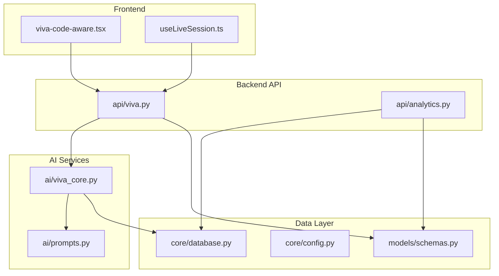
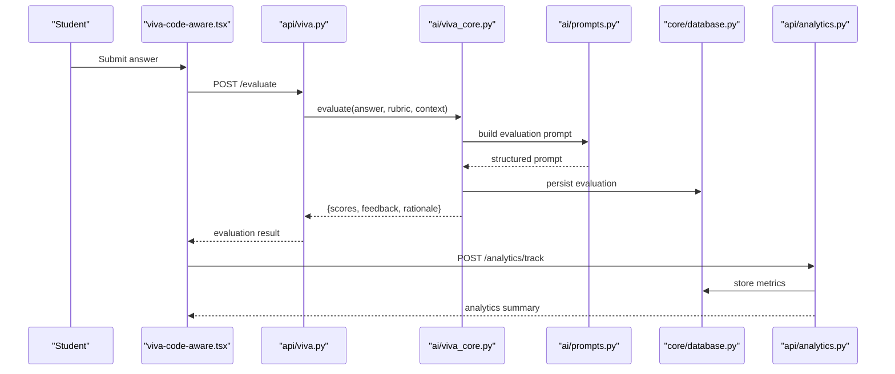
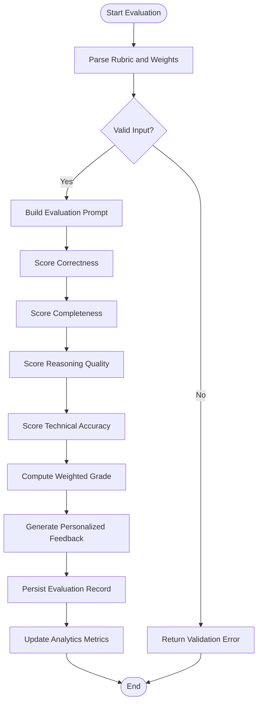
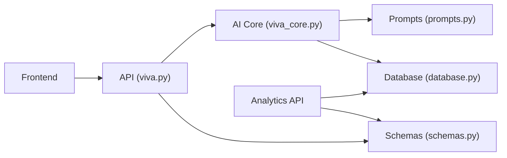

# Answer Evaluation Engine

<cite>
**Referenced Files in This Document**
- [backend/ai/viva_core.py](file://backend/ai/viva_core.py)
- [backend/ai/prompts.py](file://backend/ai/prompts.py)
- [backend/api/viva.py](file://backend/api/viva.py)
- [backend/models/schemas.py](file://backend/models/schemas.py)
- [backend/core/config.py](file://backend/core/config.py)
- [backend/core/database.py](file://backend/core/database.py)
- [backend/services/readiness_service.py](file://backend/services/readiness_service.py)
- [backend/api/analytics.py](file://backend/api/analytics.py)
- [src/routes/advanced/viva-code-aware.tsx](file://src/routes/advanced/viva-code-aware.tsx)
- [src/lib/useLiveSession.ts](file://src/lib/useLiveSession.ts)
</cite>

## Table of Contents
1. [Introduction](#introduction)
2. [Project Structure](#project-structure)
3. [Core Components](#core-components)
4. [Architecture Overview](#architecture-overview)
5. [Detailed Component Analysis](#detailed-component-analysis)
6. [Dependency Analysis](#dependency-analysis)
7. [Performance Considerations](#performance-considerations)
8. [Troubleshooting Guide](#troubleshooting-guide)
9. [Conclusion](#conclusion)
10. [Appendices](#appendices)

## Introduction
This document explains the answer evaluation engine that processes and scores student responses across multiple criteria: correctness, completeness, reasoning quality, and technical accuracy. It covers scoring algorithms, rubric implementation, grade calculation methods, feedback generation, examples for different question types, custom grading rubrics, automated feedback templates, and integration with learning analytics to track improvement patterns and identify knowledge gaps.

## Project Structure
The evaluation engine spans backend AI services, API endpoints, data schemas, configuration, database access, and frontend components that orchestrate live sessions and display results. Key areas include:
- AI core logic for evaluation and feedback generation
- Prompt engineering for consistent rubric application
- API endpoints exposing evaluation and analytics capabilities
- Data models defining evaluation inputs and outputs
- Configuration and database utilities
- Frontend hooks and routes driving live evaluation flows

**Diagram sources**
- [backend/api/viva.py](file://backend/api/viva.py)
- [backend/ai/viva_core.py](file://backend/ai/viva_core.py)
- [backend/ai/prompts.py](file://backend/ai/prompts.py)
- [backend/models/schemas.py](file://backend/models/schemas.py)
- [backend/core/config.py](file://backend/core/config.py)
- [backend/core/database.py](file://backend/core/database.py)
- [src/routes/advanced/viva-code-aware.tsx](file://src/routes/advanced/viva-code-aware.tsx)
- [src/lib/useLiveSession.ts](file://src/lib/useLiveSession.ts)

**Section sources**
- [backend/api/viva.py](file://backend/api/viva.py)
- [backend/ai/viva_core.py](file://backend/ai/viva_core.py)
- [backend/ai/prompts.py](file://backend/ai/prompts.py)
- [backend/models/schemas.py](file://backend/models/schemas.py)
- [backend/core/config.py](file://backend/core/config.py)
- [backend/core/database.py](file://backend/core/database.py)
- [src/routes/advanced/viva-code-aware.tsx](file://src/routes/advanced/viva-code-aware.tsx)
- [src/lib/useLiveSession.ts](file://src/lib/useLiveSession.ts)

## Core Components
- Viva Core: Orchestrates evaluation workflows, applies rubrics, computes scores, and generates feedback.
- Prompts: Defines structured prompts that encode evaluation criteria and rubric instructions for consistent AI behavior.
- API (Viva): Exposes endpoints to submit answers, retrieve evaluations, and manage sessions.
- Schemas: Defines request/response structures for evaluations, including multi-criteria scoring and feedback payloads.
- Config: Centralizes environment variables and feature flags affecting evaluation behavior.
- Database: Provides persistence for evaluations, rubrics, and analytics metrics.
- Readiness Service: Aggregates performance indicators and readiness signals from evaluations.
- Analytics API: Exposes metrics for tracking improvement patterns and identifying knowledge gaps.

**Section sources**
- [backend/ai/viva_core.py](file://backend/ai/viva_core.py)
- [backend/ai/prompts.py](file://backend/ai/prompts.py)
- [backend/api/viva.py](file://backend/api/viva.py)
- [backend/models/schemas.py](file://backend/models/schemas.py)
- [backend/core/config.py](file://backend/core/config.py)
- [backend/core/database.py](file://backend/core/database.py)
- [backend/services/readiness_service.py](file://backend/services/readiness_service.py)
- [backend/api/analytics.py](file://backend/api/analytics.py)

## Architecture Overview
The evaluation pipeline integrates frontend interactions with backend AI-driven assessment and analytics. Students submit answers through the UI; the backend evaluates them using rubric-encoded prompts and returns structured scores and feedback. Analytics capture longitudinal performance to inform personalized guidance.

**Diagram sources**
- [backend/api/viva.py](file://backend/api/viva.py)
- [backend/ai/viva_core.py](file://backend/ai/viva_core.py)
- [backend/ai/prompts.py](file://backend/ai/prompts.py)
- [backend/core/database.py](file://backend/core/database.py)
- [backend/api/analytics.py](file://backend/api/analytics.py)
- [src/routes/advanced/viva-code-aware.tsx](file://src/routes/advanced/viva-code-aware.tsx)

## Detailed Component Analysis

### Viva Core: Evaluation Orchestration
Responsibilities:
- Accepts answer text, rubric definitions, and contextual metadata.
- Applies multi-criteria scoring: correctness, completeness, reasoning quality, technical accuracy.
- Computes weighted grades based on rubric weights.
- Generates constructive, personalized feedback aligned with identified strengths and weaknesses.
- Persists evaluation records and updates analytics counters.

Key behaviors:
- Rubric parsing and validation ensure consistent scoring across question types.
- Feedback generation uses structured rationale to guide improvement.
- Error handling isolates failures per criterion and preserves partial results.

**Diagram sources**
- [backend/ai/viva_core.py](file://backend/ai/viva_core.py)
- [backend/ai/prompts.py](file://backend/ai/prompts.py)
- [backend/core/database.py](file://backend/core/database.py)

**Section sources**
- [backend/ai/viva_core.py](file://backend/ai/viva_core.py)
- [backend/ai/prompts.py](file://backend/ai/prompts.py)
- [backend/core/database.py](file://backend/core/database.py)

### Prompts: Rubric Encoding and Consistency
Responsibilities:
- Encodes evaluation criteria into structured prompts for deterministic behavior.
- Supports customizable rubrics per question type and domain.
- Ensures consistent language and scoring anchors across evaluations.

Design patterns:
- Template-based prompt construction with placeholders for criteria and context.
- Explicit instruction sets for each scoring dimension.
- Output schema enforcement to standardize evaluation payloads.

**Section sources**
- [backend/ai/prompts.py](file://backend/ai/prompts.py)

### API (Viva): Evaluation Endpoints
Responsibilities:
- Receives evaluation requests and validates payloads against schemas.
- Invokes viva core to compute scores and feedback.
- Returns structured responses including scores, rationale, and actionable feedback.
- Integrates with analytics to record evaluation events.

Endpoints overview:
- Evaluate answer: submits response and rubric, returns evaluation result.
- Retrieve session evaluations: fetches historical evaluations for a session or user.
- Track analytics: logs performance metrics and progress indicators.

**Section sources**
- [backend/api/viva.py](file://backend/api/viva.py)
- [backend/models/schemas.py](file://backend/models/schemas.py)

### Schemas: Data Contracts
Responsibilities:
- Defines request/response structures for evaluations, rubrics, and analytics.
- Enforces field types, constraints, and optional fields.
- Supports extensibility for new criteria and feedback formats.

Key structures:
- EvaluationRequest: includes answer text, rubric definition, and context.
- EvaluationResponse: includes per-criterion scores, overall grade, rationale, and feedback.
- AnalyticsEvent: captures evaluation outcomes and derived metrics.

**Section sources**
- [backend/models/schemas.py](file://backend/models/schemas.py)

### Config and Database: Environment and Persistence
Responsibilities:
- Config centralizes settings such as model providers, scoring weights, and feature toggles.
- Database provides storage for evaluations, rubrics, and analytics records.

Integration points:
- Viva core reads rubric configurations and writes evaluation results.
- Analytics API queries aggregated metrics for dashboards and insights.

**Section sources**
- [backend/core/config.py](file://backend/core/config.py)
- [backend/core/database.py](file://backend/core/database.py)

### Readiness Service: Performance Indicators
Responsibilities:
- Aggregates evaluation outcomes to compute readiness signals.
- Identifies knowledge gaps by analyzing weak criteria across sessions.
- Produces summaries for learners and instructors.

Outputs:
- Readiness score reflecting overall preparedness.
- Gap analysis highlighting underperforming criteria.

**Section sources**
- [backend/services/readiness_service.py](file://backend/services/readiness_service.py)

### Analytics API: Tracking Improvement Patterns
Responsibilities:
- Records evaluation events and aggregates trends over time.
- Exposes endpoints for dashboards and personalized recommendations.
- Supports cohort-level analytics for instructional insights.

Metrics:
- Per-criterion trend lines.
- Overall grade progression.
- Knowledge gap frequency and severity.

**Section sources**
- [backend/api/analytics.py](file://backend/api/analytics.py)

### Frontend Integration: Live Sessions and Results
Responsibilities:
- Orchestrates submission flow and displays evaluation results.
- Uses hooks to manage session state and real-time updates.
- Presents feedback and readiness indicators to learners.

Components:
- viva-code-aware route handles code-aware evaluations and displays results.
- useLiveSession hook manages session lifecycle and data binding.

**Section sources**
- [src/routes/advanced/viva-code-aware.tsx](file://src/routes/advanced/viva-code-aware.tsx)
- [src/lib/useLiveSession.ts](file://src/lib/useLiveSession.ts)

## Dependency Analysis
The evaluation engine exhibits clear separation between API, AI services, data models, and infrastructure layers. Dependencies are primarily unidirectional:
- Frontend depends on API endpoints.
- API depends on AI core and schemas.
- AI core depends on prompts and database.
- Analytics depends on database and schemas.

**Diagram sources**
- [backend/api/viva.py](file://backend/api/viva.py)
- [backend/ai/viva_core.py](file://backend/ai/viva_core.py)
- [backend/ai/prompts.py](file://backend/ai/prompts.py)
- [backend/core/database.py](file://backend/core/database.py)
- [backend/models/schemas.py](file://backend/models/schemas.py)
- [backend/api/analytics.py](file://backend/api/analytics.py)

**Section sources**
- [backend/api/viva.py](file://backend/api/viva.py)
- [backend/ai/viva_core.py](file://backend/ai/viva_core.py)
- [backend/ai/prompts.py](file://backend/ai/prompts.py)
- [backend/core/database.py](file://backend/core/database.py)
- [backend/models/schemas.py](file://backend/models/schemas.py)
- [backend/api/analytics.py](file://backend/api/analytics.py)

## Performance Considerations
- Prompt efficiency: Minimize token usage by concise rubric encoding and targeted context.
- Caching: Cache frequent rubric templates and common feedback patterns.
- Batch processing: Aggregate evaluations for analytics to reduce database load.
- Asynchronous operations: Offload heavy computations to background tasks where possible.
- Model selection: Use cost-effective models for routine evaluations and reserve advanced models for complex reasoning.

[No sources needed since this section provides general guidance]

## Troubleshooting Guide
Common issues and resolutions:
- Invalid input payloads: Ensure schemas are strictly enforced and validate required fields before submission.
- Inconsistent scoring: Verify rubric templates and prompt consistency; check for drift in model behavior.
- Missing analytics records: Confirm analytics endpoint calls and database write permissions.
- Slow evaluation latency: Optimize prompts, enable caching, and consider asynchronous processing.

**Section sources**
- [backend/models/schemas.py](file://backend/models/schemas.py)
- [backend/api/viva.py](file://backend/api/viva.py)
- [backend/api/analytics.py](file://backend/api/analytics.py)

## Conclusion
The answer evaluation engine delivers a robust, multi-criteria assessment system grounded in structured prompts and configurable rubrics. It produces actionable feedback, supports personalized learning paths, and integrates analytics to track progress and identify knowledge gaps. By adhering to clear architecture and dependency boundaries, the system remains scalable and maintainable while providing meaningful insights for learners and educators.

[No sources needed since this section summarizes without analyzing specific files]

## Appendices

### Scoring Algorithms and Grade Calculation
- Multi-criteria scoring: Each criterion receives a normalized score (e.g., 0–1).
- Weighted aggregation: Overall grade is computed as the sum of criterion scores multiplied by their respective weights.
- Thresholds and bands: Define pass/fail thresholds and grade bands for reporting.

Example criteria mapping:
- Correctness: Binary or scaled score based on factual accuracy.
- Completeness: Coverage of required elements and depth.
- Reasoning quality: Logical coherence and justification strength.
- Technical accuracy: Precision of terminology and methodological soundness.

**Section sources**
- [backend/ai/viva_core.py](file://backend/ai/viva_core.py)
- [backend/models/schemas.py](file://backend/models/schemas.py)

### Custom Grading Rubrics
- Rubric structure: Define criteria, weights, anchors, and descriptors.
- Question-type specialization: Tailor rubrics for multiple-choice, short-answer, essay, and code-based questions.
- Versioning: Maintain rubric versions to support evolution and auditability.

**Section sources**
- [backend/ai/prompts.py](file://backend/ai/prompts.py)
- [backend/models/schemas.py](file://backend/models/schemas.py)

### Automated Feedback Templates
- Personalization: Reference specific strengths and weaknesses identified during evaluation.
- Actionable guidance: Provide concrete steps for improvement and resources.
- Tone and clarity: Maintain supportive, instructive language aligned with pedagogical goals.

**Section sources**
- [backend/ai/viva_core.py](file://backend/ai/viva_core.py)
- [backend/ai/prompts.py](file://backend/ai/prompts.py)

### Learning Analytics Integration
- Tracking: Record per-criterion scores and overall grades over time.
- Gap identification: Highlight recurring weak areas and suggest targeted practice.
- Dashboards: Visualize trends and readiness indicators for learners and instructors.

**Section sources**
- [backend/api/analytics.py](file://backend/api/analytics.py)
- [backend/services/readiness_service.py](file://backend/services/readiness_service.py)