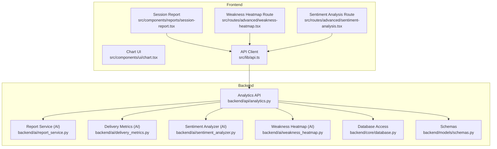
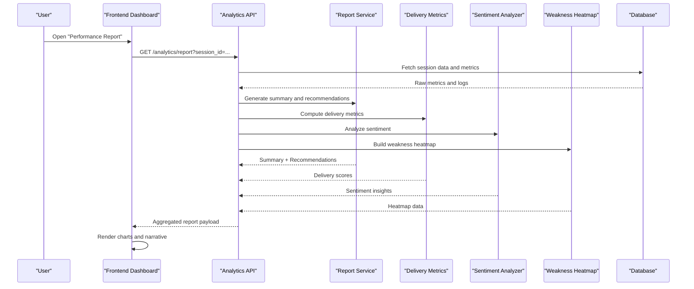
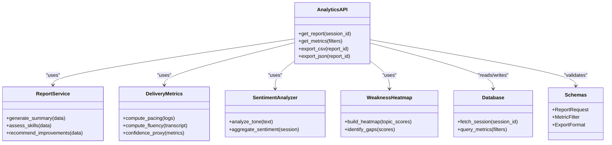
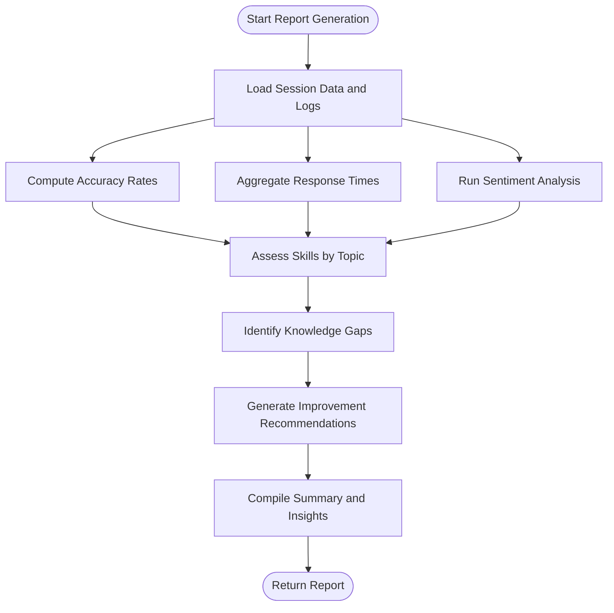
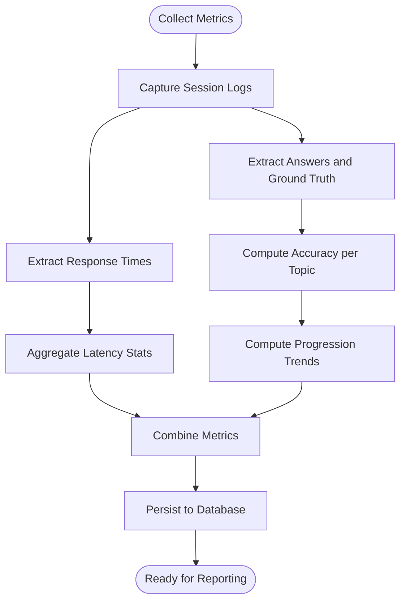
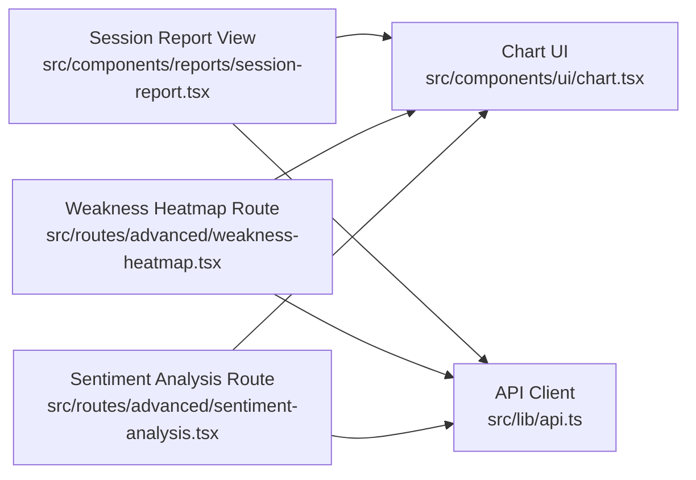
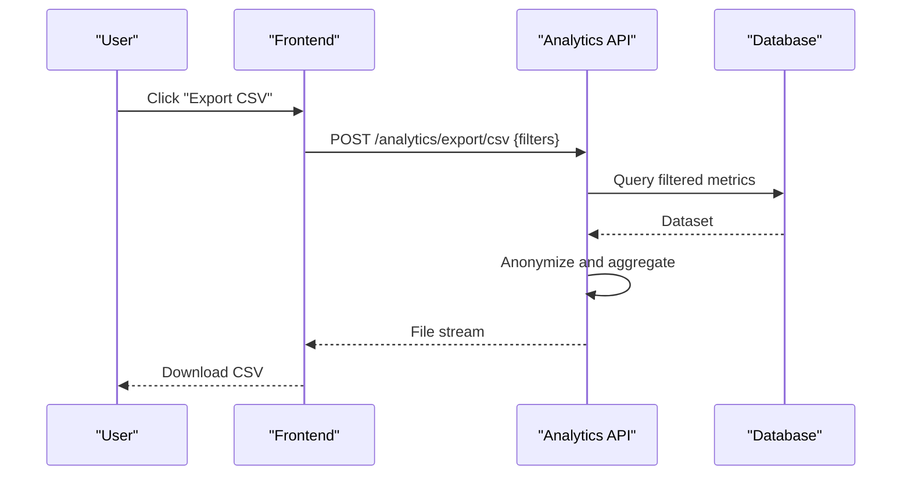
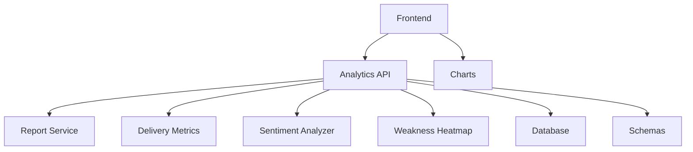

# Performance Analytics & Reporting

<cite>
**Referenced Files in This Document**
- [backend/api/analytics.py](file://backend/api/analytics.py)
- [backend/ai/report_service.py](file://backend/ai/report_service.py)
- [backend/ai/delivery_metrics.py](file://backend/ai/delivery_metrics.py)
- [backend/ai/sentiment_analyzer.py](file://backend/ai/sentiment_analyzer.py)
- [backend/ai/weakness_heatmap.py](file://backend/ai/weakness_heatmap.py)
- [backend/core/database.py](file://backend/core/database.py)
- [backend/models/schemas.py](file://backend/models/schemas.py)
- [src/components/reports/session-report.tsx](file://src/components/reports/session-report.tsx)
- [src/components/ui/chart.tsx](file://src/components/ui/chart.tsx)
- [src/routes/advanced/weakness-heatmap.tsx](file://src/routes/advanced/weakness-heatmap.tsx)
- [src/routes/advanced/sentiment-analysis.tsx](file://src/routes/advanced/sentiment-analysis.tsx)
- [src/lib/api.ts](file://src/lib/api.ts)
</cite>

## Table of Contents
1. [Introduction](#introduction)
2. [Project Structure](#project-structure)
3. [Core Components](#core-components)
4. [Architecture Overview](#architecture-overview)
5. [Detailed Component Analysis](#detailed-component-analysis)
6. [Dependency Analysis](#dependency-analysis)
7. [Performance Considerations](#performance-considerations)
8. [Troubleshooting Guide](#troubleshooting-guide)
9. [Conclusion](#conclusion)
10. [Appendices](#appendices)

## Introduction
This document explains the performance analytics and reporting system that transforms examination data into actionable insights. It covers:
- Metrics collection framework for response times, accuracy rates, and learning progression indicators
- Report generation algorithms producing comprehensive summaries, skill assessments, and improvement recommendations
- Visualization components and data export capabilities for stakeholders
- Examples of custom report templates, analytical dashboards, and integration with external learning management systems (LMS)
- Data privacy considerations and anonymization techniques used in reporting

The system is implemented as a backend API with AI-powered analysis services and a frontend dashboard for visualization and export.

## Project Structure
The analytics and reporting functionality spans backend APIs, AI services, database access, models, and frontend visualization routes and components.

**Diagram sources**
- [backend/api/analytics.py](file://backend/api/analytics.py)
- [backend/ai/report_service.py](file://backend/ai/report_service.py)
- [backend/ai/delivery_metrics.py](file://backend/ai/delivery_metrics.py)
- [backend/ai/sentiment_analyzer.py](file://backend/ai/sentiment_analyzer.py)
- [backend/ai/weakness_heatmap.py](file://backend/ai/weakness_heatmap.py)
- [backend/core/database.py](file://backend/core/database.py)
- [backend/models/schemas.py](file://backend/models/schemas.py)
- [src/components/reports/session-report.tsx](file://src/components/reports/session-report.tsx)
- [src/routes/advanced/weakness-heatmap.tsx](file://src/routes/advanced/weakness-heatmap.tsx)
- [src/routes/advanced/sentiment-analysis.tsx](file://src/routes/advanced/sentiment-analysis.tsx)
- [src/components/ui/chart.tsx](file://src/components/ui/chart.tsx)
- [src/lib/api.ts](file://src/lib/api.ts)

**Section sources**
- [backend/api/analytics.py](file://backend/api/analytics.py)
- [backend/ai/report_service.py](file://backend/ai/report_service.py)
- [backend/ai/delivery_metrics.py](file://backend/ai/delivery_metrics.py)
- [backend/ai/sentiment_analyzer.py](file://backend/ai/sentiment_analyzer.py)
- [backend/ai/weakness_heatmap.py](file://backend/ai/weakness_heatmap.py)
- [backend/core/database.py](file://backend/core/database.py)
- [backend/models/schemas.py](file://backend/models/schemas.py)
- [src/components/reports/session-report.tsx](file://src/components/reports/session-report.tsx)
- [src/routes/advanced/weakness-heatmap.tsx](file://src/routes/advanced/weakness-heatmap.tsx)
- [src/routes/advanced/sentiment-analysis.tsx](file://src/routes/advanced/sentiment-analysis.tsx)
- [src/components/ui/chart.tsx](file://src/components/ui/chart.tsx)
- [src/lib/api.ts](file://src/lib/api.ts)

## Core Components
- Analytics API: Orchestrates requests to collect metrics, generate reports, and serve visualizations.
- AI Report Service: Produces comprehensive performance summaries, skill assessments, and improvement recommendations using AI-driven logic.
- Delivery Metrics: Computes delivery-related performance indicators such as pacing, fluency, and confidence proxies.
- Sentiment Analyzer: Analyzes tone and sentiment from session transcripts or responses to enrich insights.
- Weakness Heatmap: Identifies knowledge gaps and patterns across topics and sessions.
- Database Access: Provides persistence and retrieval of raw and aggregated metrics.
- Schemas: Defines request/response contracts and internal data structures.
- Frontend Reports and Dashboards: Renders charts, heatmaps, and narrative summaries; supports export.

Key responsibilities:
- Metrics collection: Response time tracking, accuracy computation, and learning progression indicators
- Report generation: Summaries, skill assessments, and recommendations
- Visualization: Charts, heatmaps, and narrative panels
- Export: CSV/JSON exports for stakeholder consumption
- Privacy: Anonymization and aggregation before exposure

**Section sources**
- [backend/api/analytics.py](file://backend/api/analytics.py)
- [backend/ai/report_service.py](file://backend/ai/report_service.py)
- [backend/ai/delivery_metrics.py](file://backend/ai/delivery_metrics.py)
- [backend/ai/sentiment_analyzer.py](file://backend/ai/sentiment_analyzer.py)
- [backend/ai/weakness_heatmap.py](file://backend/ai/weakness_heatmap.py)
- [backend/core/database.py](file://backend/core/database.py)
- [backend/models/schemas.py](file://backend/models/schemas.py)
- [src/components/reports/session-report.tsx](file://src/components/reports/session-report.tsx)
- [src/routes/advanced/weakness-heatmap.tsx](file://src/routes/advanced/weakness-heatmap.tsx)
- [src/routes/advanced/sentiment-analysis.tsx](file://src/routes/advanced/sentiment-analysis.tsx)
- [src/components/ui/chart.tsx](file://src/components/ui/chart.tsx)
- [src/lib/api.ts](file://src/lib/api.ts)

## Architecture Overview
The system follows a layered architecture:
- Presentation layer: React-based dashboards and report views
- API layer: FastAPI endpoints aggregating analytics and report generation
- Services layer: AI-powered modules for metrics, sentiment, and heatmap analysis
- Data layer: Database access and schema definitions

**Diagram sources**
- [backend/api/analytics.py](file://backend/api/analytics.py)
- [backend/ai/report_service.py](file://backend/ai/report_service.py)
- [backend/ai/delivery_metrics.py](file://backend/ai/delivery_metrics.py)
- [backend/ai/sentiment_analyzer.py](file://backend/ai/sentiment_analyzer.py)
- [backend/ai/weakness_heatmap.py](file://backend/ai/weakness_heatmap.py)
- [backend/core/database.py](file://backend/core/database.py)

## Detailed Component Analysis

### Analytics API
Responsibilities:
- Expose endpoints for report generation, metric queries, and export
- Aggregate results from AI services and database
- Enforce input validation via schemas
- Apply anonymization and aggregation rules before returning data

**Diagram sources**
- [backend/api/analytics.py](file://backend/api/analytics.py)
- [backend/ai/report_service.py](file://backend/ai/report_service.py)
- [backend/ai/delivery_metrics.py](file://backend/ai/delivery_metrics.py)
- [backend/ai/sentiment_analyzer.py](file://backend/ai/sentiment_analyzer.py)
- [backend/ai/weakness_heatmap.py](file://backend/ai/weakness_heatmap.py)
- [backend/core/database.py](file://backend/core/database.py)
- [backend/models/schemas.py](file://backend/models/schemas.py)

**Section sources**
- [backend/api/analytics.py](file://backend/api/analytics.py)
- [backend/models/schemas.py](file://backend/models/schemas.py)

### Report Generation Algorithms
Capabilities:
- Comprehensive performance summaries combining accuracy, response time, and sentiment
- Skill assessments mapping performance to topic-level competencies
- Improvement recommendations derived from weakness detection and trends

**Diagram sources**
- [backend/ai/report_service.py](file://backend/ai/report_service.py)
- [backend/ai/sentiment_analyzer.py](file://backend/ai/sentiment_analyzer.py)
- [backend/ai/weakness_heatmap.py](file://backend/ai/weakness_heatmap.py)

**Section sources**
- [backend/ai/report_service.py](file://backend/ai/report_service.py)
- [backend/ai/sentiment_analyzer.py](file://backend/ai/sentiment_analyzer.py)
- [backend/ai/weakness_heatmap.py](file://backend/ai/weakness_heatmap.py)

### Metrics Collection Framework
Focus areas:
- Response times: Latency per question, average latency, percentiles
- Accuracy rates: Correct vs incorrect answers, topic-wise accuracy
- Learning progression indicators: Trending accuracy over time, gap closure rate

**Diagram sources**
- [backend/ai/delivery_metrics.py](file://backend/ai/delivery_metrics.py)
- [backend/core/database.py](file://backend/core/database.py)

**Section sources**
- [backend/ai/delivery_metrics.py](file://backend/ai/delivery_metrics.py)
- [backend/core/database.py](file://backend/core/database.py)

### Visualization Components
Frontend features:
- Session report view rendering narrative summaries and key metrics
- Chart components for time series, bar charts, and gauges
- Weakness heatmap route displaying topic-level gaps
- Sentiment analysis route showing tone distribution

**Diagram sources**
- [src/components/reports/session-report.tsx](file://src/components/reports/session-report.tsx)
- [src/components/ui/chart.tsx](file://src/components/ui/chart.tsx)
- [src/routes/advanced/weakness-heatmap.tsx](file://src/routes/advanced/weakness-heatmap.tsx)
- [src/routes/advanced/sentiment-analysis.tsx](file://src/routes/advanced/sentiment-analysis.tsx)
- [src/lib/api.ts](file://src/lib/api.ts)

**Section sources**
- [src/components/reports/session-report.tsx](file://src/components/reports/session-report.tsx)
- [src/components/ui/chart.tsx](file://src/components/ui/chart.tsx)
- [src/routes/advanced/weakness-heatmap.tsx](file://src/routes/advanced/weakness-heatmap.tsx)
- [src/routes/advanced/sentiment-analysis.tsx](file://src/routes/advanced/sentiment-analysis.tsx)
- [src/lib/api.ts](file://src/lib/api.ts)

### Data Export Capabilities
Exports support:
- CSV and JSON formats for stakeholder consumption
- Filtered datasets based on date ranges, topics, and session types
- Anonymized payloads suitable for sharing outside the platform

Typical flow:
- Request export with filters
- Backend aggregates and anonymizes data
- Return downloadable file or stream

**Diagram sources**
- [backend/api/analytics.py](file://backend/api/analytics.py)
- [backend/core/database.py](file://backend/core/database.py)

**Section sources**
- [backend/api/analytics.py](file://backend/api/analytics.py)
- [backend/core/database.py](file://backend/core/database.py)

### Custom Report Templates
Templates enable:
- Tailored layouts for different audiences (instructors, learners, administrators)
- Configurable sections: executive summary, skill breakdown, recommendations
- Branding and language customization

Template structure example:
- Header: Title, date range, audience
- Sections: Key metrics, charts, narrative insights, action items
- Footer: Disclaimers, anonymization notice

[No sources needed since this section provides conceptual guidance]

### Analytical Dashboards
Dashboards provide:
- Real-time overview of session performance
- Drill-down by topic, learner, or team
- Trend lines for progression indicators
- Alerts for anomalies or significant drops

[No sources needed since this section provides conceptual guidance]

### Integration with External LMS
Integration points:
- Ingest exam results and metadata from LMS via secure endpoints
- Push analytics back to LMS gradebooks or portfolios
- Support single sign-on and role-based access

Example workflow:
- LMS sends batch of exam records
- Backend validates and stores anonymized records
- Analytics pipeline computes metrics and updates dashboards
- LMS polls for updated scores or receives webhooks

[No sources needed since this section provides conceptual guidance]

### Data Privacy and Anonymization
Privacy measures:
- Remove direct identifiers before export or sharing
- Aggregate at cohort or topic level when required
- Retain only necessary fields for analysis
- Provide audit trails for data access and transformations

Anonymization steps:
- Strip names, IDs, and contact info
- Hash or generalize timestamps where not essential
- Ensure k-anonymity thresholds for small groups

**Section sources**
- [backend/api/analytics.py](file://backend/api/analytics.py)
- [backend/core/database.py](file://backend/core/database.py)

## Dependency Analysis
Component relationships and coupling:
- Analytics API depends on AI services and database
- AI services depend on schemas and database
- Frontend depends on API client and chart components

**Diagram sources**
- [backend/api/analytics.py](file://backend/api/analytics.py)
- [backend/ai/report_service.py](file://backend/ai/report_service.py)
- [backend/ai/delivery_metrics.py](file://backend/ai/delivery_metrics.py)
- [backend/ai/sentiment_analyzer.py](file://backend/ai/sentiment_analyzer.py)
- [backend/ai/weakness_heatmap.py](file://backend/ai/weakness_heatmap.py)
- [backend/core/database.py](file://backend/core/database.py)
- [backend/models/schemas.py](file://backend/models/schemas.py)
- [src/components/ui/chart.tsx](file://src/components/ui/chart.tsx)
- [src/lib/api.ts](file://src/lib/api.ts)

**Section sources**
- [backend/api/analytics.py](file://backend/api/analytics.py)
- [backend/models/schemas.py](file://backend/models/schemas.py)
- [src/lib/api.ts](file://src/lib/api.ts)

## Performance Considerations
- Batch processing for large datasets to avoid timeouts
- Caching frequently accessed aggregated metrics
- Indexing database tables by session_id, topic, and timestamp
- Streaming exports for large files
- Asynchronous report generation for heavy computations

[No sources needed since this section provides general guidance]

## Troubleshooting Guide
Common issues and resolutions:
- Missing session data: Verify session_id and permissions
- Slow report generation: Check database indexes and cache hits
- Export failures: Validate filters and ensure sufficient privileges
- Visualization errors: Confirm data shape matches expected schema

Debugging tips:
- Enable detailed logging around API entry points
- Inspect intermediate outputs from AI services
- Validate schema compliance for inputs and outputs

**Section sources**
- [backend/api/analytics.py](file://backend/api/analytics.py)
- [backend/core/database.py](file://backend/core/database.py)

## Conclusion
The performance analytics and reporting system integrates robust metrics collection, AI-driven report generation, and rich visualizations to deliver actionable insights. With strong privacy safeguards and flexible export options, it serves diverse stakeholders while maintaining data integrity and usability.

[No sources needed since this section summarizes without analyzing specific files]

## Appendices

### Example: Generating a Performance Summary
Steps:
- Request report with session filters
- Backend computes accuracy, response times, sentiment, and weaknesses
- Frontend renders summary and recommendations

[No sources needed since this section provides conceptual guidance]

### Example: Building a Weakness Heatmap
Steps:
- Collect topic-level scores across sessions
- Aggregate and normalize scores
- Render heatmap highlighting gaps

**Section sources**
- [backend/ai/weakness_heatmap.py](file://backend/ai/weakness_heatmap.py)
- [src/routes/advanced/weakness-heatmap.tsx](file://src/routes/advanced/weakness-heatmap.tsx)

### Example: Exporting an Anonymized Dataset
Steps:
- Define filters (date range, topics)
- Backend aggregates and removes identifiers
- Download CSV/JSON for further analysis

**Section sources**
- [backend/api/analytics.py](file://backend/api/analytics.py)
- [backend/core/database.py](file://backend/core/database.py)