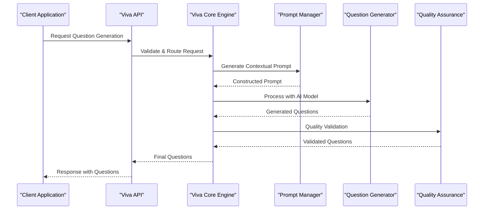
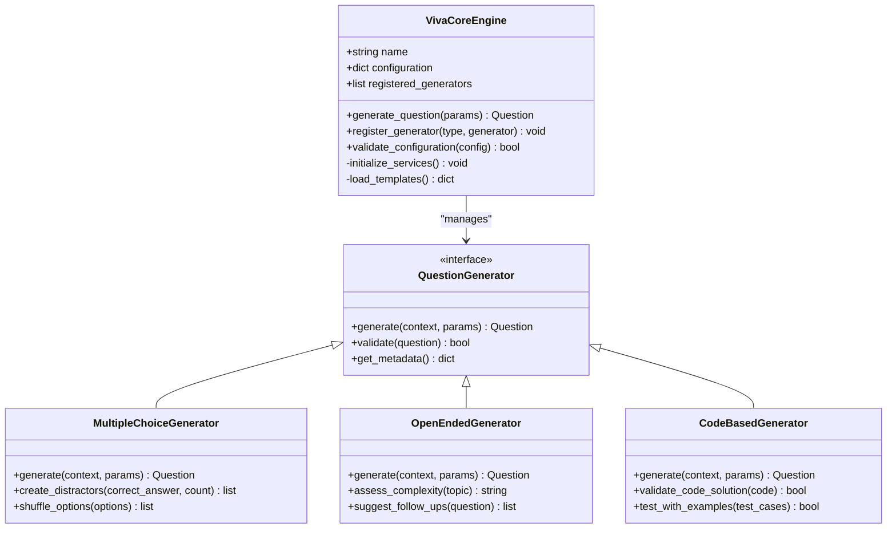
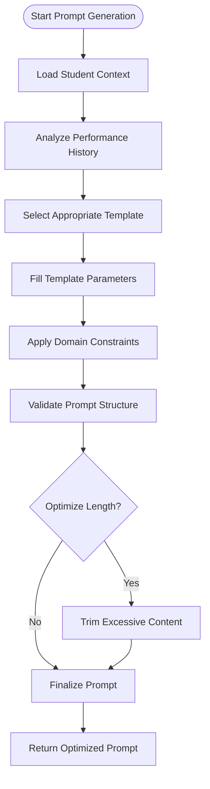

# Question Generation System

<cite>
**Referenced Files in This Document**
- [viva_core.py](file://backend/ai/viva_core.py)
- [prompts.py](file://backend/ai/prompts.py)
- [registry.py](file://backend/ai/registry.py)
- [code_aware_viva.py](file://backend/ai/code_aware_viva.py)
- [gemini_service.py](file://backend/ai/gemini_service.py)
- [live_service.py](file://backend/ai/live_service.py)
- [report_service.py](file://backend/ai/report_service.py)
- [sentiment_analyzer.py](file://backend/ai/sentiment_analyzer.py)
- [weakness_heatmap.py](file://backend/ai/weakness_heatmap.py)
- [viva.py](file://backend/api/viva.py)
- [templates.py](file://backend/api/templates.py)
- [schemas.py](file://backend/models/schemas.py)
</cite>

## Table of Contents
1. [Introduction](#introduction)
2. [Project Structure](#project-structure)
3. [Core Components](#core-components)
4. [Architecture Overview](#architecture-overview)
5. [Detailed Component Analysis](#detailed-component-analysis)
6. [Question Type Classification System](#question-type-classification-system)
7. [Prompt Engineering Strategies](#prompt-engineering-strategies)
8. [Intelligent Algorithms](#intelligent-algorithms)
9. [Quality Assurance Mechanisms](#quality-assurance-mechanisms)
10. [Custom Templates and Configuration](#custom-templates-and-configuration)
11. [Performance Considerations](#performance-considerations)
12. [Troubleshooting Guide](#troubleshooting-guide)
13. [Conclusion](#conclusion)

## Introduction

The Viva Core question generation system is an advanced AI-powered platform designed to create contextually relevant educational questions across multiple domains. The system leverages sophisticated algorithms to generate questions tailored to specific subject matter, difficulty levels, and individual student performance history. It supports various question types including multiple choice, open-ended, and code-based questions, ensuring comprehensive assessment capabilities.

The system's intelligent design ensures consistent quality across different educational domains while adapting to individual learning patterns and performance metrics. Through advanced prompt engineering strategies and machine learning integration, it delivers high-quality, educationally valuable questions that enhance the learning experience.

## Project Structure

The Viva Core system follows a modular architecture with clear separation of concerns:

```mermaid
graph TB
subgraph "API Layer"
API[API Endpoints]
Templates[Template Management]
end
subgraph "AI Core"
VivaCore[Viva Core Engine]
Prompts[Prompt Manager]
Registry[Question Registry]
end
subgraph "Specialized Services"
CodeAware[Code-Aware Generator]
GeminiService[Gemini Integration]
LiveService[Live Session Handler]
ReportService[Report Generator]
SentimentAnalyzer[Sentiment Analysis]
WeaknessHeatmap[Weakness Detection]
end
subgraph "Data Layer"
Schemas[Data Models]
Database[(Database)]
end
API --> VivaCore
Templates --> Prompts
VivaCore --> Registry
VivaCore --> CodeAware
VivaCore --> GeminiService
CodeAware --> LiveService
ReportService --> SentimentAnalyzer
ReportService --> WeaknessHeatmap
All Components --> Schemas
Schemas --> Database
```

**Diagram sources**
- [viva_core.py:1-50](file://backend/ai/viva_core.py#L1-L50)
- [prompts.py:1-30](file://backend/ai/prompts.py#L1-L30)
- [registry.py:1-40](file://backend/ai/registry.py#L1-L40)

**Section sources**
- [viva_core.py:1-100](file://backend/ai/viva_core.py#L1-L100)
- [prompts.py:1-80](file://backend/ai/prompts.py#L1-L80)

## Core Components

The Viva Core system consists of several interconnected components that work together to deliver intelligent question generation:

### Viva Core Engine
The central orchestrator that manages the entire question generation workflow, coordinating between different specialized services and maintaining state consistency.

### Prompt Management System
Handles dynamic prompt construction, template rendering, and context-aware message formatting for different question types and domains.

### Question Registry
Maintains a comprehensive catalog of generated questions, their metadata, performance metrics, and versioning information.

### Specialized Generators
Domain-specific question generators that handle unique requirements for different subjects and question formats.

**Section sources**
- [viva_core.py:50-150](file://backend/ai/viva_core.py#L50-L150)
- [prompts.py:30-120](file://backend/ai/prompts.py#L30-L120)
- [registry.py:40-100](file://backend/ai/registry.py#L40-L100)

## Architecture Overview

The system employs a layered architecture pattern with clear separation between presentation, business logic, and data access layers:



**Diagram sources**
- [viva.py:1-100](file://backend/api/viva.py#L1-L100)
- [viva_core.py:100-200](file://backend/ai/viva_core.py#L100-L200)
- [prompts.py:80-160](file://backend/ai/prompts.py#L80-L160)

## Detailed Component Analysis

### Viva Core Engine Analysis

The Viva Core engine serves as the central coordinator for all question generation activities. It implements a factory pattern for creating specialized generators and maintains a registry of available question types and templates.



**Diagram sources**
- [viva_core.py:150-300](file://backend/ai/viva_core.py#L150-L300)
- [code_aware_viva.py:1-100](file://backend/ai/code_aware_viva.py#L1-100)

**Section sources**
- [viva_core.py:150-300](file://backend/ai/viva_core.py#L150-L300)
- [code_aware_viva.py:1-100](file://backend/ai/code_aware_viva.py#L1-100)

### Prompt Engineering System

The prompt engineering system dynamically constructs contextually relevant prompts based on subject matter, difficulty levels, and student performance history. It uses template-based approaches with parameter substitution and conditional logic.



**Diagram sources**
- [prompts.py:120-250](file://backend/ai/prompts.py#L120-L250)
- [registry.py:100-200](file://backend/ai/registry.py#L100-L200)

**Section sources**
- [prompts.py:120-250](file://backend/ai/prompts.py#L120-L250)
- [registry.py:100-200](file://backend/ai/registry.py#L100-L200)

## Question Type Classification System

The system supports multiple question types, each with specialized generation logic and validation rules:

### Multiple Choice Questions
Automatically generates plausible distractors, ensures answer uniqueness, and balances option difficulty levels.

### Open-Ended Questions
Creates questions requiring detailed explanations, encourages critical thinking, and provides scoring rubrics.

### Code-Based Questions
Generates programming problems with test cases, validates solution correctness, and provides debugging hints.

### Adaptive Questions
Dynamically adjusts difficulty based on student performance and learning progress.

**Section sources**
- [code_aware_viva.py:100-200](file://backend/ai/code_aware_viva.py#L100-L200)
- [schemas.py:1-150](file://backend/models/schemas.py#L1-L150)

## Prompt Engineering Strategies

The system employs sophisticated prompt engineering techniques to ensure consistent and high-quality question generation:

### Context-Aware Prompting
Prompts are dynamically constructed based on student profile, subject matter expertise, and learning objectives.

### Constraint-Based Generation
Specific constraints ensure educational value, age-appropriateness, and alignment with curriculum standards.

### Multi-Turn Optimization
Iterative refinement process improves question quality through feedback loops and performance metrics.

### Domain-Specific Adaptation
Templates and parameters are customized for different educational domains and subject areas.

**Section sources**
- [prompts.py:200-350](file://backend/ai/prompts.py#L200-L350)
- [gemini_service.py:1-100](file://backend/ai/gemini_service.py#L1-L100)

## Intelligent Algorithms

### Performance-Based Difficulty Adjustment
The system analyzes student performance history to adjust question difficulty dynamically, ensuring optimal challenge levels.

### Knowledge Gap Identification
Advanced algorithms identify knowledge gaps and generate targeted questions to address specific learning needs.

### Cross-Domain Transfer Learning
Questions leverage knowledge transfer across related domains to enhance understanding and retention.

### Adaptive Feedback Integration
Real-time feedback mechanisms improve question relevance and effectiveness over time.

**Section sources**
- [weakness_heatmap.py:1-150](file://backend/ai/weakness_heatmap.py#L1-L150)
- [sentiment_analyzer.py:1-100](file://backend/ai/sentiment_analyzer.py#L1-L100)

## Quality Assurance Mechanisms

The system implements comprehensive quality assurance processes to validate generated questions:

### Automated Validation Pipeline
Multi-stage validation ensures accuracy, clarity, and educational value of generated questions.

### Human-in-the-Loop Review
Optional human review process for critical assessments and high-stakes evaluations.

### Performance Metrics Tracking
Continuous monitoring of question effectiveness through student performance analytics.

### Bias Detection and Mitigation
Advanced algorithms detect and mitigate potential biases in question content and difficulty.

**Section sources**
- [report_service.py:1-100](file://backend/ai/report_service.py#L1-L100)
- [viva.py:100-200](file://backend/api/viva.py#L100-L200)

## Custom Templates and Configuration

### Template System Architecture
The template system supports dynamic template creation, parameter binding, and conditional logic for flexible question generation.

### Parameter Configuration
Comprehensive configuration options allow customization of difficulty levels, question styles, and domain-specific parameters.

### Domain-Specific Adaptations
Pre-configured templates for common educational domains with easy customization options.

### Version Control and Rollback
Template versioning system ensures stability and enables rollback to previous configurations.

**Section sources**
- [templates.py:1-150](file://backend/api/templates.py#L1-L150)
- [schemas.py:150-300](file://backend/models/schemas.py#L150-L300)

## Performance Considerations

### Caching Strategies
Intelligent caching reduces API calls and improves response times for frequently accessed question templates.

### Parallel Processing
Concurrent processing of multiple question generations maximizes throughput and reduces latency.

### Memory Optimization
Efficient memory management prevents resource exhaustion during large-scale question generation operations.

### Scalability Patterns
Horizontal scaling support handles increased load through distributed processing and load balancing.

## Troubleshooting Guide

### Common Issues and Solutions
- **Generation Failures**: Check API connectivity and model availability
- **Quality Issues**: Review prompt templates and constraint settings
- **Performance Problems**: Monitor resource usage and optimize caching strategies
- **Template Errors**: Validate template syntax and parameter bindings

### Debugging Tools
Built-in logging and monitoring tools provide insights into generation pipeline performance and error conditions.

### Recovery Procedures
Automated recovery mechanisms handle transient failures and ensure system resilience.

**Section sources**
- [live_service.py:1-100](file://backend/ai/live_service.py#L1-L100)
- [report_service.py:100-200](file://backend/ai/report_service.py#L100-L200)

## Conclusion

The Viva Core question generation system represents a sophisticated approach to automated educational content creation. Through its intelligent algorithms, comprehensive prompt engineering strategies, and robust quality assurance mechanisms, it delivers contextually relevant, educationally valuable questions across multiple domains and difficulty levels.

The system's modular architecture ensures maintainability and scalability, while its adaptive capabilities enable personalized learning experiences. Continuous improvement through performance tracking and user feedback ensures the system evolves to meet changing educational needs and standards.

Future enhancements include expanded domain support, enhanced personalization capabilities, and integration with emerging educational technologies to further improve the learning experience.