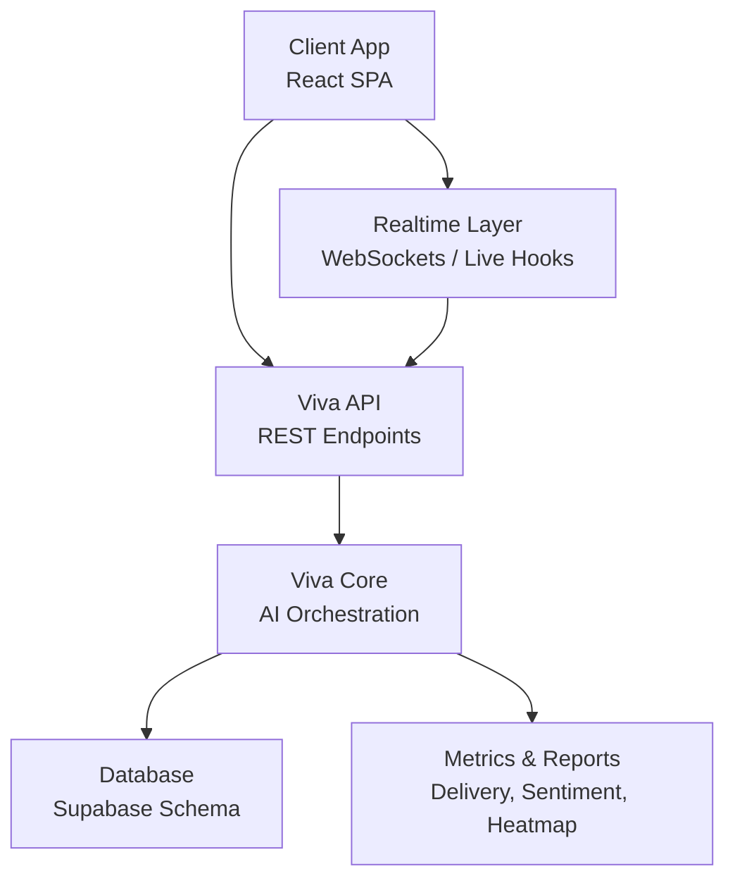
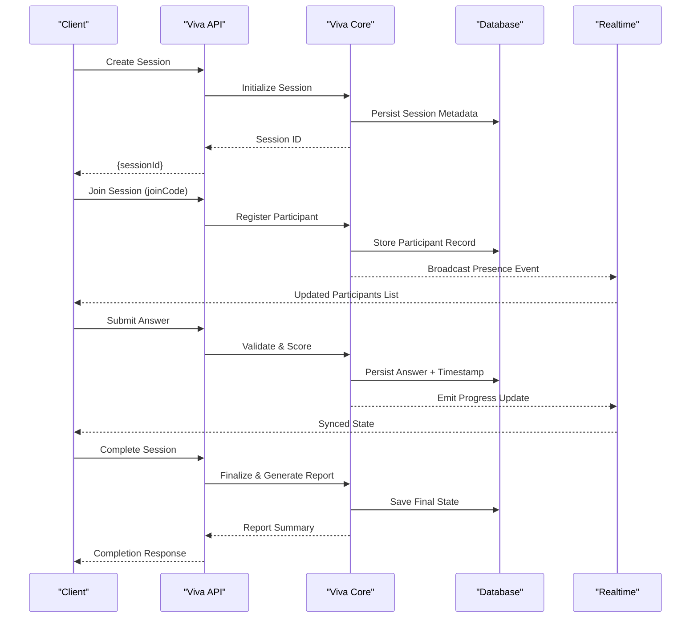
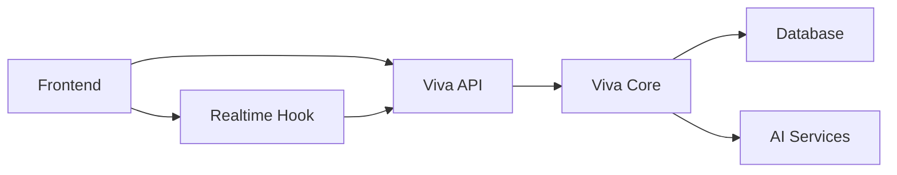

# Session Management

<cite>
**Referenced Files in This Document**
- [backend/api/viva.py](file://backend/api/viva.py)
- [backend/ai/viva_core.py](file://backend/ai/viva_core.py)
- [backend/tests/test_viva_sessions.py](file://backend/tests/test_viva_sessions.py)
- [src/lib/useLiveSession.ts](file://src/lib/useLiveSession.ts)
- [src/routes/advanced/viva-code-aware_.session.$id.tsx](file://src/routes/advanced/viva-code-aware_.session.$id.tsx)
- [src/components/live/live-session-runner.tsx](file://src/components/live/live-session-runner.tsx)
- [src/components/live/team-viva-room.tsx](file://src/components/live/team-viva-room.tsx)
- [backend/core/config.py](file://backend/core/config.py)
- [backend/core/database.py](file://backend/core/database.py)
- [backend/supabase_schema.sql](file://backend/supabase_schema.sql)
</cite>

## Table of Contents
1. [Introduction](#introduction)
2. [Project Structure](#project-structure)
3. [Core Components](#core-components)
4. [Architecture Overview](#architecture-overview)
5. [Detailed Component Analysis](#detailed-component-analysis)
6. [Dependency Analysis](#dependency-analysis)
7. [Performance Considerations](#performance-considerations)
8. [Troubleshooting Guide](#troubleshooting-guide)
9. [Conclusion](#conclusion)
10. [Appendices](#appendices)

## Introduction
This document explains the viva session management system that orchestrates examination workflows and state persistence. It covers the full session lifecycle from initialization to completion, participant coordination, resource allocation, timeout handling, and state management for exam progress, answers, and timing. It also details concurrent session handling, scalability considerations, fault tolerance, configuration examples, participant management APIs, recovery procedures, and integration with real-time collaboration features and data synchronization across multiple clients.

## Project Structure
The viva session management spans backend services, API endpoints, AI orchestration, database schema, and frontend components:
- Backend API exposes REST endpoints for session creation, participant management, and state queries.
- AI core coordinates viva logic, including question generation, scoring, and metrics.
- Frontend hooks and routes manage client-side session state, real-time updates, and UI flows.
- Database schema persists sessions, participants, answers, and timing metadata.

**Diagram sources**
- [backend/api/viva.py](file://backend/api/viva.py)
- [backend/ai/viva_core.py](file://backend/ai/viva_core.py)
- [backend/supabase_schema.sql](file://backend/supabase_schema.sql)
- [src/lib/useLiveSession.ts](file://src/lib/useLiveSession.ts)

**Section sources**
- [backend/api/viva.py](file://backend/api/viva.py)
- [backend/ai/viva_core.py](file://backend/ai/viva_core.py)
- [backend/supabase_schema.sql](file://backend/supabase_schema.sql)
- [src/lib/useLiveSession.ts](file://src/lib/useLiveSession.ts)

## Core Components
- Viva API: Provides endpoints to create sessions, join via codes, update participant states, submit answers, and query session status.
- Viva Core: Implements session lifecycle, question sequencing, timing, scoring, and integration with AI services.
- Realtime Hook: Manages client-side session state, reconnection, and synchronization with server events.
- Database Schema: Defines tables for sessions, participants, answers, and timing records.

Key responsibilities:
- Lifecycle management: initialize, start, pause, resume, complete, cleanup.
- Participant coordination: join, leave, role assignment, presence tracking.
- Resource allocation: question sets, timers, media resources.
- Timeout handling: per-question and global timeouts with escalation.
- State persistence: durable storage of progress, answers, timestamps.
- Concurrency: safe concurrent access to shared state.
- Fault tolerance: retries, idempotency, recovery on disconnects.

**Section sources**
- [backend/api/viva.py](file://backend/api/viva.py)
- [backend/ai/viva_core.py](file://backend/ai/viva_core.py)
- [src/lib/useLiveSession.ts](file://src/lib/useLiveSession.ts)
- [backend/supabase_schema.sql](file://backend/supabase_schema.sql)

## Architecture Overview
The system follows a layered architecture:
- Presentation layer (frontend) interacts with the API and realtime layer.
- API layer validates requests, enforces policies, and delegates to core.
- Core orchestrates viva logic, manages timers, and persists state.
- Storage layer provides durable persistence and retrieval.

**Diagram sources**
- [backend/api/viva.py](file://backend/api/viva.py)
- [backend/ai/viva_core.py](file://backend/ai/viva_core.py)
- [backend/supabase_schema.sql](file://backend/supabase_schema.sql)
- [src/lib/useLiveSession.ts](file://src/lib/useLiveSession.ts)

## Detailed Component Analysis

### Viva API Endpoints
Responsibilities:
- Session lifecycle endpoints: create, start, pause, resume, complete.
- Participant management: join via code, leave, role updates.
- Data submission: answers, notes, timestamps.
- Querying: session status, participant list, progress snapshots.

Error handling:
- Validation errors return structured responses.
- Conflict resolution for duplicate joins or stale updates.
- Timeout-related errors escalate to core for remediation.

Idempotency:
- Repeated submissions are deduplicated using request IDs or timestamps.

Scalability:
- Stateless API design where possible; state held in core and DB.
- Rate limiting and backpressure at endpoint level.

**Section sources**
- [backend/api/viva.py](file://backend/api/viva.py)

### Viva Core Orchestration
Responsibilities:
- Session state machine: init, running, paused, completed, failed.
- Question sequencing and adaptive difficulty.
- Timer management: per-question and global timeouts.
- Scoring and metrics aggregation.
- Integration with AI services for content generation and analysis.

Concurrency:
- Thread-safe state transitions with locks or atomic operations.
- Event-driven updates to avoid race conditions.

Timeout handling:
- Detects missed deadlines and triggers fallback actions.
- Notifies participants and logs anomalies.

Recovery:
- On restart, reconstructs session state from persisted records.
- Replays pending events if applicable.

**Section sources**
- [backend/ai/viva_core.py](file://backend/ai/viva_core.py)

### Realtime Collaboration Hook
Responsibilities:
- Establishes and maintains connection to realtime layer.
- Subscribes to session events: participant joins/leaves, progress updates, timer changes.
- Handles reconnection with exponential backoff.
- Merges server state with local optimistic updates.

Data synchronization:
- Ensures eventual consistency across clients.
- Resolves conflicts using last-write-wins or vector clocks.

User experience:
- Shows live indicators for active participants.
- Displays real-time progress bars and countdowns.

**Section sources**
- [src/lib/useLiveSession.ts](file://src/lib/useLiveSession.ts)

### Frontend Session UI
Responsibilities:
- Renders session flow: preflight, stage, results.
- Manages user interactions: answering questions, pausing/resuming.
- Integrates with realtime hook for live updates.

State management:
- Local cache of session state with optimistic updates.
- Fallback to server state on mismatch.

Accessibility:
- Keyboard navigation and screen reader support.

**Section sources**
- [src/routes/advanced/viva-code-aware_.session.$id.tsx](file://src/routes/advanced/viva-code-aware_.session.$id.tsx)
- [src/components/live/live-session-runner.tsx](file://src/components/live/live-session-runner.tsx)
- [src/components/live/team-viva-room.tsx](file://src/components/live/team-viva-room.tsx)

### Database Schema and Persistence
Responsibilities:
- Stores session metadata, participant records, answers, and timing.
- Enforces constraints and indexes for performance.
- Supports audit trails and historical queries.

Schema highlights:
- Sessions table: id, status, config, timestamps.
- Participants table: id, session_id, role, joined_at, left_at.
- Answers table: id, participant_id, question_id, answer_text, timestamp.
- Timing table: id, session_id, event_type, duration_ms.

Indexes:
- Foreign keys for efficient joins.
- Timestamps for ordering and analytics.

**Section sources**
- [backend/supabase_schema.sql](file://backend/supabase_schema.sql)

## Dependency Analysis
The viva session system has clear dependencies:
- API depends on Core for business logic.
- Core depends on Database for persistence and AI services for content.
- Frontend depends on API and Realtime Hook for state synchronization.

**Diagram sources**
- [backend/api/viva.py](file://backend/api/viva.py)
- [backend/ai/viva_core.py](file://backend/ai/viva_core.py)
- [src/lib/useLiveSession.ts](file://src/lib/useLiveSession.ts)

**Section sources**
- [backend/api/viva.py](file://backend/api/viva.py)
- [backend/ai/viva_core.py](file://backend/ai/viva_core.py)
- [src/lib/useLiveSession.ts](file://src/lib/useLiveSession.ts)

## Performance Considerations
- Minimize payload sizes by streaming large responses.
- Use pagination for participant lists and answer histories.
- Cache frequently accessed read-only data.
- Implement connection pooling for database and AI services.
- Monitor latency and throughput with metrics and alerts.

[No sources needed since this section provides general guidance]

## Troubleshooting Guide
Common issues and resolutions:
- Session not found: Verify session ID and ensure it exists in DB.
- Participant join failure: Check join code validity and capacity limits.
- Timeout errors: Inspect timer configurations and network latency.
- Realtime disconnects: Enable reconnection and check server health.
- Data inconsistency: Compare local cache with server state and force refresh.

Debugging steps:
- Log all API requests and responses.
- Trace event flows through realtime channels.
- Validate schema constraints and indexes.

Recovery procedures:
- Restart core service to rebuild state from DB.
- Replay missed events using event log.
- Purge stale sessions beyond retention policy.

**Section sources**
- [backend/tests/test_viva_sessions.py](file://backend/tests/test_viva_sessions.py)
- [backend/core/config.py](file://backend/core/config.py)
- [backend/core/database.py](file://backend/core/database.py)

## Conclusion
The viva session management system provides a robust framework for orchestrating examinations with strong state persistence, real-time collaboration, and scalable architecture. By adhering to best practices in concurrency, error handling, and performance optimization, it ensures reliable and responsive user experiences across diverse environments.

[No sources needed since this section summarizes without analyzing specific files]

## Appendices

### Session Configuration Examples
- Define session duration, question count, and difficulty levels.
- Configure timeouts per question and globally.
- Set participant roles and permissions.

**Section sources**
- [backend/core/config.py](file://backend/core/config.py)

### Participant Management APIs
- Create session: POST /api/viva/sessions
- Join session: POST /api/viva/sessions/{id}/join
- Leave session: DELETE /api/viva/sessions/{id}/participants/{pid}
- Update role: PATCH /api/viva/sessions/{id}/participants/{pid}

**Section sources**
- [backend/api/viva.py](file://backend/api/viva.py)

### Recovery Procedures
- Backup session state before maintenance.
- Restore from latest snapshot on failure.
- Validate integrity post-recovery.

**Section sources**
- [backend/core/database.py](file://backend/core/database.py)
- [backend/supabase_schema.sql](file://backend/supabase_schema.sql)