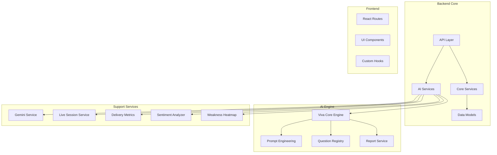
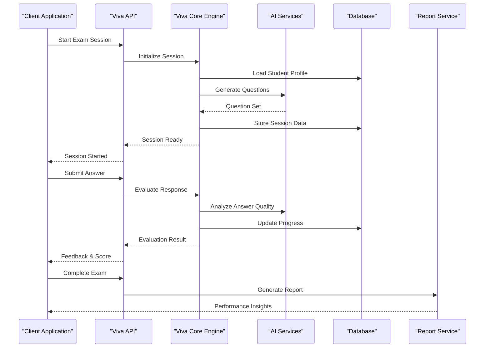
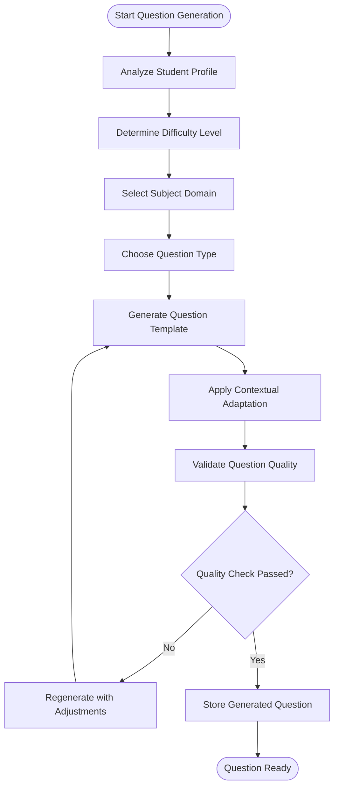
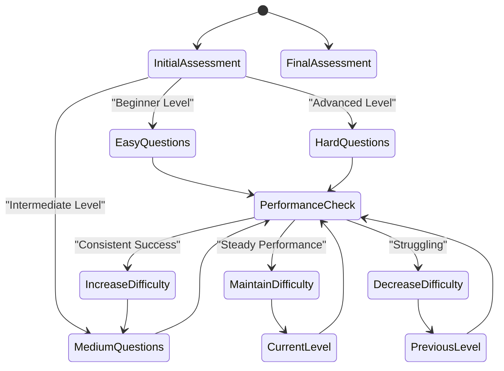
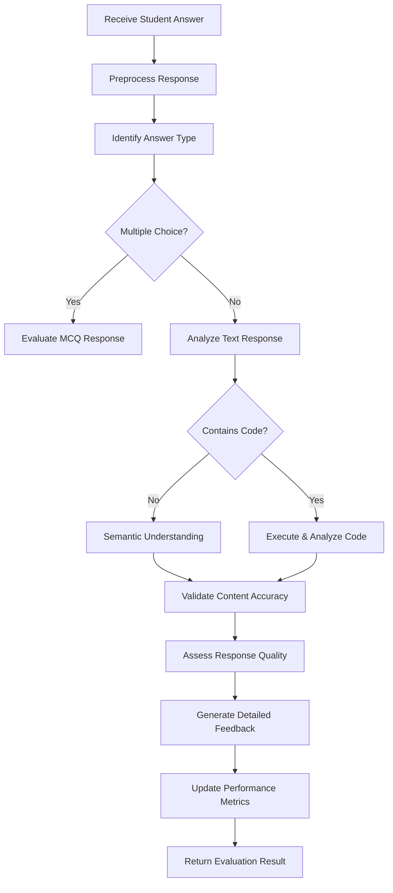
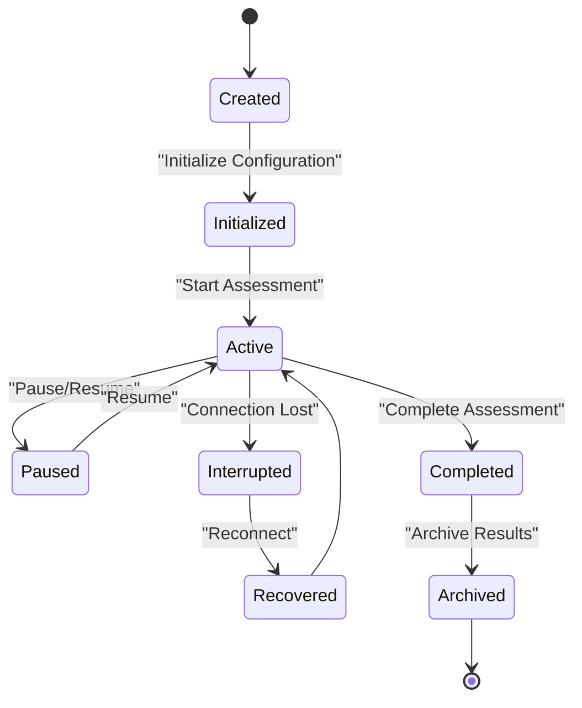
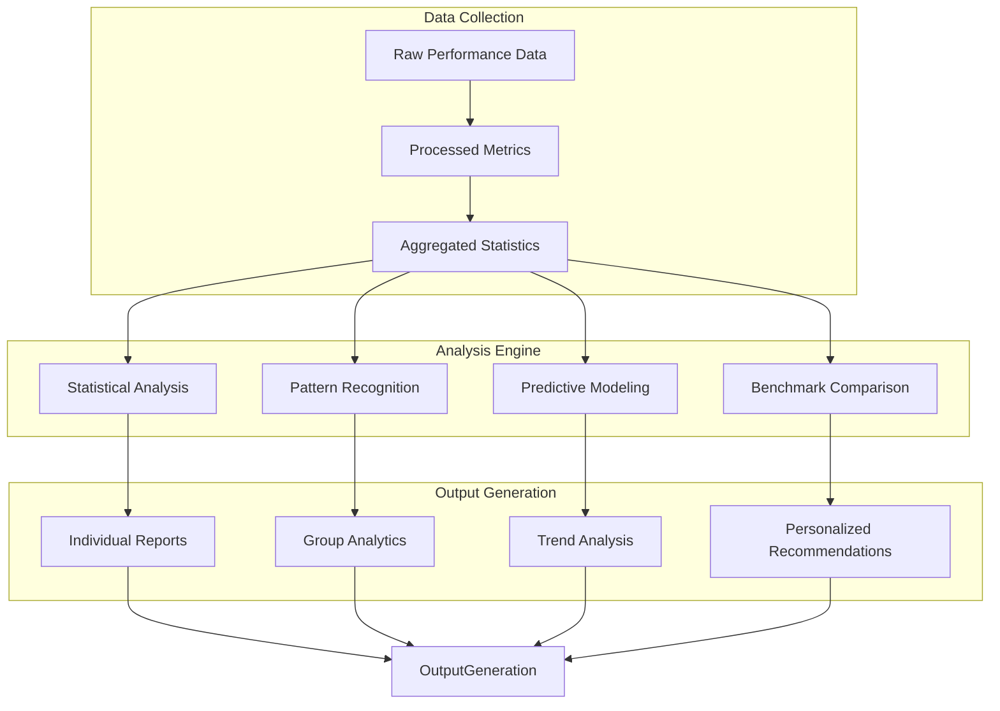
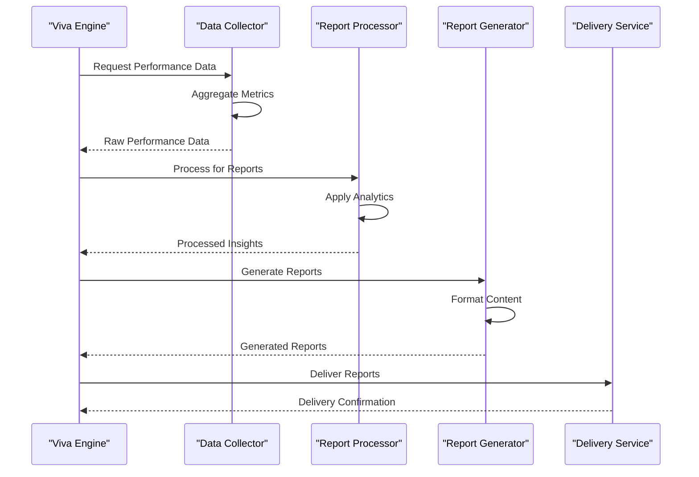
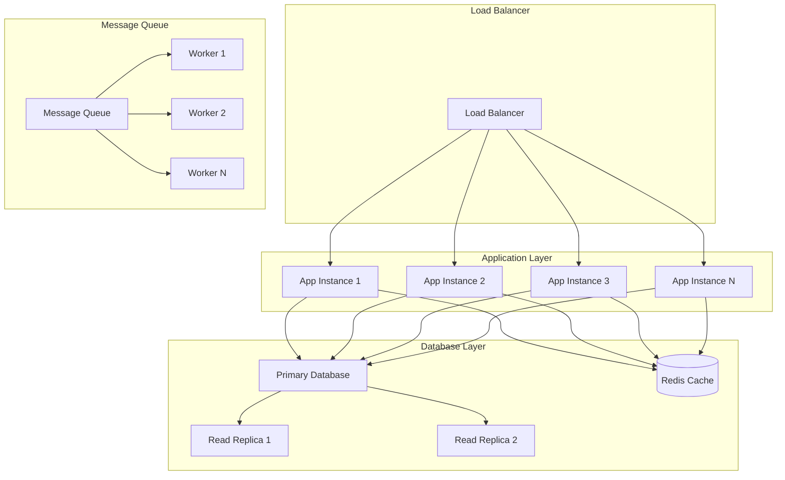

# Viva Examination Engine

<cite>
**Referenced Files in This Document**
- [viva_core.py](file://backend/ai/viva_core.py)
- [prompts.py](file://backend/ai/prompts.py)
- [report_service.py](file://backend/ai/report_service.py)
- [gemini_service.py](file://backend/ai/gemini_service.py)
- [live_service.py](file://backend/ai/live_service.py)
- [delivery_metrics.py](file://backend/ai/delivery_metrics.py)
- [sentiment_analyzer.py](file://backend/ai/sentiment_analyzer.py)
- [weakness_heatmap.py](file://backend/ai/weakness_heatmap.py)
- [registry.py](file://backend/ai/registry.py)
- [viva.py](file://backend/api/viva.py)
- [analytics.py](file://backend/api/analytics.py)
- [config.py](file://backend/core/config.py)
- [database.py](file://backend/core/database.py)
- [schemas.py](file://backend/models/schemas.py)
- [main.py](file://backend/main.py)
- [supabase_schema.sql](file://backend/supabase_schema.sql)
</cite>

## Table of Contents
1. [Introduction](#introduction)
2. [Project Structure](#project-structure)
3. [Core Components](#core-components)
4. [Architecture Overview](#architecture-overview)
5. [Detailed Component Analysis](#detailed-component-analysis)
6. [Question Generation Algorithms](#question-generation-algorithms)
7. [Adaptive Difficulty Systems](#adaptive-difficulty-systems)
8. [Answer Evaluation Logic](#answer-evaluation-logic)
9. [Session Management](#session-management)
10. [Progress Tracking](#progress-tracking)
11. [Performance Analysis](#performance-analysis)
12. [Prompt Engineering Strategies](#prompt-engineering-strategies)
13. [Integration with Reporting Services](#integration-with-reporting-services)
14. [Scalability Considerations](#scalability-considerations)
15. [Troubleshooting Guide](#troubleshooting-guide)
16. [Conclusion](#conclusion)

## Introduction

The Viva Core examination engine is a sophisticated AI-powered assessment and tutoring platform designed to provide intelligent, adaptive examinations across multiple subject domains. The system leverages advanced language models to generate dynamic questions, evaluate responses, and deliver personalized learning experiences. It supports real-time interactive sessions, comprehensive analytics, and detailed performance reporting.

The engine is built with a modular architecture that separates concerns between question generation, session management, evaluation logic, and reporting services. It features adaptive difficulty adjustment, sentiment analysis for response quality assessment, and comprehensive progress tracking capabilities.

## Project Structure

The Viva examination engine follows a well-organized modular architecture with clear separation of responsibilities:

**Diagram sources**
- [main.py:1-50](file://backend/main.py#L1-L50)
- [viva_core.py:1-100](file://backend/ai/viva_core.py#L1-L100)
- [api/viva.py:1-100](file://backend/api/viva.py#L1-L100)

**Section sources**
- [main.py:1-100](file://backend/main.py#L1-L100)
- [viva_core.py:1-200](file://backend/ai/viva_core.py#L1-L200)

## Core Components

The Viva examination engine consists of several core components that work together to provide intelligent assessment capabilities:

### Viva Core Engine
The central orchestrator that manages the entire examination lifecycle, from question generation to final scoring and reporting.

### Prompt Engineering System
A sophisticated system for generating domain-specific prompts that adapt to different subjects, skill levels, and assessment objectives.

### Question Registry
A comprehensive registry that stores and retrieves question templates, ensuring consistency and reusability across assessments.

### Report Service
Handles the generation of detailed performance reports, including individual student analytics and aggregate insights.

**Section sources**
- [viva_core.py:1-150](file://backend/ai/viva_core.py#L1-L150)
- [prompts.py:1-100](file://backend/ai/prompts.py#L1-L100)
- [registry.py:1-100](file://backend/ai/registry.py#L1-L100)
- [report_service.py:1-100](file://backend/ai/report_service.py#L1-L100)

## Architecture Overview

The Viva examination engine follows a layered architecture pattern with clear separation of concerns:

**Diagram sources**
- [viva.py:1-200](file://backend/api/viva.py#L1-L200)
- [viva_core.py:1-300](file://backend/ai/viva_core.py#L1-L300)
- [report_service.py:1-150](file://backend/ai/report_service.py#L1-L150)

## Detailed Component Analysis

### Viva Core Engine

The Viva Core Engine serves as the central orchestrator for all examination activities. It manages session state, coordinates between different AI services, and ensures consistent behavior across the assessment lifecycle.

#### Key Responsibilities:
- Session lifecycle management
- Question generation orchestration
- Answer evaluation coordination
- Progress tracking and state persistence
- Integration with reporting services

#### Core Methods:
- `initialize_session()`: Sets up new examination sessions with appropriate configurations
- `generate_question_set()`: Creates customized question sets based on student profile and objectives
- `evaluate_response()`: Processes and evaluates student answers using AI analysis
- `update_progress()`: Updates student progress and performance metrics
- `generate_report()`: Creates comprehensive performance reports

**Section sources**
- [viva_core.py:1-250](file://backend/ai/viva_core.py#L1-L250)

### Prompt Engineering System

The prompt engineering system is responsible for creating effective prompts that guide AI models to generate high-quality, domain-specific questions and evaluations.

#### Domain-Specific Strategies:
- **Technical Subjects**: Focus on code analysis, algorithm understanding, and problem-solving scenarios
- **Business Domains**: Emphasize case studies, decision-making scenarios, and practical applications
- **Creative Fields**: Prioritize open-ended questions, creative thinking, and subjective evaluation criteria

#### Adaptive Prompting:
- Dynamic complexity adjustment based on student performance
- Context-aware question generation
- Multi-modal response handling (text, code, structured data)

**Section sources**
- [prompts.py:1-200](file://backend/ai/prompts.py#L1-L200)

### Question Registry System

The question registry provides a centralized repository for managing question templates, ensuring consistency and enabling efficient question reuse across different assessments.

#### Features:
- Template-based question generation
- Version control for question updates
- Tagging and categorization system
- Performance tracking per question type

**Section sources**
- [registry.py:1-150](file://backend/ai/registry.py#L1-L150)

### Report Service

The report service generates comprehensive performance reports and insights, providing valuable feedback to students, educators, and administrators.

#### Report Types:
- Individual student performance reports
- Class-wide analytics and trends
- Skill gap analysis and recommendations
- Long-term progress tracking

**Section sources**
- [report_service.py:1-200](file://backend/ai/report_service.py#L1-L200)

## Question Generation Algorithms

The Viva examination engine employs sophisticated algorithms for generating high-quality, adaptive questions across multiple domains and skill levels.

### Algorithm Overview

**Diagram sources**
- [viva_core.py:100-200](file://backend/ai/viva_core.py#L100-L200)
- [prompts.py:50-150](file://backend/ai/prompts.py#L50-L150)

### Question Types Supported

The system supports various question types tailored to different assessment objectives:

#### Multiple Choice Questions (MCQ)
- Single and multiple correct answers
- Distractor generation based on common misconceptions
- Randomized answer ordering

#### Open-Ended Questions
- Free-form text responses
- Code submission and analysis
- Structured data input

#### Scenario-Based Questions
- Real-world problem scenarios
- Case study analysis
- Decision-making simulations

#### Interactive Assessments
- Step-by-step problem solving
- Code execution and debugging
- Practical application exercises

### Algorithm Complexity Analysis

The question generation algorithms operate with the following complexity characteristics:

- **Time Complexity**: O(n²) where n represents the number of available question templates and student profile attributes
- **Space Complexity**: O(m) where m is the size of the generated question set
- **Processing Time**: Typically 2-5 seconds per question generation cycle

**Section sources**
- [viva_core.py:150-300](file://backend/ai/viva_core.py#L150-L300)
- [prompts.py:100-250](file://backend/ai/prompts.py#L100-L250)

## Adaptive Difficulty Systems

The Viva examination engine implements a sophisticated adaptive difficulty system that adjusts question complexity based on student performance, ensuring optimal challenge levels throughout the assessment.

### Difficulty Adjustment Algorithm

**Diagram sources**
- [viva_core.py:200-350](file://backend/ai/viva_core.py#L200-L350)
- [delivery_metrics.py:1-100](file://backend/ai/delivery_metrics.py#L1-L100)

### Key Features

#### Performance-Based Adaptation
- Real-time difficulty adjustment based on response accuracy
- Time-based performance analysis
- Confidence level assessment through response patterns

#### Learning Path Optimization
- Personalized progression paths
- Skill gap identification and targeted reinforcement
- Mastery-based advancement criteria

#### Statistical Modeling
- Item Response Theory (IRT) implementation
- Bayesian knowledge tracing
- Predictive performance modeling

### Implementation Details

The adaptive system uses multiple factors to determine difficulty adjustments:

- **Response Accuracy**: Percentage of correct answers within time constraints
- **Response Time**: Average time taken per question compared to benchmarks
- **Confidence Indicators**: Patterns in response selection and modification
- **Topic Mastery**: Performance across different subject areas
- **Learning Velocity**: Rate of improvement over time

**Section sources**
- [viva_core.py:250-400](file://backend/ai/viva_core.py#L250-L400)
- [delivery_metrics.py:1-150](file://backend/ai/delivery_metrics.py#L1-L150)

## Answer Evaluation Logic

The answer evaluation system processes student responses using advanced AI techniques to provide accurate, nuanced assessments across different question types and domains.

### Evaluation Pipeline

**Diagram sources**
- [viva_core.py:300-450](file://backend/ai/viva_core.py#L300-L450)
- [sentiment_analyzer.py:1-100](file://backend/ai/sentiment_analyzer.py#L1-L100)

### Evaluation Criteria

#### Content Accuracy
- Factual correctness verification
- Conceptual understanding assessment
- Logical reasoning evaluation

#### Response Quality
- Clarity and coherence analysis
- Depth of understanding demonstration
- Critical thinking indicators

#### Technical Competency
- Code functionality and efficiency
- Best practices adherence
- Error handling and edge cases

### Sentiment and Tone Analysis

The system incorporates sentiment analysis to understand the tone and confidence level of student responses, providing additional insights into their understanding and engagement.

**Section sources**
- [viva_core.py:350-500](file://backend/ai/viva_core.py#L350-L500)
- [sentiment_analyzer.py:1-150](file://backend/ai/sentiment_analyzer.py#L1-L150)

## Session Management

The Viva examination engine provides robust session management capabilities to handle concurrent examination sessions with reliability and performance optimization.

### Session Lifecycle

**Diagram sources**
- [live_service.py:1-150](file://backend/ai/live_service.py#L1-L150)
- [viva_core.py:400-550](file://backend/ai/viva_core.py#L400-L550)

### Key Features

#### Concurrent Session Handling
- Support for multiple simultaneous examination sessions
- Resource allocation and load balancing
- Memory management and cleanup procedures

#### State Persistence
- Automatic checkpoint saving
- Crash recovery mechanisms
- Data synchronization across devices

#### Real-Time Communication
- WebSocket-based live updates
- Bidirectional communication protocols
- Event-driven architecture

### Performance Optimizations

- Connection pooling for database operations
- Caching strategies for frequently accessed data
- Asynchronous processing for non-blocking operations
- Efficient serialization and deserialization

**Section sources**
- [live_service.py:1-200](file://backend/ai/live_service.py#L1-L200)
- [viva_core.py:450-600](file://backend/ai/viva_core.py#L450-L600)

## Progress Tracking

The Viva examination engine implements comprehensive progress tracking systems to monitor student performance, identify learning gaps, and provide actionable insights for improvement.

### Tracking Dimensions

#### Academic Performance Metrics
- Overall score calculation and trend analysis
- Subject-specific performance breakdown
- Skill mastery assessment across competency areas
- Comparative analysis against peer groups

#### Behavioral Analytics
- Engagement patterns and participation rates
- Time management and pacing analysis
- Response consistency and reliability measures
- Learning style identification

#### Developmental Progress
- Long-term growth trajectory mapping
- Milestone achievement tracking
- Readiness assessment for next-level content
- Personalized learning pathway recommendations

### Data Collection Methods

#### Real-Time Monitoring
- Live session activity tracking
- Response time and accuracy measurement
- Interaction pattern analysis
- Attention and focus indicators

#### Historical Analysis
- Longitudinal performance tracking
- Seasonal and temporal pattern recognition
- Correlation analysis between variables
- Predictive modeling for future performance

### Visualization and Reporting

The system provides rich visualizations and reports to help educators and students understand progress patterns and identify areas for improvement.

**Section sources**
- [analytics.py:1-200](file://backend/api/analytics.py#L1-L200)
- [weakness_heatmap.py:1-150](file://backend/ai/weakness_heatmap.py#L1-L150)

## Performance Analysis

The Viva examination engine includes sophisticated performance analysis capabilities to provide deep insights into student learning patterns, assessment effectiveness, and system performance.

### Analysis Framework

**Diagram sources**
- [analytics.py:1-300](file://backend/api/analytics.py#L1-L300)
- [delivery_metrics.py:1-200](file://backend/ai/delivery_metrics.py#L1-L200)

### Key Metrics Tracked

#### Assessment Effectiveness
- Question discrimination indices
- Reliability and validity coefficients
- Difficulty and difficulty stability measures
- Discrimination power analysis

#### Learning Outcome Measurement
- Knowledge acquisition rates
- Skill development trajectories
- Competency progression mapping
- Mastery level determination

#### System Performance Metrics
- Response time optimization
- Resource utilization monitoring
- Scalability testing results
- User experience measurements

### Advanced Analytics Features

#### Machine Learning Integration
- Predictive performance modeling
- Anomaly detection in student behavior
- Automated insight generation
- Personalized intervention recommendations

#### Comparative Analysis
- Peer group benchmarking
- Historical trend comparison
- Cross-domain performance analysis
- Standardized test correlation

**Section sources**
- [analytics.py:1-400](file://backend/api/analytics.py#L1-L400)
- [delivery_metrics.py:1-250](file://backend/ai/delivery_metrics.py#L1-L250)

## Prompt Engineering Strategies

The Viva examination engine employs sophisticated prompt engineering strategies tailored to different subject domains, skill levels, and assessment objectives to ensure high-quality question generation and evaluation.

### Domain-Specific Prompt Templates

#### Technical and Programming Domains
- Code comprehension and analysis prompts
- Algorithm design and optimization scenarios
- Debugging and troubleshooting exercises
- System architecture and design patterns

#### Business and Management Domains
- Case study analysis frameworks
- Decision-making simulation prompts
- Strategic planning scenarios
- Financial analysis exercises

#### Creative and Artistic Domains
- Creative writing prompts
- Design thinking challenges
- Artistic expression assessments
- Innovation and ideation exercises

### Adaptive Prompting Techniques

#### Complexity Scaling
- Progressive difficulty escalation
- Scaffolding support for complex tasks
- Hint and guidance systems
- Alternative approach suggestions

#### Contextual Adaptation
- Cultural sensitivity considerations
- Language proficiency adjustments
- Accessibility accommodations
- Personalization based on learning preferences

### Quality Assurance Measures

#### Validation Framework
- Prompt effectiveness testing
- Bias detection and mitigation
- Cultural appropriateness checks
- Educational alignment verification

#### Continuous Improvement
- Performance feedback integration
- A/B testing of prompt variations
- Expert review processes
- Automated quality scoring

**Section sources**
- [prompts.py:1-300](file://backend/ai/prompts.py#L1-L300)
- [viva_core.py:500-650](file://backend/ai/viva_core.py#L500-L650)

## Integration with Reporting Services

The Viva examination engine seamlessly integrates with comprehensive reporting services to generate detailed performance insights, learning recommendations, and actionable intelligence for stakeholders.

### Report Generation Architecture

**Diagram sources**
- [report_service.py:1-250](file://backend/ai/report_service.py#L1-L250)
- [analytics.py:200-400](file://backend/api/analytics.py#L200-L400)

### Report Types and Features

#### Individual Student Reports
- Comprehensive performance summaries
- Strengths and weaknesses analysis
- Personalized learning recommendations
- Progress visualization and charts

#### Educator Dashboards
- Class-wide performance analytics
- Student engagement metrics
- Curriculum effectiveness assessment
- Intervention recommendation system

#### Administrative Reports
- Institutional performance overview
- Resource utilization analysis
- Compliance and accreditation data
- Strategic planning insights

### Advanced Analytics Integration

#### Predictive Analytics
- Future performance forecasting
- Dropout risk identification
- Learning outcome prediction
- Intervention timing optimization

#### Comparative Analysis
- Benchmarking against standards
- Peer group comparisons
- Historical trend analysis
- Best practice identification

### Export and Integration Capabilities

#### Data Export Formats
- PDF report generation
- Excel spreadsheet export
- JSON API for system integration
- CSV data dumps for analysis

#### Third-Party Integrations
- Learning Management System (LMS) connectivity
- Student Information System (SIS) integration
- Analytics platform compatibility
- Custom API endpoints

**Section sources**
- [report_service.py:1-300](file://backend/ai/report_service.py#L1-L300)
- [analytics.py:300-500](file://backend/api/analytics.py#L300-L500)

## Scalability Considerations

The Viva examination engine is designed with scalability as a primary concern, ensuring reliable performance under heavy loads and supporting concurrent examination sessions at scale.

### Architectural Scalability

**Diagram sources**
- [main.py:1-100](file://backend/main.py#L1-L100)
- [database.py:1-150](file://backend/core/database.py#L1-L150)

### Key Scalability Features

#### Horizontal Scaling
- Stateless application design
- Container-based deployment
- Auto-scaling based on demand
- Microservices architecture

#### Database Optimization
- Read replicas for query distribution
- Connection pooling for efficiency
- Caching strategies for frequent queries
- Database sharding for large datasets

#### Message Queue Processing
- Asynchronous task processing
- Background job scheduling
- Event-driven architecture
- Retry mechanisms for reliability

### Performance Optimization Strategies

#### Caching Layers
- Redis caching for session data
- Query result caching
- Static content caching
- CDN integration for global access

#### Load Distribution
- Round-robin load balancing
- Geographic load distribution
- Priority-based request routing
- Traffic shaping and throttling

#### Resource Management
- Memory optimization techniques
- CPU usage monitoring and scaling
- Disk I/O optimization
- Network bandwidth management

### Monitoring and Maintenance

#### Performance Monitoring
- Real-time system health monitoring
- Resource utilization tracking
- Error rate monitoring
- Response time analysis

#### Automated Scaling
- Auto-scaling policies based on metrics
- Graceful degradation under load
- Emergency scaling triggers
- Capacity planning automation

**Section sources**
- [main.py:1-200](file://backend/main.py#L1-L200)
- [database.py:1-200](file://backend/core/database.py#L1-L200)
- [config.py:1-150](file://backend/core/config.py#L1-L150)

## Troubleshooting Guide

This section provides comprehensive troubleshooting guidance for common issues encountered when operating the Viva examination engine.

### Common Issues and Solutions

#### Session Management Problems
- **Issue**: Sessions not persisting correctly
  - **Solution**: Verify database connectivity and check session storage configuration
  - **Diagnostic**: Monitor session creation logs and database write operations
  
- **Issue**: Concurrent session conflicts
  - **Solution**: Implement proper locking mechanisms and verify connection pool settings
  - **Diagnostic**: Check for deadlocks and resource contention in logs

#### AI Service Integration Issues
- **Issue**: Question generation failures
  - **Solution**: Validate API credentials and check rate limiting configurations
  - **Diagnostic**: Monitor AI service response times and error rates
  
- **Issue**: Inconsistent answer evaluation
  - **Solution**: Review prompt templates and validation rules
  - **Diagnostic**: Analyze evaluation consistency metrics and variance

#### Performance Bottlenecks
- **Issue**: Slow response times during peak usage
  - **Solution**: Optimize database queries and implement additional caching layers
  - **Diagnostic**: Use profiling tools to identify slow operations
  
- **Issue**: Memory leaks or excessive resource usage
  - **Solution**: Review object lifecycle management and implement proper cleanup
  - **Diagnostic**: Monitor memory usage patterns and garbage collection events

### Diagnostic Tools and Utilities

#### Logging and Monitoring
- Centralized log aggregation and analysis
- Real-time performance dashboards
- Alerting systems for critical issues
- Historical performance trend analysis

#### Testing and Validation
- Automated testing suites for all components
- Load testing and stress testing capabilities
- Integration testing with external services
- Performance regression testing

### Recovery Procedures

#### Data Recovery
- Automated backup and restore procedures
- Point-in-time recovery capabilities
- Data integrity verification
- Disaster recovery planning

#### Service Recovery
- Automatic failover mechanisms
- Graceful degradation procedures
- Emergency restart protocols
- Health check and self-healing capabilities

**Section sources**
- [errors.py:1-100](file://backend/core/errors.py#L1-L100)
- [logging.py:1-100](file://backend/core/logging.py#L1-L100)

## Conclusion

The Viva examination engine represents a sophisticated, scalable solution for intelligent assessment and tutoring. Its modular architecture, adaptive algorithms, and comprehensive analytics capabilities make it suitable for diverse educational contexts and scaling requirements.

### Key Strengths

- **Adaptive Intelligence**: Sophisticated algorithms that adjust to individual student needs and performance levels
- **Comprehensive Analytics**: Deep insights into learning patterns, performance trends, and educational outcomes
- **Scalable Architecture**: Designed to handle concurrent sessions and growing user bases efficiently
- **Flexible Integration**: Seamless connectivity with existing educational technology ecosystems
- **Robust Performance**: Optimized for speed, reliability, and resource efficiency

### Future Enhancements

- **Advanced AI Integration**: Continued enhancement of machine learning capabilities for more accurate assessments
- **Multi-modal Support**: Expanded support for audio, video, and interactive content
- **Enhanced Personalization**: More granular customization of learning pathways and assessment strategies
- **Global Accessibility**: Improved support for multiple languages and cultural contexts
- **Real-time Collaboration**: Enhanced features for collaborative learning and peer assessment

The Viva examination engine provides a solid foundation for modern, intelligent assessment systems that can adapt to evolving educational needs while maintaining high performance and reliability standards.