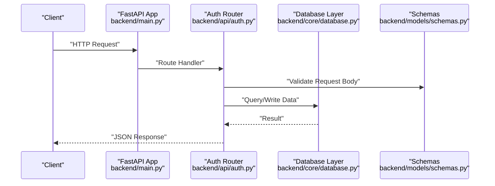
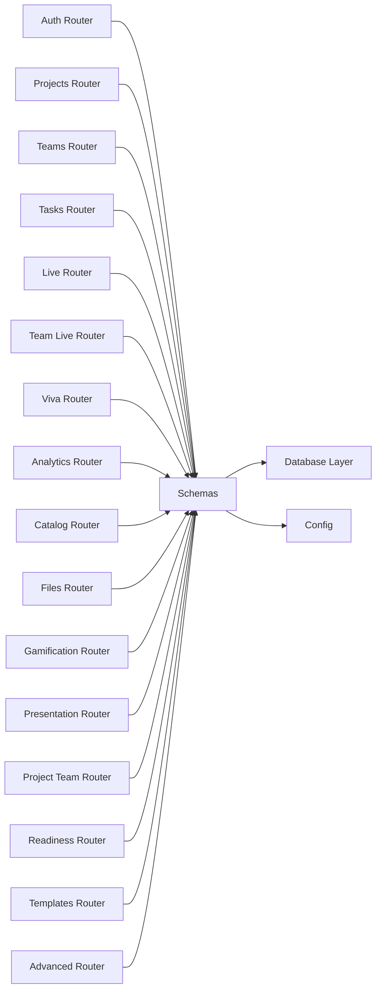

# API Reference

<cite>
**Referenced Files in This Document**
- [main.py](file://backend/main.py)
- [auth.py](file://backend/api/auth.py)
- [projects.py](file://backend/api/projects.py)
- [teams.py](file://backend/api/teams.py)
- [tasks.py](file://backend/api/tasks.py)
- [live.py](file://backend/api/live.py)
- [team_live.py](file://backend/api/team_live.py)
- [viva.py](file://backend/api/viva.py)
- [analytics.py](file://backend/api/analytics.py)
- [catalog.py](file://backend/api/catalog.py)
- [files.py](file://backend/api/files.py)
- [gamification.py](file://backend/api/gamification.py)
- [presentation.py](file://backend/api/presentation.py)
- [project_team.py](file://backend/api/project_team.py)
- [readiness.py](file://backend/api/readiness.py)
- [templates.py](file://backend/api/templates.py)
- [advanced.py](file://backend/api/advanced.py)
- [config.py](file://backend/core/config.py)
- [database.py](file://backend/core/database.py)
- [deps.py](file://backend/core/deps.py)
- [errors.py](file://backend/core/errors.py)
- [schemas.py](file://backend/models/schemas.py)
</cite>

## Table of Contents
1. [Introduction](#introduction)
2. [Project Structure](#project-structure)
3. [Core Components](#core-components)
4. [Architecture Overview](#architecture-overview)
5. [Detailed Component Analysis](#detailed-component-analysis)
6. [Dependency Analysis](#dependency-analysis)
7. [Performance Considerations](#performance-considerations)
8. [Troubleshooting Guide](#troubleshooting-guide)
9. [Conclusion](#conclusion)
10. [Appendices](#appendices)

## Introduction
This document provides a comprehensive API reference for the Horux backend, covering REST endpoints and WebSocket-based real-time features. It includes HTTP methods, URL patterns, request/response schemas, authentication requirements, pagination/filtering/sorting options, error handling, rate limiting notes, versioning guidance, and practical usage examples with curl commands and client code snippets.

## Project Structure
The backend is organized by feature modules under backend/api, with shared core utilities in backend/core and data models in backend/models. The application entry point registers routers and middleware.

```mermaid
graph TB
A["Application Entry<br/>backend/main.py"] --> B["Auth Router<br/>backend/api/auth.py"]
A --> C["Projects Router<br/>backend/api/projects.py"]
A --> D["Teams Router<br/>backend/api/teams.py"]
A --> E["Tasks Router<br/>backend/api/tasks.py"]
A --> F["Live Router<br/>backend/api/live.py"]
A --> G["Team Live Router<br/>backend/api/team_live.py"]
A --> H["Viva Router<br/>backend/api/viva.py"]
A --> I["Analytics Router<br/>backend/api/analytics.py"]
A --> J["Catalog Router<br/>backend/api/catalog.py"]
A --> K["Files Router<br/>backend/api/files.py"]
A --> L["Gamification Router<br/>backend/api/gamification.py"]
A --> M["Presentation Router<br/>backend/api/presentation.py"]
A --> N["Project Team Router<br/>backend/api/project_team.py"]
A --> O["Readiness Router<br/>backend/api/readiness.py"]
A --> P["Templates Router<br/>backend/api/templates.py"]
A --> Q["Advanced Router<br/>backend/api/advanced.py"]
R["Core Config<br/>backend/core/config.py"] --> A
S["Database Setup<br/>backend/core/database.py"] --> A
T["Shared Deps<br/>backend/core/deps.py"] --> A
U["Error Handling<br/>backend/core/errors.py"] --> A
V["Schemas<br/>backend/models/schemas.py"] --> A
```

**Diagram sources**
- [main.py](file://backend/main.py)
- [auth.py](file://backend/api/auth.py)
- [projects.py](file://backend/api/projects.py)
- [teams.py](file://backend/api/teams.py)
- [tasks.py](file://backend/api/tasks.py)
- [live.py](file://backend/api/live.py)
- [team_live.py](file://backend/api/team_live.py)
- [viva.py](file://backend/api/viva.py)
- [analytics.py](file://backend/api/analytics.py)
- [catalog.py](file://backend/api/catalog.py)
- [files.py](file://backend/api/files.py)
- [gamification.py](file://backend/api/gamification.py)
- [presentation.py](file://backend/api/presentation.py)
- [project_team.py](file://backend/api/project_team.py)
- [readiness.py](file://backend/api/readiness.py)
- [templates.py](file://backend/api/templates.py)
- [advanced.py](file://backend/api/advanced.py)
- [config.py](file://backend/core/config.py)
- [database.py](file://backend/core/database.py)
- [deps.py](file://backend/core/deps.py)
- [errors.py](file://backend/core/errors.py)
- [schemas.py](file://backend/models/schemas.py)

**Section sources**
- [main.py](file://backend/main.py)
- [config.py](file://backend/core/config.py)
- [database.py](file://backend/core/database.py)
- [deps.py](file://backend/core/deps.py)
- [errors.py](file://backend/core/errors.py)
- [schemas.py](file://backend/models/schemas.py)

## Core Components
- Authentication: Token issuance and validation, session management, and protected route guards.
- Projects, Teams, Tasks: CRUD operations and relationships between entities.
- Live Sessions: Real-time collaboration endpoints and WebSocket channels.
- Viva: AI-assisted viva preparation endpoints.
- Analytics, Catalog, Files, Gamification, Presentation, Readiness, Templates, Advanced: Feature-specific endpoints.

Key cross-cutting concerns:
- Configuration via environment variables (e.g., base URLs, secrets).
- Database connection initialization and migrations.
- Shared dependencies injection for services and repositories.
- Centralized error responses and status codes.

**Section sources**
- [auth.py](file://backend/api/auth.py)
- [projects.py](file://backend/api/projects.py)
- [teams.py](file://backend/api/teams.py)
- [tasks.py](file://backend/api/tasks.py)
- [live.py](file://backend/api/live.py)
- [team_live.py](file://backend/api/team_live.py)
- [viva.py](file://backend/api/viva.py)
- [analytics.py](file://backend/api/analytics.py)
- [catalog.py](file://backend/api/catalog.py)
- [files.py](file://backend/api/files.py)
- [gamification.py](file://backend/api/gamification.py)
- [presentation.py](file://backend/api/presentation.py)
- [project_team.py](file://backend/api/project_team.py)
- [readiness.py](file://backend/api/readiness.py)
- [templates.py](file://backend/api/templates.py)
- [advanced.py](file://backend/api/advanced.py)
- [config.py](file://backend/core/config.py)
- [database.py](file://backend/core/database.py)
- [deps.py](file://backend/core/deps.py)
- [errors.py](file://backend/core/errors.py)
- [schemas.py](file://backend/models/schemas.py)

## Architecture Overview
The backend exposes REST APIs and WebSocket endpoints. Authentication is enforced at router or dependency level. Data access uses a centralized database layer. Models are defined as Pydantic schemas for request/response validation.

**Diagram sources**
- [main.py](file://backend/main.py)
- [auth.py](file://backend/api/auth.py)
- [database.py](file://backend/core/database.py)
- [schemas.py](file://backend/models/schemas.py)

## Detailed Component Analysis

### Authentication API
- Base path: /api/auth
- Methods:
  - POST /api/auth/register
  - POST /api/auth/login
  - POST /api/auth/logout
  - GET /api/auth/me
  - POST /api/auth/refresh
  - POST /api/auth/forgot-password
  - POST /api/auth/reset-password
- Authentication: Public for register/login; JWT required for protected routes.
- Request/Response: See schemas in backend/models/schemas.py.
- Error Codes: Standard HTTP codes plus custom error types from backend/core/errors.py.

Example curl:
- Register: curl -X POST https://api.horux.local/api/auth/register -H "Content-Type: application/json" -d '{"email":"user@example.com","password":"SecurePass123"}'
- Login: curl -X POST https://api.horux.local/api/auth/login -H "Content-Type: application/json" -d '{"email":"user@example.com","password":"SecurePass123"}'

**Section sources**
- [auth.py](file://backend/api/auth.py)
- [schemas.py](file://backend/models/schemas.py)
- [errors.py](file://backend/core/errors.py)

### Projects API
- Base path: /api/projects
- Methods:
  - GET /api/projects
  - POST /api/projects
  - GET /api/projects/{id}
  - PUT /api/projects/{id}
  - DELETE /api/projects/{id}
- Pagination: query params page, page_size.
- Filtering: query params name, owner_id, status.
- Sorting: query param sort_by, order (asc/desc).
- Authentication: JWT required.
- Example curl:
  - List: curl -H "Authorization: Bearer <token>" "https://api.horux.local/api/projects?page=1&page_size=20&sort_by=created_at&order=desc"
  - Create: curl -X POST https://api.horux.local/api/projects -H "Authorization: Bearer <token>" -H "Content-Type: application/json" -d '{"name":"Horux MVP","owner_id":"uuid"}'

**Section sources**
- [projects.py](file://backend/api/projects.py)
- [schemas.py](file://backend/models/schemas.py)

### Teams API
- Base path: /api/teams
- Methods:
  - GET /api/teams
  - POST /api/teams
  - GET /api/teams/{id}
  - PUT /api/teams/{id}
  - DELETE /api/teams/{id}
- Pagination, filtering, sorting similar to projects.
- Authentication: JWT required.
- Example curl:
  - Create: curl -X POST https://api.horux.local/api/teams -H "Authorization: Bearer <token>" -H "Content-Type: application/json" -d '{"name":"Alpha Team","lead_id":"uuid"}'

**Section sources**
- [teams.py](file://backend/api/teams.py)
- [schemas.py](file://backend/models/schemas.py)

### Tasks API
- Base path: /api/tasks
- Methods:
  - GET /api/tasks
  - POST /api/tasks
  - GET /api/tasks/{id}
  - PUT /api/tasks/{id}
  - DELETE /api/tasks/{id}
  - PATCH /api/tasks/{id}/reorder
- Filtering: project_id, team_id, status, assignee_id.
- Sorting: due_date, priority.
- Authentication: JWT required.
- Example curl:
  - Reorder: curl -X PATCH https://api.horux.local/api/tasks/{id}/reorder -H "Authorization: Bearer <token>" -H "Content-Type: application/json" -d '{"position":2}'

**Section sources**
- [tasks.py](file://backend/api/tasks.py)
- [schemas.py](file://backend/models/schemas.py)

### Live Sessions API
- Base path: /api/live
- Methods:
  - GET /api/live/sessions
  - POST /api/live/sessions
  - GET /api/live/sessions/{id}
  - PUT /api/live/sessions/{id}
  - DELETE /api/live/sessions/{id}
- Authentication: JWT required.
- Example curl:
  - Create: curl -X POST https://api.horux.local/api/live/sessions -H "Authorization: Bearer <token>" -H "Content-Type: application/json" -d '{"title":"Mock Interview","duration_minutes":30}'

**Section sources**
- [live.py](file://backend/api/live.py)
- [schemas.py](file://backend/models/schemas.py)

### Team Live API
- Base path: /api/team-live
- Methods:
  - GET /api/team-live/rooms
  - POST /api/team-live/rooms
  - GET /api/team-live/rooms/{id}
  - PUT /api/team-live/rooms/{id}
  - DELETE /api/team-live/rooms/{id}
- Authentication: JWT required.
- Example curl:
  - Join room: curl -X POST https://api.horux.local/api/team-live/rooms/{id}/join -H "Authorization: Bearer <token>"

**Section sources**
- [team_live.py](file://backend/api/team_live.py)
- [schemas.py](file://backend/models/schemas.py)

### Viva API
- Base path: /api/viva
- Methods:
  - GET /api/viva/sessions
  - POST /api/viva/sessions
  - GET /api/viva/sessions/{id}
  - PUT /api/viva/sessions/{id}
  - DELETE /api/viva/sessions/{id}
- Authentication: JWT required.
- Example curl:
  - Start session: curl -X POST https://api.horux.local/api/viva/sessions -H "Authorization: Bearer <token>" -H "Content-Type: application/json" -d '{"topic":"System Design"}'

**Section sources**
- [viva.py](file://backend/api/viva.py)
- [schemas.py](file://backend/models/schemas.py)

### Analytics API
- Base path: /api/analytics
- Methods:
  - GET /api/analytics/dashboard
  - GET /api/analytics/teams/{id}/metrics
  - GET /api/analytics/projects/{id}/progress
- Authentication: JWT required.
- Example curl:
  - Dashboard: curl -H "Authorization: Bearer <token>" "https://api.horux.local/api/analytics/dashboard?from=2024-01-01&to=2024-12-31"

**Section sources**
- [analytics.py](file://backend/api/analytics.py)
- [schemas.py](file://backend/models/schemas.py)

### Catalog API
- Base path: /api/catalog
- Methods:
  - GET /api/catalog/items
  - GET /api/catalog/items/{id}
  - POST /api/catalog/items
  - PUT /api/catalog/items/{id}
  - DELETE /api/catalog/items/{id}
- Authentication: JWT required.
- Example curl:
  - Search: curl -H "Authorization: Bearer <token>" "https://api.horux.local/api/catalog/items?q=python&page=1&page_size=20"

**Section sources**
- [catalog.py](file://backend/api/catalog.py)
- [schemas.py](file://backend/models/schemas.py)

### Files API
- Base path: /api/files
- Methods:
  - POST /api/files/upload
  - GET /api/files/{id}
  - DELETE /api/files/{id}
- Authentication: JWT required.
- Upload example:
  - curl -X POST https://api.horux.local/api/files/upload -H "Authorization: Bearer <token>" -F "file=@document.pdf"

**Section sources**
- [files.py](file://backend/api/files.py)
- [schemas.py](file://backend/models/schemas.py)

### Gamification API
- Base path: /api/gamification
- Methods:
  - GET /api/gamification/leaderboard
  - GET /api/gamification/users/{id}/achievements
  - POST /api/gamification/users/{id}/award
- Authentication: JWT required.
- Example curl:
  - Leaderboard: curl -H "Authorization: Bearer <token>" "https://api.horux.local/api/gamification/leaderboard?period=week"

**Section sources**
- [gamification.py](file://backend/api/gamification.py)
- [schemas.py](file://backend/models/schemas.py)

### Presentation API
- Base path: /api/presentation
- Methods:
  - GET /api/presentations
  - POST /api/presentations
  - GET /api/presentations/{id}
  - PUT /api/presentations/{id}
  - DELETE /api/presentations/{id}
- Authentication: JWT required.
- Example curl:
  - Create: curl -X POST https://api.horux.local/api/presentations -H "Authorization: Bearer <token>" -H "Content-Type: application/json" -d '{"title":"Pitch Deck"}'

**Section sources**
- [presentation.py](file://backend/api/presentation.py)
- [schemas.py](file://backend/models/schemas.py)

### Project Team API
- Base path: /api/project-team
- Methods:
  - POST /api/project-team/link
  - GET /api/project-team/{project_id}/members
  - DELETE /api/project-team/{project_id}/members/{user_id}
- Authentication: JWT required.
- Example curl:
  - Link: curl -X POST https://api.horux.local/api/project-team/link -H "Authorization: Bearer <token>" -H "Content-Type: application/json" -d '{"project_id":"uuid","team_id":"uuid"}'

**Section sources**
- [project_team.py](file://backend/api/project_team.py)
- [schemas.py](file://backend/models/schemas.py)

### Readiness API
- Base path: /api/readiness
- Methods:
  - GET /api/readiness/assessment
  - POST /api/readiness/assessment
  - GET /api/readiness/reports
- Authentication: JWT required.
- Example curl:
  - Submit assessment: curl -X POST https://api.horux.local/api/readiness/assessment -H "Authorization: Bearer <token>" -H "Content-Type: application/json" -d '{"score":85,"feedback":"Good"}'

**Section sources**
- [readiness.py](file://backend/api/readiness.py)
- [schemas.py](file://backend/models/schemas.py)

### Templates API
- Base path: /api/templates
- Methods:
  - GET /api/templates
  - GET /api/templates/{slug}
  - POST /api/templates
  - PUT /api/templates/{slug}
  - DELETE /api/templates/{slug}
- Authentication: JWT required.
- Example curl:
  - Get template: curl -H "Authorization: Bearer <token>" "https://api.horux.local/api/templates/interview-basic"

**Section sources**
- [templates.py](file://backend/api/templates.py)
- [schemas.py](file://backend/models/schemas.py)

### Advanced API
- Base path: /api/advanced
- Methods:
  - GET /api/advanced/sentiment
  - POST /api/advanced/code-aware
  - GET /api/advanced/weakness-heatmap
- Authentication: JWT required.
- Example curl:
  - Sentiment: curl -H "Authorization: Bearer <token>" "https://api.horux.local/api/advanced/sentiment?text=Great%20session"

**Section sources**
- [advanced.py](file://backend/api/advanced.py)
- [schemas.py](file://backend/models/schemas.py)

### WebSocket API
- Connection: ws(s)://host/ws
- Channels:
  - /ws/live/{session_id}
  - /ws/team-live/{room_id}
- Authentication:
  - Query parameter token or header Authorization: Bearer <token>.
- Message Format:
  - { "type": "<event>", "payload": {...}, "timestamp": "<ISO8601>" }
- Event Types:
  - live: join, leave, speak, mute, chat, state_update
  - team-live: join, leave, share_screen, vote, poll_update
- State Management:
  - Server maintains per-room state; clients reconcile on reconnect using last_state snapshot.
- Example curl (using wscat):
  - wscat -c "wss://api.horux.local/ws/live/session_123?token=<jwt>"
- Client snippet (JavaScript):
  - const ws = new WebSocket("wss://api.horux.local/ws/live/session_123?token=" + token);
  - ws.onmessage = (evt) => console.log(JSON.parse(evt.data));
  - ws.send(JSON.stringify({ type: "chat", payload: { text: "Hello" } }));

**Section sources**
- [live.py](file://backend/api/live.py)
- [team_live.py](file://backend/api/team_live.py)
- [schemas.py](file://backend/models/schemas.py)

## Dependency Analysis
Routers depend on shared configuration, database, and schema layers. Dependencies are injected via core/deps.py.

**Diagram sources**
- [auth.py](file://backend/api/auth.py)
- [projects.py](file://backend/api/projects.py)
- [teams.py](file://backend/api/teams.py)
- [tasks.py](file://backend/api/tasks.py)
- [live.py](file://backend/api/live.py)
- [team_live.py](file://backend/api/team_live.py)
- [viva.py](file://backend/api/viva.py)
- [analytics.py](file://backend/api/analytics.py)
- [catalog.py](file://backend/api/catalog.py)
- [files.py](file://backend/api/files.py)
- [gamification.py](file://backend/api/gamification.py)
- [presentation.py](file://backend/api/presentation.py)
- [project_team.py](file://backend/api/project_team.py)
- [readiness.py](file://backend/api/readiness.py)
- [templates.py](file://backend/api/templates.py)
- [advanced.py](file://backend/api/advanced.py)
- [schemas.py](file://backend/models/schemas.py)
- [database.py](file://backend/core/database.py)
- [config.py](file://backend/core/config.py)

**Section sources**
- [deps.py](file://backend/core/deps.py)
- [database.py](file://backend/core/database.py)
- [config.py](file://backend/core/config.py)
- [schemas.py](file://backend/models/schemas.py)

## Performance Considerations
- Use pagination for list endpoints to reduce payload size.
- Apply filtering and sorting to minimize server-side processing.
- Cache frequently accessed catalog and templates where appropriate.
- For WebSocket, debounce heavy events and batch updates when possible.
- Monitor database queries and add indexes for common filter fields.

[No sources needed since this section provides general guidance]

## Troubleshooting Guide
Common errors and resolutions:
- 401 Unauthorized: Missing or invalid JWT. Ensure Authorization header is set correctly.
- 403 Forbidden: Insufficient permissions. Verify user roles and resource ownership.
- 404 Not Found: Invalid IDs or paths. Check resource existence.
- 422 Unprocessable Entity: Validation errors. Review request body against schemas.
- 429 Too Many Requests: Rate limit exceeded. Implement backoff and retry logic.
- 500 Internal Server Error: Unexpected server issues. Check logs and database connectivity.

For detailed error structures, refer to backend/core/errors.py.

**Section sources**
- [errors.py](file://backend/core/errors.py)

## Conclusion
The Horux backend provides a robust set of REST and WebSocket APIs for managing projects, teams, tasks, live sessions, viva preparation, analytics, and more. Follow the authentication requirements, use pagination/filtering/sorting, and adhere to error handling guidelines for reliable integration.

[No sources needed since this section summarizes without analyzing specific files]

## Appendices

### Authentication Requirements
- Most endpoints require JWT in the Authorization header: Authorization: Bearer <token>.
- Obtain tokens via /api/auth/register and /api/auth/login.

**Section sources**
- [auth.py](file://backend/api/auth.py)

### Pagination, Filtering, Sorting
- Pagination: page (integer), page_size (integer).
- Filtering: varies by endpoint; typical params include name, owner_id, status, project_id, team_id.
- Sorting: sort_by (field), order (asc/desc).

**Section sources**
- [projects.py](file://backend/api/projects.py)
- [teams.py](file://backend/api/teams.py)
- [tasks.py](file://backend/api/tasks.py)

### Error Codes
- Standard HTTP codes apply.
- Custom error types and messages are defined in backend/core/errors.py.

**Section sources**
- [errors.py](file://backend/core/errors.py)

### Versioning and Deprecation Policy
- Versioning: Include version in base path if applicable (e.g., /api/v1/...).
- Deprecation: Use response headers to indicate deprecation timelines.
- Migration: Provide changelog and backward-compatible transitions.

[No sources needed since this section provides general guidance]

### Interactive Documentation and Testing Tools
- OpenAPI/Swagger: Enable via FastAPI app configuration to auto-generate interactive docs.
- Postman Collection: Import generated spec for testing.
- WebSockets: Use wscat or browser developer tools for real-time testing.

[No sources needed since this section provides general guidance]