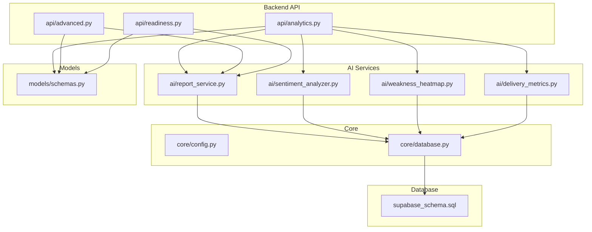
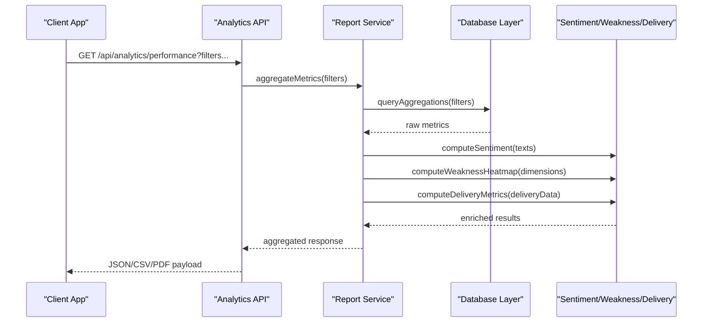

# Analytics API

<cite>
**Referenced Files in This Document**
- [analytics.py](file://backend/api/analytics.py)
- [advanced.py](file://backend/api/advanced.py)
- [readiness.py](file://backend/api/readiness.py)
- [report_service.py](file://backend/ai/report_service.py)
- [sentiment_analyzer.py](file://backend/ai/sentiment_analyzer.py)
- [weakness_heatmap.py](file://backend/ai/weakness_heatmap.py)
- [delivery_metrics.py](file://backend/ai/delivery_metrics.py)
- [models_schemas.py](file://backend/models/schemas.py)
- [core_config.py](file://backend/core/config.py)
- [core_database.py](file://backend/core/database.py)
- [supabase_schema.sql](file://backend/supabase_schema.sql)
</cite>

## Table of Contents
1. [Introduction](#introduction)
2. [Project Structure](#project-structure)
3. [Core Components](#core-components)
4. [Architecture Overview](#architecture-overview)
5. [Detailed Component Analysis](#detailed-component-analysis)
6. [Dependency Analysis](#dependency-analysis)
7. [Performance Considerations](#performance-considerations)
8. [Troubleshooting Guide](#troubleshooting-guide)
9. [Conclusion](#conclusion)
10. [Appendices](#appendices)

## Introduction
This document provides comprehensive API documentation for the Horux analytics and reporting system. It covers endpoints for performance metrics, user engagement tracking, progress assessment, and custom report generation. It also details data aggregation schemas, filtering options, export formats, sentiment analysis results, weakness identification algorithms, readiness scoring mechanisms, dashboard data retrieval patterns, custom metric calculations, automated report scheduling, data retention policies, privacy considerations, and compliance requirements.

## Project Structure
The analytics subsystem is implemented primarily in the backend Python application with FastAPI-style routes under the api package, AI-driven services under ai, shared models and schemas under models, and core configuration and database utilities under core. The Supabase schema defines persistent structures used by analytics queries and aggregations.

**Diagram sources**
- [analytics.py](file://backend/api/analytics.py)
- [advanced.py](file://backend/api/advanced.py)
- [readiness.py](file://backend/api/readiness.py)
- [report_service.py](file://backend/ai/report_service.py)
- [sentiment_analyzer.py](file://backend/ai/sentiment_analyzer.py)
- [weakness_heatmap.py](file://backend/ai/weakness_heatmap.py)
- [delivery_metrics.py](file://backend/ai/delivery_metrics.py)
- [core_config.py](file://backend/core/config.py)
- [core_database.py](file://backend/core/database.py)
- [supabase_schema.sql](file://backend/supabase_schema.sql)
- [models_schemas.py](file://backend/models/schemas.py)

**Section sources**
- [analytics.py](file://backend/api/analytics.py)
- [advanced.py](file://backend/api/advanced.py)
- [readiness.py](file://backend/api/readiness.py)
- [report_service.py](file://backend/ai/report_service.py)
- [sentiment_analyzer.py](file://backend/ai/sentiment_analyzer.py)
- [weakness_heatmap.py](file://backend/ai/weakness_heatmap.py)
- [delivery_metrics.py](file://backend/ai/delivery_metrics.py)
- [core_config.py](file://backend/core/config.py)
- [core_database.py](file://backend/core/database.py)
- [supabase_schema.sql](file://backend/supabase_schema.sql)
- [models_schemas.py](file://backend/models/schemas.py)

## Core Components
- Analytics API: Exposes endpoints for performance metrics, engagement tracking, and aggregated insights.
- Advanced Analytics: Provides deeper analytical capabilities including sentiment analysis and weakness heatmaps.
- Readiness API: Delivers readiness scoring and related assessments.
- Report Service: Orchestrates custom report generation, aggregation, and export.
- Sentiment Analyzer: Computes sentiment scores and categories from textual inputs.
- Weakness Heatmap: Identifies and visualizes areas of weakness across dimensions.
- Delivery Metrics: Calculates delivery-related performance indicators.
- Models/Schemas: Defines request/response structures and validation rules.
- Core Config/Database: Centralized configuration and database access layer.

Key responsibilities:
- Aggregation pipelines for time-series metrics (e.g., daily active users, session durations).
- Filtering by project, team, user, date ranges, and tags.
- Export to CSV/JSON/PDF via report service.
- Readiness scoring combining multiple signals (engagement, delivery, sentiment).
- Privacy-preserving aggregation and anonymization where applicable.

**Section sources**
- [analytics.py](file://backend/api/analytics.py)
- [advanced.py](file://backend/api/advanced.py)
- [readiness.py](file://backend/api/readiness.py)
- [report_service.py](file://backend/ai/report_service.py)
- [sentiment_analyzer.py](file://backend/ai/sentiment_analyzer.py)
- [weakness_heatmap.py](file://backend/ai/weakness_heatmap.py)
- [delivery_metrics.py](file://backend/ai/delivery_metrics.py)
- [models_schemas.py](file://backend/models/schemas.py)
- [core_config.py](file://backend/core/config.py)
- [core_database.py](file://backend/core/database.py)

## Architecture Overview
The analytics architecture follows a layered design:
- API Layer: FastAPI endpoints accept requests, validate parameters, and return structured responses.
- Service Layer: Business logic orchestrates data retrieval, aggregation, and AI computations.
- Data Layer: Database interactions are abstracted through a centralized database module using Supabase.
- AI Layer: Specialized services compute sentiment, weakness heatmaps, and delivery metrics.

**Diagram sources**
- [analytics.py](file://backend/api/analytics.py)
- [report_service.py](file://backend/ai/report_service.py)
- [sentiment_analyzer.py](file://backend/ai/sentiment_analyzer.py)
- [weakness_heatmap.py](file://backend/ai/weakness_heatmap.py)
- [delivery_metrics.py](file://backend/ai/delivery_metrics.py)
- [core_database.py](file://backend/core/database.py)

## Detailed Component Analysis

### Performance Metrics Endpoints
Endpoints provide time-series and summary metrics for performance evaluation. Typical operations include:
- Retrieving daily/weekly/monthly aggregates.
- Filtering by project, team, user, or tag.
- Returning normalized scores and trend indicators.

Request schema highlights:
- filters: object containing project_id, team_id, user_id, date_range, tags.
- granularity: enum ["daily", "weekly", "monthly"].
- metrics: array of metric keys to include.

Response schema highlights:
- data: array of metric points with timestamp and values.
- summary: aggregated statistics (mean, median, min, max).
- metadata: filter criteria applied and generation timestamp.

Export options:
- JSON: default structured format.
- CSV: tabular format for spreadsheet analysis.
- PDF: formatted report with charts and tables.

**Section sources**
- [analytics.py](file://backend/api/analytics.py)
- [report_service.py](file://backend/ai/report_service.py)
- [models_schemas.py](file://backend/models/schemas.py)

### User Engagement Tracking
Engagement endpoints capture and aggregate user interaction data:
- Session counts, duration, frequency.
- Feature usage rates and adoption trends.
- Cohort analysis by onboarding date or campaign.

Filtering options:
- date_range: start_date, end_date.
- cohort: predefined segments.
- feature_set: specific features to analyze.

Aggregation pipeline:
- Raw events -> deduplication -> windowing -> grouping -> normalization.

**Section sources**
- [analytics.py](file://backend/api/analytics.py)
- [core_database.py](file://backend/core/database.py)
- [supabase_schema.sql](file://backend/supabase_schema.sql)

### Progress Assessment
Progress endpoints assess individual or team advancement against goals:
- Milestone completion rates.
- Skill progression vectors.
- Comparative benchmarks against peers.

Scoring mechanism:
- Weighted combination of completion, quality, and timeliness.
- Confidence intervals for reliability.

Output includes:
- current_score, target_score, delta, trajectory.
- breakdown by dimension with weights.

**Section sources**
- [readiness.py](file://backend/api/readiness.py)
- [models_schemas.py](file://backend/models/schemas.py)

### Custom Report Generation
Custom reports allow dynamic composition of metrics and visualizations:
- Select metrics, groupings, and filters.
- Choose output format and schedule recurring runs.

Workflow:
- Define report template with parameters.
- Validate schema and permissions.
- Execute aggregation pipeline.
- Generate export file.

Scheduling:
- Cron-like expressions for periodic execution.
- Notification upon completion.

**Section sources**
- [report_service.py](file://backend/ai/report_service.py)
- [models_schemas.py](file://backend/models/schemas.py)

### Sentiment Analysis Results
Sentiment analysis computes emotional tone from textual feedback:
- Input: free-text comments, transcripts, or survey responses.
- Output: sentiment score (-1 to 1), category (positive, neutral, negative), confidence.

Algorithm overview:
- Text preprocessing (tokenization, normalization).
- Model inference with contextual embeddings.
- Post-processing for calibration and consistency.

Usage examples:
- Aggregate sentiment per project over time.
- Correlate sentiment with performance metrics.

**Section sources**
- [sentiment_analyzer.py](file://backend/ai/sentiment_analyzer.py)
- [report_service.py](file://backend/ai/report_service.py)

### Weakness Identification Algorithms
Weakness detection identifies areas needing improvement:
- Dimensional analysis across skills, tasks, or knowledge areas.
- Heatmap visualization highlighting low-scoring regions.

Process:
- Collect performance indicators per dimension.
- Normalize and weight scores.
- Apply thresholding and clustering to flag weaknesses.

Output:
- Weakness map with severity levels.
- Recommendations for targeted interventions.

**Section sources**
- [weakness_heatmap.py](file://backend/ai/weakness_heatmap.py)
- [models_schemas.py](file://backend/models/schemas.py)

### Readiness Scoring Mechanisms
Readiness scoring synthesizes multiple signals into a unified metric:
- Inputs: engagement, delivery, sentiment, progress.
- Weights configurable per context.
- Calibration against historical baselines.

Result:
- Overall readiness score (0-100).
- Component breakdown and trend analysis.
- Actionable insights for improvement.

**Section sources**
- [readiness.py](file://backend/api/readiness.py)
- [delivery_metrics.py](file://backend/ai/delivery_metrics.py)
- [report_service.py](file://backend/ai/report_service.py)

### Dashboard Data Retrieval
Dashboard endpoints provide optimized payloads for UI rendering:
- Pre-aggregated summaries for quick loading.
- Lazy-loading detailed views on demand.
- Real-time updates via polling or streaming.

Best practices:
- Cache frequently accessed aggregates.
- Use pagination for large datasets.
- Implement error boundaries for resilience.

**Section sources**
- [analytics.py](file://backend/api/analytics.py)
- [report_service.py](file://backend/ai/report_service.py)

### Automated Report Scheduling
Automated scheduling enables recurring report generation:
- Configure cron expressions for timing.
- Specify recipients and delivery channels.
- Monitor execution logs and failures.

Implementation:
- Task queue integration for reliable execution.
- Retry mechanisms with exponential backoff.
- Audit trails for compliance.

**Section sources**
- [report_service.py](file://backend/ai/report_service.py)
- [core_config.py](file://backend/core/config.py)

## Dependency Analysis
The analytics system depends on several internal and external components:
- Internal dependencies: AI services, models, core utilities.
- External dependencies: Supabase for data persistence, AI models for NLP tasks.
- Coupling: Loose coupling between API and services via clear interfaces.
- Cohesion: High cohesion within each service module.

Potential circular dependencies:
- Avoided by separating concerns into distinct modules.
- Dependency injection ensures flexible wiring.

External integrations:
- Supabase client for CRUD operations.
- AI model APIs for sentiment and analysis.

**Section sources**
- [analytics.py](file://backend/api/analytics.py)
- [report_service.py](file://backend/ai/report_service.py)
- [core_database.py](file://backend/core/database.py)
- [supabase_schema.sql](file://backend/supabase_schema.sql)

## Performance Considerations
Optimization strategies employed:
- Query optimization with indexed columns and selective projections.
- Caching layers for repeated aggregations.
- Asynchronous processing for heavy computations.
- Pagination and filtering to reduce payload sizes.

Monitoring and profiling:
- Latency metrics for endpoint responses.
- Throughput measurements under load.
- Error rate tracking and alerting.

Scaling recommendations:
- Horizontal scaling of stateless services.
- Vertical scaling of database instances.
- Connection pooling for efficient resource usage.

[No sources needed since this section provides general guidance]

## Troubleshooting Guide
Common issues and resolutions:
- Authentication failures: Verify token validity and permissions.
- Data inconsistencies: Check schema migrations and constraints.
- Performance degradation: Analyze slow queries and optimize indexes.
- AI model errors: Inspect input formatting and model availability.

Debugging tools:
- Structured logging with correlation IDs.
- Health check endpoints for service status.
- Error tracing with stack traces.

Recovery procedures:
- Rollback failed migrations safely.
- Restore from backups when necessary.
- Graceful degradation during outages.

**Section sources**
- [core_config.py](file://backend/core/config.py)
- [core_database.py](file://backend/core/database.py)

## Conclusion
The Horux analytics and reporting system provides a robust foundation for data-driven decision-making. Its modular architecture, comprehensive API surface, and advanced AI capabilities enable rich insights into performance, engagement, and readiness. By following the documented schemas, filtering options, and best practices, developers can build powerful dashboards and automated reports while maintaining privacy and compliance standards.

[No sources needed since this section summarizes without analyzing specific files]

## Appendices

### Data Retention Policies
- Default retention period: 90 days for raw events, 1 year for aggregated metrics.
- Anonymization after retention expiry.
- Configurable retention per tenant via policy settings.

### Privacy Considerations
- PII minimization in analytics pipelines.
- Consent management for data collection.
- GDPR-compliant data handling and deletion requests.

### Compliance Requirements
- SOC 2 Type II certification alignment.
- Regular security audits and penetration testing.
- Audit logging for all data access and modifications.

**Section sources**
- [core_config.py](file://backend/core/config.py)
- [supabase_schema.sql](file://backend/supabase_schema.sql)