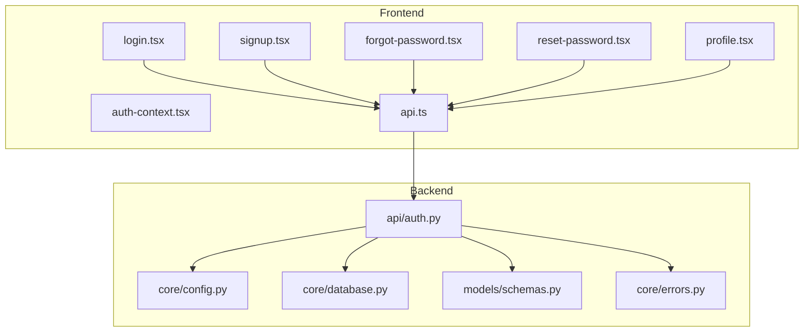
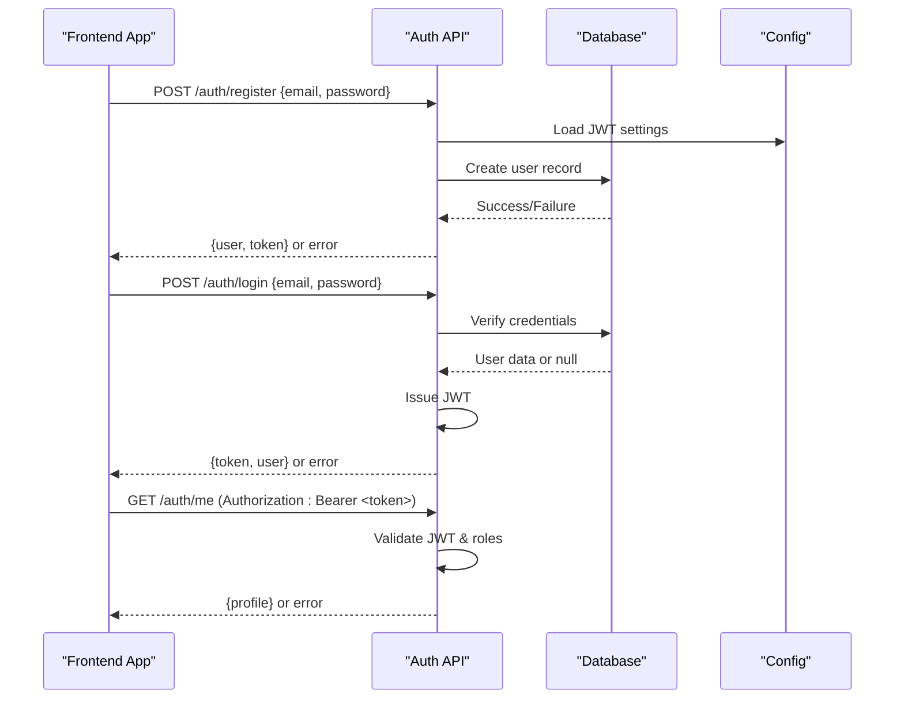
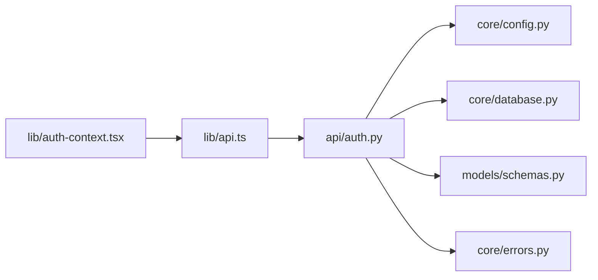

# Authentication API

<cite>
**Referenced Files in This Document**
- [backend/api/auth.py](file://backend/api/auth.py)
- [backend/core/config.py](file://backend/core/config.py)
- [backend/core/database.py](file://backend/core/database.py)
- [backend/core/errors.py](file://backend/core/errors.py)
- [backend/models/schemas.py](file://backend/models/schemas.py)
- [src/routes/login.tsx](file://src/routes/login.tsx)
- [src/routes/signup.tsx](file://src/routes/signup.tsx)
- [src/routes/forgot-password.tsx](file://src/routes/forgot-password.tsx)
- [src/routes/reset-password.tsx](file://src/routes/reset-password.tsx)
- [src/routes/profile.tsx](file://src/routes/profile.tsx)
- [src/lib/auth-context.tsx](file://src/lib/auth-context.tsx)
- [src/lib/api.ts](file://src/lib/api.ts)
</cite>

## Table of Contents
1. [Introduction](#introduction)
2. [Project Structure](#project-structure)
3. [Core Components](#core-components)
4. [Architecture Overview](#architecture-overview)
5. [Detailed Component Analysis](#detailed-component-analysis)
6. [Dependency Analysis](#dependency-analysis)
7. [Performance Considerations](#performance-considerations)
8. [Troubleshooting Guide](#troubleshooting-guide)
9. [Conclusion](#conclusion)
10. [Appendices](#appendices)

## Introduction
This document provides comprehensive API documentation for the Horux authentication system. It covers user registration, login, logout, password reset, and profile management endpoints. It also details JWT token handling, session management, role-based authorization, request/response schemas, error codes, security considerations, practical examples with curl commands, client-side implementation patterns, OAuth integration guidance, multi-factor authentication setup, and best practices.

## Project Structure
The authentication system spans backend API routes, core configuration and database utilities, data schemas, and frontend routes that consume the API. The key files include:
- Backend API route definitions for authentication operations
- Core configuration for secrets, tokens, and environment settings
- Database connection and query helpers
- Pydantic models for request/response validation
- Frontend routes for login, signup, forgot password, reset password, and profile
- Client-side authentication context and API utilities

**Diagram sources**
- [backend/api/auth.py](file://backend/api/auth.py)
- [backend/core/config.py](file://backend/core/config.py)
- [backend/core/database.py](file://backend/core/database.py)
- [backend/models/schemas.py](file://backend/models/schemas.py)
- [backend/core/errors.py](file://backend/core/errors.py)
- [src/routes/login.tsx](file://src/routes/login.tsx)
- [src/routes/signup.tsx](file://src/routes/signup.tsx)
- [src/routes/forgot-password.tsx](file://src/routes/forgot-password.tsx)
- [src/routes/reset-password.tsx](file://src/routes/reset-password.tsx)
- [src/routes/profile.tsx](file://src/routes/profile.tsx)
- [src/lib/auth-context.tsx](file://src/lib/auth-context.tsx)
- [src/lib/api.ts](file://src/lib/api.ts)

**Section sources**
- [backend/api/auth.py](file://backend/api/auth.py)
- [backend/core/config.py](file://backend/core/config.py)
- [backend/core/database.py](file://backend/core/database.py)
- [backend/models/schemas.py](file://backend/models/schemas.py)
- [backend/core/errors.py](file://backend/core/errors.py)
- [src/routes/login.tsx](file://src/routes/login.tsx)
- [src/routes/signup.tsx](file://src/routes/signup.tsx)
- [src/routes/forgot-password.tsx](file://src/routes/forgot-password.tsx)
- [src/routes/reset-password.tsx](file://src/routes/reset-password.tsx)
- [src/routes/profile.tsx](file://src/routes/profile.tsx)
- [src/lib/auth-context.tsx](file://src/lib/auth-context.tsx)
- [src/lib/api.ts](file://src/lib/api.ts)

## Core Components
- Authentication API endpoints: Registration, login, logout, password reset, and profile management are exposed via HTTP endpoints defined in the backend API module. These endpoints validate inputs using Pydantic schemas and interact with the database layer to persist or retrieve user data.
- Configuration: Secrets such as JWT signing keys, token expiration times, and database credentials are managed through a centralized configuration module.
- Database: A database abstraction is used to execute queries for user lookups, credential verification, and profile updates.
- Schemas: Request and response payloads are validated against Pydantic models to ensure consistency and safety.
- Error handling: Standardized error responses are returned for common failure scenarios like invalid credentials, missing fields, and server errors.

Key responsibilities:
- Input validation and sanitization
- Secure password hashing and verification
- JWT issuance, validation, and refresh strategies
- Role-based access control checks on protected endpoints
- Consistent error responses and status codes

**Section sources**
- [backend/api/auth.py](file://backend/api/auth.py)
- [backend/core/config.py](file://backend/core/config.py)
- [backend/core/database.py](file://backend/core/database.py)
- [backend/models/schemas.py](file://backend/models/schemas.py)
- [backend/core/errors.py](file://backend/core/errors.py)

## Architecture Overview
The authentication flow follows a typical client-server pattern:
- The frontend collects user input (credentials, profile data) and sends requests to the backend API.
- The backend validates inputs, interacts with the database, and returns JSON responses.
- JWT tokens are issued upon successful login and included in subsequent requests for authorization.
- Role-based authorization ensures only authorized users can access sensitive endpoints.

**Diagram sources**
- [backend/api/auth.py](file://backend/api/auth.py)
- [backend/core/config.py](file://backend/core/config.py)
- [backend/core/database.py](file://backend/core/database.py)
- [backend/models/schemas.py](file://backend/models/schemas.py)

## Detailed Component Analysis

### Authentication Endpoints
Endpoints typically include:
- Register: Creates a new user account and returns an initial token.
- Login: Authenticates credentials and issues a JWT.
- Logout: Invalidates or revokes the current session/token.
- Password Reset: Initiates a reset flow by sending a secure link or code.
- Reset Password: Completes the reset using a token/code and sets a new password.
- Profile Management: Retrieves and updates the authenticated user’s profile.

Request/Response Schemas:
- Register Request: email (string), password (string)
- Register Response: user object (id, email, roles), token (string)
- Login Request: email (string), password (string)
- Login Response: token (string), user object
- Logout Request: Authorization header with valid token
- Logout Response: success message
- Password Reset Request: email (string)
- Password Reset Response: success message
- Reset Password Request: token (string), newPassword (string)
- Reset Password Response: success message
- Profile Get Response: user profile object
- Profile Update Request: fields to update (e.g., name, avatar)
- Profile Update Response: updated profile object

Error Codes:
- 400 Bad Request: Missing or invalid fields
- 401 Unauthorized: Invalid or expired token, wrong credentials
- 403 Forbidden: Insufficient roles/permissions
- 409 Conflict: Email already exists
- 422 Unprocessable Entity: Validation failures
- 500 Internal Server Error: Unexpected server issues

Security Considerations:
- Enforce HTTPS for all endpoints
- Use strong password policies and hashing algorithms
- Set appropriate JWT expiration and refresh strategies
- Implement rate limiting and brute-force protection
- Validate and sanitize all inputs
- Avoid logging sensitive data

Practical Examples (curl):
- Register: curl -X POST https://api.horux.com/auth/register -H "Content-Type: application/json" -d '{"email":"user@example.com","password":"StrongPass1!"}'
- Login: curl -X POST https://api.horux.com/auth/login -H "Content-Type: application/json" -d '{"email":"user@example.com","password":"StrongPass1!"}'
- Get Profile: curl -X GET https://api.horux.com/auth/me -H "Authorization: Bearer YOUR_JWT_TOKEN"
- Update Profile: curl -X PATCH https://api.horux.com/auth/profile -H "Authorization: Bearer YOUR_JWT_TOKEN" -H "Content-Type: application/json" -d '{"name":"New Name"}'
- Reset Password: curl -X POST https://api.horux.com/auth/password-reset -H "Content-Type: application/json" -d '{"email":"user@example.com"}'
- Complete Reset: curl -X POST https://api.horux.com/auth/reset-password -H "Content-Type: application/json" -d '{"token":"RESET_TOKEN","newPassword":"NewStrongPass1!"}'

Client-Side Implementation Patterns:
- Store tokens securely (httpOnly cookies or secure storage)
- Attach Authorization headers automatically for protected requests
- Handle token refresh transparently
- Show meaningful error messages to users
- Maintain minimal auth state in memory or secure storage

**Section sources**
- [backend/api/auth.py](file://backend/api/auth.py)
- [backend/models/schemas.py](file://backend/models/schemas.py)
- [backend/core/errors.py](file://backend/core/errors.py)
- [src/lib/api.ts](file://src/lib/api.ts)

### JWT Token Handling
- Issuance: Tokens are generated after successful authentication with claims including user identity and roles.
- Validation: Each protected endpoint verifies the token signature, expiration, and claims.
- Refresh Strategy: Implement token refresh flows to minimize re-authentication while maintaining security.
- Storage: Prefer httpOnly cookies for browser clients; use secure storage mechanisms for mobile apps.
- Rotation: Consider rotating signing keys periodically and supporting graceful migration.

Best Practices:
- Short-lived access tokens with long-lived refresh tokens
- Include minimal necessary claims
- Reject tokens from unauthorized origins
- Log token events without exposing sensitive data

**Section sources**
- [backend/core/config.py](file://backend/core/config.py)
- [backend/api/auth.py](file://backend/api/auth.py)

### Session Management
- Stateless JWT sessions: No server-side session store required; rely on token validity.
- Optional server-side revocation: Maintain a denylist for revoked tokens if needed.
- Cookie vs Header: Choose based on platform constraints and security requirements.
- Cross-origin considerations: Configure CORS appropriately and set cookie flags.

**Section sources**
- [backend/core/config.py](file://backend/core/config.py)
- [backend/api/auth.py](file://backend/api/auth.py)

### Role-Based Authorization
- Roles: Define roles such as admin, editor, viewer to control access.
- Claims: Include roles in JWT claims for efficient authorization checks.
- Middleware: Apply role checks at the endpoint level to enforce permissions.
- Least Privilege: Grant minimal roles necessary for each user.

Implementation Tips:
- Centralize role checks in middleware or decorators
- Cache role mappings where appropriate
- Audit privileged actions

**Section sources**
- [backend/api/auth.py](file://backend/api/auth.py)
- [backend/models/schemas.py](file://backend/models/schemas.py)

### OAuth Integration
If applicable, integrate OAuth providers (Google, GitHub, etc.):
- Redirect users to provider consent screens
- Exchange authorization codes for access tokens
- Map provider identities to local user accounts
- Support linking multiple OAuth accounts to one user

Security Notes:
- Validate state parameters to prevent CSRF
- Use PKCE for public clients
- Scope minimization to requested permissions

**Section sources**
- [backend/api/auth.py](file://backend/api/auth.py)
- [backend/core/config.py](file://backend/core/config.py)

### Multi-Factor Authentication Setup
To enhance security:
- Enable TOTP or SMS-based second factors
- Store MFA secrets securely and verify during login
- Provide recovery codes for account recovery
- Allow users to manage MFA preferences

Implementation Steps:
- Add MFA enrollment flow
- Verify second factor during authentication
- Update JWT claims to reflect MFA status

**Section sources**
- [backend/api/auth.py](file://backend/api/auth.py)
- [backend/core/database.py](file://backend/core/database.py)

### Security Best Practices
- Enforce HTTPS everywhere
- Use strong hashing (bcrypt/argon2) for passwords
- Implement rate limiting and CAPTCHA for sensitive endpoints
- Sanitize and validate all inputs
- Rotate secrets regularly
- Monitor and alert on suspicious activity

[No sources needed since this section provides general guidance]

## Dependency Analysis
The authentication system depends on configuration, database, schemas, and error modules. The frontend consumes the API via standardized utilities.

**Diagram sources**
- [backend/api/auth.py](file://backend/api/auth.py)
- [backend/core/config.py](file://backend/core/config.py)
- [backend/core/database.py](file://backend/core/database.py)
- [backend/models/schemas.py](file://backend/models/schemas.py)
- [backend/core/errors.py](file://backend/core/errors.py)
- [src/lib/api.ts](file://src/lib/api.ts)
- [src/lib/auth-context.tsx](file://src/lib/auth-context.tsx)

**Section sources**
- [backend/api/auth.py](file://backend/api/auth.py)
- [backend/core/config.py](file://backend/core/config.py)
- [backend/core/database.py](file://backend/core/database.py)
- [backend/models/schemas.py](file://backend/models/schemas.py)
- [backend/core/errors.py](file://backend/core/errors.py)
- [src/lib/api.ts](file://src/lib/api.ts)
- [src/lib/auth-context.tsx](file://src/lib/auth-context.tsx)

## Performance Considerations
- Minimize payload sizes by returning only necessary fields
- Use pagination for large datasets
- Cache frequently accessed profile data when safe
- Optimize database queries with proper indexing
- Implement connection pooling for the database
- Avoid synchronous blocking operations in request handlers

[No sources needed since this section provides general guidance]

## Troubleshooting Guide
Common issues and resolutions:
- Invalid credentials: Ensure correct email and password; check for case sensitivity and encoding issues.
- Expired token: Implement token refresh logic; verify server time synchronization.
- Missing fields: Validate request payloads against schemas before sending.
- CORS errors: Configure allowed origins and methods on the backend.
- Rate limiting: Reduce request frequency or implement retry with backoff.

Debugging tips:
- Enable detailed logging for failed requests
- Inspect network tab for request/response details
- Verify environment variables for secrets and endpoints
- Test endpoints with curl or Postman to isolate issues

**Section sources**
- [backend/core/errors.py](file://backend/core/errors.py)
- [backend/api/auth.py](file://backend/api/auth.py)

## Conclusion
The Horux authentication system provides robust endpoints for user lifecycle management, secure JWT-based authorization, and scalable session handling. By following the documented schemas, error codes, and security best practices, developers can integrate authentication seamlessly into their applications while maintaining high security standards.

[No sources needed since this section summarizes without analyzing specific files]

## Appendices

### Request/Response Schema Reference
- Register:
  - Request: { email: string, password: string }
  - Response: { user: { id: string, email: string, roles: string[] }, token: string }
- Login:
  - Request: { email: string, password: string }
  - Response: { token: string, user: { id: string, email: string, roles: string[] } }
- Logout:
  - Request: Authorization: Bearer <token>
  - Response: { message: string }
- Password Reset:
  - Request: { email: string }
  - Response: { message: string }
- Reset Password:
  - Request: { token: string, newPassword: string }
  - Response: { message: string }
- Profile:
  - Get Response: { id: string, email: string, name?: string, avatarUrl?: string, roles: string[] }
  - Update Request: { name?: string, avatarUrl?: string }
  - Update Response: { id: string, email: string, name?: string, avatarUrl?: string, roles: string[] }

### Error Code Reference
- 400: Bad Request
- 401: Unauthorized
- 403: Forbidden
- 409: Conflict
- 422: Unprocessable Entity
- 500: Internal Server Error

### Practical Examples (curl)
- Register: curl -X POST https://api.horux.com/auth/register -H "Content-Type: application/json" -d '{"email":"user@example.com","password":"StrongPass1!"}'
- Login: curl -X POST https://api.horux.com/auth/login -H "Content-Type: application/json" -d '{"email":"user@example.com","password":"StrongPass1!"}'
- Get Profile: curl -X GET https://api.horux.com/auth/me -H "Authorization: Bearer YOUR_JWT_TOKEN"
- Update Profile: curl -X PATCH https://api.horux.com/auth/profile -H "Authorization: Bearer YOUR_JWT_TOKEN" -H "Content-Type: application/json" -d '{"name":"New Name"}'
- Reset Password: curl -X POST https://api.horux.com/auth/password-reset -H "Content-Type: application/json" -d '{"email":"user@example.com"}'
- Complete Reset: curl -X POST https://api.horux.com/auth/reset-password -H "Content-Type: application/json" -d '{"token":"RESET_TOKEN","newPassword":"NewStrongPass1!"}'

### Client-Side Implementation Patterns
- Use a centralized API utility to attach Authorization headers
- Manage token storage securely (httpOnly cookies or secure storage)
- Implement automatic token refresh on 401 responses
- Display user-friendly error messages based on error codes
- Keep minimal auth state in memory or secure storage

[No sources needed since this section provides general guidance]