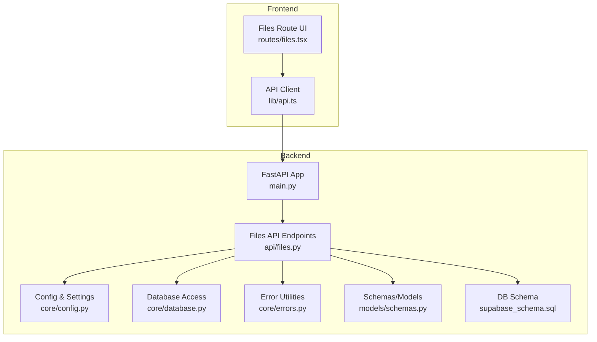
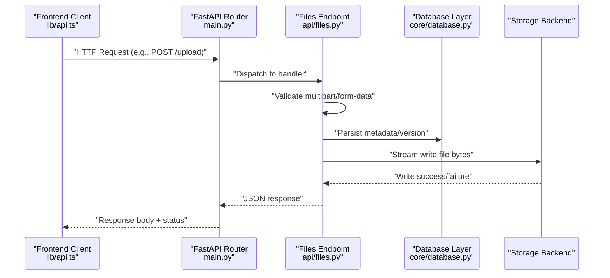
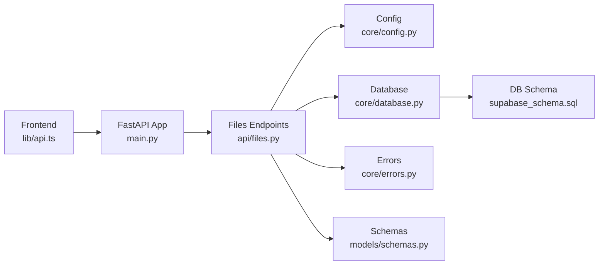

# Files API

<cite>
**Referenced Files in This Document**
- [files.py](file://backend/api/files.py)
- [main.py](file://backend/main.py)
- [config.py](file://backend/core/config.py)
- [database.py](file://backend/core/database.py)
- [errors.py](file://backend/core/errors.py)
- [schemas.py](file://backend/models/schemas.py)
- [supabase_schema.sql](file://backend/supabase_schema.sql)
- [api.ts](file://src/lib/api.ts)
- [files.tsx](file://src/routes/files.tsx)
</cite>

## Table of Contents
1. [Introduction](#introduction)
2. [Project Structure](#project-structure)
3. [Core Components](#core-components)
4. [Architecture Overview](#architecture-overview)
5. [Detailed Component Analysis](#detailed-component-analysis)
6. [Dependency Analysis](#dependency-analysis)
7. [Performance Considerations](#performance-considerations)
8. [Troubleshooting Guide](#troubleshooting-guide)
9. [Conclusion](#conclusion)
10. [Appendices](#appendices)

## Introduction
This document provides comprehensive API documentation for the Horux file management system. It covers file upload, download, preview, and deletion operations with support for various file types and sizes. The backend is implemented as a FastAPI application exposing REST endpoints for file operations, while the frontend integrates via HTTP calls to these endpoints.

The scope includes:
- Multipart form handling for uploads
- Streaming uploads and downloads
- Progress tracking patterns
- Error recovery mechanisms
- File organization, folder structure, and metadata management
- Search capabilities over files
- Batch operations, versioning, and collaborative editing features (as exposed by the API)
- Storage optimization, caching strategies, and security measures for file handling

## Project Structure
The file-related functionality spans both backend and frontend:
- Backend API endpoints are defined under the api module.
- Core configuration, database access, and error utilities live under core.
- Data models and schemas are defined under models.
- Database schema definitions are provided in SQL migrations.
- Frontend integration is present in lib and routes modules.

**Diagram sources**
- [main.py](file://backend/main.py)
- [files.py](file://backend/api/files.py)
- [config.py](file://backend/core/config.py)
- [database.py](file://backend/core/database.py)
- [errors.py](file://backend/core/errors.py)
- [schemas.py](file://backend/models/schemas.py)
- [supabase_schema.sql](file://backend/supabase_schema.sql)
- [api.ts](file://src/lib/api.ts)
- [files.tsx](file://src/routes/files.tsx)

**Section sources**
- [main.py](file://backend/main.py)
- [files.py](file://backend/api/files.py)
- [config.py](file://backend/core/config.py)
- [database.py](file://backend/core/database.py)
- [errors.py](file://backend/core/errors.py)
- [schemas.py](file://backend/models/schemas.py)
- [supabase_schema.sql](file://backend/supabase_schema.sql)
- [api.ts](file://src/lib/api.ts)
- [files.tsx](file://src/routes/files.tsx)

## Core Components
- Files API endpoints: Provide CRUD operations for files, including upload, download, preview, delete, list, search, and batch operations.
- Configuration: Centralizes storage settings, size limits, allowed MIME types, and environment-specific options.
- Database layer: Persists file metadata, folder structures, versions, and relationships.
- Schemas: Pydantic models for request/response validation and serialization.
- Error handling: Standardized error responses and exception mapping.
- Frontend client: Encapsulates HTTP calls to the Files API and handles progress events where applicable.

Key responsibilities:
- Validate multipart forms and enforce size/type constraints.
- Stream large files to/from storage backends.
- Maintain metadata and version history.
- Support search by name, type, tags, and other attributes.
- Enable batch create/update/delete operations.
- Surface errors consistently to clients.

**Section sources**
- [files.py](file://backend/api/files.py)
- [config.py](file://backend/core/config.py)
- [database.py](file://backend/core/database.py)
- [schemas.py](file://backend/models/schemas.py)
- [errors.py](file://backend/core/errors.py)
- [api.ts](file://src/lib/api.ts)

## Architecture Overview
The Files API follows a layered architecture:
- Presentation layer: FastAPI endpoints handle HTTP requests/responses.
- Service layer: Business logic orchestrates file operations, metadata updates, and storage interactions.
- Data layer: Database and storage backends persist data and binary content.
- Client layer: Frontend components call the API using typed helpers.

**Diagram sources**
- [main.py](file://backend/main.py)
- [files.py](file://backend/api/files.py)
- [database.py](file://backend/core/database.py)
- [api.ts](file://src/lib/api.ts)

## Detailed Component Analysis

### Files API Endpoints
The Files API exposes endpoints for:
- Upload: Accepts multipart/form-data with file fields and optional metadata. Supports streaming for large files.
- Download: Streams file content based on identifier or path.
- Preview: Returns a preview representation (e.g., thumbnail or first N bytes) for supported types.
- Delete: Removes file content and associated metadata; supports cascade deletes for versions.
- List/Search: Filters by folder, type, tags, date ranges, and text queries.
- Batch Operations: Create, update, or delete multiple files atomically when possible.
- Versioning: Create new versions for existing files; retrieve previous versions.
- Collaborative Editing: Locking or concurrent edit markers (if implemented).

Request/Response Patterns:
- Upload: multipart/form-data with fields such as file, folder_id, tags, and version flags.
- Download/Preview: query parameters for file id/path and optional range headers.
- Delete: path or query parameter identifying the file and optionally its version.
- List/Search: query parameters for filters and pagination.
- Batch: JSON array of operations with transactional semantics where supported.

Security and Validation:
- Enforce maximum file size and allowed MIME types.
- Sanitize filenames and paths.
- Apply authentication and authorization checks per endpoint.
- Rate limiting and abuse protection at the router level.

Progress Tracking:
- For uploads, clients can use chunked transfers and server-side session IDs to report progress.
- Server may emit progress events via SSE or polling endpoints if implemented.

Error Recovery:
- Idempotent upload tokens to resume interrupted uploads.
- Retryable error codes and standardized error payloads.
- Transaction rollback on partial failures during batch operations.

**Section sources**
- [files.py](file://backend/api/files.py)
- [errors.py](file://backend/core/errors.py)
- [api.ts](file://src/lib/api.ts)

### Configuration and Settings
Configuration controls:
- Storage backend selection and credentials.
- Maximum upload size and chunk size.
- Allowed file extensions and MIME types.
- Cache TTL and CDN integration flags.
- Feature toggles for versioning and collaboration.

Environment variables and defaults are centralized to ensure consistent behavior across deployments.

**Section sources**
- [config.py](file://backend/core/config.py)

### Database Layer and Schema
The database layer abstracts persistence for:
- File records: identifiers, names, paths, sizes, MIME types, timestamps.
- Folder hierarchy: parent-child relationships and permissions.
- Metadata: tags, descriptions, custom attributes.
- Versions: immutable snapshots linked to a base file record.
- Collaboration state: locks, last-editors, conflict resolution hints.

Schema design considerations:
- Normalize frequently queried fields for performance.
- Indexes on common filter columns (name, type, folder_id, created_at).
- Soft deletes for auditability and recovery.

**Section sources**
- [database.py](file://backend/core/database.py)
- [supabase_schema.sql](file://backend/supabase_schema.sql)

### Schemas and Models
Pydantic schemas define:
- Request bodies for upload, update, and batch operations.
- Response models for list/search results and metadata.
- Validation rules for file types, sizes, and tags.
- Serialization formats for version and collaboration states.

These schemas ensure contract stability between frontend and backend.

**Section sources**
- [schemas.py](file://backend/models/schemas.py)

### Frontend Integration
The frontend client encapsulates:
- Typed functions for each endpoint.
- Multipart upload helpers with progress callbacks.
- Error normalization and retry policies.
- Pagination and search query builders.

UI route for files coordinates user actions and displays progress and errors.

**Section sources**
- [api.ts](file://src/lib/api.ts)
- [files.tsx](file://src/routes/files.tsx)

## Dependency Analysis
The Files API depends on configuration, database access, and shared error utilities. The frontend depends on the API client which communicates with the FastAPI app.

**Diagram sources**
- [main.py](file://backend/main.py)
- [files.py](file://backend/api/files.py)
- [config.py](file://backend/core/config.py)
- [database.py](file://backend/core/database.py)
- [errors.py](file://backend/core/errors.py)
- [schemas.py](file://backend/models/schemas.py)
- [supabase_schema.sql](file://backend/supabase_schema.sql)
- [api.ts](file://src/lib/api.ts)

**Section sources**
- [main.py](file://backend/main.py)
- [files.py](file://backend/api/files.py)
- [config.py](file://backend/core/config.py)
- [database.py](file://backend/core/database.py)
- [errors.py](file://backend/core/errors.py)
- [schemas.py](file://backend/models/schemas.py)
- [supabase_schema.sql](file://backend/supabase_schema.sql)
- [api.ts](file://src/lib/api.ts)

## Performance Considerations
- Streaming: Use streaming reads/writes for large files to minimize memory usage.
- Chunked uploads: Break large files into chunks to improve resilience and progress reporting.
- Indexing: Ensure indexes on commonly filtered fields to speed up list/search.
- Caching: Cache metadata and small previews; invalidate on updates/deletes.
- Compression: Compress non-binary assets when appropriate.
- Concurrency: Limit concurrent uploads per user and implement backpressure.
- Storage tiering: Archive older versions to cheaper storage tiers.

[No sources needed since this section provides general guidance]

## Troubleshooting Guide
Common issues and resolutions:
- Upload failures due to size/type restrictions: Verify configuration limits and client payload.
- Partial uploads: Use idempotency keys and resume from last successful chunk.
- Permission errors: Confirm user roles and folder-level access controls.
- Search latency: Check index coverage and refine filters.
- Version conflicts: Implement optimistic locking and merge strategies.

Standardized error responses include code, message, and context to aid debugging.

**Section sources**
- [errors.py](file://backend/core/errors.py)
- [files.py](file://backend/api/files.py)

## Conclusion
The Horux Files API provides a robust foundation for file management with secure, scalable, and user-friendly operations. By leveraging streaming, versioning, metadata-rich indexing, and clear error handling, it supports diverse use cases ranging from simple uploads to collaborative workflows.

[No sources needed since this section summarizes without analyzing specific files]

## Appendices

### API Reference Summary
- Upload: multipart/form-data with file and metadata fields; supports resumable uploads.
- Download: stream file content by id/path; supports range requests.
- Preview: return lightweight representation for supported types.
- Delete: remove file and optionally all versions; soft-delete option available.
- List/Search: filter by folder, type, tags, dates; paginated results.
- Batch: atomic operations for multiple files where supported.
- Versioning: create/retrieve versions; diff and restore capabilities.
- Collaboration: lock/unlock and edit markers for concurrent editing.

[No sources needed since this section provides general guidance]