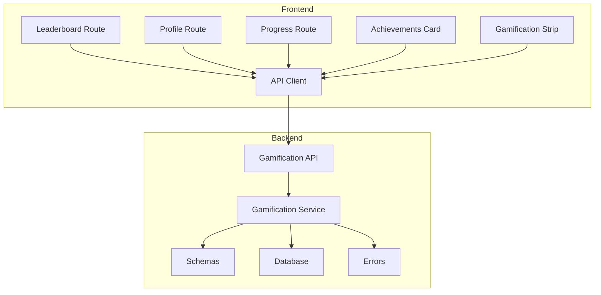
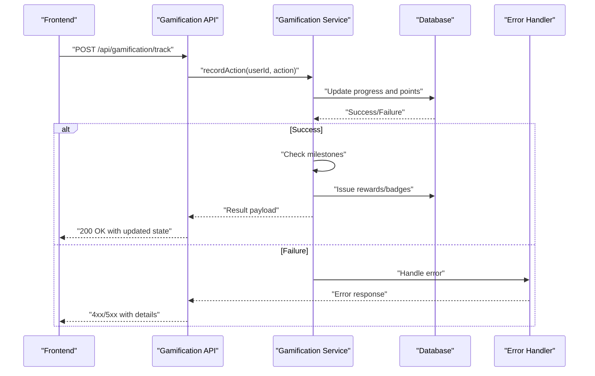
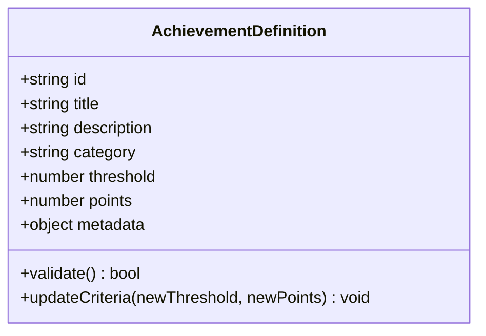
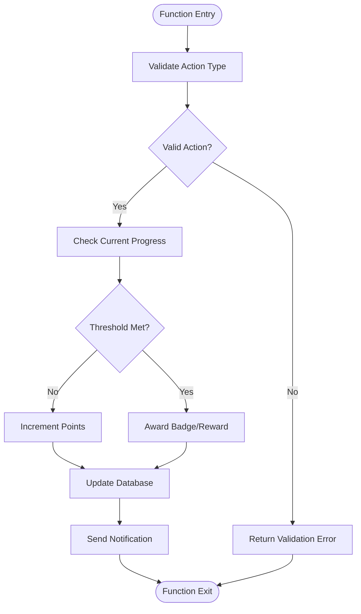
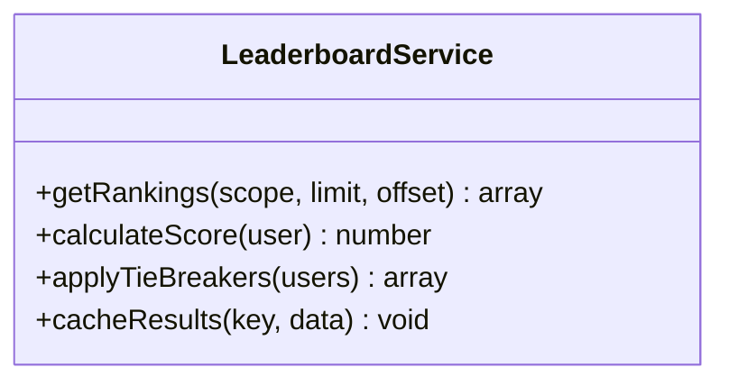
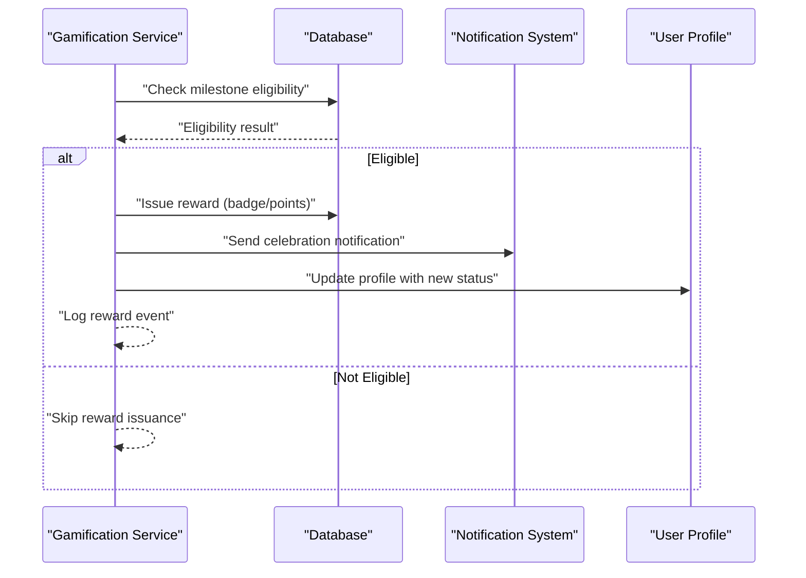
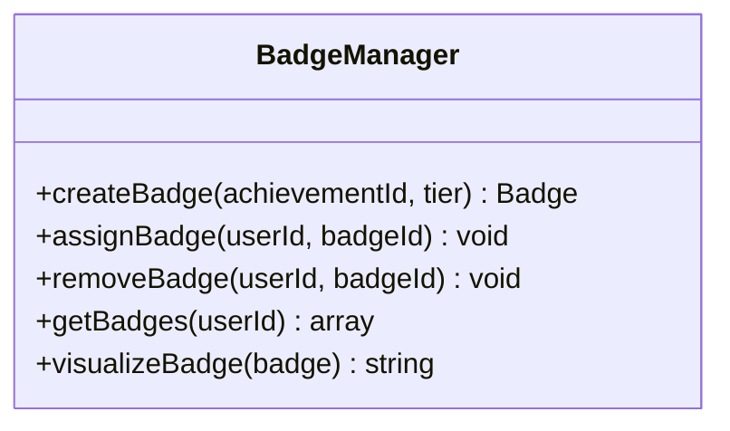
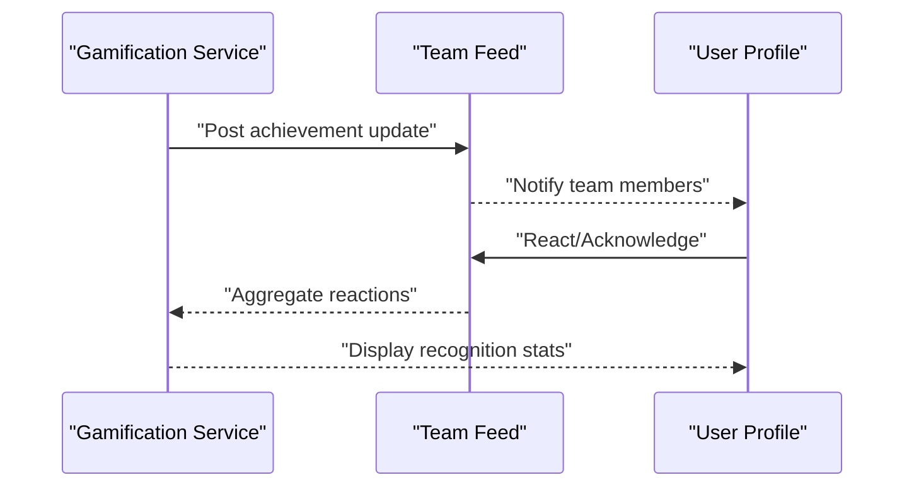
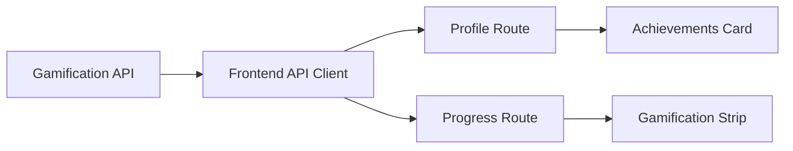
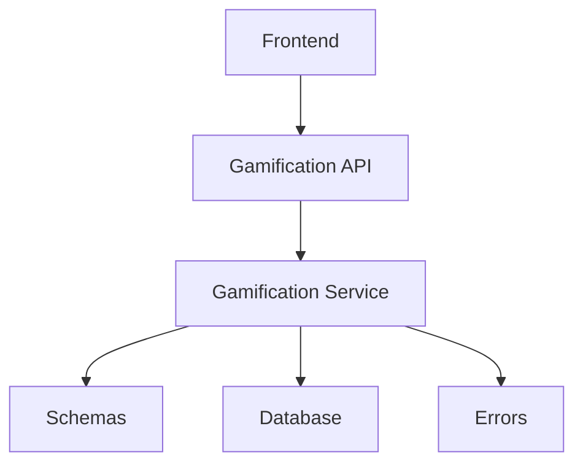

# Gamification API

<cite>
**Referenced Files in This Document**
- [gamification.py](file://backend/api/gamification.py)
- [gamification_service.py](file://backend/services/gamification_service.py)
- [schemas.py](file://backend/models/schemas.py)
- [database.py](file://backend/core/database.py)
- [errors.py](file://backend/core/errors.py)
- [leaderboard.tsx](file://src/routes/leaderboard.tsx)
- [profile.tsx](file://src/routes/profile.tsx)
- [progress.tsx](file://src/routes/progress.tsx)
- [achievements-card.tsx](file://src/components/achievements-card.tsx)
- [gamification-strip.tsx](file://src/components/gamification-strip.tsx)
- [api.ts](file://src/lib/api.ts)
</cite>

## Table of Contents
1. [Introduction](#introduction)
2. [Project Structure](#project-structure)
3. [Core Components](#core-components)
4. [Architecture Overview](#architecture-overview)
5. [Detailed Component Analysis](#detailed-component-analysis)
6. [Dependency Analysis](#dependency-analysis)
7. [Performance Considerations](#performance-considerations)
8. [Troubleshooting Guide](#troubleshooting-guide)
9. [Conclusion](#conclusion)
10. [Appendices](#appendices)

## Introduction
This document provides comprehensive API documentation for the Horux gamification and achievement system. It covers achievement tracking, point systems, leaderboards, reward distribution, badge management, milestone celebrations, social recognition, and integration with user profiles and progress visualization. The goal is to enable developers to implement custom achievements, define point calculation rules, and integrate motivational feedback into the platform seamlessly.

## Project Structure
The gamification system spans backend APIs, services, data models, and frontend routes/components:
- Backend API endpoints are exposed under the gamification module.
- Core business logic resides in a dedicated service layer.
- Data schemas and database interactions are defined in models and core modules.
- Frontend routes and components visualize achievements, leaderboards, and progress.

**Diagram sources**
- [gamification.py](file://backend/api/gamification.py)
- [gamification_service.py](file://backend/services/gamification_service.py)
- [schemas.py](file://backend/models/schemas.py)
- [database.py](file://backend/core/database.py)
- [errors.py](file://backend/core/errors.py)
- [leaderboard.tsx](file://src/routes/leaderboard.tsx)
- [profile.tsx](file://src/routes/profile.tsx)
- [progress.tsx](file://src/routes/progress.tsx)
- [achievements-card.tsx](file://src/components/achievements-card.tsx)
- [gamification-strip.tsx](file://src/components/gamification-strip.tsx)
- [api.ts](file://src/lib/api.ts)

**Section sources**
- [gamification.py](file://backend/api/gamification.py)
- [gamification_service.py](file://backend/services/gamification_service.py)
- [schemas.py](file://backend/models/schemas.py)
- [database.py](file://backend/core/database.py)
- [errors.py](file://backend/core/errors.py)
- [leaderboard.tsx](file://src/routes/leaderboard.tsx)
- [profile.tsx](file://src/routes/profile.tsx)
- [progress.tsx](file://src/routes/progress.tsx)
- [achievements-card.tsx](file://src/components/achievements-card.tsx)
- [gamification-strip.tsx](file://src/components/gamification-strip.tsx)
- [api.ts](file://src/lib/api.ts)

## Core Components
- Achievement Tracking: Records user actions and updates progress toward defined achievements.
- Point System: Assigns points based on configurable rules and aggregates totals per user.
- Leaderboards: Ranks users by points or achievement milestones across teams or globally.
- Reward Distribution: Issues badges, notifications, and incentives upon milestone completion.
- Badge Management: Defines, assigns, and visualizes badges tied to achievements.
- Milestone Celebrations: Triggers celebratory events and notifications when thresholds are met.
- Social Recognition: Shares achievements and milestones within team contexts.

**Section sources**
- [gamification_service.py](file://backend/services/gamification_service.py)
- [schemas.py](file://backend/models/schemas.py)

## Architecture Overview
The gamification architecture follows a layered design:
- API Layer: Exposes REST endpoints for achievement operations, leaderboard queries, and reward issuance.
- Service Layer: Encapsulates business logic for point calculations, progress tracking, and reward distribution.
- Data Layer: Manages schemas, persistence, and database transactions.
- Frontend Integration: Routes and components consume APIs to display achievements, progress, and rankings.

**Diagram sources**
- [gamification.py](file://backend/api/gamification.py)
- [gamification_service.py](file://backend/services/gamification_service.py)
- [database.py](file://backend/core/database.py)
- [errors.py](file://backend/core/errors.py)

## Detailed Component Analysis

### Achievement Definitions Schema
Defines the structure for creating and managing achievements:
- Fields include identifier, title, description, type, threshold, points, and metadata.
- Supports categories such as skill mastery, consistency, collaboration, and innovation.
- Enables dynamic updates and versioning for evolving criteria.

**Diagram sources**
- [schemas.py](file://backend/models/schemas.py)

**Section sources**
- [schemas.py](file://backend/models/schemas.py)

### Progress Tracking and Point Calculation
Tracks user actions and calculates points based on achievement rules:
- Actions are validated against predefined achievement types.
- Points are awarded incrementally or as lump sums upon threshold completion.
- Aggregation ensures accurate cumulative totals per user.

**Diagram sources**
- [gamification_service.py](file://backend/services/gamification_service.py)

**Section sources**
- [gamification_service.py](file://backend/services/gamification_service.py)

### Leaderboard Ranking Algorithm
Ranks users based on total points or specific achievement milestones:
- Supports global and team-specific leaderboards.
- Handles ties using secondary criteria such as recency or consistency.
- Provides paginated results for performance optimization.

**Diagram sources**
- [gamification_service.py](file://backend/services/gamification_service.py)

**Section sources**
- [gamification_service.py](file://backend/services/gamification_service.py)

### Reward Distribution Mechanism
Issues badges, notifications, and incentives upon milestone completion:
- Validates eligibility before awarding rewards.
- Updates user profiles and triggers celebratory events.
- Integrates with notification systems for real-time feedback.

**Diagram sources**
- [gamification_service.py](file://backend/services/gamification_service.py)
- [database.py](file://backend/core/database.py)

**Section sources**
- [gamification_service.py](file://backend/services/gamification_service.py)

### Badge Management
Manages badge lifecycle including creation, assignment, and visualization:
- Badges are tied to specific achievements and can be tiered.
- Supports conditional unlocking based on user actions or time-based criteria.
- Integrates with UI components for display and interaction.

**Diagram sources**
- [gamification_service.py](file://backend/services/gamification_service.py)

**Section sources**
- [gamification_service.py](file://backend/services/gamification_service.py)

### Social Recognition Features
Shares achievements and milestones within team contexts:
- Posts updates to team feeds or channels.
- Allows peer acknowledgment and reactions.
- Encourages collaborative motivation through visibility.

**Diagram sources**
- [gamification_service.py](file://backend/services/gamification_service.py)

**Section sources**
- [gamification_service.py](file://backend/services/gamification_service.py)

### Integration with User Profiles and Progress Visualization
Enhances user experience by integrating gamification data into profiles and progress views:
- Displays achievements, badges, and points on user profiles.
- Visualizes progress through charts and gauges.
- Provides motivational feedback via streaks and milestones.

**Diagram sources**
- [leaderboard.tsx](file://src/routes/leaderboard.tsx)
- [profile.tsx](file://src/routes/profile.tsx)
- [progress.tsx](file://src/routes/progress.tsx)
- [achievements-card.tsx](file://src/components/achievements-card.tsx)
- [gamification-strip.tsx](file://src/components/gamification-strip.tsx)
- [api.ts](file://src/lib/api.ts)

**Section sources**
- [leaderboard.tsx](file://src/routes/leaderboard.tsx)
- [profile.tsx](file://src/routes/profile.tsx)
- [progress.tsx](file://src/routes/progress.tsx)
- [achievements-card.tsx](file://src/components/achievements-card.tsx)
- [gamification-strip.tsx](file://src/components/gamification-strip.tsx)
- [api.ts](file://src/lib/api.ts)

## Dependency Analysis
The gamification system relies on well-defined dependencies between layers:
- API depends on service for business logic.
- Service depends on schemas for data validation and database for persistence.
- Frontend consumes APIs via client libraries for seamless integration.

**Diagram sources**
- [gamification.py](file://backend/api/gamification.py)
- [gamification_service.py](file://backend/services/gamification_service.py)
- [schemas.py](file://backend/models/schemas.py)
- [database.py](file://backend/core/database.py)
- [errors.py](file://backend/core/errors.py)

**Section sources**
- [gamification.py](file://backend/api/gamification.py)
- [gamification_service.py](file://backend/services/gamification_service.py)
- [schemas.py](file://backend/models/schemas.py)
- [database.py](file://backend/core/database.py)
- [errors.py](file://backend/core/errors.py)

## Performance Considerations
- Optimize database queries for leaderboard ranking and progress tracking.
- Implement caching mechanisms for frequently accessed data like badges and points.
- Use pagination for large datasets to improve response times.
- Avoid redundant calculations by leveraging incremental updates.

[No sources needed since this section provides general guidance]

## Troubleshooting Guide
Common issues and resolutions:
- Validation Errors: Ensure action types match predefined achievement categories.
- Database Connection Failures: Verify credentials and network connectivity.
- Missing Rewards: Check eligibility criteria and milestone thresholds.
- Frontend Display Issues: Confirm API responses and data formatting.

**Section sources**
- [errors.py](file://backend/core/errors.py)

## Conclusion
The Horux gamification and achievement system provides a robust framework for enhancing user engagement through structured achievements, points, leaderboards, and rewards. By following the documented schemas, algorithms, and integration patterns, developers can create compelling motivational experiences that drive user growth and collaboration.

[No sources needed since this section summarizes without analyzing specific files]

## Appendices
- Example Custom Achievement Creation: Define new achievements with unique identifiers and thresholds.
- Point Calculation Rules: Configure rules for incremental or milestone-based point awards.
- Leaderboard Ranking Algorithms: Customize tie-breakers and scoring weights.
- Notification Systems: Integrate with email, push, or in-app notifications for real-time feedback.

[No sources needed since this section provides general guidance]