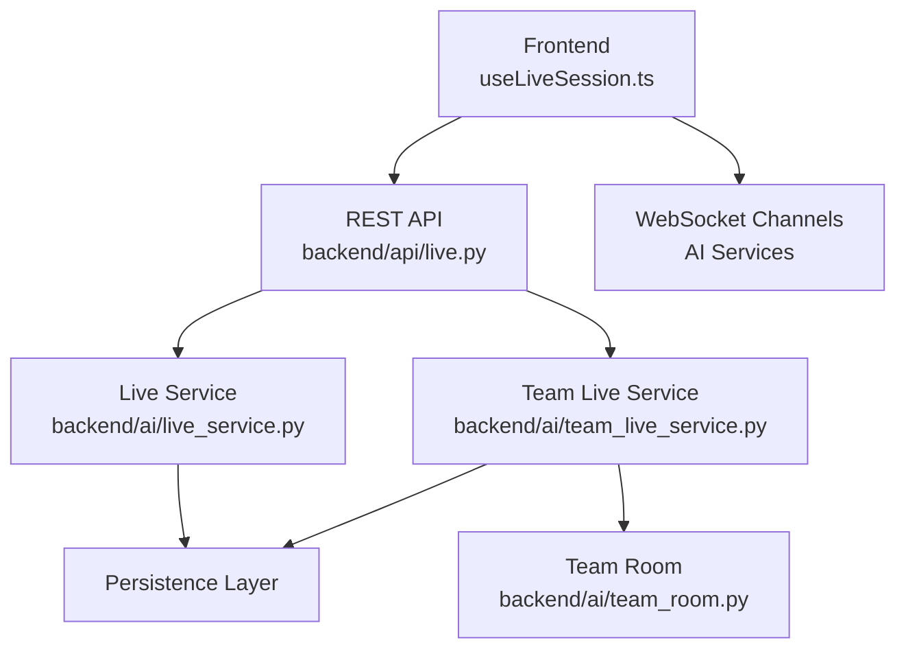
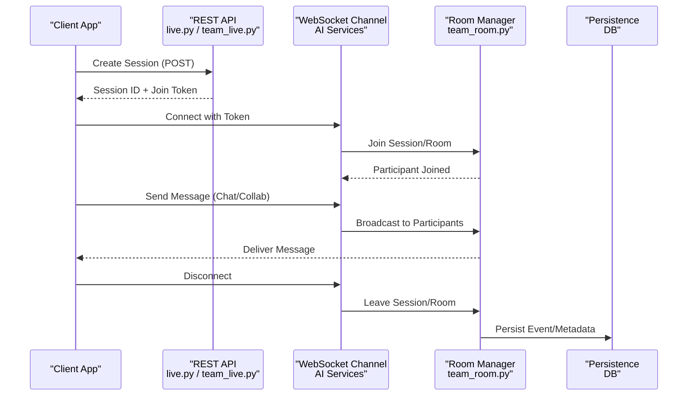
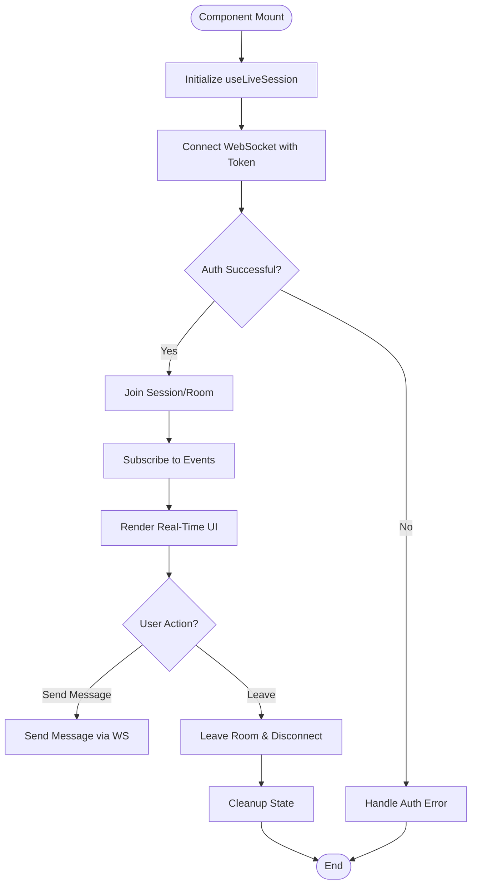
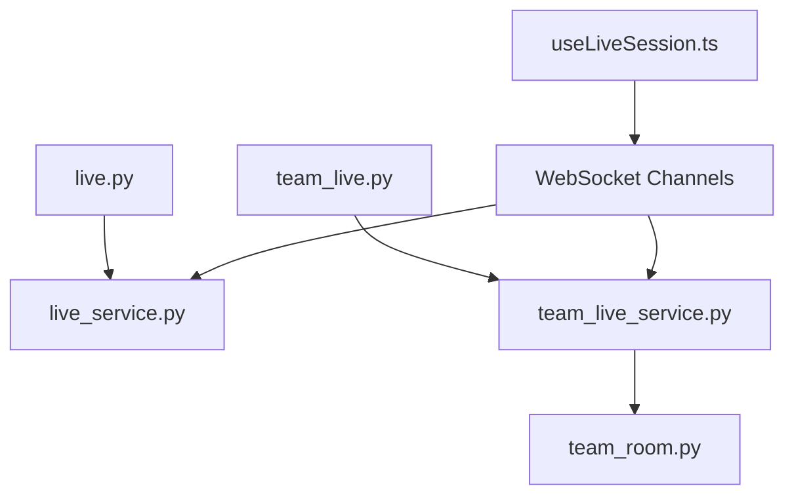

# Live Sessions API

<cite>
**Referenced Files in This Document**
- [backend/api/live.py](file://backend/api/live.py)
- [backend/api/team_live.py](file://backend/api/team_live.py)
- [backend/ai/live_service.py](file://backend/ai/live_service.py)
- [backend/ai/team_live_service.py](file://backend/ai/team_live_service.py)
- [backend/ai/team_room.py](file://backend/ai/team_room.py)
- [src/lib/useLiveSession.ts](file://src/lib/useLiveSession.ts)
- [src/components/live/live-session-runner.tsx](file://src/components/live/live-session-runner.tsx)
- [src/routes/advanced/viva-team_.join.$joinCode.tsx](file://src/routes/advanced/viva-team_.join.$joinCode.tsx)
</cite>

## Table of Contents
1. [Introduction](#introduction)
2. [Project Structure](#project-structure)
3. [Core Components](#core-components)
4. [Architecture Overview](#architecture-overview)
5. [Detailed Component Analysis](#detailed-component-analysis)
6. [Dependency Analysis](#dependency-analysis)
7. [Performance Considerations](#performance-considerations)
8. [Troubleshooting Guide](#troubleshooting-guide)
9. [Conclusion](#conclusion)

## Introduction
This document provides comprehensive API documentation for the Horux real-time live sessions system. It covers WebSocket connections, session lifecycle management, participant coordination, and real-time messaging protocols. It also documents message formats, event types, connection states, error handling strategies, session creation and joining mechanisms, participant management, resource synchronization, and examples of real-time collaboration features such as chat and shared workspace operations. Finally, it outlines scalability considerations, connection pooling, and performance optimization techniques.

## Project Structure
The live sessions feature spans backend APIs, AI services, and frontend hooks and components:
- Backend REST endpoints expose session creation and metadata operations.
- Real-time communication is facilitated by WebSocket channels managed through AI services and room abstractions.
- Frontend hooks manage WebSocket lifecycle, state, and reconnection logic.
- UI components orchestrate session flows and user interactions.

**Diagram sources**
- [backend/api/live.py](file://backend/api/live.py)
- [backend/api/team_live.py](file://backend/api/team_live.py)
- [backend/ai/live_service.py](file://backend/ai/live_service.py)
- [backend/ai/team_live_service.py](file://backend/ai/team_live_service.py)
- [backend/ai/team_room.py](file://backend/ai/team_room.py)
- [src/lib/useLiveSession.ts](file://src/lib/useLiveSession.ts)

**Section sources**
- [backend/api/live.py](file://backend/api/live.py)
- [backend/api/team_live.py](file://backend/api/team_live.py)
- [backend/ai/live_service.py](file://backend/ai/live_service.py)
- [backend/ai/team_live_service.py](file://backend/ai/team_live_service.py)
- [backend/ai/team_room.py](file://backend/ai/team_room.py)
- [src/lib/useLiveSession.ts](file://src/lib/useLiveSession.ts)

## Core Components
- REST API endpoints for session creation and metadata retrieval.
- WebSocket-based real-time channels for live messaging and collaboration.
- Session lifecycle management including creation, joining, participant tracking, and teardown.
- Message routing and broadcasting within rooms or sessions.
- Frontend hook managing connection state, reconnection, and event handling.

Key responsibilities:
- Session creation and validation via REST endpoints.
- Joining sessions using codes or identifiers.
- Broadcasting messages to participants in a session or team room.
- Managing presence (join/leave), permissions, and role-based access.
- Synchronizing shared resources across participants.

**Section sources**
- [backend/api/live.py](file://backend/api/live.py)
- [backend/api/team_live.py](file://backend/api/team_live.py)
- [backend/ai/live_service.py](file://backend/ai/live_service.py)
- [backend/ai/team_live_service.py](file://backend/ai/team_live_service.py)
- [backend/ai/team_room.py](file://backend/ai/team_room.py)
- [src/lib/useLiveSession.ts](file://src/lib/useLiveSession.ts)

## Architecture Overview
The architecture combines REST endpoints with WebSocket channels to deliver real-time collaboration:
- Clients connect via REST to create sessions and obtain join tokens.
- Clients establish WebSocket connections to channel-specific endpoints.
- The server routes messages to participants within the same session or team room.
- Presence and state are maintained per session/room.
- Persistence layers store session metadata and relevant events.

**Diagram sources**
- [backend/api/live.py](file://backend/api/live.py)
- [backend/api/team_live.py](file://backend/api/team_live.py)
- [backend/ai/live_service.py](file://backend/ai/live_service.py)
- [backend/ai/team_live_service.py](file://backend/ai/team_live_service.py)
- [backend/ai/team_room.py](file://backend/ai/team_room.py)

## Detailed Component Analysis

### REST API Endpoints
- Session Creation: POST endpoint to initialize a new live session; returns session identifier and join token.
- Session Metadata: GET endpoint to retrieve session details, participant list, and status.
- Team Session Management: Endpoints for team-level session operations and coordination.

Typical request/response patterns:
- Create Session Request: includes session type, metadata, and optional constraints.
- Create Session Response: includes session ID, join URL/token, and initial configuration.
- Join Flow: client uses token to authenticate WebSocket connection.

Error handling:
- Validation errors return structured error payloads.
- Unauthorized or invalid token responses indicate authentication failures.
- Conflict errors when attempting duplicate session creation.

**Section sources**
- [backend/api/live.py](file://backend/api/live.py)
- [backend/api/team_live.py](file://backend/api/team_live.py)

### WebSocket Channels and Messaging Protocol
- Connection establishment: clients connect to channel endpoints using session tokens.
- Authentication: token verification ensures secure access to channels.
- Message types:
  - Chat messages: text payloads with sender identity and timestamps.
  - Collaboration events: cursor movements, selections, edits, and annotations.
  - Presence events: join, leave, and status updates.
  - Control events: session start, pause, end, and moderation actions.
- Broadcasting: messages are routed to all participants in the same session or room.
- Ordering and deduplication: ensure consistent state across participants.

Message format guidelines:
- Include message type, payload, sender ID, timestamp, and correlation IDs.
- Use versioned schemas to support evolution without breaking clients.
- Provide acknowledgment mechanisms for critical operations.

**Section sources**
- [backend/ai/live_service.py](file://backend/ai/live_service.py)
- [backend/ai/team_live_service.py](file://backend/ai/team_live_service.py)
- [backend/ai/team_room.py](file://backend/ai/team_room.py)

### Session Lifecycle Management
- Creation: REST endpoint initializes session metadata and assigns unique identifiers.
- Joining: clients authenticate with tokens and enter the appropriate channel.
- Active State: participants exchange messages and collaborate in real time.
- Teardown: explicit end or timeout triggers cleanup and persistence of final state.

State transitions:
- Created -> Active -> Ended
- Error states handled via reconnection and recovery mechanisms.

**Section sources**
- [backend/api/live.py](file://backend/api/live.py)
- [backend/ai/live_service.py](file://backend/ai/live_service.py)

### Participant Coordination and Presence
- Presence tracking: monitor join/leave events and maintain active participant lists.
- Role-based access: assign roles (host, moderator, participant) with specific permissions.
- Conflict resolution: handle concurrent edits and synchronize shared resources.
- Moderation tools: mute, kick, and promote participants as needed.

**Section sources**
- [backend/ai/team_room.py](file://backend/ai/team_room.py)
- [backend/ai/team_live_service.py](file://backend/ai/team_live_service.py)

### Resource Synchronization
- Shared documents and canvases: incremental updates broadcast to participants.
- Versioning: track changes and resolve conflicts deterministically.
- Snapshotting: periodic snapshots reduce bandwidth and improve recovery.

**Section sources**
- [backend/ai/live_service.py](file://backend/ai/live_service.py)
- [backend/ai/team_room.py](file://backend/ai/team_room.py)

### Frontend Integration
- useLiveSession hook manages WebSocket lifecycle, reconnection, and event handling.
- Components orchestrate session flows, display real-time updates, and handle user interactions.
- Join flow integrates with routes that accept join codes and initiate connections.

**Diagram sources**
- [src/lib/useLiveSession.ts](file://src/lib/useLiveSession.ts)
- [src/components/live/live-session-runner.tsx](file://src/components/live/live-session-runner.tsx)
- [src/routes/advanced/viva-team_.join.$joinCode.tsx](file://src/routes/advanced/viva-team_.join.$joinCode.tsx)

**Section sources**
- [src/lib/useLiveSession.ts](file://src/lib/useLiveSession.ts)
- [src/components/live/live-session-runner.tsx](file://src/components/live/live-session-runner.tsx)
- [src/routes/advanced/viva-team_.join.$joinCode.tsx](file://src/routes/advanced/viva-team_.join.$joinCode.tsx)

## Dependency Analysis
The live sessions system depends on:
- REST endpoints for session initialization and metadata.
- AI services for WebSocket channel management and message routing.
- Room abstraction for participant coordination and presence.
- Frontend hook for connection management and UI updates.

**Diagram sources**
- [backend/api/live.py](file://backend/api/live.py)
- [backend/api/team_live.py](file://backend/api/team_live.py)
- [backend/ai/live_service.py](file://backend/ai/live_service.py)
- [backend/ai/team_live_service.py](file://backend/ai/team_live_service.py)
- [backend/ai/team_room.py](file://backend/ai/team_room.py)
- [src/lib/useLiveSession.ts](file://src/lib/useLiveSession.ts)

**Section sources**
- [backend/api/live.py](file://backend/api/live.py)
- [backend/api/team_live.py](file://backend/api/team_live.py)
- [backend/ai/live_service.py](file://backend/ai/live_service.py)
- [backend/ai/team_live_service.py](file://backend/ai/team_live_service.py)
- [backend/ai/team_room.py](file://backend/ai/team_room.py)
- [src/lib/useLiveSession.ts](file://src/lib/useLiveSession.ts)

## Performance Considerations
- Connection pooling: reuse WebSocket connections where possible to reduce overhead.
- Message batching: aggregate frequent updates to minimize network traffic.
- Backpressure handling: implement rate limiting and queue management under load.
- Efficient serialization: use compact message formats and avoid unnecessary fields.
- Caching: cache session metadata and frequently accessed data to reduce latency.
- Horizontal scaling: distribute sessions across multiple instances with sticky sessions or shared state stores.

[No sources needed since this section provides general guidance]

## Troubleshooting Guide
Common issues and resolutions:
- Authentication failures: verify token validity and expiration; check authorization headers.
- Connection drops: implement exponential backoff and automatic reconnection.
- Message ordering: ensure monotonic timestamps and sequence numbers.
- Presence inconsistencies: reconcile participant lists on reconnect and during conflicts.
- Resource sync conflicts: apply deterministic conflict resolution strategies and version checks.

Debugging tips:
- Log connection events and message flows for analysis.
- Monitor memory usage and connection counts for leaks.
- Validate message schemas on both client and server sides.

**Section sources**
- [backend/ai/live_service.py](file://backend/ai/live_service.py)
- [backend/ai/team_live_service.py](file://backend/ai/team_live_service.py)
- [backend/ai/team_room.py](file://backend/ai/team_room.py)
- [src/lib/useLiveSession.ts](file://src/lib/useLiveSession.ts)

## Conclusion
The Horux live sessions system provides robust real-time collaboration through a combination of REST APIs and WebSocket channels. It supports session lifecycle management, participant coordination, and synchronized resource sharing. By following the documented protocols and best practices, developers can build scalable and reliable collaborative experiences.

[No sources needed since this section summarizes without analyzing specific files]