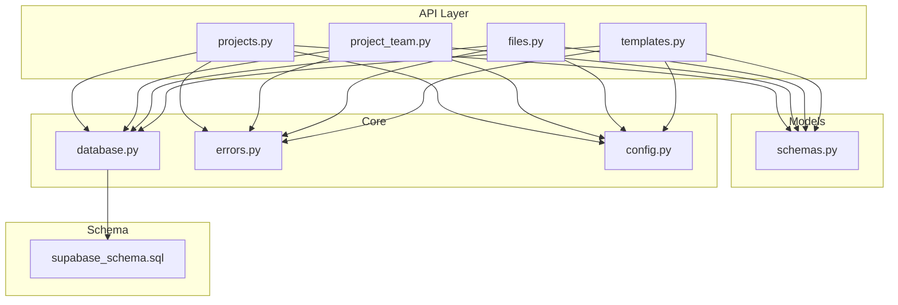
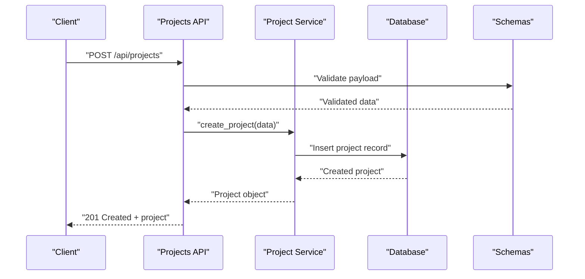
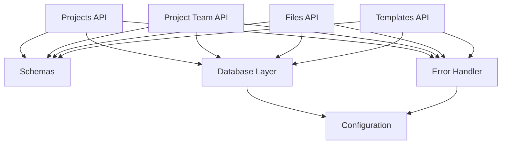

# Projects API

<cite>
**Referenced Files in This Document**
- [projects.py](file://backend/api/projects.py)
- [project_team.py](file://backend/api/project_team.py)
- [files.py](file://backend/api/files.py)
- [templates.py](file://backend/api/templates.py)
- [schemas.py](file://backend/models/schemas.py)
- [database.py](file://backend/core/database.py)
- [errors.py](file://backend/core/errors.py)
- [config.py](file://backend/core/config.py)
- [supabase_schema.sql](file://backend/supabase_schema.sql)
</cite>

## Table of Contents
1. [Introduction](#introduction)
2. [Project Structure](#project-structure)
3. [Core Components](#core-components)
4. [Architecture Overview](#architecture-overview)
5. [Detailed Component Analysis](#detailed-component-analysis)
6. [Dependency Analysis](#dependency-analysis)
7. [Performance Considerations](#performance-considerations)
8. [Troubleshooting Guide](#troubleshooting-guide)
9. [Conclusion](#conclusion)
10. [Appendices](#appendices)

## Introduction
This document provides comprehensive API documentation for the Horux projects management system. It covers project CRUD operations, team assignments, file uploads, collaboration features, permissions and access control, lifecycle management, template usage, version control integration, pagination, filtering, and search functionality. The goal is to enable both frontend developers and integrators to understand how to interact with the backend services effectively.

## Project Structure
The backend exposes RESTful endpoints organized by feature modules:
- Projects: core project lifecycle and status management
- Project Team: member assignment and role-based permissions
- Files: upload, retrieval, and metadata management
- Templates: reusable project templates and instantiation
- Schemas: shared request/response models
- Database: connection and query utilities
- Errors: standardized error handling
- Config: environment configuration

**Diagram sources**
- [projects.py](file://backend/api/projects.py)
- [project_team.py](file://backend/api/project_team.py)
- [files.py](file://backend/api/files.py)
- [templates.py](file://backend/api/templates.py)
- [schemas.py](file://backend/models/schemas.py)
- [database.py](file://backend/core/database.py)
- [errors.py](file://backend/core/errors.py)
- [config.py](file://backend/core/config.py)
- [supabase_schema.sql](file://backend/supabase_schema.sql)

**Section sources**
- [projects.py](file://backend/api/projects.py)
- [project_team.py](file://backend/api/project_team.py)
- [files.py](file://backend/api/files.py)
- [templates.py](file://backend/api/templates.py)
- [schemas.py](file://backend/models/schemas.py)
- [database.py](file://backend/core/database.py)
- [errors.py](file://backend/core/errors.py)
- [config.py](file://backend/core/config.py)
- [supabase_schema.sql](file://backend/supabase_schema.sql)

## Core Components
- Projects API: Create, read, update, delete projects; manage statuses; list with pagination/filtering/search.
- Project Team API: Add/remove members, assign roles, enforce permissions.
- Files API: Upload files, retrieve metadata, manage versions.
- Templates API: List templates, instantiate projects from templates.
- Shared Schemas: Request/response models used across endpoints.
- Database layer: Abstraction over Supabase queries.
- Error handling: Standardized error responses.
- Configuration: Environment variables and runtime settings.

**Section sources**
- [projects.py](file://backend/api/projects.py)
- [project_team.py](file://backend/api/project_team.py)
- [files.py](file://backend/api/files.py)
- [templates.py](file://backend/api/templates.py)
- [schemas.py](file://backend/models/schemas.py)
- [database.py](file://backend/core/database.py)
- [errors.py](file://backend/core/errors.py)
- [config.py](file://backend/core/config.py)

## Architecture Overview
The API follows a layered architecture:
- Controllers (API routes) handle HTTP requests and responses.
- Services encapsulate business logic (e.g., project lifecycle, team management).
- Data access uses a database abstraction to interact with Supabase.
- Models define schemas for validation and serialization.
- Error middleware standardizes error responses.

**Diagram sources**
- [projects.py](file://backend/api/projects.py)
- [schemas.py](file://backend/models/schemas.py)
- [database.py](file://backend/core/database.py)

## Detailed Component Analysis

### Projects API
Endpoints:
- Create project: POST /api/projects
- Get project: GET /api/projects/{id}
- Update project: PATCH /api/projects/{id}
- Delete project: DELETE /api/projects/{id}
- List projects: GET /api/projects?limit=&offset=&q=&status=&team_id=
- Status transitions: PATCH /api/projects/{id}/status

Request/Response Schemas:
- Create Project Request:
  - name: string
  - description: string
  - team_id: string
  - template_id: string (optional)
  - tags: array of strings (optional)
  - metadata: object (optional)
- Update Project Request:
  - name: string (optional)
  - description: string (optional)
  - status: enum (optional)
  - tags: array of strings (optional)
  - metadata: object (optional)
- Delete Project Response:
  - message: string
  - deleted: boolean
- List Projects Response:
  - items: array of project objects
  - total: number
  - limit: number
  - offset: number
- Status Transition Request:
  - status: enum
- Status Transition Response:
  - project: project object

Permissions:
- Only authenticated users can create/update/delete projects.
- Team owners/managers can modify project details.
- Regular members can view and collaborate based on role.

Lifecycle Management:
- Supported statuses: draft, active, paused, completed, archived.
- Transitions enforced by state machine rules.

Pagination, Filtering, Search:
- Pagination: limit (default 20), offset (default 0)
- Filtering: status, team_id
- Search: q parameter matches name/description/tags

Example Requests:
- Create project: POST /api/projects with JSON body
- Update project: PATCH /api/projects/{id} with partial fields
- Delete project: DELETE /api/projects/{id}
- List projects: GET /api/projects?limit=10&offset=0&q=horux&status=active&team_id=uuid
- Status transition: PATCH /api/projects/{id}/status with { "status": "active" }

Error Handling:
- Validation errors return 422 with detailed messages.
- Not found returns 404.
- Unauthorized returns 401.
- Forbidden returns 403.

**Section sources**
- [projects.py](file://backend/api/projects.py)
- [schemas.py](file://backend/models/schemas.py)
- [errors.py](file://backend/core/errors.py)

### Project Team API
Endpoints:
- Add member: POST /api/projects/{id}/team/members
- Remove member: DELETE /api/projects/{id}/team/members/{user_id}
- Update role: PATCH /api/projects/{id}/team/members/{user_id}/role
- List members: GET /api/projects/{id}/team/members

Role-Based Permissions:
- Owner: full access, including deletion and member management
- Manager: edit project details, manage tasks, add/remove members
- Member: view and edit content within scope
- Viewer: read-only access

Access Control:
- Only owners/managers can modify team membership.
- Role inheritance applies to nested resources.

Collaboration Features:
- Real-time updates via WebSocket (if enabled)
- Activity logging for audit trails
- Conflict resolution for concurrent edits

**Section sources**
- [project_team.py](file://backend/api/project_team.py)
- [schemas.py](file://backend/models/schemas.py)
- [errors.py](file://backend/core/errors.py)

### Files API
Endpoints:
- Upload file: POST /api/projects/{id}/files
- Download file: GET /api/files/{file_id}
- Get file metadata: GET /api/files/{file_id}/metadata
- Delete file: DELETE /api/files/{file_id}
- List project files: GET /api/projects/{id}/files

File Upload Process:
- Multipart form data with file and metadata
- Server validates file type and size
- Returns file ID and metadata upon success

Version Control Integration:
- File versions tracked automatically
- Rollback to previous versions supported
- Change history available for audit

Security:
- File type validation prevents malicious uploads
- Access controlled by project permissions
- Secure download links with expiration

**Section sources**
- [files.py](file://backend/api/files.py)
- [schemas.py](file://backend/models/schemas.py)
- [errors.py](file://backend/core/errors.py)

### Templates API
Endpoints:
- List templates: GET /api/templates
- Get template: GET /api/templates/{template_id}
- Create project from template: POST /api/templates/{template_id}/projects

Template Usage:
- Predefined project structures and configurations
- Customizable fields during instantiation
- Versioned templates for consistency

Template Lifecycle:
- Draft templates can be edited
- Published templates are immutable
- Deprecation workflow for outdated templates

**Section sources**
- [templates.py](file://backend/api/templates.py)
- [schemas.py](file://backend/models/schemas.py)

### Data Models and Schemas
Shared schemas ensure consistent data validation across endpoints:
- Project schema defines required and optional fields
- User schema represents team members
- File schema handles metadata and versioning
- Template schema defines reusable project structures

Validation Rules:
- Required field validation
- Type checking and format validation
- Business rule enforcement

Serialization:
- Consistent response formats
- Timestamp formatting
- Null value handling

**Section sources**
- [schemas.py](file://backend/models/schemas.py)

### Database Layer
Database abstraction provides:
- Connection pooling and management
- Query building and execution
- Transaction support
- Error handling and retry logic

Supabase Integration:
- PostgreSQL database with Row Level Security
- Real-time subscriptions for collaboration
- Storage for file management

Migration Management:
- SQL migrations for schema changes
- Version control for database structure
- Rollback capabilities

**Section sources**
- [database.py](file://backend/core/database.py)
- [supabase_schema.sql](file://backend/supabase_schema.sql)

### Error Handling
Standardized error responses include:
- Error code and message
- Detailed validation errors
- Stack traces in development mode

Common Error Types:
- ValidationError: Invalid input data
- NotFoundError: Resource not found
- PermissionError: Insufficient permissions
- DatabaseError: Database operation failures

**Section sources**
- [errors.py](file://backend/core/errors.py)

### Configuration
Environment-based configuration supports:
- Database connection settings
- Authentication providers
- Feature flags
- Logging levels

Security Settings:
- CORS configuration
- Rate limiting
- Input sanitization

**Section sources**
- [config.py](file://backend/core/config.py)

## Dependency Analysis
The API components have clear dependency relationships:
- API routes depend on schemas for validation
- Services depend on database layer for data operations
- All components use centralized error handling
- Configuration drives runtime behavior

**Diagram sources**
- [projects.py](file://backend/api/projects.py)
- [project_team.py](file://backend/api/project_team.py)
- [files.py](file://backend/api/files.py)
- [templates.py](file://backend/api/templates.py)
- [schemas.py](file://backend/models/schemas.py)
- [database.py](file://backend/core/database.py)
- [errors.py](file://backend/core/errors.py)
- [config.py](file://backend/core/config.py)

**Section sources**
- [projects.py](file://backend/api/projects.py)
- [project_team.py](file://backend/api/project_team.py)
- [files.py](file://backend/api/files.py)
- [templates.py](file://backend/api/templates.py)
- [schemas.py](file://backend/models/schemas.py)
- [database.py](file://backend/core/database.py)
- [errors.py](file://backend/core/errors.py)
- [config.py](file://backend/core/config.py)

## Performance Considerations
- Database indexing on frequently queried fields (name, status, team_id)
- Pagination limits prevent large result sets
- Caching strategies for template data
- Connection pooling for database operations
- Asynchronous processing for file uploads
- Compression for large file transfers

Optimization Opportunities:
- Implement Redis caching for frequent queries
- Use database views for complex aggregations
- Optimize N+1 query patterns
- Implement background jobs for heavy operations

## Troubleshooting Guide
Common Issues and Solutions:
- Authentication failures: Check token validity and permissions
- Database connection errors: Verify connection string and network
- File upload failures: Validate file size and type limits
- Permission denied: Review user roles and resource ownership

Debugging Tips:
- Enable detailed logging in development
- Use database query logs to identify slow queries
- Monitor error rates and response times
- Test with different user roles and permissions

Recovery Procedures:
- Database rollback using migration tools
- File recovery from backup storage
- User permission reset through admin interface

**Section sources**
- [errors.py](file://backend/core/errors.py)
- [database.py](file://backend/core/database.py)

## Conclusion
The Horux projects management system provides a comprehensive API for managing projects, teams, files, and templates. With robust authentication, authorization, and data validation, it offers a solid foundation for collaborative project management. The modular architecture ensures maintainability and scalability, while standardized error handling and configuration management support reliable operation.

## Appendices

### API Endpoint Reference
- Projects: CRUD operations and status management
- Project Team: Member management and permissions
- Files: Upload, download, and versioning
- Templates: Template browsing and project creation

### Authentication and Authorization
- JWT-based authentication
- Role-based access control
- Resource-level permissions

### Data Migration
- SQL-based schema migrations
- Backward compatibility considerations
- Rollback procedures