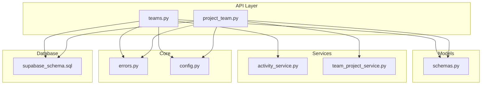
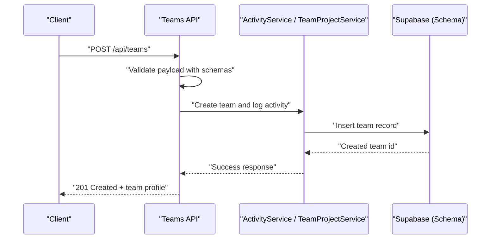
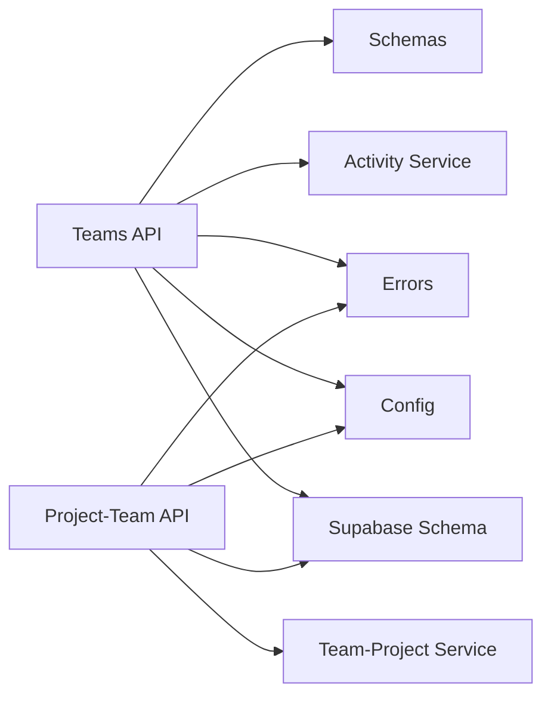

# Teams API

<cite>
**Referenced Files in This Document**
- [backend/api/teams.py](file://backend/api/teams.py)
- [backend/api/project_team.py](file://backend/api/project_team.py)
- [backend/models/schemas.py](file://backend/models/schemas.py)
- [backend/services/activity_service.py](file://backend/services/activity_service.py)
- [backend/services/team_project_service.py](file://backend/services/team_project_service.py)
- [backend/core/errors.py](file://backend/core/errors.py)
- [backend/core/config.py](file://backend/core/config.py)
- [backend/main.py](file://backend/main.py)
- [backend/supabase_schema.sql](file://backend/supabase_schema.sql)
</cite>

## Table of Contents
1. [Introduction](#introduction)
2. [Project Structure](#project-structure)
3. [Core Components](#core-components)
4. [Architecture Overview](#architecture-overview)
5. [Detailed Component Analysis](#detailed-component-analysis)
6. [Dependency Analysis](#dependency-analysis)
7. [Performance Considerations](#performance-considerations)
8. [Troubleshooting Guide](#troubleshooting-guide)
9. [Conclusion](#conclusion)
10. [Appendices](#appendices)

## Introduction
This document provides comprehensive API documentation for the Horux teams management system. It covers team creation, member management, role assignments, permissions, invitations, workspace and resource sharing, collaborative tools integration, lifecycle operations, bulk actions, administrative functions, analytics, performance metrics, and reporting capabilities. The content is derived from the backend API endpoints, data schemas, services, and database schema definitions present in the repository.

## Project Structure
The teams functionality is implemented primarily under the backend module:
- API layer exposes REST endpoints for teams and project-team integrations
- Models define request/response schemas used across endpoints
- Services encapsulate business logic for activity tracking and team-project linking
- Core modules provide configuration and error handling
- Database schema defines persistent structures for teams, members, roles, and related entities

**Diagram sources**
- [backend/api/teams.py](file://backend/api/teams.py)
- [backend/api/project_team.py](file://backend/api/project_team.py)
- [backend/models/schemas.py](file://backend/models/schemas.py)
- [backend/services/activity_service.py](file://backend/services/activity_service.py)
- [backend/services/team_project_service.py](file://backend/services/team_project_service.py)
- [backend/core/errors.py](file://backend/core/errors.py)
- [backend/core/config.py](file://backend/core/config.py)
- [backend/supabase_schema.sql](file://backend/supabase_schema.sql)

**Section sources**
- [backend/main.py](file://backend/main.py)
- [backend/supabase_schema.sql](file://backend/supabase_schema.sql)

## Core Components
- Teams API endpoints: Create, update, delete, list teams; manage members, roles, and permissions; handle invitations and collaboration features.
- Project-Team API endpoints: Link teams to projects, manage shared resources, and coordinate collaborative workflows.
- Schemas: Define structured payloads for team profiles, member invitations, permission settings, and activity tracking records.
- Services: Implement activity logging, team-project linkage logic, and cross-cutting business rules.
- Error handling: Centralized error types and responses for consistent client feedback.
- Configuration: Environment-driven settings for database connectivity and feature toggles.

**Section sources**
- [backend/api/teams.py](file://backend/api/teams.py)
- [backend/api/project_team.py](file://backend/api/project_team.py)
- [backend/models/schemas.py](file://backend/models/schemas.py)
- [backend/services/activity_service.py](file://backend/services/activity_service.py)
- [backend/services/team_project_service.py](file://backend/services/team_project_service.py)
- [backend/core/errors.py](file://backend/core/errors.py)
- [backend/core/config.py](file://backend/core/config.py)

## Architecture Overview
The Teams API follows a layered architecture:
- HTTP endpoints receive requests and validate inputs using Pydantic schemas
- Business logic is delegated to service modules for activity tracking and team-project operations
- Data persistence is handled via Supabase through the defined schema
- Errors are standardized and returned with appropriate status codes

**Diagram sources**
- [backend/api/teams.py](file://backend/api/teams.py)
- [backend/models/schemas.py](file://backend/models/schemas.py)
- [backend/services/activity_service.py](file://backend/services/activity_service.py)
- [backend/supabase_schema.sql](file://backend/supabase_schema.sql)

## Detailed Component Analysis

### Teams API Endpoints
Covers team lifecycle operations including creation, updates, deletion, listing, and membership management. Typical operations include:
- Create team: Accepts team profile data, validates against schemas, persists team, logs activity
- Update team: Partial or full updates to team metadata and settings
- Delete team: Soft or hard delete depending on policy, cascades to dependent records
- List teams: Filtering by owner, status, tags, and pagination
- Manage members: Add/remove members, assign roles, set permissions
- Invitations: Generate invite links or emails, track acceptance status
- Collaboration features: Enable/disable shared workspaces, integrate with collaborative tools

Request/response patterns use typed schemas for consistency and validation. Activity events are recorded for auditability and analytics.

**Section sources**
- [backend/api/teams.py](file://backend/api/teams.py)
- [backend/models/schemas.py](file://backend/models/schemas.py)
- [backend/services/activity_service.py](file://backend/services/activity_service.py)

### Project-Team Integration
Endpoints link teams to projects, enabling shared resources and collaborative workflows:
- Link team to project: Associate existing team with a project, configure access levels
- Unlink team from project: Remove association while preserving history
- Shared resources: Manage files, tasks, and documents within the team-project context
- Collaborative tools: Integrate with external tools via configured providers

Operations enforce permissions based on team roles and project ownership policies.

**Section sources**
- [backend/api/project_team.py](file://backend/api/project_team.py)
- [backend/services/team_project_service.py](file://backend/services/team_project_service.py)

### Data Schemas
Schemas define the structure for:
- Team profiles: name, description, owner_id, created_at, updated_at, status, tags
- Member invitations: email, role, expiry, status, invited_by
- Permission settings: read, write, admin flags per resource type
- Activity tracking: actor_id, action, target_type, target_id, timestamp, metadata

These schemas ensure consistent payloads across endpoints and facilitate validation.

**Section sources**
- [backend/models/schemas.py](file://backend/models/schemas.py)

### Activity Tracking Service
Encapsulates logging of user actions related to teams and projects:
- Record activity: actor, action, target, context metadata
- Query activities: filter by team, user, time range, action type
- Export/reporting: aggregate counts, trends, and anomalies

Activity data supports analytics dashboards and compliance audits.

**Section sources**
- [backend/services/activity_service.py](file://backend/services/activity_service.py)

### Team-Project Service
Manages relationships between teams and projects:
- Link/unlink operations with validation and conflict resolution
- Resource sharing policies enforcement
- Collaboration state synchronization

Ensures data integrity and consistent access control across linked entities.

**Section sources**
- [backend/services/team_project_service.py](file://backend/services/team_project_service.py)

### Error Handling
Centralized error types provide consistent responses:
- Validation errors: malformed payloads, missing fields
- Authorization errors: insufficient permissions
- Conflict errors: duplicate resources, race conditions
- Not found errors: invalid IDs or deleted resources

Clients should handle these statuses and messages appropriately.

**Section sources**
- [backend/core/errors.py](file://backend/core/errors.py)

### Configuration
Environment variables control behavior:
- Database connection parameters
- Feature flags for collaboration tools
- Rate limiting and caching settings

Ensure secure configuration management in production environments.

**Section sources**
- [backend/core/config.py](file://backend/core/config.py)

## Dependency Analysis
The Teams API depends on schemas for validation, services for business logic, and the database schema for persistence. Error handling and configuration are shared across components.

**Diagram sources**
- [backend/api/teams.py](file://backend/api/teams.py)
- [backend/api/project_team.py](file://backend/api/project_team.py)
- [backend/models/schemas.py](file://backend/models/schemas.py)
- [backend/services/activity_service.py](file://backend/services/activity_service.py)
- [backend/services/team_project_service.py](file://backend/services/team_project_service.py)
- [backend/core/errors.py](file://backend/core/errors.py)
- [backend/core/config.py](file://backend/core/config.py)
- [backend/supabase_schema.sql](file://backend/supabase_schema.sql)

**Section sources**
- [backend/api/teams.py](file://backend/api/teams.py)
- [backend/api/project_team.py](file://backend/api/project_team.py)
- [backend/models/schemas.py](file://backend/models/schemas.py)
- [backend/services/activity_service.py](file://backend/services/activity_service.py)
- [backend/services/team_project_service.py](file://backend/services/team_project_service.py)
- [backend/core/errors.py](file://backend/core/errors.py)
- [backend/core/config.py](file://backend/core/config.py)
- [backend/supabase_schema.sql](file://backend/supabase_schema.sql)

## Performance Considerations
- Use pagination and filtering for large team lists and activity logs
- Cache frequently accessed team profiles and permissions where appropriate
- Batch operations for bulk member additions/removals to reduce round trips
- Index commonly queried fields in the database schema for faster lookups
- Monitor activity logging volume to avoid bottlenecks during high-frequency operations

[No sources needed since this section provides general guidance]

## Troubleshooting Guide
Common issues and resolutions:
- Validation errors: Ensure all required fields are present and correctly typed
- Authorization failures: Verify user roles and permissions for the requested operation
- Duplicate resource conflicts: Check for existing teams or memberships before creating
- Not found errors: Confirm entity IDs exist and are not deleted
- Database connectivity: Validate configuration and network access to Supabase

Use standardized error responses to diagnose and resolve issues efficiently.

**Section sources**
- [backend/core/errors.py](file://backend/core/errors.py)

## Conclusion
The Horux Teams API provides a robust foundation for managing teams, members, roles, permissions, and collaborative workflows. With well-defined schemas, centralized error handling, and integrated activity tracking, it supports scalable team management and analytics. Proper configuration and performance optimizations ensure reliable operation in production environments.

[No sources needed since this section summarizes without analyzing specific files]

## Appendices

### Team Lifecycle Management Examples
- Create team: Submit team profile, receive confirmation and ID
- Invite members: Generate invitation with role and expiry, track acceptance
- Assign roles: Set read/write/admin permissions per resource
- Archive team: Deactivate team while preserving historical data
- Delete team: Remove team and associated records per policy

**Section sources**
- [backend/api/teams.py](file://backend/api/teams.py)
- [backend/models/schemas.py](file://backend/models/schemas.py)

### Bulk Operations
- Bulk add members: Upload CSV or JSON array of member invites
- Bulk update roles: Apply role changes across multiple members
- Bulk archive/delete: Process multiple teams in a single request

**Section sources**
- [backend/api/teams.py](file://backend/api/teams.py)

### Administrative Functions
- View all teams: Admin-only listing with filters and export
- Audit activity: Access logs for compliance and reporting
- Manage permissions: Override team-level settings when necessary

**Section sources**
- [backend/api/teams.py](file://backend/api/teams.py)
- [backend/services/activity_service.py](file://backend/services/activity_service.py)

### Analytics and Reporting
- Team growth metrics: New members, active users over time
- Activity summaries: Actions per team, top contributors
- Collaboration insights: Shared resources usage, tool integration stats

**Section sources**
- [backend/services/activity_service.py](file://backend/services/activity_service.py)