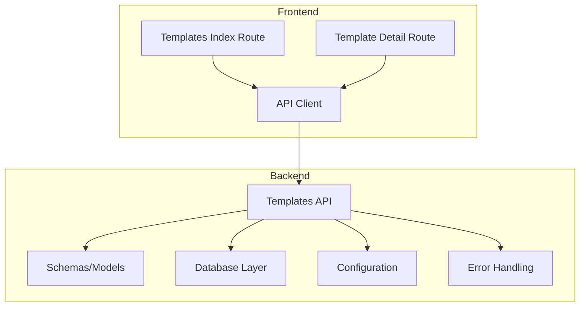
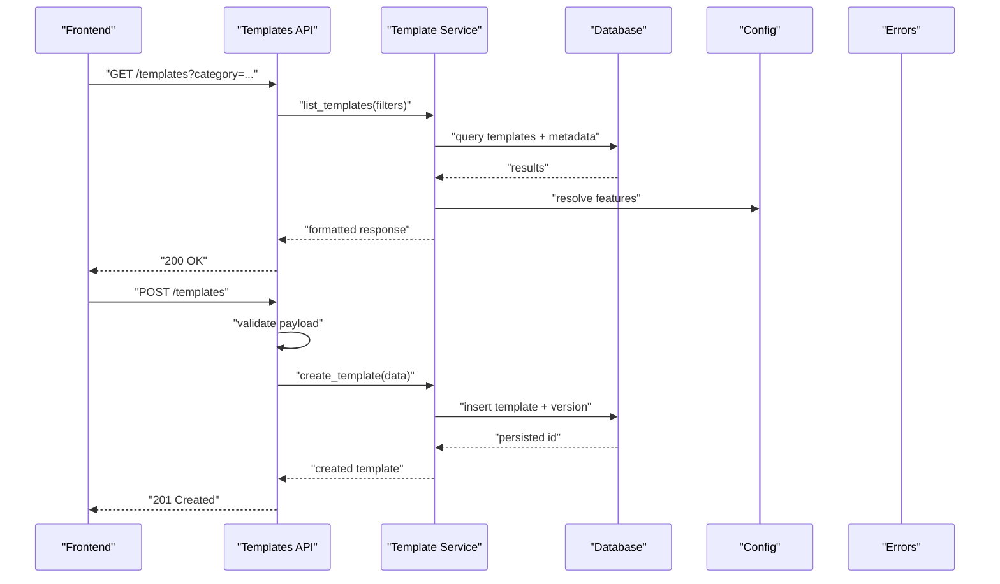
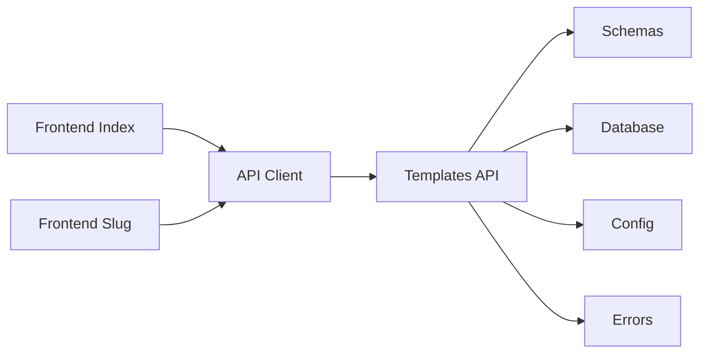

# Templates API

<cite>
**Referenced Files in This Document**
- [templates.py](file://backend/api/templates.py)
- [schemas.py](file://backend/models/schemas.py)
- [database.py](file://backend/core/database.py)
- [config.py](file://backend/core/config.py)
- [errors.py](file://backend/core/errors.py)
- [index.tsx](file://src/routes/templates/index.tsx)
- [$slug.tsx](file://src/routes/templates/$slug.tsx)
- [api.ts](file://src/lib/api.ts)
</cite>

## Table of Contents
1. [Introduction](#introduction)
2. [Project Structure](#project-structure)
3. [Core Components](#core-components)
4. [Architecture Overview](#architecture-overview)
5. [Detailed Component Analysis](#detailed-component-analysis)
6. [Dependency Analysis](#dependency-analysis)
7. [Performance Considerations](#performance-considerations)
8. [Troubleshooting Guide](#troubleshooting-guide)
9. [Conclusion](#conclusion)
10. [Appendices](#appendices)

## Introduction
This document provides comprehensive API documentation for the Horux template management system. It covers template creation, customization, versioning, and deployment workflows. It also documents schemas for template structures, variable substitution, conditional logic, dynamic content generation, categories, metadata management, search functionality, inheritance and composition patterns, validation, testing utilities, and deployment automation. The goal is to enable both technical and non-technical users to understand and integrate with the templates API effectively.

## Project Structure
The template system spans backend APIs, data models, database interactions, and frontend routes:
- Backend API endpoints for templates are implemented under the backend API layer.
- Data schemas and models are defined in the models layer.
- Database connectivity and configuration are managed in the core layer.
- Frontend routes provide user-facing template browsing and detail views.

**Diagram sources**
- [templates.py](file://backend/api/templates.py)
- [schemas.py](file://backend/models/schemas.py)
- [database.py](file://backend/core/database.py)
- [config.py](file://backend/core/config.py)
- [errors.py](file://backend/core/errors.py)
- [index.tsx](file://src/routes/templates/index.tsx)
- [$slug.tsx](file://src/routes/templates/$slug.tsx)
- [api.ts](file://src/lib/api.ts)

**Section sources**
- [templates.py](file://backend/api/templates.py)
- [schemas.py](file://backend/models/schemas.py)
- [database.py](file://backend/core/database.py)
- [config.py](file://backend/core/config.py)
- [errors.py](file://backend/core/errors.py)
- [index.tsx](file://src/routes/templates/index.tsx)
- [$slug.tsx](file://src/routes/templates/$slug.tsx)
- [api.ts](file://src/lib/api.ts)

## Core Components
- Templates API: Provides endpoints for CRUD operations, versioning, categorization, metadata, search, and deployment actions.
- Schemas/Models: Define request/response shapes, validation rules, and relationships (e.g., template versions, variables, conditions).
- Database Layer: Manages connections, queries, and transactions for template persistence.
- Configuration: Centralizes environment-specific settings such as storage backends and feature flags.
- Error Handling: Standardized error responses and exception mapping.

Key responsibilities:
- Template lifecycle: create, read, update, delete, publish, archive.
- Versioning: maintain multiple versions per template; support rollback and promotion.
- Customization: variable substitution, conditional blocks, dynamic content generation.
- Categorization and metadata: tags, categories, descriptions, authors, licenses.
- Search and discovery: filter by category, tag, author, version status, and full-text search.
- Deployment: export, package, and deploy templates to target environments.

**Section sources**
- [templates.py](file://backend/api/templates.py)
- [schemas.py](file://backend/models/schemas.py)
- [database.py](file://backend/core/database.py)
- [config.py](file://backend/core/config.py)
- [errors.py](file://backend/core/errors.py)

## Architecture Overview
The template system follows a layered architecture:
- Frontend routes call the API client to interact with backend endpoints.
- The backend API orchestrates business logic, validates inputs, and delegates to services and repositories.
- Data models enforce schema constraints and relationships.
- Database layer handles persistence and retrieval.

**Diagram sources**
- [templates.py](file://backend/api/templates.py)
- [schemas.py](file://backend/models/schemas.py)
- [database.py](file://backend/core/database.py)
- [config.py](file://backend/core/config.py)
- [errors.py](file://backend/core/errors.py)

## Detailed Component Analysis

### Templates API Endpoints
- List templates: supports filtering by category, tags, author, version status, and search keywords.
- Get template: retrieves template details including metadata, variables, and latest version.
- Create template: accepts structured payload with name, description, category, variables, and initial version.
- Update template: modifies metadata and optionally updates current version.
- Delete template: soft-delete or hard-delete depending on policy.
- Versioning: list versions, get specific version, promote version, rollback to previous version.
- Variables and conditions: define variable schemas, default values, and conditional rendering rules.
- Deployment: export template bundle, validate before deploy, push to target environment.

Request/response patterns:
- Consistent JSON payloads with standardized fields for id, timestamps, author, and status.
- Validation errors return structured messages indicating field-level issues.
- Pagination and sorting supported for list endpoints.

**Section sources**
- [templates.py](file://backend/api/templates.py)

### Schemas and Models
Template structure includes:
- Metadata: title, description, category, tags, author, license, created_at, updated_at.
- Variables: name, type, required, default, validation rules, options.
- Conditions: expressions based on variables and context; support boolean logic and comparisons.
- Versions: version number, status (draft, published, archived), changelog, dependencies.
- Content: body text, snippets, assets references, and dynamic placeholders.

Validation rules:
- Required fields enforced at schema level.
- Type checks for variables and conditions.
- Conditional expression syntax validated before save.

Relationships:
- One-to-many between templates and versions.
- Many-to-many between templates and categories/tags.
- References to assets and external resources.

**Section sources**
- [schemas.py](file://backend/models/schemas.py)

### Database Layer
Responsibilities:
- Connection pooling and transaction management.
- Query builders for complex filters and joins.
- Migrations for schema evolution.
- Indexes on frequently queried fields (category, tags, author, status).

Data integrity:
- Foreign keys ensure referential integrity between templates, versions, and metadata.
- Constraints prevent invalid states (e.g., duplicate version numbers).

**Section sources**
- [database.py](file://backend/core/database.py)

### Configuration
Settings include:
- Storage backend selection (local, cloud).
- Feature flags for advanced templating features.
- Rate limiting and caching policies.
- Environment-specific defaults for variables and conditions.

**Section sources**
- [config.py](file://backend/core/config.py)

### Error Handling
Standardized error responses:
- 400 Bad Request for validation failures.
- 404 Not Found for missing templates or versions.
- 409 Conflict for duplicate entries or invalid state transitions.
- 500 Internal Server Error for unexpected failures.

Error payloads include:
- Code, message, and field-level details where applicable.

**Section sources**
- [errors.py](file://backend/core/errors.py)

### Frontend Integration
- Templates index route displays a searchable, filterable list of templates.
- Template detail route shows metadata, variables, conditions, and version history.
- API client abstracts HTTP calls and handles error mapping.

User workflows:
- Browse and search templates.
- View template details and version history.
- Create new templates via guided forms.
- Deploy templates through integrated actions.

**Section sources**
- [index.tsx](file://src/routes/templates/index.tsx)
- [$slug.tsx](file://src/routes/templates/$slug.tsx)
- [api.ts](file://src/lib/api.ts)

## Dependency Analysis
The template system has clear separation of concerns:
- Frontend depends on API client for data operations.
- Backend API depends on schemas for validation and database for persistence.
- Configuration influences behavior across layers.
- Error handling centralizes exception management.

**Diagram sources**
- [templates.py](file://backend/api/templates.py)
- [schemas.py](file://backend/models/schemas.py)
- [database.py](file://backend/core/database.py)
- [config.py](file://backend/core/config.py)
- [errors.py](file://backend/core/errors.py)
- [index.tsx](file://src/routes/templates/index.tsx)
- [$slug.tsx](file://src/routes/templates/$slug.tsx)
- [api.ts](file://src/lib/api.ts)

**Section sources**
- [templates.py](file://backend/api/templates.py)
- [schemas.py](file://backend/models/schemas.py)
- [database.py](file://backend/core/database.py)
- [config.py](file://backend/core/config.py)
- [errors.py](file://backend/core/errors.py)
- [index.tsx](file://src/routes/templates/index.tsx)
- [$slug.tsx](file://src/routes/templates/$slug.tsx)
- [api.ts](file://src/lib/api.ts)

## Performance Considerations
- Use pagination and selective field retrieval for large template lists.
- Cache frequently accessed templates and metadata.
- Optimize database queries with proper indexing on category, tags, and author fields.
- Implement rate limiting to prevent abuse.
- Validate inputs early to reduce unnecessary processing.

[No sources needed since this section provides general guidance]

## Troubleshooting Guide
Common issues and resolutions:
- Validation errors: Check request payload against schema definitions.
- Missing templates: Verify IDs and permissions.
- Version conflicts: Ensure unique version numbers and correct state transitions.
- Deployment failures: Review export logs and target environment configuration.

Debugging tips:
- Enable detailed logging for API requests and database queries.
- Use test utilities to validate template schemas and conditions.
- Inspect error payloads for field-level details.

**Section sources**
- [errors.py](file://backend/core/errors.py)
- [templates.py](file://backend/api/templates.py)

## Conclusion
The Horux template management system provides a robust foundation for creating, customizing, versioning, and deploying templates. With well-defined schemas, flexible variable substitution, conditional logic, and comprehensive search capabilities, it supports diverse use cases. Proper integration with project workflows ensures seamless adoption and scalability.

[No sources needed since this section summarizes without analyzing specific files]

## Appendices

### Template Creation Workflow
1. Submit template metadata and initial version via create endpoint.
2. System validates payload and persists template with draft status.
3. Author can update variables, conditions, and content.
4. Publish template to make it available for discovery.

### Variable Substitution and Conditional Logic
- Variables support types like string, number, boolean, and enum.
- Default values and validation rules ensure consistency.
- Conditional expressions allow dynamic content based on variables and context.

### Template Categories and Metadata
- Categories organize templates by purpose or domain.
- Tags provide granular classification.
- Metadata includes author, license, and descriptive fields.

### Search Functionality
- Filter by category, tags, author, and version status.
- Full-text search across titles, descriptions, and content.
- Sorting by relevance, date, or popularity.

### Template Inheritance and Composition
- Base templates define common structures and behaviors.
- Derived templates inherit and override specific sections.
- Composition allows combining reusable components.

### Validation and Testing Utilities
- Schema validators enforce structure and constraints.
- Test utilities simulate variable substitution and condition evaluation.
- Automated tests verify template rendering and deployment readiness.

### Deployment Automation
- Export templates into portable bundles.
- Validate bundles before deployment.
- Push to target environments with rollback support.

[No sources needed since this section provides general guidance]