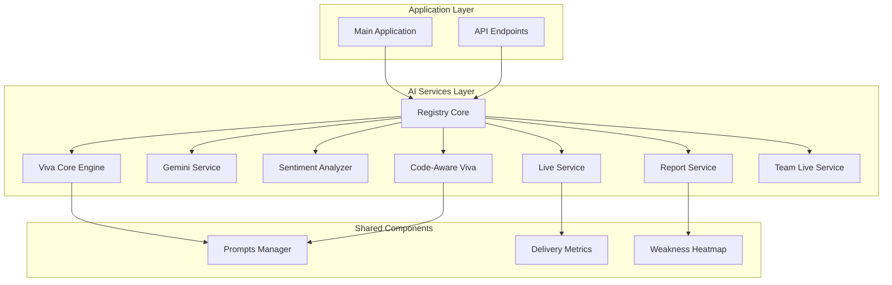
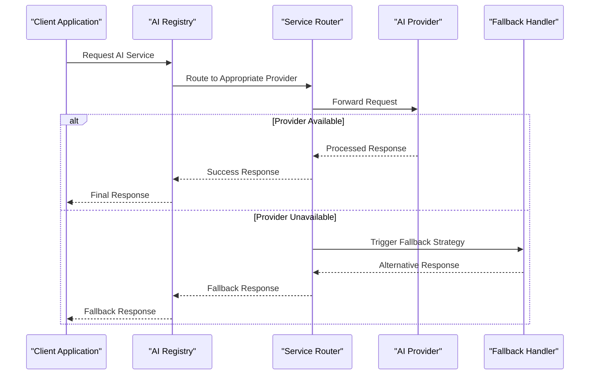
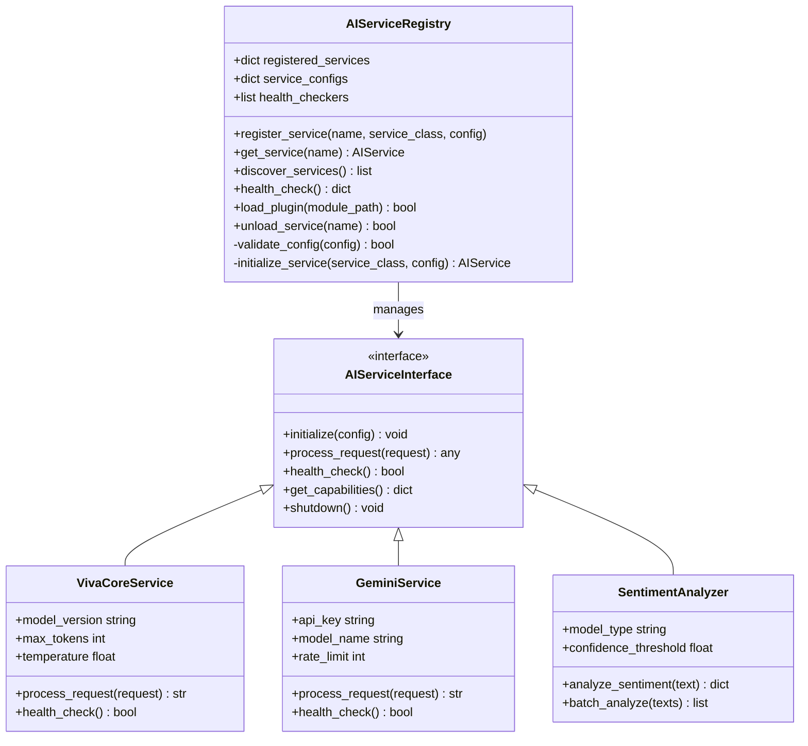
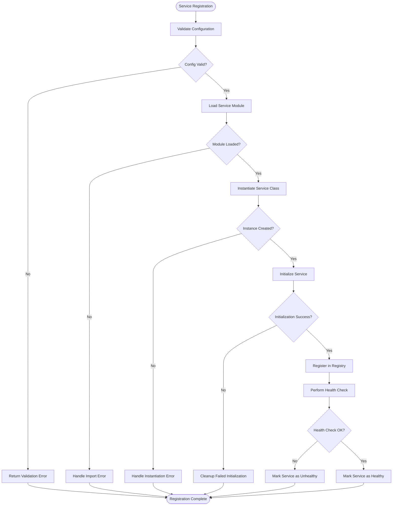
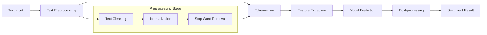
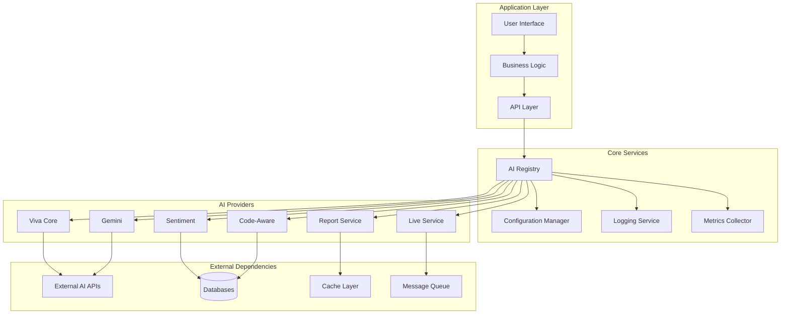

# AI Service Registry & Integration

<cite>
**Referenced Files in This Document**
- [registry.py](file://backend/ai/registry.py)
- [viva_core.py](file://backend/ai/viva_core.py)
- [gemini_service.py](file://backend/ai/gemini_service.py)
- [sentiment_analyzer.py](file://backend/ai/sentiment_analyzer.py)
- [code_aware_viva.py](file://backend/ai/code_aware_viva.py)
- [live_service.py](file://backend/ai/live_service.py)
- [report_service.py](file://backend/ai/report_service.py)
- [team_live_service.py](file://backend/ai/team_live_service.py)
- [prompts.py](file://backend/ai/prompts.py)
- [delivery_metrics.py](file://backend/ai/delivery_metrics.py)
- [weakness_heatmap.py](file://backend/ai/weakness_heatmap.py)
- [main.py](file://backend/main.py)
- [test_registry.py](file://backend/tests/test_registry.py)
</cite>

## Table of Contents
1. [Introduction](#introduction)
2. [Project Structure](#project-structure)
3. [Core Components](#core-components)
4. [Architecture Overview](#architecture-overview)
5. [Detailed Component Analysis](#detailed-component-analysis)
6. [Dependency Analysis](#dependency-analysis)
7. [Performance Considerations](#performance-considerations)
8. [Troubleshooting Guide](#troubleshooting-guide)
9. [Conclusion](#conclusion)
10. [Appendices](#appendices)

## Introduction

This document describes the pluggable AI service registry system that powers the Horux platform's AI capabilities. The registry pattern implementation enables dynamic loading and management of different AI providers including viva core engine, Gemini integration, sentiment analysis, and code-aware intelligence. The system provides a standardized interface contract, service registration process, and plugin architecture that allows seamless integration of new AI services while maintaining consistent communication patterns and fallback strategies.

The registry serves as the central coordination point for all AI services, providing service discovery, lifecycle management, and request routing to appropriate AI providers based on configuration and availability.

## Project Structure

The AI service registry system is organized within the `backend/ai` directory, following a modular architecture where each AI provider is implemented as a separate module with clear interfaces and dependencies.

**Diagram sources**
- [registry.py:1-50](file://backend/ai/registry.py#L1-L50)
- [viva_core.py:1-30](file://backend/ai/viva_core.py#L1-L30)
- [gemini_service.py:1-30](file://backend/ai/gemini_service.py#L1-L30)

**Section sources**
- [registry.py:1-100](file://backend/ai/registry.py#L1-L100)
- [main.py:1-50](file://backend/main.py#L1-L50)

## Core Components

The AI service registry system consists of several key components that work together to provide a flexible and extensible architecture:

### Registry Core
The registry core manages the lifecycle of all AI services, handling registration, discovery, and routing of requests to appropriate service implementations.

### Service Interface Contract
All AI services must implement a standardized interface that defines common methods for initialization, processing requests, and error handling.

### Plugin Architecture
The plugin system allows dynamic loading of AI services at runtime, enabling hot-swapping of providers without application restart.

### Fallback Mechanism
Built-in fallback strategies ensure service continuity when primary providers are unavailable or fail.

**Section sources**
- [registry.py:1-150](file://backend/ai/registry.py#L1-L150)
- [test_registry.py:1-100](file://backend/tests/test_registry.py#L1-L100)

## Architecture Overview

The AI service registry follows a layered architecture pattern with clear separation of concerns and well-defined interfaces between components.

**Diagram sources**
- [registry.py:50-120](file://backend/ai/registry.py#L50-L120)
- [viva_core.py:30-80](file://backend/ai/viva_core.py#L30-L80)

The architecture supports multiple deployment scenarios including single-provider setups, multi-provider configurations, and hybrid approaches with intelligent load balancing.

## Detailed Component Analysis

### Registry Implementation

The registry component serves as the central coordinator for all AI services, implementing the core registry pattern with advanced features like health checking, metrics collection, and dynamic configuration.

#### Class Diagram

**Diagram sources**
- [registry.py:1-200](file://backend/ai/registry.py#L1-L200)
- [viva_core.py:1-100](file://backend/ai/viva_core.py#L1-L100)
- [gemini_service.py:1-100](file://backend/ai/gemini_service.py#L1-L100)
- [sentiment_analyzer.py:1-100](file://backend/ai/sentiment_analyzer.py#L1-L100)

#### Service Registration Flow

**Diagram sources**
- [registry.py:100-250](file://backend/ai/registry.py#L100-L250)

### Viva Core Engine

The Viva Core Engine serves as the primary AI processing unit, handling natural language understanding, conversation management, and response generation.

#### Key Features
- Advanced natural language processing capabilities
- Context-aware conversation management
- Multi-turn dialogue support
- Customizable prompt templates
- Performance optimization and caching

#### Integration Points
- Direct API integration with external AI models
- Local model execution support
- Streaming response handling
- Error recovery and retry mechanisms

**Section sources**
- [viva_core.py:1-200](file://backend/ai/viva_core.py#L1-L200)

### Gemini Integration

The Gemini service provides Google's Gemini AI capabilities through a standardized interface, enabling advanced text generation, code analysis, and multimodal processing.

#### Configuration Options
- API key management
- Model selection and versioning
- Rate limiting and quota management
- Regional endpoint configuration

#### Error Handling
- Network failure recovery
- API quota exhaustion handling
- Invalid response parsing
- Timeout management

**Section sources**
- [gemini_service.py:1-200](file://backend/ai/gemini_service.py#L1-L200)

### Sentiment Analysis Service

The sentiment analyzer provides emotional tone detection and analysis capabilities, supporting both single-text and batch processing modes.

#### Processing Pipeline

**Diagram sources**
- [sentiment_analyzer.py:1-150](file://backend/ai/sentiment_analyzer.py#L1-L150)

### Code-Aware Intelligence

The code-aware viva service extends the core viva functionality with programming language understanding, code analysis, and development workflow support.

#### Capabilities
- Multi-language code parsing and analysis
- Syntax error detection and suggestions
- Code quality assessment
- Development best practices enforcement
- Integration with popular IDEs and tools

**Section sources**
- [code_aware_viva.py:1-200](file://backend/ai/code_aware_viva.py#L1-L200)

## Dependency Analysis

The AI service registry system maintains clean dependency boundaries while allowing for flexible composition of services.

**Diagram sources**
- [registry.py:1-300](file://backend/ai/registry.py#L1-L300)
- [main.py:1-100](file://backend/main.py#L1-L100)

### Service Coupling Analysis

The system exhibits low coupling between individual AI services while maintaining high cohesion within service-specific functionality. The registry acts as the primary integration point, minimizing direct dependencies between services.

**Section sources**
- [registry.py:1-300](file://backend/ai/registry.py#L1-L300)
- [test_registry.py:1-200](file://backend/tests/test_registry.py#L1-L200)

## Performance Considerations

The AI service registry is designed with performance optimization in mind, incorporating several strategies to ensure efficient operation under various load conditions.

### Caching Strategies
- Response caching for frequently accessed AI results
- Connection pooling for external API calls
- Lazy loading of service modules
- Asynchronous initialization of heavy services

### Load Balancing
- Round-robin distribution across multiple service instances
- Health-based routing to healthy service instances
- Weighted load balancing based on service capacity
- Geographic load balancing for global deployments

### Resource Management
- Memory-efficient processing pipelines
- Connection timeout management
- Graceful degradation under resource pressure
- Automatic scaling based on demand patterns

### Monitoring and Observability
- Comprehensive metrics collection
- Distributed tracing support
- Performance bottleneck identification
- Capacity planning insights

## Troubleshooting Guide

### Common Issues and Solutions

#### Service Registration Failures
When services fail to register, check the following:
- Verify service configuration syntax and required parameters
- Ensure all dependencies are properly installed
- Check network connectivity for external API services
- Review service health check endpoints

#### Performance Degradation
If experiencing slow response times:
- Monitor service health and resource utilization
- Check for connection pool exhaustion
- Verify cache hit rates and effectiveness
- Analyze request patterns and optimize accordingly

#### Fallback Activation
When fallback mechanisms activate unexpectedly:
- Investigate primary service health status
- Review error logs for specific failure reasons
- Check rate limits and quota usage
- Validate configuration settings

### Debugging Tools
The system includes comprehensive debugging capabilities:
- Detailed logging at multiple verbosity levels
- Service health monitoring dashboards
- Request tracing and profiling tools
- Performance analysis utilities

**Section sources**
- [test_registry.py:100-300](file://backend/tests/test_registry.py#L100-L300)

## Conclusion

The pluggable AI service registry system provides a robust foundation for managing diverse AI capabilities within the Horux platform. The registry pattern implementation ensures loose coupling between services while maintaining strong contracts for service interaction. The system's design facilitates easy integration of new AI providers, supports multiple deployment scenarios, and includes comprehensive error handling and fallback mechanisms.

Key benefits of this architecture include:
- **Extensibility**: New AI services can be added with minimal disruption
- **Reliability**: Built-in fallback strategies ensure service continuity
- **Performance**: Optimized for high-throughput scenarios with caching and load balancing
- **Maintainability**: Clear separation of concerns and standardized interfaces
- **Scalability**: Support for horizontal scaling and distributed deployments

The registry system successfully abstracts the complexity of managing multiple AI providers while providing a unified interface for the rest of the application. This approach enables rapid experimentation with different AI technologies while maintaining production stability and performance.

## Appendices

### Adding a New AI Service

To integrate a new AI service into the registry:

1. **Create Service Class**: Implement the standard interface contract
2. **Configure Service**: Define configuration parameters and defaults
3. **Register Service**: Add service to the registry during initialization
4. **Test Integration**: Verify service functionality and error handling
5. **Monitor Deployment**: Set up health checks and metrics collection

### Configuration Reference

Common configuration options for AI services include:
- API credentials and authentication
- Model selection and versioning
- Rate limiting and quotas
- Timeout and retry policies
- Logging and monitoring preferences

### Best Practices

- Always implement proper error handling and fallback mechanisms
- Use environment variables for sensitive configuration
- Implement comprehensive health checks
- Monitor service performance and resource usage
- Document service capabilities and limitations
- Test thoroughly under various failure scenarios