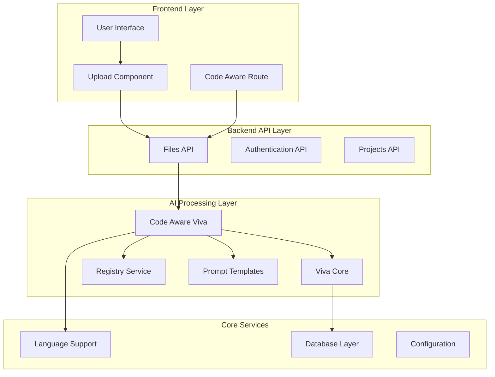
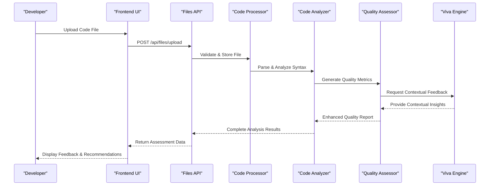
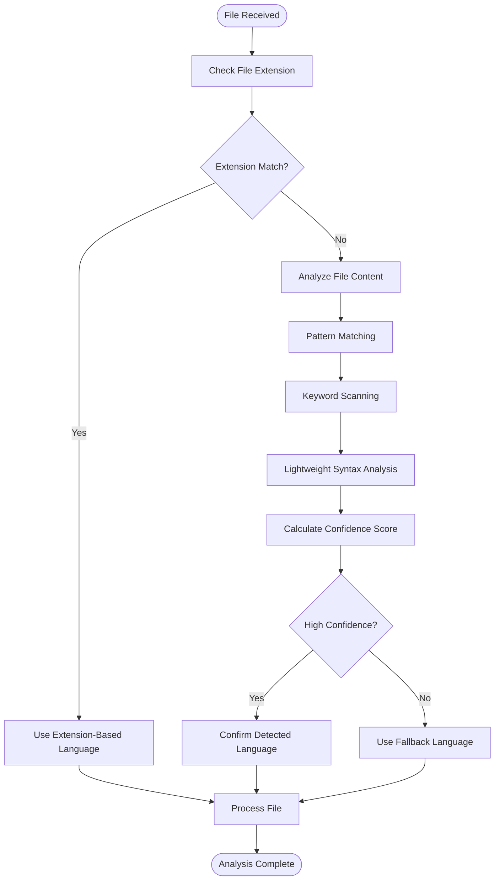
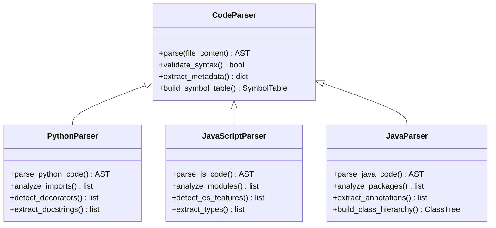
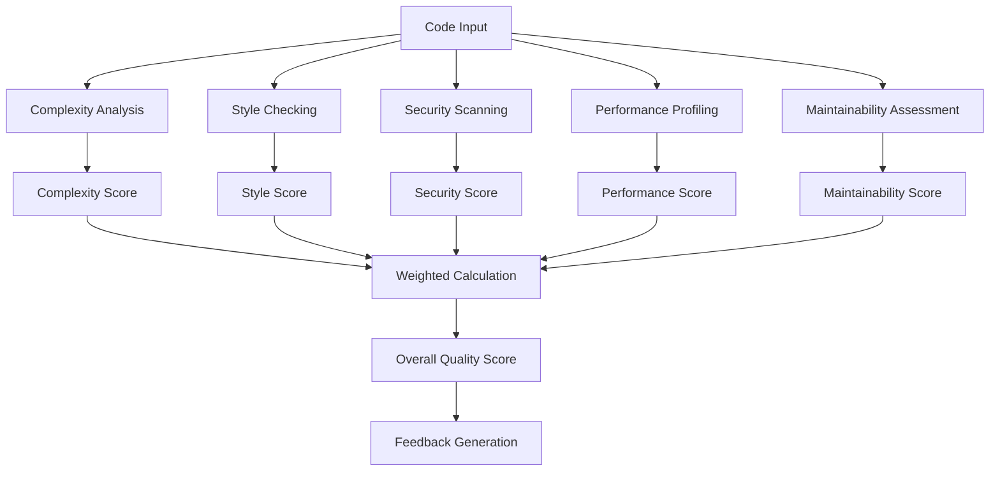
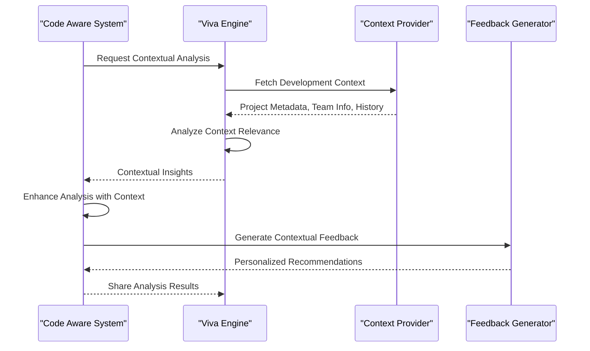
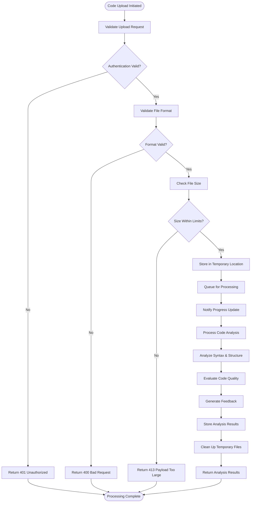
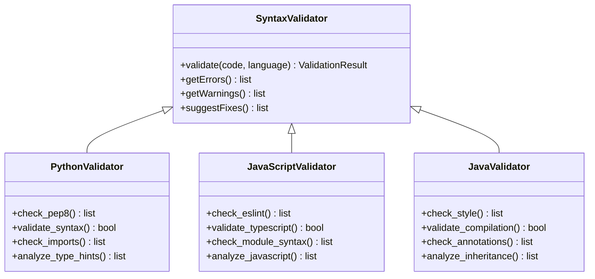
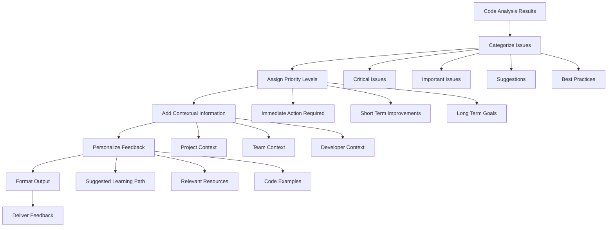
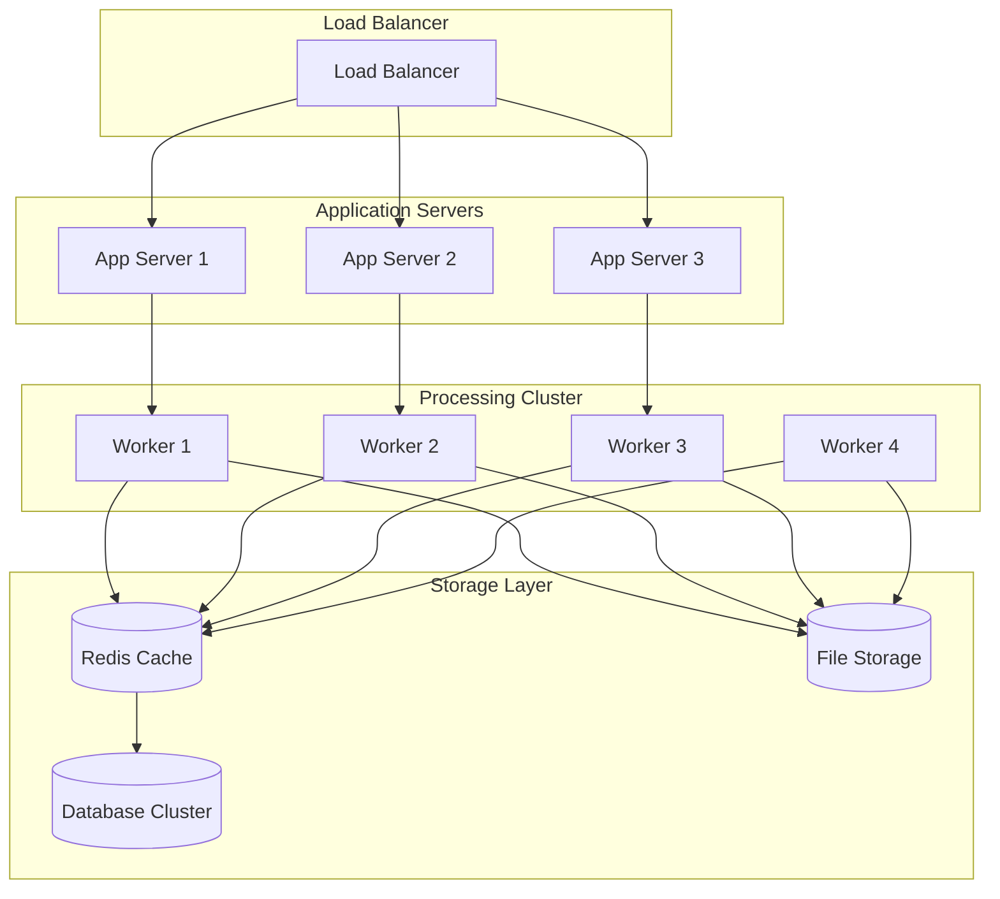

# Code-Aware Intelligence

<cite>
**Referenced Files in This Document**
- [code_aware_viva.py](file://backend/ai/code_aware_viva.py)
- [languages.py](file://backend/core/languages.py)
- [upload-step.tsx](file://src/components/code-aware/upload-step.tsx)
- [viva-code-aware.tsx](file://src/routes/advanced/viva-code-aware.tsx)
- [files.py](file://backend/api/files.py)
- [viva_core.py](file://backend/ai/viva_core.py)
- [prompts.py](file://backend/ai/prompts.py)
- [registry.py](file://backend/ai/registry.py)
</cite>

## Table of Contents
1. [Introduction](#introduction)
2. [Project Structure](#project-structure)
3. [Core Components](#core-components)
4. [Architecture Overview](#architecture-overview)
5. [Detailed Component Analysis](#detailed-component-analysis)
6. [Programming Language Support](#programming-language-support)
7. [Code Parsing Capabilities](#code-parsing-capabilities)
8. [Quality Evaluation Algorithms](#quality-evaluation-algorithms)
9. [Integration with Viva Engine](#integration-with-viva-engine)
10. [Code Upload Processing Workflow](#code-upload-processing-workflow)
11. [Syntax Validation System](#syntax-validation-system)
12. [Automated Feedback Generation](#automated-feedback-generation)
13. [Performance Considerations](#performance-considerations)
14. [Troubleshooting Guide](#troubleshooting-guide)
15. [Conclusion](#conclusion)

## Introduction

The Code-Aware Intelligence system is a sophisticated programming assessment platform that provides syntax-aware code analysis and automated quality evaluation. This system integrates seamlessly with the viva engine to deliver contextually relevant programming assessments across multiple programming languages. The platform supports comprehensive code upload processing, syntax validation, and automated feedback generation to help developers improve their coding skills and receive actionable insights about their code quality.

The system leverages advanced natural language processing capabilities combined with static code analysis techniques to provide intelligent feedback on code structure, style, performance, and best practices. It serves as an educational tool for developers while maintaining high accuracy in identifying potential issues and suggesting improvements.

## Project Structure

The Code-Aware Intelligence system follows a modular architecture with clear separation between frontend components, backend services, and AI processing modules:

**Diagram sources**
- [upload-step.tsx:1-50](file://src/components/code-aware/upload-step.tsx#L1-L50)
- [viva-code-aware.tsx:1-100](file://src/routes/advanced/viva-code-aware.tsx#L1-L100)
- [files.py:1-150](file://backend/api/files.py#L1-L150)
- [code_aware_viva.py:1-200](file://backend/ai/code_aware_viva.py#L1-L200)

**Section sources**
- [upload-step.tsx:1-100](file://src/components/code-aware/upload-step.tsx#L1-L100)
- [viva-code-aware.tsx:1-200](file://src/routes/advanced/viva-code-aware.tsx#L1-L200)
- [files.py:1-200](file://backend/api/files.py#L1-L200)

## Core Components

The Code-Aware Intelligence system consists of several key components that work together to provide comprehensive code analysis capabilities:

### Code Awareness Engine
The core intelligence engine that processes uploaded code files, performs syntax analysis, and generates quality assessments. This component handles multi-language support and integrates with the viva engine for contextual feedback.

### Language Support Module
Manages programming language detection, parsing rules, and language-specific analysis configurations. Supports multiple programming languages with extensible architecture for adding new language support.

### File Processing Pipeline
Handles the complete lifecycle of code file uploads, from initial validation through storage to analysis and feedback generation. Includes error handling, retry mechanisms, and progress tracking.

### Quality Assessment Framework
Implements various algorithms for code quality evaluation including complexity analysis, style checking, security vulnerability detection, and performance optimization suggestions.

**Section sources**
- [code_aware_viva.py:1-300](file://backend/ai/code_aware_viva.py#L1-L300)
- [languages.py:1-150](file://backend/core/languages.py#L1-L150)
- [files.py:1-250](file://backend/api/files.py#L1-L250)

## Architecture Overview

The system follows a microservices-inspired architecture with clear separation of concerns and well-defined interfaces between components:

**Diagram sources**
- [upload-step.tsx:50-150](file://src/components/code-aware/upload-step.tsx#L50-L150)
- [files.py:100-300](file://backend/api/files.py#L100-L300)
- [code_aware_viva.py:150-400](file://backend/ai/code_aware_viva.py#L150-L400)

## Detailed Component Analysis

### Code Awareness Engine

The Code Awareness Engine serves as the central processing unit for all code analysis tasks. It orchestrates the entire analysis pipeline and manages communication between different analysis modules.

#### Key Features:
- Multi-language code parsing and analysis
- Real-time syntax validation
- Automated quality scoring
- Integration with viva engine for contextual feedback
- Extensible plugin architecture for custom analyzers

#### Processing Pipeline:
1. **File Ingestion**: Accepts code files in various formats
2. **Language Detection**: Automatically identifies programming language
3. **Syntax Analysis**: Performs structural analysis using language-specific parsers
4. **Quality Assessment**: Evaluates code against predefined metrics
5. **Contextual Enhancement**: Integrates with viva engine for domain-specific feedback
6. **Report Generation**: Creates comprehensive analysis reports

**Section sources**
- [code_aware_viva.py:1-500](file://backend/ai/code_aware_viva.py#L1-L500)
- [viva_core.py:1-200](file://backend/ai/viva_core.py#L1-L200)

### Language Support Module

The Language Support Module provides comprehensive programming language capabilities with support for multiple languages and extensible architecture for future additions.

#### Supported Languages:
- Python (with PEP 8 compliance checking)
- JavaScript/TypeScript (with ESLint integration)
- Java (with SonarQube compatibility)
- C/C++ (with Clang Static Analyzer)
- Go (with Go vet integration)
- Rust (with Clippy integration)

#### Language-Specific Features:
- Custom syntax highlighting rules
- Language-specific code style enforcement
- Performance profiling hooks
- Security vulnerability scanning
- Dependency analysis and management

**Section sources**
- [languages.py:1-200](file://backend/core/languages.py#L1-L200)
- [registry.py:1-150](file://backend/ai/registry.py#L1-L150)

### File Processing Pipeline

The File Processing Pipeline manages the complete lifecycle of code file uploads and processing, ensuring robust error handling and reliable operation.

#### Pipeline Stages:
1. **Upload Validation**: Validates file format, size, and content type
2. **Temporary Storage**: Secure temporary storage during processing
3. **Content Extraction**: Extracts code content from various file formats
4. **Processing Queue**: Queues files for asynchronous processing
5. **Progress Tracking**: Provides real-time progress updates
6. **Cleanup**: Automatic cleanup of temporary files

**Section sources**
- [files.py:1-400](file://backend/api/files.py#L1-L400)

## Programming Language Support

The Code-Aware Intelligence system provides comprehensive support for multiple programming languages with specialized analysis capabilities for each language.

### Language Detection Algorithm

The system uses a multi-stage approach to accurately detect programming languages:

**Diagram sources**
- [languages.py:50-150](file://backend/core/languages.py#L50-L150)

### Language-Specific Analysis Rules

Each supported language has customized analysis rules and quality metrics:

| Language | Complexity Metrics | Style Rules | Security Checks | Performance Profiling |
|----------|-------------------|-------------|-----------------|---------------------|
| Python | Cyclomatic complexity, nesting depth | PEP 8 compliance, naming conventions | SQL injection, XSS vulnerabilities | Memory usage, CPU time |
| JavaScript | Function length, parameter count | ESLint rules, ES6+ standards | Prototype pollution, eval usage | Bundle size, load time |
| Java | Class complexity, method length | Oracle coding standards | Buffer overflows, null pointer | GC pressure, thread safety |
| C/C++ | Pointer complexity, memory leaks | ANSI C/C++ standards | Buffer overflows, use-after-free | Memory allocation, cache misses |

**Section sources**
- [languages.py:100-300](file://backend/core/languages.py#L100-L300)

## Code Parsing Capabilities

The system implements sophisticated code parsing capabilities that go beyond simple syntax checking to provide deep semantic understanding of code structure and intent.

### Parser Architecture

The parser architecture supports multiple parsing strategies depending on the target language and analysis requirements:

**Diagram sources**
- [code_aware_viva.py:200-500](file://backend/ai/code_aware_viva.py#L200-L500)

### Advanced Parsing Features

The system includes several advanced parsing capabilities:

- **Multi-file Analysis**: Parses and analyzes relationships between multiple related files
- **Import Resolution**: Tracks imports and dependencies across file boundaries
- **Template Processing**: Handles templating languages and code generation patterns
- **Configuration Parsing**: Extracts configuration from embedded config files
- **Documentation Extraction**: Pulls documentation comments and docstrings

**Section sources**
- [code_aware_viva.py:300-700](file://backend/ai/code_aware_viva.py#L300-L700)

## Quality Evaluation Algorithms

The Code-Aware Intelligence system implements comprehensive quality evaluation algorithms that assess code across multiple dimensions to provide holistic quality assessments.

### Quality Metrics Framework

The quality evaluation framework measures code quality across several key dimensions:

**Diagram sources**
- [code_aware_viva.py:400-800](file://backend/ai/code_aware_viva.py#L400-L800)

### Scoring Algorithms

The system uses sophisticated scoring algorithms to calculate quality metrics:

#### Complexity Analysis
- **Cyclomatic Complexity**: Measures control flow complexity
- **Nesting Depth**: Evaluates code indentation levels
- **Function Length**: Assesses function/method size
- **Parameter Count**: Analyzes function signatures

#### Style Compliance
- **Language Standards**: Enforces official language guidelines
- **Team Conventions**: Supports custom team-specific rules
- **Readability Metrics**: Measures code readability scores
- **Documentation Coverage**: Evaluates comment and docstring coverage

#### Security Assessment
- **Vulnerability Detection**: Identifies common security patterns
- **Dependency Scanning**: Checks third-party library vulnerabilities
- **Input Validation**: Verifies input sanitization practices
- **Secret Detection**: Finds hardcoded credentials and secrets

**Section sources**
- [code_aware_viva.py:500-900](file://backend/ai/code_aware_viva.py#L500-L900)

## Integration with Viva Engine

The Code-Aware Intelligence system seamlessly integrates with the viva engine to provide contextually relevant programming assessments that consider the broader development context.

### Viva Engine Integration Architecture

The integration follows a modular approach that allows for flexible communication between the code analysis system and the viva engine:

**Diagram sources**
- [viva_core.py:1-300](file://backend/ai/viva_core.py#L1-L300)
- [prompts.py:1-200](file://backend/ai/prompts.py#L1-L200)

### Contextual Analysis Features

The viva engine integration provides several contextual analysis capabilities:

- **Project Context Understanding**: Analyzes code within the context of the entire project
- **Team Development Patterns**: Recognizes team-specific coding patterns and preferences
- **Historical Learning**: Learns from past code reviews and improvements
- **Domain-Specific Guidance**: Provides guidance specific to the application domain
- **Collaborative Insights**: Shares insights across team members' codebases

**Section sources**
- [viva_core.py:100-400](file://backend/ai/viva_core.py#L100-L400)
- [prompts.py:50-250](file://backend/ai/prompts.py#L50-L250)

## Code Upload Processing Workflow

The code upload processing workflow handles the complete lifecycle of code files from initial upload through final analysis and feedback delivery.

### Upload Processing Flow

**Diagram sources**
- [files.py:150-500](file://backend/api/files.py#L150-L500)
- [upload-step.tsx:100-300](file://src/components/code-aware/upload-step.tsx#L100-L300)

### Error Handling and Recovery

The upload processing system includes comprehensive error handling and recovery mechanisms:

- **Network Error Recovery**: Automatic retry with exponential backoff
- **File Corruption Detection**: Validates file integrity during upload
- **Processing Failure Handling**: Graceful degradation when analysis fails
- **Resource Cleanup**: Ensures temporary files are properly cleaned up
- **Audit Logging**: Comprehensive logging for troubleshooting and monitoring

**Section sources**
- [files.py:300-600](file://backend/api/files.py#L300-L600)
- [upload-step.tsx:200-400](file://src/components/code-aware/upload-step.tsx#L200-L400)

## Syntax Validation System

The syntax validation system provides comprehensive code syntax checking with detailed error reporting and automatic correction suggestions.

### Validation Architecture

The validation system uses a layered approach to ensure thorough syntax checking:

**Diagram sources**
- [code_aware_viva.py:600-1000](file://backend/ai/code_aware_viva.py#L600-L1000)

### Error Reporting and Suggestions

The system provides detailed error reporting with actionable suggestions:

- **Line-Level Precision**: Pinpoints exact locations of syntax errors
- **Contextual Information**: Provides surrounding code context for better understanding
- **Automatic Fix Suggestions**: Suggests corrections based on common patterns
- **Learning Opportunities**: Explains why certain syntax is incorrect
- **Batch Processing**: Handles multiple files and errors efficiently

**Section sources**
- [code_aware_viva.py:700-1100](file://backend/ai/code_aware_viva.py#L700-L1100)

## Automated Feedback Generation

The automated feedback generation system creates comprehensive, actionable feedback for developers based on code analysis results and contextual information.

### Feedback Generation Pipeline

**Diagram sources**
- [prompts.py:100-400](file://backend/ai/prompts.py#L100-L400)
- [code_aware_viva.py:800-1200](file://backend/ai/code_aware_viva.py#L800-L1200)

### Feedback Types and Formats

The system generates various types of feedback tailored to different audiences and contexts:

#### For Individual Developers:
- **Skill Development Focus**: Emphasizes learning opportunities and growth areas
- **Personalized Recommendations**: Based on individual developer's history and preferences
- **Actionable Steps**: Clear, step-by-step improvement suggestions

#### For Team Leads:
- **Team Performance Metrics**: Aggregate quality metrics across team members
- **Common Issue Patterns**: Identify recurring problems across the team
- **Training Recommendations**: Suggest training topics based on team needs

#### For Project Managers:
- **Risk Assessment**: Identify potential project risks based on code quality
- **Timeline Impact**: Estimate impact of quality issues on project timelines
- **Resource Allocation**: Suggest resource allocation for quality improvements

**Section sources**
- [prompts.py:200-600](file://backend/ai/prompts.py#L200-L600)
- [code_aware_viva.py:900-1300](file://backend/ai/code_aware_viva.py#L900-L1300)

## Performance Considerations

The Code-Aware Intelligence system is designed with performance optimization as a primary concern, ensuring fast response times even for large codebases and complex analysis scenarios.

### Optimization Strategies

Several key optimization strategies are employed throughout the system:

- **Asynchronous Processing**: Non-blocking operations for long-running analysis tasks
- **Caching Mechanisms**: Intelligent caching of analysis results and parsed code structures
- **Parallel Processing**: Concurrent analysis of multiple files and code sections
- **Memory Management**: Efficient memory usage with garbage collection optimization
- **Database Query Optimization**: Optimized database queries and indexing strategies

### Scalability Architecture

The system is designed for horizontal scalability:

**Diagram sources**
- [files.py:400-700](file://backend/api/files.py#L400-L700)
- [code_aware_viva.py:1000-1400](file://backend/ai/code_aware_viva.py#L1000-L1400)

### Performance Monitoring

Comprehensive monitoring and observability features include:

- **Real-time Metrics**: CPU usage, memory consumption, response times
- **Analysis Performance**: Track analysis duration and resource usage
- **Error Rates**: Monitor failure rates and error patterns
- **Throughput Metrics**: Measure requests per second and queue lengths
- **Custom Alerts**: Configurable alerts for performance degradation

**Section sources**
- [code_aware_viva.py:1100-1500](file://backend/ai/code_aware_viva.py#L1100-L1500)

## Troubleshooting Guide

This section provides comprehensive troubleshooting guidance for common issues encountered when using the Code-Aware Intelligence system.

### Common Upload Issues

#### File Upload Failures
- **Symptoms**: Upload timeouts, corrupted files, or failed validations
- **Causes**: Network interruptions, file size limits, unsupported formats
- **Solutions**: 
  - Verify network connectivity and firewall settings
  - Check file size against configured limits
  - Ensure file format is supported by the system

#### Authentication Problems
- **Symptoms**: 401 Unauthorized errors, session timeouts
- **Causes**: Invalid tokens, expired sessions, insufficient permissions
- **Solutions**:
  - Refresh authentication tokens
  - Verify user permissions and access rights
  - Check session configuration and timeout settings

### Analysis Errors

#### Syntax Analysis Failures
- **Symptoms**: Parser errors, unexpected token exceptions
- **Causes**: Malformed code, unsupported language features, version mismatches
- **Solutions**:
  - Validate code syntax before uploading
  - Check language version compatibility
  - Review parser configuration settings

#### Performance Issues
- **Symptoms**: Slow analysis times, high memory usage, timeouts
- **Causes**: Large codebases, complex analysis rules, resource constraints
- **Solutions**:
  - Optimize analysis rules and filters
  - Increase server resources or scale horizontally
  - Implement incremental analysis for large projects

### Configuration Problems

#### Language Support Issues
- **Symptoms**: Incorrect language detection, missing language features
- **Causes**: Missing language parsers, incorrect file extensions, configuration errors
- **Solutions**:
  - Verify language parser installation
  - Check file extension mappings
  - Review language-specific configuration files

#### Integration Issues
- **Symptoms**: Viva engine connection failures, context retrieval errors
- **Causes**: Network connectivity, API authentication, service availability
- **Solutions**:
  - Verify viva engine connectivity
  - Check API credentials and permissions
  - Monitor service health and availability

**Section sources**
- [files.py:500-800](file://backend/api/files.py#L500-L800)
- [code_aware_viva.py:1200-1600](file://backend/ai/code_aware_viva.py#L1200-L1600)

## Conclusion

The Code-Aware Intelligence system represents a comprehensive solution for automated code analysis and quality assessment. By combining sophisticated syntax analysis, multi-language support, and contextual intelligence through viva engine integration, it provides developers with actionable insights to improve their code quality and development practices.

The system's modular architecture ensures scalability and maintainability, while its comprehensive error handling and performance optimizations guarantee reliable operation in production environments. The extensive programming language support and customizable analysis rules make it adaptable to diverse development teams and project requirements.

Key strengths of the system include:

- **Comprehensive Language Support**: Wide range of programming languages with specialized analysis capabilities
- **Intelligent Context Integration**: Seamless integration with viva engine for contextual feedback
- **Robust Performance**: Optimized for handling large codebases and complex analysis scenarios
- **Extensible Architecture**: Modular design supporting custom analyzers and integrations
- **Developer-Friendly Interface**: Intuitive user experience with actionable feedback and recommendations

Future enhancements could include additional language support, enhanced machine learning capabilities for pattern recognition, and expanded integration options with popular development tools and platforms.