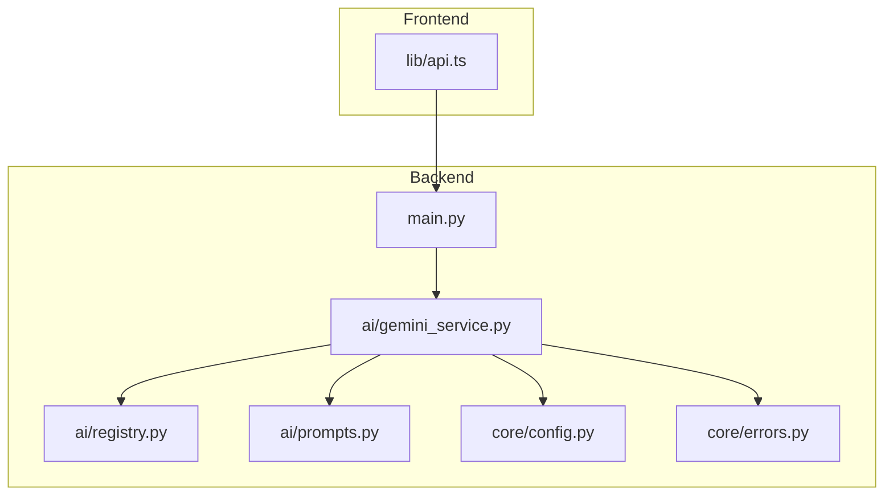
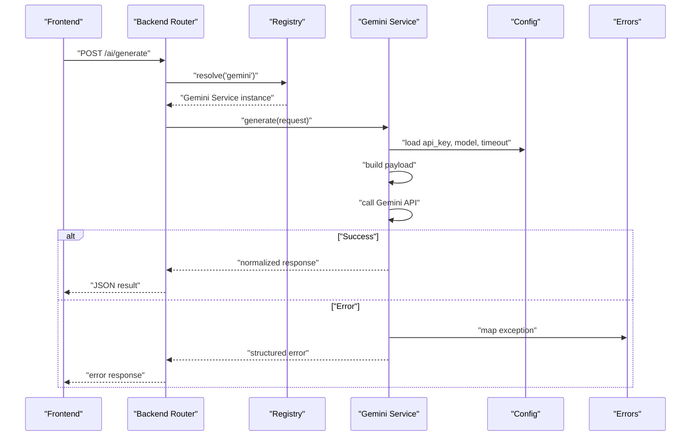
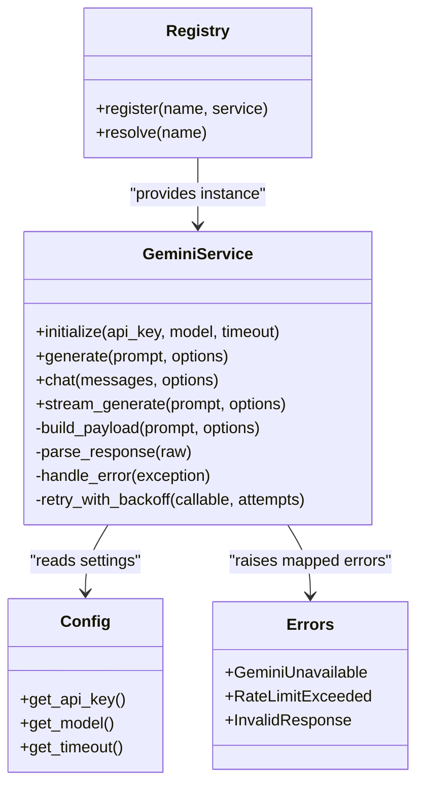
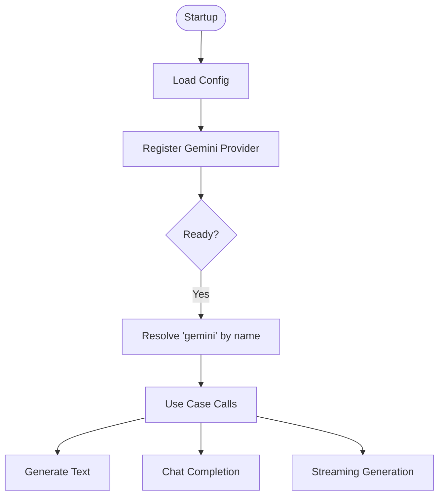
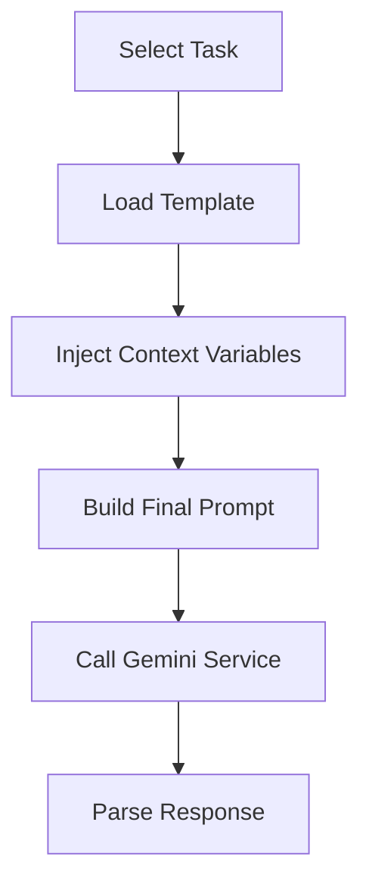
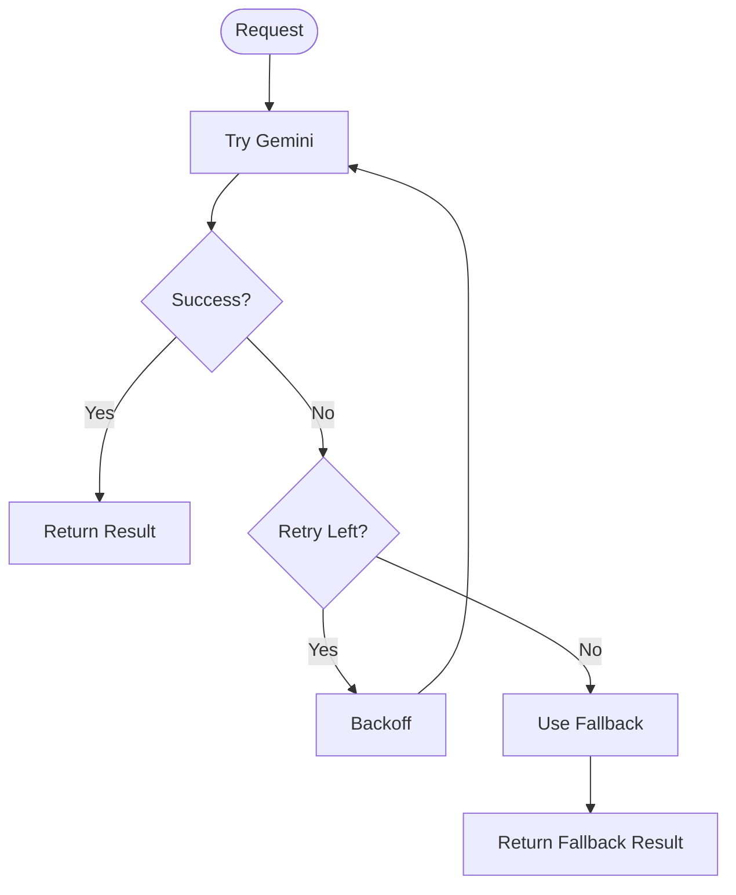
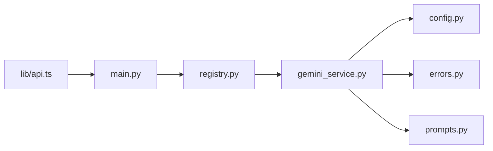

# Google Gemini Integration

<cite>
**Referenced Files in This Document**
- [gemini_service.py](file://backend/ai/gemini_service.py)
- [registry.py](file://backend/ai/registry.py)
- [prompts.py](file://backend/ai/prompts.py)
- [config.py](file://backend/core/config.py)
- [errors.py](file://backend/core/errors.py)
- [main.py](file://backend/main.py)
- [api.py](file://src/lib/api.ts)
</cite>

## Table of Contents
1. [Introduction](#introduction)
2. [Project Structure](#project-structure)
3. [Core Components](#core-components)
4. [Architecture Overview](#architecture-overview)
5. [Detailed Component Analysis](#detailed-component-analysis)
6. [Dependency Analysis](#dependency-analysis)
7. [Performance Considerations](#performance-considerations)
8. [Troubleshooting Guide](#troubleshooting-guide)
9. [Conclusion](#conclusion)
10. [Appendices](#appendices)

## Introduction
This document explains the Google Gemini AI service integration within the platform. It covers authentication setup, request/response formatting, error handling strategies, and how Gemini extends the registry system to provide advanced natural language processing capabilities. It also includes configuration examples, rate limiting considerations, fallback mechanisms when the Gemini service is unavailable, and specific use cases where Gemini enhances the platform’s AI features.

## Project Structure
The Gemini integration lives primarily under the backend AI module and integrates with core configuration and error handling modules. The frontend exposes API utilities that call backend endpoints which may route to Gemini-powered services.

**Diagram sources**
- [main.py](file://backend/main.py)
- [gemini_service.py](file://backend/ai/gemini_service.py)
- [registry.py](file://backend/ai/registry.py)
- [prompts.py](file://backend/ai/prompts.py)
- [config.py](file://backend/core/config.py)
- [errors.py](file://backend/core/errors.py)
- [api.ts](file://src/lib/api.ts)

**Section sources**
- [main.py](file://backend/main.py)
- [gemini_service.py](file://backend/ai/gemini_service.py)
- [registry.py](file://backend/ai/registry.py)
- [prompts.py](file://backend/ai/prompts.py)
- [config.py](file://backend/core/config.py)
- [errors.py](file://backend/core/errors.py)
- [api.ts](file://src/lib/api.ts)

## Core Components
- Gemini Service: Implements client initialization, authentication via environment variables, request construction, response parsing, retries, and fallback behavior.
- Registry: Provides a pluggable registry for AI services; Gemini registers itself as an available provider and exposes typed methods for NLP tasks.
- Prompts: Centralizes prompt templates used by Gemini-based features (e.g., summarization, sentiment analysis, code-aware assistance).
- Configuration: Loads Gemini API keys, model names, timeouts, and rate limits from environment or config files.
- Errors: Defines structured exceptions and error mapping for network failures, rate limits, and invalid responses.

Key responsibilities:
- Authentication: Securely load API keys and set headers or SDK credentials.
- Request Formatting: Build standardized payloads for text, multimodal inputs, and streaming requests.
- Response Handling: Parse JSON/text outputs, normalize fields, and map errors.
- Fallbacks: Gracefully degrade to local models or cached results when Gemini is unavailable.
- Rate Limiting: Implement backoff and retry policies aligned with provider quotas.

**Section sources**
- [gemini_service.py](file://backend/ai/gemini_service.py)
- [registry.py](file://backend/ai/registry.py)
- [prompts.py](file://backend/ai/prompts.py)
- [config.py](file://backend/core/config.py)
- [errors.py](file://backend/core/errors.py)

## Architecture Overview
The Gemini integration follows a layered architecture:
- Frontend API layer calls backend endpoints.
- Backend routes invoke the Gemini service through the registry abstraction.
- Gemini service handles authentication, request formatting, and response normalization.
- Error handling and logging are centralized for consistent diagnostics.

**Diagram sources**
- [main.py](file://backend/main.py)
- [registry.py](file://backend/ai/registry.py)
- [gemini_service.py](file://backend/ai/gemini_service.py)
- [config.py](file://backend/core/config.py)
- [errors.py](file://backend/core/errors.py)

## Detailed Component Analysis

### Gemini Service
Responsibilities:
- Initialize client with API key and model selection.
- Construct requests for text generation, chat, and optional multimodal inputs.
- Handle retries with exponential backoff on transient errors.
- Normalize responses into a consistent schema consumed by callers.
- Provide fallback logic when the service is unreachable or rate-limited.

**Diagram sources**
- [gemini_service.py](file://backend/ai/gemini_service.py)
- [registry.py](file://backend/ai/registry.py)
- [config.py](file://backend/core/config.py)
- [errors.py](file://backend/core/errors.py)

**Section sources**
- [gemini_service.py](file://backend/ai/gemini_service.py)
- [registry.py](file://backend/ai/registry.py)
- [config.py](file://backend/core/config.py)
- [errors.py](file://backend/core/errors.py)

### Registry Extension
The registry allows multiple AI providers to be registered and resolved by name. Gemini registers itself during startup, exposing typed methods for common NLP tasks.

**Diagram sources**
- [registry.py](file://backend/ai/registry.py)
- [gemini_service.py](file://backend/ai/gemini_service.py)
- [config.py](file://backend/core/config.py)

**Section sources**
- [registry.py](file://backend/ai/registry.py)
- [gemini_service.py](file://backend/ai/gemini_service.py)

### Prompt Templates
Prompts define reusable structures for tasks such as summarization, sentiment analysis, and code-aware assistance. They ensure consistency across Gemini calls and simplify updates.

**Diagram sources**
- [prompts.py](file://backend/ai/prompts.py)
- [gemini_service.py](file://backend/ai/gemini_service.py)

**Section sources**
- [prompts.py](file://backend/ai/prompts.py)
- [gemini_service.py](file://backend/ai/gemini_service.py)

### Configuration and Authentication
Authentication relies on secure environment variables for API keys and model selection. Configuration supports timeouts, retry counts, and rate limit parameters.

- Environment variables:
  - API key: loaded at service initialization.
  - Model name: selected per task or globally.
  - Timeouts and retries: tuned for stability and performance.
- Validation:
  - Missing keys raise explicit errors early.
  - Invalid model names are rejected before making requests.

**Section sources**
- [config.py](file://backend/core/config.py)
- [gemini_service.py](file://backend/ai/gemini_service.py)

### Request/Response Formatting
- Requests:
  - Standardized payload structure for text and chat.
  - Optional streaming flags for real-time responses.
  - Context injection from prompts and user input.
- Responses:
  - Normalized JSON schema with content, metadata, and usage stats.
  - Error mapping to structured exceptions.

**Section sources**
- [gemini_service.py](file://backend/ai/gemini_service.py)
- [prompts.py](file://backend/ai/prompts.py)

### Error Handling Strategies
- Network errors:
  - Retries with exponential backoff.
  - Circuit breaker pattern to avoid cascading failures.
- Rate limits:
  - Detect HTTP 429 and pause requests with backoff.
- Invalid responses:
  - Validate schema and return clear errors.
- Unavailable service:
  - Fallback to cached results or alternative providers if configured.

**Section sources**
- [errors.py](file://backend/core/errors.py)
- [gemini_service.py](file://backend/ai/gemini_service.py)

### Fallback Mechanisms
When Gemini is unavailable:
- Retry with backoff up to a configured maximum.
- Switch to a local model or cached response if enabled.
- Return degraded but functional output to maintain UX.

**Diagram sources**
- [gemini_service.py](file://backend/ai/gemini_service.py)
- [errors.py](file://backend/core/errors.py)

**Section sources**
- [gemini_service.py](file://backend/ai/gemini_service.py)
- [errors.py](file://backend/core/errors.py)

### Use Cases Enhancing AI Capabilities
- Summarization: Condense long documents or transcripts into concise summaries.
- Sentiment Analysis: Extract sentiment and emotional tone from text.
- Code-Aware Assistance: Provide context-aware suggestions based on code snippets.
- Live Q&A: Real-time chat completions for interactive sessions.
- Weakness Heatmaps: Analyze performance data to identify areas for improvement.

**Section sources**
- [prompts.py](file://backend/ai/prompts.py)
- [gemini_service.py](file://backend/ai/gemini_service.py)

## Dependency Analysis
The Gemini service depends on configuration, error handling, and prompt templates. The registry provides a stable interface for resolving the Gemini provider.

**Diagram sources**
- [main.py](file://backend/main.py)
- [registry.py](file://backend/ai/registry.py)
- [gemini_service.py](file://backend/ai/gemini_service.py)
- [config.py](file://backend/core/config.py)
- [errors.py](file://backend/core/errors.py)
- [prompts.py](file://backend/ai/prompts.py)
- [api.ts](file://src/lib/api.ts)

**Section sources**
- [main.py](file://backend/main.py)
- [registry.py](file://backend/ai/registry.py)
- [gemini_service.py](file://backend/ai/gemini_service.py)
- [config.py](file://backend/core/config.py)
- [errors.py](file://backend/core/errors.py)
- [prompts.py](file://backend/ai/prompts.py)
- [api.ts](file://src/lib/api.ts)

## Performance Considerations
- Timeouts: Configure appropriate timeouts to prevent hanging requests.
- Retries: Use exponential backoff with jitter to mitigate transient errors.
- Streaming: Enable streaming for large responses to improve perceived latency.
- Caching: Cache frequent prompts and responses to reduce API calls.
- Concurrency: Limit concurrent requests to respect rate limits.

[No sources needed since this section provides general guidance]

## Troubleshooting Guide
Common issues and resolutions:
- Missing API key: Ensure environment variables are set and validated at startup.
- Rate limit errors: Increase backoff intervals and reduce concurrency.
- Invalid model name: Verify model configuration matches supported values.
- Network errors: Check connectivity and consider enabling circuit breaker.
- Unavailable service: Activate fallback mode and monitor health checks.

**Section sources**
- [errors.py](file://backend/core/errors.py)
- [gemini_service.py](file://backend/ai/gemini_service.py)
- [config.py](file://backend/core/config.py)

## Conclusion
The Google Gemini integration enhances the platform’s AI capabilities through a robust, configurable, and resilient service layer. By extending the registry system, it provides a unified interface for advanced natural language processing tasks. Proper authentication, request formatting, error handling, and fallback mechanisms ensure reliability and performance even under adverse conditions.

[No sources needed since this section summarizes without analyzing specific files]

## Appendices

### Configuration Examples
- Set environment variables for API key, model, timeout, and retry count.
- Validate configuration at startup to fail fast on misconfiguration.
- Example keys:
  - GEMINI_API_KEY
  - GEMINI_MODEL
  - GEMINI_TIMEOUT
  - GEMINI_RETRIES

**Section sources**
- [config.py](file://backend/core/config.py)
- [gemini_service.py](file://backend/ai/gemini_service.py)

### Rate Limiting Considerations
- Monitor quota usage and adjust concurrency accordingly.
- Implement adaptive backoff based on server responses.
- Log rate limit events for observability.

**Section sources**
- [gemini_service.py](file://backend/ai/gemini_service.py)
- [errors.py](file://backend/core/errors.py)

### Fallback Mechanisms
- Enable fallback to local models or cached responses.
- Define fallback priorities and thresholds.
- Notify operators when fallback is triggered.

**Section sources**
- [gemini_service.py](file://backend/ai/gemini_service.py)
- [errors.py](file://backend/core/errors.py)