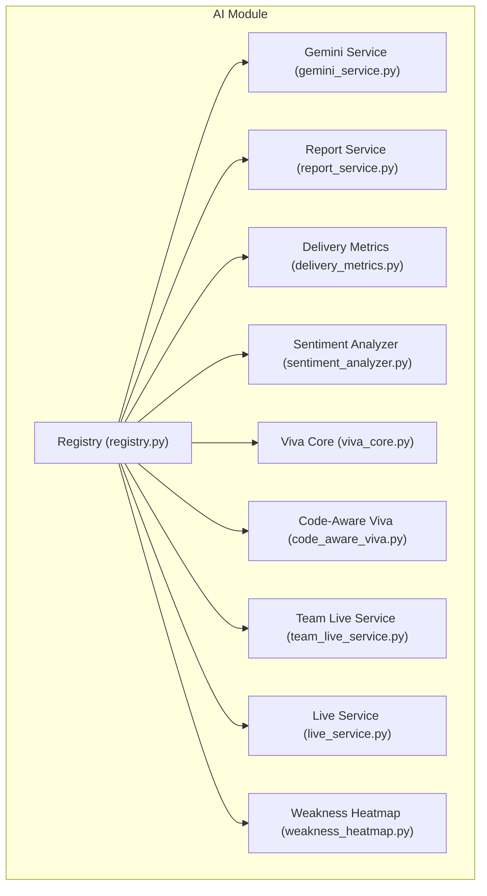
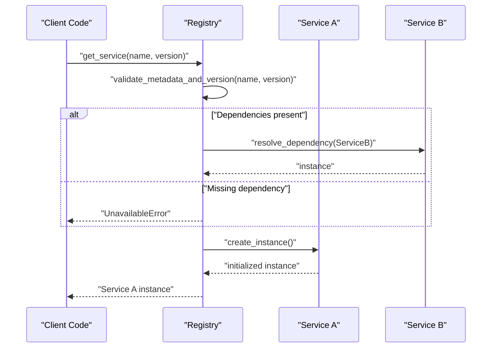
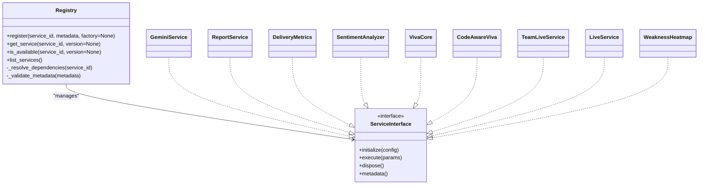
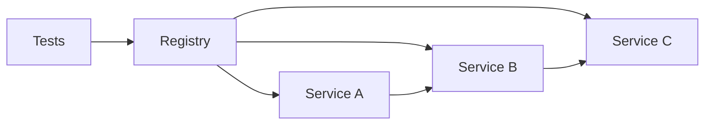

# Registry Pattern Implementation

<cite>
**Referenced Files in This Document**
- [registry.py](file://backend/ai/registry.py)
- [test_registry.py](file://backend/tests/test_registry.py)
- [gemini_service.py](file://backend/ai/gemini_service.py)
- [report_service.py](file://backend/ai/report_service.py)
- [delivery_metrics.py](file://backend/ai/delivery_metrics.py)
- [sentiment_analyzer.py](file://backend/ai/sentiment_analyzer.py)
- [viva_core.py](file://backend/ai/viva_core.py)
- [code_aware_viva.py](file://backend/ai/code_aware_viva.py)
- [team_live_service.py](file://backend/ai/team_live_service.py)
- [live_service.py](file://backend/ai/live_service.py)
- [weakness_heatmap.py](file://backend/ai/weakness_heatmap.py)
</cite>

## Table of Contents
1. [Introduction](#introduction)
2. [Project Structure](#project-structure)
3. [Core Components](#core-components)
4. [Architecture Overview](#architecture-overview)
5. [Detailed Component Analysis](#detailed-component-analysis)
6. [Dependency Analysis](#dependency-analysis)
7. [Performance Considerations](#performance-considerations)
8. [Troubleshooting Guide](#troubleshooting-guide)
9. [Conclusion](#conclusion)

## Introduction
This document explains the AI service registry pattern implementation used to manage registration, discovery, and lifecycle of AI services. It covers the standardized interface contract that all AI services must implement, including method signatures, parameter validation, and error handling patterns. It also documents how to register new services, retrieve instances, handle availability, and describes the metadata system, versioning support, and dependency injection patterns used throughout the registry.

## Project Structure
The AI registry is implemented under the backend AI module. The core registry logic resides in a dedicated file, while multiple AI services implement a common interface and are registered with the registry. Tests validate registry behavior and service contracts.

**Diagram sources**
- [registry.py](file://backend/ai/registry.py)
- [gemini_service.py](file://backend/ai/gemini_service.py)
- [report_service.py](file://backend/ai/report_service.py)
- [delivery_metrics.py](file://backend/ai/delivery_metrics.py)
- [sentiment_analyzer.py](file://backend/ai/sentiment_analyzer.py)
- [viva_core.py](file://backend/ai/viva_core.py)
- [code_aware_viva.py](file://backend/ai/code_aware_viva.py)
- [team_live_service.py](file://backend/ai/team_live_service.py)
- [live_service.py](file://backend/ai/live_service.py)
- [weakness_heatmap.py](file://backend/ai/weakness_heatmap.py)

**Section sources**
- [registry.py](file://backend/ai/registry.py)
- [test_registry.py](file://backend/tests/test_registry.py)

## Core Components
- Registry: Central component for registering, discovering, and managing AI services. It maintains a catalog of services keyed by identifiers, supports versioned lookups, and exposes methods to check availability and retrieve instances.
- Service Interface Contract: A standardized set of methods and behaviors that every AI service must implement to be compatible with the registry.
- Metadata System: Each service provides descriptive metadata such as name, description, supported versions, capabilities, and dependencies.
- Dependency Injection: Services can declare dependencies on other services or external resources; the registry resolves these at runtime when creating instances.

Key responsibilities:
- Registration: Add or update services with metadata and optional factory functions.
- Discovery: Retrieve services by identifier and version, with fallbacks and compatibility checks.
- Lifecycle Management: Create, initialize, and dispose of service instances; ensure proper initialization order based on declared dependencies.
- Availability Checks: Determine if a service is available given current configuration and environment.

**Section sources**
- [registry.py](file://backend/ai/registry.py)
- [test_registry.py](file://backend/tests/test_registry.py)

## Architecture Overview
The registry acts as a facade over multiple AI services. Consumers request a service by name and version; the registry validates availability, resolves dependencies, constructs the instance, and returns it. Services encapsulate domain-specific AI functionality and adhere to the common interface contract.

**Diagram sources**
- [registry.py](file://backend/ai/registry.py)
- [gemini_service.py](file://backend/ai/gemini_service.py)
- [report_service.py](file://backend/ai/report_service.py)

## Detailed Component Analysis

### Registry Implementation
The registry manages a catalog of services and provides APIs for registration, retrieval, and lifecycle control. It enforces the service interface contract and validates metadata before exposing services to consumers.

- Registration API: Adds a service definition with identifier, metadata, and optional factory function. Supports versioned registrations and capability flags.
- Retrieval API: Returns an initialized instance for a given name and version, performing dependency resolution and availability checks.
- Availability API: Determines whether a service is available based on metadata and environment configuration.
- Lifecycle Hooks: Optional initialization and disposal hooks allow services to perform setup and cleanup.

**Diagram sources**
- [registry.py](file://backend/ai/registry.py)
- [gemini_service.py](file://backend/ai/gemini_service.py)
- [report_service.py](file://backend/ai/report_service.py)
- [delivery_metrics.py](file://backend/ai/delivery_metrics.py)
- [sentiment_analyzer.py](file://backend/ai/sentiment_analyzer.py)
- [viva_core.py](file://backend/ai/viva_core.py)
- [code_aware_viva.py](file://backend/ai/code_aware_viva.py)
- [team_live_service.py](file://backend/ai/team_live_service.py)
- [live_service.py](file://backend/ai/live_service.py)
- [weakness_heatmap.py](file://backend/ai/weakness_heatmap.py)

**Section sources**
- [registry.py](file://backend/ai/registry.py)
- [test_registry.py](file://backend/tests/test_registry.py)

### Service Interface Contract
All AI services must implement a consistent interface to integrate with the registry. The contract defines lifecycle methods, execution semantics, and metadata exposure.

- initialize(config): Prepare the service with configuration and any required resources. Must validate config and raise errors for invalid inputs.
- execute(params): Perform the primary operation. Parameters should be validated; return structured results or raise typed errors.
- dispose(): Release resources and finalize state.
- metadata(): Return service metadata including name, description, supported versions, capabilities, and dependencies.

Parameter validation and error handling patterns:
- Validate parameters early and raise specific exceptions for invalid input.
- Use distinct error types for different failure modes (e.g., unavailable, misconfiguration, upstream failure).
- Ensure idempotent operations where possible and provide clear error messages.

**Section sources**
- [gemini_service.py](file://backend/ai/gemini_service.py)
- [report_service.py](file://backend/ai/report_service.py)
- [delivery_metrics.py](file://backend/ai/delivery_metrics.py)
- [sentiment_analyzer.py](file://backend/ai/sentiment_analyzer.py)
- [viva_core.py](file://backend/ai/viva_core.py)
- [code_aware_viva.py](file://backend/ai/code_aware_viva.py)
- [team_live_service.py](file://backend/ai/team_live_service.py)
- [live_service.py](file://backend/ai/live_service.py)
- [weakness_heatmap.py](file://backend/ai/weakness_heatmap.py)

### Metadata System and Versioning
Services expose metadata via a standard method. The registry uses this information to:
- Enforce version compatibility during retrieval.
- Provide capability-based routing and feature flags.
- Record dependencies for ordered initialization.

Metadata fields typically include:
- name: Human-readable service name.
- description: Purpose and scope.
- versions: Supported semantic versions.
- capabilities: Feature flags or operational modes.
- dependencies: Other services or resources required.

Versioning support:
- Semantic versioning is recommended.
- Registry resolves exact or compatible versions based on consumer requests.
- Fallback strategies can be configured for backward compatibility.

**Section sources**
- [registry.py](file://backend/ai/registry.py)
- [gemini_service.py](file://backend/ai/gemini_service.py)
- [report_service.py](file://backend/ai/report_service.py)

### Dependency Injection Patterns
The registry supports dependency injection by allowing services to declare dependencies on other services or external resources. During retrieval:
- The registry inspects metadata to determine required dependencies.
- It ensures dependent services are registered and available.
- It constructs instances in dependency order, injecting resolved dependencies into the target service.

Patterns observed:
- Factory functions can be provided during registration to customize instantiation.
- Lazy initialization is supported to defer resource-heavy setup until first use.
- Circular dependencies are detected and rejected to maintain stable initialization order.

**Section sources**
- [registry.py](file://backend/ai/registry.py)
- [test_registry.py](file://backend/tests/test_registry.py)

### Usage Examples

#### Registering a New Service
- Define a service class implementing the interface contract.
- Provide metadata describing name, versions, capabilities, and dependencies.
- Register the service with the registry using its identifier and optional factory function.

Reference paths:
- [registry.py](file://backend/ai/registry.py)
- [gemini_service.py](file://backend/ai/gemini_service.py)

#### Retrieving a Service Instance
- Request a service by identifier and version from the registry.
- The registry validates availability, resolves dependencies, and returns an initialized instance.
- Handle UnavailableError if the service cannot be provided.

Reference paths:
- [registry.py](file://backend/ai/registry.py)
- [test_registry.py](file://backend/tests/test_registry.py)

#### Handling Service Availability
- Use the availability API to check if a service is ready before invoking it.
- Implement fallbacks or graceful degradation when a service is unavailable.

Reference paths:
- [registry.py](file://backend/ai/registry.py)

#### Executing a Service Operation
- Call the execute method with validated parameters.
- Catch typed errors and respond appropriately to client requests.

Reference paths:
- [report_service.py](file://backend/ai/report_service.py)
- [delivery_metrics.py](file://backend/ai/delivery_metrics.py)
- [sentiment_analyzer.py](file://backend/ai/sentiment_analyzer.py)

#### Managing Lifecycle
- Initialize services with configuration during startup or first use.
- Dispose of services during shutdown to release resources.

Reference paths:
- [viva_core.py](file://backend/ai/viva_core.py)
- [code_aware_viva.py](file://backend/ai/code_aware_viva.py)
- [team_live_service.py](file://backend/ai/team_live_service.py)
- [live_service.py](file://backend/ai/live_service.py)
- [weakness_heatmap.py](file://backend/ai/weakness_heatmap.py)

## Dependency Analysis
The registry depends on service implementations adhering to the interface contract. Services may depend on each other through declared dependencies. The test suite verifies registry behavior, including registration, retrieval, and availability checks.

**Diagram sources**
- [registry.py](file://backend/ai/registry.py)
- [gemini_service.py](file://backend/ai/gemini_service.py)
- [report_service.py](file://backend/ai/report_service.py)
- [delivery_metrics.py](file://backend/ai/delivery_metrics.py)
- [sentiment_analyzer.py](file://backend/ai/sentiment_analyzer.py)
- [viva_core.py](file://backend/ai/viva_core.py)
- [code_aware_viva.py](file://backend/ai/code_aware_viva.py)
- [team_live_service.py](file://backend/ai/team_live_service.py)
- [live_service.py](file://backend/ai/live_service.py)
- [weakness_heatmap.py](file://backend/ai/weakness_heatmap.py)
- [test_registry.py](file://backend/tests/test_registry.py)

**Section sources**
- [registry.py](file://backend/ai/registry.py)
- [test_registry.py](file://backend/tests/test_registry.py)

## Performance Considerations
- Lazy Initialization: Defer expensive setup until first use to reduce startup time.
- Caching Instances: Reuse initialized instances per session or worker process to avoid repeated construction.
- Dependency Resolution Order: Resolve dependencies topologically to minimize retries and failures.
- Resource Limits: Configure timeouts and concurrency limits for upstream calls within services.
- Metadata Validation: Keep metadata lightweight and cached to avoid repeated parsing.

[No sources needed since this section provides general guidance]

## Troubleshooting Guide
Common issues and resolutions:
- Service Not Found: Verify the service identifier and version exist in the registry. Check registration calls and metadata definitions.
- Unavailable Error: Inspect environment configuration and dependency availability. Ensure required services are registered and healthy.
- Dependency Resolution Failure: Review declared dependencies and their versions. Remove circular dependencies and ensure correct ordering.
- Parameter Validation Errors: Validate inputs before calling execute. Use typed errors to pinpoint invalid arguments.
- Lifecycle Issues: Ensure initialize is called before execute and dispose is invoked during shutdown.

Diagnostic steps:
- List registered services and their metadata to confirm expected state.
- Check availability for specific identifiers and versions.
- Inspect logs around initialization and dependency resolution phases.

**Section sources**
- [registry.py](file://backend/ai/registry.py)
- [test_registry.py](file://backend/tests/test_registry.py)

## Conclusion
The AI service registry provides a robust foundation for managing heterogeneous AI services with a standardized interface, metadata-driven discovery, and dependency injection. By adhering to the documented contract and leveraging registry APIs, developers can compose complex AI workflows reliably and maintainably.

[No sources needed since this section summarizes without analyzing specific files]