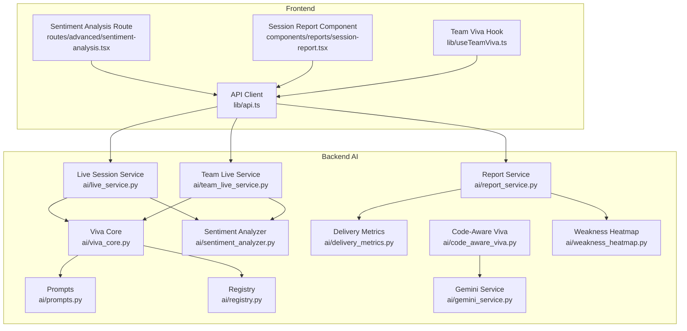
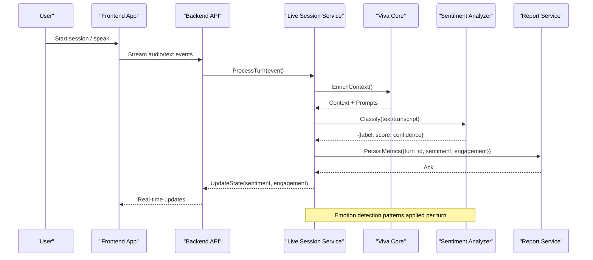
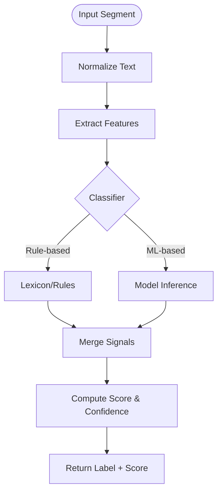
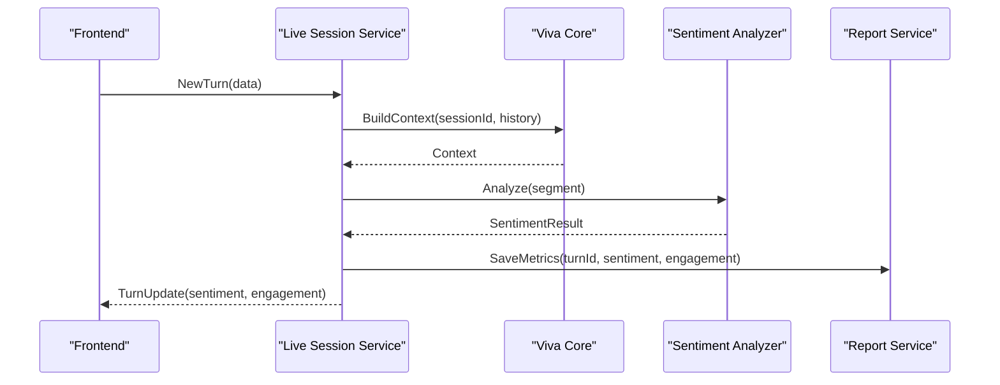
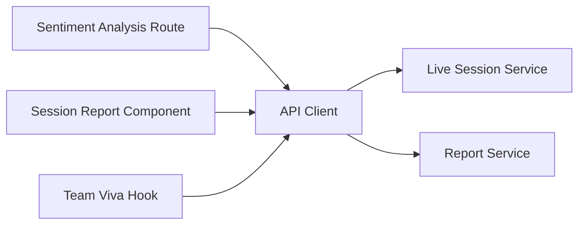
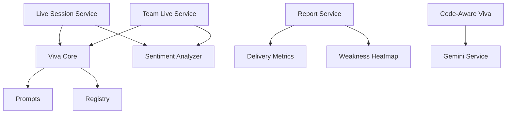

# Sentiment Analysis Service

<cite>
**Referenced Files in This Document**
- [sentiment_analyzer.py](file://backend/ai/sentiment_analyzer.py)
- [report_service.py](file://backend/ai/report_service.py)
- [delivery_metrics.py](file://backend/ai/delivery_metrics.py)
- [viva_core.py](file://backend/ai/viva_core.py)
- [live_service.py](file://backend/ai/live_service.py)
- [team_live_service.py](file://backend/ai/team_live_service.py)
- [prompts.py](file://backend/ai/prompts.py)
- [registry.py](file://backend/ai/registry.py)
- [weakness_heatmap.py](file://backend/ai/weakness_heatmap.py)
- [code_aware_viva.py](file://backend/ai/code_aware_viva.py)
- [gemini_service.py](file://backend/ai/gemini_service.py)
- [session-report.tsx](file://src/components/reports/session-report.tsx)
- [sentiment-analysis.tsx](file://src/routes/advanced/sentiment-analysis.tsx)
- [useTeamViva.ts](file://src/lib/useTeamViva.ts)
- [api.ts](file://src/lib/api.ts)
</cite>

## Table of Contents
1. [Introduction](#introduction)
2. [Project Structure](#project-structure)
3. [Core Components](#core-components)
4. [Architecture Overview](#architecture-overview)
5. [Detailed Component Analysis](#detailed-component-analysis)
6. [Dependency Analysis](#dependency-analysis)
7. [Performance Considerations](#performance-considerations)
8. [Troubleshooting Guide](#troubleshooting-guide)
9. [Conclusion](#conclusion)
10. [Appendices](#appendices)

## Introduction
This document explains the sentiment analysis service that processes emotional intelligence data from user interactions. It covers sentiment classification algorithms, engagement tracking metrics, behavioral analysis features, and how sentiment data integrates with the assessment system to provide contextual feedback and adaptive learning experiences. It also includes examples of sentiment data processing, emotion detection patterns, and integration with the reporting system for performance insights.

## Project Structure
The sentiment analysis capability is implemented primarily in the backend AI module and surfaced through frontend routes and components. Key areas:
- Backend AI services implement sentiment classification, live session processing, team-level aggregation, and reporting.
- Frontend routes and components visualize sentiment trends and integrate with backend APIs.

**Diagram sources**
- [sentiment-analysis.tsx](file://src/routes/advanced/sentiment-analysis.tsx)
- [session-report.tsx](file://src/components/reports/session-report.tsx)
- [useTeamViva.ts](file://src/lib/useTeamViva.ts)
- [api.ts](file://src/lib/api.ts)
- [live_service.py](file://backend/ai/live_service.py)
- [team_live_service.py](file://backend/ai/team_live_service.py)
- [viva_core.py](file://backend/ai/viva_core.py)
- [sentiment_analyzer.py](file://backend/ai/sentiment_analyzer.py)
- [report_service.py](file://backend/ai/report_service.py)
- [delivery_metrics.py](file://backend/ai/delivery_metrics.py)
- [prompts.py](file://backend/ai/prompts.py)
- [registry.py](file://backend/ai/registry.py)
- [code_aware_viva.py](file://backend/ai/code_aware_viva.py)
- [gemini_service.py](file://backend/ai/gemini_service.py)
- [weakness_heatmap.py](file://backend/ai/weakness_heatmap.py)

**Section sources**
- [sentiment_analyzer.py](file://backend/ai/sentiment_analyzer.py)
- [report_service.py](file://backend/ai/report_service.py)
- [delivery_metrics.py](file://backend/ai/delivery_metrics.py)
- [viva_core.py](file://backend/ai/viva_core.py)
- [live_service.py](file://backend/ai/live_service.py)
- [team_live_service.py](file://backend/ai/team_live_service.py)
- [prompts.py](file://backend/ai/prompts.py)
- [registry.py](file://backend/ai/registry.py)
- [weakness_heatmap.py](file://backend/ai/weakness_heatmap.py)
- [code_aware_viva.py](file://backend/ai/code_aware_viva.py)
- [gemini_service.py](file://backend/ai/gemini_service.py)
- [session-report.tsx](file://src/components/reports/session-report.tsx)
- [sentiment-analysis.tsx](file://src/routes/advanced/sentiment-analysis.tsx)
- [useTeamViva.ts](file://src/lib/useTeamViva.ts)
- [api.ts](file://src/lib/api.ts)

## Core Components
- Sentiment Analyzer: Implements sentiment classification logic used across live sessions and team sessions.
- Live Session Service: Processes real-time interaction streams, extracts signals, and computes sentiment per turn or segment.
- Team Live Service: Aggregates sentiment across participants and time windows for team-level insights.
- Viva Core: Orchestrates prompts, registry lookups, and core session lifecycle; integrates sentiment into coaching flows.
- Report Service: Compiles sentiment and related metrics into reports for performance insights.
- Delivery Metrics: Tracks engagement and delivery quality indicators alongside sentiment.
- Weakness Heatmap: Correlates sentiment dips with specific skill or topic weaknesses.
- Code-Aware Viva and Gemini Service: Provide domain-aware context and LLM-based enhancements where applicable.

Key responsibilities:
- Classification: Map raw interaction text/audio transcripts to sentiment labels and scores.
- Engagement Tracking: Measure participation, response latency, and affective tone over time.
- Behavioral Analysis: Identify patterns such as frustration, confidence, confusion, and enthusiasm.
- Integration: Feed sentiment into assessments and adaptive learning pathways.

**Section sources**
- [sentiment_analyzer.py](file://backend/ai/sentiment_analyzer.py)
- [live_service.py](file://backend/ai/live_service.py)
- [team_live_service.py](file://backend/ai/team_live_service.py)
- [viva_core.py](file://backend/ai/viva_core.py)
- [report_service.py](file://backend/ai/report_service.py)
- [delivery_metrics.py](file://backend/ai/delivery_metrics.py)
- [weakness_heatmap.py](file://backend/ai/weakness_heatmap.py)
- [code_aware_viva.py](file://backend/ai/code_aware_viva.py)
- [gemini_service.py](file://backend/ai/gemini_service.py)

## Architecture Overview
The sentiment analysis pipeline spans real-time processing, aggregation, and reporting.

**Diagram sources**
- [live_service.py](file://backend/ai/live_service.py)
- [viva_core.py](file://backend/ai/viva_core.py)
- [sentiment_analyzer.py](file://backend/ai/sentiment_analyzer.py)
- [report_service.py](file://backend/ai/report_service.py)

## Detailed Component Analysis

### Sentiment Analyzer
Responsibilities:
- Classify sentiment from text or transcript segments.
- Compute confidence and label mapping (e.g., positive, neutral, negative).
- Support multi-label or weighted scoring when needed.

Processing flow:

Integration points:
- Used by live session processing to annotate turns.
- Consumed by team aggregation for group-level sentiment.
- Feeds report generation for trend visualization.

**Section sources**
- [sentiment_analyzer.py](file://backend/ai/sentiment_analyzer.py)

### Live Session Service
Responsibilities:
- Receive streaming events (audio/text), segment them, and pass to sentiment analyzer.
- Track engagement metrics (response time, talk-to-listen ratio, interruptions).
- Emit state updates to clients and persist intermediate results.

Sequence:

**Section sources**
- [live_service.py](file://backend/ai/live_service.py)
- [viva_core.py](file://backend/ai/viva_core.py)
- [sentiment_analyzer.py](file://backend/ai/sentiment_analyzer.py)
- [report_service.py](file://backend/ai/report_service.py)

### Team Live Service
Responsibilities:
- Aggregate sentiment across multiple participants.
- Compute team-level engagement and sentiment trends.
- Detect group dynamics (dominance, collaboration, conflict signals).

Behavioral analysis highlights:
- Group sentiment variance indicates disagreement or diverse perspectives.
- Temporal spikes correlate with challenging topics or facilitation moments.

**Section sources**
- [team_live_service.py](file://backend/ai/team_live_service.py)

### Viva Core
Responsibilities:
- Manage prompts and registry lookups.
- Orchestrate session lifecycle and integrate sentiment into coaching decisions.

Integration:
- Uses sentiment to adapt question difficulty or suggest remediation.
- Combines with code-aware modules for domain-specific feedback.

**Section sources**
- [viva_core.py](file://backend/ai/viva_core.py)
- [prompts.py](file://backend/ai/prompts.py)
- [registry.py](file://backend/ai/registry.py)
- [code_aware_viva.py](file://backend/ai/code_aware_viva.py)

### Report Service
Responsibilities:
- Compile sentiment and engagement metrics into structured reports.
- Generate summaries, trends, and actionable insights.

Reporting outputs:
- Per-session sentiment timeline.
- Team-level heatmaps correlating sentiment with weakness areas.

**Section sources**
- [report_service.py](file://backend/ai/report_service.py)
- [delivery_metrics.py](file://backend/ai/delivery_metrics.py)
- [weakness_heatmap.py](file://backend/ai/weakness_heatmap.py)

### Frontend Integration
- Sentiment Analysis Route: Displays real-time and historical sentiment visualizations.
- Session Report Component: Renders aggregated insights and recommendations.
- Team Viva Hook: Manages session state and subscribes to updates.
- API Client: Encapsulates calls to backend endpoints.

**Section sources**
- [sentiment-analysis.tsx](file://src/routes/advanced/sentiment-analysis.tsx)
- [session-report.tsx](file://src/components/reports/session-report.tsx)
- [useTeamViva.ts](file://src/lib/useTeamViva.ts)
- [api.ts](file://src/lib/api.ts)

## Dependency Analysis
Component relationships and coupling:
- Live Session Service depends on Viva Core and Sentiment Analyzer.
- Team Live Service aggregates outputs from Live Session Service and Sentiment Analyzer.
- Report Service consumes metrics from Live Session Service and Delivery Metrics.
- Weakness Heatmap correlates sentiment with skill/topic weaknesses.
- Code-Aware Viva and Gemini Service provide enhanced context and inference where applicable.

**Diagram sources**
- [live_service.py](file://backend/ai/live_service.py)
- [team_live_service.py](file://backend/ai/team_live_service.py)
- [viva_core.py](file://backend/ai/viva_core.py)
- [sentiment_analyzer.py](file://backend/ai/sentiment_analyzer.py)
- [report_service.py](file://backend/ai/report_service.py)
- [delivery_metrics.py](file://backend/ai/delivery_metrics.py)
- [weakness_heatmap.py](file://backend/ai/weakness_heatmap.py)
- [prompts.py](file://backend/ai/prompts.py)
- [registry.py](file://backend/ai/registry.py)
- [code_aware_viva.py](file://backend/ai/code_aware_viva.py)
- [gemini_service.py](file://backend/ai/gemini_service.py)

**Section sources**
- [live_service.py](file://backend/ai/live_service.py)
- [team_live_service.py](file://backend/ai/team_live_service.py)
- [viva_core.py](file://backend/ai/viva_core.py)
- [sentiment_analyzer.py](file://backend/ai/sentiment_analyzer.py)
- [report_service.py](file://backend/ai/report_service.py)
- [delivery_metrics.py](file://backend/ai/delivery_metrics.py)
- [weakness_heatmap.py](file://backend/ai/weakness_heatmap.py)
- [prompts.py](file://backend/ai/prompts.py)
- [registry.py](file://backend/ai/registry.py)
- [code_aware_viva.py](file://backend/ai/code_aware_viva.py)
- [gemini_service.py](file://backend/ai/gemini_service.py)

## Performance Considerations
- Streaming efficiency: Minimize payload size and batch updates to reduce network overhead.
- Classifier latency: Cache frequent patterns and use lightweight heuristics before invoking heavier models.
- Aggregation cost: Use incremental updates for team-level metrics rather than recomputing full windows.
- Storage: Partition metrics by session and time window to optimize query performance.
- Concurrency: Ensure thread-safe access to shared state in live processing pipelines.

[No sources needed since this section provides general guidance]

## Troubleshooting Guide
Common issues and resolutions:
- Missing or delayed sentiment updates: Verify event stream connectivity and check backend logs for processing errors.
- Incorrect sentiment labels: Review normalization steps and classifier thresholds; consider retraining or prompt adjustments.
- Team metrics inconsistencies: Validate aggregation windows and ensure consistent participant IDs across sessions.
- Report generation failures: Check metric completeness and schema compatibility between services.

Debugging tips:
- Enable detailed logging in live session processing.
- Inspect intermediate sentiment results per turn.
- Compare team-level aggregates against individual contributions.

**Section sources**
- [live_service.py](file://backend/ai/live_service.py)
- [team_live_service.py](file://backend/ai/team_live_service.py)
- [report_service.py](file://backend/ai/report_service.py)

## Conclusion
The sentiment analysis service integrates real-time classification, engagement tracking, and behavioral analysis to enrich the assessment system. By combining sentiment signals with delivery metrics and weakness correlations, it enables contextual feedback and adaptive learning experiences. The modular architecture supports scalability and maintainability while providing clear integration points for both backend processing and frontend visualization.

[No sources needed since this section summarizes without analyzing specific files]

## Appendices
- Example usage patterns:
  - Per-turn sentiment annotation during live sessions.
  - Team-level sentiment trend aggregation across a cohort.
  - Report generation summarizing sentiment and engagement for performance insights.

[No sources needed since this section provides general guidance]