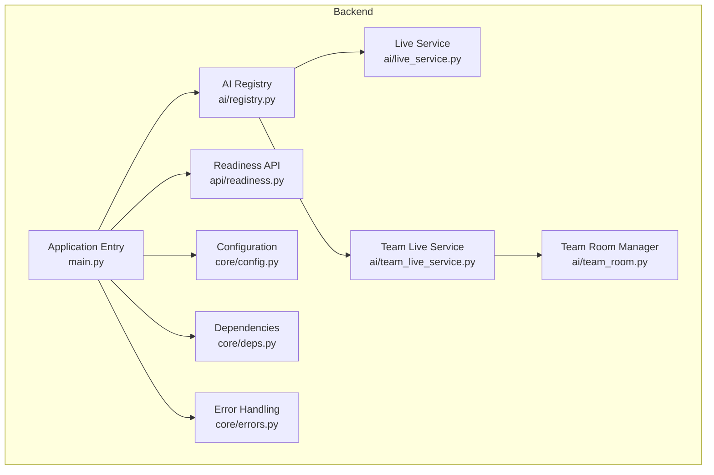
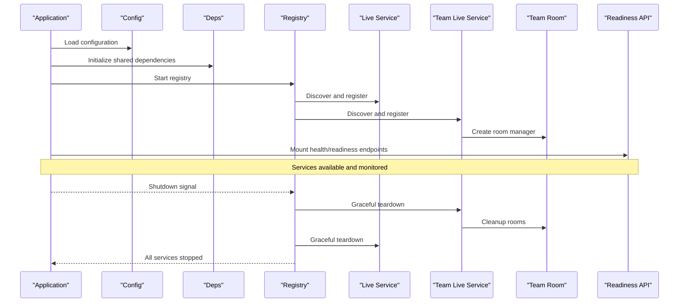
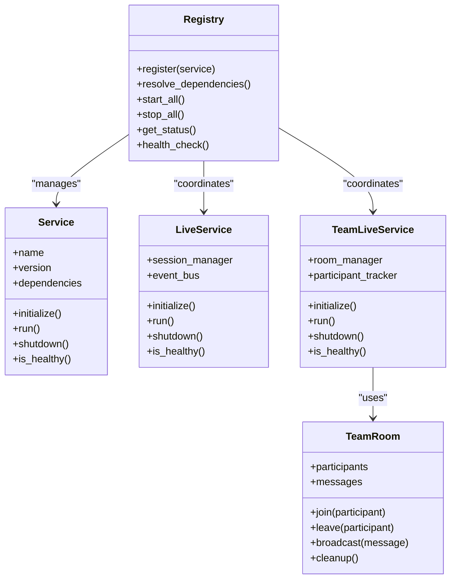
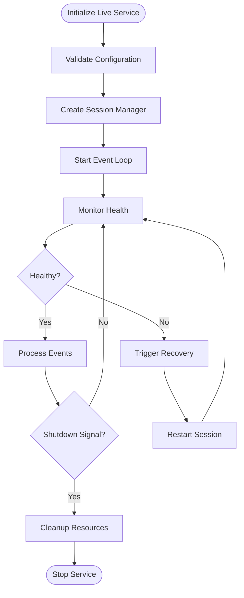
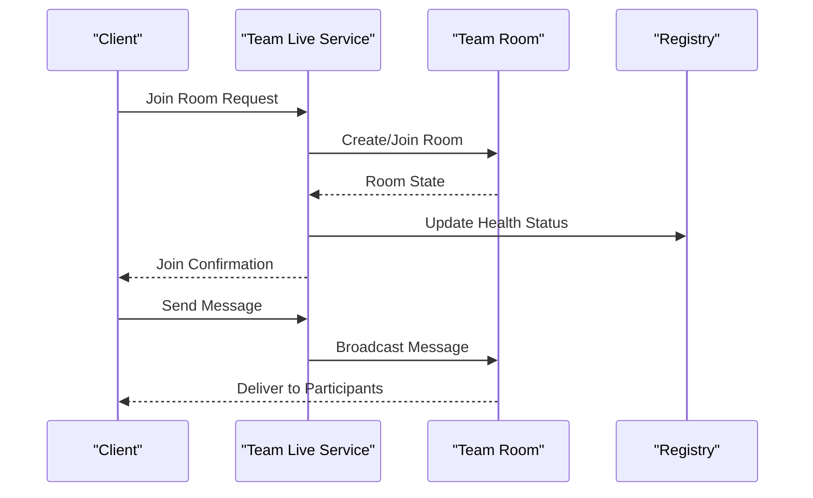
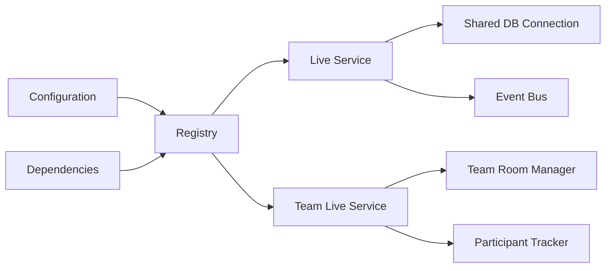

# Service Lifecycle Management

<cite>
**Referenced Files in This Document**
- [main.py](file://backend/main.py)
- [registry.py](file://backend/ai/registry.py)
- [live_service.py](file://backend/ai/live_service.py)
- [team_live_service.py](file://backend/ai/team_live_service.py)
- [team_room.py](file://backend/ai/team_room.py)
- [readiness.py](file://backend/api/readiness.py)
- [config.py](file://backend/core/config.py)
- [deps.py](file://backend/core/deps.py)
- [errors.py](file://backend/core/errors.py)
- [test_registry.py](file://backend/tests/test_registry.py)
</cite>

## Table of Contents
1. [Introduction](#introduction)
2. [Project Structure](#project-structure)
3. [Core Components](#core-components)
4. [Architecture Overview](#architecture-overview)
5. [Detailed Component Analysis](#detailed-component-analysis)
6. [Dependency Analysis](#dependency-analysis)
7. [Performance Considerations](#performance-considerations)
8. [Troubleshooting Guide](#troubleshooting-guide)
9. [Conclusion](#conclusion)

## Introduction
This document explains the service lifecycle management system for AI services, covering initialization, health monitoring, graceful shutdown, service discovery, dependency resolution, and fault tolerance. It also documents health check endpoints, monitoring integration, automatic recovery procedures, and real-time collaboration services integrated with the main registry. Examples are provided for service registration, status monitoring, and troubleshooting common issues.

## Project Structure
The backend organizes AI services under a dedicated module with a central registry that handles discovery and lifecycle coordination. Health and readiness endpoints expose operational status to orchestrators and monitoring systems. Configuration and dependency utilities support robust startup and teardown.

**Diagram sources**
- [main.py](file://backend/main.py)
- [registry.py](file://backend/ai/registry.py)
- [live_service.py](file://backend/ai/live_service.py)
- [team_live_service.py](file://backend/ai/team_live_service.py)
- [team_room.py](file://backend/ai/team_room.py)
- [readiness.py](file://backend/api/readiness.py)
- [config.py](file://backend/core/config.py)
- [deps.py](file://backend/core/deps.py)
- [errors.py](file://backend/core/errors.py)

**Section sources**
- [main.py](file://backend/main.py)
- [registry.py](file://backend/ai/registry.py)
- [readiness.py](file://backend/api/readiness.py)
- [config.py](file://backend/core/config.py)
- [deps.py](file://backend/core/deps.py)
- [errors.py](file://backend/core/errors.py)

## Core Components
- AI Registry: Centralized service discovery and lifecycle control for AI services. It registers services, resolves dependencies, tracks runtime state, and coordinates startup/shutdown sequences.
- Live Service: Manages live session lifecycle, including connection handling, event routing, and resource cleanup.
- Team Live Service: Extends live capabilities for team-based sessions, coordinating multiple participants and room state.
- Team Room: Encapsulates per-room state, participant management, and message distribution within collaborative sessions.
- Readiness API: Exposes health and readiness endpoints for external orchestration and monitoring.
- Configuration and Dependencies: Provide environment-driven settings and shared resources (e.g., databases, caches) required by services during initialization.
- Error Handling: Standardized error types and logging strategies to ensure consistent diagnostics and recovery behavior.

**Section sources**
- [registry.py](file://backend/ai/registry.py)
- [live_service.py](file://backend/ai/live_service.py)
- [team_live_service.py](file://backend/ai/team_live_service.py)
- [team_room.py](file://backend/ai/team_room.py)
- [readiness.py](file://backend/api/readiness.py)
- [config.py](file://backend/core/config.py)
- [deps.py](file://backend/core/deps.py)
- [errors.py](file://backend/core/errors.py)

## Architecture Overview
The lifecycle architecture follows a clear sequence: application bootstrap loads configuration, initializes shared dependencies, starts the AI registry, discovers and registers services, exposes health/readiness endpoints, and manages graceful shutdown on signals or errors. Real-time collaboration services integrate via the registry to coordinate multi-user sessions.

**Diagram sources**
- [main.py](file://backend/main.py)
- [registry.py](file://backend/ai/registry.py)
- [live_service.py](file://backend/ai/live_service.py)
- [team_live_service.py](file://backend/ai/team_live_service.py)
- [team_room.py](file://backend/ai/team_room.py)
- [readiness.py](file://backend/api/readiness.py)
- [config.py](file://backend/core/config.py)
- [deps.py](file://backend/core/deps.py)

## Detailed Component Analysis

### AI Registry: Discovery and Lifecycle Coordination
The registry is the backbone of service management. It maintains a catalog of services, their dependencies, and runtime states. During startup, it scans for registered services, validates dependency graphs, and initializes them in topological order. On shutdown, it tears down services in reverse order, ensuring resources are released cleanly.

Key responsibilities:
- Service registration and metadata tracking
- Dependency resolution with cycle detection
- Health probing and status aggregation
- Graceful start/stop orchestration
- Fault isolation and recovery triggers

**Diagram sources**
- [registry.py](file://backend/ai/registry.py)
- [live_service.py](file://backend/ai/live_service.py)
- [team_live_service.py](file://backend/ai/team_live_service.py)
- [team_room.py](file://backend/ai/team_room.py)

**Section sources**
- [registry.py](file://backend/ai/registry.py)
- [test_registry.py](file://backend/tests/test_registry.py)

### Live Service: Session Lifecycle and Event Routing
The live service manages individual session lifecycles, handling connection establishment, event processing, and resource cleanup. It integrates with the registry for health reporting and participates in coordinated shutdowns.

Responsibilities:
- Session creation and teardown
- Event routing and broadcasting
- Resource allocation and deallocation
- Health status updates

**Diagram sources**
- [live_service.py](file://backend/ai/live_service.py)

**Section sources**
- [live_service.py](file://backend/ai/live_service.py)

### Team Live Service: Collaborative Session Management
The team live service extends live functionality for multi-participant sessions. It coordinates room creation, participant lifecycle, and message distribution through the team room manager.

Responsibilities:
- Room lifecycle management
- Participant join/leave handling
- Message broadcasting and synchronization
- Integration with registry for health and discovery

**Diagram sources**
- [team_live_service.py](file://backend/ai/team_live_service.py)
- [team_room.py](file://backend/ai/team_room.py)
- [registry.py](file://backend/ai/registry.py)

**Section sources**
- [team_live_service.py](file://backend/ai/team_live_service.py)
- [team_room.py](file://backend/ai/team_room.py)

### Readiness API: Health Monitoring Endpoints
The readiness API provides standardized endpoints for health checks and service status. These endpoints are consumed by orchestrators and monitoring systems to determine service availability and health.

Endpoints typically include:
- Health check: Returns overall service health
- Readiness probe: Indicates if the service is ready to accept traffic
- Detailed status: Provides component-level health information

**Section sources**
- [readiness.py](file://backend/api/readiness.py)

### Configuration and Dependencies
Configuration drives service behavior, including timeouts, retry policies, and feature flags. Shared dependencies such as database connections and caches are initialized once and injected into services to avoid duplication and ensure consistency.

Key aspects:
- Environment-based configuration loading
- Dependency injection for shared resources
- Validation of required settings at startup
- Centralized logging and error handling

**Section sources**
- [config.py](file://backend/core/config.py)
- [deps.py](file://backend/core/deps.py)
- [errors.py](file://backend/core/errors.py)

## Dependency Analysis
The registry enforces dependency resolution with cycle detection to prevent circular dependencies. Services declare their dependencies, which are validated before initialization. The dependency graph ensures correct startup order and facilitates targeted restarts on failure.

**Diagram sources**
- [registry.py](file://backend/ai/registry.py)
- [live_service.py](file://backend/ai/live_service.py)
- [team_live_service.py](file://backend/ai/team_live_service.py)
- [team_room.py](file://backend/ai/team_room.py)
- [config.py](file://backend/core/config.py)
- [deps.py](file://backend/core/deps.py)

**Section sources**
- [registry.py](file://backend/ai/registry.py)
- [test_registry.py](file://backend/tests/test_registry.py)

## Performance Considerations
- Lazy initialization: Services initialize only when needed to reduce startup time
- Connection pooling: Shared dependencies use pooled connections for efficiency
- Asynchronous operations: Event processing uses async patterns to handle high concurrency
- Memory management: Explicit cleanup prevents memory leaks during long-running sessions
- Health check frequency: Tunable intervals balance responsiveness with overhead

[No sources needed since this section provides general guidance]

## Troubleshooting Guide
Common issues and resolutions:
- Service fails to start: Check configuration validation and dependency availability
- Health check failures: Inspect component-specific health indicators and logs
- Graceful shutdown hangs: Verify resource cleanup and timeout configurations
- Dependency resolution errors: Review service dependency declarations for cycles
- Real-time collaboration issues: Check room state consistency and participant synchronization

Diagnostic steps:
- Use health endpoints to identify failing components
- Review structured logs for error traces and context
- Validate configuration against expected schemas
- Test dependency connectivity independently
- Monitor resource utilization during peak loads

**Section sources**
- [errors.py](file://backend/core/errors.py)
- [readiness.py](file://backend/api/readiness.py)
- [test_registry.py](file://backend/tests/test_registry.py)

## Conclusion
The service lifecycle management system provides robust initialization, health monitoring, and graceful shutdown capabilities for AI services. The registry serves as the central coordination point for service discovery, dependency resolution, and fault tolerance. Real-time collaboration services integrate seamlessly with the registry to deliver scalable multi-user experiences. Comprehensive health endpoints and monitoring integration enable proactive operations and automated recovery procedures.

[No sources needed since this section summarizes without analyzing specific files]