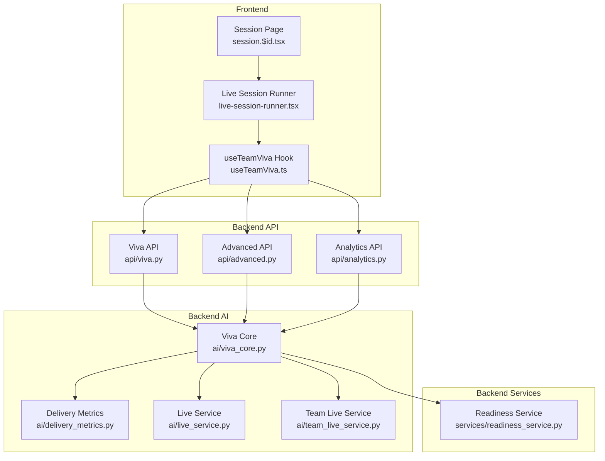
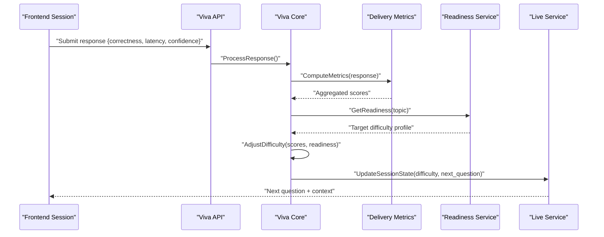
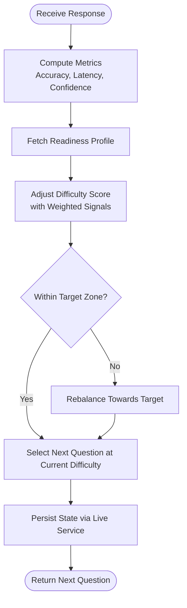
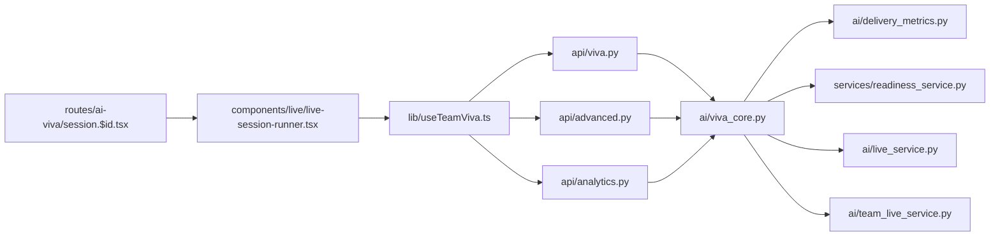

# Adaptive Difficulty System

<cite>
**Referenced Files in This Document**
- [viva_core.py](file://backend/ai/viva_core.py)
- [delivery_metrics.py](file://backend/ai/delivery_metrics.py)
- [live_service.py](file://backend/ai/live_service.py)
- [team_live_service.py](file://backend/ai/team_live_service.py)
- [readiness_service.py](file://backend/services/readiness_service.py)
- [api.py](file://backend/api/viva.py)
- [advanced.py](file://backend/api/advanced.py)
- [analytics.py](file://backend/api/analytics.py)
- [schemas.py](file://backend/models/schemas.py)
- [config.py](file://backend/core/config.py)
- [errors.py](file://backend/core/errors.py)
- [useTeamViva.ts](file://src/lib/useTeamViva.ts)
- [live-session-runner.tsx](file://src/components/live/live-session-runner.tsx)
- [session.$id.tsx](file://src/routes/ai-viva/session.$id.tsx)
</cite>

## Table of Contents
1. [Introduction](#introduction)
2. [Project Structure](#project-structure)
3. [Core Components](#core-components)
4. [Architecture Overview](#architecture-overview)
5. [Detailed Component Analysis](#detailed-component-analysis)
6. [Dependency Analysis](#dependency-analysis)
7. [Performance Considerations](#performance-considerations)
8. [Troubleshooting Guide](#troubleshooting-guide)
9. [Conclusion](#conclusion)
10. [Appendices](#appendices)

## Introduction
This document explains the adaptive difficulty adjustment system within the Viva Core Engine. It focuses on how the engine dynamically adjusts question complexity based on user performance, response time, and confidence indicators. The documentation covers difficulty scaling algorithms, performance tracking mechanisms, personalized learning path adjustments, examples of progression patterns, thresholds, customization options, and strategies to balance challenge and achievability for optimal engagement.

## Project Structure
The adaptive difficulty system spans backend AI services, API endpoints, data models, and frontend session orchestration:
- Backend AI layer implements core logic for difficulty estimation, metrics computation, and live session control.
- API layer exposes endpoints to drive sessions and retrieve analytics.
- Data models define schemas for session state and metrics.
- Frontend orchestrates live sessions and integrates with backend services.

**Diagram sources**
- [viva_core.py](file://backend/ai/viva_core.py)
- [delivery_metrics.py](file://backend/ai/delivery_metrics.py)
- [live_service.py](file://backend/ai/live_service.py)
- [team_live_service.py](file://backend/ai/team_live_service.py)
- [readiness_service.py](file://backend/services/readiness_service.py)
- [api.py](file://backend/api/viva.py)
- [advanced.py](file://backend/api/advanced.py)
- [analytics.py](file://backend/api/analytics.py)
- [useTeamViva.ts](file://src/lib/useTeamViva.ts)
- [live-session-runner.tsx](file://src/components/live/live-session-runner.tsx)
- [session.$id.tsx](file://src/routes/ai-viva/session.$id.tsx)

**Section sources**
- [viva_core.py](file://backend/ai/viva_core.py)
- [delivery_metrics.py](file://backend/ai/delivery_metrics.py)
- [live_service.py](file://backend/ai/live_service.py)
- [team_live_service.py](file://backend/ai/team_live_service.py)
- [readiness_service.py](file://backend/services/readiness_service.py)
- [api.py](file://backend/api/viva.py)
- [advanced.py](file://backend/api/advanced.py)
- [analytics.py](file://backend/api/analytics.py)
- [useTeamViva.ts](file://src/lib/useTeamViva.ts)
- [live-session-runner.tsx](file://src/components/live/live-session-runner.tsx)
- [session.$id.tsx](file://src/routes/ai-viva/session.$id.tsx)

## Core Components
- Viva Core: Central orchestrator for difficulty estimation, question selection, and session flow control. Integrates metrics, readiness, and live services.
- Delivery Metrics: Computes performance signals (accuracy, response time, confidence proxies) and aggregates them into actionable scores.
- Readiness Service: Maintains learner readiness profiles and informs difficulty targets per topic or skill.
- Live Services: Manage real-time session state, transitions, and team-level coordination.
- API Layer: Exposes endpoints to start sessions, submit responses, request next questions, and fetch analytics.
- Frontend Orchestration: Drives the live session UI, collects user inputs, and communicates with backend APIs.

Key responsibilities:
- Maintain a difficulty score per topic/skill.
- Update difficulty after each response using performance, timing, and confidence signals.
- Select next question difficulty aligned with target zone.
- Persist and expose metrics for analytics and personalization.

**Section sources**
- [viva_core.py](file://backend/ai/viva_core.py)
- [delivery_metrics.py](file://backend/ai/delivery_metrics.py)
- [readiness_service.py](file://backend/services/readiness_service.py)
- [live_service.py](file://backend/ai/live_service.py)
- [team_live_service.py](file://backend/ai/team_live_service.py)
- [api.py](file://backend/api/viva.py)
- [advanced.py](file://backend/api/advanced.py)
- [analytics.py](file://backend/api/analytics.py)
- [useTeamViva.ts](file://src/lib/useTeamViva.ts)
- [live-session-runner.tsx](file://src/components/live/live-session-runner.tsx)
- [session.$id.tsx](file://src/routes/ai-viva/session.$id.tsx)

## Architecture Overview
The adaptive difficulty system follows a feedback loop:
- User answers a question; frontend sends response metadata (answer correctness, latency, confidence).
- Backend computes delivery metrics and updates difficulty scores.
- Viva Core selects the next question difficulty to keep the learner in the optimal challenge zone.
- Analytics endpoints expose progress and readiness for personalization.

**Diagram sources**
- [api.py](file://backend/api/viva.py)
- [viva_core.py](file://backend/ai/viva_core.py)
- [delivery_metrics.py](file://backend/ai/delivery_metrics.py)
- [readiness_service.py](file://backend/services/readiness_service.py)
- [live_service.py](file://backend/ai/live_service.py)

## Detailed Component Analysis

### Viva Core: Difficulty Orchestration
Responsibilities:
- Maintain per-topic difficulty levels and history windows.
- Apply scaling rules based on recent performance, response time, and confidence.
- Align next-question difficulty with readiness targets.
- Coordinate with live service to persist state and deliver next items.

Algorithmic highlights:
- Sliding window aggregation of accuracy and latency.
- Confidence-weighted adjustments to smooth volatility.
- Targeting a “zone of proximal development” by aiming for a desired success probability band.
- Decay factors to prevent overfitting to short-term noise.

**Diagram sources**
- [viva_core.py](file://backend/ai/viva_core.py)
- [delivery_metrics.py](file://backend/ai/delivery_metrics.py)
- [readiness_service.py](file://backend/services/readiness_service.py)
- [live_service.py](file://backend/ai/live_service.py)

**Section sources**
- [viva_core.py](file://backend/ai/viva_core.py)
- [delivery_metrics.py](file://backend/ai/delivery_metrics.py)
- [readiness_service.py](file://backend/services/readiness_service.py)
- [live_service.py](file://backend/ai/live_service.py)

### Delivery Metrics: Performance Tracking
Responsibilities:
- Aggregate correctness, response time, and confidence proxies.
- Compute rolling averages and variance to detect trends.
- Provide normalized scores for downstream difficulty adjustment.

Key considerations:
- Time decay weighting to emphasize recent behavior.
- Outlier handling for extreme latencies or accidental submissions.
- Confidence smoothing to avoid overreacting to single high/low values.

**Section sources**
- [delivery_metrics.py](file://backend/ai/delivery_metrics.py)

### Readiness Service: Personalized Learning Path
Responsibilities:
- Maintain readiness profiles per learner and topic.
- Translate readiness into target difficulty bands.
- Support scenario-specific configurations (e.g., exam prep vs. exploratory learning).

Integration points:
- Consumed by Viva Core to set difficulty targets.
- Updated by analytics and session outcomes.

**Section sources**
- [readiness_service.py](file://backend/services/readiness_service.py)

### Live Services: Real-Time Session Control
Responsibilities:
- Manage live session lifecycle and state transitions.
- Persist difficulty and next-question decisions.
- Support team-level coordination when applicable.

**Section sources**
- [live_service.py](file://backend/ai/live_service.py)
- [team_live_service.py](file://backend/ai/team_live_service.py)

### API Layer: Entry Points
Responsibilities:
- Expose endpoints to start sessions, submit responses, and request next questions.
- Validate payloads and route requests to Viva Core.
- Provide analytics endpoints for dashboards and personalization.

**Section sources**
- [api.py](file://backend/api/viva.py)
- [advanced.py](file://backend/api/advanced.py)
- [analytics.py](file://backend/api/analytics.py)

### Frontend Orchestration
Responsibilities:
- Drive live session UI and collect user inputs.
- Measure response times and capture confidence indicators.
- Communicate with backend APIs and render next questions.

**Section sources**
- [useTeamViva.ts](file://src/lib/useTeamViva.ts)
- [live-session-runner.tsx](file://src/components/live/live-session-runner.tsx)
- [session.$id.tsx](file://src/routes/ai-viva/session.$id.tsx)

## Dependency Analysis
The following diagram shows key dependencies among components involved in adaptive difficulty:

**Diagram sources**
- [api.py](file://backend/api/viva.py)
- [advanced.py](file://backend/api/advanced.py)
- [analytics.py](file://backend/api/analytics.py)
- [viva_core.py](file://backend/ai/viva_core.py)
- [delivery_metrics.py](file://backend/ai/delivery_metrics.py)
- [readiness_service.py](file://backend/services/readiness_service.py)
- [live_service.py](file://backend/ai/live_service.py)
- [team_live_service.py](file://backend/ai/team_live_service.py)
- [session.$id.tsx](file://src/routes/ai-viva/session.$id.tsx)
- [live-session-runner.tsx](file://src/components/live/live-session-runner.tsx)
- [useTeamViva.ts](file://src/lib/useTeamViva.ts)

**Section sources**
- [api.py](file://backend/api/viva.py)
- [advanced.py](file://backend/api/advanced.py)
- [analytics.py](file://backend/api/analytics.py)
- [viva_core.py](file://backend/ai/viva_core.py)
- [delivery_metrics.py](file://backend/ai/delivery_metrics.py)
- [readiness_service.py](file://backend/services/readiness_service.py)
- [live_service.py](file://backend/ai/live_service.py)
- [team_live_service.py](file://backend/ai/team_live_service.py)
- [session.$id.tsx](file://src/routes/ai-viva/session.$id.tsx)
- [live-session-runner.tsx](file://src/components/live/live-session-runner.tsx)
- [useTeamViva.ts](file://src/lib/useTeamViva.ts)

## Performance Considerations
- Use sliding windows with exponential decay to reduce sensitivity to outliers while remaining responsive.
- Cap maximum difficulty jumps per step to maintain stability and engagement.
- Batch metric updates to minimize overhead during rapid-fire interactions.
- Cache readiness profiles and frequently accessed difficulty targets to reduce latency.
- Monitor p95/p99 response times for API endpoints serving next questions.

[No sources needed since this section provides general guidance]

## Troubleshooting Guide
Common issues and resolutions:
- Erratic difficulty oscillation: Increase smoothing weights and widen the target zone.
- Stagnant difficulty despite improvement: Reduce decay rate and ensure confidence signals are weighted appropriately.
- High latency in next-question retrieval: Check live service persistence and API throughput; consider caching.
- Incorrect readiness alignment: Verify readiness profile updates and topic mapping.

Operational checks:
- Validate input payloads and error codes from API layer.
- Inspect logging and error handling paths for exceptions.

**Section sources**
- [errors.py](file://backend/core/errors.py)
- [config.py](file://backend/core/config.py)
- [api.py](file://backend/api/viva.py)
- [advanced.py](file://backend/api/advanced.py)
- [analytics.py](file://backend/api/analytics.py)

## Conclusion
The adaptive difficulty system integrates performance metrics, readiness profiles, and real-time session management to maintain an optimal challenge level. By combining accuracy, response time, and confidence signals with thoughtful smoothing and targeting, the engine sustains engagement and supports personalized learning paths across diverse scenarios.

[No sources needed since this section summarizes without analyzing specific files]

## Appendices

### Example Difficulty Progression Patterns
- Rapid improvement: Gradual upward steps with small increments until plateau.
- Mixed performance: Oscillation dampened by smoothing; net trend aligns with readiness.
- Declining performance: Downward steps to restore confidence and re-establish baseline.

[No sources needed since this section provides conceptual examples]

### Customization Options for Learning Scenarios
- Exam preparation: Tighter target zone, faster ascent, stricter latency penalties.
- Exploratory learning: Wider target zone, slower ascent, emphasis on confidence recovery.
- Team mode: Aggregated metrics with individual safeguards to prevent unfair difficulty spikes.

[No sources needed since this section provides conceptual guidance]