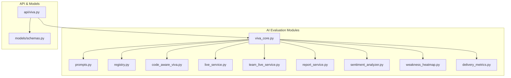
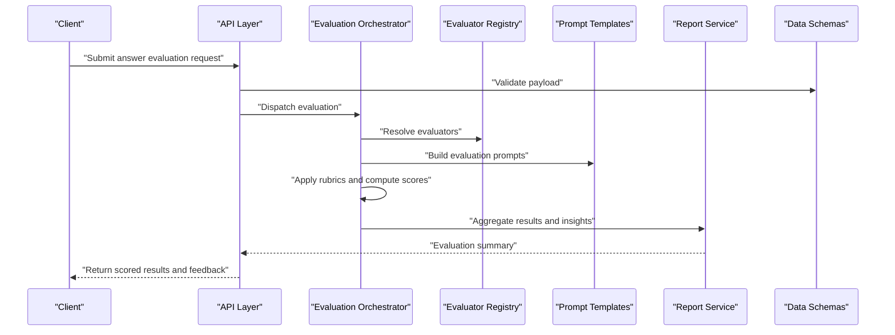
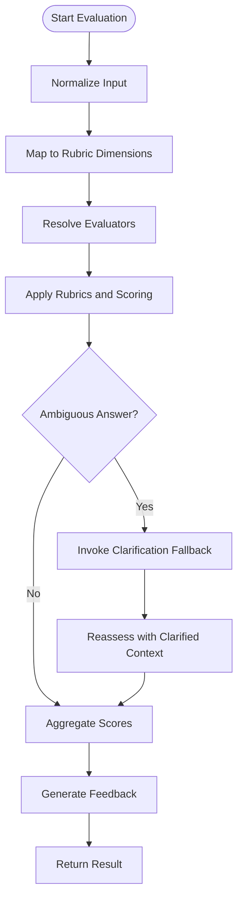
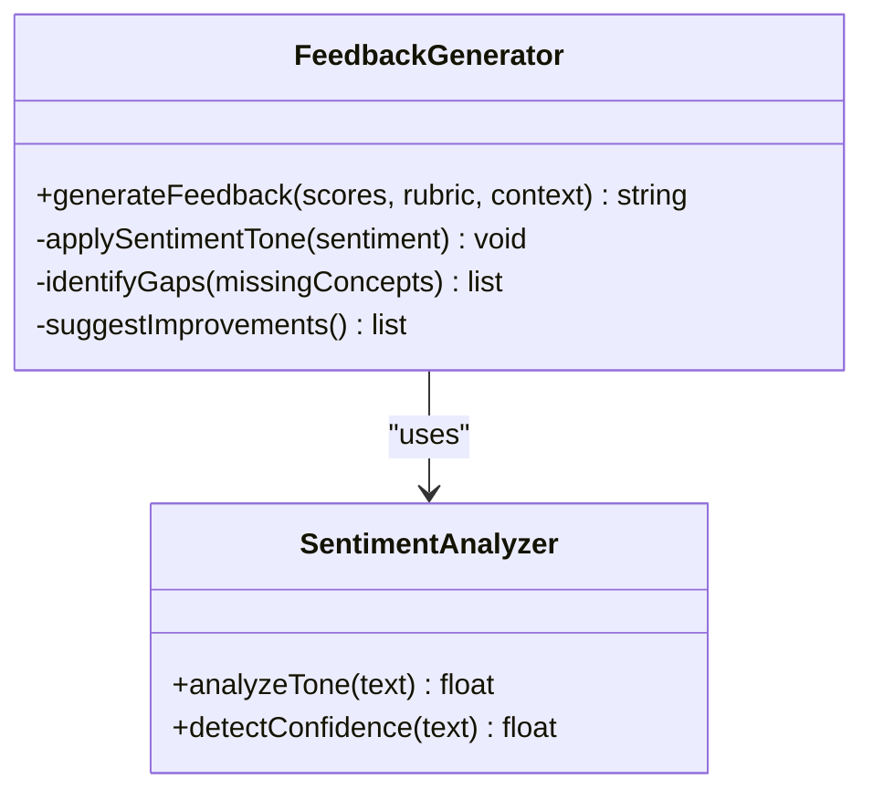
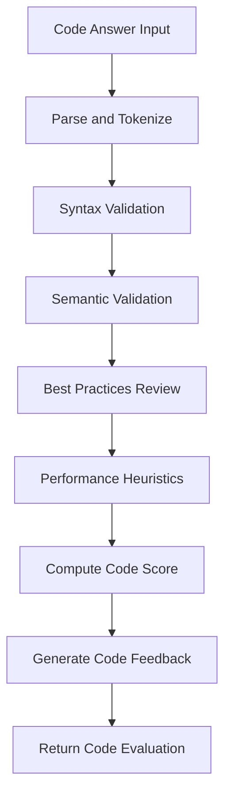
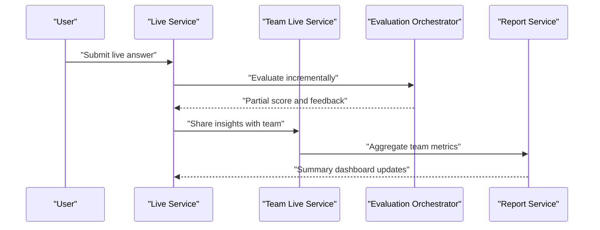
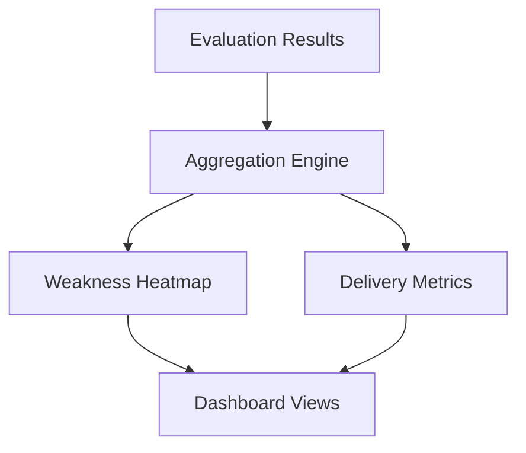
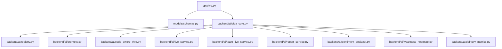

# Answer Evaluation Engine

<cite>
**Referenced Files in This Document**
- [viva_core.py](file://backend/ai/viva_core.py)
- [prompts.py](file://backend/ai/prompts.py)
- [registry.py](file://backend/ai/registry.py)
- [code_aware_viva.py](file://backend/ai/code_aware_viva.py)
- [live_service.py](file://backend/ai/live_service.py)
- [team_live_service.py](file://backend/ai/team_live_service.py)
- [report_service.py](file://backend/ai/report_service.py)
- [sentiment_analyzer.py](file://backend/ai/sentiment_analyzer.py)
- [weakness_heatmap.py](file://backend/ai/weakness_heatmap.py)
- [delivery_metrics.py](file://backend/ai/delivery_metrics.py)
- [api.py](file://backend/api/viva.py)
- [schemas.py](file://backend/models/schemas.py)
</cite>

## Table of Contents
1. [Introduction](#introduction)
2. [Project Structure](#project-structure)
3. [Core Components](#core-components)
4. [Architecture Overview](#architecture-overview)
5. [Detailed Component Analysis](#detailed-component-analysis)
6. [Dependency Analysis](#dependency-analysis)
7. [Performance Considerations](#performance-considerations)
8. [Troubleshooting Guide](#troubleshooting-guide)
9. [Conclusion](#conclusion)

## Introduction
This document explains the answer evaluation engine within the Viva Core Engine. It covers how answers are assessed across correctness, completeness, reasoning quality, and technical accuracy; how scoring algorithms and rubrics are implemented; how automated feedback is generated; and how ambiguous answers are handled to provide constructive guidance and identify knowledge gaps. The guide also includes examples of evaluation criteria for different question types, partial credit allocation strategies, and error analysis techniques.

## Project Structure
The evaluation engine spans several modules under backend/ai and integrates with API endpoints and data schemas:
- viva_core.py: Orchestrates evaluation flows, rubric application, and result aggregation.
- prompts.py: Defines prompt templates used by LLM-based evaluators and feedback generators.
- registry.py: Registers evaluator implementations and routing logic.
- code_aware_viva.py: Extends evaluation for code-aware questions (syntax, semantics, best practices).
- live_service.py and team_live_service.py: Provide real-time evaluation during live sessions and team interactions.
- report_service.py: Aggregates evaluation results into reports and dashboards.
- sentiment_analyzer.py: Analyzes tone and confidence to inform feedback framing.
- weakness_heatmap.py: Identifies recurring weaknesses and knowledge gaps.
- delivery_metrics.py: Computes performance metrics that complement content evaluation.
- api/viva.py: Exposes evaluation endpoints consumed by the frontend.
- models/schemas.py: Defines request/response schemas for evaluation inputs and outputs.

**Diagram sources**
- [viva_core.py](file://backend/ai/viva_core.py)
- [prompts.py](file://backend/ai/prompts.py)
- [registry.py](file://backend/ai/registry.py)
- [code_aware_viva.py](file://backend/ai/code_aware_viva.py)
- [live_service.py](file://backend/ai/live_service.py)
- [team_live_service.py](file://backend/ai/team_live_service.py)
- [report_service.py](file://backend/ai/report_service.py)
- [sentiment_analyzer.py](file://backend/ai/sentiment_analyzer.py)
- [weakness_heatmap.py](file://backend/ai/weakness_heatmap.py)
- [delivery_metrics.py](file://backend/ai/delivery_metrics.py)
- [api.py](file://backend/api/viva.py)
- [schemas.py](file://backend/models/schemas.py)

**Section sources**
- [viva_core.py](file://backend/ai/viva_core.py)
- [prompts.py](file://backend/ai/prompts.py)
- [registry.py](file://backend/ai/registry.py)
- [code_aware_viva.py](file://backend/ai/code_aware_viva.py)
- [live_service.py](file://backend/ai/live_service.py)
- [team_live_service.py](file://backend/ai/team_live_service.py)
- [report_service.py](file://backend/ai/report_service.py)
- [sentiment_analyzer.py](file://backend/ai/sentiment_analyzer.py)
- [weakness_heatmap.py](file://backend/ai/weakness_heatmap.py)
- [delivery_metrics.py](file://backend/ai/delivery_metrics.py)
- [api.py](file://backend/api/viva.py)
- [schemas.py](file://backend/models/schemas.py)

## Core Components
- Evaluation Orchestrator: Coordinates multi-faceted assessment across correctness, completeness, reasoning quality, and technical accuracy. Applies rubrics and aggregates scores.
- Rubric Engine: Encodes scoring rules per question type and domain, enabling partial credit and weighted dimensions.
- Feedback Generator: Produces actionable, constructive feedback based on rubric outcomes and sentiment analysis.
- Code-Aware Evaluator: Adds syntax, semantics, and best-practice checks for programming-related answers.
- Real-Time Evaluators: Support live session and team contexts with streaming or incremental evaluation.
- Reporting and Analytics: Summarizes results, identifies weaknesses, and computes delivery metrics.

Key responsibilities:
- Parse and normalize user responses.
- Map answers to rubric criteria.
- Compute dimension scores and partial credits.
- Generate narrative feedback and improvement suggestions.
- Track knowledge gaps and recurring errors.

**Section sources**
- [viva_core.py](file://backend/ai/viva_core.py)
- [prompts.py](file://backend/ai/prompts.py)
- [registry.py](file://backend/ai/registry.py)
- [code_aware_viva.py](file://backend/ai/code_aware_viva.py)
- [live_service.py](file://backend/ai/live_service.py)
- [team_live_service.py](file://backend/ai/team_live_service.py)
- [report_service.py](file://backend/ai/report_service.py)
- [sentiment_analyzer.py](file://backend/ai/sentiment_analyzer.py)
- [weakness_heatmap.py](file://backend/ai/weakness_heatmap.py)
- [delivery_metrics.py](file://backend/ai/delivery_metrics.py)
- [api.py](file://backend/api/viva.py)
- [schemas.py](file://backend/models/schemas.py)

## Architecture Overview
The evaluation pipeline begins at the API layer, which validates requests and forwards them to the orchestrator. The orchestrator selects appropriate evaluators via the registry, applies rubrics, and coordinates LLM-based assessments using prompts. Results are aggregated, analyzed for ambiguity and knowledge gaps, and then reported back through the API.

**Diagram sources**
- [api.py](file://backend/api/viva.py)
- [viva_core.py](file://backend/ai/viva_core.py)
- [registry.py](file://backend/ai/registry.py)
- [prompts.py](file://backend/ai/prompts.py)
- [report_service.py](file://backend/ai/report_service.py)
- [schemas.py](file://backend/models/schemas.py)

## Detailed Component Analysis

### Evaluation Orchestrator
Responsibilities:
- Normalize inputs and map to rubric dimensions.
- Coordinate multiple evaluators (content, code-aware, reasoning).
- Aggregate scores and produce final verdicts.
- Handle ambiguity detection and fallback strategies.

**Diagram sources**
- [viva_core.py](file://backend/ai/viva_core.py)
- [registry.py](file://backend/ai/registry.py)
- [prompts.py](file://backend/ai/prompts.py)

**Section sources**
- [viva_core.py](file://backend/ai/viva_core.py)
- [registry.py](file://backend/ai/registry.py)
- [prompts.py](file://backend/ai/prompts.py)

### Rubric Engine and Scoring Algorithms
- Dimensional Scoring: Correctness, Completeness, Reasoning Quality, Technical Accuracy.
- Partial Credit: Proportional awards for partially correct components.
- Weighted Aggregation: Domain-specific weights per dimension.
- Thresholding and Verdicts: Pass/fail bands and qualitative labels.

Examples of criteria by question type:
- Multiple Choice: Exact match plus rationale alignment.
- Short Answer: Key concept coverage and coherence.
- Essay: Argument structure, evidence usage, and depth.
- Code Response: Syntax validity, semantic correctness, efficiency, and style.

Partial credit allocation:
- Component breakdown: Identify atomic elements; award per element met.
- Penalty rules: Deductions for contradictions or irrelevant content.
- Confidence calibration: Adjust scores based on certainty indicators.

**Section sources**
- [viva_core.py](file://backend/ai/viva_core.py)
- [prompts.py](file://backend/ai/prompts.py)

### Automated Feedback Generation
- Constructive Framing: Positive reinforcement with targeted improvement tips.
- Ambiguity Handling: Ask clarifying questions when response is under-specified.
- Knowledge Gap Identification: Highlight missing concepts and suggest resources.
- Sentiment-Informed Tone: Adapt language based on detected confidence and tone.

**Diagram sources**
- [viva_core.py](file://backend/ai/viva_core.py)
- [sentiment_analyzer.py](file://backend/ai/sentiment_analyzer.py)
- [prompts.py](file://backend/ai/prompts.py)

**Section sources**
- [viva_core.py](file://backend/ai/viva_core.py)
- [sentiment_analyzer.py](file://backend/ai/sentiment_analyzer.py)
- [prompts.py](file://backend/ai/prompts.py)

### Code-Aware Evaluation
- Syntax Checks: Validate structure and compilation readiness.
- Semantic Validation: Ensure logical correctness and expected behavior.
- Best Practices: Style, readability, and maintainability guidelines.
- Performance Indicators: Complexity and resource usage hints.

**Diagram sources**
- [code_aware_viva.py](file://backend/ai/code_aware_viva.py)
- [prompts.py](file://backend/ai/prompts.py)

**Section sources**
- [code_aware_viva.py](file://backend/ai/code_aware_viva.py)
- [prompts.py](file://backend/ai/prompts.py)

### Real-Time Evaluation (Live Sessions and Teams)
- Streaming Assessment: Incremental scoring as responses evolve.
- Team Dynamics: Aggregate individual evaluations to group insights.
- Live Metrics: Track progress and engagement during sessions.

**Diagram sources**
- [live_service.py](file://backend/ai/live_service.py)
- [team_live_service.py](file://backend/ai/team_live_service.py)
- [viva_core.py](file://backend/ai/viva_core.py)
- [report_service.py](file://backend/ai/report_service.py)

**Section sources**
- [live_service.py](file://backend/ai/live_service.py)
- [team_live_service.py](file://backend/ai/team_live_service.py)
- [viva_core.py](file://backend/ai/viva_core.py)
- [report_service.py](file://backend/ai/report_service.py)

### Reporting and Weakness Heatmaps
- Aggregation: Combine scores across sessions and topics.
- Heatmaps: Visualize weak areas and trends over time.
- Delivery Metrics: Assess pacing, clarity, and responsiveness.

**Diagram sources**
- [report_service.py](file://backend/ai/report_service.py)
- [weakness_heatmap.py](file://backend/ai/weakness_heatmap.py)
- [delivery_metrics.py](file://backend/ai/delivery_metrics.py)

**Section sources**
- [report_service.py](file://backend/ai/report_service.py)
- [weakness_heatmap.py](file://backend/ai/weakness_heatmap.py)
- [delivery_metrics.py](file://backend/ai/delivery_metrics.py)

## Dependency Analysis
The evaluation engine exhibits clear separation of concerns:
- API layer depends on schemas for validation and returns structured results.
- Orchestrator depends on registry for evaluator selection and prompts for LLM orchestration.
- Specialized evaluators (code-aware, sentiment, heatmaps) extend core functionality without tight coupling.
- Reporting services aggregate outputs from multiple evaluators.

**Diagram sources**
- [api.py](file://backend/api/viva.py)
- [schemas.py](file://backend/models/schemas.py)
- [viva_core.py](file://backend/ai/viva_core.py)
- [registry.py](file://backend/ai/registry.py)
- [prompts.py](file://backend/ai/prompts.py)
- [code_aware_viva.py](file://backend/ai/code_aware_viva.py)
- [live_service.py](file://backend/ai/live_service.py)
- [team_live_service.py](file://backend/ai/team_live_service.py)
- [report_service.py](file://backend/ai/report_service.py)
- [sentiment_analyzer.py](file://backend/ai/sentiment_analyzer.py)
- [weakness_heatmap.py](file://backend/ai/weakness_heatmap.py)
- [delivery_metrics.py](file://backend/ai/delivery_metrics.py)

**Section sources**
- [api.py](file://backend/api/viva.py)
- [schemas.py](file://backend/models/schemas.py)
- [viva_core.py](file://backend/ai/viva_core.py)
- [registry.py](file://backend/ai/registry.py)
- [prompts.py](file://backend/ai/prompts.py)
- [code_aware_viva.py](file://backend/ai/code_aware_viva.py)
- [live_service.py](file://backend/ai/live_service.py)
- [team_live_service.py](file://backend/ai/team_live_service.py)
- [report_service.py](file://backend/ai/report_service.py)
- [sentiment_analyzer.py](file://backend/ai/sentiment_analyzer.py)
- [weakness_heatmap.py](file://backend/ai/weakness_heatmap.py)
- [delivery_metrics.py](file://backend/ai/delivery_metrics.py)

## Performance Considerations
- Prompt Optimization: Minimize token usage and reuse templates where possible.
- Caching: Cache frequent rubric mappings and evaluator configurations.
- Parallelism: Evaluate independent dimensions concurrently when safe.
- Streaming: Use incremental evaluation for long responses to reduce latency.
- Resource Limits: Enforce timeouts and memory caps for LLM calls.

[No sources needed since this section provides general guidance]

## Troubleshooting Guide
Common issues and resolutions:
- Ambiguous Answers: Trigger clarification prompts and re-evaluate with additional context.
- Inconsistent Scoring: Verify rubric weights and ensure consistent normalization.
- Code Evaluation Failures: Check parser compatibility and update syntax rules.
- Feedback Quality: Review sentiment analysis parameters and adjust tone settings.
- Performance Bottlenecks: Profile LLM calls and optimize prompt templates.

**Section sources**
- [viva_core.py](file://backend/ai/viva_core.py)
- [prompts.py](file://backend/ai/prompts.py)
- [code_aware_viva.py](file://backend/ai/code_aware_viva.py)
- [sentiment_analyzer.py](file://backend/ai/sentiment_analyzer.py)

## Conclusion
The Viva Core Engine’s answer evaluation engine delivers a robust, multi-dimensional assessment system. By combining rubric-driven scoring, LLM-powered reasoning analysis, code-aware validation, and sentiment-informed feedback, it provides comprehensive insights into learner performance. The modular architecture supports extensibility and real-time evaluation, while reporting and analytics help identify knowledge gaps and guide improvement. Continuous optimization of prompts, caching, and parallelization ensures scalability and responsiveness.

[No sources needed since this section summarizes without analyzing specific files]