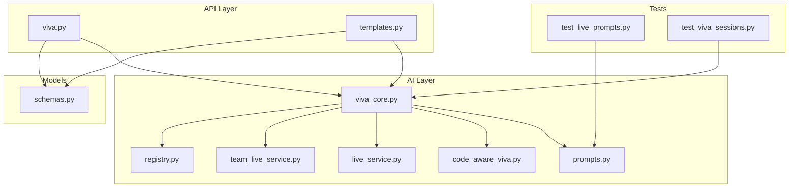
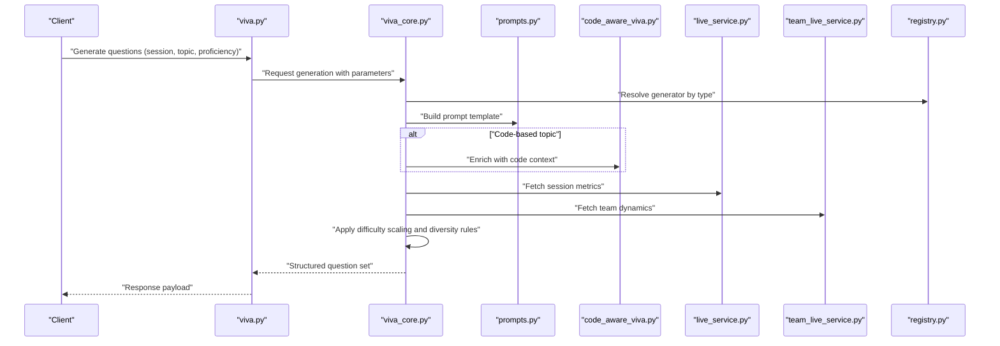
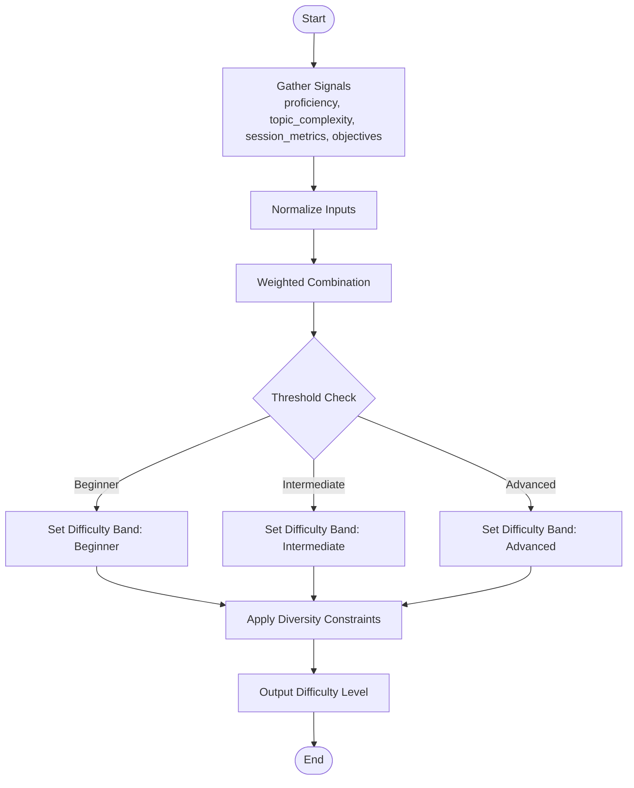
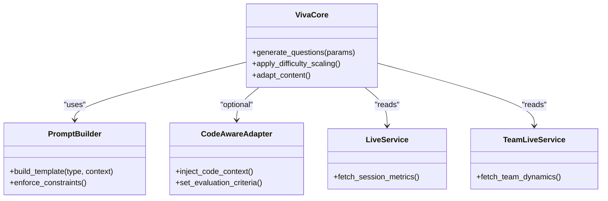
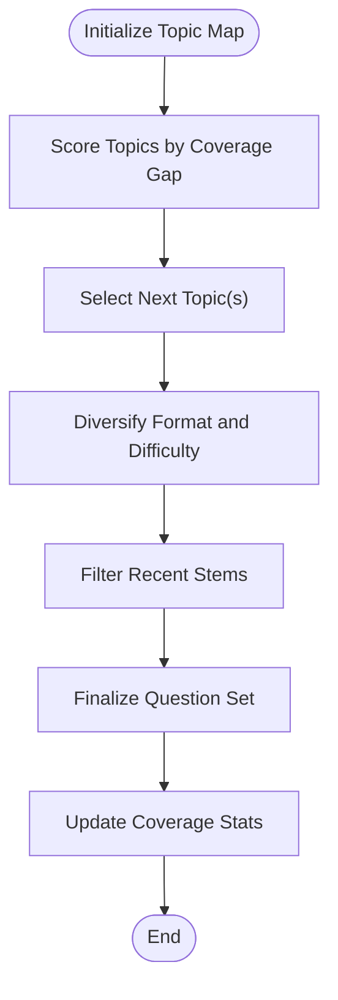
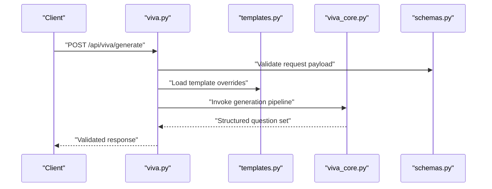
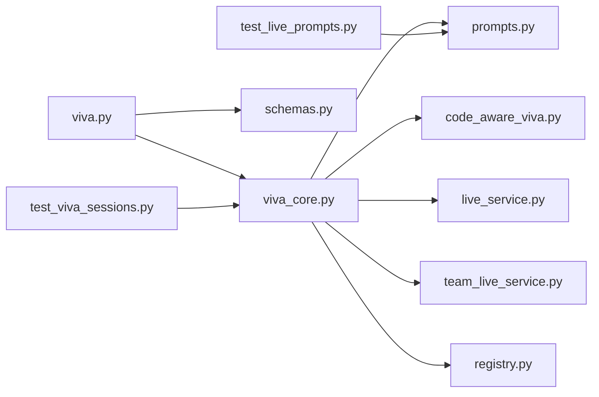

# Question Generation System

<cite>
**Referenced Files in This Document**
- [viva_core.py](file://backend/ai/viva_core.py)
- [prompts.py](file://backend/ai/prompts.py)
- [code_aware_viva.py](file://backend/ai/code_aware_viva.py)
- [registry.py](file://backend/ai/registry.py)
- [live_service.py](file://backend/ai/live_service.py)
- [team_live_service.py](file://backend/ai/team_live_service.py)
- [viva.py](file://backend/api/viva.py)
- [templates.py](file://backend/api/templates.py)
- [schemas.py](file://backend/models/schemas.py)
- [test_live_prompts.py](file://backend/tests/test_live_prompts.py)
- [test_viva_sessions.py](file://backend/tests/test_viva_sessions.py)
</cite>

## Table of Contents
1. [Introduction](#introduction)
2. [Project Structure](#project-structure)
3. [Core Components](#core-components)
4. [Architecture Overview](#architecture-overview)
5. [Detailed Component Analysis](#detailed-component-analysis)
6. [Dependency Analysis](#dependency-analysis)
7. [Performance Considerations](#performance-considerations)
8. [Troubleshooting Guide](#troubleshooting-guide)
9. [Conclusion](#conclusion)
10. [Appendices](#appendices)

## Introduction
This document explains the Viva Core Engine’s question generation system, focusing on how questions are dynamically generated based on user proficiency levels, topic complexity, and learning objectives. It documents prompt engineering strategies for multiple choice, open-ended, and code-based questions, including templates, difficulty scaling, content adaptation, diversity controls, and coverage guarantees. The goal is to provide both a high-level understanding and actionable details for developers integrating or extending the system.

## Project Structure
The question generation system spans AI services, API endpoints, models, and tests:
- AI layer orchestrates prompting, model calls, and response parsing.
- API layer exposes endpoints that accept session/topic parameters and return generated questions.
- Models define request/response schemas used across the stack.
- Tests validate prompt behavior and session flows.

**Diagram sources**
- [viva.py](file://backend/api/viva.py)
- [templates.py](file://backend/api/templates.py)
- [viva_core.py](file://backend/ai/viva_core.py)
- [prompts.py](file://backend/ai/prompts.py)
- [code_aware_viva.py](file://backend/ai/code_aware_viva.py)
- [live_service.py](file://backend/ai/live_service.py)
- [team_live_service.py](file://backend/ai/team_live_service.py)
- [registry.py](file://backend/ai/registry.py)
- [schemas.py](file://backend/models/schemas.py)
- [test_live_prompts.py](file://backend/tests/test_live_prompts.py)
- [test_viva_sessions.py](file://backend/tests/test_viva_sessions.py)

**Section sources**
- [viva.py](file://backend/api/viva.py)
- [templates.py](file://backend/api/templates.py)
- [viva_core.py](file://backend/ai/viva_core.py)
- [prompts.py](file://backend/ai/prompts.py)
- [code_aware_viva.py](file://backend/ai/code_aware_viva.py)
- [live_service.py](file://backend/ai/live_service.py)
- [team_live_service.py](file://backend/ai/team_live_service.py)
- [registry.py](file://backend/ai/registry.py)
- [schemas.py](file://backend/models/schemas.py)
- [test_live_prompts.py](file://backend/tests/test_live_prompts.py)
- [test_viva_sessions.py](file://backend/tests/test_viva_sessions.py)

## Core Components
- Prompt orchestration: Centralized prompt building and formatting for different question types.
- Difficulty scaling: Algorithms that adjust cognitive demand, context depth, and constraints based on proficiency and topic complexity.
- Content adaptation: Mechanisms to tailor questions to domain-specific knowledge (e.g., code-aware scenarios).
- Diversity and coverage: Controls to avoid repetition and ensure comprehensive topic coverage across sessions.
- Session state integration: Uses session history and performance signals to adapt subsequent questions.

Key responsibilities by file:
- viva_core.py: Orchestrates question generation workflows, integrates with prompts and services, and manages session-aware adaptation.
- prompts.py: Defines prompt templates and strategies for multiple choice, open-ended, and code-based questions.
- code_aware_viva.py: Extends generation for code-centric topics, injecting code context and evaluation criteria.
- live_service.py / team_live_service.py: Provide real-time or collaborative session contexts that influence question selection and difficulty.
- registry.py: Manages available generators and routing logic for different question types.
- viva.py / templates.py: Expose API endpoints and template-driven customization hooks.
- schemas.py: Define structured request/response contracts for generation inputs and outputs.
- test_live_prompts.py / test_viva_sessions.py: Validate prompt behavior and end-to-end session flows.

**Section sources**
- [viva_core.py](file://backend/ai/viva_core.py)
- [prompts.py](file://backend/ai/prompts.py)
- [code_aware_viva.py](file://backend/ai/code_aware_viva.py)
- [live_service.py](file://backend/ai/live_service.py)
- [team_live_service.py](file://backend/ai/team_live_service.py)
- [registry.py](file://backend/ai/registry.py)
- [viva.py](file://backend/api/viva.py)
- [templates.py](file://backend/api/templates.py)
- [schemas.py](file://backend/models/schemas.py)
- [test_live_prompts.py](file://backend/tests/test_live_prompts.py)
- [test_viva_sessions.py](file://backend/tests/test_viva_sessions.py)

## Architecture Overview
The system follows a layered architecture:
- API endpoints receive generation requests with session/topic/proficiency parameters.
- The core engine selects appropriate generators and builds prompts using templates.
- Specialized adapters (e.g., code-aware) enrich prompts with domain context.
- Services integrate real-time session data to refine difficulty and coverage.
- Responses are validated against schemas and returned to clients.

**Diagram sources**
- [viva.py](file://backend/api/viva.py)
- [viva_core.py](file://backend/ai/viva_core.py)
- [prompts.py](file://backend/ai/prompts.py)
- [code_aware_viva.py](file://backend/ai/code_aware_viva.py)
- [live_service.py](file://backend/ai/live_service.py)
- [team_live_service.py](file://backend/ai/team_live_service.py)
- [registry.py](file://backend/ai/registry.py)

## Detailed Component Analysis

### Prompt Engineering Strategies
- Multiple choice:
  - Strategy: Present a clear stem, plausible distractors, and an unambiguous correct answer.
  - Adaptation: Adjust distractor quality and stem complexity based on proficiency; inject scenario context for realism.
  - Coverage: Use topic tags to ensure balanced distribution across concepts.
- Open-ended:
  - Strategy: Encourage explanation, reasoning, and application; specify required elements in the prompt.
  - Adaptation: Increase depth and breadth for advanced learners; scaffold hints for beginners.
  - Coverage: Rotate themes and angles to avoid repetitive phrasing.
- Code-based:
  - Strategy: Provide minimal reproducible context, specify expected behaviors, and include evaluation criteria.
  - Adaptation: Tailor language/framework specifics; vary problem types (debugging, design, optimization).
  - Coverage: Ensure variety across patterns, error modes, and complexity levels.

Prompt templates and strategies are centralized to enable consistent tone, structure, and constraints across question types.

**Section sources**
- [prompts.py](file://backend/ai/prompts.py)
- [test_live_prompts.py](file://backend/tests/test_live_prompts.py)

### Difficulty Scaling Algorithm
Difficulty is computed from multiple signals:
- User proficiency level (self-reported or inferred from performance).
- Topic complexity (intrinsic difficulty tag or derived from historical success rates).
- Session dynamics (recent accuracy, time-on-task, confidence indicators).
- Learning objectives (target mastery areas and progression goals).

Algorithm outline:
- Normalize inputs to a common scale.
- Weight signals based on objective priority (e.g., recent performance may outweigh self-report).
- Apply thresholds to select difficulty bands (beginner, intermediate, advanced).
- Enforce diversity constraints to prevent consecutive same-difficulty questions.

**Diagram sources**
- [viva_core.py](file://backend/ai/viva_core.py)
- [live_service.py](file://backend/ai/live_service.py)
- [team_live_service.py](file://backend/ai/team_live_service.py)

**Section sources**
- [viva_core.py](file://backend/ai/viva_core.py)
- [live_service.py](file://backend/ai/live_service.py)
- [team_live_service.py](file://backend/ai/team_live_service.py)

### Content Adaptation Mechanisms
- Domain specialization:
  - Code-aware adapter injects relevant code snippets, frameworks, and constraints into prompts.
  - Non-code domains use analogous contextual enrichment (e.g., business scenarios, datasets).
- Personalization:
  - Leverages session history to emphasize weak areas and reinforce strengths.
  - Adjusts language style and scaffolding based on learner profile.
- Objective alignment:
  - Maps learning objectives to specific question attributes (depth, format, context).

**Diagram sources**
- [viva_core.py](file://backend/ai/viva_core.py)
- [prompts.py](file://backend/ai/prompts.py)
- [code_aware_viva.py](file://backend/ai/code_aware_viva.py)
- [live_service.py](file://backend/ai/live_service.py)
- [team_live_service.py](file://backend/ai/team_live_service.py)

**Section sources**
- [code_aware_viva.py](file://backend/ai/code_aware_viva.py)
- [viva_core.py](file://backend/ai/viva_core.py)
- [prompts.py](file://backend/ai/prompts.py)

### Diversity and Coverage Controls
- Repetition avoidance:
  - Track recently asked stems/themes; penalize reuse within a window.
  - Randomize order while respecting constraints.
- Comprehensive coverage:
  - Maintain a topic map with weights; prioritize underrepresented areas.
  - Rotate formats (MCQ, open-ended, code) to balance assessment modalities.
- Fairness and bias mitigation:
  - Avoid culturally sensitive or overly narrow contexts unless explicitly requested.
  - Ensure distractors and scenarios are inclusive and representative.

[No diagram sources needed since this diagram shows conceptual workflow, not actual code structure]

**Section sources**
- [viva_core.py](file://backend/ai/viva_core.py)
- [registry.py](file://backend/ai/registry.py)

### API Integration and Templates
- Endpoints:
  - Accept structured requests with session identifiers, topic tags, proficiency levels, and desired question counts.
  - Return validated responses conforming to schema definitions.
- Template hooks:
  - Allow dynamic substitution of variables (context, examples, constraints).
  - Support per-domain overrides via template registry.

**Diagram sources**
- [viva.py](file://backend/api/viva.py)
- [templates.py](file://backend/api/templates.py)
- [viva_core.py](file://backend/ai/viva_core.py)
- [schemas.py](file://backend/models/schemas.py)

**Section sources**
- [viva.py](file://backend/api/viva.py)
- [templates.py](file://backend/api/templates.py)
- [schemas.py](file://backend/models/schemas.py)

### Testing and Validation
- Prompt validation:
  - Unit tests verify prompt construction, constraint enforcement, and output shape.
- Session flow validation:
  - End-to-end tests simulate sessions, ensuring adaptive difficulty and coverage over time.

**Section sources**
- [test_live_prompts.py](file://backend/tests/test_live_prompts.py)
- [test_viva_sessions.py](file://backend/tests/test_viva_sessions.py)

## Dependency Analysis
The question generation system exhibits moderate coupling:
- API depends on core engine and schemas.
- Core engine depends on prompt builder, adapters, and services.
- Adapters depend on specialized context providers.
- Tests depend on prompts and core to validate behavior.

**Diagram sources**
- [viva.py](file://backend/api/viva.py)
- [viva_core.py](file://backend/ai/viva_core.py)
- [prompts.py](file://backend/ai/prompts.py)
- [code_aware_viva.py](file://backend/ai/code_aware_viva.py)
- [live_service.py](file://backend/ai/live_service.py)
- [team_live_service.py](file://backend/ai/team_live_service.py)
- [registry.py](file://backend/ai/registry.py)
- [schemas.py](file://backend/models/schemas.py)
- [test_live_prompts.py](file://backend/tests/test_live_prompts.py)
- [test_viva_sessions.py](file://backend/tests/test_viva_sessions.py)

**Section sources**
- [viva.py](file://backend/api/viva.py)
- [viva_core.py](file://backend/ai/viva_core.py)
- [prompts.py](file://backend/ai/prompts.py)
- [code_aware_viva.py](file://backend/ai/code_aware_viva.py)
- [live_service.py](file://backend/ai/live_service.py)
- [team_live_service.py](file://backend/ai/team_live_service.py)
- [registry.py](file://backend/ai/registry.py)
- [schemas.py](file://backend/models/schemas.py)
- [test_live_prompts.py](file://backend/tests/test_live_prompts.py)
- [test_viva_sessions.py](file://backend/tests/test_viva_sessions.py)

## Performance Considerations
- Prompt caching: Cache frequently used templates and static context to reduce overhead.
- Batch generation: Generate sets of questions in parallel where safe to improve throughput.
- Adaptive throttling: Limit concurrent model calls during peak loads; queue and retry with backoff.
- Efficient scoring: Precompute topic weights and maintain sliding windows for diversity checks.
- Response validation: Validate early and fail fast to minimize downstream processing.

[No sources needed since this section provides general guidance]

## Troubleshooting Guide
Common issues and resolutions:
- Invalid request payloads:
  - Ensure all required fields are present and conform to schema definitions.
- Prompt misconfiguration:
  - Verify template variables are correctly substituted; check constraint flags.
- Repetitive questions:
  - Review recent-stem filters and coverage weights; adjust diversity thresholds.
- Difficulty mismatch:
  - Inspect signal weights and thresholds; confirm session metrics are up to date.
- Code-aware failures:
  - Validate code context injection; ensure evaluation criteria match the provided snippet.

Operational checks:
- Confirm service availability for live/session data.
- Validate registry entries for question type routing.
- Run targeted tests to isolate prompt vs. core vs. API issues.

**Section sources**
- [schemas.py](file://backend/models/schemas.py)
- [prompts.py](file://backend/ai/prompts.py)
- [viva_core.py](file://backend/ai/viva_core.py)
- [registry.py](file://backend/ai/registry.py)
- [test_live_prompts.py](file://backend/tests/test_live_prompts.py)
- [test_viva_sessions.py](file://backend/tests/test_viva_sessions.py)

## Conclusion
The Viva Core Engine’s question generation system combines robust prompt engineering, adaptive difficulty scaling, and strong diversity controls to deliver effective assessments aligned with user proficiency and learning objectives. By centralizing templates, leveraging session signals, and providing specialized adapters like code-aware generation, the system ensures comprehensive coverage while minimizing repetition. The modular architecture supports extensibility and maintainability, enabling continuous improvement of assessment quality.

[No sources needed since this section summarizes without analyzing specific files]

## Appendices

### Example Question Templates (Conceptual)
- Multiple Choice:
  - Stem: Clear scenario or concept statement.
  - Options: One correct answer, three plausible distractors.
  - Rationale: Brief explanation for correctness.
- Open-Ended:
  - Prompt: Ask for reasoning, application, or synthesis.
  - Requirements: Specify key points to address.
  - Evaluation: Criteria for completeness and accuracy.
- Code-Based:
  - Context: Minimal code snippet or environment description.
  - Task: Define expected behavior or bug fix.
  - Constraints: Language/version limits, performance targets.

[No sources needed since this section provides conceptual examples]