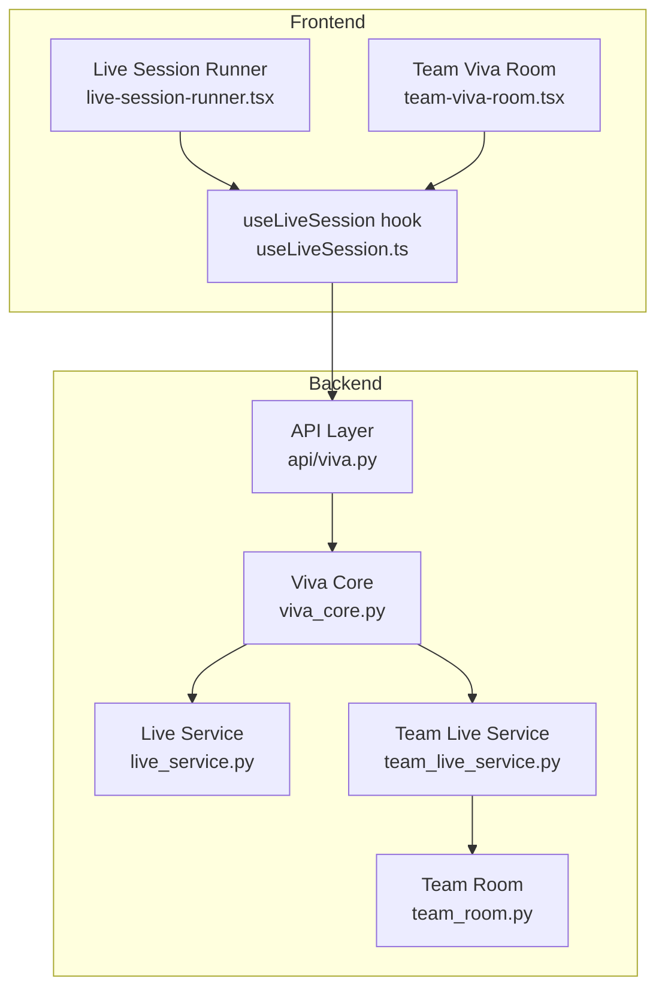
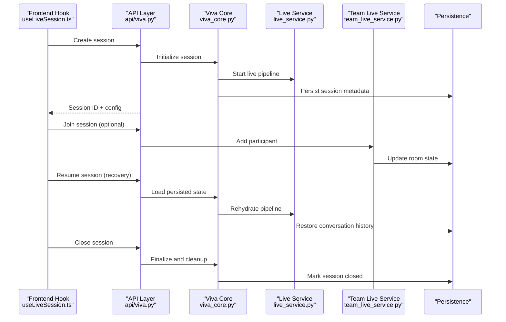
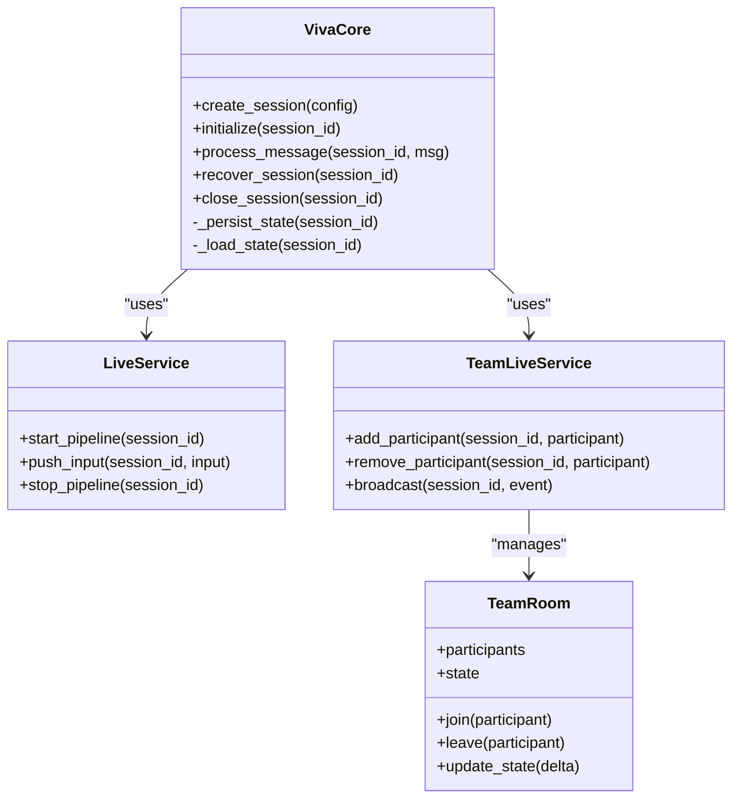
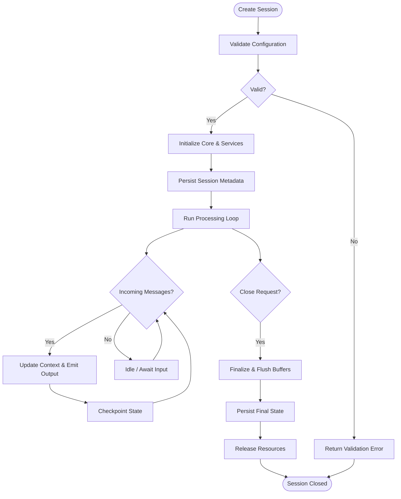
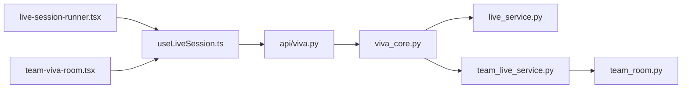

# Session Management Core

<cite>
**Referenced Files in This Document**
- [viva_core.py](file://backend/ai/viva_core.py)
- [live_service.py](file://backend/ai/live_service.py)
- [team_live_service.py](file://backend/ai/team_live_service.py)
- [team_room.py](file://backend/ai/team_room.py)
- [api_viva.py](file://backend/api/viva.py)
- [test_viva_sessions.py](file://backend/tests/test_viva_sessions.py)
- [useLiveSession.ts](file://src/lib/useLiveSession.ts)
- [live-session-runner.tsx](file://src/components/live/live-session-runner.tsx)
- [team-viva-room.tsx](file://src/components/live/team-viva-room.tsx)
</cite>

## Table of Contents
1. [Introduction](#introduction)
2. [Project Structure](#project-structure)
3. [Core Components](#core-components)
4. [Architecture Overview](#architecture-overview)
5. [Detailed Component Analysis](#detailed-component-analysis)
6. [Dependency Analysis](#dependency-analysis)
7. [Performance Considerations](#performance-considerations)
8. [Troubleshooting Guide](#troubleshooting-guide)
9. [Conclusion](#conclusion)
10. [Appendices](#appendices)

## Introduction
This document explains the session management core of the Viva Core Engine, focusing on how viva sessions are created, initialized, persisted, and cleaned up. It covers conversation flow management, context maintenance across multiple interactions, and recovery mechanisms. It also documents participant coordination for team-based sessions, resource allocation strategies, concurrency handling, memory efficiency, and data consistency considerations for distributed environments.

## Project Structure
The session management spans backend services, API endpoints, tests, and frontend hooks/components:
- Backend AI services implement session orchestration, persistence, and real-time coordination.
- API endpoints expose lifecycle operations (create, join, resume, close).
- Frontend hooks and components manage client-side session state and UI flows.

**Diagram sources**
- [viva_core.py](file://backend/ai/viva_core.py)
- [live_service.py](file://backend/ai/live_service.py)
- [team_live_service.py](file://backend/ai/team_live_service.py)
- [team_room.py](file://backend/ai/team_room.py)
- [api_viva.py](file://backend/api/viva.py)
- [useLiveSession.ts](file://src/lib/useLiveSession.ts)
- [live-session-runner.tsx](file://src/components/live/live-session-runner.tsx)
- [team-viva-room.tsx](file://src/components/live/team-viva-room.tsx)

**Section sources**
- [viva_core.py](file://backend/ai/viva_core.py)
- [live_service.py](file://backend/ai/live_service.py)
- [team_live_service.py](file://backend/ai/team_live_service.py)
- [team_room.py](file://backend/ai/team_room.py)
- [api_viva.py](file://backend/api/viva.py)
- [useLiveSession.ts](file://src/lib/useLiveSession.ts)
- [live-session-runner.tsx](file://src/components/live/live-session-runner.tsx)
- [team-viva-room.tsx](file://src/components/live/team-viva-room.tsx)

## Core Components
- Viva Core: Central orchestrator for session lifecycle, conversation state, and integration with live services.
- Live Service: Manages single-participant live sessions, including initialization, streaming, and cleanup.
- Team Live Service: Extends live capabilities to multi-participant scenarios, coordinating room state and participant events.
- Team Room: Encapsulates per-room state, participant registry, and broadcast logic.
- API Layer: Exposes REST endpoints for session creation, joining, resuming, and closing; persists session metadata.
- Frontend Hook and Components: Manage client-side session lifecycle, event subscriptions, and UI updates.

Key responsibilities:
- Lifecycle: create -> initialize -> run -> persist -> recover -> close -> cleanup.
- Conversation flow: maintain turn-taking, context windows, and message ordering.
- Persistence: durable storage of session metadata, conversation history, and configuration snapshots.
- Recovery: resume from last known state after restart or disconnect.
- Concurrency: safe concurrent access to session state and resources.
- Resource allocation: bounded buffers, backpressure, and graceful degradation.

**Section sources**
- [viva_core.py](file://backend/ai/viva_core.py)
- [live_service.py](file://backend/ai/live_service.py)
- [team_live_service.py](file://backend/ai/team_live_service.py)
- [team_room.py](file://backend/ai/team_room.py)
- [api_viva.py](file://backend/api/viva.py)
- [useLiveSession.ts](file://src/lib/useLiveSession.ts)
- [live-session-runner.tsx](file://src/components/live/live-session-runner.tsx)
- [team-viva-room.tsx](file://src/components/live/team-viva-room.tsx)

## Architecture Overview
The system follows a layered architecture:
- API layer handles HTTP requests and delegates to core services.
- Core services coordinate session state, persistence, and real-time communication.
- Frontend integrates via an SDK-like hook that wraps API calls and manages local state.

**Diagram sources**
- [api_viva.py](file://backend/api/viva.py)
- [viva_core.py](file://backend/ai/viva_core.py)
- [live_service.py](file://backend/ai/live_service.py)
- [team_live_service.py](file://backend/ai/team_live_service.py)
- [useLiveSession.ts](file://src/lib/useLiveSession.ts)

## Detailed Component Analysis

### Viva Core Orchestration
Responsibilities:
- Session factory: creates new sessions with validated configuration.
- State manager: maintains conversation context, turn order, and flags.
- Integration hub: wires live service(s), persistence, and telemetry.
- Recovery handler: restores sessions from persistent snapshots.

Lifecycle highlights:
- Initialization validates inputs, allocates resources, and seeds initial context.
- Run loop processes incoming messages, updates context, and emits outputs.
- Cleanup releases resources, flushes buffers, and writes final state.

Concurrency and safety:
- Uses internal locks around mutable session state.
- Ensures idempotent operations where possible.

Recovery:
- On startup, scans for active sessions and attempts rehydration.
- Falls back to fresh session if snapshot is inconsistent.

**Section sources**
- [viva_core.py](file://backend/ai/viva_core.py)

#### Class Relationships

**Diagram sources**
- [viva_core.py](file://backend/ai/viva_core.py)
- [live_service.py](file://backend/ai/live_service.py)
- [team_live_service.py](file://backend/ai/team_live_service.py)
- [team_room.py](file://backend/ai/team_room.py)

### Live Service (Single Participant)
Responsibilities:
- Initializes audio/text pipelines for a single participant.
- Manages input buffering, processing, and output streaming.
- Persists incremental state checkpoints during long runs.

Error handling:
- Catches upstream failures and retries with backoff.
- Emits error events to the API layer for client notification.

Resource management:
- Bounded queues for input/output to prevent unbounded growth.
- Graceful shutdown on errors or explicit close.

**Section sources**
- [live_service.py](file://backend/ai/live_service.py)

### Team Live Service and Team Room (Multi-Participant)
Responsibilities:
- Coordinates multiple participants within a session.
- Maintains room state (participants, roles, shared context).
- Broadcasts events to all participants while preserving ordering.

Coordination patterns:
- Leader-follower model for deterministic state transitions.
- Conflict resolution when participants update shared context concurrently.

Recovery:
- On reconnect, participants receive the latest room snapshot and replay missed events.

**Section sources**
- [team_live_service.py](file://backend/ai/team_live_service.py)
- [team_room.py](file://backend/ai/team_room.py)

### API Layer Endpoints
Endpoints:
- Create session: validates configuration, initializes core, returns session ID.
- Join session: adds participant to room, returns room state.
- Resume session: loads persisted state and rehydrates pipeline.
- Close session: finalizes state and triggers cleanup.

Data consistency:
- All mutations go through the core services to ensure atomicity.
- Idempotency keys for retry-safe operations.

**Section sources**
- [api_viva.py](file://backend/api/viva.py)

### Frontend Integration
Hook:
- useLiveSession encapsulates API calls, local state, and reconnection logic.
- Provides methods to start, join, send messages, and close sessions.

Components:
- Live Session Runner: orchestrates single-participant UI flow.
- Team Viva Room: renders multi-participant collaboration features.

Recovery UX:
- Auto-reconnect with exponential backoff.
- Resume from server-side state upon reload.

**Section sources**
- [useLiveSession.ts](file://src/lib/useLiveSession.ts)
- [live-session-runner.tsx](file://src/components/live/live-session-runner.tsx)
- [team-viva-room.tsx](file://src/components/live/team-viva-room.tsx)

### Session Lifecycle Flowchart

**Diagram sources**
- [viva_core.py](file://backend/ai/viva_core.py)
- [live_service.py](file://backend/ai/live_service.py)
- [team_live_service.py](file://backend/ai/team_live_service.py)
- [api_viva.py](file://backend/api/viva.py)

## Dependency Analysis
High-level dependencies:
- API depends on Viva Core for business logic.
- Viva Core depends on Live Service and Team Live Service.
- Team Live Service depends on Team Room for participant coordination.
- Frontend depends on API and uses the hook to abstract complexity.

**Diagram sources**
- [api_viva.py](file://backend/api/viva.py)
- [viva_core.py](file://backend/ai/viva_core.py)
- [live_service.py](file://backend/ai/live_service.py)
- [team_live_service.py](file://backend/ai/team_live_service.py)
- [team_room.py](file://backend/ai/team_room.py)
- [useLiveSession.ts](file://src/lib/useLiveSession.ts)
- [live-session-runner.tsx](file://src/components/live/live-session-runner.tsx)
- [team-viva-room.tsx](file://src/components/live/team-viva-room.tsx)

**Section sources**
- [api_viva.py](file://backend/api/viva.py)
- [viva_core.py](file://backend/ai/viva_core.py)
- [live_service.py](file://backend/ai/live_service.py)
- [team_live_service.py](file://backend/ai/team_live_service.py)
- [team_room.py](file://backend/ai/team_room.py)
- [useLiveSession.ts](file://src/lib/useLiveSession.ts)
- [live-session-runner.tsx](file://src/components/live/live-session-runner.tsx)
- [team-viva-room.tsx](file://src/components/live/team-viva-room.tsx)

## Performance Considerations
- Bounded buffers: Prevent unbounded memory growth by limiting queue sizes for input and output streams.
- Backpressure: Slow producers when consumers cannot keep up; drop non-critical events under load.
- Checkpointing: Periodic persistence reduces recovery time and limits data loss.
- Connection pooling: Reuse database connections and external service clients.
- Concurrency control: Use fine-grained locks around session state to minimize contention.
- Garbage collection: Explicitly release references to large objects after processing.
- Scaling: Stateless API layer behind load balancer; share session state via persistent store.

[No sources needed since this section provides general guidance]

## Troubleshooting Guide
Common issues and remedies:
- Session fails to initialize: Verify configuration schema and required fields; check logs for validation errors.
- Stalled processing loop: Inspect queue depths and backpressure signals; ensure downstream services are healthy.
- Inconsistent state after crash: Confirm checkpoint frequency and integrity checks; rehydrate from last valid snapshot.
- Multi-participant conflicts: Review conflict resolution rules and event ordering guarantees.
- Memory leaks: Monitor heap usage and object lifetimes; ensure cleanup paths execute on close.

Validation and tests:
- Unit and integration tests cover session lifecycle, persistence, and recovery scenarios.

**Section sources**
- [test_viva_sessions.py](file://backend/tests/test_viva_sessions.py)

## Conclusion
The Viva Core Engine’s session management provides a robust foundation for both single-participant and team-based viva sessions. It emphasizes clear lifecycle boundaries, durable state, and resilient recovery. With careful attention to concurrency, resource limits, and consistent APIs, it scales effectively and remains maintainable.

[No sources needed since this section summarizes without analyzing specific files]

## Appendices

### Example: Session Configuration Keys
- session_type: "single" | "team"
- max_participants: integer
- buffer_size: integer
- checkpoint_interval_seconds: number
- language: string
- prompt_template_id: string
- retention_hours: integer

[No sources needed since this section provides general guidance]

### Example: Participant Coordination Events
- participant_joined
- participant_left
- role_updated
- shared_context_delta
- session_closed

[No sources needed since this section provides general guidance]