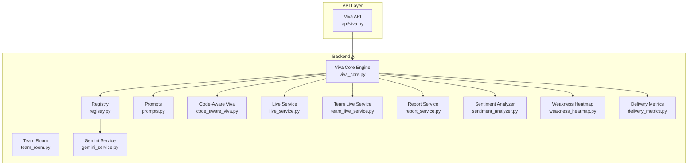
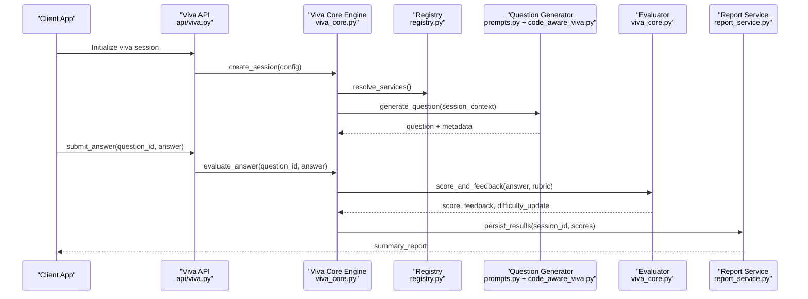
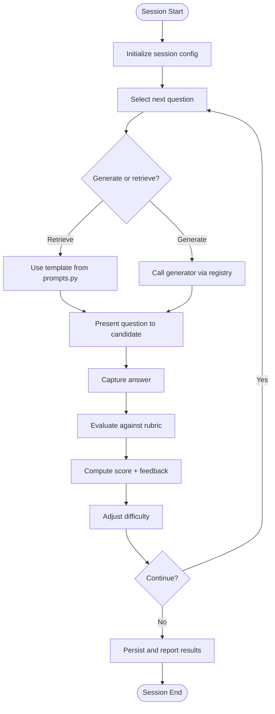
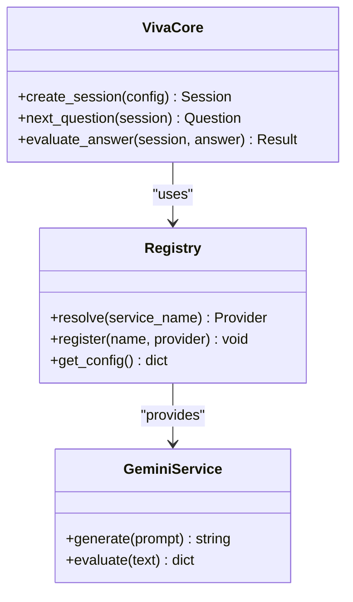
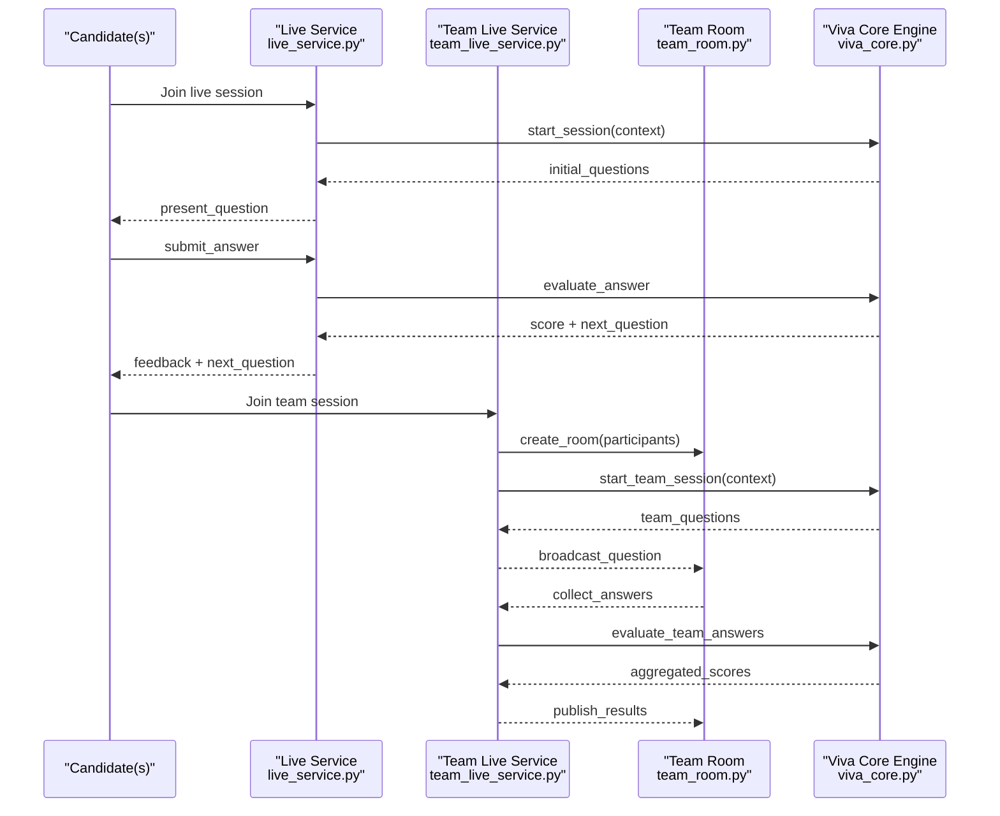
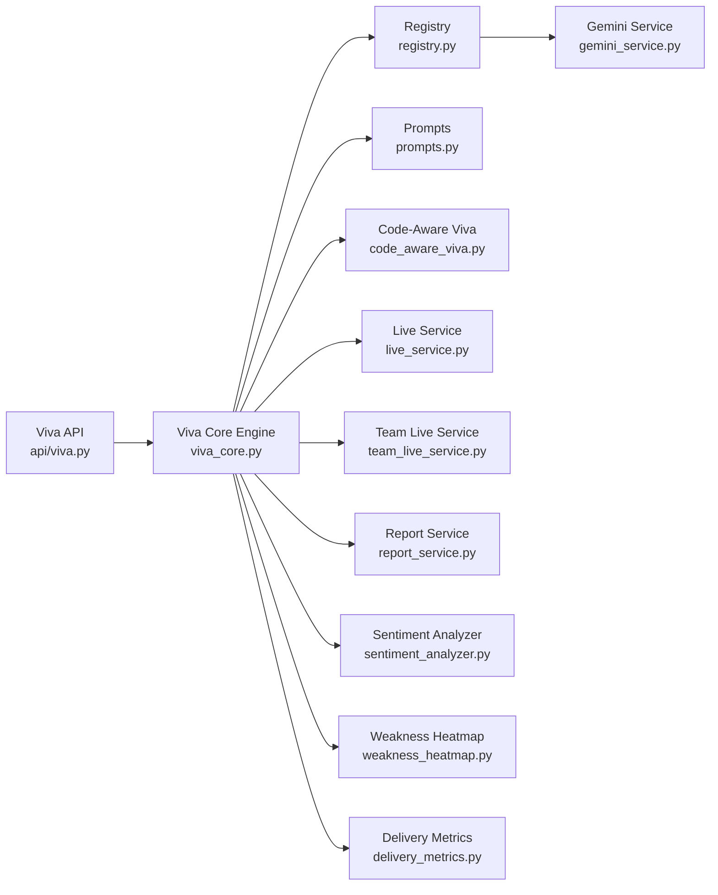

# Viva Core Engine

<cite>
**Referenced Files in This Document**
- [viva_core.py](file://backend/ai/viva_core.py)
- [registry.py](file://backend/ai/registry.py)
- [prompts.py](file://backend/ai/prompts.py)
- [code_aware_viva.py](file://backend/ai/code_aware_viva.py)
- [live_service.py](file://backend/ai/live_service.py)
- [team_live_service.py](file://backend/ai/team_live_service.py)
- [team_room.py](file://backend/ai/team_room.py)
- [gemini_service.py](file://backend/ai/gemini_service.py)
- [report_service.py](file://backend/ai/report_service.py)
- [sentiment_analyzer.py](file://backend/ai/sentiment_analyzer.py)
- [weakness_heatmap.py](file://backend/ai/weakness_heatmap.py)
- [delivery_metrics.py](file://backend/ai/delivery_metrics.py)
- [api_viva.py](file://backend/api/viva.py)
- [test_viva_sessions.py](file://backend/tests/test_viva_sessions.py)
</cite>

## Table of Contents
1. [Introduction](#introduction)
2. [Project Structure](#project-structure)
3. [Core Components](#core-components)
4. [Architecture Overview](#architecture-overview)
5. [Detailed Component Analysis](#detailed-component-analysis)
6. [Dependency Analysis](#dependency-analysis)
7. [Performance Considerations](#performance-considerations)
8. [Troubleshooting Guide](#troubleshooting-guide)
9. [Conclusion](#conclusion)
10. [Appendices](#appendices)

## Introduction
This document provides comprehensive documentation for the Viva Core Engine, the primary examination and assessment system within the platform. It explains how viva sessions are initialized, how questions are generated and adapted, how answers are evaluated, and how results are scored and reported. It also covers prompt engineering strategies, conversation flow management, integration with the registry system, and coordination with other AI services to enhance assessment capabilities.

## Project Structure
The Viva Core Engine is implemented primarily under backend/ai with supporting API endpoints under backend/api. Key modules include:
- Core engine and session orchestration
- Prompt templates and generation strategies
- Adaptive difficulty and evaluation logic
- Integration with external AI services via a registry
- Live and team-based viva flows
- Reporting, sentiment analysis, and metrics

**Diagram sources**
- [viva_core.py](file://backend/ai/viva_core.py)
- [registry.py](file://backend/ai/registry.py)
- [prompts.py](file://backend/ai/prompts.py)
- [code_aware_viva.py](file://backend/ai/code_aware_viva.py)
- [live_service.py](file://backend/ai/live_service.py)
- [team_live_service.py](file://backend/ai/team_live_service.py)
- [team_room.py](file://backend/ai/team_room.py)
- [gemini_service.py](file://backend/ai/gemini_service.py)
- [report_service.py](file://backend/ai/report_service.py)
- [sentiment_analyzer.py](file://backend/ai/sentiment_analyzer.py)
- [weakness_heatmap.py](file://backend/ai/weakness_heatmap.py)
- [delivery_metrics.py](file://backend/ai/delivery_metrics.py)
- [api_viva.py](file://backend/api/viva.py)

**Section sources**
- [viva_core.py](file://backend/ai/viva_core.py)
- [registry.py](file://backend/ai/registry.py)
- [prompts.py](file://backend/ai/prompts.py)
- [code_aware_viva.py](file://backend/ai/code_aware_viva.py)
- [live_service.py](file://backend/ai/live_service.py)
- [team_live_service.py](file://backend/ai/team_live_service.py)
- [team_room.py](file://backend/ai/team_room.py)
- [gemini_service.py](file://backend/ai/gemini_service.py)
- [report_service.py](file://backend/ai/report_service.py)
- [sentiment_analyzer.py](file://backend/ai/sentiment_analyzer.py)
- [weakness_heatmap.py](file://backend/ai/weakness_heatmap.py)
- [delivery_metrics.py](file://backend/ai/delivery_metrics.py)
- [api_viva.py](file://backend/api/viva.py)

## Core Components
- Viva Core Engine: Orchestrates session lifecycle, question generation, adaptive difficulty, answer evaluation, scoring, and reporting.
- Registry: Centralized service discovery and configuration for AI providers and tools used by the engine.
- Prompts: Curated prompt templates and strategies for different viva modes (e.g., code-aware, live, team).
- Code-Aware Viva: Specialized module that integrates code context into questioning and evaluation.
- Live and Team Services: Manage real-time interactions, room state, and multi-participant dynamics.
- Supporting Services: Gemini integration, report generation, sentiment analysis, weakness heatmap, and delivery metrics.

Key responsibilities:
- Session initialization and configuration
- Question selection and generation based on domain, difficulty, and prior performance
- Answer capture and evaluation against rubrics or model criteria
- Adaptive difficulty adjustment using performance signals
- Aggregation and reporting of scores, strengths, and weaknesses

**Section sources**
- [viva_core.py](file://backend/ai/viva_core.py)
- [registry.py](file://backend/ai/registry.py)
- [prompts.py](file://backend/ai/prompts.py)
- [code_aware_viva.py](file://backend/ai/code_aware_viva.py)
- [live_service.py](file://backend/ai/live_service.py)
- [team_live_service.py](file://backend/ai/team_live_service.py)
- [team_room.py](file://backend/ai/team_room.py)
- [gemini_service.py](file://backend/ai/gemini_service.py)
- [report_service.py](file://backend/ai/report_service.py)
- [sentiment_analyzer.py](file://backend/ai/sentiment_analyzer.py)
- [weakness_heatmap.py](file://backend/ai/weakness_heatmap.py)
- [delivery_metrics.py](file://backend/ai/delivery_metrics.py)

## Architecture Overview
The Viva Core Engine coordinates multiple AI services through a registry to deliver adaptive assessments. The API layer exposes endpoints to initialize sessions, drive conversations, evaluate responses, and retrieve reports.

**Diagram sources**
- [api_viva.py](file://backend/api/viva.py)
- [viva_core.py](file://backend/ai/viva_core.py)
- [registry.py](file://backend/ai/registry.py)
- [prompts.py](file://backend/ai/prompts.py)
- [code_aware_viva.py](file://backend/ai/code_aware_viva.py)
- [report_service.py](file://backend/ai/report_service.py)

## Detailed Component Analysis

### Viva Core Engine
Responsibilities:
- Session lifecycle: creation, progression, termination
- Question pipeline: retrieval, generation, adaptation
- Evaluation pipeline: rubric application, scoring, feedback
- Difficulty adaptation: dynamic adjustment based on performance signals
- Result aggregation: persistence and reporting

Adaptive difficulty mechanism:
- Tracks per-question and per-topic performance
- Adjusts next question difficulty using performance deltas and confidence thresholds
- Incorporates time-to-answer and error patterns

Evaluation logic:
- Applies rubric dimensions (accuracy, completeness, clarity, reasoning)
- Produces numeric scores and qualitative feedback
- Flags knowledge gaps for targeted follow-up

**Diagram sources**
- [viva_core.py](file://backend/ai/viva_core.py)
- [prompts.py](file://backend/ai/prompts.py)
- [registry.py](file://backend/ai/registry.py)

**Section sources**
- [viva_core.py](file://backend/ai/viva_core.py)

### Registry System
Purpose:
- Centralizes service discovery and configuration for AI providers
- Provides consistent interfaces for calling generators, evaluators, and analytics
- Manages environment-specific settings and fallbacks

Integration points:
- Resolves Gemini service for content generation
- Exposes evaluators and analytics modules
- Supports pluggable providers for extensibility

**Diagram sources**
- [registry.py](file://backend/ai/registry.py)
- [gemini_service.py](file://backend/ai/gemini_service.py)
- [viva_core.py](file://backend/ai/viva_core.py)

**Section sources**
- [registry.py](file://backend/ai/registry.py)
- [gemini_service.py](file://backend/ai/gemini_service.py)

### Prompt Engineering Strategies
Strategies:
- Template-driven prompts for standardized question formats
- Context injection for domain-specific scenarios
- Dynamic constraints to control difficulty and focus areas
- Feedback-oriented prompts to elicit structured answers

Modes:
- Standard viva prompts
- Code-aware prompts integrating code snippets and repositories
- Live and team prompts tailored for collaborative assessment

**Section sources**
- [prompts.py](file://backend/ai/prompts.py)
- [code_aware_viva.py](file://backend/ai/code_aware_viva.py)

### Code-Aware Viva
Capabilities:
- Ingests code context (files, diffs, repository structure)
- Generates questions tied to actual code artifacts
- Evaluates answers against implementation details and best practices
- Provides actionable feedback linked to specific code locations

Workflow:
- Parse and index code context
- Map topics to relevant code segments
- Generate contextual questions and evaluate responses

**Section sources**
- [code_aware_viva.py](file://backend/ai/code_aware_viva.py)

### Live and Team Services
Live Service:
- Manages single-candidate live sessions
- Streams questions and captures answers in real time
- Coordinates with core engine for adaptive progression

Team Live Service:
- Facilitates multi-participant sessions
- Manages turn-taking, shared context, and group evaluations
- Integrates with team room state for synchronized interaction

Team Room:
- Maintains room state, participant roles, and shared artifacts
- Handles messaging and event broadcasting

**Diagram sources**
- [live_service.py](file://backend/ai/live_service.py)
- [team_live_service.py](file://backend/ai/team_live_service.py)
- [team_room.py](file://backend/ai/team_room.py)
- [viva_core.py](file://backend/ai/viva_core.py)

**Section sources**
- [live_service.py](file://backend/ai/live_service.py)
- [team_live_service.py](file://backend/ai/team_live_service.py)
- [team_room.py](file://backend/ai/team_room.py)

### Reporting, Sentiment, Weakness Heatmap, and Delivery Metrics
- Report Service: Aggregates scores, feedback, and session metadata into structured reports
- Sentiment Analyzer: Analyzes tone and confidence from responses to enrich evaluation
- Weakness Heatmap: Identifies topic-level gaps and visualizes areas needing improvement
- Delivery Metrics: Measures response timing, fluency, and engagement indicators

These components integrate with the core engine to provide holistic assessment insights.

**Section sources**
- [report_service.py](file://backend/ai/report_service.py)
- [sentiment_analyzer.py](file://backend/ai/sentiment_analyzer.py)
- [weakness_heatmap.py](file://backend/ai/weakness_heatmap.py)
- [delivery_metrics.py](file://backend/ai/delivery_metrics.py)

## Dependency Analysis
The Viva Core Engine depends on the registry to resolve AI services, prompts for question generation, and specialized modules for code-aware and live/team scenarios. External services like Gemini are accessed through the registry abstraction.

**Diagram sources**
- [api_viva.py](file://backend/api/viva.py)
- [viva_core.py](file://backend/ai/viva_core.py)
- [registry.py](file://backend/ai/registry.py)
- [prompts.py](file://backend/ai/prompts.py)
- [code_aware_viva.py](file://backend/ai/code_aware_viva.py)
- [live_service.py](file://backend/ai/live_service.py)
- [team_live_service.py](file://backend/ai/team_live_service.py)
- [report_service.py](file://backend/ai/report_service.py)
- [sentiment_analyzer.py](file://backend/ai/sentiment_analyzer.py)
- [weakness_heatmap.py](file://backend/ai/weakness_heatmap.py)
- [delivery_metrics.py](file://backend/ai/delivery_metrics.py)
- [gemini_service.py](file://backend/ai/gemini_service.py)

**Section sources**
- [api_viva.py](file://backend/api/viva.py)
- [viva_core.py](file://backend/ai/viva_core.py)
- [registry.py](file://backend/ai/registry.py)

## Performance Considerations
- Caching frequently used prompts and templates to reduce latency
- Batched evaluation where possible to minimize external calls
- Streaming responses for live sessions to improve perceived responsiveness
- Efficient indexing of code context for faster question generation in code-aware mode
- Asynchronous processing for non-blocking operations such as report generation and sentiment analysis

[No sources needed since this section provides general guidance]

## Troubleshooting Guide
Common issues and resolutions:
- Session initialization failures: Validate configuration passed to the core engine; ensure registry can resolve required services
- Question generation errors: Check prompt templates and context availability; verify external service connectivity
- Evaluation inconsistencies: Review rubric definitions and scoring thresholds; inspect answer preprocessing steps
- Live/session timeouts: Increase timeouts for long-running operations; monitor network latency to external services
- Reporting discrepancies: Confirm data persistence and aggregation logic; validate input schemas for analytics modules

**Section sources**
- [test_viva_sessions.py](file://backend/tests/test_viva_sessions.py)

## Conclusion
The Viva Core Engine delivers a robust, adaptive assessment system that integrates seamlessly with AI services through a centralized registry. Its modular design supports diverse viva modes, including code-aware and team-based assessments, while providing comprehensive reporting and analytics. By leveraging prompt engineering, adaptive difficulty, and multi-service coordination, the engine enables high-quality, scalable examinations and evaluations.

[No sources needed since this section summarizes without analyzing specific files]

## Appendices
- Example viva session initialization: Create a session via the API with appropriate configuration, then proceed to question progression and result analysis as orchestrated by the core engine.
- Question progression: Follow the adaptive loop of selecting, generating, evaluating, and adjusting difficulty based on performance signals.
- Result analysis: Use the report service and analytics modules to interpret scores, identify weaknesses, and derive actionable insights.

[No sources needed since this section provides conceptual guidance]