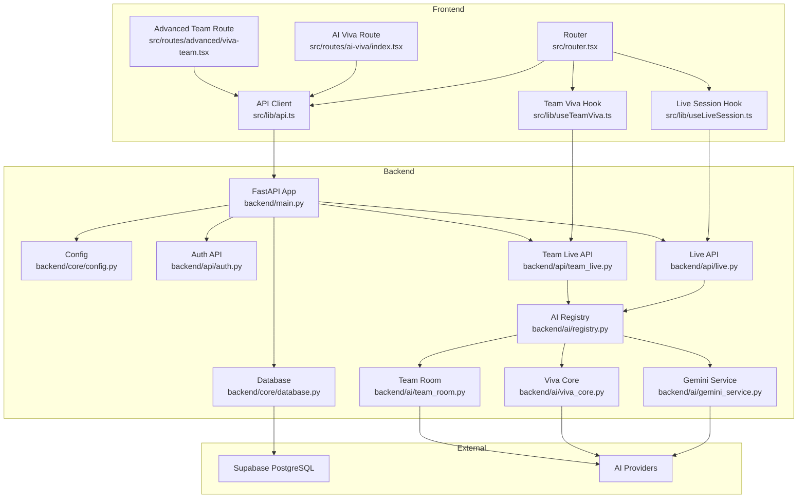
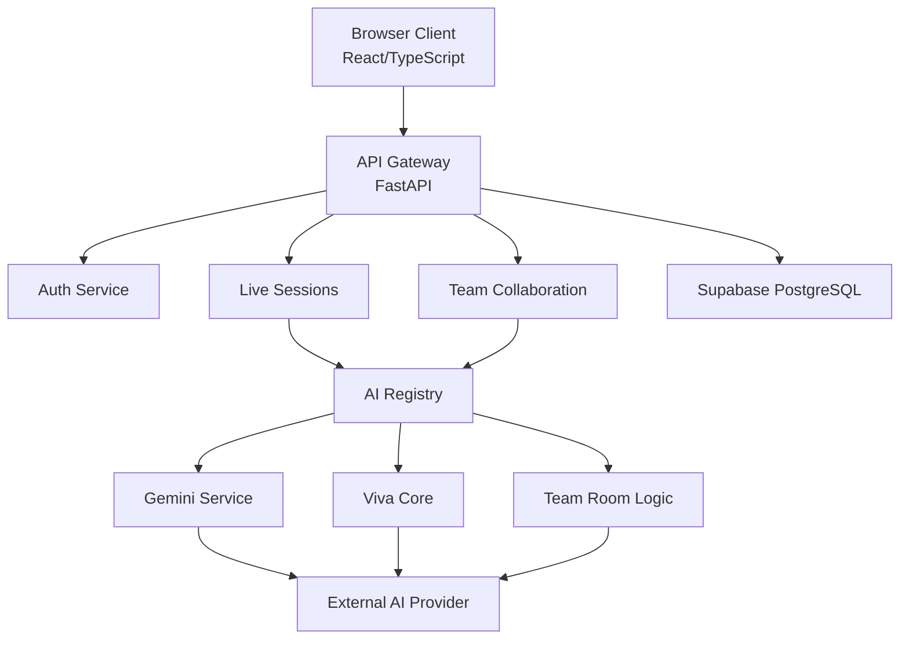
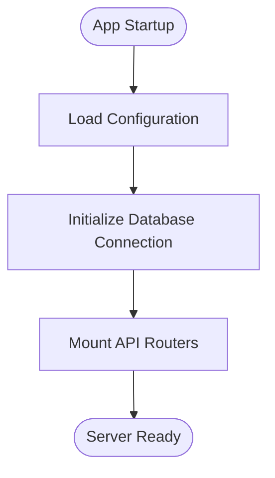
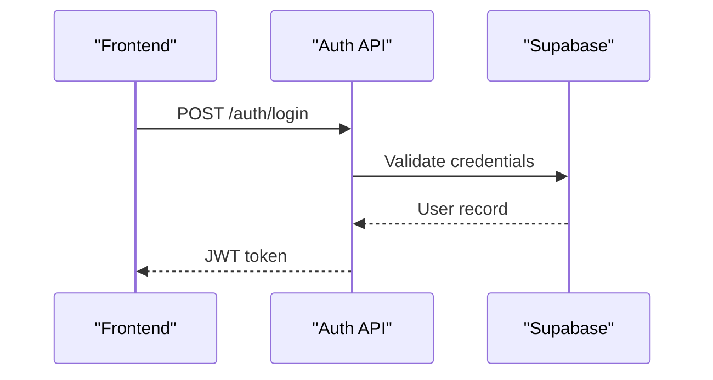
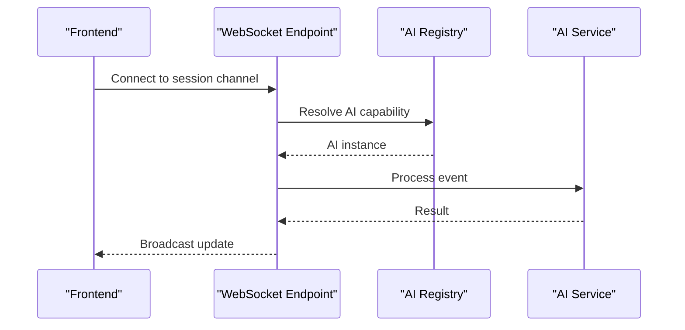
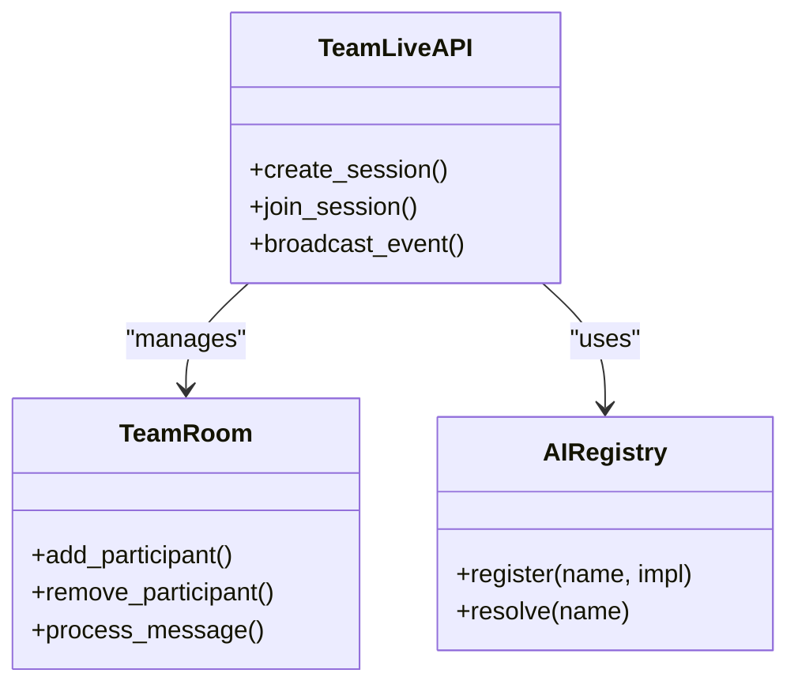
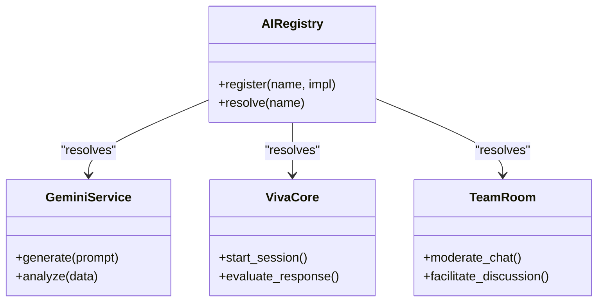
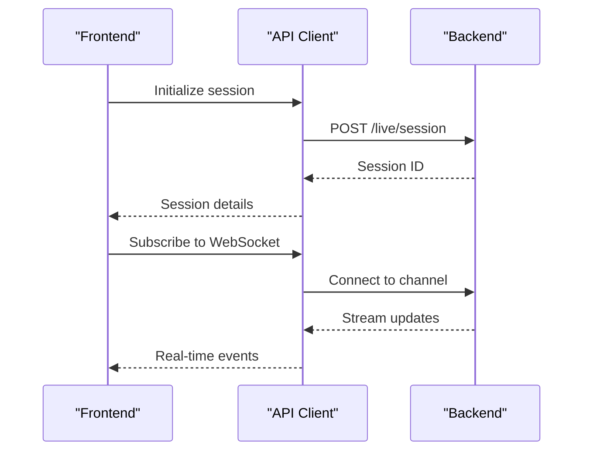
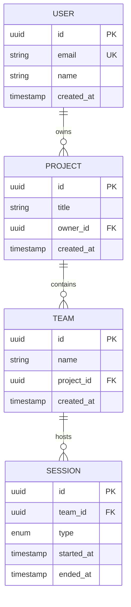
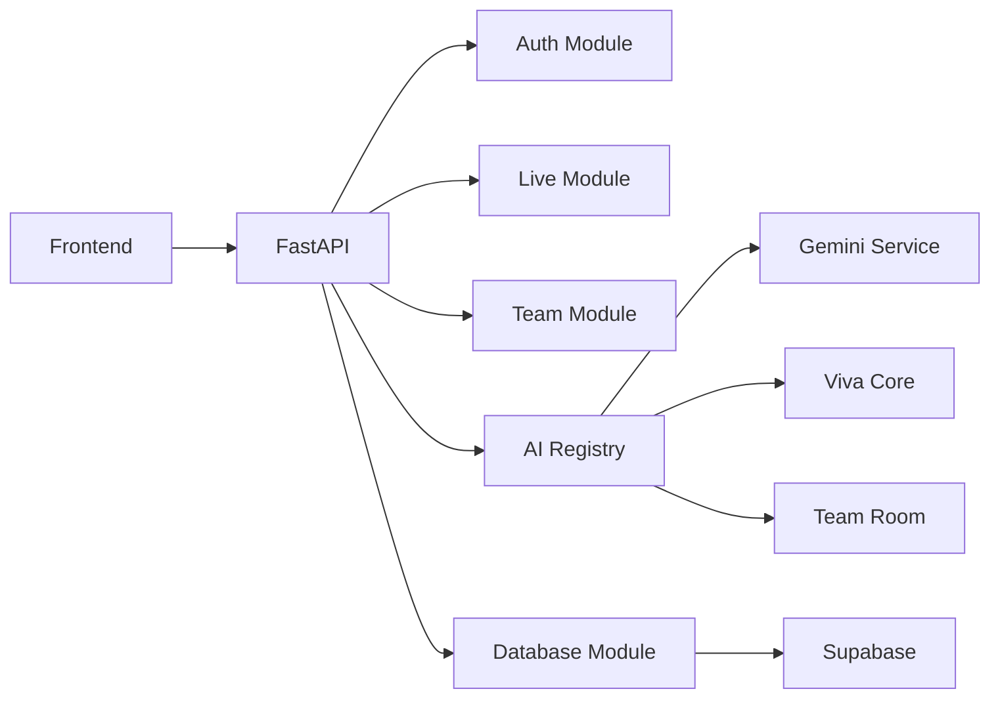

# Architecture Overview

<cite>
**Referenced Files in This Document**
- [main.py](file://backend/main.py)
- [core/config.py](file://backend/core/config.py)
- [core/database.py](file://backend/core/database.py)
- [api/auth.py](file://backend/api/auth.py)
- [api/live.py](file://backend/api/live.py)
- [api/team_live.py](file://backend/api/team_live.py)
- [ai/registry.py](file://backend/ai/registry.py)
- [ai/gemini_service.py](file://backend/ai/gemini_service.py)
- [ai/viva_core.py](file://backend/ai/viva_core.py)
- [ai/team_room.py](file://backend/ai/team_room.py)
- [supabase_schema.sql](file://backend/supabase_schema.sql)
- [src/router.tsx](file://src/router.tsx)
- [src/lib/api.ts](file://src/lib/api.ts)
- [src/lib/useLiveSession.ts](file://src/lib/useLiveSession.ts)
- [src/lib/useTeamViva.ts](file://src/lib/useTeamViva.ts)
- [src/routes/ai-viva/index.tsx](file://src/routes/ai-viva/index.tsx)
- [src/routes/advanced/viva-team.tsx](file://src/routes/advanced/viva-team.tsx)
</cite>

## Table of Contents
1. [Introduction](#introduction)
2. [Project Structure](#project-structure)
3. [Core Components](#core-components)
4. [Architecture Overview](#architecture-overview)
5. [Detailed Component Analysis](#detailed-component-analysis)
6. [Dependency Analysis](#dependency-analysis)
7. [Performance Considerations](#performance-considerations)
8. [Troubleshooting Guide](#troubleshooting-guide)
9. [Conclusion](#conclusion)

## Introduction
This document presents the high-level architecture of the Horux platform, a full-stack application combining a React/TypeScript frontend with a FastAPI Python backend, Supabase PostgreSQL for persistence, and multiple AI service integrations. The system emphasizes real-time collaboration via WebSockets, modular AI capabilities through a registry pattern, and scalable microservice-style boundaries between API routes, services, and AI components. It also outlines deployment topology, scalability considerations, and infrastructure requirements to support interactive live sessions, team-based workflows, and AI-driven features.

## Project Structure
The repository is organized into two primary layers:
- Frontend (React/TypeScript): Routes, UI components, hooks, and API clients reside under src/.
- Backend (FastAPI): API endpoints, core configuration, database access, AI services, and migrations are under backend/.

Key architectural elements:
- Frontend routing and state management drive user interactions and data fetching.
- Backend exposes REST APIs and WebSocket endpoints for real-time collaboration.
- AI services are encapsulated as pluggable modules registered via a central registry.
- Database schema and migrations define persistent entities and relationships.

**Diagram sources**
- [src/router.tsx](file://src/router.tsx)
- [src/lib/api.ts](file://src/lib/api.ts)
- [src/lib/useLiveSession.ts](file://src/lib/useLiveSession.ts)
- [src/lib/useTeamViva.ts](file://src/lib/useTeamViva.ts)
- [src/routes/ai-viva/index.tsx](file://src/routes/ai-viva/index.tsx)
- [src/routes/advanced/viva-team.tsx](file://src/routes/advanced/viva-team.tsx)
- [backend/main.py](file://backend/main.py)
- [backend/core/config.py](file://backend/core/config.py)
- [backend/core/database.py](file://backend/core/database.py)
- [backend/api/auth.py](file://backend/api/auth.py)
- [backend/api/live.py](file://backend/api/live.py)
- [backend/api/team_live.py](file://backend/api/team_live.py)
- [backend/ai/registry.py](file://backend/ai/registry.py)
- [backend/ai/gemini_service.py](file://backend/ai/gemini_service.py)
- [backend/ai/viva_core.py](file://backend/ai/viva_core.py)
- [backend/ai/team_room.py](file://backend/ai/team_room.py)

**Section sources**
- [src/router.tsx](file://src/router.tsx)
- [backend/main.py](file://backend/main.py)

## Core Components
- Frontend Router and API Client: Centralized routing and HTTP/WebSocket client abstraction for calling backend endpoints and managing real-time sessions.
- Backend FastAPI Application: Configures middleware, dependency injection, and mounts API routers for auth, live sessions, and team collaboration.
- Database Layer: Encapsulates connection management and query helpers over Supabase PostgreSQL.
- AI Registry: Provides a centralized registry to discover and invoke AI services dynamically based on feature flags or session context.
- Real-Time Collaboration: WebSocket endpoints for live sessions and team rooms enabling multi-user interaction.

Key responsibilities:
- API endpoints expose CRUD operations and orchestrate AI calls.
- AI services implement specific capabilities (e.g., Gemini integration, viva analysis, team room logic).
- Real-time channels broadcast updates to connected clients.

**Section sources**
- [backend/main.py](file://backend/main.py)
- [backend/core/config.py](file://backend/core/config.py)
- [backend/core/database.py](file://backend/core/database.py)
- [backend/api/auth.py](file://backend/api/auth.py)
- [backend/api/live.py](file://backend/api/live.py)
- [backend/api/team_live.py](file://backend/api/team_live.py)
- [backend/ai/registry.py](file://backend/ai/registry.py)
- [backend/ai/gemini_service.py](file://backend/ai/gemini_service.py)
- [backend/ai/viva_core.py](file://backend/ai/viva_core.py)
- [backend/ai/team_room.py](file://backend/ai/team_room.py)

## Architecture Overview
Horux follows a layered architecture:
- Presentation layer (React/TypeScript) renders UI and manages client-side state.
- API gateway (FastAPI) handles authentication, request validation, and orchestrates business logic.
- Services layer includes domain services and AI service abstractions.
- Data layer persists state to Supabase PostgreSQL.
- External providers include AI model APIs and optional third-party services.

**Diagram sources**
- [backend/main.py](file://backend/main.py)
- [backend/api/auth.py](file://backend/api/auth.py)
- [backend/api/live.py](file://backend/api/live.py)
- [backend/api/team_live.py](file://backend/api/team_live.py)
- [backend/ai/registry.py](file://backend/ai/registry.py)
- [backend/ai/gemini_service.py](file://backend/ai/gemini_service.py)
- [backend/ai/viva_core.py](file://backend/ai/viva_core.py)
- [backend/ai/team_room.py](file://backend/ai/team_room.py)
- [backend/core/database.py](file://backend/core/database.py)

## Detailed Component Analysis

### FastAPI Application and Configuration
- Initializes the FastAPI app, registers routers, and configures middleware.
- Loads environment-specific configuration and sets up logging.
- Mounts API modules for auth, live sessions, and team collaboration.

**Diagram sources**
- [backend/main.py](file://backend/main.py)
- [backend/core/config.py](file://backend/core/config.py)
- [backend/core/database.py](file://backend/core/database.py)

**Section sources**
- [backend/main.py](file://backend/main.py)
- [backend/core/config.py](file://backend/core/config.py)
- [backend/core/database.py](file://backend/core/database.py)

### Authentication API
- Handles user registration, login, and token issuance.
- Integrates with Supabase for identity management and session handling.
- Protects routes via middleware and dependency injection.

**Diagram sources**
- [backend/api/auth.py](file://backend/api/auth.py)
- [backend/core/database.py](file://backend/core/database.py)

**Section sources**
- [backend/api/auth.py](file://backend/api/auth.py)

### Live Sessions API and Real-Time Collaboration
- Exposes REST endpoints to create/manage live sessions.
- Implements WebSocket channels for real-time updates during sessions.
- Coordinates with AI services to generate insights and prompts.

**Diagram sources**
- [backend/api/live.py](file://backend/api/live.py)
- [backend/ai/registry.py](file://backend/ai/registry.py)
- [backend/ai/gemini_service.py](file://backend/ai/gemini_service.py)

**Section sources**
- [backend/api/live.py](file://backend/api/live.py)

### Team Live API and Team Room Logic
- Manages multi-user team sessions with shared state and collaborative features.
- Uses AI-driven moderation and facilitation within team rooms.
- Persists session events and outcomes to the database.

**Diagram sources**
- [backend/api/team_live.py](file://backend/api/team_live.py)
- [backend/ai/team_room.py](file://backend/ai/team_room.py)
- [backend/ai/registry.py](file://backend/ai/registry.py)

**Section sources**
- [backend/api/team_live.py](file://backend/api/team_live.py)
- [backend/ai/team_room.py](file://backend/ai/team_room.py)

### AI Service Registry and Implementations
- Central registry enables dynamic discovery and invocation of AI services.
- Supports multiple providers (e.g., Gemini) and custom implementations (viva core, team room logic).
- Facilitates testing and swapping providers without changing upstream code.

**Diagram sources**
- [backend/ai/registry.py](file://backend/ai/registry.py)
- [backend/ai/gemini_service.py](file://backend/ai/gemini_service.py)
- [backend/ai/viva_core.py](file://backend/ai/viva_core.py)
- [backend/ai/team_room.py](file://backend/ai/team_room.py)

**Section sources**
- [backend/ai/registry.py](file://backend/ai/registry.py)
- [backend/ai/gemini_service.py](file://backend/ai/gemini_service.py)
- [backend/ai/viva_core.py](file://backend/ai/viva_core.py)
- [backend/ai/team_room.py](file://backend/ai/team_room.py)

### Frontend Integration and Hooks
- Router defines application routes and lazy-loading strategies.
- API client abstracts HTTP requests and error handling.
- Hooks manage live session lifecycle and team viva interactions.

**Diagram sources**
- [src/router.tsx](file://src/router.tsx)
- [src/lib/api.ts](file://src/lib/api.ts)
- [src/lib/useLiveSession.ts](file://src/lib/useLiveSession.ts)
- [src/lib/useTeamViva.ts](file://src/lib/useTeamViva.ts)

**Section sources**
- [src/router.tsx](file://src/router.tsx)
- [src/lib/api.ts](file://src/lib/api.ts)
- [src/lib/useLiveSession.ts](file://src/lib/useLiveSession.ts)
- [src/lib/useTeamViva.ts](file://src/lib/useTeamViva.ts)

### Database Schema and Persistence
- Defines tables, relationships, and constraints for users, projects, teams, sessions, and AI artifacts.
- Migrations evolve schema over time while maintaining backward compatibility.

**Diagram sources**
- [backend/supabase_schema.sql](file://backend/supabase_schema.sql)

**Section sources**
- [backend/supabase_schema.sql](file://backend/supabase_schema.sql)

## Dependency Analysis
The system exhibits clear separation of concerns:
- Frontend depends on backend APIs and external AI providers indirectly through the backend.
- Backend decouples AI implementations via the registry, reducing coupling.
- Database access is isolated behind a dedicated module.

**Diagram sources**
- [backend/main.py](file://backend/main.py)
- [backend/api/auth.py](file://backend/api/auth.py)
- [backend/api/live.py](file://backend/api/live.py)
- [backend/api/team_live.py](file://backend/api/team_live.py)
- [backend/ai/registry.py](file://backend/ai/registry.py)
- [backend/ai/gemini_service.py](file://backend/ai/gemini_service.py)
- [backend/ai/viva_core.py](file://backend/ai/viva_core.py)
- [backend/ai/team_room.py](file://backend/ai/team_room.py)
- [backend/core/database.py](file://backend/core/database.py)

**Section sources**
- [backend/main.py](file://backend/main.py)
- [backend/ai/registry.py](file://backend/ai/registry.py)

## Performance Considerations
- Use connection pooling for database queries to handle concurrent requests efficiently.
- Cache frequently accessed AI responses where appropriate to reduce latency and cost.
- Implement rate limiting on AI provider calls to prevent throttling and ensure fairness.
- Optimize WebSocket message payloads by batching updates and using efficient serialization.
- Scale horizontally by deploying multiple backend instances behind a load balancer.

[No sources needed since this section provides general guidance]

## Troubleshooting Guide
Common issues and resolutions:
- Authentication failures: Verify Supabase credentials and token expiration handling.
- WebSocket disconnects: Check network policies and server heartbeat mechanisms.
- AI provider errors: Inspect API keys, quotas, and error responses from external services.
- Database connectivity: Ensure correct connection strings and firewall rules for Supabase.

**Section sources**
- [backend/core/config.py](file://backend/core/config.py)
- [backend/core/database.py](file://backend/core/database.py)

## Conclusion
Horux’s architecture combines a modern React/TypeScript frontend with a robust FastAPI backend, leveraging Supabase PostgreSQL for persistence and a flexible AI registry for extensible intelligence. Real-time collaboration is achieved through WebSockets, while microservice-style boundaries enable independent scaling and evolution of AI components. The design supports scalability, maintainability, and adaptability to new AI providers and features.

[No sources needed since this section summarizes without analyzing specific files]