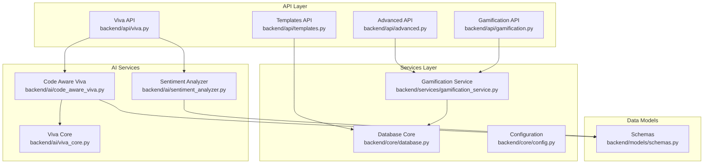
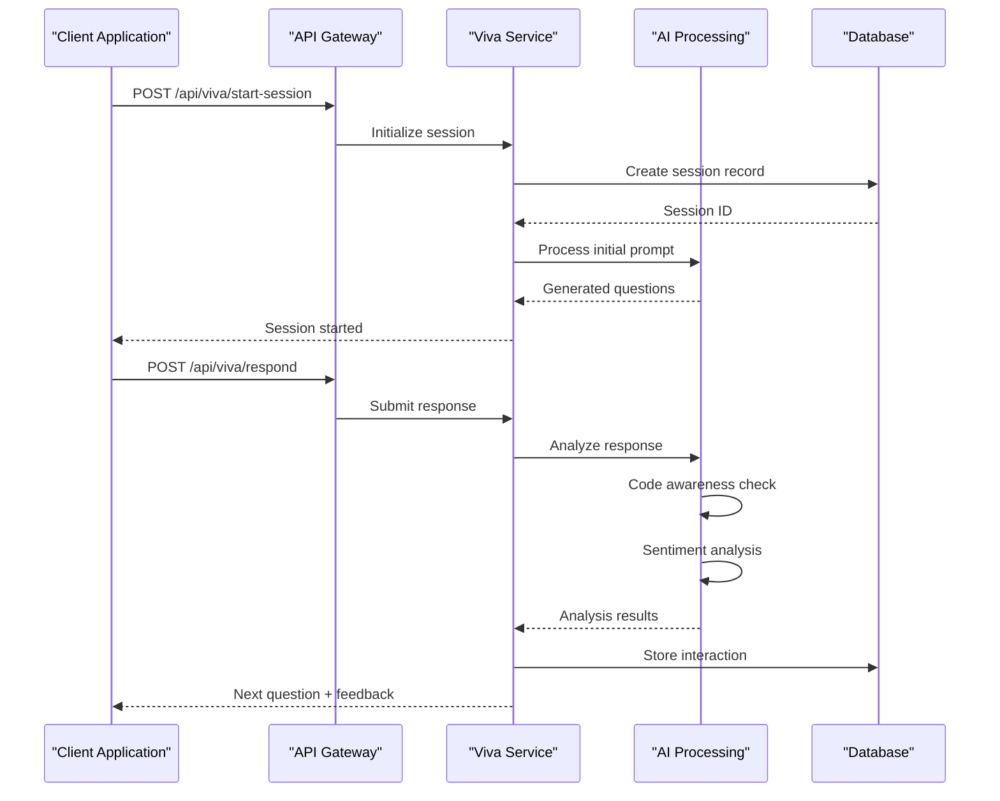
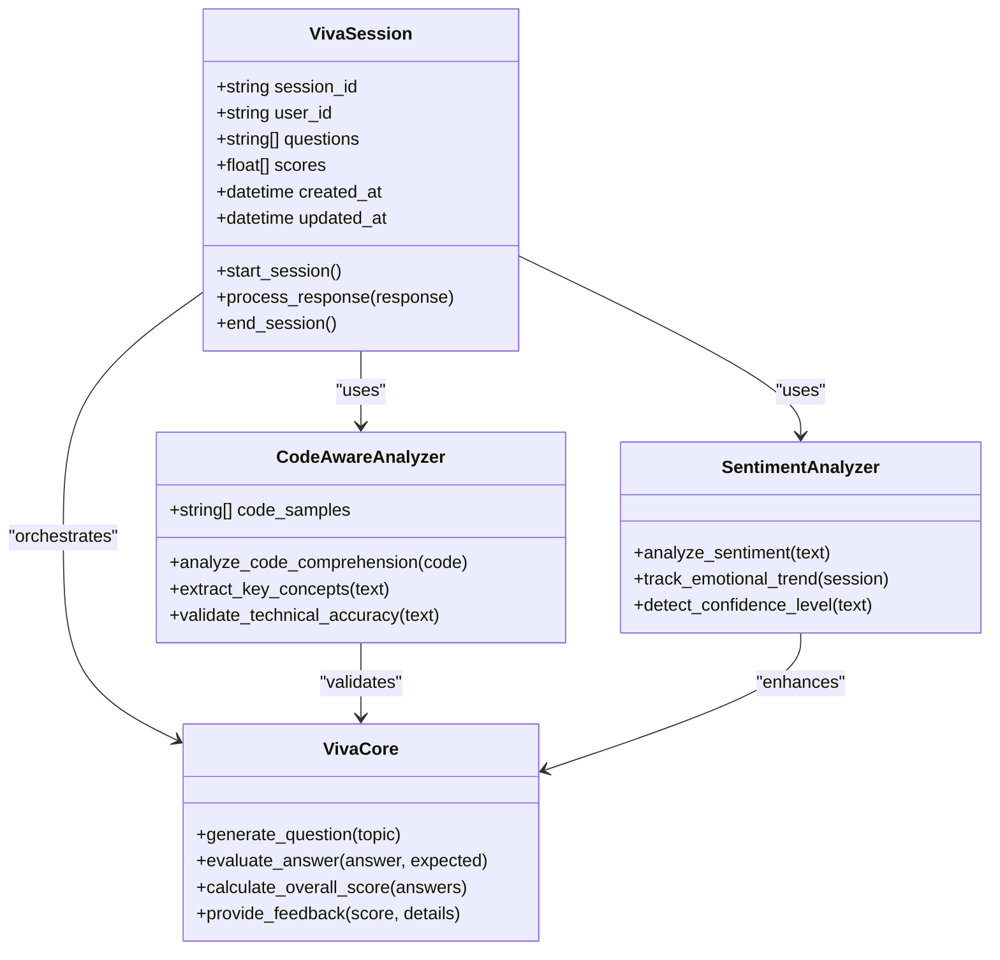
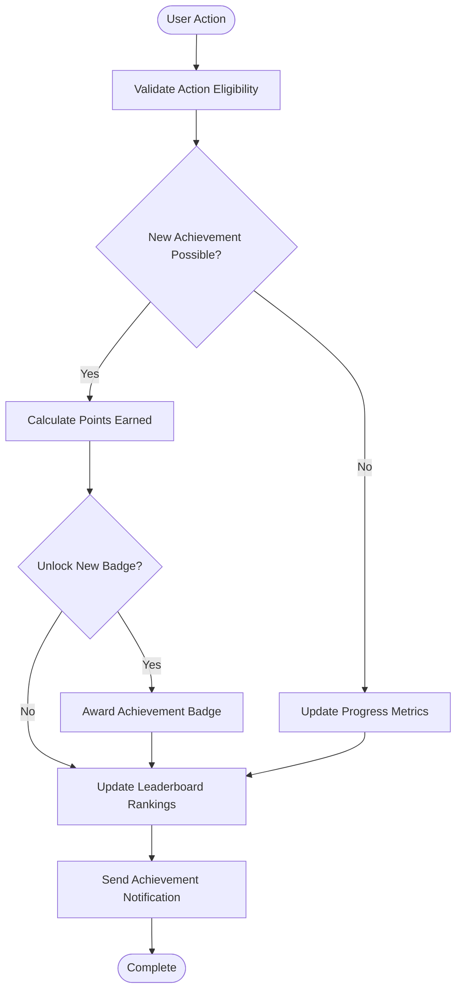
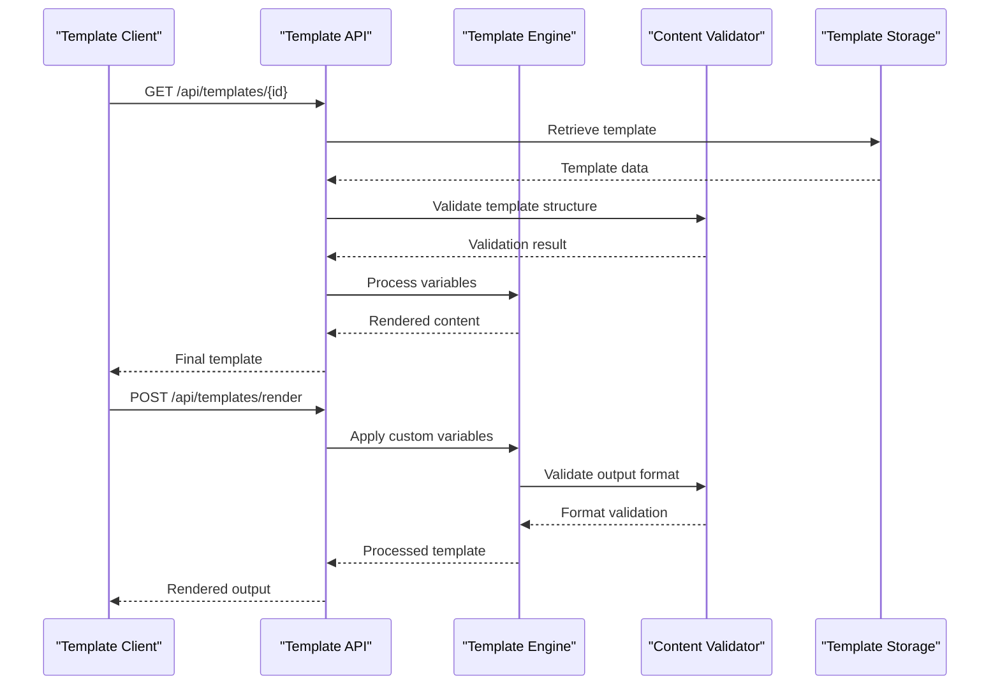
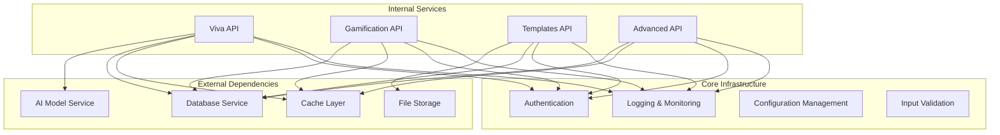

# Advanced Features API

<cite>
**Referenced Files in This Document**
- [backend/api/advanced.py](file://backend/api/advanced.py)
- [backend/api/gamification.py](file://backend/api/gamification.py)
- [backend/api/templates.py](file://backend/api/templates.py)
- [backend/api/viva.py](file://backend/api/viva.py)
- [backend/services/gamification_service.py](file://backend/services/gamification_service.py)
- [backend/ai/code_aware_viva.py](file://backend/ai/code_aware_viva.py)
- [backend/ai/sentiment_analyzer.py](file://backend/ai/sentiment_analyzer.py)
- [backend/ai/viva_core.py](file://backend/ai/viva_core.py)
- [backend/models/schemas.py](file://backend/models/schemas.py)
- [backend/core/config.py](file://backend/core/config.py)
- [backend/core/database.py](file://backend/core/database.py)
- [backend/main.py](file://backend/main.py)
</cite>

## Table of Contents
1. [Introduction](#introduction)
2. [Project Structure](#project-structure)
3. [Core Components](#core-components)
4. [Architecture Overview](#architecture-overview)
5. [Detailed Component Analysis](#detailed-component-analysis)
6. [Dependency Analysis](#dependency-analysis)
7. [Performance Considerations](#performance-considerations)
8. [Troubleshooting Guide](#troubleshooting-guide)
9. [Conclusion](#conclusion)

## Introduction
This document provides comprehensive API documentation for advanced platform features, including:
- AI-powered viva system with code-aware intelligence and sentiment analysis
- Gamification endpoints for achievements and leaderboards
- Template management for content templates
- Specialized services integrating AI capabilities with business logic

The documentation covers complex request/response schemas, AI service integrations, and advanced business logic patterns implemented across the backend.

## Project Structure
The advanced features are organized following a modular architecture pattern:

**Diagram sources**
- [backend/api/advanced.py](file://backend/api/advanced.py)
- [backend/api/gamification.py](file://backend/api/gamification.py)
- [backend/api/templates.py](file://backend/api/templates.py)
- [backend/api/viva.py](file://backend/api/viva.py)
- [backend/services/gamification_service.py](file://backend/services/gamification_service.py)
- [backend/ai/code_aware_viva.py](file://backend/ai/code_aware_viva.py)
- [backend/ai/sentiment_analyzer.py](file://backend/ai/sentiment_analyzer.py)
- [backend/ai/viva_core.py](file://backend/ai/viva_core.py)
- [backend/models/schemas.py](file://backend/models/schemas.py)
- [backend/core/database.py](file://backend/core/database.py)
- [backend/core/config.py](file://backend/core/config.py)

**Section sources**
- [backend/main.py](file://backend/main.py)
- [backend/core/config.py](file://backend/core/config.py)

## Core Components

### AI-Powered Viva System
The viva system provides intelligent interview simulation with code-aware analysis and sentiment detection capabilities.

#### Key Features:
- Real-time conversation processing
- Code comprehension analysis
- Sentiment tracking during interviews
- Adaptive question generation
- Performance scoring algorithms

#### Integration Points:
- External AI model integration
- Database persistence layer
- WebSocket communication support
- File upload handling for code samples

**Section sources**
- [backend/api/viva.py](file://backend/api/viva.py)
- [backend/ai/viva_core.py](file://backend/ai/viva_core.py)
- [backend/ai/code_aware_viva.py](file://backend/ai/code_aware_viva.py)

### Gamification Engine
Comprehensive gamification system providing achievement tracking, point systems, and competitive leaderboards.

#### Core Functionality:
- Achievement unlocking mechanisms
- Point calculation algorithms
- Leaderboard ranking systems
- Progress tracking and analytics
- Badge and reward management

#### Business Logic:
- Multi-tier achievement validation
- Cross-user competition metrics
- Time-based bonus calculations
- Customizable scoring rules

**Section sources**
- [backend/api/gamification.py](file://backend/api/gamification.py)
- [backend/services/gamification_service.py](file://backend/services/gamification_service.py)

### Template Management System
Flexible content template system supporting dynamic content generation and customization.

#### Capabilities:
- Template versioning and lifecycle management
- Dynamic variable substitution
- Conditional content rendering
- Multi-format output support
- Template inheritance and composition

**Section sources**
- [backend/api/templates.py](file://backend/api/templates.py)

### Advanced Analytics API
Comprehensive analytics and reporting capabilities for platform insights.

#### Features:
- User behavior analytics
- Performance metrics collection
- Trend analysis and forecasting
- Custom report generation
- Real-time dashboard data

**Section sources**
- [backend/api/advanced.py](file://backend/api/advanced.py)

## Architecture Overview

**Diagram sources**
- [backend/api/viva.py](file://backend/api/viva.py)
- [backend/ai/code_aware_viva.py](file://backend/ai/code_aware_viva.py)
- [backend/ai/sentiment_analyzer.py](file://backend/ai/sentiment_analyzer.py)
- [backend/core/database.py](file://backend/core/database.py)

## Detailed Component Analysis

### Viva System Architecture

**Diagram sources**
- [backend/ai/viva_core.py](file://backend/ai/viva_core.py)
- [backend/ai/code_aware_viva.py](file://backend/ai/code_aware_viva.py)
- [backend/ai/sentiment_analyzer.py](file://backend/ai/sentiment_analyzer.py)

### Gamification System Flow

**Diagram sources**
- [backend/services/gamification_service.py](file://backend/services/gamification_service.py)
- [backend/api/gamification.py](file://backend/api/gamification.py)

### Template Processing Pipeline

**Diagram sources**
- [backend/api/templates.py](file://backend/api/templates.py)

## Dependency Analysis

**Diagram sources**
- [backend/core/config.py](file://backend/core/config.py)
- [backend/core/database.py](file://backend/core/database.py)
- [backend/api/advanced.py](file://backend/api/advanced.py)
- [backend/api/gamification.py](file://backend/api/gamification.py)
- [backend/api/templates.py](file://backend/api/templates.py)
- [backend/api/viva.py](file://backend/api/viva.py)

**Section sources**
- [backend/core/config.py](file://backend/core/config.py)
- [backend/core/database.py](file://backend/core/database.py)

## Performance Considerations

### Caching Strategies
- Implement Redis caching for frequently accessed templates
- Cache AI model responses with appropriate TTL policies
- Use database query optimization for leaderboard calculations
- Implement connection pooling for external AI services

### Scalability Patterns
- Horizontal scaling for stateless API endpoints
- Message queue integration for async AI processing
- Database sharding for large-scale user data
- CDN integration for static template assets

### Resource Optimization
- Lazy loading of large code samples in viva sessions
- Streaming responses for long-running AI operations
- Memory-efficient template processing pipelines
- Batch processing for gamification score updates

## Troubleshooting Guide

### Common Issues and Solutions

#### AI Service Integration Problems
- **Symptom**: Timeout errors during viva sessions
- **Solution**: Implement retry logic with exponential backoff
- **Monitoring**: Track AI service response times and error rates

#### Database Performance Issues
- **Symptom**: Slow leaderboard queries
- **Solution**: Optimize database indexes and implement query caching
- **Monitoring**: Monitor slow query logs and database connection pools

#### Template Rendering Errors
- **Symptom**: Template validation failures
- **Solution**: Implement comprehensive input validation and error reporting
- **Monitoring**: Track template usage patterns and error frequencies

### Debugging Utilities
- Comprehensive logging with structured log formats
- Request tracing for distributed debugging
- Performance profiling for bottleneck identification
- Error aggregation and alerting systems

**Section sources**
- [backend/core/logging.py](file://backend/core/logging.py)
- [backend/core/errors.py](file://backend/core/errors.py)

## Conclusion

The advanced features API provides a robust foundation for AI-powered educational platforms with comprehensive gamification, template management, and specialized services. The modular architecture ensures scalability and maintainability while providing rich functionality for intelligent interview simulation, user engagement through gamification, and flexible content management.

Key strengths include:
- Sophisticated AI integration with code-aware analysis
- Comprehensive gamification engine with real-time updates
- Flexible template system with advanced processing capabilities
- Robust error handling and monitoring infrastructure
- Scalable architecture supporting high-volume operations

Future enhancements should focus on expanding AI model capabilities, implementing more sophisticated gamification mechanics, and enhancing template processing performance.