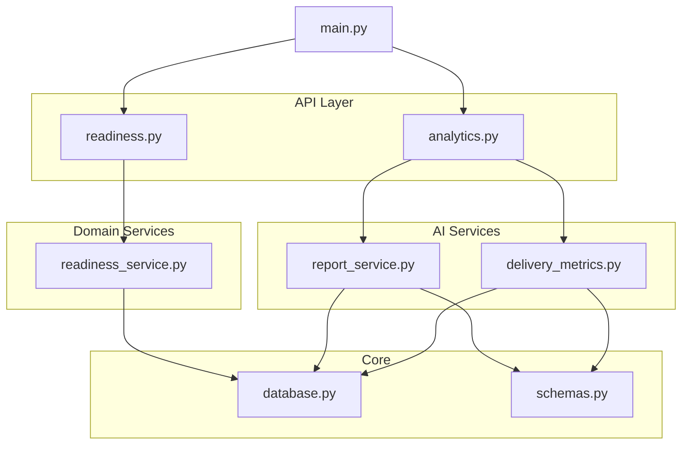
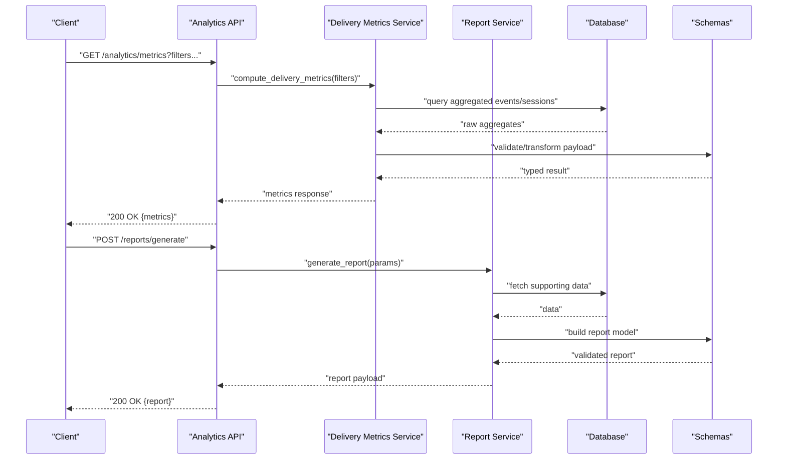
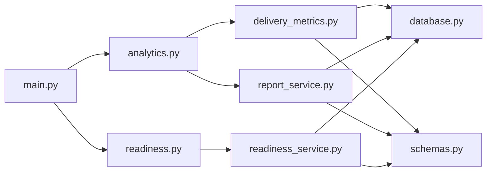

# Analytics API

<cite>
**Referenced Files in This Document**
- [backend/api/analytics.py](file://backend/api/analytics.py)
- [backend/api/readiness.py](file://backend/api/readiness.py)
- [backend/ai/delivery_metrics.py](file://backend/ai/delivery_metrics.py)
- [backend/ai/report_service.py](file://backend/ai/report_service.py)
- [backend/services/readiness_service.py](file://backend/services/readiness_service.py)
- [backend/main.py](file://backend/main.py)
- [backend/core/database.py](file://backend/core/database.py)
- [backend/models/schemas.py](file://backend/models/schemas.py)
- [backend/tests/test_delivery_metrics.py](file://backend/tests/test_delivery_metrics.py)
- [backend/tests/test_report_service.py](file://backend/tests/test_report_service.py)
</cite>

## Table of Contents
1. [Introduction](#introduction)
2. [Project Structure](#project-structure)
3. [Core Components](#core-components)
4. [Architecture Overview](#architecture-overview)
5. [Detailed Component Analysis](#detailed-component-analysis)
6. [Dependency Analysis](#dependency-analysis)
7. [Performance Considerations](#performance-considerations)
8. [Troubleshooting Guide](#troubleshooting-guide)
9. [Conclusion](#conclusion)
10. [Appendices](#appendices)

## Introduction
This document provides comprehensive documentation for the analytics and reporting capabilities exposed by the backend APIs. It covers performance metrics collection, readiness assessment, delivery metrics, and reporting endpoints. The guide explains data aggregation patterns, metric calculations, report generation workflows, and how to consume these endpoints for data visualization and monitoring. Examples include typical analytics queries, report generation flows, and performance monitoring strategies.

## Project Structure
The analytics and reporting features are implemented primarily under the backend package:
- API layer exposes HTTP endpoints for analytics, readiness, and related operations.
- AI services implement delivery metrics computation and report generation logic.
- Services encapsulate domain-specific logic such as readiness assessment.
- Core modules provide database access and shared schemas.

**Diagram sources**
- [backend/main.py](file://backend/main.py)
- [backend/api/analytics.py](file://backend/api/analytics.py)
- [backend/api/readiness.py](file://backend/api/readiness.py)
- [backend/ai/delivery_metrics.py](file://backend/ai/delivery_metrics.py)
- [backend/ai/report_service.py](file://backend/ai/report_service.py)
- [backend/services/readiness_service.py](file://backend/services/readiness_service.py)
- [backend/core/database.py](file://backend/core/database.py)
- [backend/models/schemas.py](file://backend/models/schemas.py)

**Section sources**
- [backend/main.py](file://backend/main.py)
- [backend/api/analytics.py](file://backend/api/analytics.py)
- [backend/api/readiness.py](file://backend/api/readiness.py)
- [backend/ai/delivery_metrics.py](file://backend/ai/delivery_metrics.py)
- [backend/ai/report_service.py](file://backend/ai/report_service.py)
- [backend/services/readiness_service.py](file://backend/services/readiness_service.py)
- [backend/core/database.py](file://backend/core/database.py)
- [backend/models/schemas.py](file://backend/models/schemas.py)

## Core Components
- Analytics API endpoints: Provide aggregated metrics, time-series summaries, and filters for dashboards and reports.
- Readiness API endpoints: Expose readiness scores and supporting signals used for gatekeeping or progress tracking.
- Delivery Metrics service: Computes delivery-related KPIs (e.g., throughput, quality indicators) from raw events and sessions.
- Report Service: Generates structured reports combining multiple metrics and contextual insights.
- Readiness Service: Encapsulates readiness calculation logic and aggregates supporting data.
- Database and Schemas: Centralize data access and define request/response models used across components.

Key responsibilities:
- Aggregation and filtering of event/session data for analytics.
- Calculation of composite metrics and readiness scores.
- Generation of standardized report payloads suitable for visualization.

**Section sources**
- [backend/api/analytics.py](file://backend/api/analytics.py)
- [backend/api/readiness.py](file://backend/api/readiness.py)
- [backend/ai/delivery_metrics.py](file://backend/ai/delivery_metrics.py)
- [backend/ai/report_service.py](file://backend/ai/report_service.py)
- [backend/services/readiness_service.py](file://backend/services/readiness_service.py)
- [backend/core/database.py](file://backend/core/database.py)
- [backend/models/schemas.py](file://backend/models/schemas.py)

## Architecture Overview
The analytics and reporting architecture follows a layered approach:
- API endpoints accept requests with filters and parameters.
- Services orchestrate data retrieval and computations.
- AI services perform specialized calculations (delivery metrics, report synthesis).
- Data is persisted via the core database module and typed through shared schemas.

**Diagram sources**
- [backend/api/analytics.py](file://backend/api/analytics.py)
- [backend/ai/delivery_metrics.py](file://backend/ai/delivery_metrics.py)
- [backend/ai/report_service.py](file://backend/ai/report_service.py)
- [backend/core/database.py](file://backend/core/database.py)
- [backend/models/schemas.py](file://backend/models/schemas.py)

## Detailed Component Analysis

### Analytics Endpoints
Responsibilities:
- Accept filter parameters (time windows, dimensions, tags).
- Aggregate metrics from underlying datasets.
- Return normalized responses compatible with visualization libraries.

Typical usage patterns:
- Time-series aggregation for charts.
- Dimensional breakdowns (by team, project, category).
- Summary statistics for dashboards.

Example query flow:
- Client sends GET with query parameters.
- API validates inputs against schemas.
- Underlying service queries database and computes aggregates.
- Response includes series, totals, and metadata.

**Section sources**
- [backend/api/analytics.py](file://backend/api/analytics.py)
- [backend/models/schemas.py](file://backend/models/schemas.py)
- [backend/core/database.py](file://backend/core/database.py)

### Readiness Assessment Endpoints
Responsibilities:
- Compute readiness scores based on predefined criteria.
- Surface supporting signals (e.g., completion rates, quality thresholds).
- Provide trend indicators over time.

Operational notes:
- Readiness logic is encapsulated in a dedicated service for clarity and testability.
- Responses include score, status, and contributing factors.

Example flow:
- Client calls readiness endpoint with identifiers and optional filters.
- Readiness service aggregates required signals.
- Score is computed and returned with explanation fields.

**Section sources**
- [backend/api/readiness.py](file://backend/api/readiness.py)
- [backend/services/readiness_service.py](file://backend/services/readiness_service.py)
- [backend/models/schemas.py](file://backend/models/schemas.py)

### Delivery Metrics Service
Responsibilities:
- Calculate delivery KPIs such as throughput, latency distributions, and quality indicators.
- Support filtering by date ranges, entities, and categories.
- Provide both point-in-time snapshots and rolling aggregates.

Calculation patterns:
- Event-based aggregations grouped by time buckets.
- Weighted averages for quality signals.
- Percentile computations for latency and duration metrics.

Validation and typing:
- Uses shared schemas to ensure consistent output structures.

**Section sources**
- [backend/ai/delivery_metrics.py](file://backend/ai/delivery_metrics.py)
- [backend/models/schemas.py](file://backend/models/schemas.py)
- [backend/core/database.py](file://backend/core/database.py)
- [backend/tests/test_delivery_metrics.py](file://backend/tests/test_delivery_metrics.py)

### Report Service
Responsibilities:
- Generate comprehensive reports combining multiple metrics and contextual insights.
- Support templated sections and dynamic content based on filters.
- Output structured payloads suitable for export and visualization.

Generation workflow:
- Collect inputs and validate against schemas.
- Query supporting datasets.
- Compose report sections and assemble final payload.
- Return standardized report object.

**Section sources**
- [backend/ai/report_service.py](file://backend/ai/report_service.py)
- [backend/models/schemas.py](file://backend/models/schemas.py)
- [backend/core/database.py](file://backend/core/database.py)
- [backend/tests/test_report_service.py](file://backend/tests/test_report_service.py)

### Data Models and Schemas
Purpose:
- Define request/response shapes for analytics, readiness, and reports.
- Ensure type safety and consistency across API boundaries.
- Facilitate validation and error handling.

Usage:
- Imported by API endpoints and services.
- Used to serialize outputs and parse inputs.

**Section sources**
- [backend/models/schemas.py](file://backend/models/schemas.py)

### Database Integration
Purpose:
- Centralized data access for analytics and reporting.
- Provides query helpers and connection management.

Considerations:
- Use efficient aggregations and indexes where applicable.
- Avoid N+1 queries by batching reads.

**Section sources**
- [backend/core/database.py](file://backend/core/database.py)

## Dependency Analysis
High-level dependencies among components:
- API endpoints depend on AI services and domain services.
- AI services depend on database and schemas.
- Domain services depend on database and schemas.
- Main application wires routes and dependency injection.

**Diagram sources**
- [backend/api/analytics.py](file://backend/api/analytics.py)
- [backend/api/readiness.py](file://backend/api/readiness.py)
- [backend/ai/delivery_metrics.py](file://backend/ai/delivery_metrics.py)
- [backend/ai/report_service.py](file://backend/ai/report_service.py)
- [backend/services/readiness_service.py](file://backend/services/readiness_service.py)
- [backend/core/database.py](file://backend/core/database.py)
- [backend/models/schemas.py](file://backend/models/schemas.py)
- [backend/main.py](file://backend/main.py)

**Section sources**
- [backend/main.py](file://backend/main.py)
- [backend/api/analytics.py](file://backend/api/analytics.py)
- [backend/api/readiness.py](file://backend/api/readiness.py)
- [backend/ai/delivery_metrics.py](file://backend/ai/delivery_metrics.py)
- [backend/ai/report_service.py](file://backend/ai/report_service.py)
- [backend/services/readiness_service.py](file://backend/services/readiness_service.py)
- [backend/core/database.py](file://backend/core/database.py)
- [backend/models/schemas.py](file://backend/models/schemas.py)

## Performance Considerations
- Prefer server-side aggregation to minimize payload sizes and client processing overhead.
- Cache frequently accessed aggregates when appropriate, with invalidation tied to data updates.
- Use pagination and range filters for large datasets to avoid memory pressure.
- Monitor query execution times and optimize indexes for common filter combinations.
- For report generation, consider asynchronous processing for heavy workloads and return job IDs for polling.

[No sources needed since this section provides general guidance]

## Troubleshooting Guide
Common issues and resolutions:
- Validation errors: Ensure request bodies and query parameters conform to defined schemas. Check field types and required flags.
- Missing data: Verify that filters match existing records; adjust time windows or entity identifiers.
- Slow responses: Inspect database query plans, add indexes, or reduce granularity of aggregations.
- Inconsistent metrics: Confirm that metric definitions align with business rules and that upstream events are correctly tagged.

Diagnostic steps:
- Enable detailed logging around API entry points and service calls.
- Validate schema compliance using provided models before invoking downstream services.
- Compare intermediate results between services to isolate discrepancies.

**Section sources**
- [backend/models/schemas.py](file://backend/models/schemas.py)
- [backend/core/database.py](file://backend/core/database.py)
- [backend/ai/delivery_metrics.py](file://backend/ai/delivery_metrics.py)
- [backend/ai/report_service.py](file://backend/ai/report_service.py)

## Conclusion
The analytics and reporting subsystem provides robust endpoints for collecting performance metrics, assessing readiness, computing delivery KPIs, and generating structured reports. By leveraging well-defined schemas, centralized database access, and modular services, the system supports scalable dashboards and automated reporting. Follow the examples and best practices outlined here to integrate effectively and maintain high performance.

[No sources needed since this section summarizes without analyzing specific files]

## Appendices

### Example Analytics Queries
- Retrieve time-series metrics for a given period and dimension.
- Filter by tags or categories to slice data for specific teams or projects.
- Request summary statistics (totals, averages, percentiles) for dashboard widgets.

### Example Report Generation
- Submit a report request with filters and template selection.
- Receive a structured report payload containing sections, metrics, and insights.
- Render the report in UI components or export to external systems.

### Example Performance Monitoring
- Poll readiness endpoints to track progress toward gates.
- Observe delivery metrics trends to identify bottlenecks.
- Correlate readiness scores with delivery KPIs for holistic insights.

[No sources needed since this section provides conceptual examples]