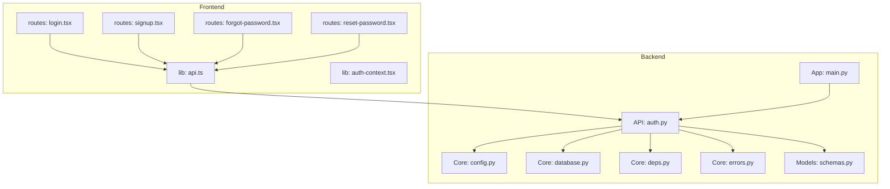
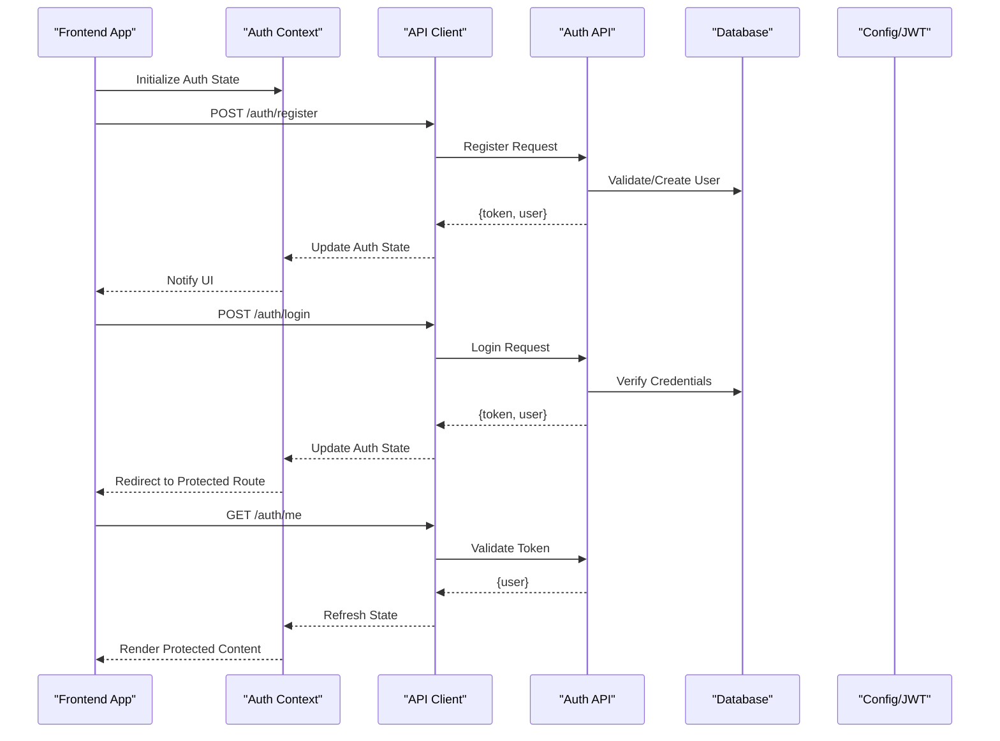
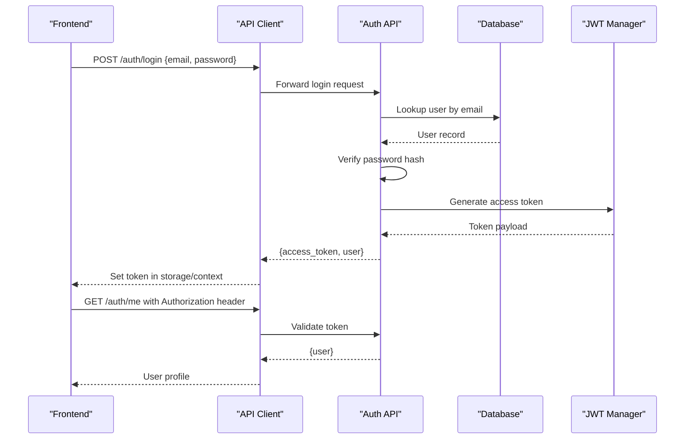
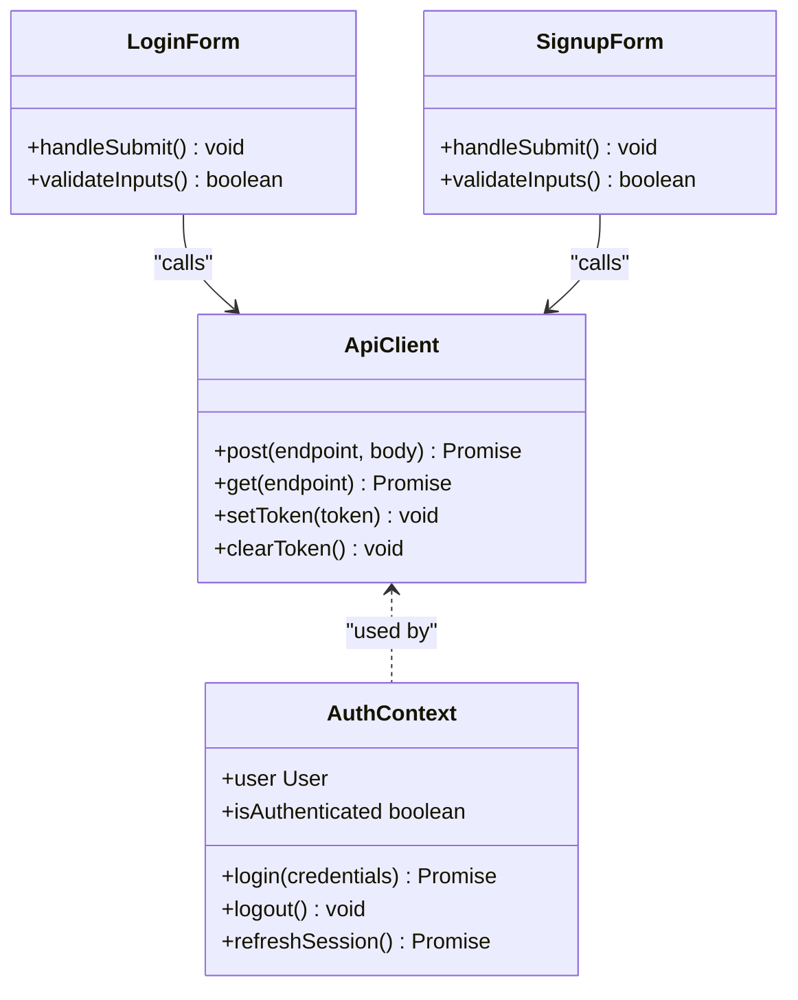
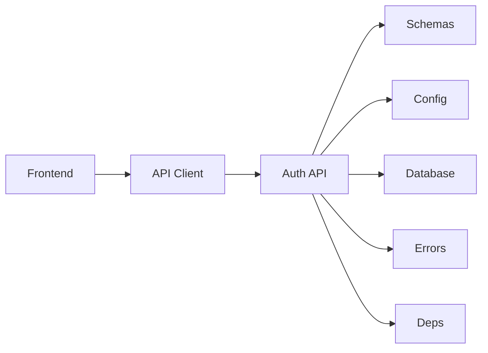

# Authentication API

<cite>
**Referenced Files in This Document**
- [auth.py](file://backend/api/auth.py)
- [main.py](file://backend/main.py)
- [config.py](file://backend/core/config.py)
- [database.py](file://backend/core/database.py)
- [deps.py](file://backend/core/deps.py)
- [errors.py](file://backend/core/errors.py)
- [schemas.py](file://backend/models/schemas.py)
- [api.ts](file://src/lib/api.ts)
- [auth-context.tsx](file://src/lib/auth-context.tsx)
- [login.tsx](file://src/routes/login.tsx)
- [signup.tsx](file://src/routes/signup.tsx)
- [forgot-password.tsx](file://src/routes/forgot-password.tsx)
- [reset-password.tsx](file://src/routes/reset-password.tsx)
</cite>

## Table of Contents
1. [Introduction](#introduction)
2. [Project Structure](#project-structure)
3. [Core Components](#core-components)
4. [Architecture Overview](#architecture-overview)
5. [Detailed Component Analysis](#detailed-component-analysis)
6. [Dependency Analysis](#dependency-analysis)
7. [Performance Considerations](#performance-considerations)
8. [Troubleshooting Guide](#troubleshooting-guide)
9. [Conclusion](#conclusion)
10. [Appendices](#appendices)

## Introduction
This document provides comprehensive documentation for the authentication API endpoints, covering user registration, login, logout, password reset, and session management. It explains request/response schemas, JWT token handling, role-based authorization, and security considerations. It also includes examples of authentication flows, error responses, and integration patterns with the frontend auth context.

## Project Structure
The authentication system spans backend API routes, core configuration and dependencies, data models, and frontend integration layers:
- Backend API routes define endpoints for authentication operations.
- Core modules provide configuration, database access, dependency injection, and error definitions.
- Data models define Pydantic schemas for requests and responses.
- Frontend integrates via an API client and a React context to manage authentication state.

**Diagram sources**
- [auth.py](file://backend/api/auth.py)
- [main.py](file://backend/main.py)
- [config.py](file://backend/core/config.py)
- [database.py](file://backend/core/database.py)
- [deps.py](file://backend/core/deps.py)
- [errors.py](file://backend/core/errors.py)
- [schemas.py](file://backend/models/schemas.py)
- [api.ts](file://src/lib/api.ts)
- [auth-context.tsx](file://src/lib/auth-context.tsx)
- [login.tsx](file://src/routes/login.tsx)
- [signup.tsx](file://src/routes/signup.tsx)
- [forgot-password.tsx](file://src/routes/forgot-password.tsx)
- [reset-password.tsx](file://src/routes/reset-password.tsx)

**Section sources**
- [auth.py](file://backend/api/auth.py)
- [main.py](file://backend/main.py)
- [config.py](file://backend/core/config.py)
- [database.py](file://backend/core/database.py)
- [deps.py](file://backend/core/deps.py)
- [errors.py](file://backend/core/errors.py)
- [schemas.py](file://backend/models/schemas.py)
- [api.ts](file://src/lib/api.ts)
- [auth-context.tsx](file://src/lib/auth-context.tsx)
- [login.tsx](file://src/routes/login.tsx)
- [signup.tsx](file://src/routes/signup.tsx)
- [forgot-password.tsx](file://src/routes/forgot-password.tsx)
- [reset-password.tsx](file://src/routes/reset-password.tsx)

## Core Components
- Authentication API endpoints are defined in the backend API module.
- Configuration (e.g., JWT settings) is centralized in the core configuration module.
- Database interactions are abstracted through the core database module.
- Dependency injection utilities provide shared services and validators.
- Error definitions standardize response shapes and codes.
- Pydantic schemas define request and response structures for validation and serialization.

Key responsibilities:
- Endpoint handlers validate inputs, interact with services, and return standardized responses.
- JWT issuance and verification are governed by configuration and middleware.
- Role-based authorization checks are enforced at route or service levels.

**Section sources**
- [auth.py](file://backend/api/auth.py)
- [config.py](file://backend/core/config.py)
- [database.py](file://backend/core/database.py)
- [deps.py](file://backend/core/deps.py)
- [errors.py](file://backend/core/errors.py)
- [schemas.py](file://backend/models/schemas.py)

## Architecture Overview
The authentication flow involves the frontend calling backend endpoints, which validate requests, manage sessions, and issue tokens. The frontend maintains authentication state using a context provider and persists tokens securely.

**Diagram sources**
- [auth.py](file://backend/api/auth.py)
- [api.ts](file://src/lib/api.ts)
- [auth-context.tsx](file://src/lib/auth-context.tsx)
- [config.py](file://backend/core/config.py)
- [database.py](file://backend/core/database.py)

## Detailed Component Analysis

### Authentication Endpoints
Endpoints typically include:
- User registration
- User login
- User logout
- Password reset request
- Password reset confirmation
- Session retrieval/verification

Request/response schemas:
- Registration: email, password, optional profile fields; returns user object and token.
- Login: email, password; returns token and user profile.
- Logout: clears server-side session/token blacklist if applicable; returns success status.
- Password reset request: email; returns success message.
- Password reset confirmation: token, new password; returns success status.
- Session: returns current user info and roles.

JWT token handling:
- Tokens are issued upon successful authentication.
- Tokens are included in Authorization headers for protected routes.
- Token expiration and refresh strategies are configured centrally.

Role-based authorization:
- Roles are embedded in the token payload or fetched from the user record.
- Middleware validates roles before allowing access to protected endpoints.

Security considerations:
- Enforce HTTPS for all endpoints.
- Use strong password policies and hashing.
- Implement rate limiting on sensitive endpoints.
- Validate and sanitize all inputs.
- Avoid leaking sensitive data in logs or responses.

**Section sources**
- [auth.py](file://backend/api/auth.py)
- [schemas.py](file://backend/models/schemas.py)
- [config.py](file://backend/core/config.py)
- [errors.py](file://backend/core/errors.py)

#### Sequence Diagram: Login Flow

**Diagram sources**
- [auth.py](file://backend/api/auth.py)
- [api.ts](file://src/lib/api.ts)
- [config.py](file://backend/core/config.py)
- [database.py](file://backend/core/database.py)

### Frontend Integration Patterns
- API client encapsulates HTTP calls and attaches tokens to requests.
- Auth context manages login state, token persistence, and user profile.
- Routes guard protected pages by checking authentication state.
- Forms handle user input and submit to authentication endpoints.

Integration steps:
- Initialize auth context with stored token.
- On login success, update context and persist token.
- On logout, clear context and storage.
- Handle errors consistently across forms and API calls.

**Section sources**
- [api.ts](file://src/lib/api.ts)
- [auth-context.tsx](file://src/lib/auth-context.tsx)
- [login.tsx](file://src/routes/login.tsx)
- [signup.tsx](file://src/routes/signup.tsx)
- [forgot-password.tsx](file://src/routes/forgot-password.tsx)
- [reset-password.tsx](file://src/routes/reset-password.tsx)

#### Class Diagram: Auth Context and API Client

**Diagram sources**
- [api.ts](file://src/lib/api.ts)
- [auth-context.tsx](file://src/lib/auth-context.tsx)
- [login.tsx](file://src/routes/login.tsx)
- [signup.tsx](file://src/routes/signup.tsx)

## Dependency Analysis
Authentication components depend on configuration, database, and error handling modules. The API layer depends on schemas for validation and middleware for authorization.

**Diagram sources**
- [auth.py](file://backend/api/auth.py)
- [schemas.py](file://backend/models/schemas.py)
- [config.py](file://backend/core/config.py)
- [database.py](file://backend/core/database.py)
- [errors.py](file://backend/core/errors.py)
- [deps.py](file://backend/core/deps.py)
- [api.ts](file://src/lib/api.ts)

**Section sources**
- [auth.py](file://backend/api/auth.py)
- [schemas.py](file://backend/models/schemas.py)
- [config.py](file://backend/core/config.py)
- [database.py](file://backend/core/database.py)
- [errors.py](file://backend/core/errors.py)
- [deps.py](file://backend/core/deps.py)
- [api.ts](file://src/lib/api.ts)

## Performance Considerations
- Minimize database queries during authentication by caching user profiles where appropriate.
- Use connection pooling for database operations.
- Implement rate limiting to prevent brute-force attacks.
- Optimize JWT payload size to reduce overhead.
- Ensure efficient token validation without unnecessary lookups.

[No sources needed since this section provides general guidance]

## Troubleshooting Guide
Common issues and resolutions:
- Invalid credentials: Verify email/password format and ensure correct hashing.
- Token expiration: Implement token refresh logic and handle expired tokens gracefully.
- CORS errors: Configure allowed origins and methods for frontend-backend communication.
- Validation errors: Check request payloads against schemas and log detailed messages.
- Rate limiting: Monitor endpoint usage and adjust limits based on traffic patterns.

Error response formats:
- Standardized error objects with code, message, and details.
- Consistent HTTP status codes for different failure scenarios.

**Section sources**
- [errors.py](file://backend/core/errors.py)
- [auth.py](file://backend/api/auth.py)

## Conclusion
The authentication system provides secure and scalable endpoints for user registration, login, logout, password reset, and session management. By leveraging JWT tokens, role-based authorization, and robust error handling, it ensures a reliable authentication experience. Frontend integration through an API client and auth context simplifies state management and user interactions.

[No sources needed since this section summarizes without analyzing specific files]

## Appendices

### Request/Response Schemas Summary
- Registration:
  - Request: email, password, optional profile fields
  - Response: user object, access token
- Login:
  - Request: email, password
  - Response: user object, access token
- Logout:
  - Request: none (or token)
  - Response: success status
- Password Reset Request:
  - Request: email
  - Response: success message
- Password Reset Confirmation:
  - Request: token, new password
  - Response: success status
- Session:
  - Request: Authorization header
  - Response: user object, roles

### Security Best Practices
- Enforce HTTPS everywhere.
- Use strong password hashing algorithms.
- Implement CSRF protection for state-changing operations.
- Sanitize and validate all inputs.
- Log security events without sensitive data.
- Rotate secrets and tokens regularly.

### Integration Checklist
- Initialize auth context with stored token.
- Attach tokens to all authenticated requests.
- Handle authentication errors consistently.
- Guard protected routes with auth checks.
- Test all authentication flows end-to-end.

[No sources needed since this section provides general guidance]