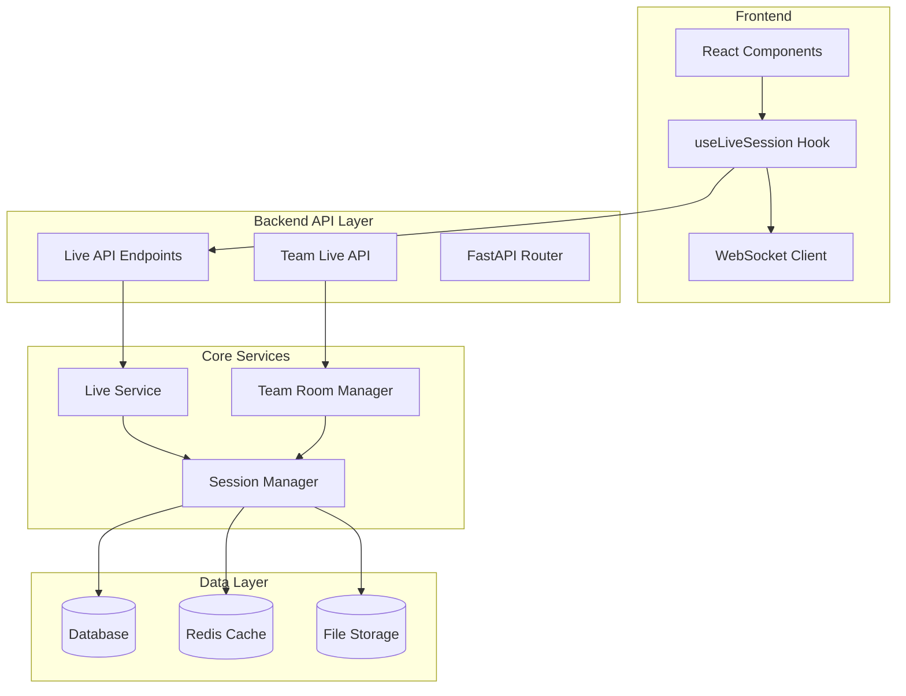
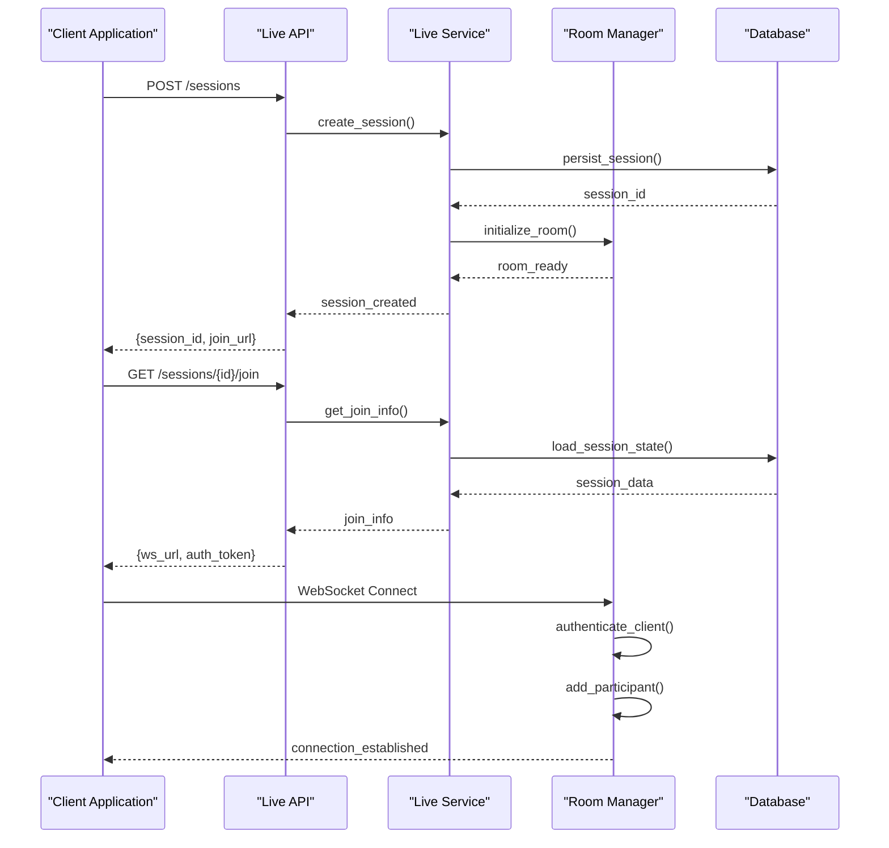
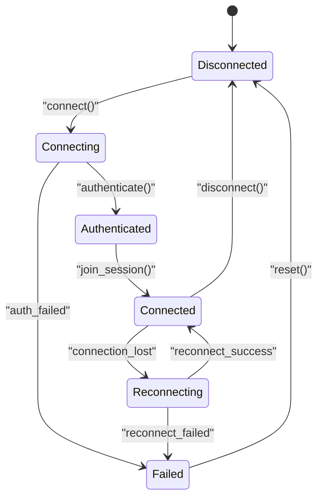
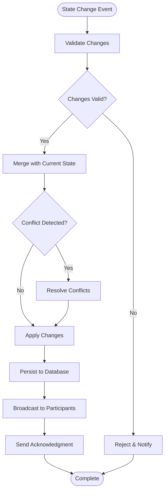
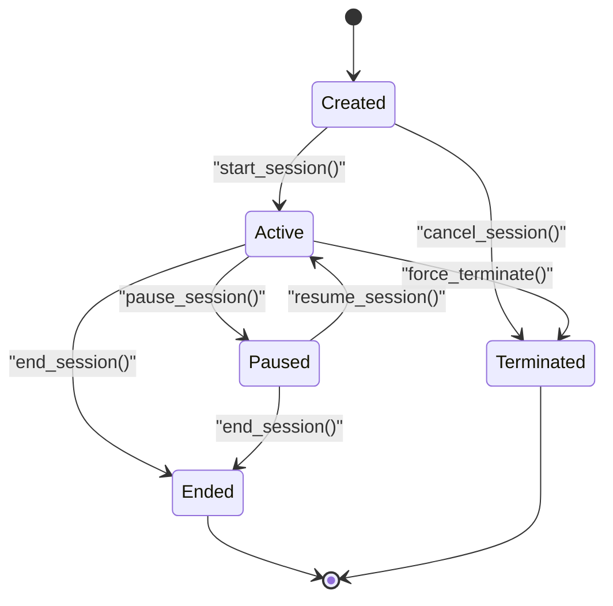

# Live Sessions API

<cite>
**Referenced Files in This Document**
- [live.py](file://backend/api/live.py)
- [team_live.py](file://backend/api/team_live.py)
- [live_service.py](file://backend/ai/live_service.py)
- [team_room.py](file://backend/ai/team_room.py)
- [useLiveSession.ts](file://src/lib/useLiveSession.ts)
- [main.py](file://backend/main.py)
- [schemas.py](file://backend/models/schemas.py)
</cite>

## Table of Contents
1. [Introduction](#introduction)
2. [Project Structure](#project-structure)
3. [Core Components](#core-components)
4. [Architecture Overview](#architecture-overview)
5. [Detailed Component Analysis](#detailed-component-analysis)
6. [API Endpoints Reference](#api-endpoints-reference)
7. [WebSocket Protocol](#websocket-protocol)
8. [Message Formats](#message-formats)
9. [Session Lifecycle Management](#session-lifecycle-management)
10. [Participant Management](#participant-management)
11. [Real-time Communication Patterns](#real-time-communication-patterns)
12. [Error Handling](#error-handling)
13. [Performance Considerations](#performance-considerations)
14. [Troubleshooting Guide](#troubleshooting-guide)
15. [Conclusion](#conclusion)

## Introduction

The Live Sessions API provides comprehensive real-time collaboration capabilities for interactive sessions, including live coding environments, team discussions, and collaborative presentations. The system supports multiple participants, real-time data synchronization, WebSocket-based communication, and robust session lifecycle management.

Key features include:
- Real-time session creation and management
- Multi-participant coordination with role-based access control
- WebSocket-based bidirectional communication
- Event broadcasting and message routing
- Session state persistence and recovery
- Scalable architecture supporting concurrent sessions

## Project Structure

The live session functionality is distributed across backend services and frontend components:



**Diagram sources**
- [main.py:1-50](file://backend/main.py#L1-L50)
- [live.py:1-100](file://backend/api/live.py#L1-L100)
- [live_service.py:1-100](file://backend/ai/live_service.py#L1-L100)

**Section sources**
- [main.py:1-100](file://backend/main.py#L1-L100)
- [live.py:1-200](file://backend/api/live.py#L1-L200)

## Core Components

### Live Session Service
The core service managing session lifecycle, participant coordination, and real-time communication.

### WebSocket Handler
Manages WebSocket connections, message routing, and real-time event broadcasting.

### Session State Manager
Handles session persistence, state synchronization, and recovery mechanisms.

### Participant Coordinator
Manages participant roles, permissions, and presence tracking.

**Section sources**
- [live_service.py:1-150](file://backend/ai/live_service.py#L1-L150)
- [team_room.py:1-100](file://backend/ai/team_room.py#L1-L100)

## Architecture Overview

The live session system follows a microservices-inspired architecture with clear separation of concerns:



**Diagram sources**
- [live.py:50-150](file://backend/api/live.py#L50-L150)
- [live_service.py:100-200](file://backend/ai/live_service.py#L100-L200)

## Detailed Component Analysis

### Live Session API Endpoints

The REST API provides endpoints for session management, participant operations, and session state queries.

#### Session Management Endpoints

| Endpoint | Method | Description | Authentication | Rate Limit |
|----------|--------|-------------|----------------|------------|
| `/api/live/sessions` | POST | Create new live session | Required | 10/min |
| `/api/live/sessions/{id}` | GET | Get session details | Required | 60/min |
| `/api/live/sessions/{id}` | DELETE | Terminate session | Owner/Admin | 5/min |
| `/api/live/sessions/{id}/join` | GET | Get join information | Optional | 100/min |

#### Participant Management Endpoints

| Endpoint | Method | Description | Authentication | Rate Limit |
|----------|--------|-------------|----------------|------------|
| `/api/live/sessions/{id}/participants` | GET | List participants | Session member | 30/min |
| `/api/live/sessions/{id}/participants/{user_id}` | PUT | Update participant role | Host/Admin | 10/min |
| `/api/live/sessions/{id}/participants/{user_id}` | DELETE | Remove participant | Host/Admin | 5/min |

**Section sources**
- [live.py:1-200](file://backend/api/live.py#L1-L200)
- [team_live.py:1-150](file://backend/api/team_live.py#L1-L150)

### WebSocket Connection Management

The WebSocket layer handles real-time communication between clients and the server.

#### Connection Lifecycle



**Diagram sources**
- [useLiveSession.ts:1-100](file://src/lib/useLiveSession.ts#L1-L100)

#### WebSocket Message Types

| Message Type | Direction | Description | Payload Schema |
|--------------|-----------|-------------|----------------|
| `session_joined` | Server→Client | Session joined successfully | `{session_id, participant_id, initial_state}` |
| `participant_joined` | Broadcast | New participant connected | `{participant_id, user_info, timestamp}` |
| `participant_left` | Broadcast | Participant disconnected | `{participant_id, reason, timestamp}` |
| `session_state_update` | Bidirectional | State change notification | `{updates, version, timestamp}` |
| `chat_message` | Bidirectional | Chat message | `{content, sender_id, timestamp}` |
| `cursor_update` | Bidirectional | Cursor position update | `{x, y, participant_id}` |
| `code_change` | Bidirectional | Code editor changes | `{document_id, changes, version}` |

**Section sources**
- [useLiveSession.ts:100-300](file://src/lib/useLiveSession.ts#L100-L300)

### Session State Management

The session state manager ensures consistency across all participants and provides persistence.

#### State Synchronization Algorithm



**Diagram sources**
- [live_service.py:200-400](file://backend/ai/live_service.py#L200-L400)

**Section sources**
- [live_service.py:150-300](file://backend/ai/live_service.py#L150-L300)

## API Endpoints Reference

### Session Creation and Management

#### Create Live Session
Creates a new live session with specified configuration.

**Request:**
```json
{
  "title": "Team Coding Session",
  "description": "Collaborative coding session",
  "max_participants": 10,
  "settings": {
    "allow_screen_share": true,
    "enable_chat": true,
    "recording_enabled": false
  }
}
```

**Response:**
```json
{
  "session_id": "sess_abc123",
  "join_url": "https://app.example.com/live/join/sess_abc123",
  "created_at": "2024-01-15T10:30:00Z",
  "expires_at": "2024-01-15T12:30:00Z"
}
```

#### Get Session Details
Retrieves complete session information including current state and participants.

**Response:**
```json
{
  "id": "sess_abc123",
  "title": "Team Coding Session",
  "status": "active",
  "current_participants": 5,
  "max_participants": 10,
  "host_id": "user_123",
  "created_at": "2024-01-15T10:30:00Z",
  "last_activity": "2024-01-15T11:45:00Z"
}
```

**Section sources**
- [live.py:100-250](file://backend/api/live.py#L100-L250)

### Team Live Features

#### Team Session Management
Enhanced session management for team collaboration scenarios.

**Team-specific Endpoints:**
- `/api/team-live/sessions` - Team session CRUD operations
- `/api/team-live/sessions/{id}/members` - Member management
- `/api/team-live/sessions/{id}/permissions` - Permission settings

**Section sources**
- [team_live.py:1-200](file://backend/api/team_live.py#L1-L200)

## WebSocket Protocol

### Connection Establishment

Clients establish WebSocket connections using the following process:

1. **Initial Connection**: Connect to WebSocket endpoint with authentication token
2. **Authentication**: Send authentication message with session credentials
3. **Session Join**: Request to join specific session
4. **Connection Ready**: Receive confirmation and initial state

### Message Format Specification

All WebSocket messages follow a standardized JSON format:

```json
{
  "type": "message_type",
  "payload": {},
  "timestamp": "ISO8601_timestamp",
  "sender_id": "participant_id",
  "session_id": "session_identifier",
  "correlation_id": "unique_request_id"
}
```

### Error Messages

```json
{
  "type": "error",
  "payload": {
    "code": "ERROR_CODE",
    "message": "Human-readable error message",
    "details": {}
  },
  "timestamp": "ISO8601_timestamp"
}
```

**Section sources**
- [useLiveSession.ts:200-500](file://src/lib/useLiveSession.ts#L200-L500)

## Message Formats

### Session Events

#### Session Lifecycle Events
- `session.created` - New session created
- `session.started` - Session initiated
- `session.paused` - Session temporarily paused
- `session.resumed` - Session resumed after pause
- `session.ended` - Session terminated
- `session.error` - Session encountered error

#### Participant Events
- `participant.joined` - New participant connected
- `participant.left` - Participant disconnected
- `participant.role_changed` - Role updated
- `participant.muted` - Participant muted
- `participant.unmuted` - Participant unmuted

#### Collaboration Events
- `document.changed` - Document modification
- `cursor.moved` - Cursor position update
- `selection.changed` - Text selection update
- `comment.added` - New comment added
- `comment.updated` - Comment modified
- `comment.deleted` - Comment removed

### Data Synchronization Messages

#### State Updates
```json
{
  "type": "state_update",
  "payload": {
    "entity_type": "document|cursor|comment",
    "entity_id": "unique_entity_id",
    "operation": "create|update|delete",
    "data": {},
    "version": 123,
    "conflict_resolution": "server_wins|client_wins|merge"
  }
}
```

#### Presence Information
```json
{
  "type": "presence_update",
  "payload": {
    "participant_id": "user_123",
    "is_active": true,
    "is_typing": false,
    "current_view": "editor|preview|comments",
    "last_seen": "ISO8601_timestamp"
  }
}
```

**Section sources**
- [live_service.py:300-500](file://backend/ai/live_service.py#L300-L500)

## Session Lifecycle Management

### Session States

The session lifecycle follows a well-defined state machine:



### Session Configuration Options

| Option | Type | Default | Description |
|--------|------|---------|-------------|
| `max_participants` | integer | 10 | Maximum number of participants |
| `auto_start` | boolean | false | Automatically start on creation |
| `record_session` | boolean | false | Enable session recording |
| `allow_screen_share` | boolean | true | Allow screen sharing |
| `require_approval` | boolean | false | Require host approval for joins |
| `session_timeout` | integer | 3600 | Session timeout in seconds |
| `max_duration` | integer | 7200 | Maximum session duration |

### Cleanup and Resource Management

Sessions are automatically cleaned up when:
- All participants disconnect
- Session reaches maximum duration
- Host explicitly terminates session
- System resource limits are reached

**Section sources**
- [live_service.py:100-200](file://backend/ai/live_service.py#L100-L200)
- [team_room.py:100-200](file://backend/ai/team_room.py#L100-L200)

## Participant Management

### Role-Based Access Control

The system implements granular role-based permissions:

| Role | Permissions | Restrictions |
|------|-------------|--------------|
| `host` | Full control, manage participants, terminate session | None |
| `moderator` | Manage participants, mute/unmute, share screen | Cannot terminate session |
| `participant` | View, interact, chat, share screen | Cannot manage others |
| `observer` | View only, no interaction | Limited functionality |

### Participant Operations

#### Joining a Session
Participants can join sessions through:
- Direct invitation links
- Public join codes
- Admin-provided access
- Automatic enrollment (teams)

#### Participant Coordination
- Real-time presence tracking
- Role assignment and permission checks
- Participant queue management
- Auto-moderation capabilities

### Presence Tracking

The system tracks participant presence with:
- Connection status monitoring
- Activity detection (typing, cursor movement)
- Focus tracking (active tab/view)
- Network quality assessment

**Section sources**
- [team_room.py:1-150](file://backend/ai/team_room.py#L1-L150)

## Real-time Communication Patterns

### Event Broadcasting

Events are broadcast to relevant participants based on:
- Session scope (all participants)
- Channel scope (specific channels/groups)
- Target scope (individual participants)
- Role-based filtering

### Message Routing

Messages follow intelligent routing patterns:
- **Direct Messages**: Point-to-point communication
- **Channel Messages**: Group-based communication
- **Broadcast Messages**: Session-wide announcements
- **System Messages**: Internal system notifications

### Concurrency Control

The system handles concurrent modifications using:
- Optimistic locking with conflict resolution
- Operational transformation for collaborative editing
- CRDTs (Conflict-free Replicated Data Types) for complex state
- Version-based synchronization

### Backpressure Handling

To prevent overwhelming clients:
- Message throttling per participant
- Batch updates for frequent changes
- Priority queuing for critical messages
- Adaptive quality based on network conditions

**Section sources**
- [live_service.py:400-600](file://backend/ai/live_service.py#L400-L600)

## Error Handling

### Error Categories

| Category | Codes | Description | Recovery |
|----------|-------|-------------|----------|
| `AUTH_*` | AUTH_INVALID, AUTH_EXPIRED | Authentication failures | Re-authenticate |
| `SESSION_*` | SESSION_NOT_FOUND, SESSION_FULL | Session issues | Retry or create new |
| `PERMISSION_*` | PERMISSION_DENIED, ROLE_REQUIRED | Access control | Request elevated role |
| `NETWORK_*` | CONNECTION_LOST, TIMEOUT | Network problems | Auto-reconnect |
| `STATE_*` | CONFLICT, VERSION_MISMATCH | State synchronization | Merge conflicts |

### Error Response Format

```json
{
  "error": {
    "code": "ERROR_CODE",
    "message": "Human-readable description",
    "details": {
      "field": "affected_field",
      "value": "invalid_value",
      "constraint": "validation_rule"
    },
    "retry_after": 5,
    "help_url": "https://docs.example.com/errors/ERROR_CODE"
  }
}
```

### Retry Logic

Automatic retry strategies:
- **Exponential backoff** for transient errors
- **Circuit breaker** pattern for persistent failures
- **Fallback mechanisms** for degraded functionality
- **Graceful degradation** for non-critical features

**Section sources**
- [live.py:200-300](file://backend/api/live.py#L200-L300)

## Performance Considerations

### Scalability Architecture

The system is designed for horizontal scaling:
- Stateless session handlers
- Distributed message broker
- Shared cache layer for session state
- Load-balanced WebSocket servers

### Optimization Strategies

- **Connection pooling** for database operations
- **Message batching** for high-frequency updates
- **Compression** for large payloads
- **Lazy loading** of session history
- **Memory-efficient** data structures for active sessions

### Monitoring and Metrics

Key performance indicators:
- WebSocket connection latency (< 100ms)
- Message delivery time (< 50ms)
- Session memory usage (< 50MB per session)
- CPU utilization per concurrent session
- Network bandwidth consumption

## Troubleshooting Guide

### Common Issues and Solutions

#### Connection Problems
- **Symptom**: WebSocket connection fails
- **Causes**: Firewall blocking, invalid tokens, server overload
- **Solutions**: Check network connectivity, validate authentication, retry with backoff

#### Session Sync Issues
- **Symptom**: Participants see different states
- **Causes**: Network partitions, clock skew, merge conflicts
- **Solutions**: Force sync, resolve conflicts, restart session if needed

#### Performance Degradation
- **Symptom**: High latency, dropped messages
- **Causes**: Too many participants, large payloads, insufficient resources
- **Solutions**: Reduce payload size, implement pagination, scale horizontally

### Debug Tools

Built-in debugging capabilities:
- **Session inspector** for real-time monitoring
- **Message logger** for protocol debugging
- **Performance profiler** for bottleneck identification
- **Network analyzer** for connection diagnostics

### Health Checks

System health monitoring:
- WebSocket server availability
- Database connection status
- Cache layer responsiveness
- Message broker connectivity

**Section sources**
- [live_service.py:500-700](file://backend/ai/live_service.py#L500-L700)

## Conclusion

The Live Sessions API provides a comprehensive solution for real-time collaboration, featuring robust WebSocket communication, sophisticated session management, and scalable architecture. The system supports various collaboration scenarios from simple chat rooms to complex collaborative editing environments.

Key strengths include:
- **Reliability**: Robust error handling and automatic recovery
- **Scalability**: Horizontal scaling support for high concurrency
- **Flexibility**: Configurable session types and participant roles
- **Performance**: Optimized for low-latency real-time communication
- **Security**: Comprehensive authentication and authorization

The API is designed to be extensible, allowing for custom session types, specialized collaboration features, and integration with external systems while maintaining consistent real-time behavior across all client implementations.