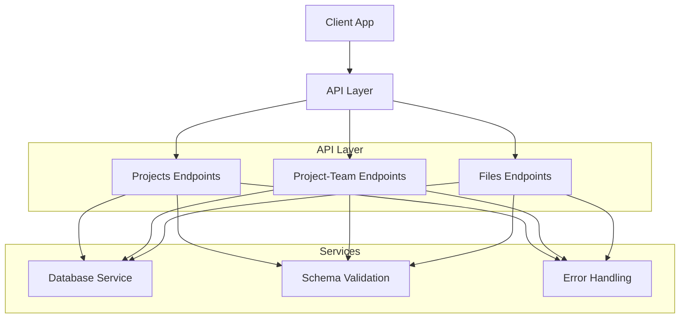
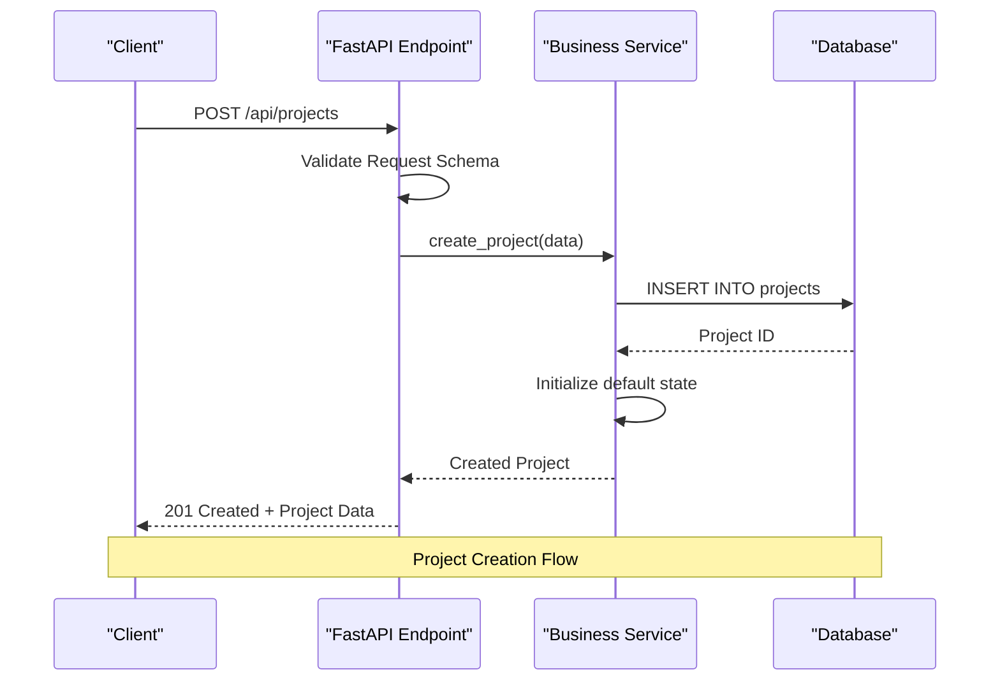
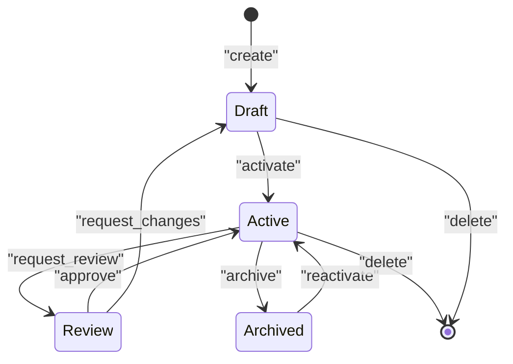
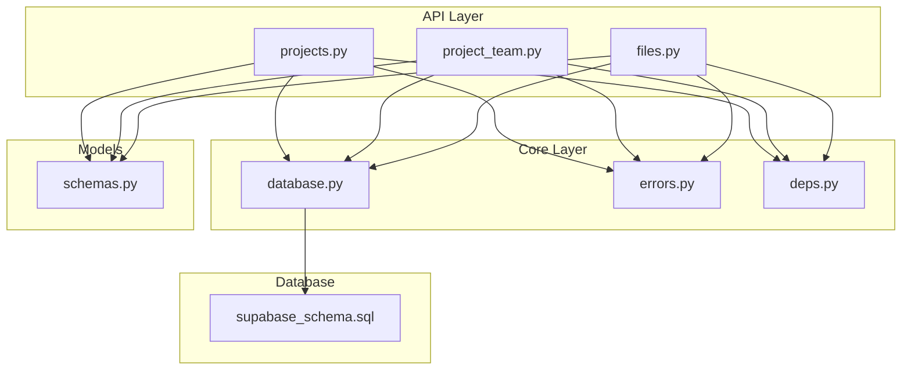

# Projects API

<cite>
**Referenced Files in This Document**
- [projects.py](file://backend/api/projects.py)
- [project_team.py](file://backend/api/project_team.py)
- [files.py](file://backend/api/files.py)
- [schemas.py](file://backend/models/schemas.py)
- [database.py](file://backend/core/database.py)
- [errors.py](file://backend/core/errors.py)
- [deps.py](file://backend/core/deps.py)
- [supabase_schema.sql](file://backend/supabase_schema.sql)
</cite>

## Table of Contents
1. [Introduction](#introduction)
2. [Project Structure](#project-structure)
3. [Core Components](#core-components)
4. [Architecture Overview](#architecture-overview)
5. [Detailed Component Analysis](#detailed-component-analysis)
6. [Dependency Analysis](#dependency-analysis)
7. [Performance Considerations](#performance-considerations)
8. [Troubleshooting Guide](#troubleshooting-guide)
9. [Conclusion](#conclusion)

## Introduction
This document provides comprehensive API documentation for project management endpoints, covering CRUD operations for projects, team associations, file uploads, and project lifecycle management. It includes request/response schemas, validation rules, permission checks, data relationships, and examples demonstrating project creation, updates, deletions, and collaborative features.

## Project Structure
The backend exposes RESTful endpoints under the /api namespace:
- Projects: Create, read, update, delete, list, and manage project lifecycle states
- Team Associations: Link teams to projects and manage membership roles
- Files: Upload, retrieve, and manage project-related files
- Schemas: Pydantic models defining request/response structures
- Database: Supabase client and query helpers
- Errors: Centralized error handling and HTTP status mapping

**Diagram sources**
- [projects.py:1-200](file://backend/api/projects.py#L1-L200)
- [project_team.py:1-200](file://backend/api/project_team.py#L1-L200)
- [files.py:1-200](file://backend/api/files.py#L1-L200)
- [schemas.py:1-200](file://backend/models/schemas.py#L1-L200)
- [database.py:1-100](file://backend/core/database.py#L1-L100)
- [errors.py:1-100](file://backend/core/errors.py#L1-L100)

**Section sources**
- [projects.py:1-200](file://backend/api/projects.py#L1-L200)
- [project_team.py:1-200](file://backend/api/project_team.py#L1-L200)
- [files.py:1-200](file://backend/api/files.py#L1-L200)
- [schemas.py:1-200](file://backend/models/schemas.py#L1-L200)
- [database.py:1-100](file://backend/core/database.py#L1-L100)
- [errors.py:1-100](file://backend/core/errors.py#L1-L100)

## Core Components
The core components include:
- **Projects API**: Handles all project-related operations including CRUD and lifecycle management
- **Project-Team API**: Manages team associations with projects and role-based permissions
- **Files API**: Provides file upload, download, and management capabilities
- **Schemas**: Defines Pydantic models for request validation and response serialization
- **Database Layer**: Encapsulates Supabase interactions and query operations
- **Error Handling**: Centralized error responses and status code mapping

**Section sources**
- [projects.py:1-200](file://backend/api/projects.py#L1-L200)
- [project_team.py:1-200](file://backend/api/project_team.py#L1-L200)
- [files.py:1-200](file://backend/api/files.py#L1-L200)
- [schemas.py:1-200](file://backend/models/schemas.py#L1-L200)

## Architecture Overview
The Projects API follows a layered architecture pattern:
- **Presentation Layer**: FastAPI endpoints handle HTTP requests/responses
- **Business Logic Layer**: Services encapsulate domain logic and business rules
- **Data Access Layer**: Database operations are abstracted through repository patterns
- **Validation Layer**: Pydantic schemas ensure data integrity at boundaries

**Diagram sources**
- [projects.py:1-200](file://backend/api/projects.py#L1-L200)
- [schemas.py:1-200](file://backend/models/schemas.py#L1-L200)
- [database.py:1-100](file://backend/core/database.py#L1-L100)

## Detailed Component Analysis

### Projects CRUD Operations
The Projects API provides comprehensive CRUD functionality:

#### Create Project
- **Endpoint**: POST /api/projects
- **Request Body**: Project creation schema with required fields
- **Response**: Created project with generated ID and timestamps
- **Validation**: Required field validation, format checking, uniqueness constraints
- **Permissions**: User must be authenticated

#### Read Projects
- **Endpoint**: GET /api/projects/{id}
- **Query Parameters**: Optional filtering and pagination
- **Response**: Project details with associated metadata
- **Access Control**: Role-based access verification

#### Update Project
- **Endpoint**: PUT /api/projects/{id}
- **Request Body**: Partial or full project update
- **Response**: Updated project data
- **Validation**: Field-specific validation rules
- **Permissions**: Owner or admin privileges required

#### Delete Project
- **Endpoint**: DELETE /api/projects/{id}
- **Response**: Success confirmation
- **Cascading Effects**: Associated data cleanup
- **Permissions**: Owner or admin privileges required

**Section sources**
- [projects.py:1-200](file://backend/api/projects.py#L1-L200)
- [schemas.py:1-200](file://backend/models/schemas.py#L1-L200)

### Team Associations Management
Team-project relationships support collaborative workflows:

#### Add Team to Project
- **Endpoint**: POST /api/projects/{project_id}/teams
- **Request Body**: Team ID and role assignment
- **Response**: Updated project-team association
- **Validation**: Team existence and role validity

#### Remove Team from Project
- **Endpoint**: DELETE /api/projects/{project_id}/teams/{team_id}
- **Response**: Confirmation of removal
- **Constraints**: Prevents removal if team is primary owner

#### List Project Teams
- **Endpoint**: GET /api/projects/{project_id}/teams
- **Response**: Array of team associations with roles
- **Filtering**: Optional role-based filtering

**Section sources**
- [project_team.py:1-200](file://backend/api/project_team.py#L1-L200)
- [schemas.py:1-200](file://backend/models/schemas.py#L1-L200)

### File Upload and Management
File operations support project collaboration:

#### Upload File
- **Endpoint**: POST /api/projects/{project_id}/files
- **Request**: Multipart form with file and metadata
- **Response**: File metadata and storage location
- **Validation**: File type, size limits, naming conventions

#### Download File
- **Endpoint**: GET /api/files/{file_id}
- **Response**: File content with appropriate headers
- **Access Control**: Project member verification

#### Delete File
- **Endpoint**: DELETE /api/files/{file_id}
- **Response**: Deletion confirmation
- **Cleanup**: Storage and database record removal

**Section sources**
- [files.py:1-200](file://backend/api/files.py#L1-L200)
- [schemas.py:1-200](file://backend/models/schemas.py#L1-L200)

### Project Lifecycle Management
Projects follow a defined lifecycle with state transitions:

**Diagram sources**
- [projects.py:1-200](file://backend/api/projects.py#L1-L200)
- [schemas.py:1-200](file://backend/models/schemas.py#L1-L200)

**Section sources**
- [projects.py:1-200](file://backend/api/projects.py#L1-L200)

## Dependency Analysis
The Projects API has well-defined dependencies:

**Diagram sources**
- [projects.py:1-200](file://backend/api/projects.py#L1-L200)
- [project_team.py:1-200](file://backend/api/project_team.py#L1-L200)
- [files.py:1-200](file://backend/api/files.py#L1-L200)
- [database.py:1-100](file://backend/core/database.py#L1-L100)
- [errors.py:1-100](file://backend/core/errors.py#L1-L100)
- [deps.py:1-100](file://backend/core/deps.py#L1-L100)
- [schemas.py:1-200](file://backend/models/schemas.py#L1-L200)
- [supabase_schema.sql:1-200](file://backend/supabase_schema.sql#L1-L200)

**Section sources**
- [projects.py:1-200](file://backend/api/projects.py#L1-L200)
- [project_team.py:1-200](file://backend/api/project_team.py#L1-L200)
- [files.py:1-200](file://backend/api/files.py#L1-L200)
- [database.py:1-100](file://backend/core/database.py#L1-L100)
- [errors.py:1-100](file://backend/core/errors.py#L1-L100)
- [deps.py:1-100](file://backend/core/deps.py#L1-L100)
- [schemas.py:1-200](file://backend/models/schemas.py#L1-L200)
- [supabase_schema.sql:1-200](file://backend/supabase_schema.sql#L1-L200)

## Performance Considerations
- **Database Queries**: Optimized queries with proper indexing on frequently accessed columns
- **Connection Pooling**: Efficient database connection management
- **Request Validation**: Early validation to reduce processing overhead
- **Caching Strategy**: Potential for caching frequently accessed project data
- **File Upload Optimization**: Chunked uploads for large files
- **Pagination**: Implemented for list endpoints to handle large datasets

[No sources needed since this section provides general guidance]

## Troubleshooting Guide
Common issues and their resolutions:

### Authentication Errors
- **Issue**: 401 Unauthorized responses
- **Cause**: Missing or invalid authentication tokens
- **Solution**: Ensure proper token inclusion in request headers

### Permission Denied
- **Issue**: 403 Forbidden responses
- **Cause**: Insufficient user permissions for requested operation
- **Solution**: Verify user role and project ownership

### Validation Failures
- **Issue**: 422 Unprocessable Entity
- **Cause**: Invalid request data structure or values
- **Solution**: Check request schema requirements and data formats

### Database Errors
- **Issue**: 500 Internal Server Error
- **Cause**: Database connectivity or constraint violations
- **Solution**: Check database status and data integrity

**Section sources**
- [errors.py:1-100](file://backend/core/errors.py#L1-L100)
- [deps.py:1-100](file://backend/core/deps.py#L1-L100)

## Conclusion
The Projects API provides a comprehensive solution for project management with robust CRUD operations, team collaboration features, file management capabilities, and lifecycle management. The architecture ensures scalability, maintainability, and security through proper separation of concerns, validation, and permission controls. The system supports collaborative workflows while maintaining data integrity and performance optimization.

[No sources needed since this section summarizes without analyzing specific files]