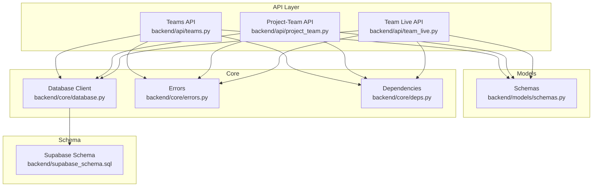
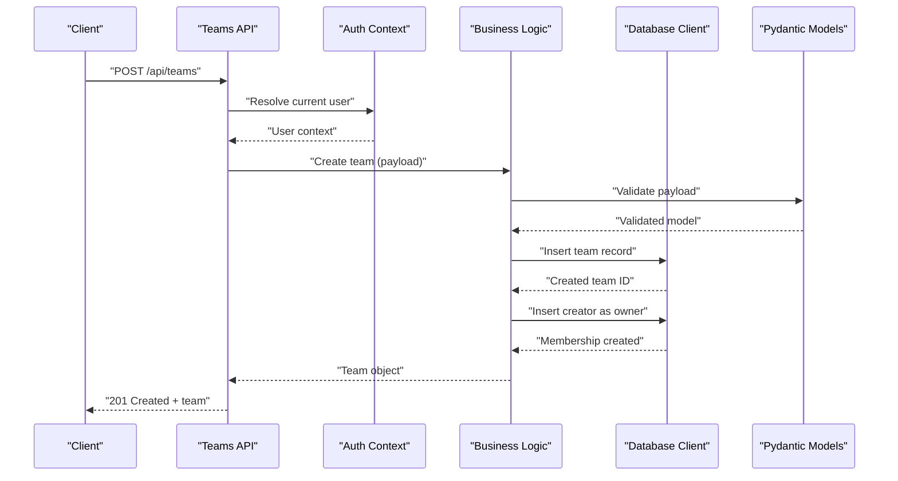
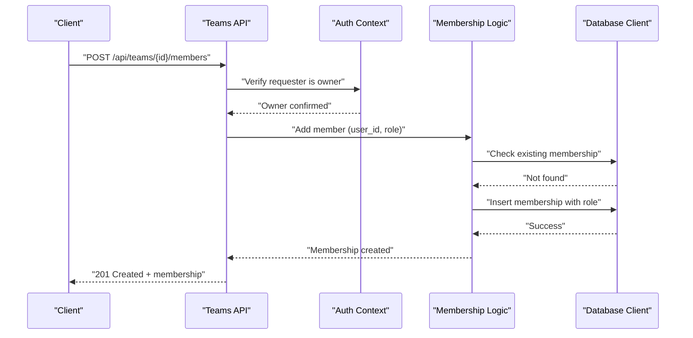
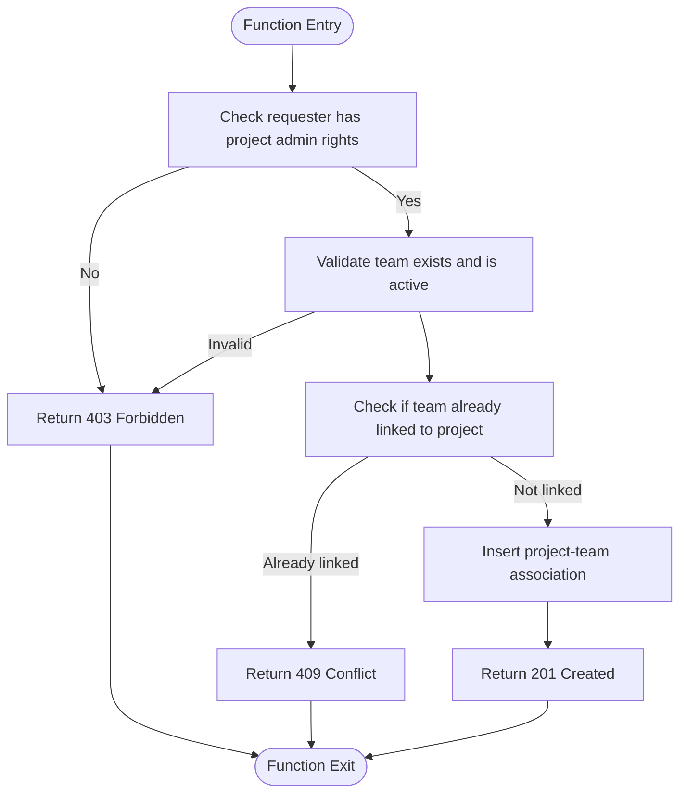
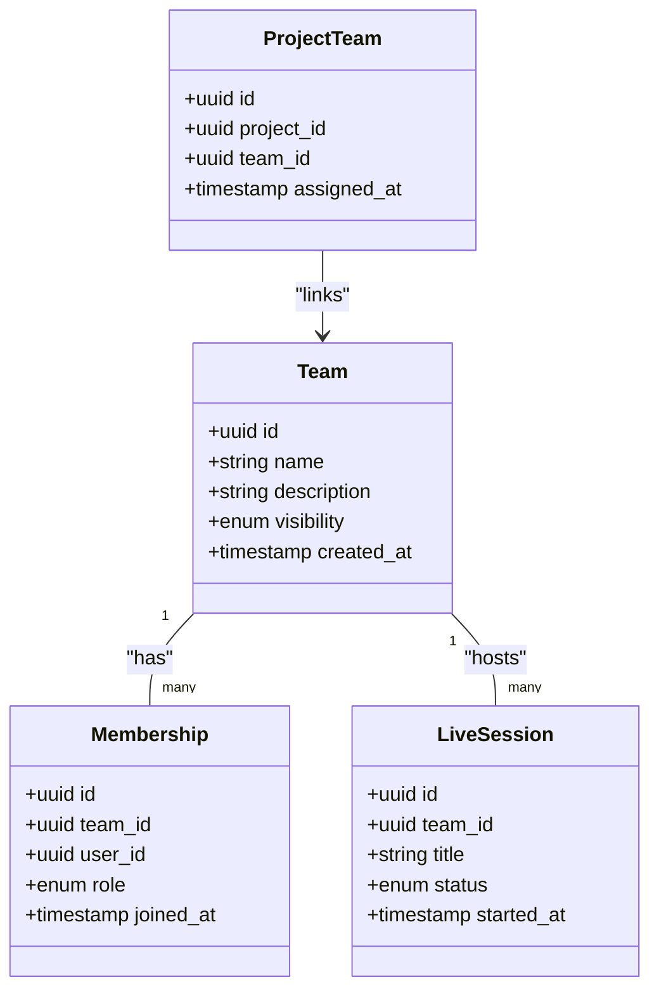
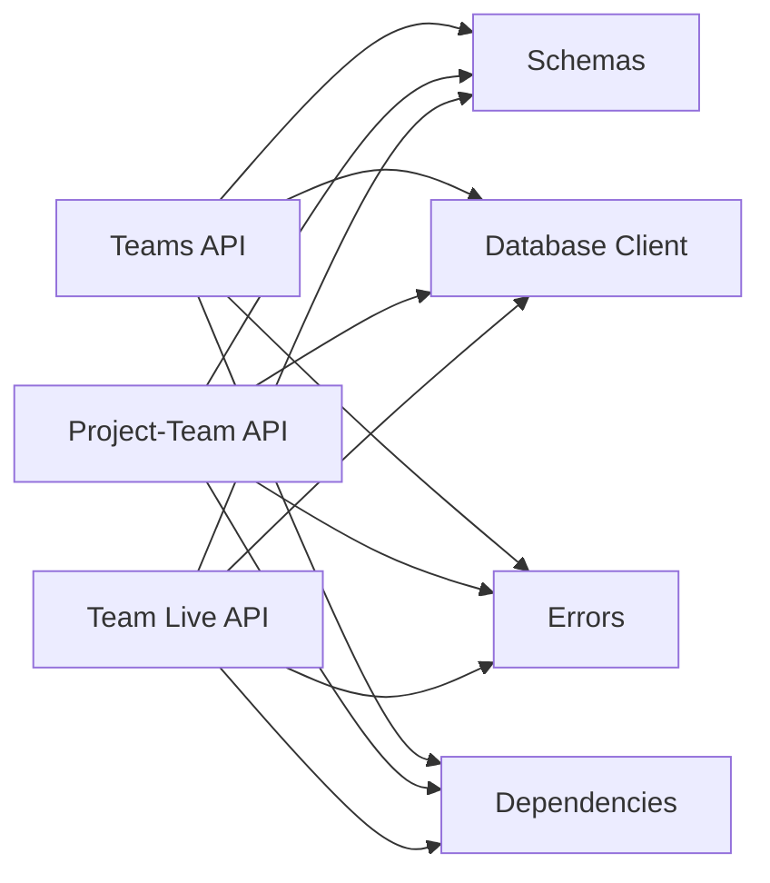

# Teams API

<cite>
**Referenced Files in This Document**
- [teams.py](file://backend/api/teams.py)
- [project_team.py](file://backend/api/project_team.py)
- [team_live.py](file://backend/api/team_live.py)
- [schemas.py](file://backend/models/schemas.py)
- [database.py](file://backend/core/database.py)
- [errors.py](file://backend/core/errors.py)
- [deps.py](file://backend/core/deps.py)
- [supabase_schema.sql](file://backend/supabase_schema.sql)
- [test_teams_create.py](file://backend/tests/test_teams_create.py)
</cite>

## Table of Contents
1. [Introduction](#introduction)
2. [Project Structure](#project-structure)
3. [Core Components](#core-components)
4. [Architecture Overview](#architecture-overview)
5. [Detailed Component Analysis](#detailed-component-analysis)
6. [Dependency Analysis](#dependency-analysis)
7. [Performance Considerations](#performance-considerations)
8. [Troubleshooting Guide](#troubleshooting-guide)
9. [Conclusion](#conclusion)
10. [Appendices](#appendices)

## Introduction
This document provides comprehensive documentation for the team management API endpoints, focusing on team creation, member management, role assignments, and collaboration features. It includes request/response schemas, membership validation rules, permission hierarchies, and team-specific operations. Practical examples cover team setup, member invitations, and collaborative workflows.

## Project Structure
The backend exposes team-related functionality through dedicated API modules:
- Team CRUD and membership operations are implemented in the teams module.
- Project-team linking and permissions are handled by the project-team module.
- Real-time collaboration features are exposed via the team-live module.
- Shared Pydantic models define request/response schemas.
- Database access is centralized with a database client and schema definitions.
- Error handling and dependency injection utilities support consistent behavior across endpoints.

**Diagram sources**
- [teams.py](file://backend/api/teams.py)
- [project_team.py](file://backend/api/project_team.py)
- [team_live.py](file://backend/api/team_live.py)
- [schemas.py](file://backend/models/schemas.py)
- [database.py](file://backend/core/database.py)
- [errors.py](file://backend/core/errors.py)
- [deps.py](file://backend/core/deps.py)
- [supabase_schema.sql](file://backend/supabase_schema.sql)

**Section sources**
- [teams.py](file://backend/api/teams.py)
- [project_team.py](file://backend/api/project_team.py)
- [team_live.py](file://backend/api/team_live.py)
- [schemas.py](file://backend/models/schemas.py)
- [database.py](file://backend/core/database.py)
- [errors.py](file://backend/core/errors.py)
- [deps.py](file://backend/core/deps.py)
- [supabase_schema.sql](file://backend/supabase_schema.sql)

## Core Components
- Teams API: Endpoints to create teams, list teams, update team metadata, manage members, assign roles, and control visibility.
- Project-Team API: Link teams to projects, enforce team-based permissions, and manage project-level access for team members.
- Team Live API: Enable real-time collaboration sessions scoped to a team (e.g., live rooms or shared workspaces).
- Schemas: Pydantic models defining request payloads and response structures for all team endpoints.
- Database Client: Centralized data access layer used by API endpoints to read/write team and membership data.
- Errors: Standardized error responses and codes for validation failures and authorization issues.
- Dependencies: Reusable dependencies such as authentication context and current user resolution.

**Section sources**
- [teams.py](file://backend/api/teams.py)
- [project_team.py](file://backend/api/project_team.py)
- [team_live.py](file://backend/api/team_live.py)
- [schemas.py](file://backend/models/schemas.py)
- [database.py](file://backend/core/database.py)
- [errors.py](file://backend/core/errors.py)
- [deps.py](file://backend/core/deps.py)

## Architecture Overview
The Teams API follows a layered architecture:
- HTTP routes in API modules handle request parsing and response formatting.
- Business logic validates inputs, enforces permissions, and orchestrates operations.
- Data access uses the database client to interact with Supabase tables defined in the schema.
- Shared schemas ensure consistent serialization/deserialization across endpoints.
- Dependency injection provides authenticated user context and reusable services.

**Diagram sources**
- [teams.py](file://backend/api/teams.py)
- [schemas.py](file://backend/models/schemas.py)
- [database.py](file://backend/core/database.py)
- [deps.py](file://backend/core/deps.py)

## Detailed Component Analysis

### Teams API
Responsibilities:
- Create teams with a creator who becomes an owner by default.
- List teams accessible to the current user based on membership and visibility.
- Update team metadata (name, description, visibility).
- Manage members: add/remove users, change roles, validate membership.
- Enforce permission checks before mutating team state.

Key endpoints:
- POST /api/teams: Create a new team.
- GET /api/teams: List teams for the current user.
- GET /api/teams/{id}: Retrieve team details.
- PATCH /api/teams/{id}: Update team metadata.
- DELETE /api/teams/{id}: Delete a team (owner-only).
- POST /api/teams/{id}/members: Add a member with a role.
- PATCH /api/teams/{id}/members/{user_id}: Update member role.
- DELETE /api/teams/{id}/members/{user_id}: Remove a member.

Request/response schemas:
- Team creation payload includes name, optional description, and visibility settings.
- Member management payloads include user identifiers and role values.
- Responses return team objects and membership records with standardized fields.

Membership validation:
- Only owners can modify membership and delete the team.
- Adding/removing members requires the requester to be an owner.
- Role changes require ownership or higher privileges.

Permission hierarchy:
- Owner: full control over team and membership.
- Admin: elevated permissions (e.g., manage members without deleting team).
- Member: read/write access to team resources within policy.
- Viewer: read-only access.

Examples:
- Team setup: Create a team with a descriptive name and set visibility to private.
- Member invitation: Add a user with role admin; subsequent role updates allowed by owners.
- Collaborative workflow: Members collaborate on linked projects after being added.

**Section sources**
- [teams.py](file://backend/api/teams.py)
- [schemas.py](file://backend/models/schemas.py)
- [errors.py](file://backend/core/errors.py)
- [deps.py](file://backend/core/deps.py)

#### Sequence Diagram: Add Team Member

**Diagram sources**
- [teams.py](file://backend/api/teams.py)
- [database.py](file://backend/core/database.py)
- [deps.py](file://backend/core/deps.py)

### Project-Team API
Responsibilities:
- Link teams to projects to enable team-scoped access.
- Enforce that only team members can access project resources according to their roles.
- Provide endpoints to manage project-team associations.

Key endpoints:
- POST /api/projects/{id}/teams: Assign a team to a project.
- GET /api/projects/{id}/teams: List teams associated with a project.
- DELETE /api/projects/{id}/teams/{team_id}: Unassign a team from a project.

Permissions:
- Project owners or admins can assign/unassign teams.
- Team members inherit project access based on their team role.

**Section sources**
- [project_team.py](file://backend/api/project_team.py)
- [schemas.py](file://backend/models/schemas.py)
- [errors.py](file://backend/core/errors.py)

#### Flowchart: Project-Team Assignment Validation

**Diagram sources**
- [project_team.py](file://backend/api/project_team.py)
- [database.py](file://backend/core/database.py)

### Team Live API
Responsibilities:
- Provide real-time collaboration endpoints scoped to a team.
- Manage live session lifecycle (create, join, leave, close).
- Ensure only team members can participate in team live sessions.

Key endpoints:
- POST /api/teams/{id}/live: Create a live session for the team.
- GET /api/teams/{id}/live/{session_id}: Join a live session.
- DELETE /api/teams/{id}/live/{session_id}: Close a live session.

Access control:
- Session creation requires team ownership or admin role.
- Joining requires valid membership in the team.

**Section sources**
- [team_live.py](file://backend/api/team_live.py)
- [schemas.py](file://backend/models/schemas.py)
- [errors.py](file://backend/core/errors.py)

#### Class Diagram: Team Collaboration Entities

**Diagram sources**
- [supabase_schema.sql](file://backend/supabase_schema.sql)
- [schemas.py](file://backend/models/schemas.py)

## Dependency Analysis
- API modules depend on shared schemas for input/output validation.
- All endpoints use the database client for persistence.
- Authentication and authorization rely on dependency injection to resolve the current user and verify permissions.
- Error handling is centralized to provide consistent error responses.

**Diagram sources**
- [teams.py](file://backend/api/teams.py)
- [project_team.py](file://backend/api/project_team.py)
- [team_live.py](file://backend/api/team_live.py)
- [schemas.py](file://backend/models/schemas.py)
- [database.py](file://backend/core/database.py)
- [errors.py](file://backend/core/errors.py)
- [deps.py](file://backend/core/deps.py)

**Section sources**
- [teams.py](file://backend/api/teams.py)
- [project_team.py](file://backend/api/project_team.py)
- [team_live.py](file://backend/api/team_live.py)
- [schemas.py](file://backend/models/schemas.py)
- [database.py](file://backend/core/database.py)
- [errors.py](file://backend/core/errors.py)
- [deps.py](file://backend/core/deps.py)

## Performance Considerations
- Use pagination when listing teams or memberships to avoid large payloads.
- Cache frequently accessed team metadata at the application layer where appropriate.
- Minimize N+1 queries by batching membership lookups and using joins provided by the database client.
- Validate inputs early to reduce unnecessary database writes.
- Leverage indexes on foreign keys (team_id, user_id, project_id) for faster lookups.

[No sources needed since this section provides general guidance]

## Troubleshooting Guide
Common issues and resolutions:
- Authorization errors: Ensure the requester holds the required role (owner/admin) for the operation.
- Membership conflicts: Attempting to add an existing member should return a conflict response; check for duplicate entries.
- Invalid payloads: Validate request bodies against schemas; missing required fields will result in validation errors.
- Database constraints: Foreign key violations indicate invalid references; verify team and user existence.

Diagnostic steps:
- Inspect error responses for structured error codes and messages.
- Log request IDs and user context to trace authorization decisions.
- Verify schema definitions match expected inputs and outputs.

**Section sources**
- [errors.py](file://backend/core/errors.py)
- [schemas.py](file://backend/models/schemas.py)
- [test_teams_create.py](file://backend/tests/test_teams_create.py)

## Conclusion
The Teams API provides robust capabilities for creating and managing teams, controlling membership and roles, and enabling collaboration through project linkages and live sessions. Clear permission hierarchies and validated schemas ensure secure and predictable behavior. Following the examples and guidelines in this document will help you implement effective team workflows and integrate seamlessly with the platform’s collaboration features.

[No sources needed since this section summarizes without analyzing specific files]

## Appendices

### Example Workflows

- Team Setup:
  - Create a team with a descriptive name and set visibility to private.
  - The creator automatically becomes an owner.
  - Optionally add initial members with admin roles.

- Member Invitation:
  - Add a user to the team with a chosen role.
  - If the user is not yet registered, follow your registration flow first.
  - Owners can update roles later.

- Collaborative Workflow:
  - Link the team to one or more projects.
  - Team members gain access to project resources based on their roles.
  - Start a live session for real-time collaboration among team members.

[No sources needed since this section provides conceptual examples]