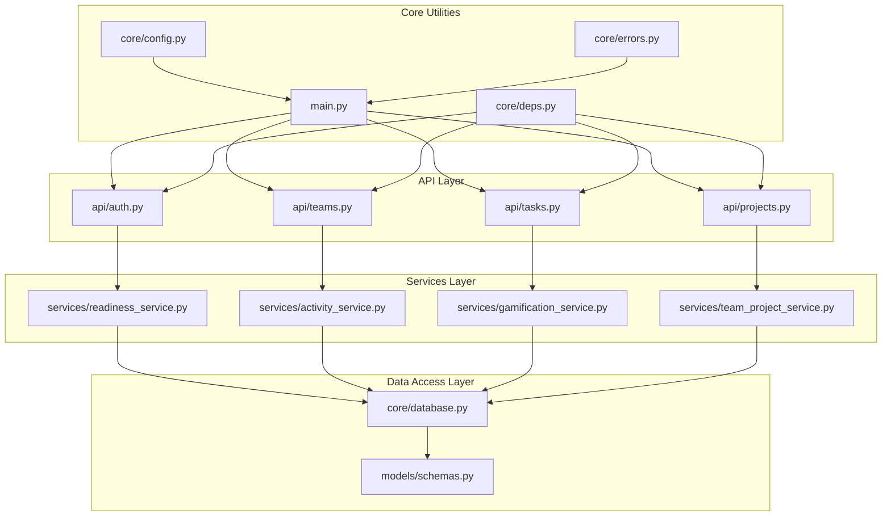
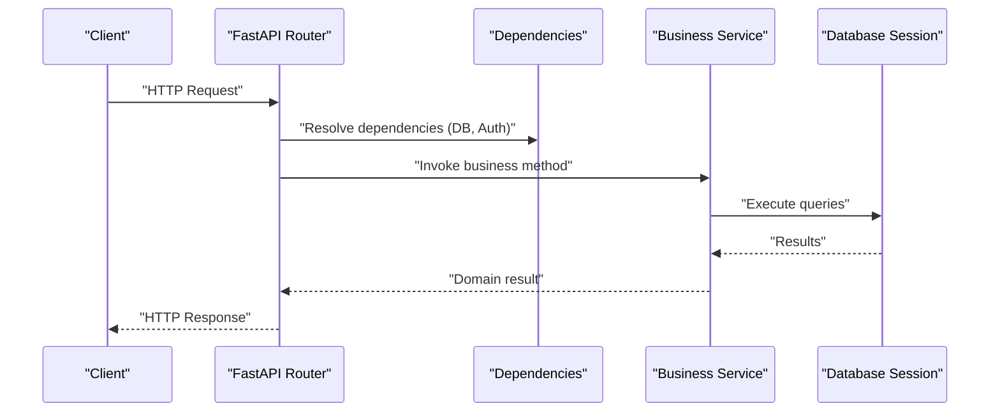
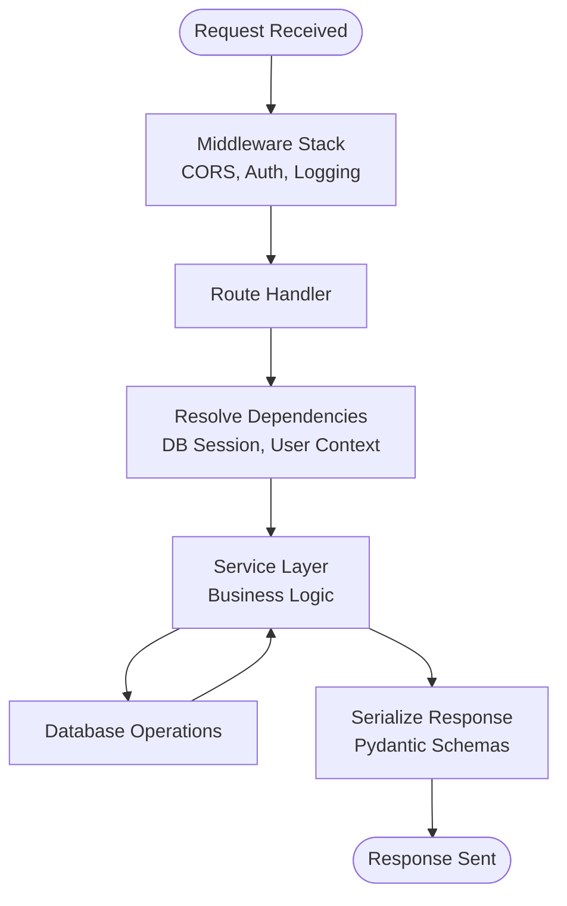
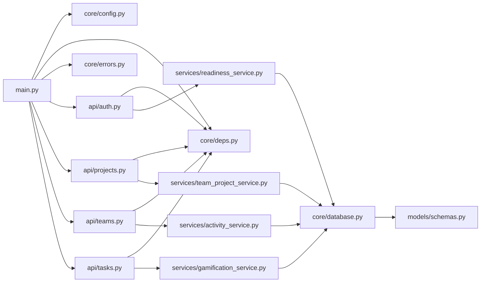

# Backend Architecture

<cite>
**Referenced Files in This Document**
- [main.py](file://backend/main.py)
- [config.py](file://backend/core/config.py)
- [database.py](file://backend/core/database.py)
- [deps.py](file://backend/core/deps.py)
- [errors.py](file://backend/core/errors.py)
- [auth.py](file://backend/api/auth.py)
- [projects.py](file://backend/api/projects.py)
- [teams.py](file://backend/api/teams.py)
- [tasks.py](file://backend/api/tasks.py)
- [readiness_service.py](file://backend/services/readiness_service.py)
- [activity_service.py](file://backend/services/activity_service.py)
- [gamification_service.py](file://backend/services/gamification_service.py)
- [team_project_service.py](file://backend/services/team_project_service.py)
- [schemas.py](file://backend/models/schemas.py)
</cite>

## Table of Contents
1. [Introduction](#introduction)
2. [Project Structure](#project-structure)
3. [Core Components](#core-components)
4. [Architecture Overview](#architecture-overview)
5. [Detailed Component Analysis](#detailed-component-analysis)
6. [Dependency Analysis](#dependency-analysis)
7. [Performance Considerations](#performance-considerations)
8. [Troubleshooting Guide](#troubleshooting-guide)
9. [Conclusion](#conclusion)

## Introduction
This document describes the layered architecture of the FastAPI Python backend. It explains how API endpoints, business logic services, data access layer, and core utilities interact. It also documents dependency injection patterns, request/response lifecycle, error handling strategies, middleware implementation, service layer abstraction, database interaction patterns, and configuration management. Visual diagrams illustrate request flows and module relationships to help both technical and non-technical readers understand the system.

## Project Structure
The backend is organized into clear layers:
- API layer (FastAPI routers): routes and request/response mapping
- Services layer: business logic and orchestration
- Data access layer: database interactions via SQLAlchemy or Supabase client
- Core utilities: configuration, database setup, dependency providers, errors, logging, languages
- Models: Pydantic schemas for validation and serialization

**Diagram sources**
- [main.py](file://backend/main.py)
- [config.py](file://backend/core/config.py)
- [database.py](file://backend/core/database.py)
- [deps.py](file://backend/core/deps.py)
- [errors.py](file://backend/core/errors.py)
- [auth.py](file://backend/api/auth.py)
- [projects.py](file://backend/api/projects.py)
- [teams.py](file://backend/api/teams.py)
- [tasks.py](file://backend/api/tasks.py)
- [readiness_service.py](file://backend/services/readiness_service.py)
- [activity_service.py](file://backend/services/activity_service.py)
- [gamification_service.py](file://backend/services/gamification_service.py)
- [team_project_service.py](file://backend/services/team_project_service.py)
- [schemas.py](file://backend/models/schemas.py)

**Section sources**
- [main.py](file://backend/main.py)
- [config.py](file://backend/core/config.py)
- [database.py](file://backend/core/database.py)
- [deps.py](file://backend/core/deps.py)
- [errors.py](file://backend/core/errors.py)
- [auth.py](file://backend/api/auth.py)
- [projects.py](file://backend/api/projects.py)
- [teams.py](file://backend/api/teams.py)
- [tasks.py](file://backend/api/tasks.py)
- [readiness_service.py](file://backend/services/readiness_service.py)
- [activity_service.py](file://backend/services/activity_service.py)
- [gamification_service.py](file://backend/services/gamification_service.py)
- [team_project_service.py](file://backend/services/team_project_service.py)
- [schemas.py](file://backend/models/schemas.py)

## Core Components
- Application bootstrap and middleware registration: centralizes app creation, lifespan events, CORS, authentication, and router mounting.
- Configuration management: environment-driven settings loaded at startup.
- Database initialization: connection setup, session factories, and migration hooks.
- Dependency providers: reusable dependencies for DB sessions, auth context, and services.
- Error handling: centralized exception handlers and standardized error responses.
- API routers: route definitions with request validation and response models.
- Service layer: encapsulates business rules, orchestrates multiple data operations, and exposes clean interfaces to the API layer.
- Data models: Pydantic schemas for input/output validation and serialization.

Key responsibilities by file:
- main.py: App factory, middleware stack, lifespan, router inclusion.
- core/config.py: Settings and environment variables.
- core/database.py: Engine/session setup and helpers.
- core/deps.py: Dependency functions used by routers and services.
- core/errors.py: Custom exceptions and global handlers.
- api/*: Route handlers that delegate to services.
- services/*: Business logic implementations.
- models/schemas.py: Request/response schemas.

**Section sources**
- [main.py](file://backend/main.py)
- [config.py](file://backend/core/config.py)
- [database.py](file://backend/core/database.py)
- [deps.py](file://backend/core/deps.py)
- [errors.py](file://backend/core/errors.py)
- [auth.py](file://backend/api/auth.py)
- [projects.py](file://backend/api/projects.py)
- [teams.py](file://backend/api/teams.py)
- [tasks.py](file://backend/api/tasks.py)
- [readiness_service.py](file://backend/services/readiness_service.py)
- [activity_service.py](file://backend/services/activity_service.py)
- [gamification_service.py](file://backend/services/gamification_service.py)
- [team_project_service.py](file://backend/services/team_project_service.py)
- [schemas.py](file://backend/models/schemas.py)

## Architecture Overview
The backend follows a layered architecture:
- API layer receives HTTP requests, validates inputs, and delegates to services.
- Services implement business logic and coordinate data access.
- Data access layer interacts with the database using configured sessions.
- Core utilities provide shared infrastructure (config, deps, errors).

**Diagram sources**
- [main.py](file://backend/main.py)
- [deps.py](file://backend/core/deps.py)
- [database.py](file://backend/core/database.py)
- [auth.py](file://backend/api/auth.py)
- [projects.py](file://backend/api/projects.py)
- [readiness_service.py](file://backend/services/readiness_service.py)

## Detailed Component Analysis

### API Endpoints Layer
Responsibilities:
- Define routes and HTTP methods
- Validate request payloads using Pydantic schemas
- Extract dependencies (DB session, user context)
- Delegate to services and format responses

Patterns:
- Use dependency injection for DB sessions and authenticated user context
- Centralize error handling via FastAPI exception handlers
- Keep route handlers thin; move logic to services

Example modules:
- Authentication endpoints
- Projects endpoints
- Teams endpoints
- Tasks endpoints

**Section sources**
- [auth.py](file://backend/api/auth.py)
- [projects.py](file://backend/api/projects.py)
- [teams.py](file://backend/api/teams.py)
- [tasks.py](file://backend/api/tasks.py)
- [schemas.py](file://backend/models/schemas.py)
- [deps.py](file://backend/core/deps.py)

### Business Logic Services
Responsibilities:
- Implement domain rules and workflows
- Orchestrate multiple data operations
- Enforce authorization checks where applicable
- Return domain objects or DTOs

Modules:
- Readiness service: readiness calculations and reporting
- Activity service: activity tracking and aggregation
- Gamification service: achievements and scoring logic
- Team-project service: linking teams to projects and related operations

Design notes:
- Services depend on DB session via injected dependencies
- Services are stateless and testable
- They return plain data structures compatible with Pydantic schemas

**Section sources**
- [readiness_service.py](file://backend/services/readiness_service.py)
- [activity_service.py](file://backend/services/activity_service.py)
- [gamification_service.py](file://backend/services/gamification_service.py)
- [team_project_service.py](file://backend/services/team_project_service.py)
- [deps.py](file://backend/core/deps.py)

### Data Access Layer
Responsibilities:
- Provide database connections and sessions
- Execute CRUD operations and complex queries
- Map results to domain objects or Pydantic schemas

Implementation highlights:
- Centralized engine/session configuration
- Helper functions for common operations
- Consistent transaction boundaries managed by services

**Section sources**
- [database.py](file://backend/core/database.py)
- [schemas.py](file://backend/models/schemas.py)

### Core Utilities
Configuration:
- Environment-based settings loaded at startup
- Typed configuration objects consumed by other layers

Database:
- Connection pooling and session lifecycle
- Migration hooks and initialization routines

Dependencies:
- Reusable dependency providers for DB sessions, auth context, and services

Errors:
- Custom exceptions and global handlers for consistent error responses

Logging and languages:
- Structured logging setup
- Language constants and helpers

**Section sources**
- [config.py](file://backend/core/config.py)
- [database.py](file://backend/core/database.py)
- [deps.py](file://backend/core/deps.py)
- [errors.py](file://backend/core/errors.py)

### Request/Response Lifecycle
End-to-end flow:
- Middleware processes headers, CORS, and auth
- Router resolves path and parameters
- Dependencies inject DB session and user context
- Service executes business logic
- Database returns results
- Router serializes response using Pydantic schemas

**Diagram sources**
- [main.py](file://backend/main.py)
- [deps.py](file://backend/core/deps.py)
- [database.py](file://backend/core/database.py)
- [schemas.py](file://backend/models/schemas.py)

### Dependency Injection Pattern
FastAPI’s dependency injection is used to:
- Provide DB sessions to routers and services
- Inject authenticated user context
- Wire up service instances for reuse

Benefits:
- Testability via mocking
- Clear separation of concerns
- Reduced boilerplate in route handlers

**Section sources**
- [deps.py](file://backend/core/deps.py)
- [auth.py](file://backend/api/auth.py)
- [projects.py](file://backend/api/projects.py)
- [teams.py](file://backend/api/teams.py)
- [tasks.py](file://backend/api/tasks.py)

### Error Handling Strategies
Approach:
- Define custom exceptions for domain-specific errors
- Register global exception handlers to standardize responses
- Ensure consistent status codes and error shapes

Integration points:
- Routers raise typed exceptions
- Services propagate domain errors
- Core error module centralizes formatting and logging

**Section sources**
- [errors.py](file://backend/core/errors.py)
- [main.py](file://backend/main.py)

### Middleware Implementation
Typical middleware responsibilities:
- Cross-origin resource sharing (CORS)
- Authentication and authorization checks
- Request/response logging and metrics
- Security headers and rate limiting

Placement:
- Configured during application startup in the main entry point
- Applied before routing to intercept all requests

**Section sources**
- [main.py](file://backend/main.py)

### Database Interaction Patterns
Patterns:
- Session-per-request lifecycle
- Repository-like helper functions for common queries
- Transaction boundaries managed within services
- Mapping between ORM entities and Pydantic schemas

Considerations:
- Connection pooling for performance
- Explicit error propagation from DB layer
- Idempotent operations where possible

**Section sources**
- [database.py](file://backend/core/database.py)
- [schemas.py](file://backend/models/schemas.py)

### Configuration Management
Practices:
- Load settings from environment variables
- Provide typed configuration objects
- Separate development and production configurations
- Expose minimal runtime config to services and routers

**Section sources**
- [config.py](file://backend/core/config.py)

## Dependency Analysis
High-level module dependencies:
- main.py depends on core utilities and mounts API routers
- API routers depend on services and core dependencies
- Services depend on database layer and schemas
- Core utilities are foundational and reused across layers

**Diagram sources**
- [main.py](file://backend/main.py)
- [config.py](file://backend/core/config.py)
- [deps.py](file://backend/core/deps.py)
- [errors.py](file://backend/core/errors.py)
- [auth.py](file://backend/api/auth.py)
- [projects.py](file://backend/api/projects.py)
- [teams.py](file://backend/api/teams.py)
- [tasks.py](file://backend/api/tasks.py)
- [readiness_service.py](file://backend/services/readiness_service.py)
- [activity_service.py](file://backend/services/activity_service.py)
- [gamification_service.py](file://backend/services/gamification_service.py)
- [team_project_service.py](file://backend/services/team_project_service.py)
- [database.py](file://backend/core/database.py)
- [schemas.py](file://backend/models/schemas.py)

**Section sources**
- [main.py](file://backend/main.py)
- [config.py](file://backend/core/config.py)
- [deps.py](file://backend/core/deps.py)
- [errors.py](file://backend/core/errors.py)
- [auth.py](file://backend/api/auth.py)
- [projects.py](file://backend/api/projects.py)
- [teams.py](file://backend/api/teams.py)
- [tasks.py](file://backend/api/tasks.py)
- [readiness_service.py](file://backend/services/readiness_service.py)
- [activity_service.py](file://backend/services/activity_service.py)
- [gamification_service.py](file://backend/services/gamification_service.py)
- [team_project_service.py](file://backend/services/team_project_service.py)
- [database.py](file://backend/core/database.py)
- [schemas.py](file://backend/models/schemas.py)

## Performance Considerations
- Use connection pooling and tune pool sizes based on workload
- Prefer batched queries and avoid N+1 query patterns
- Cache frequently accessed read-only data when appropriate
- Keep route handlers thin to reduce overhead
- Profile critical paths and add metrics/logging selectively

[No sources needed since this section provides general guidance]

## Troubleshooting Guide
Common issues and resolutions:
- Authentication failures: verify middleware order and token validation
- Database connectivity errors: check configuration and connection strings
- Validation errors: inspect Pydantic schema constraints and request payloads
- Unexpected server errors: review global exception handlers and logs

Debugging tips:
- Enable structured logging for requests and errors
- Add tracing around service calls and DB operations
- Use dependency overrides in tests to isolate components

**Section sources**
- [errors.py](file://backend/core/errors.py)
- [main.py](file://backend/main.py)
- [deps.py](file://backend/core/deps.py)

## Conclusion
The backend implements a clean, layered architecture with clear separation of concerns. FastAPI’s dependency injection simplifies wiring and testing. Services encapsulate business logic, while the data access layer abstracts database interactions. Centralized configuration and error handling ensure consistency and maintainability. The provided diagrams illustrate request flows and module relationships to aid understanding and future enhancements.