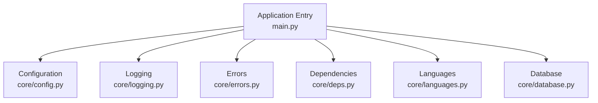
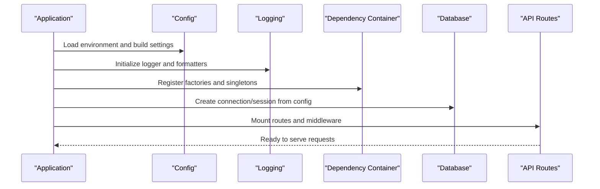
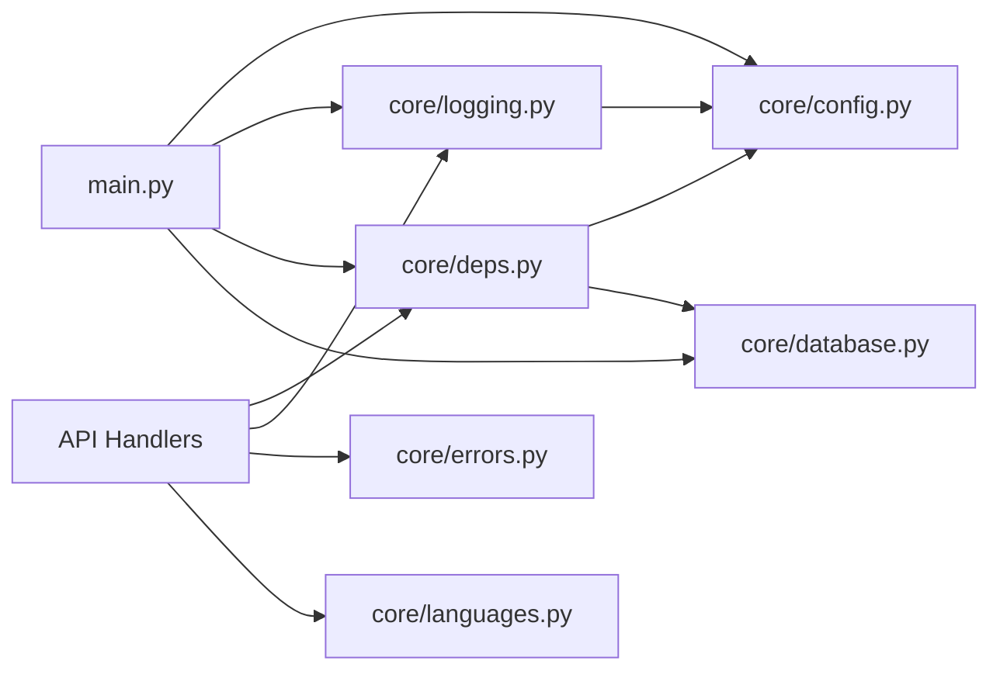

# Core Utilities & Configuration

<cite>
**Referenced Files in This Document**
- [main.py](file://backend/main.py)
- [config.py](file://backend/core/config.py)
- [logging.py](file://backend/core/logging.py)
- [errors.py](file://backend/core/errors.py)
- [deps.py](file://backend/core/deps.py)
- [languages.py](file://backend/core/languages.py)
- [database.py](file://backend/core/database.py)
</cite>

## Table of Contents
1. [Introduction](#introduction)
2. [Project Structure](#project-structure)
3. [Core Components](#core-components)
4. [Architecture Overview](#architecture-overview)
5. [Detailed Component Analysis](#detailed-component-analysis)
6. [Dependency Analysis](#dependency-analysis)
7. [Performance Considerations](#performance-considerations)
8. [Troubleshooting Guide](#troubleshooting-guide)
9. [Conclusion](#conclusion)

## Introduction
This document explains the core utilities and configuration management that underpin the backend application. It focuses on how configuration is loaded, how logging is configured, how errors are modeled and handled, how dependency injection is structured, and how language support is provided. It also covers environment variable management, logging patterns, custom exception classes, and utility organization with concrete examples for configuration loading, log formatting, error response handling, and dependency resolution.

## Project Structure
The backend organizes cross-cutting concerns into a dedicated core package:
- Configuration: centralized settings and environment-driven values
- Logging: structured logging setup and formatters
- Errors: custom exceptions and standardized error responses
- Dependencies: dependency injection container and resolvers
- Languages: i18n helpers and supported locales
- Database: database connection and session management

**Diagram sources**
- [main.py:1-200](file://backend/main.py#L1-L200)
- [config.py:1-200](file://backend/core/config.py#L1-L200)
- [logging.py:1-200](file://backend/core/logging.py#L1-L200)
- [errors.py:1-200](file://backend/core/errors.py#L1-L200)
- [deps.py:1-200](file://backend/core/deps.py#L1-L200)
- [languages.py:1-200](file://backend/core/languages.py#L1-L200)
- [database.py:1-200](file://backend/core/database.py#L1-L200)

**Section sources**
- [main.py:1-200](file://backend/main.py#L1-L200)

## Core Components
- Configuration system: loads environment variables, validates required settings, exposes typed accessors, and supports defaults.
- Logging framework: initializes structured logs, sets levels per environment, and formats messages consistently across services.
- Error handling infrastructure: defines custom exceptions, maps them to HTTP responses, and standardizes error payloads.
- Dependency injection container: registers factories, resolves dependencies, and provides scoped instances.
- Language support: manages locale selection, translation keys, and fallback behavior.
- Database integration: configures connections and sessions based on environment.

Key responsibilities and interactions:
- The application entry point wires configuration, logging, and DI before starting the server.
- Services consume dependencies via the DI container rather than global state.
- Errors raised in handlers are caught and transformed into consistent JSON responses.
- Logging is attached to request/response lifecycle hooks for observability.

**Section sources**
- [config.py:1-200](file://backend/core/config.py#L1-L200)
- [logging.py:1-200](file://backend/core/logging.py#L1-L200)
- [errors.py:1-200](file://backend/core/errors.py#L1-L200)
- [deps.py:1-200](file://backend/core/deps.py#L1-L200)
- [languages.py:1-200](file://backend/core/languages.py#L1-L200)
- [database.py:1-200](file://backend/core/database.py#L1-L200)

## Architecture Overview
The runtime initialization sequence ensures all subsystems are ready before serving requests.

**Diagram sources**
- [main.py:1-200](file://backend/main.py#L1-L200)
- [config.py:1-200](file://backend/core/config.py#L1-L200)
- [logging.py:1-200](file://backend/core/logging.py#L1-L200)
- [deps.py:1-200](file://backend/core/deps.py#L1-L200)
- [database.py:1-200](file://backend/core/database.py#L1-L200)

## Detailed Component Analysis

### Configuration System
Responsibilities:
- Read environment variables with type coercion and defaults
- Validate required keys and fail fast at startup if missing
- Provide a typed configuration object consumed by other modules
- Support multiple environments (development, staging, production)

Patterns:
- Centralized config loader with explicit schema
- Lazy evaluation for expensive settings
- Environment-specific overrides

Example usage references:
- Loading configuration at startup
- Accessing typed settings in services
- Validating required environment variables

**Section sources**
- [config.py:1-200](file://backend/core/config.py#L1-L200)

### Logging Framework
Responsibilities:
- Configure root logger with consistent formatters
- Set log levels per environment
- Attach contextual fields (request id, user id, etc.)
- Provide helper functions for structured logs

Patterns:
- Structured logging with key-value pairs
- Request-scoped context propagation
- Separate handlers for stdout and file output

Example usage references:
- Initializing logging in application bootstrap
- Emitting info/warn/error logs with context
- Formatting logs for external collectors

**Section sources**
- [logging.py:1-200](file://backend/core/logging.py#L1-L200)

### Error Handling Infrastructure
Responsibilities:
- Define custom exception classes for domain and transport errors
- Map exceptions to HTTP status codes and JSON payloads
- Provide middleware or handlers to catch and respond uniformly
- Include correlation ids and stack traces in development

Patterns:
- Explicit error types with metadata
- Centralized error serialization
- Graceful degradation and retry hints where applicable

Example usage references:
- Raising custom exceptions in services
- Global error handler converting exceptions to responses
- Client-facing error message construction

**Section sources**
- [errors.py:1-200](file://backend/core/errors.py#L1-L200)

### Dependency Injection Container
Responsibilities:
- Register factories and singletons
- Resolve dependencies with proper scoping
- Provide accessors for services and repositories
- Enable test doubles and mocking

Patterns:
- Factory registration with signatures
- Singleton caching per scope
- Clear separation between composition root and consumers

Example usage references:
- Registering service factories
- Resolving dependencies in route handlers
- Overriding implementations in tests

**Section sources**
- [deps.py:1-200](file://backend/core/deps.py#L1-L200)

### Language Support
Responsibilities:
- Manage supported locales and fallback chains
- Provide helpers to resolve current language from request headers or context
- Expose translation lookup utilities
- Ensure consistent pluralization and formatting rules

Patterns:
- Locale negotiation strategy
- Key-based translations with defaults
- Pluralization and date/time formatting utilities

Example usage references:
- Selecting language per request
- Translating error messages and UI strings
- Falling back to default locale

**Section sources**
- [languages.py:1-200](file://backend/core/languages.py#L1-L200)

### Database Integration
Responsibilities:
- Build connection parameters from configuration
- Manage session lifecycles and pooling
- Provide repository abstractions or ORM sessions
- Handle connection errors and retries

Patterns:
- Connection factory based on environment
- Scoped sessions per request
- Transaction boundaries for write paths

Example usage references:
- Creating engine/session from config
- Using sessions in services
- Closing connections on shutdown

**Section sources**
- [database.py:1-200](file://backend/core/database.py#L1-L200)

## Dependency Analysis
The following diagram shows how core modules depend on each other during initialization and runtime.

**Diagram sources**
- [main.py:1-200](file://backend/main.py#L1-L200)
- [config.py:1-200](file://backend/core/config.py#L1-L200)
- [logging.py:1-200](file://backend/core/logging.py#L1-L200)
- [deps.py:1-200](file://backend/core/deps.py#L1-L200)
- [database.py:1-200](file://backend/core/database.py#L1-L200)
- [errors.py:1-200](file://backend/core/errors.py#L1-L200)
- [languages.py:1-200](file://backend/core/languages.py#L1-L200)

**Section sources**
- [main.py:1-200](file://backend/main.py#L1-L200)

## Performance Considerations
- Prefer lazy initialization for heavy resources (e.g., database pools, caches).
- Reuse logger instances and avoid excessive string formatting in hot paths.
- Cache resolved dependencies within scopes to prevent repeated lookups.
- Use connection pooling and tune pool sizes according to workload.
- Keep error payloads minimal in production; include detailed diagnostics only in development.

[No sources needed since this section provides general guidance]

## Troubleshooting Guide
Common issues and resolutions:
- Missing environment variables: ensure all required keys are present; validate at startup and surface clear messages.
- Logging not capturing context: verify request-scoped context is set and propagated through handlers.
- Dependency resolution failures: check factory registrations and signature compatibility; inspect container state in tests.
- Database connection errors: confirm connection parameters and network reachability; enable retries and timeouts.
- Inconsistent error responses: ensure global error handler is mounted and custom exceptions are raised instead of generic exceptions.

**Section sources**
- [config.py:1-200](file://backend/core/config.py#L1-L200)
- [logging.py:1-200](file://backend/core/logging.py#L1-L200)
- [deps.py:1-200](file://backend/core/deps.py#L1-L200)
- [database.py:1-200](file://backend/core/database.py#L1-L200)
- [errors.py:1-200](file://backend/core/errors.py#L1-L200)

## Conclusion
The core utilities provide a robust foundation for configuration, logging, error handling, dependency injection, and language support. By centralizing these concerns, the application achieves consistency, maintainability, and scalability. Following the patterns outlined here will help new contributors integrate features smoothly while preserving reliability and observability.

[No sources needed since this section summarizes without analyzing specific files]