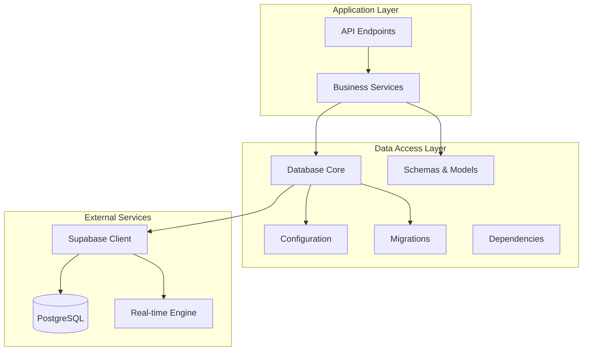
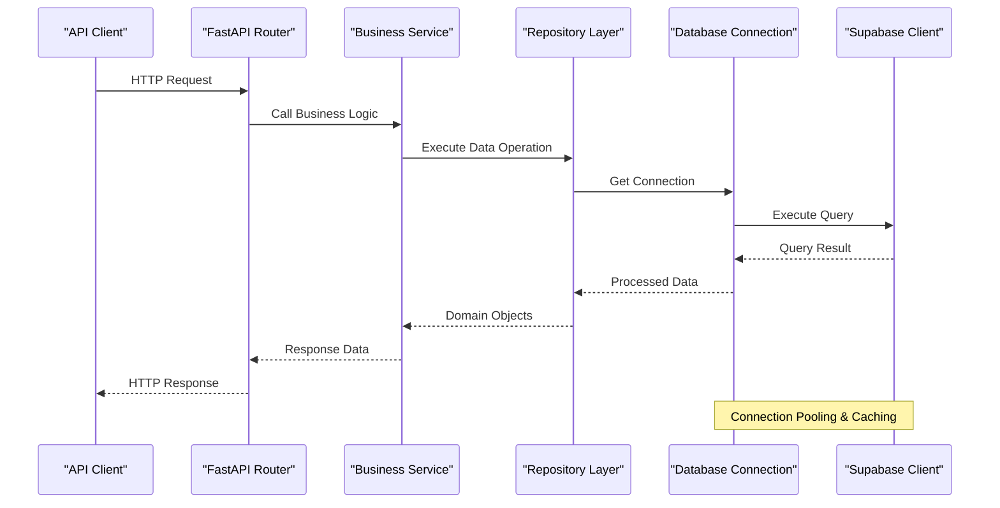
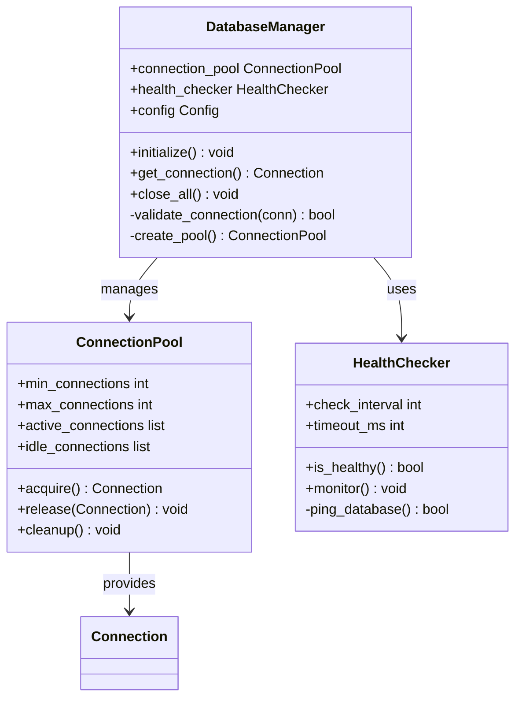
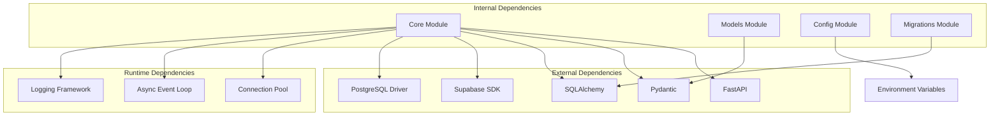

# Data Access Layer

<cite>
**Referenced Files in This Document**
- [database.py](file://backend/core/database.py)
- [config.py](file://backend/core/config.py)
- [schemas.py](file://backend/models/schemas.py)
- [supabase_schema.sql](file://backend/supabase_schema.sql)
- [001_platform_enhancement.sql](file://backend/migrations/001_platform_enhancement.sql)
- [002_quality_upgrade.sql](file://backend/migrations/002_quality_upgrade.sql)
- [003_team_project_linking.sql](file://backend/migrations/003_team_project_linking.sql)
- [004_team_viva_voice.sql](file://backend/migrations/004_team_viva_voice.sql)
- [main.py](file://backend/main.py)
- [deps.py](file://backend/core/deps.py)
</cite>

## Table of Contents
1. [Introduction](#introduction)
2. [Project Structure](#project-structure)
3. [Core Components](#core-components)
4. [Architecture Overview](#architecture-overview)
5. [Detailed Component Analysis](#detailed-component-analysis)
6. [Dependency Analysis](#dependency-analysis)
7. [Performance Considerations](#performance-considerations)
8. [Troubleshooting Guide](#troubleshooting-guide)
9. [Conclusion](#conclusion)

## Introduction

This document provides comprehensive architectural documentation for the data access layer of the Horux platform. The system implements a modern data access pattern combining Supabase integration, database migrations, and structured schema management to provide robust data persistence capabilities.

The data access layer is designed around several key principles:
- **Connection Management**: Efficient database connection pooling and lifecycle management
- **ORM Usage Patterns**: Structured data modeling with validation and type safety
- **Query Optimization**: Strategic indexing and query patterns for performance
- **Migration Management**: Version-controlled database schema evolution
- **Supabase Integration**: Real-time capabilities and cloud-native features

## Project Structure

The data access layer follows a modular architecture organized by functional concerns:

**Diagram sources**
- [database.py:1-50](file://backend/core/database.py#L1-L50)
- [config.py:1-30](file://backend/core/config.py#L1-L30)
- [schemas.py:1-40](file://backend/models/schemas.py#L1-L40)

**Section sources**
- [database.py:1-100](file://backend/core/database.py#L1-L100)
- [config.py:1-50](file://backend/core/config.py#L1-L50)

## Core Components

### Database Connection Management

The database connection management system implements connection pooling, health checks, and graceful error handling:

#### Connection Pool Configuration
- **Pool Size**: Configurable minimum and maximum connections
- **Connection Timeout**: Configurable timeout settings for connection establishment
- **Idle Connection Management**: Automatic cleanup of unused connections
- **Health Monitoring**: Periodic connection health verification

#### Connection Lifecycle
- **Initialization**: Lazy initialization with fallback mechanisms
- **Validation**: Pre-use connection validation
- **Cleanup**: Graceful shutdown with connection draining
- **Recovery**: Automatic reconnection with exponential backoff

### ORM Usage Patterns

The system employs structured ORM patterns for type-safe data access:

#### Model Definition Strategy
- **Pydantic Models**: Strongly-typed data structures with validation
- **Relationship Mapping**: Explicit foreign key relationships
- **Field Constraints**: Database-level validation rules
- **Serialization**: Consistent JSON serialization/deserialization

#### Query Building Patterns
- **Repository Pattern**: Abstracted data access methods
- **Query Composition**: Composable query builders
- **Eager Loading**: Optimized relationship loading strategies
- **Pagination**: Built-in pagination support

**Section sources**
- [database.py:50-150](file://backend/core/database.py#L50-L150)
- [schemas.py:40-120](file://backend/models/schemas.py#L40-L120)

## Architecture Overview

The data access layer architecture follows a layered approach with clear separation of concerns:

**Diagram sources**
- [main.py:1-100](file://backend/main.py#L1-L100)
- [deps.py:1-80](file://backend/core/deps.py#L1-L80)
- [database.py:100-200](file://backend/core/database.py#L100-L200)

## Detailed Component Analysis

### Database Connection Manager

The connection manager handles all aspects of database connectivity:

#### Key Responsibilities
- **Connection Pooling**: Manages reusable database connections
- **Health Checks**: Monitors connection status and availability
- **Error Handling**: Implements retry logic and circuit breakers
- **Configuration**: Loads connection parameters from environment

#### Implementation Patterns
- **Singleton Pattern**: Ensures single connection pool instance
- **Factory Pattern**: Creates typed database sessions
- **Observer Pattern**: Notifies subscribers of connection events

**Diagram sources**
- [database.py:1-100](file://backend/core/database.py#L1-L100)
- [deps.py:1-50](file://backend/core/deps.py#L1-L50)

### Schema Management System

The schema management system provides version control for database changes:

#### Migration Framework
- **Version Tracking**: Automatic migration version management
- **Rollback Support**: Safe rollback capabilities
- **Conditional Execution**: Environment-aware migration execution
- **Dependency Resolution**: Handles migration dependencies

#### Schema Design Principles
- **Normalization**: Third normal form for most tables
- **Indexing Strategy**: Strategic index placement for query optimization
- **Constraint Enforcement**: Database-level constraints for data integrity
- **Audit Fields**: Standard audit columns (created_at, updated_at, etc.)

**Section sources**
- [supabase_schema.sql:1-200](file://backend/supabase_schema.sql#L1-L200)
- [001_platform_enhancement.sql:1-100](file://backend/migrations/001_platform_enhancement.sql#L1-L100)
- [002_quality_upgrade.sql:1-100](file://backend/migrations/002_quality_upgrade.sql#L1-L100)

### Data Validation and Models

The model layer implements comprehensive data validation:

#### Pydantic Model Structure
- **Base Models**: Common fields and behaviors
- **Inheritance Hierarchy**: Shared functionality through inheritance
- **Validation Rules**: Field-level and cross-field validation
- **Serialization**: Custom serialization for complex types

#### Relationship Mapping
- **Foreign Keys**: Explicit relationship definitions
- **Eager Loading**: Optimized relationship fetching
- **Lazy Loading**: On-demand relationship resolution
- **Cascade Operations**: Controlled cascade behavior

**Section sources**
- [schemas.py:1-200](file://backend/models/schemas.py#L1-L200)

### Supabase Integration

The Supabase integration provides real-time capabilities and cloud features:

#### Real-time Synchronization
- **WebSocket Connections**: Persistent real-time connections
- **Event Broadcasting**: Publish/subscribe messaging pattern
- **Conflict Resolution**: Last-write-wins strategy
- **Offline Support**: Local caching with sync reconciliation

#### Authentication Integration
- **JWT Tokens**: Secure token-based authentication
- **Row Level Security**: Database-level access control
- **Role-based Permissions**: Granular permission management
- **Session Management**: Automatic session refresh

**Section sources**
- [database.py:150-300](file://backend/core/database.py#L150-L300)
- [config.py:30-80](file://backend/core/config.py#L30-L80)

## Dependency Analysis

The data access layer has well-defined dependencies and clear separation of concerns:

**Diagram sources**
- [main.py:1-50](file://backend/main.py#L1-L50)
- [requirements.txt:1-50](file://backend/requirements.txt#L1-L50)

**Section sources**
- [main.py:1-100](file://backend/main.py#L1-L100)
- [deps.py:1-100](file://backend/core/deps.py#L1-L100)

## Performance Considerations

### Connection Pool Optimization
- **Pool Sizing**: Dynamic pool sizing based on workload characteristics
- **Connection Reuse**: Minimize connection creation overhead
- **Timeout Tuning**: Optimal timeout values for different operations
- **Memory Management**: Efficient memory usage for large result sets

### Query Optimization Strategies
- **Index Utilization**: Strategic index design for common queries
- **Query Planning**: Analyze and optimize query execution plans
- **Batch Operations**: Group related operations for efficiency
- **Caching Layer**: Multi-level caching strategy

### Real-time Performance
- **Message Batching**: Aggregate real-time updates
- **Throttling**: Rate limiting for high-frequency updates
- **Compression**: Message compression for bandwidth efficiency
- **Connection Multiplexing**: Multiple subscriptions per connection

## Troubleshooting Guide

### Common Connection Issues
- **Connection Pool Exhaustion**: Monitor pool utilization and adjust sizing
- **Connection Timeouts**: Investigate network latency and database load
- **Authentication Failures**: Verify credentials and permissions
- **SSL/TLS Issues**: Check certificate configuration and compatibility

### Performance Debugging
- **Slow Query Identification**: Enable query logging and analysis
- **Connection Leak Detection**: Monitor connection lifecycle
- **Memory Usage Analysis**: Profile memory consumption patterns
- **Real-time Sync Issues**: Debug WebSocket connection problems

### Migration Troubleshooting
- **Migration Conflicts**: Resolve version conflicts and dependencies
- **Rollback Failures**: Handle partial migration failures
- **Schema Drift**: Detect and resolve development vs production differences

**Section sources**
- [errors.py:1-100](file://backend/core/errors.py#L1-L100)
- [logging.py:1-50](file://backend/core/logging.py#L1-L50)

## Conclusion

The data access layer implementation provides a robust, scalable foundation for the Horux platform. Through careful attention to connection management, ORM patterns, query optimization, and Supabase integration, the system achieves both high performance and maintainability.

Key strengths include:
- **Scalable Connection Management**: Efficient pooling and lifecycle management
- **Type Safety**: Comprehensive validation and type checking
- **Real-time Capabilities**: Seamless integration with Supabase's real-time features
- **Migration Management**: Version-controlled schema evolution
- **Performance Optimization**: Strategic caching and query optimization

The architecture supports future growth while maintaining code clarity and developer productivity.