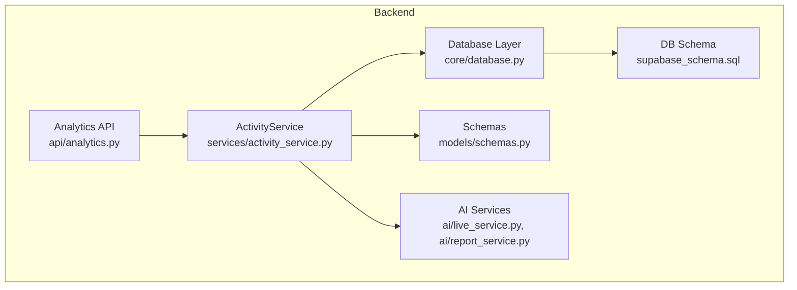
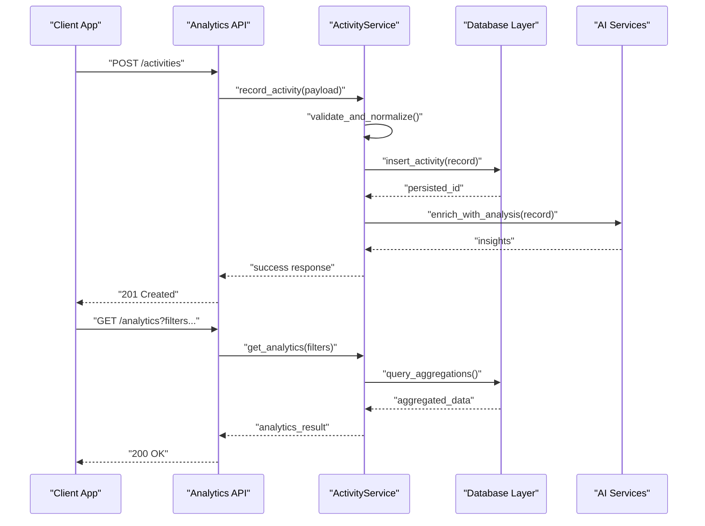
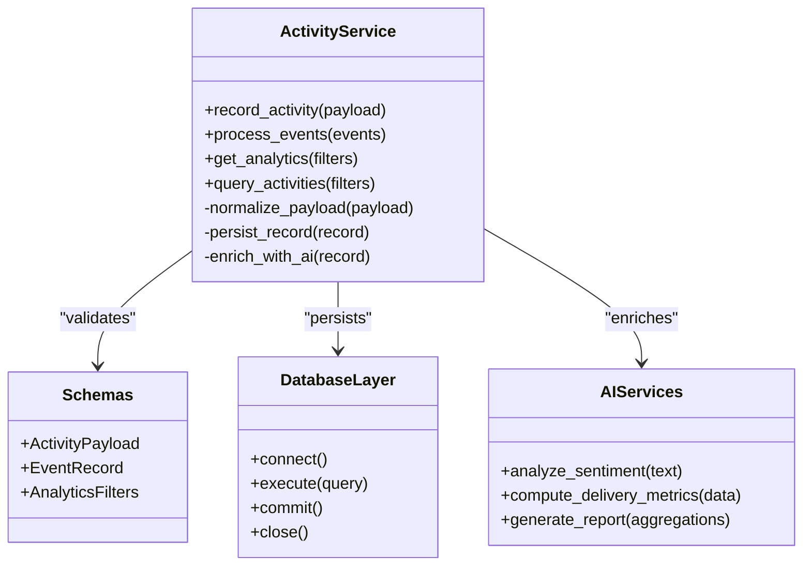
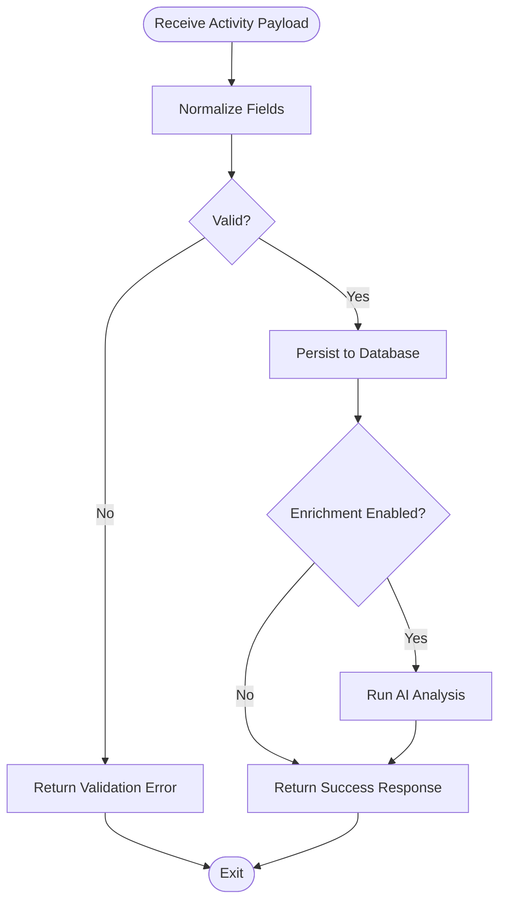
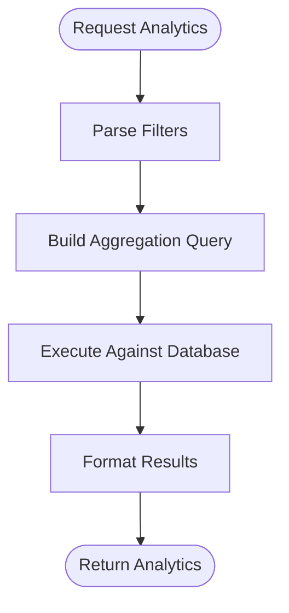
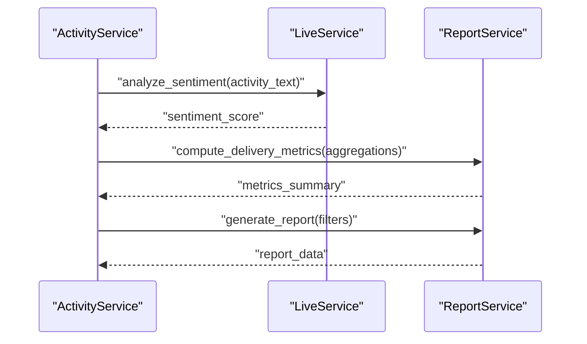
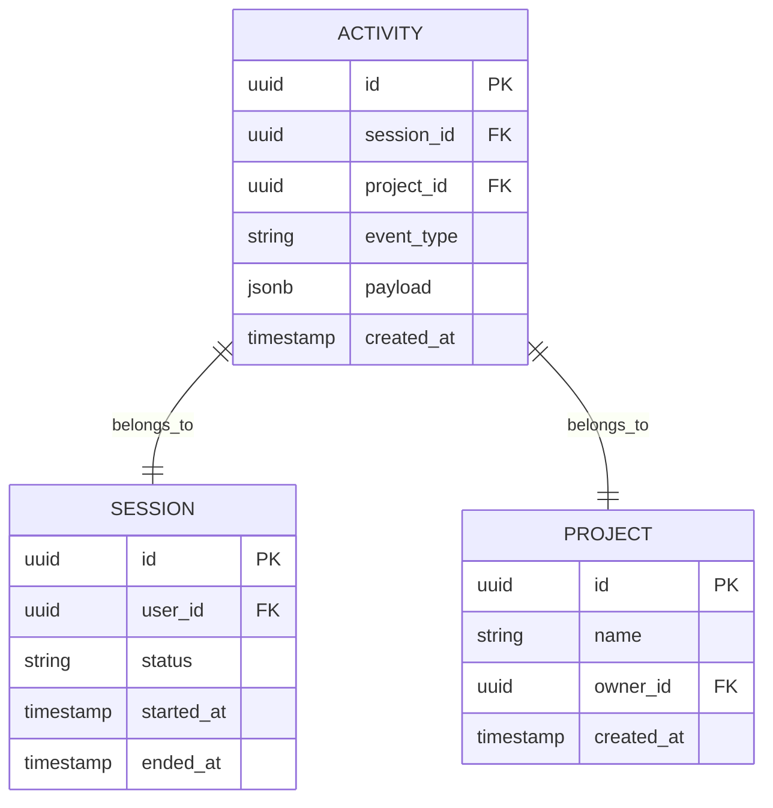
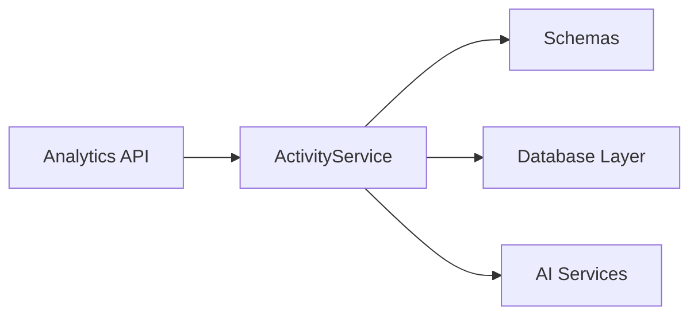

# Activity Service

<cite>
**Referenced Files in This Document**
- [activity_service.py](file://backend/services/activity_service.py)
- [schemas.py](file://backend/models/schemas.py)
- [database.py](file://backend/core/database.py)
- [analytics.py](file://backend/api/analytics.py)
- [live_service.py](file://backend/ai/live_service.py)
- [report_service.py](file://backend/ai/report_service.py)
- [supabase_schema.sql](file://backend/supabase_schema.sql)
</cite>

## Table of Contents
1. [Introduction](#introduction)
2. [Project Structure](#project-structure)
3. [Core Components](#core-components)
4. [Architecture Overview](#architecture-overview)
5. [Detailed Component Analysis](#detailed-component-analysis)
6. [Dependency Analysis](#dependency-analysis)
7. [Performance Considerations](#performance-considerations)
8. [Troubleshooting Guide](#troubleshooting-guide)
9. [Conclusion](#conclusion)

## Introduction
The Activity Service is the central component for capturing, processing, and analyzing user activities across the Horux platform. It records session events, tracks interactions with projects and teams, and provides analytics endpoints for reporting. The service integrates with AI modules to enrich activity data with insights such as sentiment analysis and delivery metrics, enabling actionable dashboards and automated feedback loops.

## Project Structure
The Activity Service resides under backend/services and collaborates with:
- Data models and schemas for request/response validation
- Database layer for persistence
- API routes that expose activity recording and analytics endpoints
- AI services for enrichment and analysis

**Diagram sources**
- [activity_service.py](file://backend/services/activity_service.py)
- [database.py](file://backend/core/database.py)
- [schemas.py](file://backend/models/schemas.py)
- [analytics.py](file://backend/api/analytics.py)
- [live_service.py](file://backend/ai/live_service.py)
- [report_service.py](file://backend/ai/report_service.py)
- [supabase_schema.sql](file://backend/supabase_schema.sql)

**Section sources**
- [activity_service.py](file://backend/services/activity_service.py)
- [schemas.py](file://backend/models/schemas.py)
- [database.py](file://backend/core/database.py)
- [analytics.py](file://backend/api/analytics.py)
- [live_service.py](file://backend/ai/live_service.py)
- [report_service.py](file://backend/ai/report_service.py)
- [supabase_schema.sql](file://backend/supabase_schema.sql)

## Core Components
- ActivityService: Encapsulates methods to record activities, process events, and generate analytics. It coordinates with the database and AI services to persist and enrich activity data.
- Schemas: Define validated structures for activity payloads, event types, and query parameters used by API endpoints.
- Database Layer: Provides connection management and query execution against the Supabase-backed datastore.
- Analytics API: Exposes endpoints for recording activities and retrieving aggregated analytics.
- AI Services: Provide enrichment capabilities such as sentiment analysis, delivery metrics, and report generation based on recorded activities.

Key responsibilities:
- Capture and normalize activity payloads from multiple system components
- Persist structured activity records with timestamps and contextual metadata
- Aggregate and summarize activities for reporting and dashboards
- Integrate AI-driven analysis to derive insights (e.g., engagement patterns, sentiment trends)

**Section sources**
- [activity_service.py](file://backend/services/activity_service.py)
- [schemas.py](file://backend/models/schemas.py)
- [database.py](file://backend/core/database.py)
- [analytics.py](file://backend/api/analytics.py)
- [live_service.py](file://backend/ai/live_service.py)
- [report_service.py](file://backend/ai/report_service.py)

## Architecture Overview
The Activity Service follows a layered architecture:
- API Layer: Receives requests to record activities or fetch analytics
- Service Layer: Validates inputs, orchestrates persistence, and triggers AI enrichment
- Data Layer: Persists activities and queries them for analytics
- AI Integration: Enriches activity data and generates reports

**Diagram sources**
- [analytics.py](file://backend/api/analytics.py)
- [activity_service.py](file://backend/services/activity_service.py)
- [database.py](file://backend/core/database.py)
- [live_service.py](file://backend/ai/live_service.py)
- [report_service.py](file://backend/ai/report_service.py)

## Detailed Component Analysis

### ActivityService Methods
- Record Activity: Accepts normalized payloads, validates fields, persists records, and optionally triggers AI enrichment.
- Process Events: Handles batched or streaming events, deduplicates, and updates session state.
- Generate Analytics: Aggregates activities by time windows, users, projects, and sessions; supports filters and grouping.
- Query Activities: Supports filtering by date ranges, event types, user IDs, project IDs, and session IDs.

**Diagram sources**
- [activity_service.py](file://backend/services/activity_service.py)
- [schemas.py](file://backend/models/schemas.py)
- [database.py](file://backend/core/database.py)
- [live_service.py](file://backend/ai/live_service.py)
- [report_service.py](file://backend/ai/report_service.py)

**Section sources**
- [activity_service.py](file://backend/services/activity_service.py)
- [schemas.py](file://backend/models/schemas.py)
- [database.py](file://backend/core/database.py)
- [live_service.py](file://backend/ai/live_service.py)
- [report_service.py](file://backend/ai/report_service.py)

### Activity Recording Flow
Capturing activities involves normalizing input, validating against schemas, persisting to the database, and optionally enriching via AI services.

**Diagram sources**
- [activity_service.py](file://backend/services/activity_service.py)
- [schemas.py](file://backend/models/schemas.py)
- [database.py](file://backend/core/database.py)
- [live_service.py](file://backend/ai/live_service.py)

**Section sources**
- [activity_service.py](file://backend/services/activity_service.py)
- [schemas.py](file://backend/models/schemas.py)
- [database.py](file://backend/core/database.py)
- [live_service.py](file://backend/ai/live_service.py)

### Analytics and Reporting
Aggregation logic groups activities by dimensions such as user, project, session, and time window. Filters support date ranges, event types, and entity IDs. Results are returned as structured summaries suitable for dashboards and reports.

**Diagram sources**
- [activity_service.py](file://backend/services/activity_service.py)
- [database.py](file://backend/core/database.py)

**Section sources**
- [activity_service.py](file://backend/services/activity_service.py)
- [database.py](file://backend/core/database.py)

### Integration with AI Services
AI services enhance activity data with sentiment analysis, delivery metrics, and report generation. The Activity Service calls these functions after persisting core activity records to avoid redundant computation.

**Diagram sources**
- [activity_service.py](file://backend/services/activity_service.py)
- [live_service.py](file://backend/ai/live_service.py)
- [report_service.py](file://backend/ai/report_service.py)

**Section sources**
- [activity_service.py](file://backend/services/activity_service.py)
- [live_service.py](file://backend/ai/live_service.py)
- [report_service.py](file://backend/ai/report_service.py)

### Relationship with Sessions and Projects
Activities are tied to user sessions and project interactions. Each activity record includes identifiers linking it to a session and project, enabling drill-down analytics and cross-entity correlation.

**Diagram sources**
- [supabase_schema.sql](file://backend/supabase_schema.sql)

**Section sources**
- [supabase_schema.sql](file://backend/supabase_schema.sql)

## Dependency Analysis
The Activity Service depends on:
- Schemas for input/output validation
- Database layer for persistence and querying
- AI services for enrichment and analytics
- API routes for exposure of functionality

**Diagram sources**
- [activity_service.py](file://backend/services/activity_service.py)
- [schemas.py](file://backend/models/schemas.py)
- [database.py](file://backend/core/database.py)
- [analytics.py](file://backend/api/analytics.py)
- [live_service.py](file://backend/ai/live_service.py)
- [report_service.py](file://backend/ai/report_service.py)

**Section sources**
- [activity_service.py](file://backend/services/activity_service.py)
- [schemas.py](file://backend/models/schemas.py)
- [database.py](file://backend/core/database.py)
- [analytics.py](file://backend/api/analytics.py)
- [live_service.py](file://backend/ai/live_service.py)
- [report_service.py](file://backend/ai/report_service.py)

## Performance Considerations
- Batch operations: Prefer batching activity writes to reduce database round-trips.
- Indexing: Ensure indexes on frequently filtered columns (session_id, project_id, event_type, created_at).
- Caching: Cache frequent analytics queries with appropriate invalidation strategies.
- Async enrichment: Offload AI enrichment to background tasks to keep recording paths fast.
- Pagination: Implement pagination for large activity queries to prevent memory pressure.

[No sources needed since this section provides general guidance]

## Troubleshooting Guide
Common issues and resolutions:
- Validation errors: Check schema definitions and ensure payloads conform to expected structure.
- Persistence failures: Verify database connectivity and transaction handling.
- AI enrichment timeouts: Configure retries and fallback responses when AI services are unavailable.
- Missing relationships: Confirm foreign key integrity between activities, sessions, and projects.

**Section sources**
- [activity_service.py](file://backend/services/activity_service.py)
- [database.py](file://backend/core/database.py)
- [live_service.py](file://backend/ai/live_service.py)
- [report_service.py](file://backend/ai/report_service.py)

## Conclusion
The Activity Service is pivotal for tracking user interactions, managing session events, and powering analytics within Horux. By combining robust persistence, schema validation, and AI-driven enrichment, it enables comprehensive reporting and insight generation. Proper indexing, caching, and async processing will further optimize performance and reliability.

[No sources needed since this section summarizes without analyzing specific files]