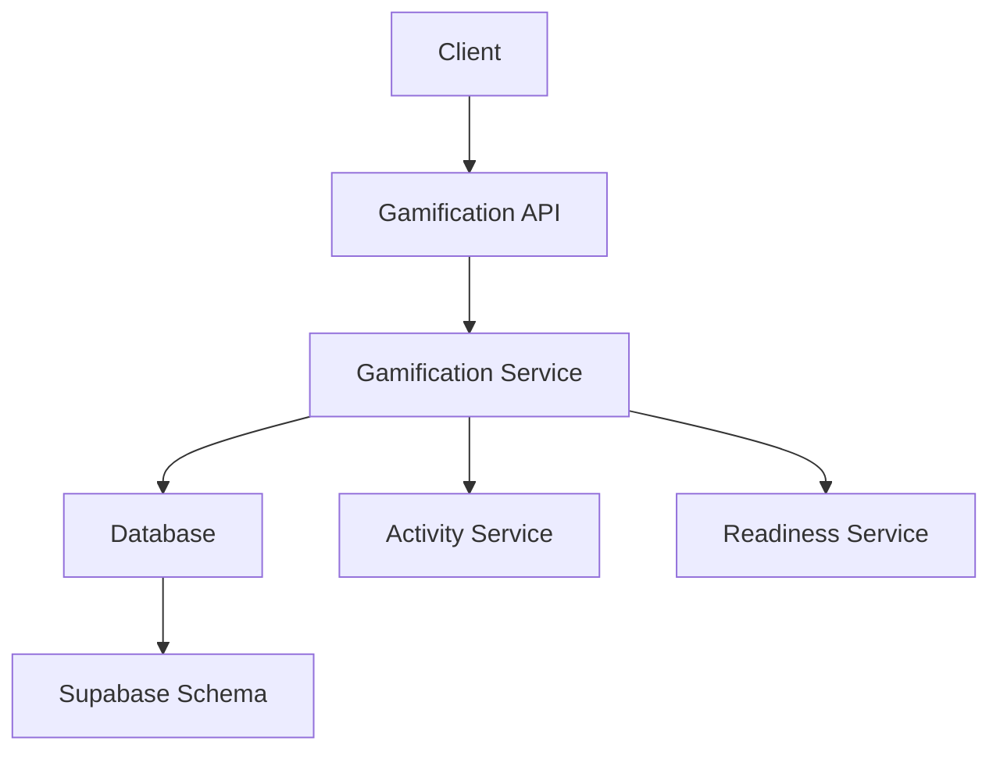
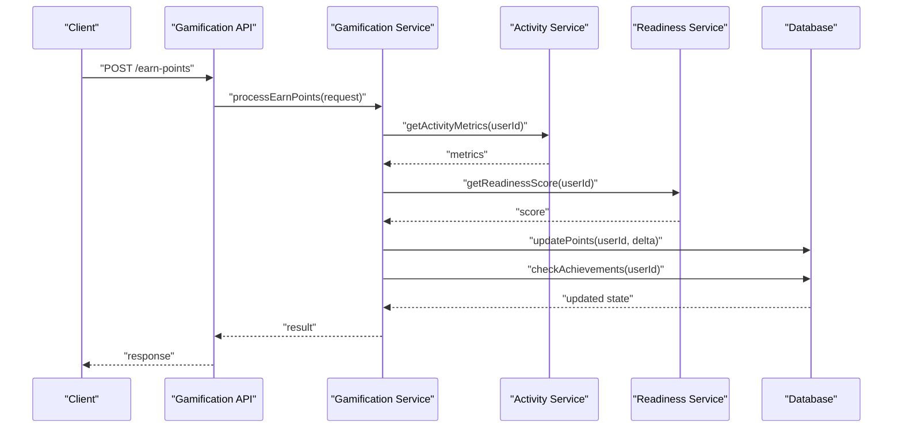
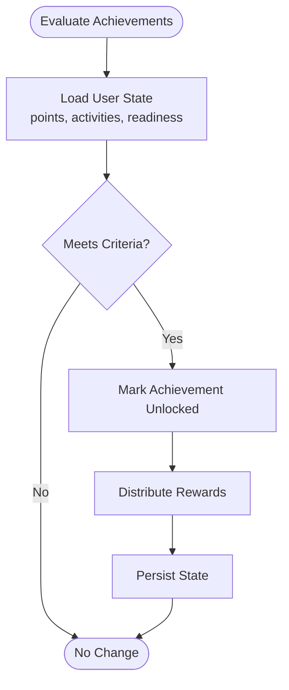
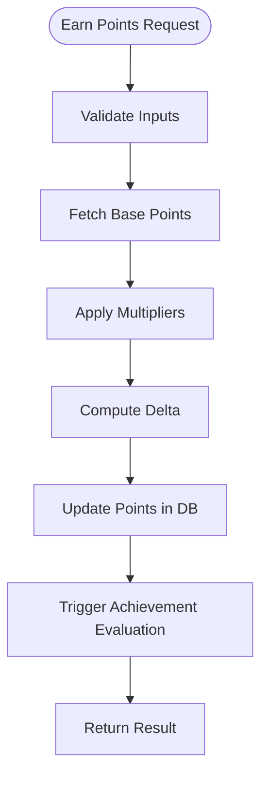
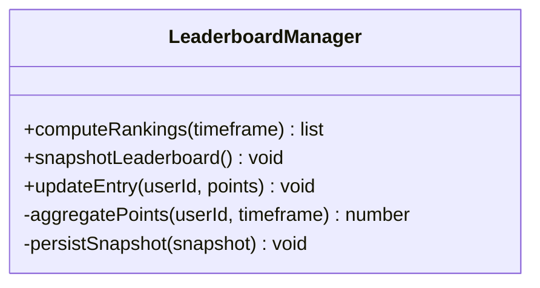
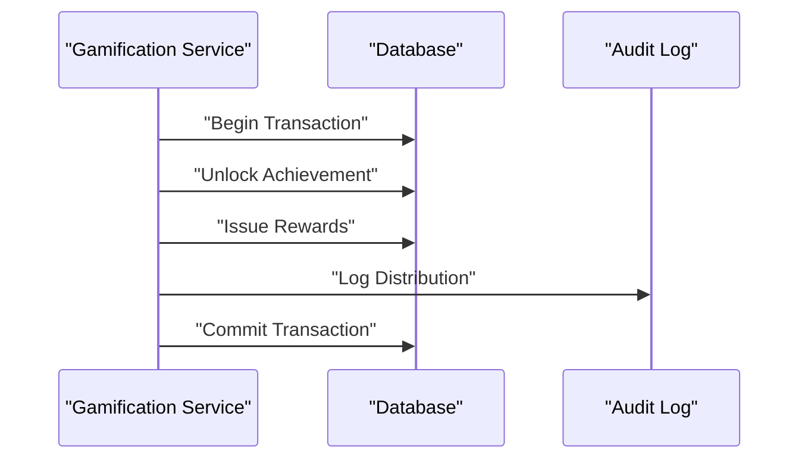
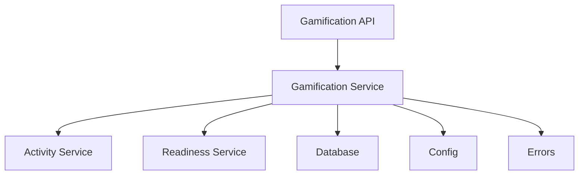

# Gamification Service

<cite>
**Referenced Files in This Document**
- [gamification_service.py](file://backend/services/gamification_service.py)
- [activity_service.py](file://backend/services/activity_service.py)
- [readiness_service.py](file://backend/services/readiness_service.py)
- [gamification.py](file://backend/api/gamification.py)
- [schemas.py](file://backend/models/schemas.py)
- [database.py](file://backend/core/database.py)
- [errors.py](file://backend/core/errors.py)
- [config.py](file://backend/core/config.py)
- [supabase_schema.sql](file://backend/supabase_schema.sql)
</cite>

## Table of Contents
1. [Introduction](#introduction)
2. [Project Structure](#project-structure)
3. [Core Components](#core-components)
4. [Architecture Overview](#architecture-overview)
5. [Detailed Component Analysis](#detailed-component-analysis)
6. [Dependency Analysis](#dependency-analysis)
7. [Performance Considerations](#performance-considerations)
8. [Troubleshooting Guide](#troubleshooting-guide)
9. [Conclusion](#conclusion)

## Introduction
This document explains the Gamification Service implementation, focusing on achievement criteria, point calculation algorithms, leaderboard management, and reward distribution. It also documents service methods for earning points, unlocking achievements, updating leaderboards, and generating gamification reports, along with integration points to activity tracking and readiness assessment services.

## Project Structure
The gamification feature spans API endpoints, a dedicated service module, shared models, and database schema definitions:
- API layer exposes endpoints for gamification operations.
- Service layer encapsulates business logic for points, achievements, leaderboards, and rewards.
- Models define request/response schemas used across layers.
- Database schema defines persistent structures for users, points, achievements, and leaderboards.

**Diagram sources**
- [gamification.py](file://backend/api/gamification.py)
- [gamification_service.py](file://backend/services/gamification_service.py)
- [activity_service.py](file://backend/services/activity_service.py)
- [readiness_service.py](file://backend/services/readiness_service.py)
- [supabase_schema.sql](file://backend/supabase_schema.sql)

**Section sources**
- [gamification.py](file://backend/api/gamification.py)
- [gamification_service.py](file://backend/services/gamification_service.py)
- [schemas.py](file://backend/models/schemas.py)
- [supabase_schema.sql](file://backend/supabase_schema.sql)

## Core Components
- Achievement System: Defines criteria and rules for unlocking achievements based on user actions and progress.
- Point Calculation Engine: Computes points earned from activities, readiness assessments, and other events.
- Leaderboard Manager: Maintains rankings and snapshots for time-bound and all-time leaderboards.
- Reward Distribution Mechanism: Issues badges, unlocks features, or grants privileges upon achievement completion.
- Reporting: Aggregates metrics for engagement, achievement rates, and leaderboard trends.

Key responsibilities are implemented within the service module and exposed via API endpoints. Data persistence is handled through the database layer using defined schemas.

**Section sources**
- [gamification_service.py](file://backend/services/gamification_service.py)
- [gamification.py](file://backend/api/gamification.py)
- [schemas.py](file://backend/models/schemas.py)
- [supabase_schema.sql](file://backend/supabase_schema.sql)

## Architecture Overview
The Gamification Service integrates with Activity Tracking and Readiness Assessment to compute points and unlock achievements. The API layer validates requests and delegates processing to the service layer, which interacts with the database and related services.

**Diagram sources**
- [gamification.py](file://backend/api/gamification.py)
- [gamification_service.py](file://backend/services/gamification_service.py)
- [activity_service.py](file://backend/services/activity_service.py)
- [readiness_service.py](file://backend/services/readiness_service.py)
- [supabase_schema.sql](file://backend/supabase_schema.sql)

## Detailed Component Analysis

### Achievement System
- Criteria Definition: Achievements are defined by thresholds on cumulative points, specific activity counts, or readiness score milestones.
- Evaluation Logic: On each point update, the system evaluates active achievements against current user state.
- Unlocking Flow: When criteria are met, the achievement is marked unlocked and rewards are distributed.

**Diagram sources**
- [gamification_service.py](file://backend/services/gamification_service.py)
- [supabase_schema.sql](file://backend/supabase_schema.sql)

**Section sources**
- [gamification_service.py](file://backend/services/gamification_service.py)
- [schemas.py](file://backend/models/schemas.py)

### Point Calculation Algorithms
- Sources: Points are derived from activity events (e.g., session participation), readiness assessment outcomes, and bonus multipliers.
- Accumulation: Points are accumulated per user with transactional updates to ensure consistency.
- Multipliers: Time-based or category-based multipliers can be applied before finalizing point deltas.

**Diagram sources**
- [gamification_service.py](file://backend/services/gamification_service.py)
- [activity_service.py](file://backend/services/activity_service.py)
- [readiness_service.py](file://backend/services/readiness_service.py)

**Section sources**
- [gamification_service.py](file://backend/services/gamification_service.py)
- [activity_service.py](file://backend/services/activity_service.py)
- [readiness_service.py](file://backend/services/readiness_service.py)

### Leaderboard Management
- Ranking Strategy: Supports daily, weekly, monthly, and all-time leaderboards based on aggregated points.
- Snapshotting: Periodic snapshots maintain historical rankings and prevent retroactive changes.
- Updates: Leaderboards are updated after point transactions and achievement unlocks.

**Diagram sources**
- [gamification_service.py](file://backend/services/gamification_service.py)
- [supabase_schema.sql](file://backend/supabase_schema.sql)

**Section sources**
- [gamification_service.py](file://backend/services/gamification_service.py)
- [supabase_schema.sql](file://backend/supabase_schema.sql)

### Reward Distribution Mechanisms
- Reward Types: Badges, feature unlocks, and privilege grants.
- Distribution Rules: Determined by achievement metadata; executed atomically with achievement unlock.
- Audit Trail: All distributions are logged for traceability and reporting.

**Diagram sources**
- [gamification_service.py](file://backend/services/gamification_service.py)
- [supabase_schema.sql](file://backend/supabase_schema.sql)

**Section sources**
- [gamification_service.py](file://backend/services/gamification_service.py)
- [supabase_schema.sql](file://backend/supabase_schema.sql)

### Service Methods
- Earn Points: Validates inputs, computes deltas, updates balances, and triggers evaluations.
- Unlock Achievements: Evaluates criteria, marks achievements unlocked, and distributes rewards.
- Update Leaderboards: Recomputes rankings and persists snapshots.
- Generate Reports: Aggregates engagement metrics, achievement completion rates, and leaderboard trends.

**Section sources**
- [gamification_service.py](file://backend/services/gamification_service.py)
- [gamification.py](file://backend/api/gamification.py)

### Integration with Activity Tracking and Readiness Assessment
- Activity Service: Supplies event-driven metrics that influence point calculations and achievement eligibility.
- Readiness Service: Provides scores that contribute to point accumulation and milestone-based achievements.
- Coordination: Gamification Service orchestrates data retrieval and ensures consistent state updates.

**Section sources**
- [activity_service.py](file://backend/services/activity_service.py)
- [readiness_service.py](file://backend/services/readiness_service.py)
- [gamification_service.py](file://backend/services/gamification_service.py)

## Dependency Analysis
The Gamification Service depends on:
- API Layer: For request handling and validation.
- Activity and Readiness Services: For input metrics.
- Database Layer: For persistence and queries.
- Configuration and Errors: For environment settings and error handling.

**Diagram sources**
- [gamification.py](file://backend/api/gamification.py)
- [gamification_service.py](file://backend/services/gamification_service.py)
- [activity_service.py](file://backend/services/activity_service.py)
- [readiness_service.py](file://backend/services/readiness_service.py)
- [database.py](file://backend/core/database.py)
- [config.py](file://backend/core/config.py)
- [errors.py](file://backend/core/errors.py)

**Section sources**
- [gamification.py](file://backend/api/gamification.py)
- [gamification_service.py](file://backend/services/gamification_service.py)
- [activity_service.py](file://backend/services/activity_service.py)
- [readiness_service.py](file://backend/services/readiness_service.py)
- [database.py](file://backend/core/database.py)
- [config.py](file://backend/core/config.py)
- [errors.py](file://backend/core/errors.py)

## Performance Considerations
- Batch Operations: Group point updates and achievement evaluations to reduce database round-trips.
- Caching: Cache frequently accessed leaderboard snapshots and user states where appropriate.
- Indexing: Ensure database indexes on userId, timestamps, and achievement keys for efficient queries.
- Concurrency: Use transactions and locks to prevent race conditions during concurrent point updates.

[No sources needed since this section provides general guidance]

## Troubleshooting Guide
Common issues and resolutions:
- Inconsistent Point Balances: Verify transaction boundaries and rollback behavior on errors.
- Missing Achievement Unlocks: Check evaluation triggers and criteria thresholds.
- Stale Leaderboard Data: Confirm snapshot schedules and update triggers.
- Integration Failures: Validate responses from Activity and Readiness services and handle timeouts gracefully.

**Section sources**
- [errors.py](file://backend/core/errors.py)
- [gamification_service.py](file://backend/services/gamification_service.py)

## Conclusion
The Gamification Service provides a robust framework for motivating user engagement through points, achievements, leaderboards, and rewards. By integrating with activity tracking and readiness assessment, it delivers a cohesive gamified experience while maintaining data integrity and performance.

[No sources needed since this section summarizes without analyzing specific files]