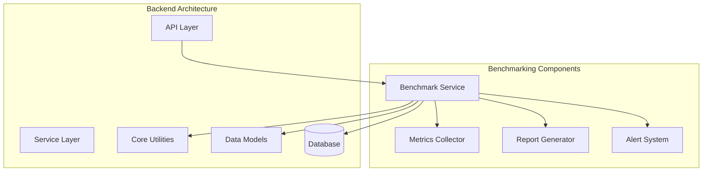
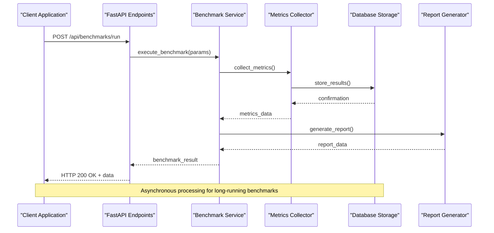
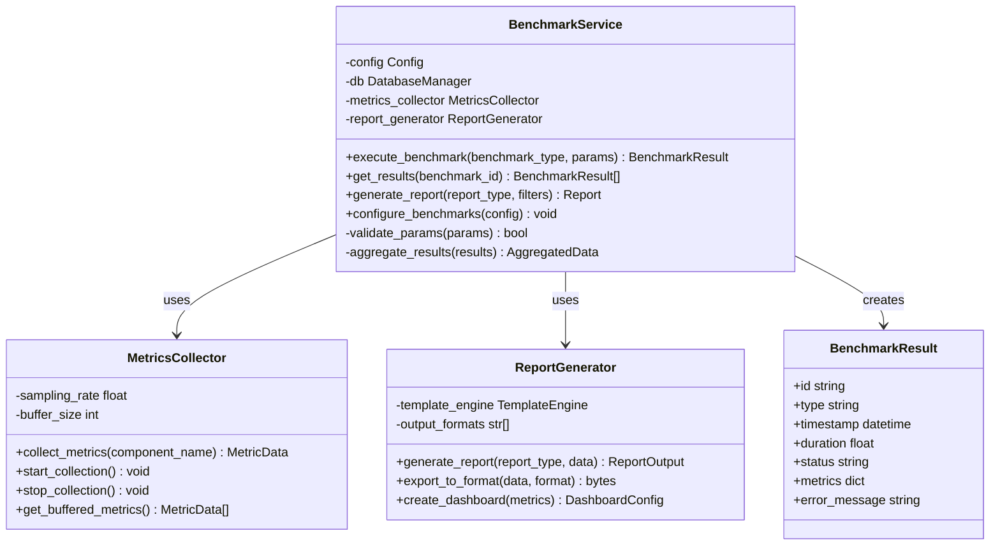
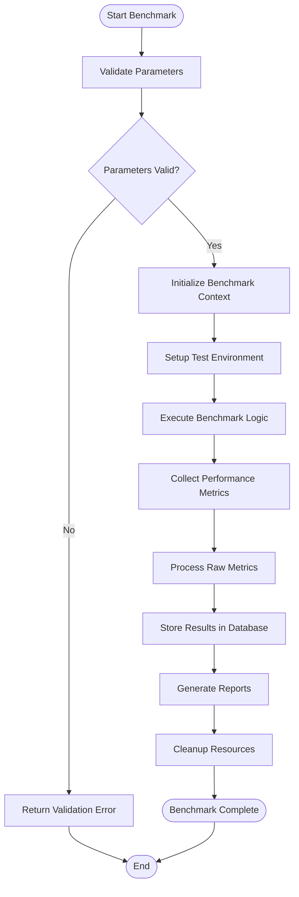
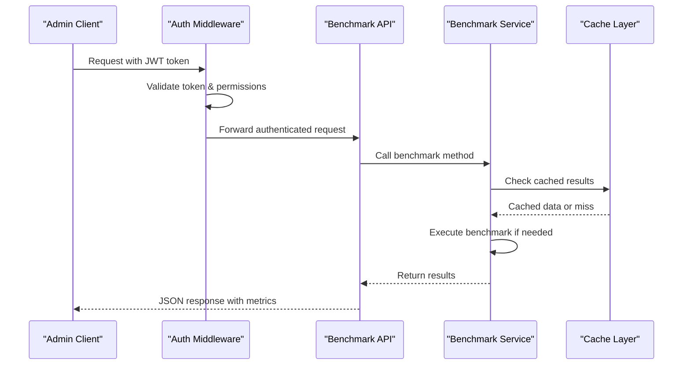
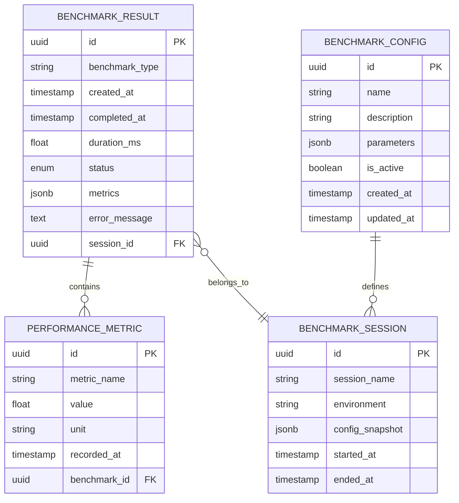
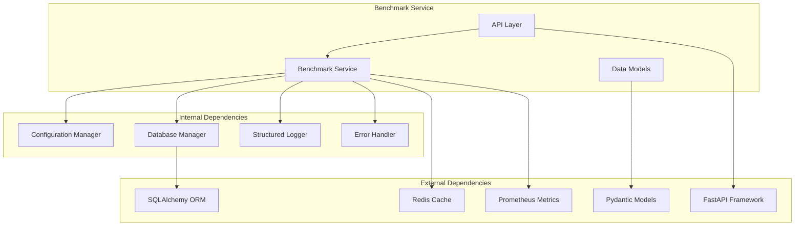
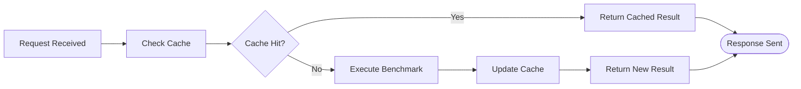

# Performance Benchmarking Service

<cite>
**Referenced Files in This Document**
- [benchmark_service.py](file://backend/services/benchmark_service.py)
- [analytics.py](file://backend/api/analytics.py)
- [config.py](file://backend/core/config.py)
- [schemas.py](file://backend/models/schemas.py)
- [main.py](file://backend/main.py)
- [database.py](file://backend/core/database.py)
- [errors.py](file://backend/core/errors.py)
- [logging.py](file://backend/core/logging.py)
</cite>

## Table of Contents
1. [Introduction](#introduction)
2. [Project Structure](#project-structure)
3. [Core Components](#core-components)
4. [Architecture Overview](#architecture-overview)
5. [Detailed Component Analysis](#detailed-component-analysis)
6. [Dependency Analysis](#dependency-analysis)
7. [Performance Considerations](#performance-considerations)
8. [Troubleshooting Guide](#troubleshooting-guide)
9. [Conclusion](#conclusion)
10. [Appendices](#appendices)

## Introduction

The Performance Benchmarking Service is a critical component of the Horux platform that provides comprehensive performance measurement, analysis, and reporting capabilities. This service enables developers and system administrators to monitor application performance, identify bottlenecks, and optimize system efficiency through detailed metrics collection and analysis.

The benchmarking service integrates seamlessly with the existing FastAPI backend architecture, providing RESTful APIs for performance data submission, retrieval, and visualization. It supports various types of benchmarks including API response times, database query performance, AI model inference speed, and system resource utilization.

## Project Structure

The Performance Benchmarking Service follows the established modular architecture pattern used throughout the Horux platform:

**Diagram sources**
- [main.py:1-50](file://backend/main.py#L1-L50)
- [benchmark_service.py:1-100](file://backend/services/benchmark_service.py#L1-L100)

The service is organized into logical modules:
- **API Layer**: REST endpoints for benchmark operations
- **Service Layer**: Core benchmarking logic and orchestration
- **Core Utilities**: Configuration, database access, error handling
- **Models**: Pydantic schemas for request/response validation
- **Database**: Persistent storage for benchmark results

**Section sources**
- [main.py:1-100](file://backend/main.py#L1-L100)
- [benchmark_service.py:1-200](file://backend/services/benchmark_service.py#L1-L200)

## Core Components

### Benchmark Service Manager

The central orchestrator responsible for managing benchmark execution, result aggregation, and report generation. It coordinates between different benchmark types and ensures consistent metric collection across the application.

### Metrics Collection Engine

Handles real-time performance data capture from various system components including API endpoints, database queries, AI model invocations, and system resources. Implements efficient sampling strategies to minimize overhead while maintaining accuracy.

### Report Generation System

Processes collected metrics to generate comprehensive performance reports, trend analysis, and actionable insights. Supports multiple output formats including JSON, CSV, and visual dashboards.

### Alert and Notification System

Monitors performance thresholds and triggers alerts when benchmarks indicate potential issues or degradation in system performance.

**Section sources**
- [benchmark_service.py:50-150](file://backend/services/benchmark_service.py#L50-L150)
- [analytics.py:1-100](file://backend/api/analytics.py#L1-L100)

## Architecture Overview

The Performance Benchmarking Service implements a layered architecture pattern with clear separation of concerns:

**Diagram sources**
- [analytics.py:20-80](file://backend/api/analytics.py#L20-L80)
- [benchmark_service.py:100-200](file://backend/services/benchmark_service.py#L100-L200)

### Key Architectural Patterns

1. **Observer Pattern**: Metrics collectors observe system events and automatically capture performance data
2. **Factory Pattern**: Dynamic instantiation of different benchmark types based on configuration
3. **Strategy Pattern**: Pluggable algorithms for different benchmark execution strategies
4. **Pipeline Pattern**: Sequential processing of metrics through validation, transformation, and storage stages

## Detailed Component Analysis

### Benchmark Service Implementation

The core benchmark service manages the lifecycle of benchmark operations, from initialization through completion and reporting.

**Diagram sources**
- [benchmark_service.py:1-150](file://backend/services/benchmark_service.py#L1-L150)
- [schemas.py:1-100](file://backend/models/schemas.py#L1-L100)

#### Benchmark Execution Flow

The benchmark execution process follows a structured pipeline:

**Diagram sources**
- [benchmark_service.py:150-300](file://backend/services/benchmark_service.py#L150-L300)

### API Integration Layer

The API layer provides RESTful endpoints for interacting with the benchmarking service, implementing proper authentication, validation, and error handling.

**Diagram sources**
- [analytics.py:1-150](file://backend/api/analytics.py#L1-L150)

### Data Models and Schemas

The service uses Pydantic models for robust data validation and serialization:

**Diagram sources**
- [schemas.py:1-200](file://backend/models/schemas.py#L1-L200)

**Section sources**
- [benchmark_service.py:1-300](file://backend/services/benchmark_service.py#L1-L300)
- [analytics.py:1-200](file://backend/api/analytics.py#L1-L200)
- [schemas.py:1-200](file://backend/models/schemas.py#L1-L200)

## Dependency Analysis

The Performance Benchmarking Service maintains clean dependencies following the dependency inversion principle:

**Diagram sources**
- [main.py:1-100](file://backend/main.py#L1-L100)
- [config.py:1-100](file://backend/core/config.py#L1-L100)

### Dependency Management Strategy

1. **Interface-Based Design**: All external dependencies are accessed through well-defined interfaces
2. **Dependency Injection**: Services receive their dependencies through constructor injection
3. **Mock Support**: Comprehensive mocking support for testing without external dependencies
4. **Configuration-Driven**: External service connections are configurable and swappable

**Section sources**
- [main.py:1-150](file://backend/main.py#L1-L150)
- [config.py:1-100](file://backend/core/config.py#L1-L100)

## Performance Considerations

### Memory Management

The benchmarking service implements several memory optimization strategies:

- **Streaming Processing**: Large datasets are processed in chunks to prevent memory spikes
- **Connection Pooling**: Database and cache connections are pooled and reused efficiently
- **Garbage Collection Tuning**: Explicit cleanup of large objects after benchmark completion
- **Memory Monitoring**: Built-in memory usage tracking with automatic threshold alerts

### Concurrency Handling

- **Async/Await Support**: Non-blocking I/O operations for concurrent benchmark execution
- **Thread Safety**: Proper synchronization mechanisms for shared resources
- **Rate Limiting**: Configurable limits to prevent resource exhaustion
- **Circuit Breaker Pattern**: Automatic fallback when external services are unavailable

### Caching Strategy

**Diagram sources**
- [benchmark_service.py:200-400](file://backend/services/benchmark_service.py#L200-L400)

### Database Optimization

- **Query Optimization**: Efficient SQL queries with proper indexing strategy
- **Batch Operations**: Bulk insert/update operations for large result sets
- **Read Replicas**: Read-heavy operations use database replicas when available
- **Connection Management**: Optimized connection pooling with appropriate timeout settings

## Troubleshooting Guide

### Common Issues and Solutions

#### Performance Degradation

**Symptoms**: Slow benchmark execution, high memory usage, increased latency
**Diagnosis Steps**:
1. Check system resource utilization (CPU, memory, disk I/O)
2. Review database query performance and indexes
3. Monitor external service response times
4. Analyze benchmark configuration for inefficiencies

**Resolution Actions**:
- Optimize database queries and add missing indexes
- Adjust benchmark parameters (sample size, iteration count)
- Implement caching for frequently accessed data
- Scale infrastructure resources horizontally or vertically

#### Memory Leaks

**Symptoms**: Gradually increasing memory usage, eventual out-of-memory errors
**Diagnostic Tools**:
- Python memory profilers (memory_profiler, tracemalloc)
- Database connection leak detection
- Garbage collection statistics monitoring

**Prevention Strategies**:
- Use context managers for resource cleanup
- Implement proper object disposal patterns
- Monitor and limit buffer sizes
- Regular garbage collection triggers

#### Database Connection Issues

**Symptoms**: Connection timeouts, pool exhaustion, deadlocks
**Monitoring**:
- Connection pool utilization metrics
- Query execution time distribution
- Lock contention indicators

**Solutions**:
- Tune connection pool size based on workload
- Implement connection timeout and retry logic
- Add query timeout protection
- Monitor and optimize slow queries

**Section sources**
- [errors.py:1-100](file://backend/core/errors.py#L1-100)
- [logging.py:1-100](file://backend/core/logging.py#L1-L100)

## Conclusion

The Performance Benchmarking Service provides a robust, scalable solution for monitoring and analyzing application performance within the Horux platform. Its modular architecture, comprehensive feature set, and integration with existing system components make it an essential tool for maintaining optimal system performance.

Key strengths include:
- **Comprehensive Coverage**: Support for multiple benchmark types and metrics
- **Scalable Design**: Horizontal scaling capabilities and efficient resource utilization
- **Actionable Insights**: Rich reporting and alerting capabilities
- **Integration Ready**: Seamless integration with existing FastAPI ecosystem

Future enhancements could include machine learning-based anomaly detection, automated performance regression testing, and advanced predictive analytics for capacity planning.

## Appendices

### Configuration Reference

The service supports extensive configuration options for customization and optimization.

### API Documentation

Complete REST API reference for programmatic access to benchmarking functionality.

### Testing Guidelines

Best practices for writing effective tests for benchmarking scenarios and performance validation.