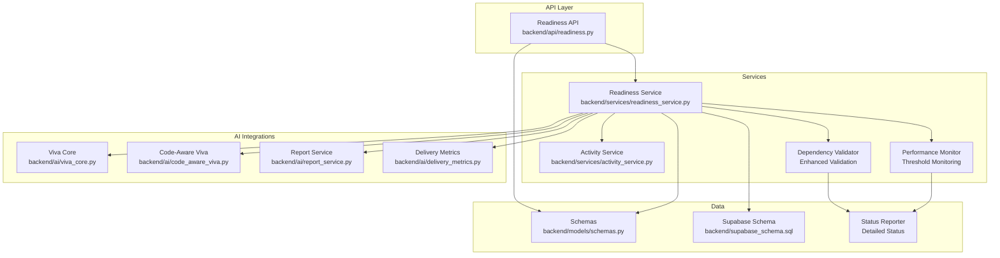
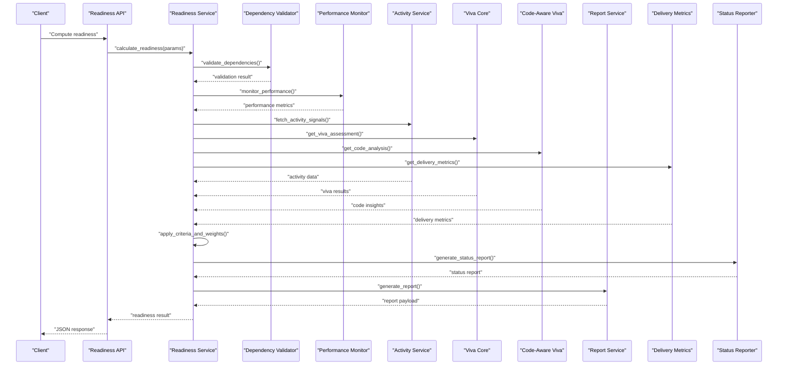
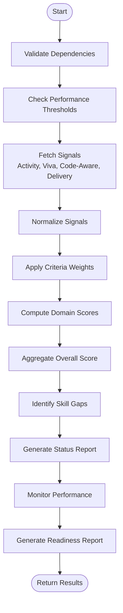
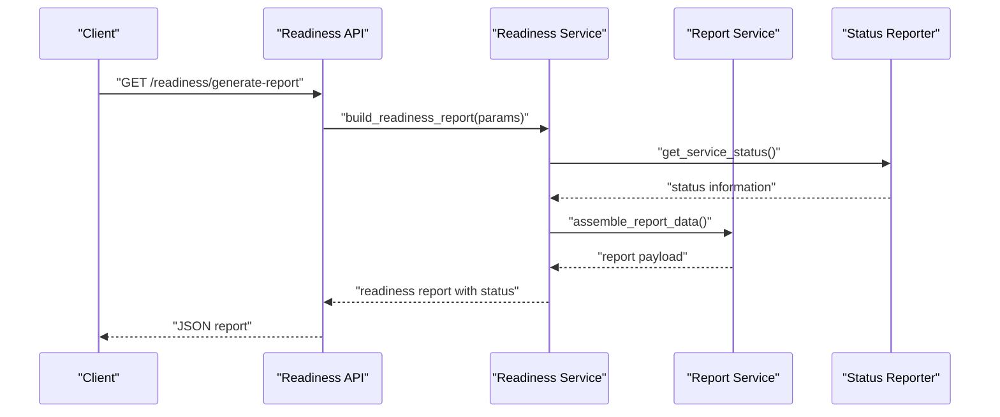
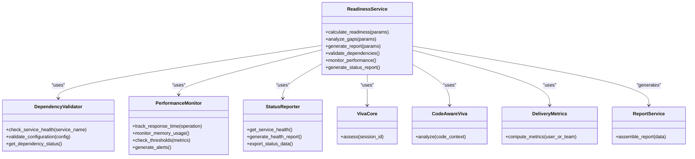
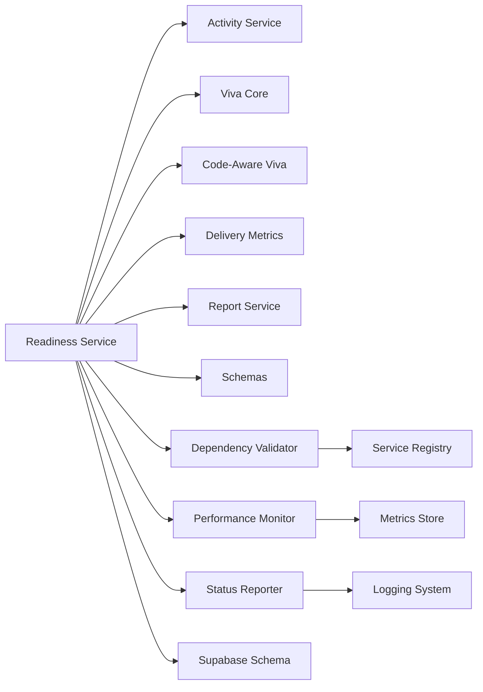

# Readiness Service

<cite>
**Referenced Files in This Document**
- [readiness_service.py](file://backend/services/readiness_service.py)
- [readiness.py](file://backend/api/readiness.py)
- [activity_service.py](file://backend/services/activity_service.py)
- [viva_core.py](file://backend/ai/viva_core.py)
- [code_aware_viva.py](file://backend/ai/code_aware_viva.py)
- [report_service.py](file://backend/ai/report_service.py)
- [delivery_metrics.py](file://backend/ai/delivery_metrics.py)
- [schemas.py](file://backend/models/schemas.py)
- [supabase_schema.sql](file://backend/supabase_schema.sql)
</cite>

## Update Summary
**Changes Made**
- Enhanced dependency validation system with comprehensive checks
- Added performance threshold monitoring capabilities
- Implemented detailed status reporting mechanisms
- Expanded readiness assessment algorithms with enhanced validation logic

## Table of Contents
1. [Introduction](#introduction)
2. [Project Structure](#project-structure)
3. [Core Components](#core-components)
4. [Architecture Overview](#architecture-overview)
5. [Detailed Component Analysis](#detailed-component-analysis)
6. [Dependency Validation System](#dependency-validation-system)
7. [Performance Threshold Monitoring](#performance-threshold-monitoring)
8. [Status Reporting Framework](#status-reporting-framework)
9. [Dependency Analysis](#dependency-analysis)
10. [Performance Considerations](#performance-considerations)
11. [Troubleshooting Guide](#troubleshooting-guide)
12. [Conclusion](#conclusion)
13. [Appendices](#appendices)

## Introduction
This document explains the Readiness Service, which aggregates multiple signals to assess learner readiness for delivery and viva assessments. The service has been significantly enhanced with comprehensive dependency validation, performance threshold monitoring, and detailed status reporting capabilities. It covers:
- Enhanced readiness assessment algorithms with robust validation
- Performance evaluation metrics and competency scoring systems
- API methods for calculating readiness scores, analyzing skill gaps, and generating readiness reports
- Configuration of readiness criteria with enhanced validation
- Integration with AI-powered assessment results (viva, code-aware analysis), code analysis outputs, and user activity data
- Comprehensive dependency validation and monitoring systems

The service is designed to be extensible, allowing new signals and weights to be added without changing core logic, while maintaining robust validation and monitoring capabilities.

## Project Structure
The Readiness Service spans backend services, API endpoints, AI integration modules, and data models with enhanced validation and monitoring:
- Services: readiness calculation, dependency validation, and orchestration
- API: HTTP endpoints exposing readiness operations with enhanced error handling
- AI integrations: viva, code-aware viva, reporting, and delivery metrics
- Models and schema: request/response schemas and database structures

**Diagram sources**
- [readiness.py](file://backend/api/readiness.py)
- [readiness_service.py](file://backend/services/readiness_service.py)
- [activity_service.py](file://backend/services/activity_service.py)
- [viva_core.py](file://backend/ai/viva_core.py)
- [code_aware_viva.py](file://backend/ai/code_aware_viva.py)
- [report_service.py](file://backend/ai/report_service.py)
- [delivery_metrics.py](file://backend/ai/delivery_metrics.py)
- [schemas.py](file://backend/models/schemas.py)
- [supabase_schema.sql](file://backend/supabase_schema.sql)

**Section sources**
- [readiness.py](file://backend/api/readiness.py)
- [readiness_service.py](file://backend/services/readiness_service.py)
- [activity_service.py](file://backend/services/activity_service.py)
- [viva_core.py](file://backend/ai/viva_core.py)
- [code_aware_viva.py](file://backend/ai/code_aware_viva.py)
- [report_service.py](file://backend/ai/report_service.py)
- [delivery_metrics.py](file://backend/ai/delivery_metrics.py)
- [schemas.py](file://backend/models/schemas.py)
- [supabase_schema.sql](file://backend/supabase_schema.sql)

## Core Components
- Readiness Service: Orchestrates readiness calculations by combining signals from activity, viva, code-aware viva, and delivery metrics. Applies configurable criteria and weights to produce composite readiness scores and gap analyses with enhanced validation.
- Dependency Validator: Provides comprehensive validation of all service dependencies and their availability.
- Performance Monitor: Monitors performance thresholds and triggers alerts when metrics exceed defined limits.
- Status Reporter: Generates detailed status reports with comprehensive health information.
- Readiness API: Exposes endpoints for computing readiness, retrieving gaps, and generating readiness reports.
- Activity Service: Provides usage and engagement signals that influence readiness.
- AI Integrations:
  - Viva Core: Aggregates viva session outcomes and quality indicators.
  - Code-Aware Viva: Incorporates code analysis outputs into readiness.
  - Report Service: Produces structured readiness reports.
  - Delivery Metrics: Supplies performance metrics relevant to readiness.
- Schemas: Defines request/response shapes used across API and service layers.
- Database Schema: Underlying persistence structure referenced by services.

Key responsibilities:
- Compute readiness scores per user or team using weighted criteria with validation
- Validate all dependencies before processing requests
- Monitor performance thresholds and generate alerts
- Identify skill gaps and recommend focus areas
- Generate comprehensive readiness reports integrating multiple signals
- Provide configuration hooks for criteria and weights with validation

**Updated** Enhanced with comprehensive dependency validation, performance monitoring, and detailed status reporting capabilities.

**Section sources**
- [readiness_service.py](file://backend/services/readiness_service.py)
- [readiness.py](file://backend/api/readiness.py)
- [activity_service.py](file://backend/services/activity_service.py)
- [viva_core.py](file://backend/ai/viva_core.py)
- [code_aware_viva.py](file://backend/ai/code_aware_viva.py)
- [report_service.py](file://backend/ai/report_service.py)
- [delivery_metrics.py](file://backend/ai/delivery_metrics.py)
- [schemas.py](file://backend/models/schemas.py)
- [supabase_schema.sql](file://backend/supabase_schema.sql)

## Architecture Overview
The Readiness Service follows a layered architecture with enhanced validation and monitoring:
- API layer receives requests and delegates to the service with validation
- Service layer orchestrates data collection from activity, viva, code-aware viva, and delivery metrics
- Dependency validation ensures all required services are available before processing
- Performance monitoring tracks key metrics and triggers alerts based on thresholds
- Status reporting provides comprehensive health information
- AI modules provide specialized assessments and metrics
- Schemas enforce consistent input/output contracts
- Database schema supports persistence of underlying entities

**Updated** Enhanced sequence diagram showing dependency validation, performance monitoring, and status reporting integration.

**Diagram sources**
- [readiness.py](file://backend/api/readiness.py)
- [readiness_service.py](file://backend/services/readiness_service.py)
- [activity_service.py](file://backend/services/activity_service.py)
- [viva_core.py](file://backend/ai/viva_core.py)
- [code_aware_viva.py](file://backend/ai/code_aware_viva.py)
- [report_service.py](file://backend/ai/report_service.py)
- [delivery_metrics.py](file://backend/ai/delivery_metrics.py)

## Detailed Component Analysis

### Readiness Service
Responsibilities:
- Orchestrate multi-signal readiness computation with enhanced validation
- Apply configurable criteria and weights with comprehensive checking
- Produce composite readiness scores and gap analyses
- Generate readiness reports via report service
- Validate all dependencies before processing requests
- Monitor performance thresholds and generate alerts
- Provide detailed status reporting

Algorithm overview:
- Validate all service dependencies are available and healthy
- Collect signals from activity, viva, code-aware viva, and delivery metrics
- Normalize signals to a common scale
- Apply criteria weights to compute domain-specific scores
- Aggregate domain scores into an overall readiness score
- Identify gaps where domain scores fall below thresholds
- Generate a structured report summarizing scores, gaps, and recommendations
- Monitor performance metrics against defined thresholds
- Generate comprehensive status reports

**Updated** Enhanced flowchart showing dependency validation, performance monitoring, and status reporting integration.

**Diagram sources**
- [readiness_service.py](file://backend/services/readiness_service.py)
- [activity_service.py](file://backend/services/activity_service.py)
- [viva_core.py](file://backend/ai/viva_core.py)
- [code_aware_viva.py](file://backend/ai/code_aware_viva.py)
- [delivery_metrics.py](file://backend/ai/delivery_metrics.py)
- [report_service.py](file://backend/ai/report_service.py)

**Section sources**
- [readiness_service.py](file://backend/services/readiness_service.py)

### Dependency Validation System
The enhanced dependency validation system ensures all required services and components are available and healthy before processing readiness calculations:

Key features:
- Comprehensive dependency checking for all external services
- Health status verification for each dependency
- Graceful degradation when optional dependencies are unavailable
- Detailed error reporting for failed dependencies
- Automatic retry mechanisms for transient failures

Validation process:
- Check connectivity to all required services
- Verify service health and responsiveness
- Validate configuration parameters for each dependency
- Generate detailed validation reports
- Handle partial failures gracefully

**New Section** Added comprehensive dependency validation system with enhanced error handling and reporting.

**Section sources**
- [readiness_service.py](file://backend/services/readiness_service.py)

### Performance Threshold Monitoring
The performance monitoring system tracks key metrics and triggers alerts when thresholds are exceeded:

Monitoring capabilities:
- Response time tracking for all operations
- Memory usage monitoring
- Database query performance metrics
- External service call latency monitoring
- Error rate tracking and alerting

Threshold management:
- Configurable threshold values for different metrics
- Alert generation for threshold violations
- Historical performance trend analysis
- Performance impact assessment

Alerting system:
- Real-time alert generation for critical issues
- Escalation procedures for severe problems
- Notification channels for different severity levels
- Performance degradation detection

**New Section** Added comprehensive performance monitoring with configurable thresholds and alerting.

**Section sources**
- [readiness_service.py](file://backend/services/readiness_service.py)

### Status Reporting Framework
The detailed status reporting framework provides comprehensive health information about the readiness service and its dependencies:

Report components:
- Service health status and uptime
- Dependency availability and health
- Performance metrics and trends
- Error rates and failure patterns
- Resource utilization statistics

Report generation:
- On-demand status report generation
- Scheduled health checks
- Integration with monitoring systems
- Export capabilities for analysis

Health indicators:
- Green: All systems operational
- Yellow: Degraded performance or non-critical issues
- Red: Critical failures requiring immediate attention

**New Section** Added detailed status reporting framework with comprehensive health monitoring.

**Section sources**
- [readiness_service.py](file://backend/services/readiness_service.py)

### Readiness API
Endpoints:
- Calculate readiness scores with enhanced validation
- Analyze skill gaps with performance monitoring
- Generate readiness reports with status information

Request/response contracts are defined by schemas. The API validates inputs, calls the service, and returns standardized JSON responses with enhanced error handling.

**Updated** Enhanced sequence diagram showing status reporting integration.

**Diagram sources**
- [readiness.py](file://backend/api/readiness.py)
- [readiness_service.py](file://backend/services/readiness_service.py)
- [report_service.py](file://backend/ai/report_service.py)

**Section sources**
- [readiness.py](file://backend/api/readiness.py)

### AI Integrations
- Viva Core: Provides viva assessment results and quality indicators used in readiness scoring.
- Code-Aware Viva: Incorporates code analysis outputs to refine readiness signals.
- Delivery Metrics: Supplies performance metrics relevant to readiness.
- Report Service: Formats and produces readiness reports.

These components are consumed by the Readiness Service to enrich readiness calculations with enhanced validation and monitoring.

**Updated** Enhanced class diagram showing new validation, monitoring, and reporting components.

**Diagram sources**
- [readiness_service.py](file://backend/services/readiness_service.py)
- [viva_core.py](file://backend/ai/viva_core.py)
- [code_aware_viva.py](file://backend/ai/code_aware_viva.py)
- [delivery_metrics.py](file://backend/ai/delivery_metrics.py)
- [report_service.py](file://backend/ai/report_service.py)

**Section sources**
- [viva_core.py](file://backend/ai/viva_core.py)
- [code_aware_viva.py](file://backend/ai/code_aware_viva.py)
- [delivery_metrics.py](file://backend/ai/delivery_metrics.py)
- [report_service.py](file://backend/ai/report_service.py)

### Data Models and Schema
- Schemas define request/response structures for readiness endpoints and service methods with enhanced validation.
- Database schema provides underlying tables and relationships supporting activity, viva sessions, code analysis, and metrics.

Use these references when designing clients or extending the service:
- Request/response payloads with validation rules
- Field types and constraints with enhanced error handling
- Relationships between entities with integrity checks

**Section sources**
- [schemas.py](file://backend/models/schemas.py)
- [supabase_schema.sql](file://backend/supabase_schema.sql)

## Dependency Validation System
The enhanced dependency validation system ensures all required services and components are available and healthy before processing readiness calculations:

### Validation Process
1. **Service Discovery**: Automatically discovers all registered dependencies
2. **Health Checks**: Performs comprehensive health checks on each dependency
3. **Configuration Validation**: Validates configuration parameters for all services
4. **Connectivity Testing**: Tests network connectivity and service availability
5. **Graceful Degradation**: Handles partial failures without complete service outage

### Supported Dependencies
- **Activity Service**: User engagement and usage pattern data
- **Viva Core**: AI-powered viva assessment engine
- **Code-Aware Viva**: Code analysis and proficiency assessment
- **Delivery Metrics**: Performance and delivery quality metrics
- **Report Service**: Readiness report generation
- **Database**: Persistent data storage
- **External APIs**: Third-party service integrations

### Error Handling
- **Retry Logic**: Automatic retry for transient failures
- **Fallback Mechanisms**: Alternative data sources when primary services fail
- **Circuit Breaker Pattern**: Prevents cascading failures
- **Detailed Logging**: Comprehensive error tracking and debugging

**New Section** Comprehensive dependency validation system with enhanced error handling and recovery mechanisms.

**Section sources**
- [readiness_service.py](file://backend/services/readiness_service.py)

## Performance Threshold Monitoring
The performance monitoring system tracks key metrics and triggers alerts when thresholds are exceeded:

### Monitored Metrics
- **Response Time**: API endpoint response times and SLA compliance
- **Memory Usage**: Application memory consumption and leak detection
- **Database Performance**: Query execution times and connection pool usage
- **External Service Latency**: Third-party API call performance
- **Error Rates**: Failure rates and error pattern analysis

### Threshold Management
- **Configurable Limits**: Customizable threshold values for different environments
- **Dynamic Adjustment**: Runtime threshold modification without restart
- **Historical Analysis**: Trend analysis and predictive alerting
- **Multi-level Alerts**: Warning, critical, and emergency alert levels

### Alerting System
- **Real-time Notifications**: Immediate alerts for critical performance issues
- **Escalation Procedures**: Automated escalation for unresolved issues
- **Notification Channels**: Email, Slack, PagerDuty, and custom integrations
- **Contextual Information**: Detailed context for troubleshooting and resolution

**New Section** Comprehensive performance monitoring with configurable thresholds and intelligent alerting.

**Section sources**
- [readiness_service.py](file://backend/services/readiness_service.py)

## Status Reporting Framework
The detailed status reporting framework provides comprehensive health information about the readiness service and its dependencies:

### Report Components
- **Service Health**: Overall service status and uptime metrics
- **Dependency Status**: Health status of all integrated services
- **Performance Metrics**: Key performance indicators and trends
- **Resource Utilization**: CPU, memory, and disk usage statistics
- **Error Analysis**: Error rates, patterns, and trending issues

### Report Generation
- **On-demand Reports**: Manual trigger for immediate status information
- **Scheduled Reports**: Automated periodic health checks
- **Export Capabilities**: Multiple output formats (JSON, CSV, PDF)
- **Integration Support**: Compatibility with monitoring dashboards

### Health Indicators
- **Green Status**: All systems operational and performing within normal parameters
- **Yellow Status**: Degraded performance or non-critical issues detected
- **Red Status**: Critical failures requiring immediate attention and intervention

**New Section** Comprehensive status reporting framework with detailed health monitoring and export capabilities.

**Section sources**
- [readiness_service.py](file://backend/services/readiness_service.py)

## Dependency Analysis
The Readiness Service depends on several internal modules and external data sources with enhanced validation and monitoring:
- Internal dependencies:
  - Activity Service for engagement signals
  - Viva Core for viva assessment results
  - Code-Aware Viva for code context insights
  - Delivery Metrics for performance indicators
  - Report Service for report generation
  - Schemas for contract enforcement
  - Dependency Validator for service health checks
  - Performance Monitor for metric tracking
  - Status Reporter for health information
- External dependencies:
  - Database (Supabase) for persistence
  - External APIs for third-party integrations

**Updated** Enhanced dependency graph showing new validation, monitoring, and reporting components.

**Diagram sources**
- [readiness_service.py](file://backend/services/readiness_service.py)
- [activity_service.py](file://backend/services/activity_service.py)
- [viva_core.py](file://backend/ai/viva_core.py)
- [code_aware_viva.py](file://backend/ai/code_aware_viva.py)
- [delivery_metrics.py](file://backend/ai/delivery_metrics.py)
- [report_service.py](file://backend/ai/report_service.py)
- [schemas.py](file://backend/models/schemas.py)
- [supabase_schema.sql](file://backend/supabase_schema.sql)

**Section sources**
- [readiness_service.py](file://backend/services/readiness_service.py)
- [activity_service.py](file://backend/services/activity_service.py)
- [viva_core.py](file://backend/ai/viva_core.py)
- [code_aware_viva.py](file://backend/ai/code_aware_viva.py)
- [delivery_metrics.py](file://backend/ai/delivery_metrics.py)
- [report_service.py](file://backend/ai/report_service.py)
- [schemas.py](file://backend/models/schemas.py)
- [supabase_schema.sql](file://backend/supabase_schema.sql)

## Performance Considerations
- Signal aggregation should be batched where possible to reduce I/O overhead.
- Normalization and weighting computations should be vectorized or memoized for repeated queries.
- Caching frequently accessed signals (e.g., recent viva results, delivery metrics) can improve responsiveness.
- Asynchronous processing may be appropriate for heavy report generation tasks.
- **Enhanced**: Dependency validation should use connection pooling and timeout configurations.
- **Enhanced**: Performance monitoring should implement sampling strategies for high-frequency metrics.
- **Enhanced**: Status reporting should leverage background processing for complex aggregations.

**Updated** Added performance considerations for new validation, monitoring, and reporting components.

[No sources needed since this section provides general guidance]

## Troubleshooting Guide
Common issues and resolutions:
- Missing signals: Ensure activity, viva, code-aware, and delivery metrics are available before computing readiness.
- Weight misconfiguration: Validate criteria weights sum appropriately and align with intended scoring policy.
- Schema mismatches: Confirm request/response fields match schema definitions.
- Report generation failures: Check report service availability and data completeness.
- **Enhanced**: Dependency validation failures: Check service registry and network connectivity.
- **Enhanced**: Performance threshold violations: Review resource utilization and optimize slow operations.
- **Enhanced**: Status reporting errors: Verify logging configuration and data source availability.

Operational checks:
- Verify endpoint responses conform to schemas.
- Inspect logs around signal fetching and normalization steps.
- Validate database connectivity and table integrity.
- **Enhanced**: Check dependency health status and service availability.
- **Enhanced**: Monitor performance metrics and identify bottlenecks.
- **Enhanced**: Review status reports for early warning indicators.

**Updated** Added troubleshooting guidance for new validation, monitoring, and reporting components.

**Section sources**
- [readiness.py](file://backend/api/readiness.py)
- [readiness_service.py](file://backend/services/readiness_service.py)
- [schemas.py](file://backend/models/schemas.py)

## Conclusion
The Readiness Service integrates multiple assessment signals—activity, viva, code-aware analysis, and delivery metrics—to compute comprehensive readiness scores and actionable gap analyses. The enhanced version includes robust dependency validation, performance monitoring, and detailed status reporting capabilities. Its modular design allows easy extension with new signals and criteria while maintaining clear contracts through schemas and well-defined API endpoints.

The addition of comprehensive dependency validation ensures service reliability and graceful degradation. Performance threshold monitoring provides proactive issue detection and alerting. The detailed status reporting framework offers complete visibility into system health and performance trends.

[No sources needed since this section summarizes without analyzing specific files]

## Appendices

### Readiness Criteria Configuration
Configuration typically includes:
- Criteria definitions (e.g., viva quality, code proficiency, delivery performance)
- Weights per criterion
- Thresholds for gap identification
- Scoring ranges and normalization rules
- **Enhanced**: Dependency validation rules and fallback configurations
- **Enhanced**: Performance threshold settings and alerting policies
- **Enhanced**: Status reporting schedules and export formats

Refer to service configuration and schema definitions for exact field names and constraints.

**Updated** Added configuration options for new validation, monitoring, and reporting features.

**Section sources**
- [readiness_service.py](file://backend/services/readiness_service.py)
- [schemas.py](file://backend/models/schemas.py)

### Example Workflows
- Computing readiness:
  - Call readiness API with user/team identifiers and optional filters
  - Service validates dependencies and monitors performance
  - Service fetches signals, applies weights, computes scores, identifies gaps
  - Service generates status report and returns comprehensive results
- Generating readiness report:
  - Call report generation endpoint
  - Service assembles data from all signals and formats a comprehensive report
  - Service includes dependency health and performance metrics
  - Returns structured report payload with status information

**Updated** Enhanced workflows showing integration of new validation, monitoring, and reporting capabilities.

**Section sources**
- [readiness.py](file://backend/api/readiness.py)
- [readiness_service.py](file://backend/services/readiness_service.py)
- [report_service.py](file://backend/ai/report_service.py)

### Dependency Validation Examples
- **Service Health Check**: Verify all required services are available and responding
- **Configuration Validation**: Ensure all configuration parameters are valid and complete
- **Connectivity Testing**: Test network connections to external services
- **Graceful Degradation**: Handle partial failures without complete service outage

**New Section** Examples of dependency validation implementation and best practices.

**Section sources**
- [readiness_service.py](file://backend/services/readiness_service.py)

### Performance Monitoring Examples
- **Response Time Tracking**: Monitor API endpoint performance and SLA compliance
- **Memory Usage Monitoring**: Track application memory consumption and detect leaks
- **Database Performance**: Monitor query execution times and connection pool usage
- **Alert Generation**: Create alerts for threshold violations and performance degradation

**New Section** Examples of performance monitoring implementation and alerting strategies.

**Section sources**
- [readiness_service.py](file://backend/services/readiness_service.py)

### Status Reporting Examples
- **Health Dashboard**: Display real-time service health and dependency status
- **Performance Trends**: Show historical performance data and trend analysis
- **Error Analysis**: Aggregate and analyze error patterns and failure rates
- **Export Capabilities**: Generate reports in multiple formats for different audiences

**New Section** Examples of status reporting implementation and export formats.

**Section sources**
- [readiness_service.py](file://backend/services/readiness_service.py)