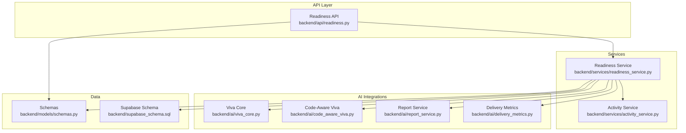
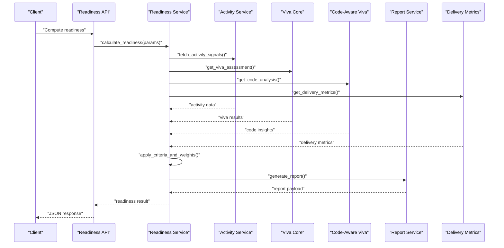
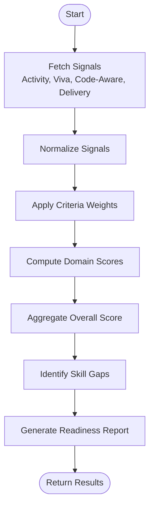
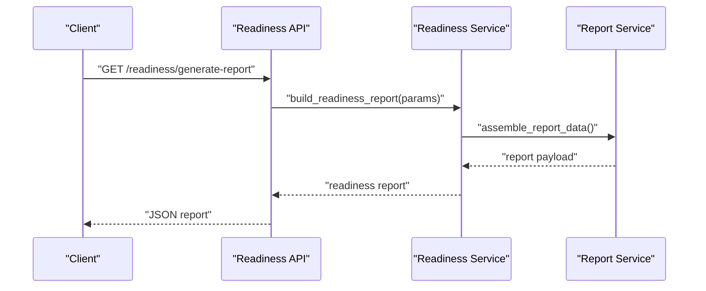
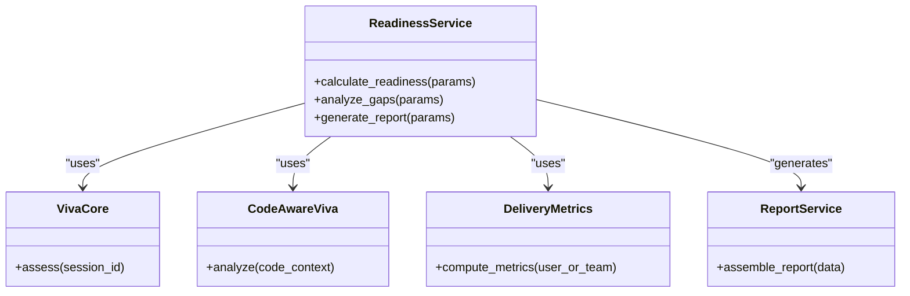
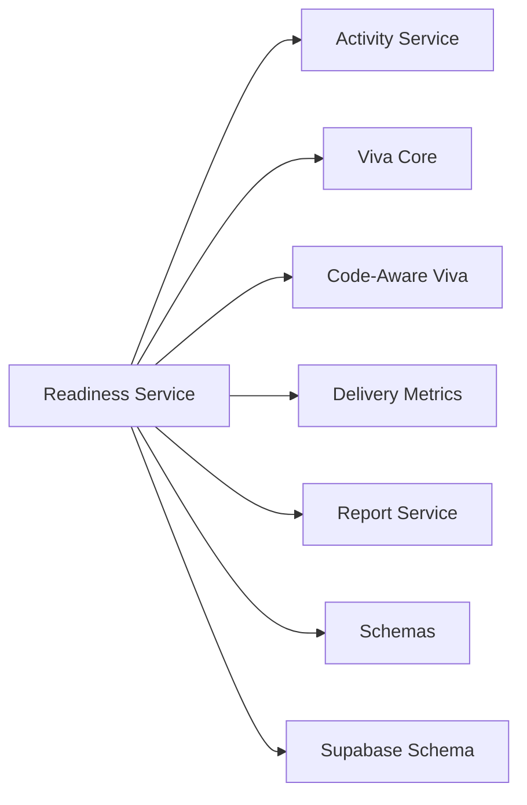

# Readiness Service

<cite>
**Referenced Files in This Document**
- [readiness_service.py](file://backend/services/readiness_service.py)
- [readiness.py](file://backend/api/readiness.py)
- [activity_service.py](file://backend/services/activity_service.py)
- [viva_core.py](file://backend/ai/viva_core.py)
- [code_aware_viva.py](file://backend/ai/code_aware_viva.py)
- [report_service.py](file://backend/ai/report_service.py)
- [delivery_metrics.py](file://backend/ai/delivery_metrics.py)
- [schemas.py](file://backend/models/schemas.py)
- [supabase_schema.sql](file://backend/supabase_schema.sql)
</cite>

## Table of Contents
1. [Introduction](#introduction)
2. [Project Structure](#project-structure)
3. [Core Components](#core-components)
4. [Architecture Overview](#architecture-overview)
5. [Detailed Component Analysis](#detailed-component-analysis)
6. [Dependency Analysis](#dependency-analysis)
7. [Performance Considerations](#performance-considerations)
8. [Troubleshooting Guide](#troubleshooting-guide)
9. [Conclusion](#conclusion)
10. [Appendices](#appendices)

## Introduction
This document explains the Readiness Service, which aggregates multiple signals to assess learner readiness for delivery and viva assessments. It covers:
- Readiness assessment algorithms and scoring systems
- Performance evaluation metrics and competency scoring
- API methods for calculating readiness scores, analyzing skill gaps, and generating readiness reports
- Configuration of readiness criteria
- Integration with AI-powered assessment results (viva, code-aware analysis), code analysis outputs, and user activity data

The service is designed to be extensible, allowing new signals and weights to be added without changing core logic.

## Project Structure
The Readiness Service spans backend services, API endpoints, AI integration modules, and data models:
- Services: readiness calculation and orchestration
- API: HTTP endpoints exposing readiness operations
- AI integrations: viva, code-aware viva, reporting, and delivery metrics
- Models and schema: request/response schemas and database structures

**Diagram sources**
- [readiness.py](file://backend/api/readiness.py)
- [readiness_service.py](file://backend/services/readiness_service.py)
- [activity_service.py](file://backend/services/activity_service.py)
- [viva_core.py](file://backend/ai/viva_core.py)
- [code_aware_viva.py](file://backend/ai/code_aware_viva.py)
- [report_service.py](file://backend/ai/report_service.py)
- [delivery_metrics.py](file://backend/ai/delivery_metrics.py)
- [schemas.py](file://backend/models/schemas.py)
- [supabase_schema.sql](file://backend/supabase_schema.sql)

**Section sources**
- [readiness.py](file://backend/api/readiness.py)
- [readiness_service.py](file://backend/services/readiness_service.py)
- [activity_service.py](file://backend/services/activity_service.py)
- [viva_core.py](file://backend/ai/viva_core.py)
- [code_aware_viva.py](file://backend/ai/code_aware_viva.py)
- [report_service.py](file://backend/ai/report_service.py)
- [delivery_metrics.py](file://backend/ai/delivery_metrics.py)
- [schemas.py](file://backend/models/schemas.py)
- [supabase_schema.sql](file://backend/supabase_schema.sql)

## Core Components
- Readiness Service: Orchestrates readiness calculations by combining signals from activity, viva, code-aware viva, and delivery metrics. Applies configurable criteria and weights to produce composite readiness scores and gap analyses.
- Readiness API: Exposes endpoints for computing readiness, retrieving gaps, and generating readiness reports.
- Activity Service: Provides usage and engagement signals that influence readiness.
- AI Integrations:
  - Viva Core: Aggregates viva session outcomes and quality indicators.
  - Code-Aware Viva: Incorporates code analysis outputs into readiness.
  - Report Service: Produces structured readiness reports.
  - Delivery Metrics: Supplies performance metrics relevant to readiness.
- Schemas: Defines request/response shapes used across API and service layers.
- Database Schema: Underlying persistence structure referenced by services.

Key responsibilities:
- Compute readiness scores per user or team using weighted criteria
- Identify skill gaps and recommend focus areas
- Generate comprehensive readiness reports integrating multiple signals
- Provide configuration hooks for criteria and weights

**Section sources**
- [readiness_service.py](file://backend/services/readiness_service.py)
- [readiness.py](file://backend/api/readiness.py)
- [activity_service.py](file://backend/services/activity_service.py)
- [viva_core.py](file://backend/ai/viva_core.py)
- [code_aware_viva.py](file://backend/ai/code_aware_viva.py)
- [report_service.py](file://backend/ai/report_service.py)
- [delivery_metrics.py](file://backend/ai/delivery_metrics.py)
- [schemas.py](file://backend/models/schemas.py)
- [supabase_schema.sql](file://backend/supabase_schema.sql)

## Architecture Overview
The Readiness Service follows a layered architecture:
- API layer receives requests and delegates to the service
- Service layer orchestrates data collection from activity, viva, code-aware viva, and delivery metrics
- AI modules provide specialized assessments and metrics
- Schemas enforce consistent input/output contracts
- Database schema supports persistence of underlying entities

**Diagram sources**
- [readiness.py](file://backend/api/readiness.py)
- [readiness_service.py](file://backend/services/readiness_service.py)
- [activity_service.py](file://backend/services/activity_service.py)
- [viva_core.py](file://backend/ai/viva_core.py)
- [code_aware_viva.py](file://backend/ai/code_aware_viva.py)
- [report_service.py](file://backend/ai/report_service.py)
- [delivery_metrics.py](file://backend/ai/delivery_metrics.py)

## Detailed Component Analysis

### Readiness Service
Responsibilities:
- Orchestrate multi-signal readiness computation
- Apply configurable criteria and weights
- Produce composite readiness scores and gap analyses
- Generate readiness reports via report service

Algorithm overview:
- Collect signals from activity, viva, code-aware viva, and delivery metrics
- Normalize signals to a common scale
- Apply criteria weights to compute domain-specific scores
- Aggregate domain scores into an overall readiness score
- Identify gaps where domain scores fall below thresholds
- Generate a structured report summarizing scores, gaps, and recommendations

**Diagram sources**
- [readiness_service.py](file://backend/services/readiness_service.py)
- [activity_service.py](file://backend/services/activity_service.py)
- [viva_core.py](file://backend/ai/viva_core.py)
- [code_aware_viva.py](file://backend/ai/code_aware_viva.py)
- [delivery_metrics.py](file://backend/ai/delivery_metrics.py)
- [report_service.py](file://backend/ai/report_service.py)

**Section sources**
- [readiness_service.py](file://backend/services/readiness_service.py)

### Readiness API
Endpoints:
- Calculate readiness scores
- Analyze skill gaps
- Generate readiness reports

Request/response contracts are defined by schemas. The API validates inputs, calls the service, and returns standardized JSON responses.

**Diagram sources**
- [readiness.py](file://backend/api/readiness.py)
- [readiness_service.py](file://backend/services/readiness_service.py)
- [report_service.py](file://backend/ai/report_service.py)

**Section sources**
- [readiness.py](file://backend/api/readiness.py)

### AI Integrations
- Viva Core: Provides viva assessment results and quality indicators used in readiness scoring.
- Code-Aware Viva: Incorporates code analysis outputs to refine readiness signals.
- Delivery Metrics: Supplies performance metrics relevant to readiness.
- Report Service: Formats and produces readiness reports.

These components are consumed by the Readiness Service to enrich readiness calculations.

**Diagram sources**
- [readiness_service.py](file://backend/services/readiness_service.py)
- [viva_core.py](file://backend/ai/viva_core.py)
- [code_aware_viva.py](file://backend/ai/code_aware_viva.py)
- [delivery_metrics.py](file://backend/ai/delivery_metrics.py)
- [report_service.py](file://backend/ai/report_service.py)

**Section sources**
- [viva_core.py](file://backend/ai/viva_core.py)
- [code_aware_viva.py](file://backend/ai/code_aware_viva.py)
- [delivery_metrics.py](file://backend/ai/delivery_metrics.py)
- [report_service.py](file://backend/ai/report_service.py)

### Data Models and Schema
- Schemas define request/response structures for readiness endpoints and service methods.
- Database schema provides underlying tables and relationships supporting activity, viva sessions, code analysis, and metrics.

Use these references when designing clients or extending the service:
- Request/response payloads
- Field types and constraints
- Relationships between entities

**Section sources**
- [schemas.py](file://backend/models/schemas.py)
- [supabase_schema.sql](file://backend/supabase_schema.sql)

## Dependency Analysis
The Readiness Service depends on several internal modules and external data sources:
- Internal dependencies:
  - Activity Service for engagement signals
  - Viva Core for viva assessment results
  - Code-Aware Viva for code context insights
  - Delivery Metrics for performance indicators
  - Report Service for report generation
  - Schemas for contract enforcement
- External dependencies:
  - Database (Supabase) for persistence

**Diagram sources**
- [readiness_service.py](file://backend/services/readiness_service.py)
- [activity_service.py](file://backend/services/activity_service.py)
- [viva_core.py](file://backend/ai/viva_core.py)
- [code_aware_viva.py](file://backend/ai/code_aware_viva.py)
- [delivery_metrics.py](file://backend/ai/delivery_metrics.py)
- [report_service.py](file://backend/ai/report_service.py)
- [schemas.py](file://backend/models/schemas.py)
- [supabase_schema.sql](file://backend/supabase_schema.sql)

**Section sources**
- [readiness_service.py](file://backend/services/readiness_service.py)
- [activity_service.py](file://backend/services/activity_service.py)
- [viva_core.py](file://backend/ai/viva_core.py)
- [code_aware_viva.py](file://backend/ai/code_aware_viva.py)
- [delivery_metrics.py](file://backend/ai/delivery_metrics.py)
- [report_service.py](file://backend/ai/report_service.py)
- [schemas.py](file://backend/models/schemas.py)
- [supabase_schema.sql](file://backend/supabase_schema.sql)

## Performance Considerations
- Signal aggregation should be batched where possible to reduce I/O overhead.
- Normalization and weighting computations should be vectorized or memoized for repeated queries.
- Caching frequently accessed signals (e.g., recent viva results, delivery metrics) can improve responsiveness.
- Asynchronous processing may be appropriate for heavy report generation tasks.

[No sources needed since this section provides general guidance]

## Troubleshooting Guide
Common issues and resolutions:
- Missing signals: Ensure activity, viva, code-aware, and delivery metrics are available before computing readiness.
- Weight misconfiguration: Validate criteria weights sum appropriately and align with intended scoring policy.
- Schema mismatches: Confirm request/response fields match schema definitions.
- Report generation failures: Check report service availability and data completeness.

Operational checks:
- Verify endpoint responses conform to schemas.
- Inspect logs around signal fetching and normalization steps.
- Validate database connectivity and table integrity.

**Section sources**
- [readiness.py](file://backend/api/readiness.py)
- [readiness_service.py](file://backend/services/readiness_service.py)
- [schemas.py](file://backend/models/schemas.py)

## Conclusion
The Readiness Service integrates multiple assessment signals—activity, viva, code-aware analysis, and delivery metrics—to compute comprehensive readiness scores and actionable gap analyses. Its modular design allows easy extension with new signals and criteria while maintaining clear contracts through schemas and well-defined API endpoints.

[No sources needed since this section summarizes without analyzing specific files]

## Appendices

### Readiness Criteria Configuration
Configuration typically includes:
- Criteria definitions (e.g., viva quality, code proficiency, delivery performance)
- Weights per criterion
- Thresholds for gap identification
- Scoring ranges and normalization rules

Refer to service configuration and schema definitions for exact field names and constraints.

**Section sources**
- [readiness_service.py](file://backend/services/readiness_service.py)
- [schemas.py](file://backend/models/schemas.py)

### Example Workflows
- Computing readiness:
  - Call readiness API with user/team identifiers and optional filters
  - Service fetches signals, applies weights, computes scores, identifies gaps
  - Returns composite readiness score and detailed breakdown
- Generating readiness report:
  - Call report generation endpoint
  - Service assembles data from all signals and formats a comprehensive report
  - Returns structured report payload

**Section sources**
- [readiness.py](file://backend/api/readiness.py)
- [readiness_service.py](file://backend/services/readiness_service.py)
- [report_service.py](file://backend/ai/report_service.py)