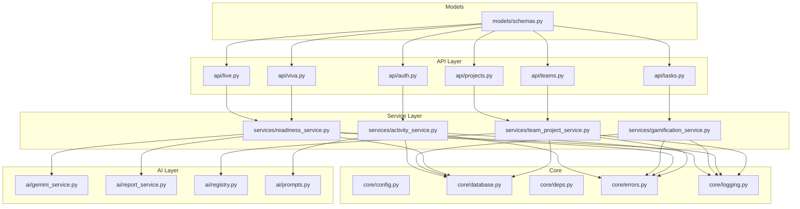
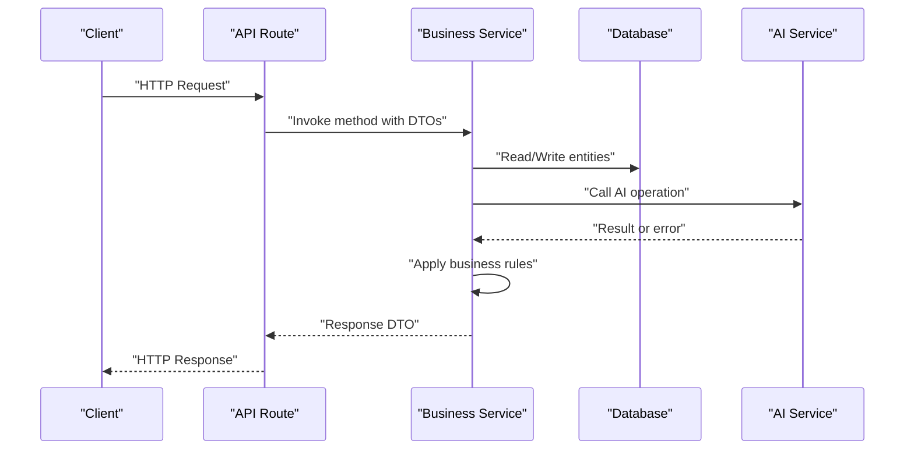
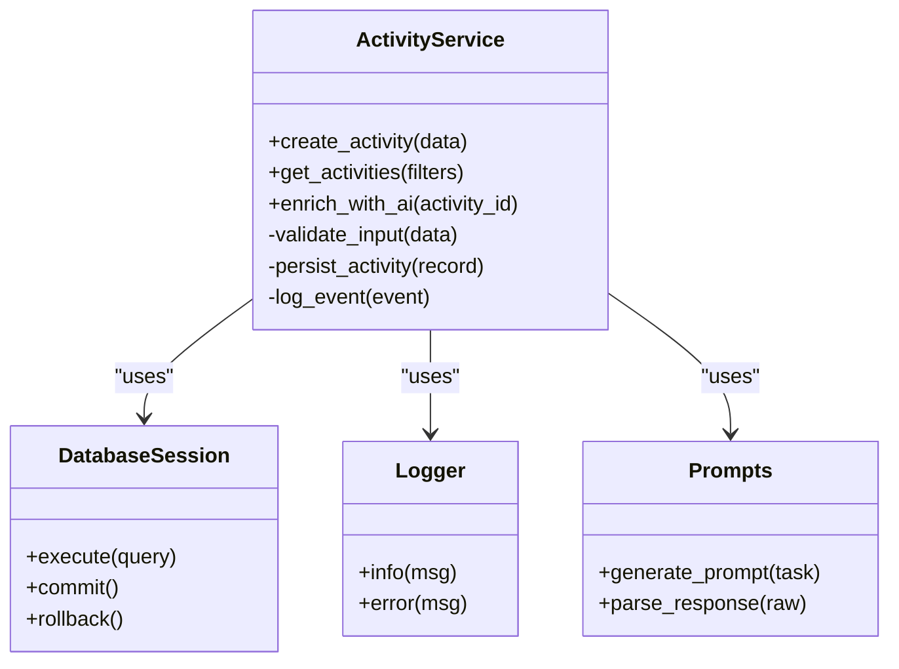
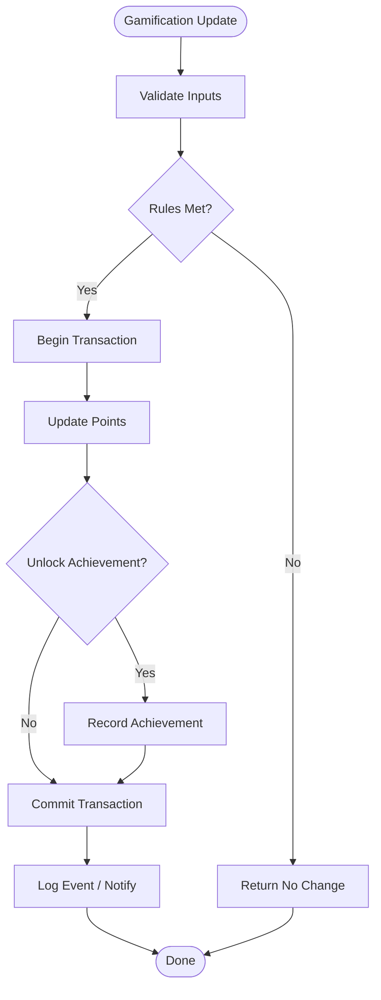
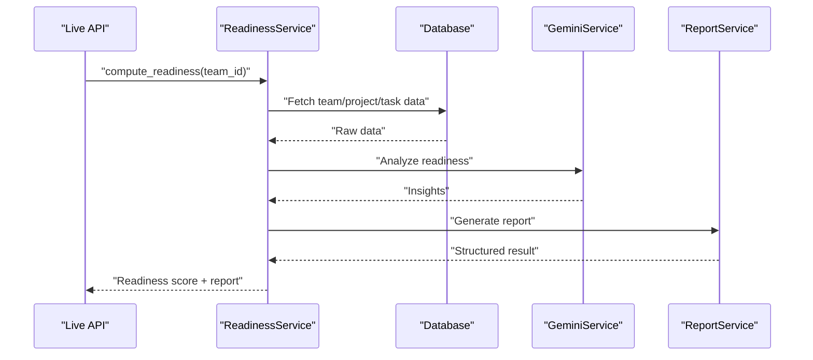
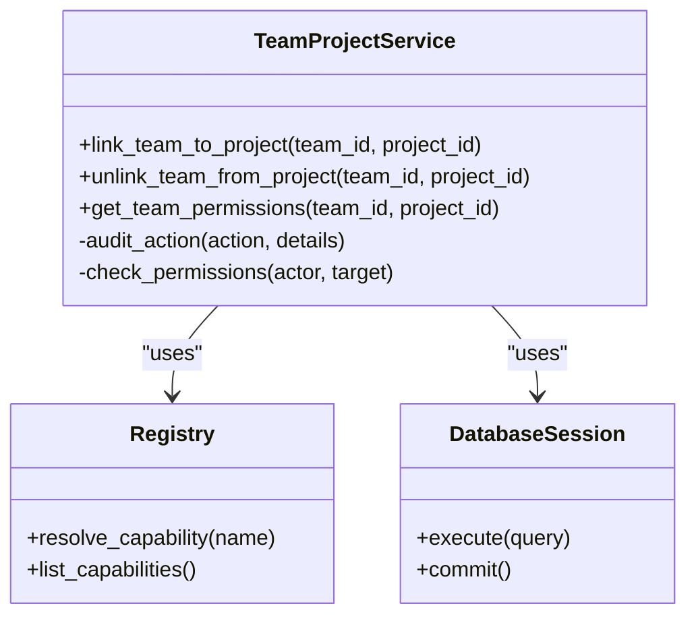
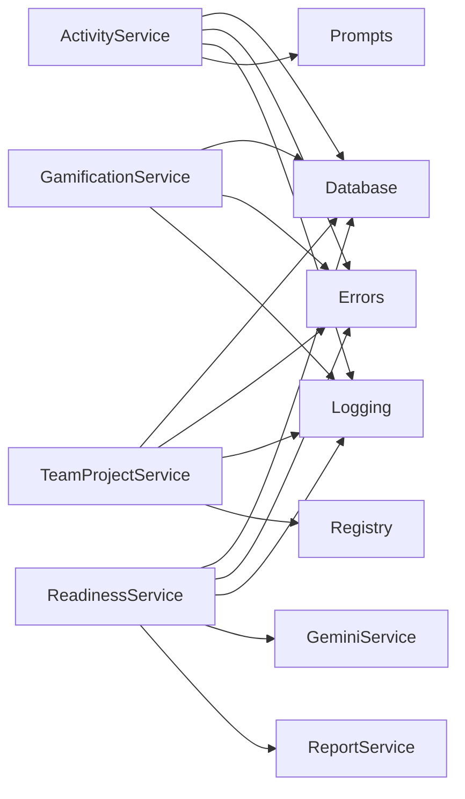

# Service Layer Architecture

<cite>
**Referenced Files in This Document**
- [main.py](file://backend/main.py)
- [config.py](file://backend/core/config.py)
- [database.py](file://backend/core/database.py)
- [deps.py](file://backend/core/deps.py)
- [errors.py](file://backend/core/errors.py)
- [logging.py](file://backend/core/logging.py)
- [activity_service.py](file://backend/services/activity_service.py)
- [gamification_service.py](file://backend/services/gamification_service.py)
- [readiness_service.py](file://backend/services/readiness_service.py)
- [team_project_service.py](file://backend/services/team_project_service.py)
- [auth.py](file://backend/api/auth.py)
- [projects.py](file://backend/api/projects.py)
- [teams.py](file://backend/api/teams.py)
- [tasks.py](file://backend/api/tasks.py)
- [live.py](file://backend/api/live.py)
- [viva.py](file://backend/api/viva.py)
- [gemini_service.py](file://backend/ai/gemini_service.py)
- [report_service.py](file://backend/ai/report_service.py)
- [registry.py](file://backend/ai/registry.py)
- [prompts.py](file://backend/ai/prompts.py)
- [schemas.py](file://backend/models/schemas.py)
</cite>

## Table of Contents
1. [Introduction](#introduction)
2. [Project Structure](#project-structure)
3. [Core Components](#core-components)
4. [Architecture Overview](#architecture-overview)
5. [Detailed Component Analysis](#detailed-component-analysis)
6. [Dependency Analysis](#dependency-analysis)
7. [Performance Considerations](#performance-considerations)
8. [Troubleshooting Guide](#troubleshooting-guide)
9. [Conclusion](#conclusion)
10. [Appendices](#appendices)

## Introduction
This document describes the service layer architecture for the backend, focusing on how business logic is organized, composed, and integrated with AI services and databases. It explains interface design, dependency management, transaction handling, caching strategies, external integrations, error propagation, logging patterns, and testing approaches. The goal is to provide a clear mental model for developers working on or extending the service layer.

## Project Structure
The backend follows a layered structure:
- API routes define HTTP endpoints and delegate work to services.
- Services encapsulate business logic, orchestrate data access, and integrate with AI services.
- Core modules provide configuration, database access, dependency injection, errors, and logging.
- AI modules implement external AI integrations and prompt management.
- Models define shared schemas used across layers.

**Diagram sources**
- [main.py:1-200](file://backend/main.py#L1-L200)
- [auth.py:1-200](file://backend/api/auth.py#L1-L200)
- [projects.py:1-200](file://backend/api/projects.py#L1-L200)
- [teams.py:1-200](file://backend/api/teams.py#L1-L200)
- [tasks.py:1-200](file://backend/api/tasks.py#L1-L200)
- [live.py:1-200](file://backend/api/live.py#L1-L200)
- [viva.py:1-200](file://backend/api/viva.py#L1-L200)
- [activity_service.py:1-200](file://backend/services/activity_service.py#L1-L200)
- [gamification_service.py:1-200](file://backend/services/gamification_service.py#L1-L200)
- [readiness_service.py:1-200](file://backend/services/readiness_service.py#L1-L200)
- [team_project_service.py:1-200](file://backend/services/team_project_service.py#L1-L200)
- [config.py:1-200](file://backend/core/config.py#L1-L200)
- [database.py:1-200](file://backend/core/database.py#L1-L200)
- [deps.py:1-200](file://backend/core/deps.py#L1-L200)
- [errors.py:1-200](file://backend/core/errors.py#L1-L200)
- [logging.py:1-200](file://backend/core/logging.py#L1-L200)
- [gemini_service.py:1-200](file://backend/ai/gemini_service.py#L1-L200)
- [report_service.py:1-200](file://backend/ai/report_service.py#L1-L200)
- [registry.py:1-200](file://backend/ai/registry.py#L1-L200)
- [prompts.py:1-200](file://backend/ai/prompts.py#L1-L200)
- [schemas.py:1-200](file://backend/models/schemas.py#L1-L200)

**Section sources**
- [main.py:1-200](file://backend/main.py#L1-L200)

## Core Components
- Configuration: Centralized settings for environment variables, feature flags, and runtime options.
- Database: Connection management, session scoping, and query helpers.
- Dependency Injection: Shared providers for services, DB sessions, and external clients.
- Errors: Standardized exception types and mapping to HTTP responses.
- Logging: Structured logging setup and request-scoped context.

Key responsibilities:
- Provide consistent interfaces for services to access configuration, DB, and logs.
- Ensure exceptions are normalized and propagated uniformly.
- Enable testability via injectable dependencies.

**Section sources**
- [config.py:1-200](file://backend/core/config.py#L1-L200)
- [database.py:1-200](file://backend/core/database.py#L1-L200)
- [deps.py:1-200](file://backend/core/deps.py#L1-L200)
- [errors.py:1-200](file://backend/core/errors.py#L1-L200)
- [logging.py:1-200](file://backend/core/logging.py#L1-L200)

## Architecture Overview
The service layer sits between API routes and persistence/AI layers. Each service encapsulates domain operations, composes multiple dependencies (DB, AI, cache), and enforces business rules. APIs remain thin by delegating validation and orchestration to services.

**Diagram sources**
- [auth.py:1-200](file://backend/api/auth.py#L1-L200)
- [projects.py:1-200](file://backend/api/projects.py#L1-L200)
- [activity_service.py:1-200](file://backend/services/activity_service.py#L1-L200)
- [readiness_service.py:1-200](file://backend/services/readiness_service.py#L1-L200)
- [database.py:1-200](file://backend/core/database.py#L1-L200)
- [gemini_service.py:1-200](file://backend/ai/gemini_service.py#L1-L200)

## Detailed Component Analysis

### Activity Service
Responsibilities:
- Orchestrate activity tracking, enrichment, and reporting.
- Integrate with AI prompts for content generation or analysis.
- Persist activity records and metrics.

Design patterns:
- Composition over inheritance; injected DB session and logger.
- Error normalization using core errors.
- Optional caching for read-heavy operations.

**Diagram sources**
- [activity_service.py:1-200](file://backend/services/activity_service.py#L1-L200)
- [database.py:1-200](file://backend/core/database.py#L1-L200)
- [logging.py:1-200](file://backend/core/logging.py#L1-L200)
- [prompts.py:1-200](file://backend/ai/prompts.py#L1-L200)

**Section sources**
- [activity_service.py:1-200](file://backend/services/activity_service.py#L1-L200)

### Gamification Service
Responsibilities:
- Manage achievements, points, and leaderboards.
- Apply gamification rules and update user progress.
- Coordinate with tasks and team activities.

Design patterns:
- Transactional updates for point changes and achievement unlocks.
- Event-driven notifications via logging hooks.

**Diagram sources**
- [gamification_service.py:1-200](file://backend/services/gamification_service.py#L1-L200)
- [database.py:1-200](file://backend/core/database.py#L1-L200)
- [logging.py:1-200](file://backend/core/logging.py#L1-L200)

**Section sources**
- [gamification_service.py:1-200](file://backend/services/gamification_service.py#L1-L200)

### Readiness Service
Responsibilities:
- Compute readiness scores based on project and task data.
- Integrate with AI models for insights and recommendations.
- Cache results for performance.

Integration with AI:
- Uses Gemini for analysis and Report Service for structured outputs.

**Diagram sources**
- [live.py:1-200](file://backend/api/live.py#L1-L200)
- [readiness_service.py:1-200](file://backend/services/readiness_service.py#L1-L200)
- [database.py:1-200](file://backend/core/database.py#L1-L200)
- [gemini_service.py:1-200](file://backend/ai/gemini_service.py#L1-L200)
- [report_service.py:1-200](file://backend/ai/report_service.py#L1-L200)

**Section sources**
- [readiness_service.py:1-200](file://backend/services/readiness_service.py#L1-L200)

### Team Project Service
Responsibilities:
- Manage team-project relationships and permissions.
- Orchestrate cross-cutting concerns like audit logging.
- Coordinate with AI registry for dynamic capabilities.

**Diagram sources**
- [team_project_service.py:1-200](file://backend/services/team_project_service.py#L1-L200)
- [registry.py:1-200](file://backend/ai/registry.py#L1-L200)
- [database.py:1-200](file://backend/core/database.py#L1-L200)

**Section sources**
- [team_project_service.py:1-200](file://backend/services/team_project_service.py#L1-L200)

## Dependency Analysis
Services depend on:
- Database session for persistence.
- Core errors and logging for cross-cutting concerns.
- AI services for intelligent features.
- Shared schemas for input/output contracts.

**Diagram sources**
- [activity_service.py:1-200](file://backend/services/activity_service.py#L1-L200)
- [gamification_service.py:1-200](file://backend/services/gamification_service.py#L1-L200)
- [readiness_service.py:1-200](file://backend/services/readiness_service.py#L1-L200)
- [team_project_service.py:1-200](file://backend/services/team_project_service.py#L1-L200)
- [database.py:1-200](file://backend/core/database.py#L1-L200)
- [errors.py:1-200](file://backend/core/errors.py#L1-L200)
- [logging.py:1-200](file://backend/core/logging.py#L1-L200)
- [prompts.py:1-200](file://backend/ai/prompts.py#L1-L200)
- [gemini_service.py:1-200](file://backend/ai/gemini_service.py#L1-L200)
- [report_service.py:1-200](file://backend/ai/report_service.py#L1-L200)
- [registry.py:1-200](file://backend/ai/registry.py#L1-L200)

**Section sources**
- [deps.py:1-200](file://backend/core/deps.py#L1-L200)

## Performance Considerations
- Use connection pooling and short-lived transactions to reduce contention.
- Cache expensive AI computations where appropriate, with invalidation strategies.
- Batch database writes for bulk operations.
- Avoid N+1 queries by eager loading related entities.
- Implement pagination for large datasets.

[No sources needed since this section provides general guidance]

## Troubleshooting Guide
Common issues:
- Database connection failures: check configuration and network connectivity.
- AI service timeouts: implement retries and fallbacks.
- Validation errors: ensure DTOs match schema definitions.
- Logging gaps: verify request-scoped context propagation.

Debugging steps:
- Inspect structured logs for error traces.
- Reproduce with minimal payloads.
- Use dependency injection to swap implementations for tests.

**Section sources**
- [errors.py:1-200](file://backend/core/errors.py#L1-L200)
- [logging.py:1-200](file://backend/core/logging.py#L1-L200)

## Conclusion
The service layer provides a clean separation of concerns, enabling maintainable business logic that integrates seamlessly with databases and AI services. By leveraging dependency injection, standardized errors, and structured logging, the system achieves robustness and testability. Future enhancements should focus on caching strategies, transaction optimization, and expanding AI integration patterns.

[No sources needed since this section summarizes without analyzing specific files]

## Appendices

### Service Interface Design Guidelines
- Define clear input/output DTOs using shared schemas.
- Keep methods focused on single responsibilities.
- Use exceptions for error signaling and return values for success paths.
- Inject dependencies explicitly for testability.

### Transaction Management Patterns
- Wrap multi-step operations in explicit transactions.
- Roll back on any failure to maintain consistency.
- Prefer optimistic locking for concurrent updates.

### Caching Strategies
- Cache read-heavy, immutable data with TTLs.
- Invalidate caches on write operations.
- Use distributed cache for horizontal scaling.

### External Service Integration
- Abstract external calls behind interfaces.
- Implement circuit breakers and retries.
- Log all external interactions for observability.

### Testing Approaches
- Mock external dependencies (DB, AI).
- Use fixtures for common test data.
- Assert both success and error paths.

[No sources needed since this section provides general guidance]