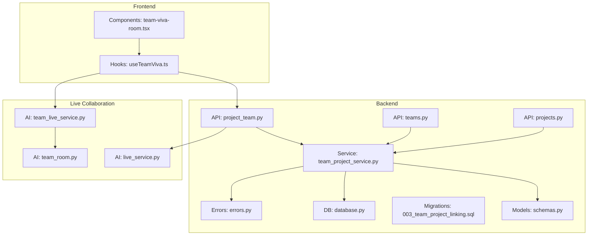
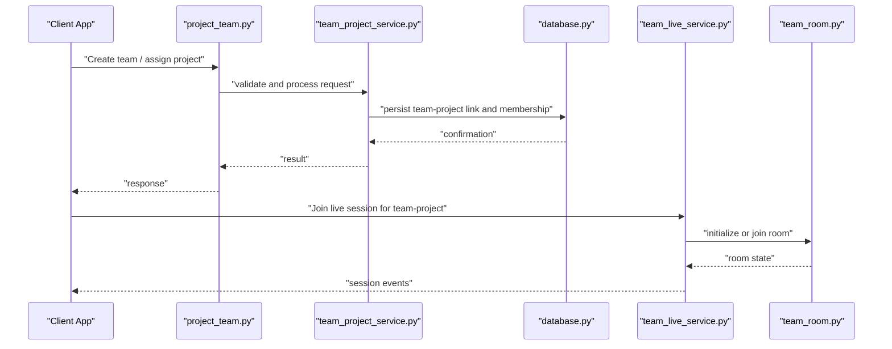
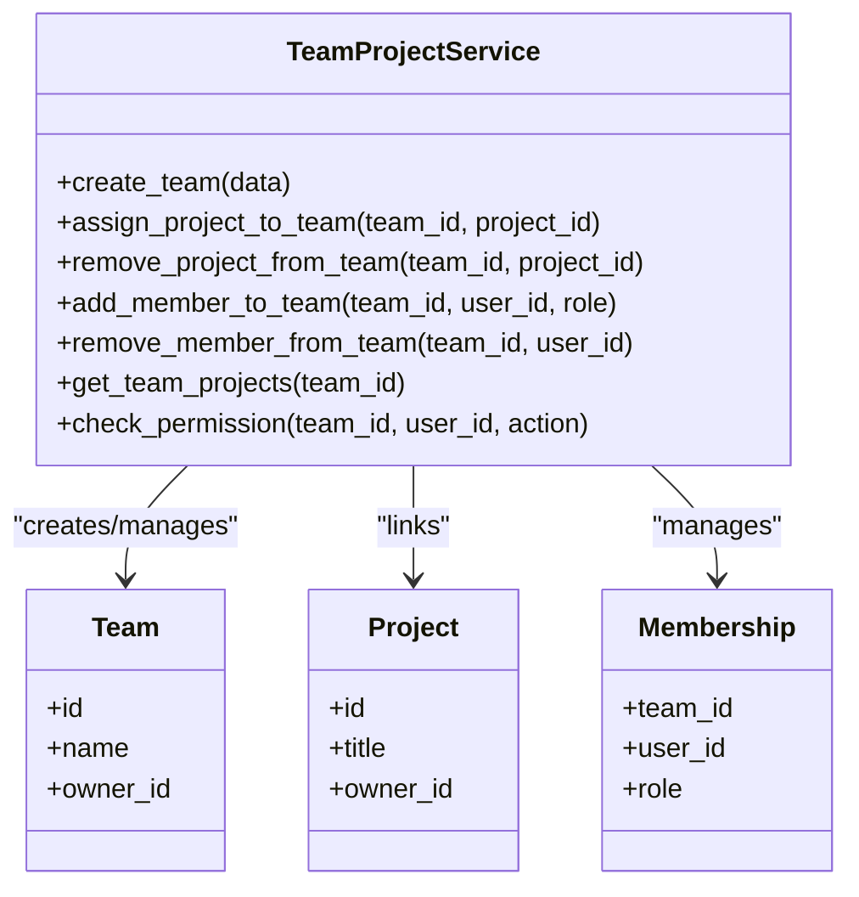
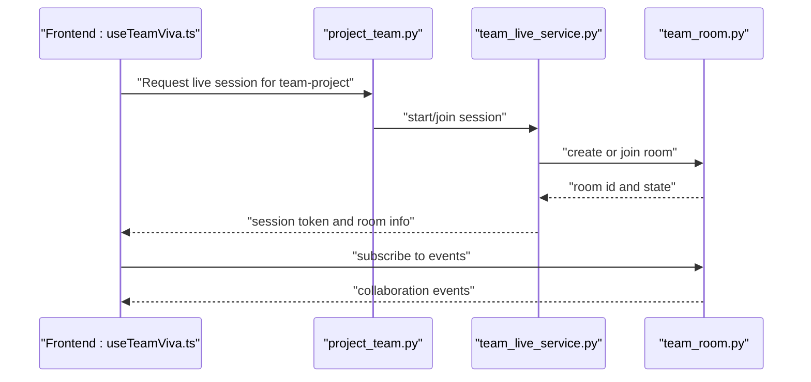
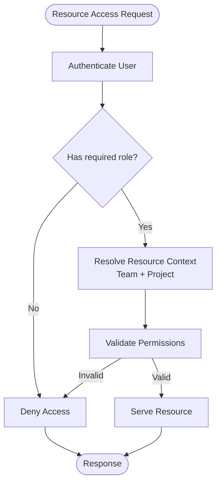
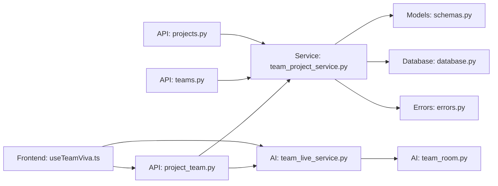

# Team Project Service

<cite>
**Referenced Files in This Document**
- [team_project_service.py](file://backend/services/team_project_service.py)
- [project_team.py](file://backend/api/project_team.py)
- [teams.py](file://backend/api/teams.py)
- [projects.py](file://backend/api/projects.py)
- [schemas.py](file://backend/models/schemas.py)
- [database.py](file://backend/core/database.py)
- [errors.py](file://backend/core/errors.py)
- [003_team_project_linking.sql](file://backend/migrations/003_team_project_linking.sql)
- [test_project_team_linking.py](file://backend/tests/test_project_team_linking.py)
- [live_service.py](file://backend/ai/live_service.py)
- [team_live_service.py](file://backend/ai/team_live_service.py)
- [team_room.py](file://backend/ai/team_room.py)
- [useTeamViva.ts](file://src/lib/useTeamViva.ts)
- [team-viva-room.tsx](file://src/components/live/team-viva-room.tsx)
</cite>

## Table of Contents
1. [Introduction](#introduction)
2. [Project Structure](#project-structure)
3. [Core Components](#core-components)
4. [Architecture Overview](#architecture-overview)
5. [Detailed Component Analysis](#detailed-component-analysis)
6. [Dependency Analysis](#dependency-analysis)
7. [Performance Considerations](#performance-considerations)
8. [Troubleshooting Guide](#troubleshooting-guide)
9. [Conclusion](#conclusion)
10. [Appendices](#appendices)

## Introduction
This document provides comprehensive documentation for the Team Project Service, focusing on team-project relationship management, collaborative workspace features, and shared resource handling. It explains service methods for team creation, project assignment, member management, and collaboration coordination. It also covers team permissions, project sharing mechanisms, real-time collaboration features, and integration with project management, file handling, and live session services to support collaborative learning environments.

## Project Structure
The Team Project Service is implemented primarily in the backend Python codebase and integrated with frontend components and live session services. Key areas include:
- Service layer for business logic (team-project linking, membership, permissions)
- API endpoints exposing operations to clients
- Data models and database schema for teams, projects, and their relationships
- Live collaboration services for real-time sessions
- Frontend hooks and components that consume these APIs and collaborate in real time

**Diagram sources**
- [project_team.py](file://backend/api/project_team.py)
- [teams.py](file://backend/api/teams.py)
- [projects.py](file://backend/api/projects.py)
- [team_project_service.py](file://backend/services/team_project_service.py)
- [schemas.py](file://backend/models/schemas.py)
- [database.py](file://backend/core/database.py)
- [003_team_project_linking.sql](file://backend/migrations/003_team_project_linking.sql)
- [errors.py](file://backend/core/errors.py)
- [live_service.py](file://backend/ai/live_service.py)
- [team_live_service.py](file://backend/ai/team_live_service.py)
- [team_room.py](file://backend/ai/team_room.py)
- [useTeamViva.ts](file://src/lib/useTeamViva.ts)
- [team-viva-room.tsx](file://src/components/live/team-viva-room.tsx)

**Section sources**
- [team_project_service.py](file://backend/services/team_project_service.py)
- [project_team.py](file://backend/api/project_team.py)
- [teams.py](file://backend/api/teams.py)
- [projects.py](file://backend/api/projects.py)
- [schemas.py](file://backend/models/schemas.py)
- [database.py](file://backend/core/database.py)
- [003_team_project_linking.sql](file://backend/migrations/003_team_project_linking.sql)
- [errors.py](file://backend/core/errors.py)
- [live_service.py](file://backend/ai/live_service.py)
- [team_live_service.py](file://backend/ai/team_live_service.py)
- [team_room.py](file://backend/ai/team_room.py)
- [useTeamViva.ts](file://src/lib/useTeamViva.ts)
- [team-viva-room.tsx](file://src/components/live/team-viva-room.tsx)

## Core Components
- Team-Project Linking Service: Centralizes business logic for associating teams with projects, managing memberships, roles, and permissions.
- API Layer: Exposes REST endpoints for creating teams, assigning projects, adding/removing members, and coordinating collaboration.
- Data Models and Schema: Defines entities such as teams, projects, and their relationships; includes migrations for relational linking.
- Error Handling: Provides consistent error types and messages across service and API layers.
- Live Collaboration Integration: Connects team-project context with live session services for real-time collaboration.

Key responsibilities:
- Create and manage teams
- Assign projects to teams
- Manage team members and roles
- Enforce permissions for accessing and modifying resources
- Coordinate collaboration via live sessions

**Section sources**
- [team_project_service.py](file://backend/services/team_project_service.py)
- [project_team.py](file://backend/api/project_team.py)
- [teams.py](file://backend/api/teams.py)
- [projects.py](file://backend/api/projects.py)
- [schemas.py](file://backend/models/schemas.py)
- [database.py](file://backend/core/database.py)
- [errors.py](file://backend/core/errors.py)

## Architecture Overview
The architecture follows a layered approach:
- API endpoints receive requests and delegate to the service layer
- The service layer orchestrates data access, validation, and business rules
- Database interactions are abstracted through a database module
- Live collaboration integrates with AI-backed live services and room management
- Frontend consumes APIs and uses hooks to coordinate real-time collaboration

**Diagram sources**
- [project_team.py](file://backend/api/project_team.py)
- [team_project_service.py](file://backend/services/team_project_service.py)
- [database.py](file://backend/core/database.py)
- [team_live_service.py](file://backend/ai/team_live_service.py)
- [team_room.py](file://backend/ai/team_room.py)

## Detailed Component Analysis

### Team-Project Relationship Management
The service manages associations between teams and projects, including:
- Creating a new team and linking it to one or more projects
- Adding or removing projects from a team
- Managing team membership and roles within the context of linked projects
- Enforcing permissions based on role and ownership

**Diagram sources**
- [team_project_service.py](file://backend/services/team_project_service.py)
- [schemas.py](file://backend/models/schemas.py)
- [003_team_project_linking.sql](file://backend/migrations/003_team_project_linking.sql)

**Section sources**
- [team_project_service.py](file://backend/services/team_project_service.py)
- [schemas.py](file://backend/models/schemas.py)
- [003_team_project_linking.sql](file://backend/migrations/003_team_project_linking.sql)

### Collaborative Workspace Features
Collaboration is coordinated through live session services and room management:
- Teams can initiate or join live sessions tied to specific projects
- Real-time events are broadcast to participants within a room
- Session state is synchronized across collaborators

**Diagram sources**
- [project_team.py](file://backend/api/project_team.py)
- [team_live_service.py](file://backend/ai/team_live_service.py)
- [team_room.py](file://backend/ai/team_room.py)
- [useTeamViva.ts](file://src/lib/useTeamViva.ts)

**Section sources**
- [project_team.py](file://backend/api/project_team.py)
- [team_live_service.py](file://backend/ai/team_live_service.py)
- [team_room.py](file://backend/ai/team_room.py)
- [useTeamViva.ts](file://src/lib/useTeamViva.ts)
- [team-viva-room.tsx](file://src/components/live/team-viva-room.tsx)

### Shared Resource Handling
Shared resources (files, artifacts, and live content) are managed by integrating with file handling and live session services:
- Resources are associated with teams and projects
- Access control ensures only authorized members can read/write
- Live sessions can reference shared resources for collaborative editing or review

**Diagram sources**
- [team_project_service.py](file://backend/services/team_project_service.py)
- [errors.py](file://backend/core/errors.py)
- [database.py](file://backend/core/database.py)

**Section sources**
- [team_project_service.py](file://backend/services/team_project_service.py)
- [errors.py](file://backend/core/errors.py)
- [database.py](file://backend/core/database.py)

### Service Methods Reference
- Team Creation: Create a new team and set initial owner and metadata
- Project Assignment: Link a project to a team or remove an existing link
- Member Management: Add/remove members and assign roles within a team
- Permission Checks: Validate actions against team membership and roles
- Collaboration Coordination: Initiate or join live sessions scoped to a team-project pair

Typical usage patterns:
- Create team -> assign project -> add members -> start live session
- Remove member -> revoke permissions -> update live session membership

**Section sources**
- [team_project_service.py](file://backend/services/team_project_service.py)
- [project_team.py](file://backend/api/project_team.py)

### API Endpoints Overview
Endpoints exposed by the API layer:
- Team endpoints: create, list, update, delete teams
- Project-team linking: assign/remove projects to/from teams
- Membership endpoints: add/remove members, update roles
- Collaboration endpoints: start/join live sessions for a team-project

These endpoints validate inputs, enforce permissions, and return structured responses.

**Section sources**
- [teams.py](file://backend/api/teams.py)
- [project_team.py](file://backend/api/project_team.py)
- [projects.py](file://backend/api/projects.py)

### Data Models and Schema
Data models define core entities and relationships:
- Teams: identify team identity and ownership
- Projects: represent work items linked to teams
- Memberships: capture user-role associations within teams
- Links: connect teams to projects

A dedicated migration establishes the team-project linking structure.

**Section sources**
- [schemas.py](file://backend/models/schemas.py)
- [003_team_project_linking.sql](file://backend/migrations/003_team_project_linking.sql)

### Error Handling Strategy
Consistent error types and messages are used across service and API layers:
- Validation errors for invalid inputs
- Authorization errors for insufficient permissions
- Conflict errors for duplicate assignments
- Not found errors for missing entities

Errors are surfaced to clients with clear codes and messages.

**Section sources**
- [errors.py](file://backend/core/errors.py)
- [team_project_service.py](file://backend/services/team_project_service.py)
- [project_team.py](file://backend/api/project_team.py)

## Dependency Analysis
The following diagram illustrates key dependencies among components:

**Diagram sources**
- [project_team.py](file://backend/api/project_team.py)
- [teams.py](file://backend/api/teams.py)
- [projects.py](file://backend/api/projects.py)
- [team_project_service.py](file://backend/services/team_project_service.py)
- [schemas.py](file://backend/models/schemas.py)
- [database.py](file://backend/core/database.py)
- [errors.py](file://backend/core/errors.py)
- [team_live_service.py](file://backend/ai/team_live_service.py)
- [team_room.py](file://backend/ai/team_room.py)
- [useTeamViva.ts](file://src/lib/useTeamViva.ts)

**Section sources**
- [project_team.py](file://backend/api/project_team.py)
- [teams.py](file://backend/api/teams.py)
- [projects.py](file://backend/api/projects.py)
- [team_project_service.py](file://backend/services/team_project_service.py)
- [schemas.py](file://backend/models/schemas.py)
- [database.py](file://backend/core/database.py)
- [errors.py](file://backend/core/errors.py)
- [team_live_service.py](file://backend/ai/team_live_service.py)
- [team_room.py](file://backend/ai/team_room.py)
- [useTeamViva.ts](file://src/lib/useTeamViva.ts)

## Performance Considerations
- Minimize database round-trips by batching operations where possible
- Cache frequently accessed team-project mappings and membership lists
- Use efficient queries to avoid N+1 problems when listing team projects or members
- Limit live session payload sizes and throttle event frequency to reduce overhead
- Implement pagination for large lists of projects or members

[No sources needed since this section provides general guidance]

## Troubleshooting Guide
Common issues and resolutions:
- Permission denied: Verify user membership and role in the target team; ensure correct action is allowed by policy
- Duplicate project assignment: Confirm no existing link before creating; handle conflict errors gracefully
- Missing team or project: Validate IDs and existence prior to operations; return not found errors
- Live session failures: Check room initialization and network connectivity; retry with backoff

Diagnostic steps:
- Inspect error codes and messages returned by the service and API
- Review database constraints and migration status for team-project linking
- Validate frontend hook usage and session lifecycle

**Section sources**
- [errors.py](file://backend/core/errors.py)
- [team_project_service.py](file://backend/services/team_project_service.py)
- [project_team.py](file://backend/api/project_team.py)
- [003_team_project_linking.sql](file://backend/migrations/003_team_project_linking.sql)

## Conclusion
The Team Project Service provides robust team-project relationship management, collaborative workspace features, and shared resource handling. It integrates seamlessly with project management, file handling, and live session services to enable effective collaborative learning environments. Clear permission models, consistent error handling, and scalable design support reliable operation at scale.

[No sources needed since this section summarizes without analyzing specific files]

## Appendices

### Example Scenarios
- Team creation and project assignment:
  - Create a team, assign a project, add members with appropriate roles, and start a live session for collaboration
- Project sharing mechanism:
  - Link multiple projects to a team; restrict access based on membership and roles
- Real-time collaboration:
  - Join a live session scoped to a team-project pair; synchronize events across participants

**Section sources**
- [team_project_service.py](file://backend/services/team_project_service.py)
- [project_team.py](file://backend/api/project_team.py)
- [team_live_service.py](file://backend/ai/team_live_service.py)
- [useTeamViva.ts](file://src/lib/useTeamViva.ts)
- [team-viva-room.tsx](file://src/components/live/team-viva-room.tsx)

### Test Coverage
- Tests verify team-project linking behavior and edge cases
- Ensure correctness of membership updates and permission checks

**Section sources**
- [test_project_team_linking.py](file://backend/tests/test_project_team_linking.py)