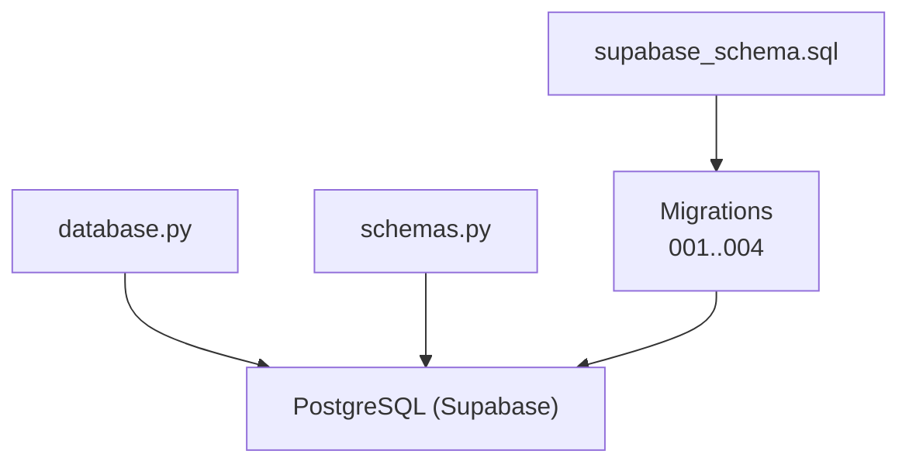
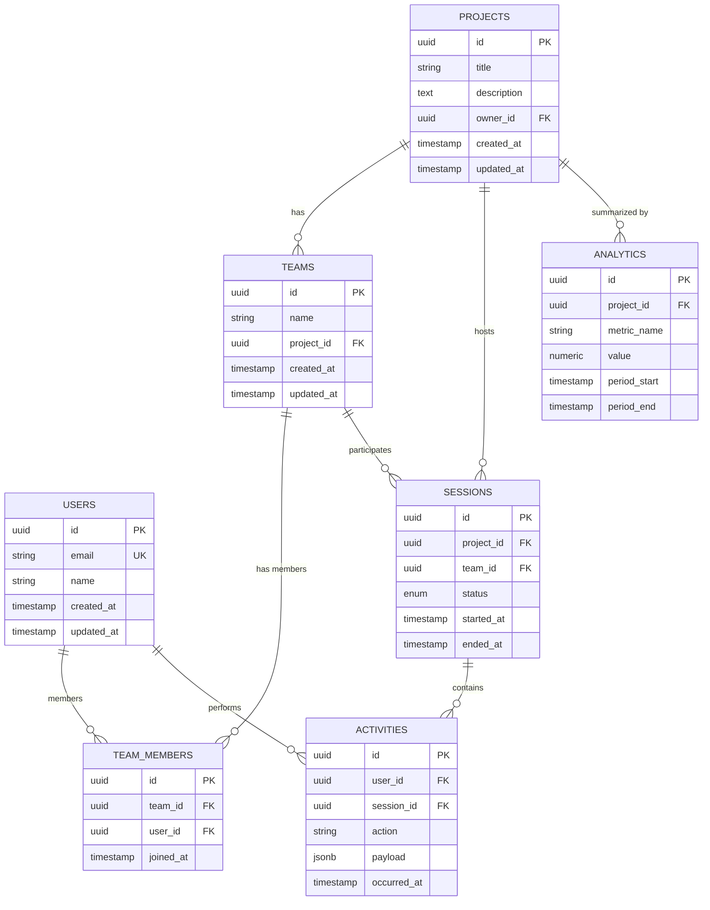
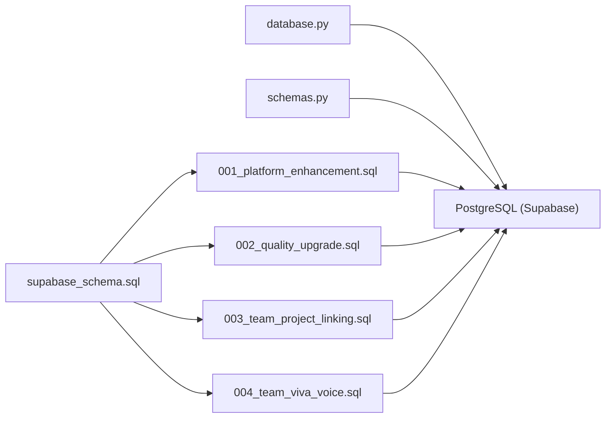

# Database Schema & Data Models

<cite>
**Referenced Files in This Document**
- [supabase_schema.sql](file://backend/supabase_schema.sql)
- [001_platform_enhancement.sql](file://backend/migrations/001_platform_enhancement.sql)
- [002_quality_upgrade.sql](file://backend/migrations/002_quality_upgrade.sql)
- [003_team_project_linking.sql](file://backend/migrations/003_team_project_linking.sql)
- [004_team_viva_voice.sql](file://backend/migrations/004_team_viva_voice.sql)
- [database.py](file://backend/core/database.py)
- [schemas.py](file://backend/models/schemas.py)
</cite>

## Table of Contents
1. [Introduction](#introduction)
2. [Project Structure](#project-structure)
3. [Core Components](#core-components)
4. [Architecture Overview](#architecture-overview)
5. [Detailed Component Analysis](#detailed-component-analysis)
6. [Dependency Analysis](#dependency-analysis)
7. [Performance Considerations](#performance-considerations)
8. [Troubleshooting Guide](#troubleshooting-guide)
9. [Conclusion](#conclusion)

## Introduction
This document provides comprehensive data model documentation for the Supabase PostgreSQL database schema used by the application. It covers entity relationships across users, projects, teams, sessions, activities, and analytics data; details primary and foreign keys, indexes, constraints, and validation rules; explains the migration strategy and schema evolution process; and outlines data integrity measures, access patterns, caching strategies, and performance considerations for large datasets.

## Project Structure
The database schema is defined in a central SQL file and evolved through versioned migrations. The backend integrates with the database via a dedicated module, while Pydantic schemas define request/response contracts that align with the database entities.

**Diagram sources**
- [supabase_schema.sql](file://backend/supabase_schema.sql)
- [001_platform_enhancement.sql](file://backend/migrations/001_platform_enhancement.sql)
- [002_quality_upgrade.sql](file://backend/migrations/002_quality_upgrade.sql)
- [003_team_project_linking.sql](file://backend/migrations/003_team_project_linking.sql)
- [004_team_viva_voice.sql](file://backend/migrations/004_team_viva_voice.sql)
- [database.py](file://backend/core/database.py)
- [schemas.py](file://backend/models/schemas.py)

**Section sources**
- [supabase_schema.sql](file://backend/supabase_schema.sql)
- [database.py](file://backend/core/database.py)
- [schemas.py](file://backend/models/schemas.py)

## Core Components
- Users: Identity and profile information for individuals using the platform.
- Projects: Organizational units containing tasks, resources, and team memberships.
- Teams: Groups of users collaborating on one or more projects.
- Sessions: Live or recorded interaction sessions tied to projects and teams.
- Activities: Audit and event logs capturing user actions and system events.
- Analytics: Aggregated metrics and insights derived from sessions and activities.

Key responsibilities:
- Enforce referential integrity between entities via foreign keys.
- Provide efficient query paths through appropriate indexes.
- Maintain data quality via constraints and validation rules.

**Section sources**
- [supabase_schema.sql](file://backend/supabase_schema.sql)
- [001_platform_enhancement.sql](file://backend/migrations/001_platform_enhancement.sql)
- [002_quality_upgrade.sql](file://backend/migrations/002_quality_upgrade.sql)
- [003_team_project_linking.sql](file://backend/migrations/003_team_project_linking.sql)
- [004_team_viva_voice.sql](file://backend/migrations/004_team_viva_voice.sql)

## Architecture Overview
The database architecture centers around a normalized relational schema with clear separation of concerns:
- Core identity and collaboration entities (users, teams, projects).
- Operational entities (sessions, activities).
- Analytical entities (aggregates and metrics).

**Diagram sources**
- [supabase_schema.sql](file://backend/supabase_schema.sql)

## Detailed Component Analysis

### Users
- Purpose: Represents authenticated users and their profiles.
- Primary key: Unique identifier per user.
- Constraints: Email uniqueness enforced at the database level.
- Relationships:
  - Many-to-many with teams via membership records.
  - One-to-many with activities as the actor.

Indexes and optimization:
- Index on email for fast lookups during authentication.
- Composite index on (user_id, occurred_at) for activity queries.

Validation rules:
- Non-empty name fields.
- Valid email format enforced upstream and mirrored by DB constraints.

**Section sources**
- [supabase_schema.sql](file://backend/supabase_schema.sql)

### Projects
- Purpose: Top-level container for work items, teams, and sessions.
- Primary key: Unique identifier per project.
- Constraints: Owner reference ensures accountability.
- Relationships:
  - One-to-many with teams.
  - One-to-many with sessions.
  - One-to-many with analytics summaries.

Indexes and optimization:
- Index on owner_id for ownership queries.
- Index on (created_at, updated_at) for sorting and filtering.

Validation rules:
- Title required and non-empty.
- Description optional but validated for length limits.

**Section sources**
- [supabase_schema.sql](file://backend/supabase_schema.sql)

### Teams
- Purpose: Collaborative groups associated with a project.
- Primary key: Unique identifier per team.
- Constraints: Must belong to a valid project.
- Relationships:
  - One-to-many with team members.
  - One-to-many with sessions.

Indexes and optimization:
- Index on project_id for team listing per project.
- Index on name for search within a project.

Validation rules:
- Name must be unique within a project scope.

**Section sources**
- [supabase_schema.sql](file://backend/supabase_schema.sql)

### Sessions
- Purpose: Records live or recorded interactions linked to projects and teams.
- Primary key: Unique identifier per session.
- Constraints: Status enumeration ensures consistent lifecycle states.
- Relationships:
  - Belongs to a project and optionally a team.
  - One-to-many with activities.

Indexes and optimization:
- Index on (project_id, started_at) for time-based queries.
- Index on team_id for team-centric session retrieval.

Validation rules:
- Started and ended timestamps enforce ordering.
- Status transitions validated by application logic and DB checks where applicable.

**Section sources**
- [supabase_schema.sql](file://backend/supabase_schema.sql)

### Activities
- Purpose: Audit trail capturing user actions and system events.
- Primary key: Unique identifier per activity.
- Constraints: References to users and sessions ensure traceability.
- Relationships:
  - Many-to-one with users.
  - Many-to-one with sessions.

Indexes and optimization:
- Index on (session_id, occurred_at) for session timelines.
- Index on (user_id, occurred_at) for user history.

Validation rules:
- Action field constrained to known verbs.
- Payload stored as structured JSONB with schema validation at the application layer.

**Section sources**
- [supabase_schema.sql](file://backend/supabase_schema.sql)

### Analytics
- Purpose: Aggregated metrics for reporting and dashboards.
- Primary key: Unique identifier per record.
- Constraints: Tied to projects and time periods.
- Relationships:
  - Many-to-one with projects.

Indexes and optimization:
- Index on (project_id, metric_name, period_start) for analytical queries.
- Partitioning by time recommended for large datasets.

Validation rules:
- Metric names standardized and enumerated.
- Values validated for type and range.

**Section sources**
- [supabase_schema.sql](file://backend/supabase_schema.sql)

### Entity Relationship Diagram

**Diagram sources**
- [supabase_schema.sql](file://backend/supabase_schema.sql)

## Dependency Analysis
Database dependencies are managed through migrations and a central schema definition. The backend uses a database module to execute queries and apply migrations safely.

**Diagram sources**
- [supabase_schema.sql](file://backend/supabase_schema.sql)
- [001_platform_enhancement.sql](file://backend/migrations/001_platform_enhancement.sql)
- [002_quality_upgrade.sql](file://backend/migrations/002_quality_upgrade.sql)
- [003_team_project_linking.sql](file://backend/migrations/003_team_project_linking.sql)
- [004_team_viva_voice.sql](file://backend/migrations/004_team_viva_voice.sql)
- [database.py](file://backend/core/database.py)
- [schemas.py](file://backend/models/schemas.py)

**Section sources**
- [database.py](file://backend/core/database.py)
- [supabase_schema.sql](file://backend/supabase_schema.sql)

## Performance Considerations
- Indexing strategy:
  - Foreign key columns indexed to accelerate joins.
  - Time-based composite indexes for session and activity queries.
  - Analytical tables partitioned by time ranges to improve aggregation performance.
- Query patterns:
  - Use selective filters on high-cardinality columns (email, project_id).
  - Avoid full table scans by leveraging indexes on frequently filtered columns.
- Caching strategies:
  - Cache read-heavy aggregates (analytics) with short TTLs.
  - Cache user profiles and team listings with invalidation on updates.
- Large dataset handling:
  - Implement pagination and cursor-based navigation for lists.
  - Offload heavy aggregations to materialized views or summary tables.
- Concurrency:
  - Use row-level locking for critical updates (e.g., session state transitions).
  - Ensure idempotent writes for activities to prevent duplicates.

[No sources needed since this section provides general guidance]

## Troubleshooting Guide
Common issues and resolutions:
- Migration failures:
  - Verify dependency order and idempotency of migration scripts.
  - Check constraint violations when adding new columns or indexes.
- Integrity errors:
  - Inspect foreign key references before deleting parent records.
  - Validate JSONB payloads against expected schemas.
- Performance regressions:
  - Review slow queries using EXPLAIN ANALYZE.
  - Add or adjust indexes based on query plans.
- Data validation:
  - Ensure application-layer validation matches database constraints.
  - Log validation errors for quick diagnosis.

**Section sources**
- [database.py](file://backend/core/database.py)
- [supabase_schema.sql](file://backend/supabase_schema.sql)

## Conclusion
The Supabase PostgreSQL schema is designed for clarity, integrity, and scalability. Entities are well-normalized with explicit relationships, robust constraints, and thoughtful indexing. The migration-driven evolution ensures safe schema changes over time. By following the outlined access patterns, caching strategies, and performance recommendations, the system can efficiently handle growing datasets and complex queries while maintaining data quality and reliability.

[No sources needed since this section summarizes without analyzing specific files]